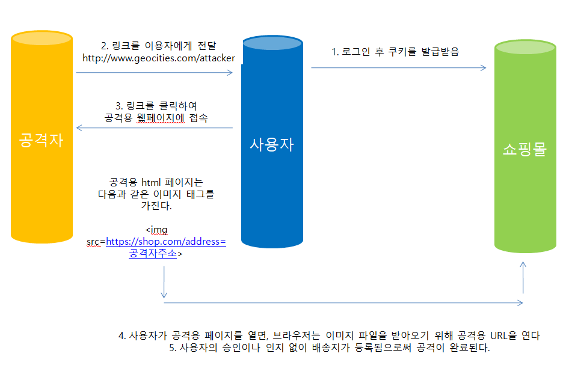

## CSRF (사이트 간 요청 위조 Cross-site request forgery)

CSRF란 사이트 간 요청 위조는 웹사이트 취약점 공격의 하나로, 사용자가 자신의 의지와는 무관하게 공격자가 의도한 행위를 특정 웹사이트에 요청하게 하는 공격을 말한다. 유명 경매 사이트인 옥션에서 발생한 개인정보 유출 사건에서 사용된 공격 방식 중 하나다

이러한 CSRF를 방지하기 위해서 Spring Security에서는 API를 제공하고 있다.

## CSRF FILTER

* 모든 요청에 랜덤하게 생성된 토큰을 HTTP 파라미터로 요구
* 요청 시 전달되는 토큰 값과 서버에 저장된 실제 값을 비교한 후 만약 일치 하지 않으면 요청은 실패한다.

* Client

  * <input type="hidden" name="${_csrf.paramterName}"value="${_csrf.token}"/>

  * HTTP METHOD : PATCH, POST, PUT, DELETE

  

* Spring Security
  * http.csrf() : 기본 활성화 되어있음
  * http.csrf().disabled(): 비활성화

