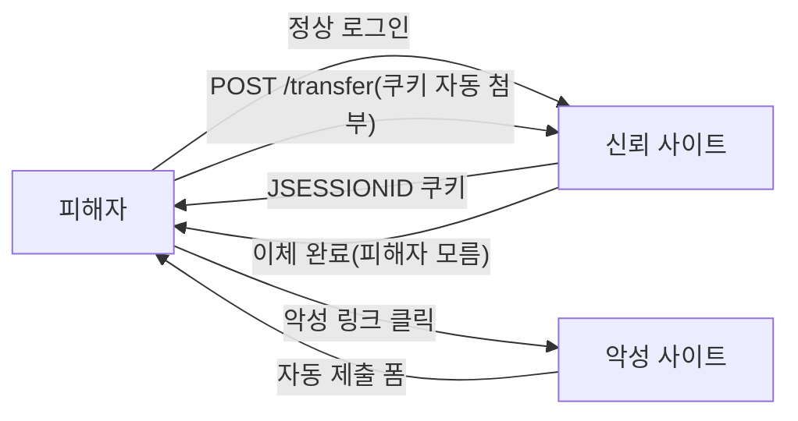
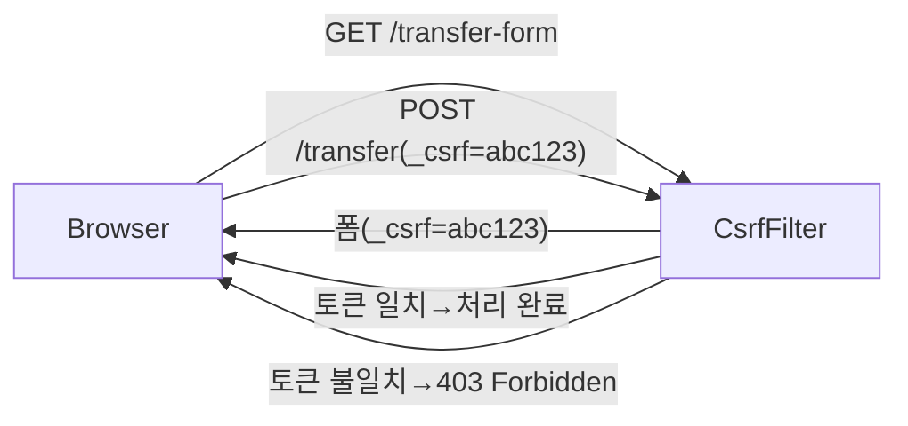
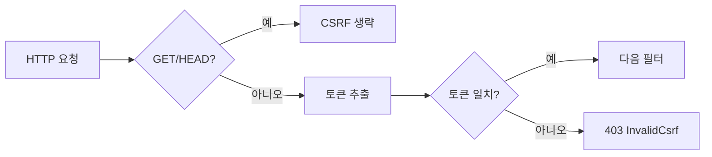

> 한 줄 요약: CSRF는 사용자가 의도하지 않은 요청을 악성 사이트가 대신 실행시키는 공격이며, Spring Security는 모든 상태 변경 요청에 CSRF 토큰 검증을 요구하여 이를 방어한다.

## CSRF 공격이란

CSRF(Cross-Site Request Forgery, 사이트 간 요청 위조)는 사용자가 신뢰하는 사이트에 인증된 상태에서, 악의적인 사이트가 사용자 모르게 해당 신뢰 사이트에 요청을 보내게 만드는 공격입니다.

택배 서비스에 비유해 보겠습니다. 당신이 택배 회사(신뢰 사이트)에 로그인한 상태에서 악성 이메일의 링크를 클릭합니다. 그 링크는 당신의 브라우저를 통해 택배 회사에 "배송 주소를 공격자 주소로 변경해 달라"는 요청을 자동으로 보냅니다. 택배 회사는 당신의 인증 쿠키가 있으므로 정상 요청으로 처리합니다.

실제로 국내 유명 경매 사이트(옥션)의 개인정보 유출 사건에서도 이 공격 방식이 사용된 바 있습니다.

## CSRF 공격 흐름



악성 사이트가 피해자의 브라우저에 심어두는 자동 제출 폼의 예시입니다.

```html
<!-- 악성 사이트에 숨겨진 폼 -->
<form id="csrf-form" action="https://bank.com/transfer" method="POST">
    <input type="hidden" name="amount" value="1000000">
    <input type="hidden" name="to" value="attacker-account">
</form>
<script>
    // 페이지 로드 시 자동 제출
    document.getElementById('csrf-form').submit();
</script>
```

브라우저는 `bank.com`의 쿠키를 자동으로 첨부하여 요청을 전송하므로, 서버는 인증된 사용자의 정상 요청으로 처리합니다.

## CSRF 방어 원리: Synchronizer Token Pattern

CSRF 방어의 핵심은 "공격자가 알 수 없는 값"을 요청에 포함시키는 것입니다.



악성 사이트는 같은 출처(Same-Origin) 정책으로 인해 신뢰 사이트의 CSRF 토큰을 읽을 수 없습니다. 따라서 유효한 CSRF 토큰을 포함한 요청을 만들 수 없습니다.

## Spring Security의 CSRF 설정

Spring Security는 기본적으로 CSRF 보호가 활성화되어 있습니다.

```java
@Override
protected void configure(HttpSecurity http) throws Exception {
    // CSRF 보호 기본 활성화 (별도 설정 불필요)
    http.csrf();  // 이미 활성화됨

    // CSRF 비활성화 (REST API에서 사용)
    http.csrf().disable();

    // 특정 URL만 CSRF 제외
    http.csrf()
        .ignoringAntMatchers("/api/**")  // API 경로는 CSRF 제외
        .ignoringAntMatchers("/webhook/**");  // 웹훅 경로도 제외
}
```

## 폼에서 CSRF 토큰 사용

### Thymeleaf (자동 처리)

```html
<!-- Thymeleaf는 Spring Security와 통합 시 CSRF 토큰을 자동으로 추가 -->
<form th:action="@{/transfer}" method="post">
    <!-- Thymeleaf가 자동으로 아래 hidden 필드를 추가 -->
    <!-- <input type="hidden" name="_csrf" value="생성된토큰값"> -->
    <input type="number" name="amount" placeholder="금액">
    <button type="submit">송금</button>
</form>
```

### JSP

```jsp
<!-- Spring Security 태그 라이브러리 사용 -->
<form action="/transfer" method="post">
    <input type="hidden" name="${_csrf.parameterName}" value="${_csrf.token}"/>
    <input type="number" name="amount">
    <button type="submit">송금</button>
</form>
```

### JavaScript (AJAX)

```javascript
// 메타 태그에서 CSRF 토큰 읽기
const csrfToken = document.querySelector('meta[name="_csrf"]').getAttribute('content');
const csrfHeader = document.querySelector('meta[name="_csrf_header"]').getAttribute('content');

// Fetch API 요청에 CSRF 헤더 추가
fetch('/api/transfer', {
    method: 'POST',
    headers: {
        'Content-Type': 'application/json',
        [csrfHeader]: csrfToken  // X-CSRF-TOKEN: 토큰값
    },
    body: JSON.stringify({ amount: 1000000, to: 'recipient' })
});
```

```html
<!-- HTML head에 CSRF 정보 저장 -->
<meta name="_csrf" th:content="${_csrf.token}"/>
<meta name="_csrf_header" th:content="${_csrf.headerName}"/>
```

## REST API에서 CSRF 비활성화하는 이유

REST API는 일반적으로 세션 쿠키 대신 `Authorization` 헤더의 JWT 토큰으로 인증합니다. CSRF 공격이 가능한 이유는 브라우저가 쿠키를 자동으로 첨부하기 때문입니다. `Authorization` 헤더는 브라우저가 자동으로 첨부하지 않으므로, JWT 기반 API는 CSRF 공격에 취약하지 않습니다.

```java
// JWT 기반 REST API 설정
http
    .csrf().disable()  // JWT 사용 시 CSRF 불필요
    .sessionManagement()
        .sessionCreationPolicy(SessionCreationPolicy.STATELESS)
    .and()
    .addFilterBefore(jwtFilter, UsernamePasswordAuthenticationFilter.class);
```

## CsrfFilter의 동작

`CsrfFilter`는 Spring Security 필터 체인의 초반에 위치합니다.



CSRF 검증 대상은 **상태를 변경하는 HTTP 메서드**(`POST`, `PUT`, `DELETE`, `PATCH`)입니다. `GET`, `HEAD`, `TRACE`, `OPTIONS`는 상태를 변경하지 않으므로 검증하지 않습니다.

## 왜 이게 중요한가?

CSRF는 OWASP(Open Web Application Security Project) 상위 10대 보안 취약점에 포함된 실제 위협입니다. Spring Security가 기본으로 CSRF 보호를 활성화하는 이유는 그만큼 흔하고 위험한 공격이기 때문입니다.

특히 금융, 전자상거래, 개인정보 변경 등 민감한 작업을 처리하는 웹 애플리케이션에서는 CSRF 보호가 필수입니다. REST API에서 무분별하게 `csrf().disable()`을 적용하는 것은 필요한 경우에만 해야 하며, 세션 쿠키 기반 인증을 사용하는 엔드포인트에서는 절대로 비활성화하면 안 됩니다.

## 보안 위협 시나리오

**SameSite 쿠키 속성과 CSRF**: 최신 브라우저는 `SameSite=Strict` 또는 `SameSite=Lax` 쿠키 속성을 통해 CSRF를 어느 정도 방어합니다. 그러나 모든 브라우저가 지원하지 않으므로 CSRF 토큰 방식을 함께 사용하는 것이 안전합니다.

**Double Submit Cookie 패턴**: SPA(Single Page Application)에서 세션을 사용할 수 없는 경우, CSRF 토큰을 쿠키와 요청 헤더에 동시에 넣어 비교하는 방식을 사용할 수 있습니다.

## 핵심 포인트 정리

- CSRF는 인증된 사용자의 브라우저를 통해 의도하지 않은 요청을 실행시키는 공격이다.
- Spring Security는 기본적으로 CSRF 보호가 활성화되어 있다.
- `POST`, `PUT`, `DELETE`, `PATCH` 요청에 대해 CSRF 토큰 검증을 수행한다.
- Thymeleaf는 Spring Security와 통합 시 폼에 CSRF 토큰을 자동으로 추가한다.
- AJAX 요청은 `X-CSRF-TOKEN` 헤더를 통해 토큰을 전달해야 한다.
- JWT + STATELESS 기반 REST API에서는 `csrf().disable()`을 사용해도 안전하다.
- 세션 쿠키 기반 인증 엔드포인트에서는 절대로 CSRF를 비활성화하지 말 것.
