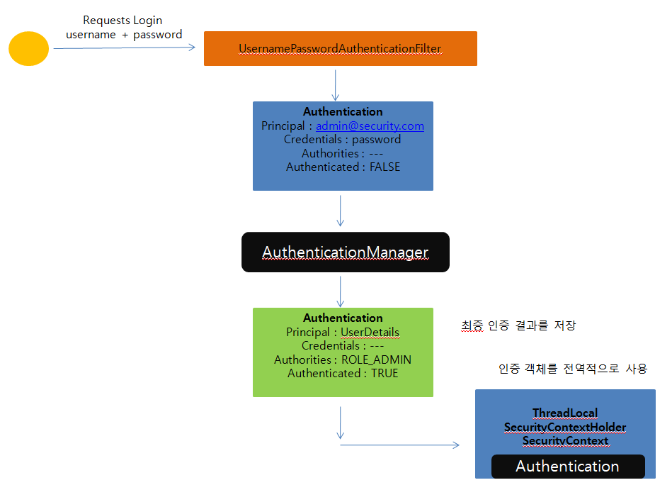

## Authentication

* 사용자의 인증 정보를 저장하는 토큰개념

* 인증 시 Id와 Password를 담고 인증 검증을 위해 전달되어 사용된다.

* 인증 후 최종 인증 결과 (user 객체, 권한정보)를 담고 SecurityContext에 저장되어 전역적으로 참조가 가능하다.

* 구조

  * principal : 사용자 아이디 혹은 User 객체 저장
  * credentials : 사용자 비밀번호
  * authorities : 인증된 사용자의 권한 목록
  * details : 인증 부가 정보
  * Authenticated : 인증 여부

  

동작 과정은 아래와 같다.

