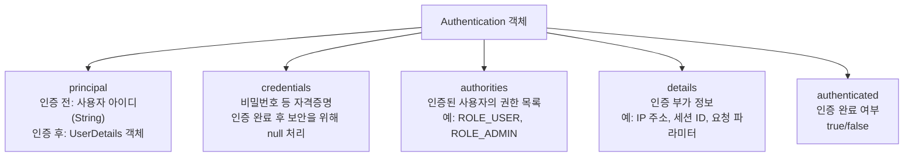
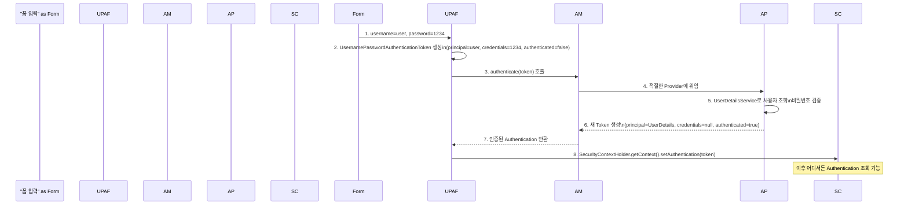
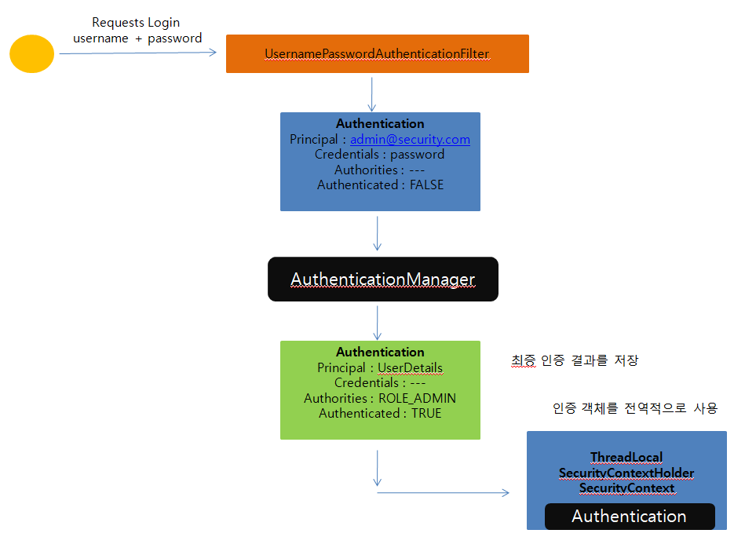

> 한 줄 요약: Authentication은 Spring Security에서 인증 정보를 담는 핵심 객체로, 인증 전에는 자격증명을 전달하고 인증 후에는 사용자 정보와 권한을 보관하는 토큰 역할을 한다.

## 실생활 비유로 이해하기

여권(Passport)을 생각해 보겠습니다. 출입국 심사를 받기 전 여권은 "이 사람이 누구인지 확인해 달라"는 요청서입니다. 심사 완료 후 입국 도장이 찍힌 여권은 "이 사람은 합법적으로 입국했다"는 공식 증명서가 됩니다.

`Authentication` 객체가 바로 이 여권입니다. 인증 전에는 자격증명(아이디/비밀번호)을 담아 전달되고, 인증 후에는 검증된 사용자 정보와 권한을 담아 전역적으로 참조됩니다.

## Authentication 인터페이스 구조

```java
public interface Authentication extends Principal, Serializable {

    // 1. 인증된 사용자의 권한 목록
    Collection<? extends GrantedAuthority> getAuthorities();

    // 2. 인증 자격증명 (비밀번호 등, 인증 후 보안을 위해 null로 지워짐)
    Object getCredentials();

    // 3. 인증 부가 정보 (IP 주소, 세션 ID 등)
    Object getDetails();

    // 4. 사용자 식별자 (인증 전: 아이디 문자열, 인증 후: UserDetails 객체)
    Object getPrincipal();

    // 5. 인증 완료 여부
    boolean isAuthenticated();

    // 인증 상태 설정
    void setAuthenticated(boolean isAuthenticated) throws IllegalArgumentException;
}
```

## Authentication의 5가지 구성 요소


```mermaid
flowchart TD
    A["Authentication 객체"] --> B["principal\n인증 전: 사용자 아이디(String)\n인증 후: UserDetails 객체"]
    A --> C["credentials\n비밀번호 등 자격증명\n인증 완료 후 보안을 위해 null 처리"]
    A --> D["authorities\n인증된 사용자의 권한 목록\n예: ROLE_USER, ROLE_ADMIN"]
    A --> E["details\n인증 부가 정보\n예: IP 주소, 세션 ID, 요청 파라미터"]
    A --> F["authenticated\n인증 완료 여부\ntrue/false"]
```

### principal (주체)

인증 전에는 사용자가 입력한 **아이디(String)**를 담습니다. 인증이 완료되면 `UserDetails` 인터페이스를 구현한 **사용자 객체**로 교체됩니다.

```java
// 인증 전 (UsernamePasswordAuthenticationFilter에서 생성)
Object principal = "user@example.com";  // 입력한 아이디

// 인증 후 (AuthenticationProvider에서 검증 완료 후)
Object principal = userDetails;  // UserDetails 구현 객체
// userDetails.getUsername() = "user@example.com"
// userDetails.getPassword() = "$2a$10$..."  (암호화된 비밀번호)
// userDetails.getAuthorities() = [ROLE_USER]
```

### credentials (자격증명)

비밀번호 등 인증에 사용되는 자격증명입니다. 인증이 완료된 후에는 보안을 위해 `null`로 설정됩니다. 인증 완료 후에는 비밀번호가 메모리에 남아 있을 필요가 없기 때문입니다.

```java
// AuthenticationProvider 인증 성공 후
UsernamePasswordAuthenticationToken authenticated =
    new UsernamePasswordAuthenticationToken(
        userDetails,    // principal: UserDetails
        null,           // credentials: null (보안을 위해 제거)
        userDetails.getAuthorities()  // authorities: 권한 목록
    );
```

### authorities (권한 목록)

인증된 사용자가 보유한 권한들의 컬렉션입니다. `GrantedAuthority` 인터페이스 구현체 목록으로, 일반적으로 `SimpleGrantedAuthority`를 사용합니다.

```java
List<GrantedAuthority> authorities = List.of(
    new SimpleGrantedAuthority("ROLE_USER"),
    new SimpleGrantedAuthority("ROLE_MANAGER"),
    new SimpleGrantedAuthority("READ_ARTICLE"),
    new SimpleGrantedAuthority("WRITE_ARTICLE")
);
```

### details (부가 정보)

인증 과정에서 추가적으로 필요한 정보를 담습니다. 기본적으로 `WebAuthenticationDetails`가 사용되며, IP 주소와 세션 ID를 포함합니다.

```java
// WebAuthenticationDetails 내용
WebAuthenticationDetails details = (WebAuthenticationDetails) authentication.getDetails();
String remoteAddress = details.getRemoteAddress();  // 클라이언트 IP
String sessionId = details.getSessionId();          // 세션 ID
```

## Authentication 인증 전/후 상태 변화


```mermaid
sequenceDiagram
    participant "폼 입력" as Form
    participant "UsernamePasswordAuthenticationFilter" as UPAF
    participant "AuthenticationManager" as AM
    participant "AuthenticationProvider" as AP
    participant "SecurityContext" as SC

    Form->>UPAF: 1. username=user, password=1234
    UPAF->>UPAF: 2. UsernamePasswordAuthenticationToken 생성\n(principal=user, credentials=1234, authenticated=false)
    UPAF->>AM: 3. authenticate(token) 호출
    AM->>AP: 4. 적절한 Provider에 위임
    AP->>AP: 5. UserDetailsService로 사용자 조회\n비밀번호 검증
    AP-->>AM: 6. 새 Token 생성\n(principal=UserDetails, credentials=null, authenticated=true)
    AM-->>UPAF: 7. 인증된 Authentication 반환
    UPAF->>SC: 8. SecurityContextHolder.getContext().setAuthentication(token)
    Note over SC: 이후 어디서든 Authentication 조회 가능
```

## Authentication 구현체 종류

Spring Security는 인증 방식에 따라 다양한 `Authentication` 구현체를 제공합니다.

| 구현체 | 사용 시점 |
|--------|----------|
| `UsernamePasswordAuthenticationToken` | 폼 로그인, 일반 아이디/비밀번호 인증 |
| `RememberMeAuthenticationToken` | Remember Me 자동 로그인 |
| `AnonymousAuthenticationToken` | 익명 사용자 |
| `OAuth2AuthenticationToken` | OAuth2 소셜 로그인 |
| `JwtAuthenticationToken` | JWT 토큰 인증 |

## 코드에서 Authentication 사용하기

### SecurityContextHolder에서 직접 조회

```java
// 어디서든 현재 인증 정보 조회 가능
Authentication authentication = SecurityContextHolder.getContext().getAuthentication();

// 사용자명 조회
String username = authentication.getName();

// UserDetails로 캐스팅하여 상세 정보 조회
if (authentication.getPrincipal() instanceof UserDetails) {
    UserDetails userDetails = (UserDetails) authentication.getPrincipal();
    String email = userDetails.getUsername();
}

// 권한 확인
boolean isAdmin = authentication.getAuthorities().stream()
    .anyMatch(auth -> auth.getAuthority().equals("ROLE_ADMIN"));
```

### 컨트롤러 파라미터로 주입

```java
@RestController
public class UserController {

    // Spring MVC가 자동으로 Authentication 주입
    @GetMapping("/mypage")
    public ResponseEntity<UserDto> mypage(Authentication authentication) {
        String username = authentication.getName();
        UserDetails userDetails = (UserDetails) authentication.getPrincipal();
        return ResponseEntity.ok(userService.findByUsername(username));
    }

    // @AuthenticationPrincipal로 UserDetails 직접 주입
    @GetMapping("/profile")
    public ResponseEntity<ProfileDto> profile(
            @AuthenticationPrincipal CustomUserDetails userDetails) {
        return ResponseEntity.ok(userService.getProfile(userDetails.getUserId()));
    }
}
```

`@AuthenticationPrincipal`을 사용하면 `SecurityContextHolder`를 거치지 않고 직접 `principal` 객체를 주입받을 수 있어 코드가 더 간결해집니다.

## 동작 과정 다이어그램



## 커스텀 UserDetails 구현

실무에서는 `UserDetails`를 확장하여 추가 정보를 담는 경우가 많습니다.

```java
@Getter
public class CustomUserDetails implements UserDetails {

    private final Long userId;          // 사용자 DB ID
    private final String username;      // 이메일 또는 아이디
    private final String password;
    private final String nickname;      // 추가 정보
    private final List<GrantedAuthority> authorities;

    public CustomUserDetails(User user) {
        this.userId = user.getId();
        this.username = user.getEmail();
        this.password = user.getPassword();
        this.nickname = user.getNickname();
        this.authorities = user.getRoles().stream()
            .map(role -> new SimpleGrantedAuthority("ROLE_" + role.getName()))
            .collect(Collectors.toList());
    }

    // UserDetails 필수 구현 메서드들
    @Override
    public boolean isAccountNonExpired() { return true; }

    @Override
    public boolean isAccountNonLocked() { return true; }

    @Override
    public boolean isCredentialsNonExpired() { return true; }

    @Override
    public boolean isEnabled() { return true; }
}
```

```java
// 컨트롤러에서 커스텀 UserDetails 사용
@GetMapping("/dashboard")
public String dashboard(@AuthenticationPrincipal CustomUserDetails userDetails) {
    Long userId = userDetails.getUserId();       // DB ID 직접 사용
    String nickname = userDetails.getNickname(); // 추가 정보 접근
    return "dashboard";
}
```

## 왜 이게 중요한가?

`Authentication` 객체는 Spring Security 전체 아키텍처의 중심입니다. 모든 인증 과정에서 이 객체를 통해 사용자 정보가 전달되고 저장됩니다. `Authentication`의 구조를 이해해야 커스텀 인증 필터 작성, JWT 인증 구현, OAuth2 통합 등 고급 기능을 올바르게 구현할 수 있습니다.

특히 `principal`이 인증 전후로 다른 타입을 가진다는 점, `credentials`가 인증 후 null이 된다는 점, `ThreadLocal`을 통해 전역 접근이 가능하다는 점은 실무에서 자주 혼동을 일으키는 부분입니다.

## 보안 위협 시나리오

**권한 정보 위조**: `Authentication` 객체는 직렬화되어 세션에 저장됩니다. 세션 데이터를 직접 조작하여 권한을 변경하려는 시도가 있을 수 있습니다. Spring Security는 세션 ID 검증과 `SecurityContextRepository`를 통해 이를 방어합니다.

**credentials 노출**: `getCredentials()`로 비밀번호에 접근할 수 있는 시점이 있습니다. 인증 직후 `credentials`를 null로 설정하는 것이 중요하며, 로그나 에러 메시지에 `Authentication` 객체를 그대로 출력하지 않도록 주의해야 합니다.

## 핵심 포인트 정리

- `Authentication`은 인증 전 자격증명 전달, 인증 후 사용자 정보 보관의 두 역할을 한다.
- `principal`: 인증 전 String(아이디), 인증 후 UserDetails 객체.
- `credentials`: 비밀번호 등 자격증명, 인증 완료 후 보안을 위해 null로 처리.
- `authorities`: 인증된 사용자의 권한 목록 (`GrantedAuthority` 컬렉션).
- `details`: IP, 세션 ID 등 부가 정보 (`WebAuthenticationDetails`).
- `SecurityContextHolder.getContext().getAuthentication()`으로 어디서든 현재 인증 정보 조회.
- `@AuthenticationPrincipal`로 컨트롤러 파라미터에 직접 `principal` 주입 가능.
- 커스텀 `UserDetails`로 추가 정보(DB ID, 프로필 등)를 `principal`에 담아 활용할 것.
