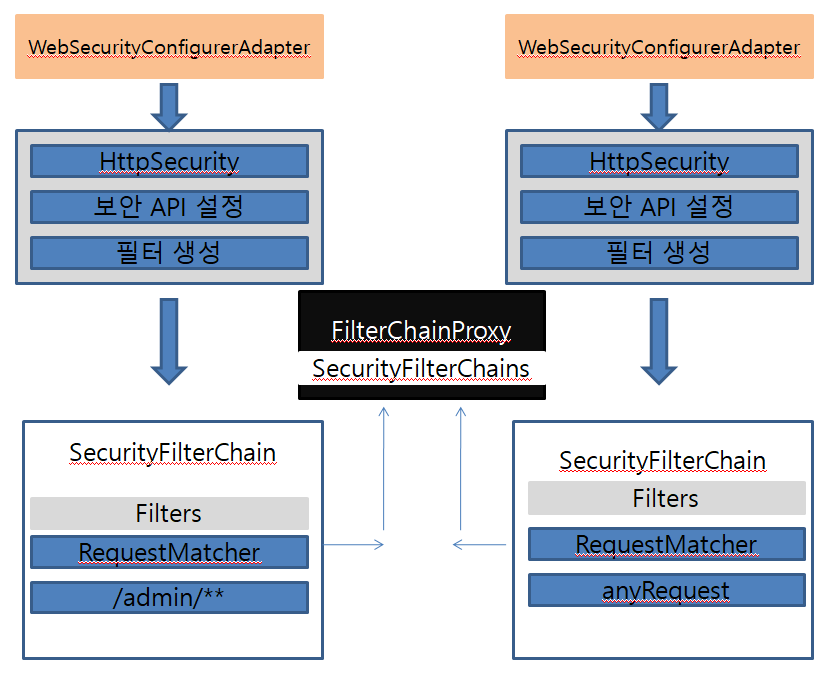
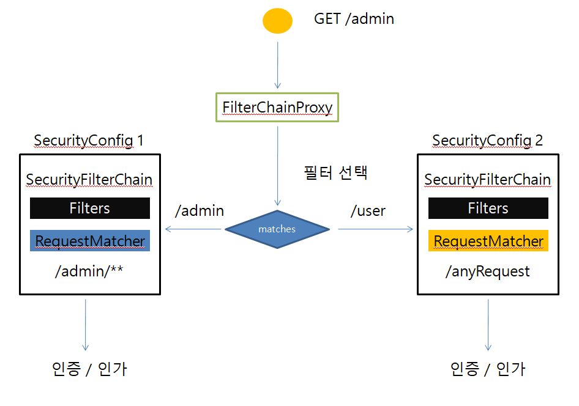
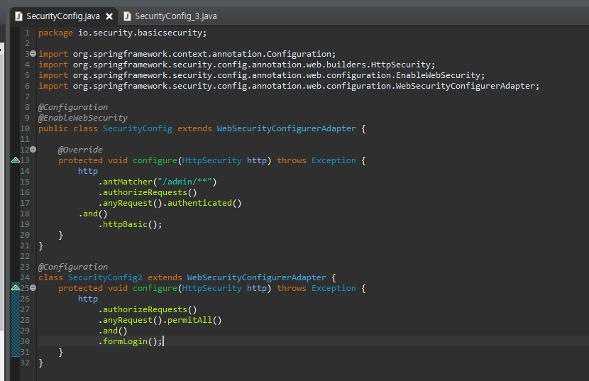
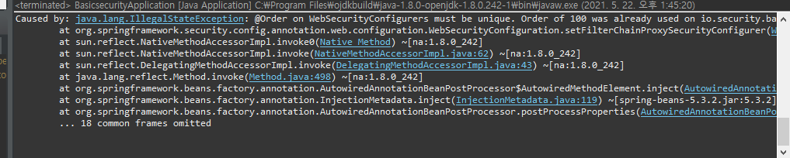
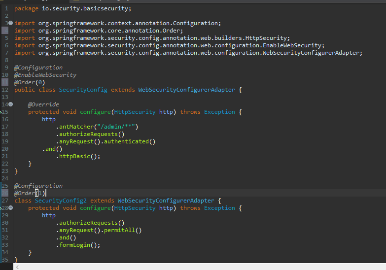
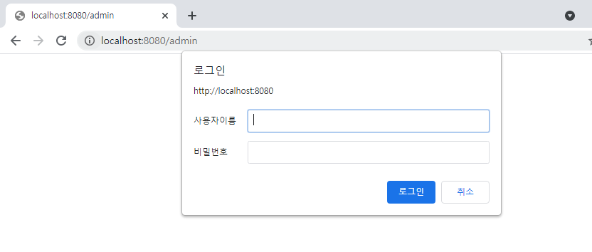
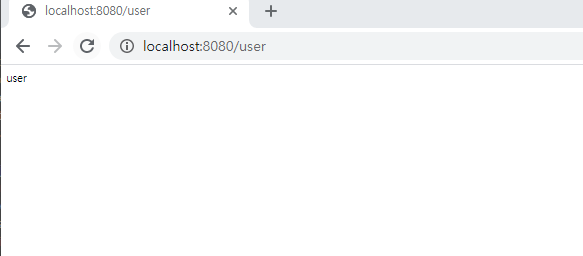

## 필터 초기화와 다중 설정 클래스

* 설정 클래스 별로 보안 기능이 각각 작동
* 설정 클래스 별로 ReqeustMatcher 설정
  * http.antMatcher("/admin/**")
* 설정 클래스 별로 필터가 생성
* FilterChainProxy가 각 필터들 가지고 있음
* 요청에 따라 RequestMatcher와 매칭되는 필터가 작동하도록 함

실제 소스에 적용을 해보자.

위와 같이 설정후에 서버를 기동하면,  아래와 같은 오류가 발생한다.

이 문제를 해결하기 위해서는 설정 클래스에 순서를 부여하여야한다.

아래와 같이 설정한다.

브라우저창에 localhost:8080/admin을 입력하게 되면 아래와같이 httpBasic 로그인 창이 뜬다.

위와는 달리 /user경로를 입력하게되면 아래와 같이 된다.

이처럼 Spring Security의 다중 설정환경에 대해 알아보았다.