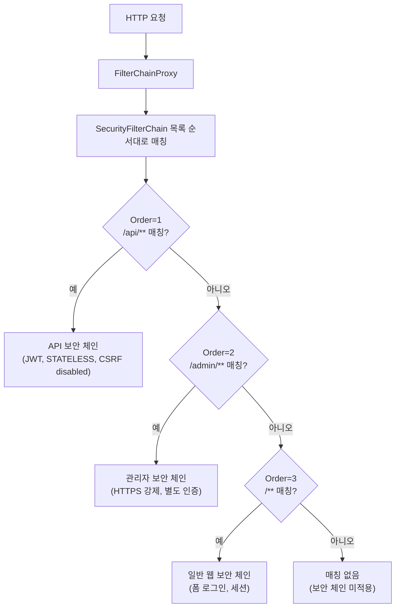
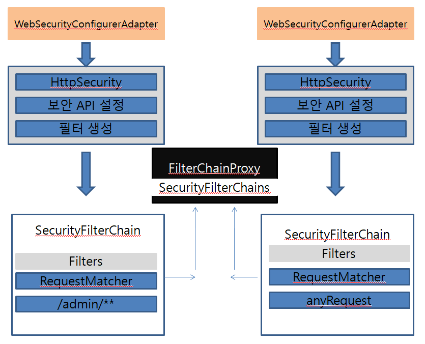
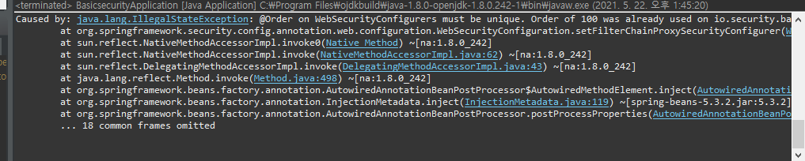
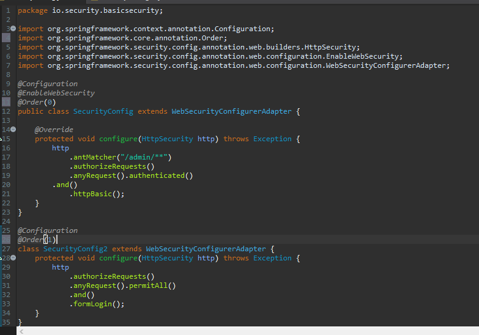
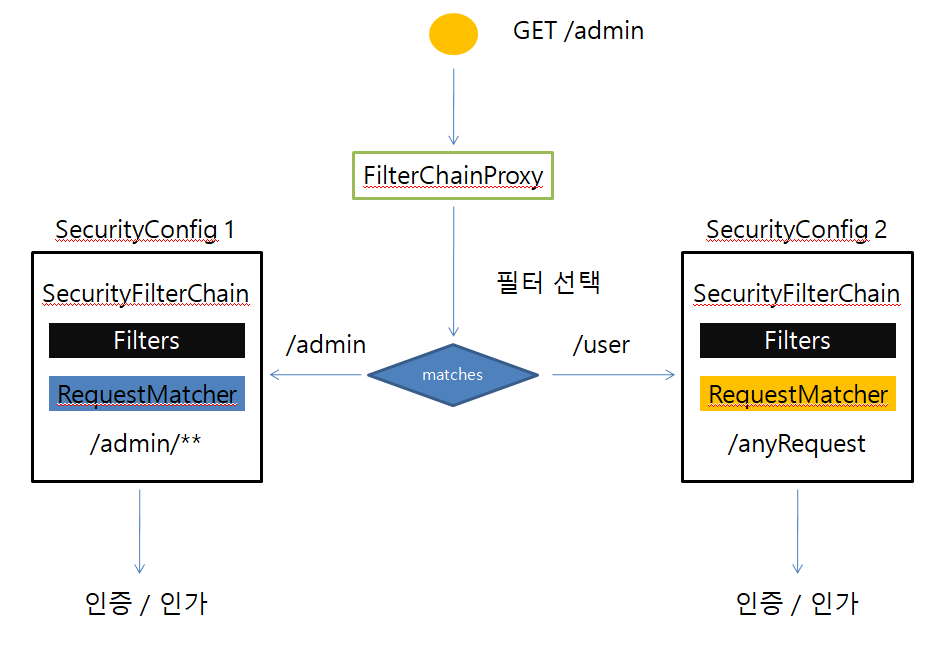
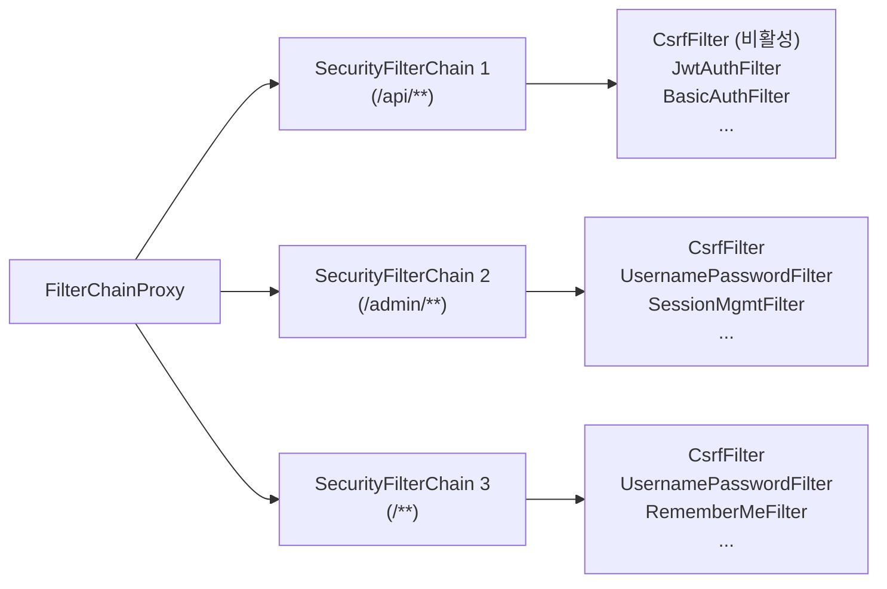
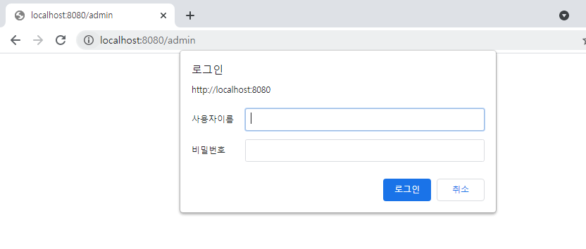
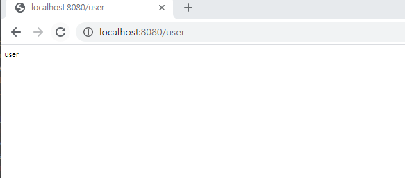

> 한 줄 요약: 여러 WebSecurityConfigurerAdapter를 @Order로 우선순위를 지정하면, URL 패턴별로 독립적인 보안 필터 체인을 구성하여 API와 웹 페이지에 서로 다른 보안 정책을 적용할 수 있다.

## 실생활 비유로 이해하기

대형 복합 건물을 생각해 보겠습니다. 1층 상가는 누구나 자유롭게 출입하고, 2~10층 사무실은 직원 카드로 입장하며, 11층 이상 임원 공간은 임원 카드만 허용됩니다. 각 구역마다 다른 출입 통제 시스템이 독립적으로 작동합니다.

Spring Security의 다중 보안 설정이 바로 이 구조입니다. URL 패턴에 따라 다른 보안 정책을 가진 독립적인 필터 체인이 각각 동작합니다.

## 다중 보안 설정이 필요한 이유

하나의 `WebSecurityConfigurerAdapter`만으로 모든 보안 요구사항을 처리하면 설정이 복잡해지고 유지보수가 어렵습니다. 대표적인 다중 설정 필요 사례입니다.

- **REST API vs 웹 페이지**: API는 JWT + STATELESS, 웹 페이지는 세션 + 폼 로그인
- **관리자 경로**: `/admin/**`는 HTTPS 강제 + 추가 인증 요구
- **공개 경로**: `/public/**`는 인증 없이 접근 허용


```mermaid
flowchart TD
    A["HTTP 요청"] --> B["FilterChainProxy"]
    B --> C["SecurityFilterChain 목록 순서대로 매칭"]
    C --> D{"Order=1\n/api/** 매칭?"}
    D -- "예" --> E["API 보안 체인\n(JWT, STATELESS, CSRF disabled)"]
    D -- "아니오" --> F{"Order=2\n/admin/** 매칭?"}
    F -- "예" --> G["관리자 보안 체인\n(HTTPS 강제, 별도 인증)"]
    F -- "아니오" --> H{"Order=3\n/** 매칭?"}
    H -- "예" --> I["일반 웹 보안 체인\n(폼 로그인, 세션)"]
    H -- "아니오" --> J["매칭 없음\n(보안 체인 미적용)"]
```

## 다중 설정 구현

각 설정 클래스는 `@Order`로 우선순위를 지정해야 합니다.

```java
// API 보안 설정 (우선순위 1)
@Configuration
@Order(1)
public class ApiSecurityConfig extends WebSecurityConfigurerAdapter {

    @Override
    protected void configure(HttpSecurity http) throws Exception {
        http
            .antMatcher("/api/**")  // 이 설정은 /api/** 요청에만 적용
            .authorizeRequests()
                .antMatchers("/api/public/**").permitAll()
                .anyRequest().authenticated()
            .and()
            .csrf().disable()
            .sessionManagement()
                .sessionCreationPolicy(SessionCreationPolicy.STATELESS)
            .and()
            .httpBasic();  // API는 HTTP Basic 인증 또는 JWT 사용
    }
}

// 일반 웹 보안 설정 (우선순위 2)
@Configuration
@Order(2)
public class WebSecurityConfig extends WebSecurityConfigurerAdapter {

    @Override
    protected void configure(HttpSecurity http) throws Exception {
        http
            .antMatcher("/**")  // 나머지 모든 요청 (Order=1이 처리 못한 것들)
            .authorizeRequests()
                .antMatchers("/", "/login", "/signup").permitAll()
                .anyRequest().authenticated()
            .and()
            .formLogin()
                .loginPage("/login")
                .defaultSuccessUrl("/home")
            .and()
            .logout()
                .logoutSuccessUrl("/login");
    }
}
```



## @Order 없이 실행하면 발생하는 오류

`@Order`를 지정하지 않으면 애플리케이션 시작 시 오류가 발생합니다.



```
Caused by: java.lang.IllegalStateException: @Order on WebSecurityConfigurerAdapters is not compatible
with having multiple WebSecurityConfigurerAdapters without an order.
```

여러 `WebSecurityConfigurerAdapter`가 있으면 반드시 각각 고유한 `@Order` 값을 지정해야 합니다.

```java
// 올바른 설정: 각 클래스마다 고유한 @Order
@Configuration
@Order(1)  // 숫자가 낮을수록 먼저 평가됨
public class ApiSecurityConfig extends WebSecurityConfigurerAdapter { ... }

@Configuration
@Order(2)
public class WebSecurityConfig extends WebSecurityConfigurerAdapter { ... }
```



## 필터 체인별 독립적인 필터 구성

각 설정 클래스는 **독립적인 필터 체인**을 생성합니다. 즉, 각 체인은 서로 다른 필터 목록을 가질 수 있습니다.




```mermaid
flowchart LR
    A["FilterChainProxy"] --> B["SecurityFilterChain 1\n(/api/**)"]
    A --> C["SecurityFilterChain 2\n(/admin/**)"]
    A --> D["SecurityFilterChain 3\n(/**)"]

    B --> E["CsrfFilter (비활성)\nJwtAuthFilter\nBasicAuthFilter\n..."]
    C --> F["CsrfFilter\nUsernamePasswordFilter\nSessionMgmtFilter\n..."]
    D --> G["CsrfFilter\nUsernamePasswordFilter\nRememberMeFilter\n..."]
```

API 체인은 CSRF 필터가 비활성화되고 JWT 필터가 추가됩니다. 웹 체인은 Remember Me 필터가 포함됩니다. 각 체인의 필터 구성이 완전히 독립적입니다.

## 실제 적용 확인

설정 후 `/admin` 경로로 접근하면 HTTP Basic 인증 다이얼로그가 나타납니다.



반면 `/user` 경로로 접근하면 폼 로그인 페이지로 리다이렉트됩니다.



같은 애플리케이션 내에서 URL 패턴에 따라 완전히 다른 인증 방식이 적용됩니다.

## antMatcher vs antMatchers 차이

다중 설정에서 혼동하기 쉬운 두 메서드의 차이입니다.

```java
// http.antMatcher(): 이 SecurityFilterChain 자체의 적용 범위를 제한
// "이 설정 전체가 /api/**에만 적용됨"
http.antMatcher("/api/**")
    .authorizeRequests()
        .anyRequest().authenticated();

// http.authorizeRequests().antMatchers(): 해당 URL 패턴에 대한 접근 규칙 정의
// "이 URL 패턴에는 이 접근 규칙을 적용"
http.authorizeRequests()
    .antMatchers("/api/public/**").permitAll()
    .antMatchers("/api/admin/**").hasRole("ADMIN")
    .anyRequest().authenticated();
```

`http.antMatcher()`를 설정하지 않으면 해당 SecurityFilterChain은 모든 URL에 적용됩니다. 다중 설정에서는 반드시 각 설정의 적용 범위를 `antMatcher()`로 명시해야 합니다.

## Spring Security 6 (Spring Boot 3) 에서의 변경

Spring Security 5.7부터 `WebSecurityConfigurerAdapter`가 deprecated되었고, Spring Security 6에서는 `SecurityFilterChain` 빈을 직접 등록하는 방식이 표준입니다.

```java
// Spring Security 6 방식
@Configuration
@EnableWebSecurity
public class SecurityConfig {

    // API 보안 설정 (Order=1)
    @Bean
    @Order(1)
    public SecurityFilterChain apiSecurityFilterChain(HttpSecurity http) throws Exception {
        return http
            .securityMatcher("/api/**")
            .authorizeHttpRequests(auth -> auth.anyRequest().authenticated())
            .csrf(csrf -> csrf.disable())
            .sessionManagement(session ->
                session.sessionCreationPolicy(SessionCreationPolicy.STATELESS))
            .build();
    }

    // 웹 보안 설정 (Order=2)
    @Bean
    @Order(2)
    public SecurityFilterChain webSecurityFilterChain(HttpSecurity http) throws Exception {
        return http
            .authorizeHttpRequests(auth -> auth
                .requestMatchers("/", "/login").permitAll()
                .anyRequest().authenticated())
            .formLogin(form -> form.loginPage("/login"))
            .build();
    }
}
```

## 왜 이게 중요한가?

현대 웹 애플리케이션은 REST API와 서버 사이드 렌더링 페이지를 함께 제공하는 경우가 많습니다. 두 가지 방식에 동일한 보안 설정을 적용하면 각각의 특성에 맞지 않는 불필요한 보안 처리가 발생합니다. 다중 보안 설정으로 각 경로의 특성에 맞는 최적화된 보안 구성을 적용할 수 있습니다.

## 보안 위협 시나리오

**매칭 순서 실수**: `@Order` 값을 잘못 설정하면 의도하지 않은 보안 설정이 적용될 수 있습니다. 예를 들어 `/**` 패턴이 `@Order(1)`이면 모든 요청을 먼저 가로채서 다른 설정들이 무효화됩니다.

**antMatcher 범위 누락**: `http.antMatcher()`를 설정하지 않은 SecurityFilterChain이 여러 개 있으면, 가장 높은 우선순위의 것만 적용됩니다. 반드시 각 설정의 적용 범위를 명시해야 합니다.

## 핵심 포인트 정리

- 여러 `WebSecurityConfigurerAdapter`를 사용할 때는 반드시 `@Order`로 우선순위를 지정해야 한다.
- `@Order` 숫자가 낮을수록 먼저 평가된다.
- `http.antMatcher()`: 이 SecurityFilterChain 전체의 URL 적용 범위를 제한.
- 각 SecurityFilterChain은 독립적인 필터 목록을 가진다.
- API 체인: `STATELESS` + CSRF 비활성 + JWT 필터 / 웹 체인: 세션 + CSRF + 폼 로그인.
- Spring Security 6에서는 `SecurityFilterChain` 빈 직접 등록 방식으로 전환됨.
- `/**` 패턴의 SecurityFilterChain을 가장 낮은 우선순위(`@Order` 값이 가장 큰 것)로 설정할 것.
