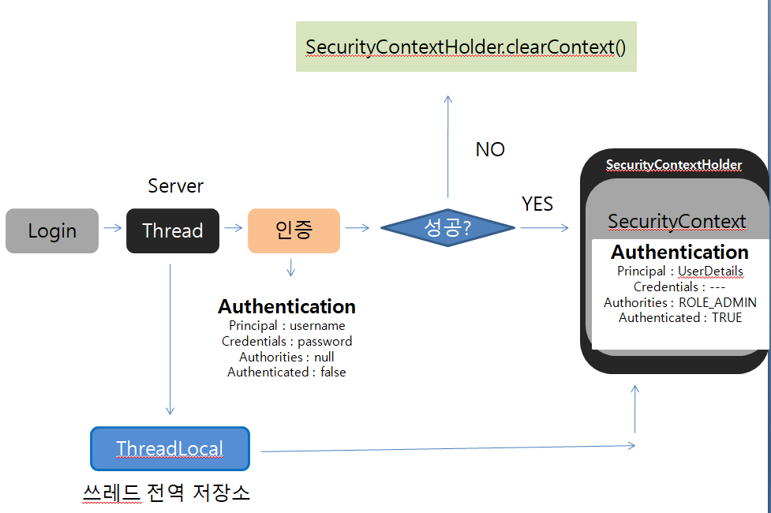

## SecurityContext

* Authentication 객체가 저장되는 보관소로 필요 시 언제든지 Authentication 객체를 꺼내어 쓸 수 있도록 제공되는 클래스
* ThreadLocal에 저장되어 아무 곳에서나 참조가 가능하도록 설계함
* 인증이 완료되면 HttpSession에 저장되어 어플리케이션 전반에 걸쳐 전역적인 참조가 가능하다.

## SecurityContextHolder

* SecurityContext 객체 저장 방식

  * MODE_THREADLOCAL : 쓰레드당 SecurityContext 객체를 할당, 기본 값

  * MODE_INHERITABLETHREADLOCAL : 메인 스레드와 자식 스레드에 관하여 동일한 SecurityContext를 유지
  * MODEL_GLOBAL : 응용 프로그램에서 단 하나의 SecurityContext를 저장한다.

* SecurityContextHolder.clearContext() : SecurityContext 기존 정보 초기화

**Authentication authentication = SecurityContextHolder.getContext().getAuthentication()**

**동작과정**

