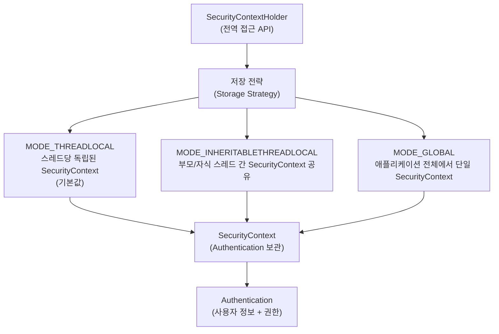
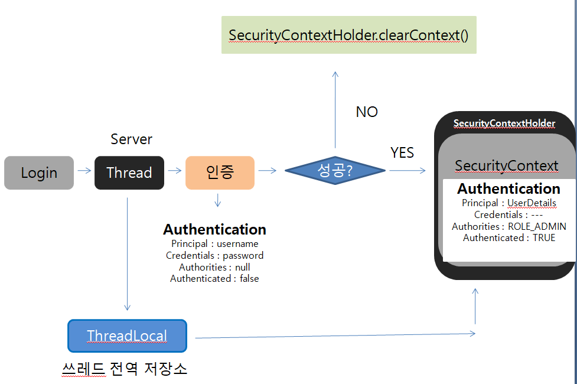
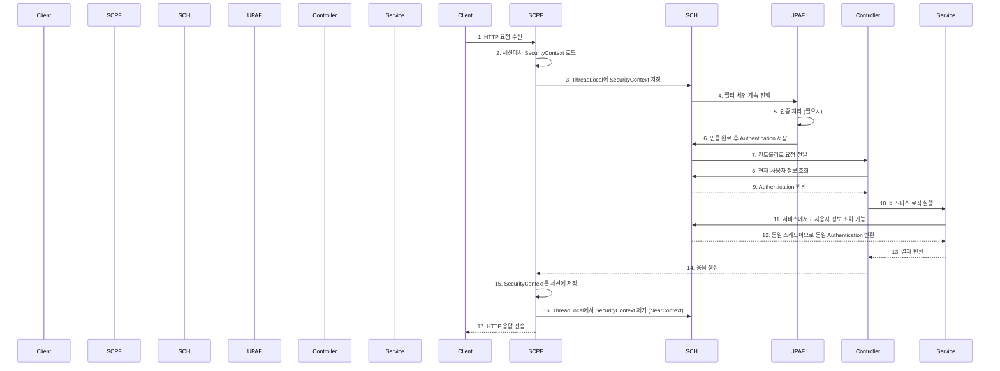

> 한 줄 요약: SecurityContext는 인증된 사용자 정보(Authentication)를 보관하는 저장소이며, SecurityContextHolder는 이 저장소에 접근하는 전역 API로 ThreadLocal을 통해 요청 처리 스레드 어디서나 현재 사용자 정보를 참조할 수 있게 한다.

## 실생활 비유로 이해하기

건물 내 모든 직원이 자신의 사원증을 주머니에 넣고 다니는 상황을 상상해 보겠습니다. 어느 부서를 방문하든, 어떤 업무를 처리하든 항상 자신의 사원증(인증 정보)이 함께합니다. 누군가 "이 사람이 누구냐?"고 물으면 언제든지 주머니에서 사원증을 꺼내 보여줄 수 있습니다.

`SecurityContextHolder`가 바로 이 "주머니"이고, `SecurityContext`는 사원증 지갑, `Authentication`은 사원증 자체입니다. 그리고 이 주머니는 요청을 처리하는 스레드에 묶여 있어(ThreadLocal), 같은 스레드 내에서는 어디서든 접근할 수 있습니다.

## SecurityContext와 SecurityContextHolder의 관계


```mermaid
flowchart TD
    A["SecurityContextHolder\n(전역 접근 API)"] --> B["저장 전략\n(Storage Strategy)"]
    B --> C["MODE_THREADLOCAL\n스레드당 독립된 SecurityContext\n(기본값)"]
    B --> D["MODE_INHERITABLETHREADLOCAL\n부모/자식 스레드 간 SecurityContext 공유"]
    B --> E["MODE_GLOBAL\n애플리케이션 전체에서 단일 SecurityContext"]
    C --> F["SecurityContext\n(Authentication 보관)"]
    D --> F
    E --> F
    F --> G["Authentication\n(사용자 정보 + 권한)"]
```

## SecurityContext

`SecurityContext`는 `Authentication` 객체를 보관하는 컨테이너입니다. 인터페이스가 단순합니다.

```java
public interface SecurityContext extends Serializable {
    Authentication getAuthentication();
    void setAuthentication(Authentication authentication);
}
```

인증이 완료된 후, `Authentication` 객체는 `SecurityContext`에 저장됩니다. 이후 같은 요청을 처리하는 스레드 어디서든 `SecurityContext`를 통해 인증 정보를 꺼낼 수 있습니다.

## SecurityContextHolder

`SecurityContextHolder`는 `SecurityContext`에 접근하는 정적(static) API를 제공합니다.

```java
// SecurityContext 조회
SecurityContext context = SecurityContextHolder.getContext();

// Authentication 조회
Authentication authentication = SecurityContextHolder.getContext().getAuthentication();

// SecurityContext 초기화
SecurityContextHolder.clearContext();

// 저장 전략 변경 (애플리케이션 시작 시 설정)
SecurityContextHolder.setStrategyName(SecurityContextHolder.MODE_INHERITABLETHREADLOCAL);
```

## 저장 전략 상세 설명

### MODE_THREADLOCAL (기본값)

각 스레드가 독립된 `SecurityContext`를 가집니다. 웹 애플리케이션에서 가장 적합한 방식입니다. 각 HTTP 요청은 별도의 스레드에서 처리되므로, 요청 간에 인증 정보가 섞이지 않습니다.

```java
// 스레드 A (사용자 김철수의 요청 처리)
SecurityContext contextA = SecurityContextHolder.getContext();
// contextA.getAuthentication().getName() == "김철수"

// 스레드 B (사용자 이영희의 요청 처리, 동시에 실행 중)
SecurityContext contextB = SecurityContextHolder.getContext();
// contextB.getAuthentication().getName() == "이영희"
// ThreadLocal이므로 스레드 A와 B의 context가 완전히 분리됨
```

### MODE_INHERITABLETHREADLOCAL

메인 스레드에서 생성한 자식 스레드에 동일한 `SecurityContext`를 상속합니다. `@Async`를 사용하는 비동기 메서드에서 인증 정보를 유지해야 할 때 사용합니다.

```java
@Configuration
@EnableAsync
public class AsyncConfig implements AsyncConfigurer {

    @Override
    public Executor getAsyncExecutor() {
        // 부모 스레드의 SecurityContext를 자식 스레드로 전파
        return new DelegatingSecurityContextExecutorService(
            Executors.newFixedThreadPool(10)
        );
    }
}

@Service
public class EmailService {

    @Async
    public void sendWelcomeEmail() {
        // 비동기 스레드에서도 현재 사용자 정보 접근 가능
        Authentication auth = SecurityContextHolder.getContext().getAuthentication();
        String username = auth.getName();
        // 이메일 발송 로직...
    }
}
```

### MODE_GLOBAL

애플리케이션 전체에서 단일 `SecurityContext`를 공유합니다. 웹 애플리케이션에서는 사용하지 않습니다. 스레드 안전성 문제가 있어 스탠드얼론 애플리케이션에서만 제한적으로 사용됩니다.

## 동작 과정




```mermaid
sequenceDiagram
    participant "클라이언트" as Client
    participant "SecurityContextPersistenceFilter" as SCPF
    participant "SecurityContextHolder" as SCH
    participant "UsernamePasswordAuthFilter" as UPAF
    participant "컨트롤러" as Controller
    participant "서비스" as Service

    Client->>SCPF: 1. HTTP 요청 수신
    SCPF->>SCPF: 2. 세션에서 SecurityContext 로드
    SCPF->>SCH: 3. ThreadLocal에 SecurityContext 저장
    SCH->>UPAF: 4. 필터 체인 계속 진행
    UPAF->>UPAF: 5. 인증 처리 (필요시)
    UPAF->>SCH: 6. 인증 완료 후 Authentication 저장
    SCH->>Controller: 7. 컨트롤러로 요청 전달
    Controller->>SCH: 8. 현재 사용자 정보 조회
    SCH-->>Controller: 9. Authentication 반환
    Controller->>Service: 10. 비즈니스 로직 실행
    Service->>SCH: 11. 서비스에서도 사용자 정보 조회 가능
    SCH-->>Service: 12. 동일 스레드이므로 동일 Authentication 반환
    Service-->>Controller: 13. 결과 반환
    Controller-->>SCPF: 14. 응답 생성
    SCPF->>SCPF: 15. SecurityContext를 세션에 저장
    SCPF->>SCH: 16. ThreadLocal에서 SecurityContext 제거 (clearContext)
    SCPF-->>Client: 17. HTTP 응답 전송
```

## 실무 활용 패턴

### 서비스 레이어에서 현재 사용자 조회

```java
@Service
public class ArticleService {

    public Article createArticle(ArticleDto dto) {
        // SecurityContextHolder로 현재 로그인한 사용자 조회
        Authentication auth = SecurityContextHolder.getContext().getAuthentication();
        String username = auth.getName();

        // 또는 UserDetails로 캐스팅
        CustomUserDetails userDetails = (CustomUserDetails) auth.getPrincipal();
        Long authorId = userDetails.getUserId();

        Article article = Article.builder()
            .title(dto.getTitle())
            .content(dto.getContent())
            .authorId(authorId)
            .build();

        return articleRepository.save(article);
    }
}
```

### 스프링 시큐리티 유틸 클래스 활용

```java
// 편의를 위한 유틸 클래스 작성
@Component
public class SecurityUtils {

    public static String getCurrentUsername() {
        Authentication auth = SecurityContextHolder.getContext().getAuthentication();
        if (auth == null || !auth.isAuthenticated()
                || auth instanceof AnonymousAuthenticationToken) {
            return null;
        }
        return auth.getName();
    }

    public static boolean isCurrentUser(String username) {
        String currentUser = getCurrentUsername();
        return currentUser != null && currentUser.equals(username);
    }

    public static boolean hasRole(String role) {
        Authentication auth = SecurityContextHolder.getContext().getAuthentication();
        if (auth == null) return false;
        return auth.getAuthorities().stream()
            .anyMatch(a -> a.getAuthority().equals("ROLE_" + role));
    }
}
```

## SecurityContextHolder.clearContext()

요청 처리가 완료된 후 반드시 `SecurityContext`를 초기화해야 합니다. `SecurityContextPersistenceFilter`가 응답 시 자동으로 `clearContext()`를 호출하므로 일반적으로 직접 호출할 필요가 없습니다. 단, 커스텀 필터나 비동기 처리에서 스레드를 재사용하는 경우 직접 호출이 필요합니다.

```java
// 스레드 풀에서 스레드를 재사용하는 경우 반드시 초기화
try {
    SecurityContextHolder.getContext().setAuthentication(authentication);
    doSomething();
} finally {
    SecurityContextHolder.clearContext();  // 다음 요청에 이전 인증 정보가 남지 않도록
}
```

## 왜 이게 중요한가?

`SecurityContextHolder`는 Spring Security의 전역 인증 정보 접근 포인트입니다. 컨트롤러, 서비스, 리포지토리 어디서든 현재 사용자 정보를 조회할 수 있습니다. 이 구조를 이해해야 비즈니스 로직에서 현재 사용자 기반의 데이터 필터링, 감사 로그 기록, 권한 검사 등을 올바르게 구현할 수 있습니다.

## 보안 위협 시나리오

**ThreadLocal 누수**: 스레드 풀 환경에서 `clearContext()`를 호출하지 않으면, 이전 요청의 인증 정보가 다음 요청에서 사용될 수 있습니다. 이는 다른 사용자의 권한으로 작업이 실행되는 심각한 보안 취약점입니다.

**비동기 컨텍스트 전파 실패**: `@Async` 메서드에서 `MODE_THREADLOCAL`을 사용하면 새 스레드가 `SecurityContext`를 갖지 않아 인증 정보 조회 시 null이 반환됩니다. `DelegatingSecurityContextExecutor`를 사용하거나 `MODE_INHERITABLETHREADLOCAL`로 전환해야 합니다.

## 핵심 포인트 정리

- `SecurityContext`: `Authentication` 객체를 보관하는 컨테이너.
- `SecurityContextHolder`: `SecurityContext`에 접근하는 전역 정적 API.
- `MODE_THREADLOCAL` (기본): 스레드당 독립된 `SecurityContext` (웹 애플리케이션에 적합).
- `MODE_INHERITABLETHREADLOCAL`: 자식 스레드에 `SecurityContext` 상속 (`@Async` 사용 시 필요).
- `SecurityContextHolder.clearContext()`: 스레드 재사용 환경에서 인증 정보 누수 방지.
- 컨트롤러는 `@AuthenticationPrincipal`, 서비스는 `SecurityContextHolder`로 인증 정보 접근.
- `SecurityContextPersistenceFilter`가 요청 시작/종료 시 자동으로 `SecurityContext`를 관리한다.
