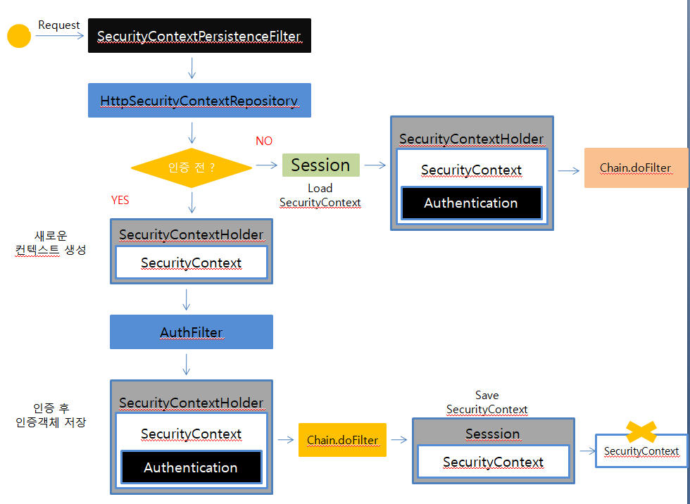

## SecurityContextPersistenceFilter

**SecurityContextPersistenceFilter는 SecurityContext 객체의 생성, 저장, 조회하는 역할을 한다.**

* 익명 사용자
  * 새로운 SecurityContext 객체를 생성하여 SecurityContextHolder에 저장
  * AnonymousAuthenticationFilter에서 AnonymousAuthenticationToken 객체를 SecurityContext에 저장
* 인증 시
  * 새로운 SecurityContext 객체를 생성하여 SecurityContextHolder에 저장
  * UsernamePasswordAuthenticationFilter에서 인증 성공 후 SecurityContext에 UsernamePasswordAuthentication 객체를 SecurityContext에 저장
  * 인증이 최종 완료되면 Session에 SecurityContext를 저장

* 인증 후
  * Session에서 SecurityContext 꺼내어 SecurityContextHolder에서 저장
  * SecurityContext안에 Authentication 객체가 존재하면 계속 인증을 유지한다.
* 최종 응답시 공통
  * SecurityContextHolder.clearContext()

동작과정

