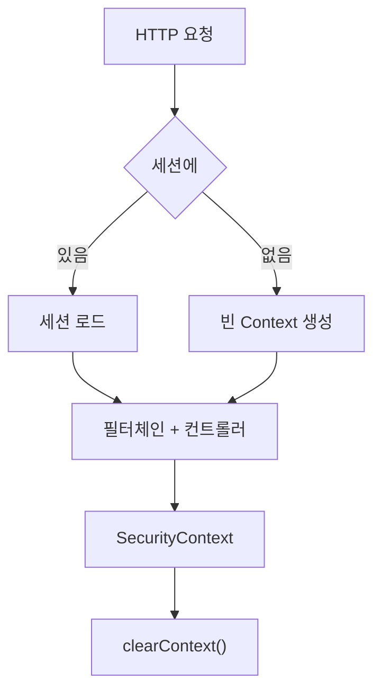
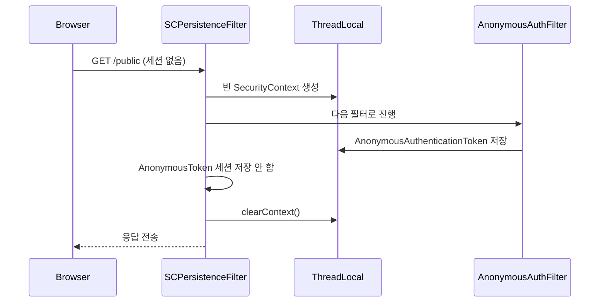
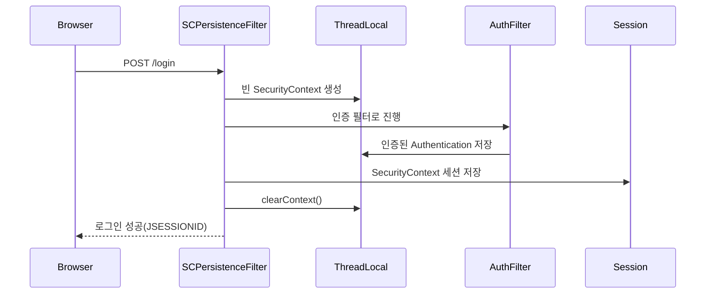
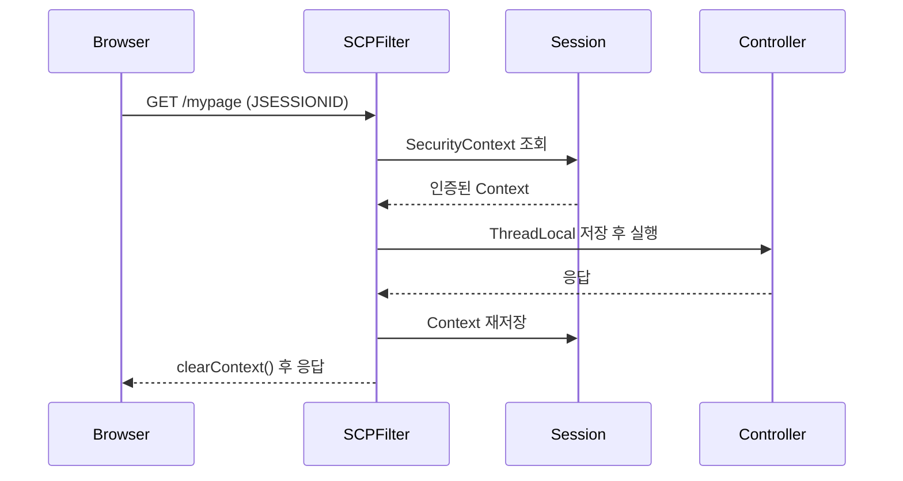
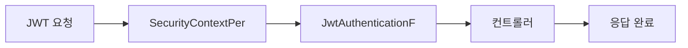
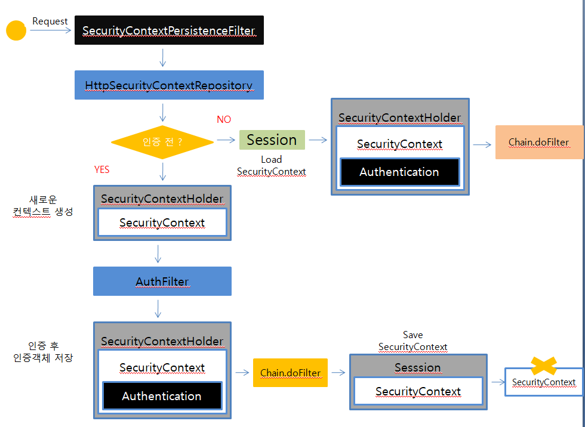

> 한 줄 요약: SecurityContextPersistenceFilter는 매 요청마다 세션에서 SecurityContext를 불러와 ThreadLocal에 저장하고, 요청 처리가 끝나면 변경된 SecurityContext를 다시 세션에 저장하는 인증 지속성의 핵심 필터다.

## 실생활 비유로 이해하기

도서관 이용 과정을 상상해 보겠습니다. 매번 방문할 때마다 회원 카드를 제시하고 직원이 회원 정보를 컴퓨터에 불러옵니다(세션에서 SecurityContext 로드). 도서관 이용 중에는 직원이 회원 정보를 화면에 띄워 놓습니다(ThreadLocal에 저장). 퇴관할 때 이용 기록을 시스템에 저장하고 화면을 닫습니다(SecurityContext 세션 저장 후 clearContext).

`SecurityContextPersistenceFilter`가 바로 이 과정을 자동으로 처리합니다.

## SecurityContextPersistenceFilter의 핵심 역할

이 필터는 Spring Security 필터 체인에서 **가장 앞에 위치**합니다. 모든 보안 처리가 시작되기 전에 SecurityContext를 준비하고, 모든 처리가 끝난 후 SecurityContext를 저장합니다.


```mermaid
flowchart TD
    A["HTTP 요청"] --> B{"세션에"}
    B -- "있음" --> C["세션 로드"]
    B -- "없음" --> D["빈 Context 생성"]
    C & D --> E["필터체인 + 컨트롤러"]
    E --> F["SecurityContext"]
    F --> G["clearContext()"]
```

## 사용자 유형별 처리 방식

### 1. 익명 사용자 (미인증)


```mermaid
sequenceDiagram
    participant B as Browser
    participant SCPF as SCPersistenceFilter
    participant TL as ThreadLocal
    participant AAF as AnonymousAuthFilter
    B->>SCPF: GET /public (세션 없음)
    SCPF->>TL: 빈 SecurityContext 생성
    SCPF->>AAF: 다음 필터로 진행
    AAF->>TL: AnonymousAuthenticationToken 저장
    SCPF->>SCPF: AnonymousToken 세션 저장 안 함
    SCPF->>TL: clearContext()
    SCPF-->>B: 응답 전송
```

### 2. 최초 인증 시


```mermaid
sequenceDiagram
    participant B as Browser
    participant SCPF as SCPersistenceFilter
    participant TL as ThreadLocal
    participant UPAF as AuthFilter
    participant S as Session
    B->>SCPF: POST /login
    SCPF->>TL: 빈 SecurityContext 생성
    SCPF->>UPAF: 인증 필터로 진행
    UPAF->>TL: 인증된 Authentication 저장
    SCPF->>S: SecurityContext 세션 저장
    SCPF->>TL: clearContext()
    SCPF-->>B: 로그인 성공(JSESSIONID)
```

### 3. 인증 후 재방문


```mermaid
sequenceDiagram
    participant Browser
    participant SCPF as SCPFilter
    participant Session
    participant Controller
    Browser->>SCPF: GET /mypage (JSESSIONID)
    SCPF->>Session: SecurityContext 조회
    Session-->>SCPF: 인증된 Context
    SCPF->>Controller: ThreadLocal 저장 후 실행
    Controller-->>SCPF: 응답
    SCPF->>Session: Context 재저장
    SCPF-->>Browser: clearContext() 후 응답
```

## HttpSessionSecurityContextRepository

`SecurityContextPersistenceFilter`는 실제 세션 저장/로드 작업을 `HttpSessionSecurityContextRepository`에 위임합니다.

```java
// HttpSessionSecurityContextRepository 내부 동작 (개념적 표현)
public class HttpSessionSecurityContextRepository implements SecurityContextRepository {

    // 세션에서 SecurityContext 로드
    @Override
    public SecurityContext loadContext(HttpRequestResponseHolder requestResponseHolder) {
        HttpSession session = request.getSession(false);
        if (session == null) {
            return generateNewContext();  // 빈 SecurityContext 반환
        }
        SecurityContext context = (SecurityContext) session.getAttribute(SPRING_SECURITY_CONTEXT_KEY);
        return context != null ? context : generateNewContext();
    }

    // SecurityContext를 세션에 저장
    @Override
    public void saveContext(SecurityContext context, HttpServletRequest request, HttpServletResponse response) {
        Authentication auth = context.getAuthentication();
        if (auth == null || auth instanceof AnonymousAuthenticationToken) {
            return;  // 익명 사용자는 세션에 저장 안 함
        }
        HttpSession session = request.getSession(true);
        session.setAttribute(SPRING_SECURITY_CONTEXT_KEY, context);
    }
}
```

세션 키는 기본적으로 `"SPRING_SECURITY_CONTEXT"` 문자열입니다.

## STATELESS 정책에서의 동작

JWT 기반 REST API에서 `SessionCreationPolicy.STATELESS`를 설정하면, `SecurityContextPersistenceFilter`는 세션을 전혀 사용하지 않습니다.

```java
http
    .sessionManagement()
    .sessionCreationPolicy(SessionCreationPolicy.STATELESS);
```

이 경우 `NullSecurityContextRepository`가 사용되어, 모든 요청에서 빈 `SecurityContext`를 생성하고 저장도 하지 않습니다. 매 요청마다 JWT 필터가 토큰을 검증하고 `SecurityContext`에 인증 정보를 설정해야 합니다.


```mermaid
flowchart LR
    A["JWT 요청"] --> B["SecurityContextPer"]
    B --> C["JwtAuthenticationF"]
    C --> D["컨트롤러"]
    D --> E["응답 완료"]
```

## Spring Security 6에서의 변경

Spring Security 6에서는 `SecurityContextPersistenceFilter`가 `SecurityContextHolderFilter`로 대체되었습니다.

```
변경 사항:
- SecurityContextPersistenceFilter: 요청 후 자동으로 SecurityContext를 세션에 저장
- SecurityContextHolderFilter: 저장 책임을 명시적으로 위임 (더 명확한 제어)
```

`SecurityContextHolderFilter`는 응답 시 자동으로 세션에 저장하지 않고, 각 필터가 명시적으로 `SecurityContextRepository.saveContext()`를 호출해야 합니다. 이 변경으로 저장 시점을 더 세밀하게 제어할 수 있습니다.

## 동작 과정 다이어그램



## 왜 이게 중요한가?

`SecurityContextPersistenceFilter`는 세션 기반 인증의 지속성을 담당합니다. 이 필터가 없다면 매 요청마다 로그인을 반복해야 합니다. 로그인 후 브라우저를 새로고침해도 로그인 상태가 유지되는 것이 바로 이 필터 덕분입니다.

또한 이 필터의 동작 원리를 이해해야 JWT 기반 인증으로 전환할 때 `STATELESS` 설정이 왜 필요한지, 멀티 스레드 환경에서 `clearContext()`가 왜 중요한지 이해할 수 있습니다.

## 보안 위협 시나리오

**SecurityContext 직렬화 취약점**: SecurityContext는 세션에 직렬화되어 저장됩니다. Java 직렬화 취약점을 이용한 공격(역직렬화 공격)에 노출될 수 있습니다. Spring Security는 최신 버전에서 이에 대한 방어책을 지속적으로 개선하고 있습니다.

**세션 고정과의 관계**: 인증 후 `SecurityContextPersistenceFilter`가 새로운 세션에 SecurityContext를 저장할 때, 세션 ID가 변경되지 않으면 세션 고정 공격에 취약합니다. `SessionFixationProtectionStrategy`와 함께 동작하여 인증 후 새 세션 ID를 발급합니다.

## 핵심 포인트 정리

- `SecurityContextPersistenceFilter`는 필터 체인 맨 앞에 위치하여 SecurityContext 생명주기를 관리한다.
- 요청 시작: 세션에서 SecurityContext 로드 → ThreadLocal에 저장.
- 요청 완료: ThreadLocal의 SecurityContext → 세션에 저장 → clearContext().
- 익명 사용자의 `AnonymousAuthenticationToken`은 세션에 저장하지 않는다.
- `HttpSessionSecurityContextRepository`: 실제 세션 저장/로드 담당.
- `STATELESS` 설정 시 세션을 전혀 사용하지 않아 JWT 기반 인증에 적합.
- Spring Security 6에서는 `SecurityContextHolderFilter`로 대체되어 저장 시점 제어가 명시적으로 변경됨.
