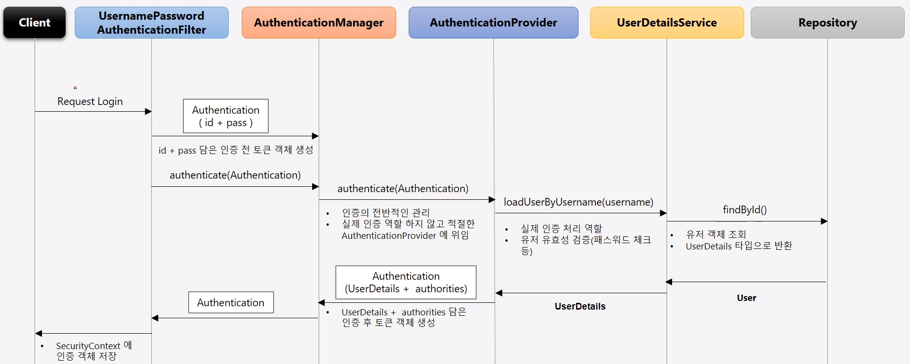
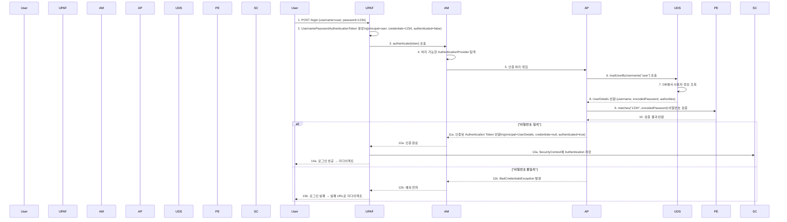
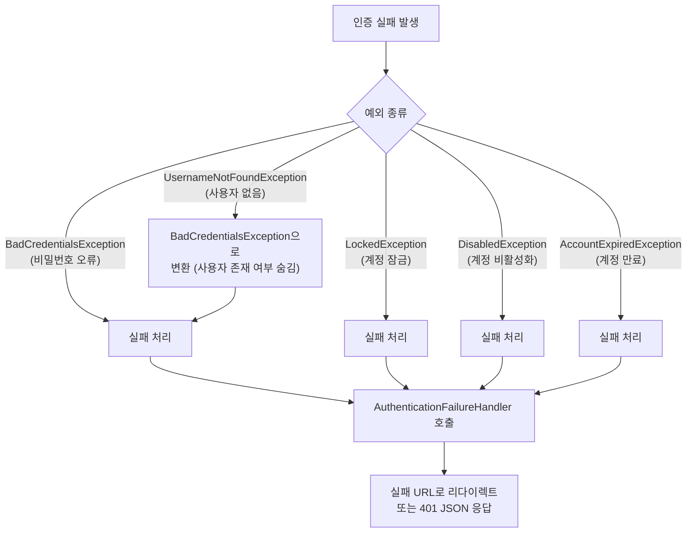
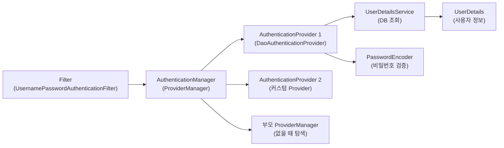

> 한 줄 요약: Spring Security의 인증 흐름은 Filter → AuthenticationManager → AuthenticationProvider → UserDetailsService 순서로 진행되며, 각 컴포넌트가 명확한 역할을 분담하여 인증을 처리한다.

## 실생활 비유로 이해하기

공항 출입국 심사 과정을 생각해 보겠습니다. 여행객(사용자)이 출국장(보호된 리소스)에 들어가려면 여러 단계를 거칩니다.

1. **보안 검색대(Filter)**: 가방과 소지품을 검사합니다. 여권이 없으면 이 단계에서 걸립니다.
2. **출입국 심사관 데스크(AuthenticationManager)**: 여러 심사관 중 적합한 심사관을 배정합니다.
3. **담당 심사관(AuthenticationProvider)**: 실제로 여권을 확인하고 입국 가능 여부를 결정합니다.
4. **여권 데이터베이스(UserDetailsService)**: 심사관이 여권 정보를 데이터베이스에서 조회합니다.

Spring Security의 인증 흐름이 이 과정과 동일합니다.

## 전체 인증 흐름 다이어그램





## 컴포넌트별 역할 상세 설명

### 1단계: UsernamePasswordAuthenticationFilter

폼 로그인 요청(`POST /login`)을 가로채어 인증 과정을 시작합니다.

```java
// UsernamePasswordAuthenticationFilter 내부 동작 (개념적)
public Authentication attemptAuthentication(HttpServletRequest request, HttpServletResponse response) {
    // 1. 요청 파라미터에서 username, password 추출
    String username = obtainUsername(request);
    String password = obtainPassword(request);

    // 2. 미인증 상태의 토큰 생성
    UsernamePasswordAuthenticationToken authRequest =
        new UsernamePasswordAuthenticationToken(username, password);

    // 3. AuthenticationManager에 인증 위임
    return this.getAuthenticationManager().authenticate(authRequest);
}
```

### 2단계: AuthenticationManager (ProviderManager)

등록된 `AuthenticationProvider` 목록에서 해당 인증 토큰을 처리할 수 있는 Provider를 찾아 위임합니다.

```java
// ProviderManager 내부 동작 (개념적)
public Authentication authenticate(Authentication authentication) {
    for (AuthenticationProvider provider : getProviders()) {
        if (!provider.supports(authentication.getClass())) {
            continue;  // 처리 불가능한 Provider는 건너뜀
        }
        try {
            Authentication result = provider.authenticate(authentication);
            if (result != null) {
                return result;  // 인증 성공
            }
        } catch (AuthenticationException e) {
            lastException = e;
        }
    }

    // 모든 Provider가 처리 못한 경우 부모 ProviderManager에게 위임
    if (parent != null) {
        return parent.authenticate(authentication);
    }

    throw lastException;  // 인증 실패
}
```

### 3단계: AuthenticationProvider (DaoAuthenticationProvider)

실제 인증 로직을 수행합니다. `UserDetailsService`로 사용자 정보를 조회하고 `PasswordEncoder`로 비밀번호를 검증합니다.

```java
// DaoAuthenticationProvider 동작 (개념적)
public Authentication authenticate(Authentication authentication) {
    String username = authentication.getName();

    // 1. UserDetailsService로 사용자 조회
    UserDetails userDetails = userDetailsService.loadUserByUsername(username);

    // 2. 계정 상태 검사 (잠금, 만료, 비활성화 등)
    preAuthenticationChecks.check(userDetails);

    // 3. 비밀번호 검증
    additionalAuthenticationChecks(userDetails, (UsernamePasswordAuthenticationToken) authentication);

    // 4. 인증된 토큰 생성 (credentials=null로 비밀번호 제거)
    return createSuccessAuthentication(userDetails, authentication, userDetails);
}
```

### 4단계: UserDetailsService

데이터베이스나 메모리에서 사용자 정보를 조회합니다.

```java
@Service
public class CustomUserDetailsService implements UserDetailsService {

    @Autowired
    private UserRepository userRepository;

    @Override
    public UserDetails loadUserByUsername(String username) throws UsernameNotFoundException {
        // DB에서 사용자 조회
        User user = userRepository.findByEmail(username)
            .orElseThrow(() -> new UsernameNotFoundException(
                "사용자를 찾을 수 없습니다: " + username));

        // UserDetails 구현체 반환
        return new CustomUserDetails(user);
    }
}
```

## 인증 실패 처리 흐름



`UsernameNotFoundException`을 `BadCredentialsException`으로 변환하는 이유는 사용자 존재 여부를 공격자에게 노출하지 않기 위함입니다. "아이디가 없습니다"와 "비밀번호가 틀립니다"를 구분하면 공격자가 유효한 아이디를 수집하는 데 악용할 수 있습니다.

## 계정 상태 검사

`AuthenticationProvider`는 비밀번호 검증 전에 계정 상태를 먼저 확인합니다.

```java
// UserDetails 인터페이스의 계정 상태 메서드들
public interface UserDetails {
    boolean isAccountNonExpired();    // 계정 만료 여부
    boolean isAccountNonLocked();     // 계정 잠금 여부
    boolean isCredentialsNonExpired(); // 자격증명 만료 여부
    boolean isEnabled();               // 계정 활성화 여부
}

// 실제 구현 예시 (로그인 실패 횟수 기반 잠금)
@Override
public boolean isAccountNonLocked() {
    return this.failedLoginCount < 5;  // 5회 실패 시 잠금
}

@Override
public boolean isEnabled() {
    return this.emailVerified;  // 이메일 인증 완료 시 활성화
}
```

## 커스텀 AuthenticationProvider 구현

특별한 인증 방식(예: OTP, 생체 인증)이 필요할 때 커스텀 Provider를 구현합니다.

```java
@Component
public class OtpAuthenticationProvider implements AuthenticationProvider {

    @Autowired
    private OtpService otpService;

    @Override
    public Authentication authenticate(Authentication authentication) throws AuthenticationException {
        OtpAuthenticationToken token = (OtpAuthenticationToken) authentication;
        String username = token.getName();
        String otpCode = (String) token.getCredentials();

        // OTP 검증
        if (!otpService.verify(username, otpCode)) {
            throw new BadCredentialsException("OTP 인증 실패");
        }

        UserDetails userDetails = userDetailsService.loadUserByUsername(username);
        return new OtpAuthenticationToken(userDetails, null, userDetails.getAuthorities());
    }

    @Override
    public boolean supports(Class<?> authentication) {
        // 이 Provider가 처리할 토큰 타입 지정
        return OtpAuthenticationToken.class.isAssignableFrom(authentication);
    }
}
```

## 인증 흐름 전체 컴포넌트 구조



## 왜 이게 중요한가?

인증 흐름의 각 컴포넌트를 이해하면 다음과 같은 커스터마이징이 가능합니다.

- **다중 인증 방식**: ID/PW + OTP, 소셜 로그인 + 자체 계정을 동시에 지원
- **세밀한 오류 처리**: 계정 잠금, 이메일 미인증 등 상황별 다른 메시지 제공
- **인증 이벤트 처리**: 로그인 성공/실패 이벤트를 구독하여 감사 로그 기록
- **JWT 통합**: `AuthenticationProvider`를 대체하여 JWT 검증 로직 삽입

## 보안 위협 시나리오

**타이밍 공격**: `UsernameNotFoundException`과 `BadCredentialsException`의 응답 시간 차이를 측정하여 유효한 사용자명을 추론할 수 있습니다. Spring Security는 두 예외를 동일한 시간 동안 처리하도록 설계되어 있습니다.

**브루트 포스 공격**: 반복적인 로그인 시도로 비밀번호를 추측합니다. `isAccountNonLocked()`를 구현하여 일정 횟수 실패 후 계정을 잠그거나, Rate Limiting을 적용하여 방어합니다.

## 핵심 포인트 정리

- 인증 흐름: Filter → AuthenticationManager → AuthenticationProvider → UserDetailsService 순.
- `UsernamePasswordAuthenticationFilter`: 폼 요청 가로채기, 미인증 토큰 생성, 인증 위임.
- `ProviderManager`: 등록된 Provider 목록에서 처리 가능한 것을 찾아 위임, 없으면 부모 탐색.
- `DaoAuthenticationProvider`: `UserDetailsService`로 사용자 조회, `PasswordEncoder`로 비밀번호 검증.
- `UserDetailsService.loadUserByUsername()`: 사용자명으로 `UserDetails` 조회 (DB 연동 지점).
- `UsernameNotFoundException`은 `BadCredentialsException`으로 변환 (사용자 존재 여부 숨김).
- 계정 상태(잠금, 만료, 비활성화) 검사는 비밀번호 검증 이전에 수행된다.
- 커스텀 `AuthenticationProvider`로 OTP, 생체 인증 등 다양한 인증 방식을 추가할 수 있다.
