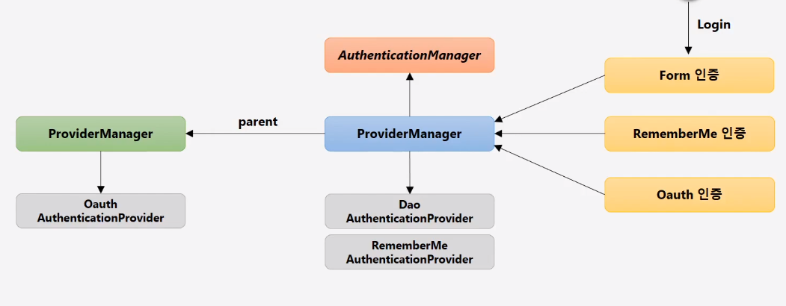

## Authentication Manger

* AuthenticationProvider 목록 중에서 인증 처리 요건에 맞는 AuthenticationProvider를 찾아 인증처리를 위임한다.

* 부모 ProviderManger를 설정하여 AuthenticationProvider를 계속 탐색 할 수 있다.

  




```
스프링 시큐리티 - Spring boot 기반으로 개발하는 Spring Security 강의 중
```

