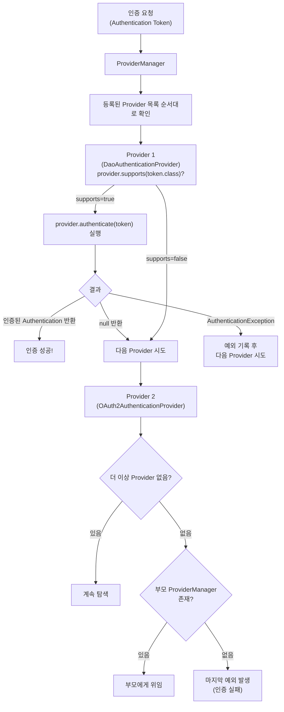
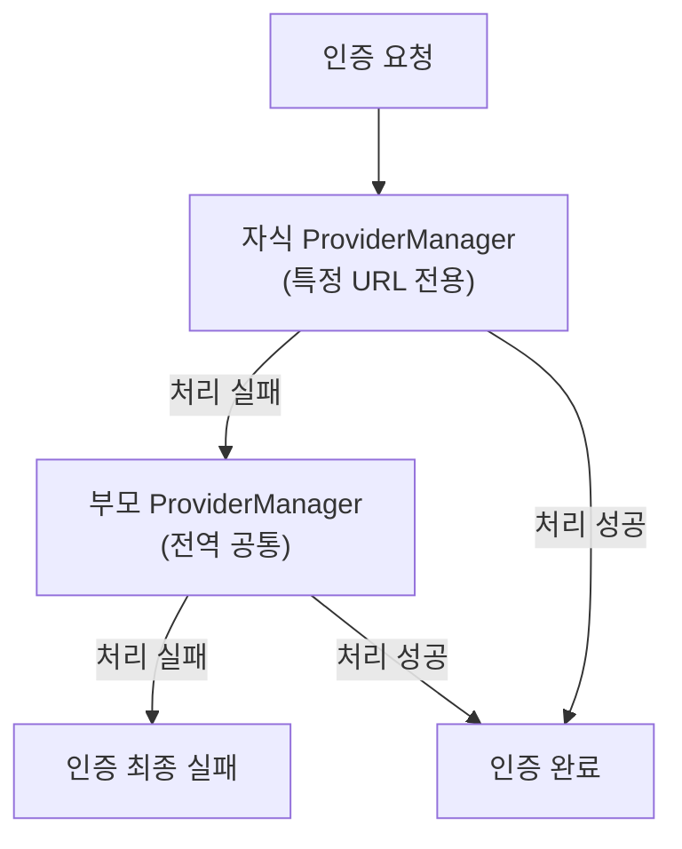
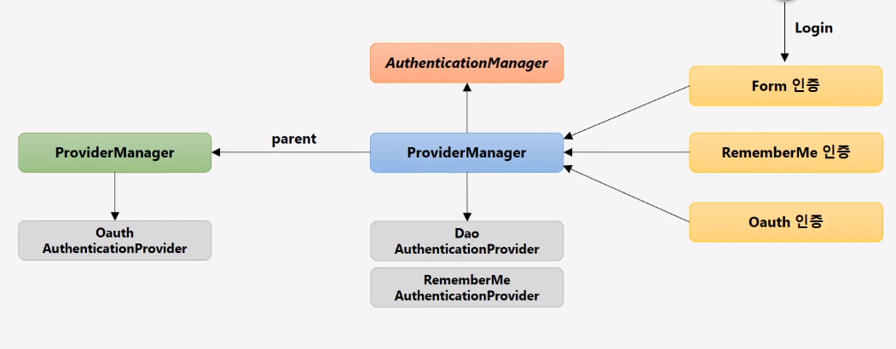
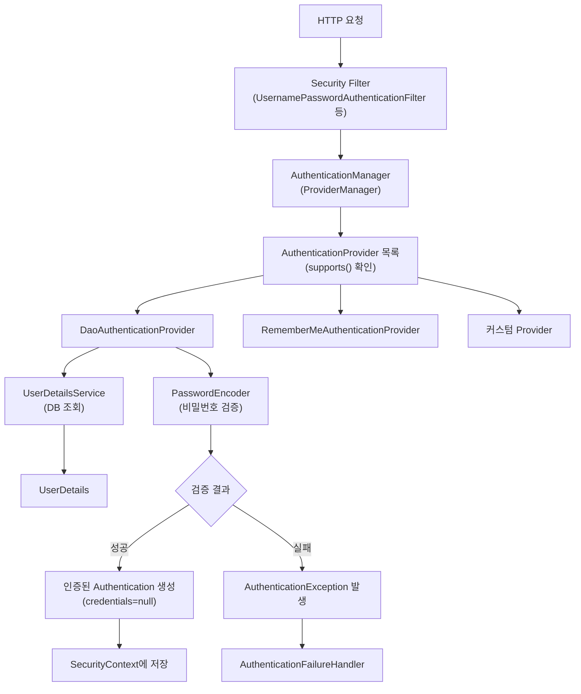

> 한 줄 요약: AuthenticationManager(ProviderManager)는 여러 AuthenticationProvider를 관리하며 적합한 Provider에게 인증을 위임하고, 부모 ProviderManager 체인을 통해 다양한 인증 방식을 유연하게 지원한다.

## 실생활 비유로 이해하기

대형 병원의 진료 시스템을 생각해 보겠습니다. 접수처(AuthenticationManager)에 가면 담당 진료과를 안내받습니다. 일반 질환은 내과(DaoAuthenticationProvider)로, 피부 질환은 피부과(OAuthAuthenticationProvider)로, 특수 검사는 외래 전문의(커스텀 Provider)에게 연결됩니다. 해당 병원에서 처리할 수 없으면 상급 병원(부모 ProviderManager)으로 의뢰합니다.

`AuthenticationManager`가 이 접수처 역할을 합니다.

## AuthenticationManager 인터페이스

```java
public interface AuthenticationManager {
    /**
     * 인증을 시도하고 결과를 반환한다.
     *
     * @param authentication 인증 요청 토큰
     * @return 인증된 Authentication 객체 (인증 성공 시)
     * @throws AuthenticationException 인증 실패 시
     */
    Authentication authenticate(Authentication authentication) throws AuthenticationException;
}
```

인터페이스는 단 하나의 메서드만 가집니다. 구현체가 어떤 방식으로 인증하든 이 계약을 따릅니다.

## ProviderManager - 기본 구현체

Spring Security에서 `AuthenticationManager`의 기본 구현체는 `ProviderManager`입니다.


```mermaid
flowchart TD
    A["인증 요청\n(Authentication Token)"] --> B["ProviderManager"]
    B --> C["등록된 Provider 목록 순서대로 확인"]
    C --> D["Provider 1\n(DaoAuthenticationProvider)\nprovider.supports(token.class)?"]
    D -- "supports=true" --> E["provider.authenticate(token) 실행"]
    E --> F{"결과"}
    F -- "인증된 Authentication 반환" --> G["인증 성공!"]
    F -- "null 반환" --> H["다음 Provider 시도"]
    F -- "AuthenticationException" --> I["예외 기록 후\n다음 Provider 시도"]
    D -- "supports=false" --> H
    H --> J["Provider 2\n(OAuth2AuthenticationProvider)"]
    J --> K{"더 이상 Provider 없음?"}
    K -- "있음" --> L["계속 탐색"]
    K -- "없음" --> M{"부모 ProviderManager\n존재?"}
    M -- "있음" --> N["부모에게 위임"]
    M -- "없음" --> O["마지막 예외 발생\n(인증 실패)"]
```

## ProviderManager 구현 상세

```java
// ProviderManager 핵심 로직 (개념적 표현)
@Override
public Authentication authenticate(Authentication authentication) throws AuthenticationException {
    Class<? extends Authentication> toTest = authentication.getClass();
    AuthenticationException lastException = null;

    // 1. 등록된 Provider 목록 순서대로 탐색
    for (AuthenticationProvider provider : getProviders()) {

        // 이 Provider가 해당 토큰 타입을 처리할 수 있는지 확인
        if (!provider.supports(toTest)) {
            continue;
        }

        try {
            // 인증 시도
            Authentication result = provider.authenticate(authentication);

            if (result != null) {
                // 인증 성공: 인증 세부 정보 복사 후 반환
                copyDetails(authentication, result);
                return result;
            }
        } catch (AccountStatusException | InternalAuthenticationServiceException e) {
            // 계정 상태 문제는 즉시 실패 (다른 Provider 시도 안 함)
            prepareException(e, authentication);
            throw e;
        } catch (AuthenticationException e) {
            lastException = e;
        }
    }

    // 2. 등록된 Provider가 처리 못한 경우 부모 ProviderManager에 위임
    if (parent != null) {
        try {
            return parent.authenticate(authentication);
        } catch (AuthenticationException e) {
            lastException = e;
        }
    }

    // 3. 모든 시도 실패
    if (lastException != null) {
        throw lastException;
    }

    throw new ProviderNotFoundException("No AuthenticationProvider found for " + toTest.getName());
}
```

## 부모 ProviderManager 구조

`ProviderManager`는 부모 `ProviderManager`를 설정할 수 있어, 계층적 인증 구조를 만들 수 있습니다.


```mermaid
flowchart TD
    A["인증 요청"] --> B["자식 ProviderManager\n(특정 URL 전용)"]
    B -- "처리 실패" --> C["부모 ProviderManager\n(전역 공통)"]
    C -- "처리 실패" --> D["인증 최종 실패"]
    B -- "처리 성공" --> E["인증 완료"]
    C -- "처리 성공" --> E
```



다중 `SecurityFilterChain` 환경에서 각 필터 체인은 자신만의 `ProviderManager`를 가집니다. 각 `ProviderManager`는 공통 부모를 가리켜 전역 인증 설정을 공유할 수 있습니다.

```java
// 다중 보안 설정에서의 부모-자식 ProviderManager 구조 (개념적)
@Configuration
public class SecurityConfig {

    // 전역 공통 AuthenticationManager (부모)
    @Bean
    public AuthenticationManager globalAuthenticationManager(
            AuthenticationManagerBuilder auth) throws Exception {
        auth.userDetailsService(userDetailsService)
            .passwordEncoder(passwordEncoder());
        return auth.build();
    }

    // API 전용 ProviderManager (자식) - JWT Provider 추가
    @Configuration
    @Order(1)
    public class ApiSecurityConfig extends WebSecurityConfigurerAdapter {
        @Override
        protected void configure(AuthenticationManagerBuilder auth) throws Exception {
            auth.authenticationProvider(jwtAuthenticationProvider());
            // 처리 못하면 부모(globalAuthenticationManager)에게 위임
        }
    }
}
```

## AuthenticationProvider 인터페이스

```java
public interface AuthenticationProvider {

    // 실제 인증 처리
    Authentication authenticate(Authentication authentication) throws AuthenticationException;

    // 이 Provider가 처리할 수 있는 Authentication 타입 선언
    boolean supports(Class<?> authentication);
}
```

`supports()` 메서드가 핵심입니다. `ProviderManager`는 이 메서드로 처리 가능한 Provider를 빠르게 필터링합니다.

## 기본 제공 AuthenticationProvider

| Provider | 처리 대상 | 설명 |
|----------|----------|------|
| `DaoAuthenticationProvider` | `UsernamePasswordAuthenticationToken` | 폼 로그인, UserDetailsService + PasswordEncoder 사용 |
| `RememberMeAuthenticationProvider` | `RememberMeAuthenticationToken` | Remember Me 자동 로그인 토큰 검증 |
| `AnonymousAuthenticationProvider` | `AnonymousAuthenticationToken` | 익명 사용자 토큰 검증 |
| `JwtAuthenticationProvider` | `BearerTokenAuthenticationToken` | JWT 토큰 검증 (Spring Security OAuth2 Resource Server) |

## 커스텀 AuthenticationProvider 등록

```java
@Configuration
@EnableWebSecurity
public class SecurityConfig extends WebSecurityConfigurerAdapter {

    @Autowired
    private CustomAuthenticationProvider customProvider;

    @Override
    protected void configure(AuthenticationManagerBuilder auth) {
        // 커스텀 Provider를 AuthenticationManager에 등록
        auth.authenticationProvider(customProvider);
    }

    // 또는 빈으로 등록
    @Bean
    public AuthenticationManager authenticationManager() throws Exception {
        return new ProviderManager(
            List.of(
                daoAuthenticationProvider(),    // 기본 ID/PW 인증
                jwtAuthenticationProvider(),    // JWT 인증
                otpAuthenticationProvider()     // OTP 인증
            ),
            globalAuthenticationManager()       // 부모 ProviderManager
        );
    }
}
```

## 인증 이벤트 발행

`ProviderManager`는 인증 성공/실패 시 Spring 이벤트를 발행합니다.

```java
// 인증 성공 이벤트 처리
@Component
public class AuthenticationEventListener {

    @EventListener
    public void handleAuthenticationSuccess(AuthenticationSuccessEvent event) {
        String username = event.getAuthentication().getName();
        log.info("로그인 성공: {}", username);
        // 로그인 성공 횟수 초기화, 마지막 로그인 시간 업데이트 등
    }

    @EventListener
    public void handleAuthenticationFailure(AbstractAuthenticationFailureEvent event) {
        String username = event.getAuthentication().getName();
        Exception exception = event.getException();
        log.warn("로그인 실패: {} - {}", username, exception.getMessage());
        // 실패 횟수 증가, 계정 잠금 처리 등
    }
}
```

## 인증 후 credentials 제거

`ProviderManager`는 기본적으로 인증 성공 후 `Authentication`의 `credentials`를 `null`로 설정합니다.

```java
// ProviderManager의 credentials 제거 설정
ProviderManager providerManager = new ProviderManager(providers);
providerManager.setEraseCredentialsAfterAuthentication(true);  // 기본값: true
```

이 설정으로 비밀번호가 메모리에 불필요하게 남아 있는 것을 방지합니다. 단, 이후에 `credentials`가 필요한 경우 이 설정을 `false`로 변경해야 합니다.

## 전체 아키텍처 정리


```mermaid
flowchart TD
    A["HTTP 요청"] --> B["Security Filter\n(UsernamePasswordAuthenticationFilter 등)"]
    B --> C["AuthenticationManager\n(ProviderManager)"]
    C --> D["AuthenticationProvider 목록\n(supports() 확인)"]
    D --> E["DaoAuthenticationProvider"]
    D --> F["RememberMeAuthenticationProvider"]
    D --> G["커스텀 Provider"]
    E --> H["UserDetailsService\n(DB 조회)"]
    E --> I["PasswordEncoder\n(비밀번호 검증)"]
    H --> J["UserDetails"]
    I --> K{"검증 결과"}
    K -- "성공" --> L["인증된 Authentication 생성\n(credentials=null)"]
    K -- "실패" --> M["AuthenticationException 발생"]
    L --> N["SecurityContext에 저장"]
    M --> O["AuthenticationFailureHandler"]
```

## 왜 이게 중요한가?

`AuthenticationManager`와 `AuthenticationProvider`의 분리는 Spring Security의 핵심 설계 원칙인 단일 책임 원칙(SRP)과 개방-폐쇄 원칙(OCP)을 구현합니다.

새로운 인증 방식(SMS 인증, 생체 인증, SSO 등)을 추가할 때 기존 코드를 수정하지 않고 새로운 `AuthenticationProvider`를 구현하여 등록하기만 하면 됩니다. 이 확장성이 Spring Security가 다양한 인증 시나리오를 지원할 수 있는 이유입니다.

## 보안 위협 시나리오

**Provider 우선순위 공격**: 여러 Provider가 등록된 경우, 더 취약한 Provider가 먼저 실행되어 보안이 우회될 수 있습니다. Provider 등록 순서를 신중하게 결정해야 합니다. 더 엄격한 Provider를 먼저 등록하는 것이 안전합니다.

**credentials 미제거**: `eraseCredentialsAfterAuthentication=false`로 설정하면 인증 후에도 비밀번호가 `Authentication` 객체에 남아 있습니다. 세션에 이 객체가 저장되면 세션 직렬화를 통해 비밀번호가 노출될 수 있습니다.

## 핵심 포인트 정리

- `AuthenticationManager`: 인증 요청을 받아 적합한 Provider에게 위임하는 인터페이스.
- `ProviderManager`: `AuthenticationManager`의 기본 구현체, Provider 목록 관리 및 순서대로 시도.
- `provider.supports(Class)`: Provider가 처리할 수 있는 토큰 타입 선언, 빠른 필터링에 사용.
- 부모 `ProviderManager` 체인: 자식이 처리 못하면 부모에게 위임하는 계층 구조.
- `eraseCredentialsAfterAuthentication=true`: 인증 후 비밀번호 자동 제거 (기본값, 보안 권장).
- `AuthenticationProvider` 추가만으로 새로운 인증 방식(OTP, 생체 등) 확장 가능.
- 인증 이벤트(`AuthenticationSuccessEvent` 등)를 구독하여 감사 로그, 계정 잠금 구현 가능.
