웹 서버가 수만 개의 동시 접속을 처리하는 방법에는 두 가지 철학이 있다. 하나는 "요청마다 사람을 붙인다"는 방식이고, 다른 하나는 "한 사람이 여러 일을 번갈아 처리한다"는 방식이다. Nginx는 후자를 극한까지 밀어붙여 만들어진 서버다.

> **비유:** 대형 백화점 입구의 안내 데스크를 상상해보자. 방문객(요청)이 쏟아져도 안내원 몇 명이 동시에 수백 명을 안내할 수 있다. 어느 층(서버)으로 갈지 안내하고, 신분증 확인(SSL), 인원 제한(Rate Limiting), 안내 책자 직접 배포(정적 파일)까지 처리한다. 각 층 매장은 자신의 업무에만 집중하면 된다. 안내원이 한 명의 손님을 붙잡고 엘리베이터 올라가기를 기다리지 않듯, Nginx도 I/O 대기 중에 다른 요청을 처리한다.

---

## 1️⃣ Apache가 무너진 이유 — C10K 문제

### Thread-Per-Request 모델의 한계

Apache가 지배하던 시대, 서버는 요청 하나에 스레드 하나를 배정했다. 이 방식은 코드가 단순하고 직관적이었지만, 동시 접속이 수천 개를 넘어서면 치명적인 문제가 발생했다.

1999년 Dan Kegel은 이 현상을 "C10K 문제"라고 명명했다. 동시에 10,000개의 클라이언트를 처리하는 것이 왜 이렇게 어려운가라는 질문이었다.

OS 스레드 하나는 약 1~8MB의 스택 메모리를 차지한다. 외부 API를 호출하거나 데이터베이스 쿼리를 실행할 때, 스레드는 응답이 올 때까지 아무것도 하지 않고 대기한다. CPU는 놀고 있는데 메모리만 잡아먹는 상태다.

동시 접속 10,000개라면 10,000개 스레드가 필요하다. 스레드당 2MB로 계산하면 20GB RAM이 필요하다. 게다가 스레드 컨텍스트 스위칭 오버헤드가 폭발적으로 증가한다.

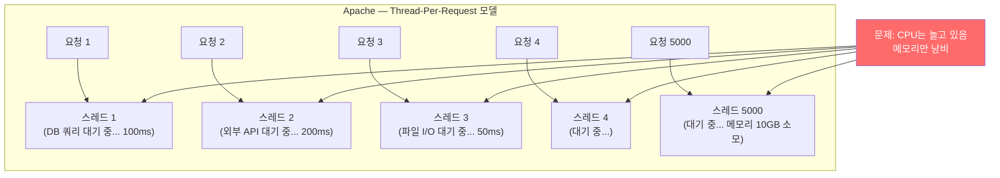

### 이벤트 기반 모델의 혁신

Nginx는 2004년 Igor Sysoev가 이 문제를 해결하기 위해 설계했다. 핵심 아이디어는 단순하다. **"I/O를 기다리는 동안 다른 일을 해라."**

스레드 대신 이벤트 루프(Event Loop)를 사용한다. 하나의 스레드가 수천 개의 소켓을 동시에 감시하다가, 어떤 소켓에 데이터가 도착하면 그때만 처리하고 다시 다음 이벤트를 기다린다.

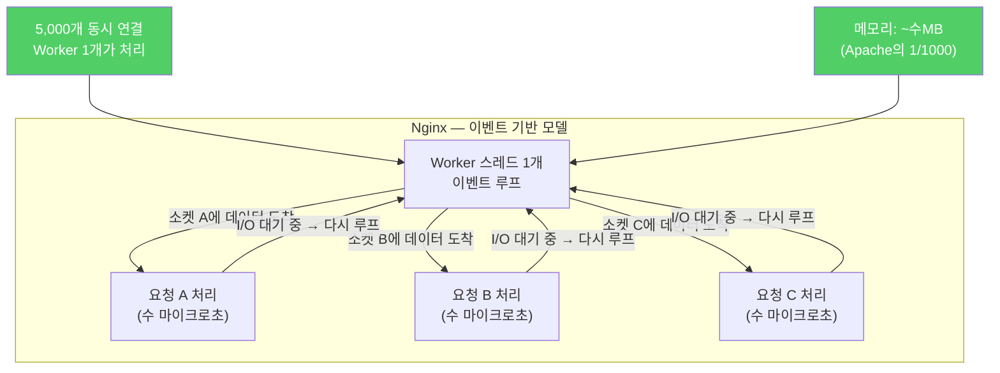

---

## 2️⃣ Nginx 이벤트 기반 아키텍처 동작원리

### epoll — 리눅스의 비밀 무기

Nginx가 이벤트 기반으로 동작할 수 있는 이유는 리눅스 커널의 `epoll` 시스템 콜 덕분이다. epoll이 어떻게 동작하는지 이해하면 Nginx 성능의 비밀이 풀린다.

전통적인 `select`/`poll` 방식은 "이 소켓들 중 준비된 게 있어?"라고 물으면, 커널이 모든 소켓을 O(n)으로 순회하며 확인했다. 감시하는 소켓이 1,000개면 매번 1,000번을 확인해야 했다.

`epoll`은 다르다. 커널 내부에 이벤트 관심 목록(interest list)을 유지하고, 소켓에 이벤트가 발생하면 커널이 직접 준비 목록(ready list)에 추가한다. 애플리케이션은 준비된 것만 가져가면 된다. O(1) 복잡도다.

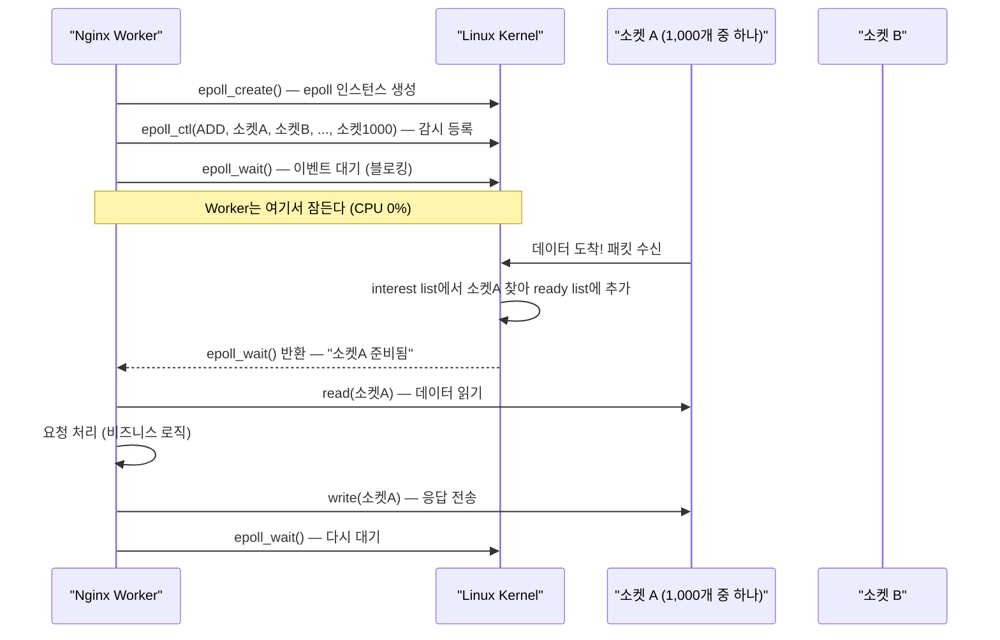

이것이 핵심이다. Nginx Worker는 대부분의 시간을 `epoll_wait()`에서 잠들어 있고, 실제로 처리할 이벤트가 생겼을 때만 깨어난다. 1,000개 소켓을 감시하면서도 CPU 사용률이 거의 0%인 이유다.

### Master/Worker 프로세스 모델

Nginx는 Master 프로세스와 Worker 프로세스로 나뉜다. 이 분리에는 중요한 이유가 있다.

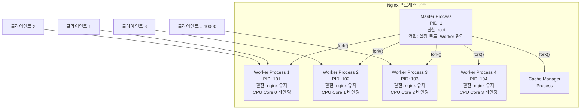

**Master Process 역할:**
- 설정 파일(`nginx.conf`) 읽기 및 유효성 검사
- 80/443 포트 바인딩 (1024 이하 포트는 root 권한 필요)
- Worker 프로세스를 `fork()`로 생성
- Worker 충돌 시 자동 재시작
- 시그널 처리 (`SIGHUP` → reload, `SIGQUIT` → graceful stop)

**Worker Process 역할:**
- 실제 클라이언트 요청 처리
- 각 Worker는 독립된 이벤트 루프 실행
- CPU 코어에 1:1로 바인딩 (`worker_cpu_affinity auto`)
- 프로세스 간 메모리 공유 없음 → Race condition 없음
- root 권한 없이 실행 → 보안 격리

**왜 스레드가 아닌 프로세스인가?** 스레드는 메모리를 공유하므로 한 스레드의 버그가 전체를 망칠 수 있다. 프로세스 기반이면 Worker 하나가 충돌해도 나머지는 계속 실행된다.

### Worker 내부 이벤트 루프 동작

한 Worker 프로세스 안에서 실제로 무슨 일이 일어나는지 살펴보자.

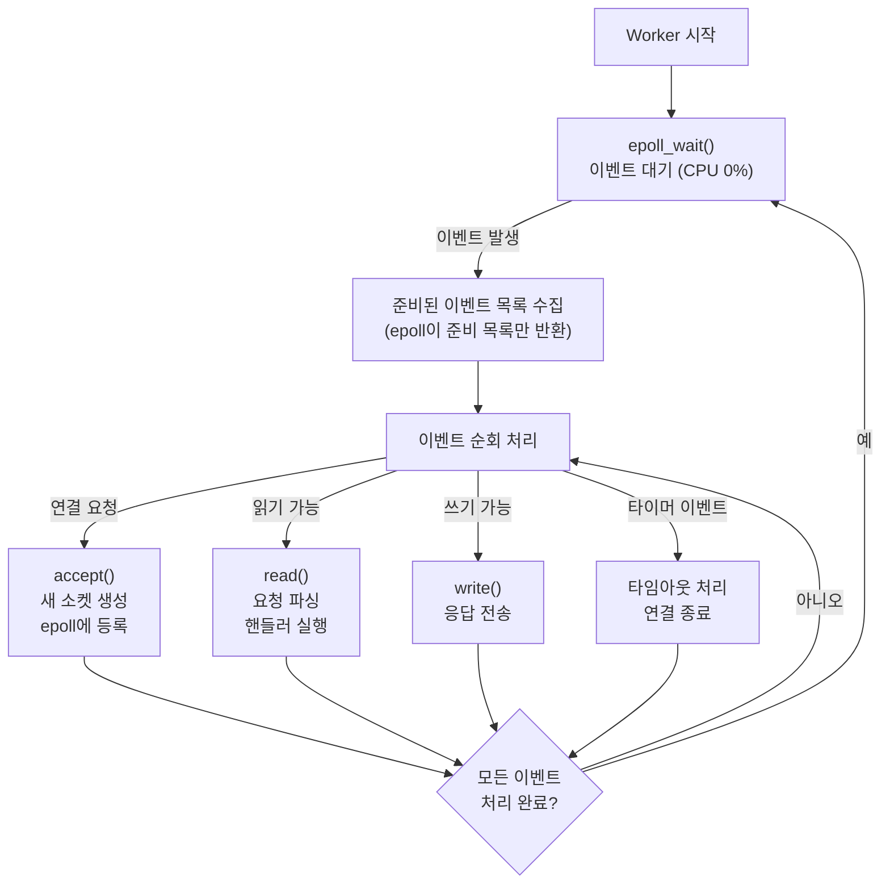

이벤트 루프는 멈추지 않는다. epoll_wait()에서 이벤트를 기다리다가, 이벤트가 오면 처리하고, 다시 epoll_wait()로 돌아가는 사이클을 반복한다. 블로킹 작업이 없는 한 이 루프는 초당 수십만 번 회전할 수 있다.

### Zero-Copy 파일 전송 (sendfile)

정적 파일을 서빙할 때 Nginx는 `sendfile()` 시스템 콜을 사용한다. 이것도 중요한 성능 최적화다.

전통적인 파일 전송은 커널 버퍼 → 유저 버퍼 → 소켓 버퍼로 데이터를 두 번 복사한다. `sendfile()`은 커널 버퍼에서 소켓 버퍼로 직접 복사하여 유저 공간 경유를 없앤다.

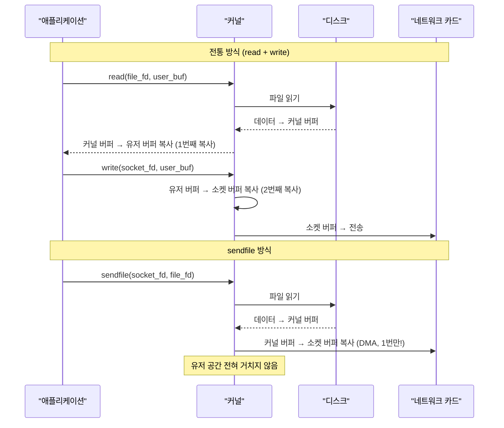

---

## 3️⃣ nginx.conf 구조 — 각 설정의 동작원리

```nginx
# 전역 설정 (main context)
user nginx;
worker_processes auto;          # CPU 코어 수에 맞게 자동 설정
worker_rlimit_nofile 65535;     # Worker당 최대 파일 디스크립터 수
                                # 연결 1개 = 소켓 파일 디스크립터 1개
error_log /var/log/nginx/error.log warn;
pid /var/run/nginx.pid;

events {
    worker_connections 1024;    # Worker 1개가 동시에 처리할 최대 연결 수
    use epoll;                  # Linux: epoll, macOS: kqueue, BSD: kqueue
    multi_accept on;            # 한 번에 여러 연결을 수락 (기본: 한 번에 하나)
    accept_mutex off;           # Linux 3.9+에서는 off가 더 빠름
}

http {
    include       /etc/nginx/mime.types;
    default_type  application/octet-stream;

    log_format main '$remote_addr - $remote_user [$time_local] "$request" '
                    '$status $body_bytes_sent "$http_referer" '
                    '"$http_user_agent" "$http_x_forwarded_for"';

    access_log /var/log/nginx/access.log main;

    # sendfile: Zero-Copy 파일 전송
    sendfile on;
    # tcp_nopush: sendfile과 함께 사용, 패킷이 가득 찰 때까지 버퍼링 후 전송
    tcp_nopush on;
    # tcp_nodelay: Keep-Alive 연결에서 작은 패킷도 즉시 전송 (Nagle 알고리즘 비활성화)
    tcp_nodelay on;

    # Keep-Alive: TCP 연결을 재사용하여 핸드셰이크 오버헤드 감소
    keepalive_timeout 65;       # 65초 동안 연결 유지
    keepalive_requests 100;     # Keep-Alive 연결당 최대 요청 수

    # Gzip 압축: 응답 크기를 줄여 네트워크 대역폭 절약
    gzip on;
    gzip_types text/plain text/css application/json application/javascript;
    gzip_min_length 1024;       # 1KB 미만은 압축 안 함 (오버헤드가 이득보다 클 수 있음)
    gzip_comp_level 6;          # 1(빠름/낮은압축) ~ 9(느림/높은압축)

    include /etc/nginx/conf.d/*.conf;
}
```

**`worker_connections`의 의미**: Worker 하나가 동시에 유지할 수 있는 소켓 수다. 클라이언트 연결 + 업스트림 연결을 모두 합산한다. 즉 Nginx가 역방향 프록시로 동작하면, 클라이언트 1개 연결에 업스트림 1개 연결이 추가로 필요하여 실제 처리 가능한 클라이언트 수는 `worker_connections / 2`다.

최대 동시 연결 = `worker_processes × worker_connections`

---

## 4️⃣ 서버 블록 (Virtual Host)

하나의 Nginx 인스턴스로 여러 도메인을 서빙할 때 서버 블록을 사용한다. `server_name` 디렉티브가 요청의 Host 헤더와 매칭되어 적절한 블록으로 라우팅된다.

```nginx
# /etc/nginx/conf.d/example.com.conf

server {
    listen 80;
    listen [::]:80;
    server_name example.com www.example.com;

    # HTTP → HTTPS 리다이렉트
    return 301 https://$server_name$request_uri;
}

server {
    listen 443 ssl http2;
    listen [::]:443 ssl http2;
    server_name example.com www.example.com;

    # SSL 인증서
    ssl_certificate     /etc/letsencrypt/live/example.com/fullchain.pem;
    ssl_certificate_key /etc/letsencrypt/live/example.com/privkey.pem;

    # SSL 보안 설정
    ssl_protocols TLSv1.2 TLSv1.3;
    ssl_prefer_server_ciphers on;
    ssl_ciphers ECDHE-ECDSA-AES128-GCM-SHA256:ECDHE-RSA-AES128-GCM-SHA256;
    ssl_session_cache shared:SSL:10m;
    ssl_session_timeout 10m;

    # HSTS
    add_header Strict-Transport-Security "max-age=31536000; includeSubDomains" always;
    add_header X-Frame-Options DENY;
    add_header X-Content-Type-Options nosniff;

    root /var/www/example.com;
    index index.html index.php;

    access_log /var/log/nginx/example.com.access.log main;
    error_log  /var/log/nginx/example.com.error.log warn;
}
```

---

## 5️⃣ 로드밸런싱 알고리즘 — 동작원리 완전 분석

로드밸런싱은 단순히 여러 서버에 요청을 나눠주는 것이 아니다. 알고리즘마다 동작원리가 다르고, 적용 시나리오도 다르다. Nginx가 각 알고리즘을 내부에서 어떻게 구현하는지 살펴보자.

### Round Robin — 기본 알고리즘

가장 단순하고 Nginx의 기본 알고리즘이다. 서버 목록을 순서대로 돌아가며 요청을 배정한다.

**동작원리**: Nginx는 업스트림 서버 목록을 배열로 유지하고, 현재 인덱스(current)를 기억한다. 요청이 올 때마다 current를 1씩 증가시키고 `current % server_count`로 서버를 선택한다.

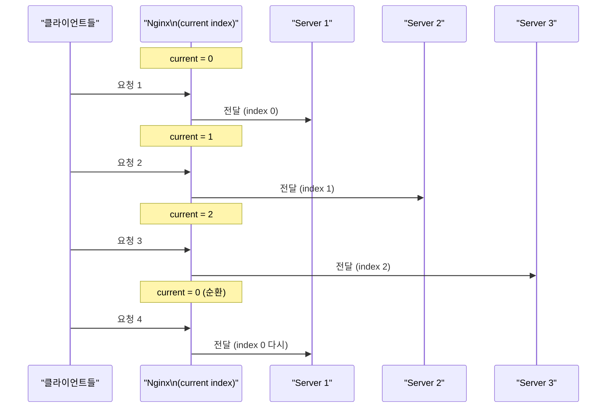

```nginx
upstream order_service {
    # 알고리즘 미지정 = Round Robin (기본값)
    server 10.0.0.1:8080;
    server 10.0.0.2:8080;
    server 10.0.0.3:8080;
}
```

**Round Robin이 기본인 이유**: 서버가 동질적(같은 스펙, 같은 처리 속도)이라고 가정할 때, 균등한 분배가 가장 공정하다. 구현이 O(1)으로 단순하며, 상태 관리가 거의 필요 없다.

**한계**: 각 요청의 처리 시간이 다를 때 문제가 생긴다. 무거운 요청이 Server 1에 몰리면 Server 1이 과부하 상태여도 계속 요청을 받는다.

---

### Weighted Round Robin — 가중치 기반 분배

서버 성능이 다를 때 사용한다. 더 좋은 서버에 더 많은 트래픽을 보낸다.

**동작원리**: Nginx는 각 서버의 weight를 합산하고, 요청을 보낼 때마다 현재 가중치(current_weight)를 갱신한다. "Smooth Weighted Round Robin" 알고리즘을 사용하여 가중치에 비례하면서도 요청이 고르게 분산된다.

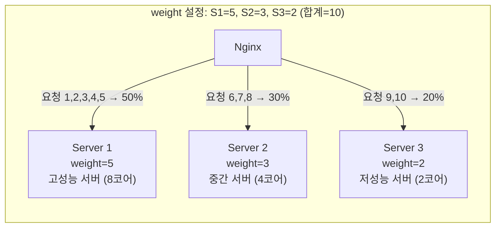

Nginx가 내부에서 Smooth Weighted RR을 처리하는 방식:

```
초기: S1.current=0, S2.current=0, S3.current=0

요청 1: current_weight += weight
  S1.current = 0+5 = 5 ← 최대 → S1 선택
  S1.current -= total(10) → S1.current = -5

요청 2: current_weight += weight
  S1.current = -5+5 = 0
  S2.current = 0+3 = 3 ← 최대 → S2 선택
  S2.current -= 10 → S2.current = -7

요청 3:
  S1.current = 0+5 = 5 ← 최대 → S1 선택
  S1.current = -5

이렇게 10번의 요청에 S1이 5번, S2가 3번, S3가 2번 선택됨
```

```nginx
upstream backend {
    server 10.0.0.1:8080 weight=5;   # 고성능 서버 — 요청의 50%
    server 10.0.0.2:8080 weight=3;   # 중간 서버  — 요청의 30%
    server 10.0.0.3:8080 weight=2;   # 저성능 서버 — 요청의 20%
}
```

**weight 설정 기준**: CPU 코어 수, 메모리 크기, 벤치마크 결과에 따라 설정한다. 예를 들어 8코어 서버와 4코어 서버가 있다면 `weight=2`, `weight=1`로 설정한다.

---

### IP Hash — Sticky Session 구현

같은 클라이언트는 항상 같은 서버로 보낸다. 로그인 세션처럼 서버 상태에 의존하는 경우에 사용한다.

**동작원리**: 클라이언트 IPv4 주소의 앞 3 옥텟(예: 192.168.1.x에서 192.168.1)을 해싱하여 서버를 선택한다. IPv6는 전체 주소를 사용한다.

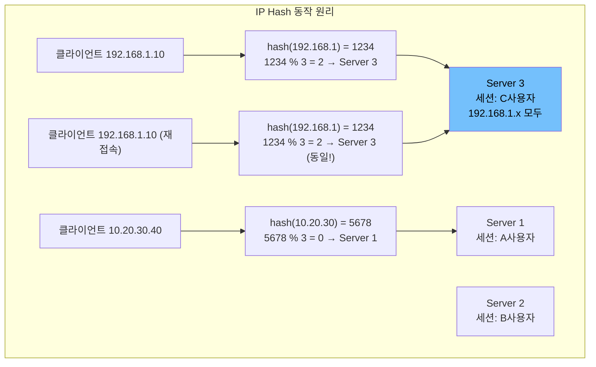

```nginx
upstream session_backend {
    ip_hash;     # 클라이언트 IP를 해싱하여 서버 고정
    server 10.0.0.1:8080;
    server 10.0.0.2:8080;
    server 10.0.0.3:8080;
    server 10.0.0.4:8080 down;  # 임시 제외 (ip_hash에서 순서 보존을 위해 down 사용)
}
```

**주의사항**: 서버를 제거할 때 `down`으로 표시해야 한다. 서버를 목록에서 완전히 삭제하면 해시값이 바뀌어 다른 클라이언트까지 다른 서버로 재배정된다.

**한계**: 클라이언트가 NAT 뒤에 있으면(회사 전체가 하나의 공인 IP 사용) 한 서버에 트래픽이 몰린다.

---

### Least Connection — 부하 기반 지능 분배

현재 활성 연결 수가 가장 적은 서버를 선택한다. 요청 처리 시간이 제각각일 때 가장 균형 잡힌 분배가 된다.

**동작원리**: Nginx는 각 업스트림 서버의 현재 활성 연결 수를 메모리에 유지한다. 새 요청이 오면 모든 서버의 연결 수를 비교하여 가장 작은 서버를 선택한다. 연결이 종료되면 해당 서버의 카운터를 감소시킨다.

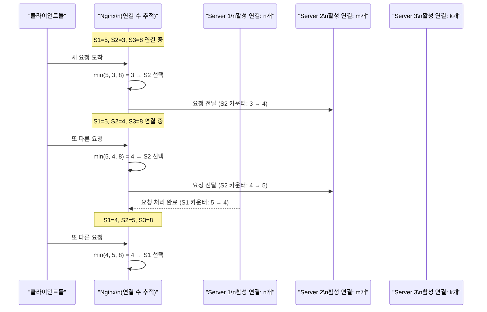

```nginx
upstream api_backend {
    least_conn;  # 최소 연결 알고리즘 활성화
    server 10.0.0.1:8080;
    server 10.0.0.2:8080;
    server 10.0.0.3:8080;
    keepalive 32;
}
```

**Least Connection이 빛나는 시나리오**: 파일 업로드(오래 걸림)와 상태 조회(빨리 끝남)가 섞인 API 서버. Round Robin이면 업로드 요청이 몰린 서버에 계속 상태 조회가 들어와 과부하가 생긴다. Least Connection은 업로드 중인 서버를 피하고 여유 있는 서버로 보낸다.

---

### 4가지 알고리즘 비교 요약

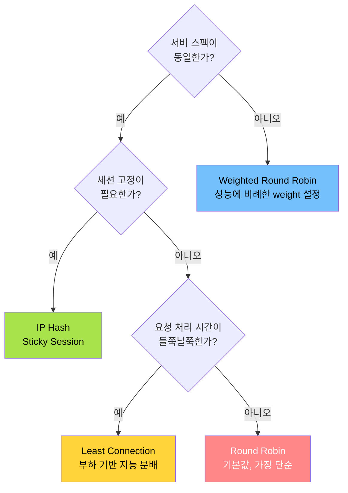

---

## 6️⃣ Location 블록 — 요청 매칭 우선순위

> **비유:** location 블록은 호텔의 층별 안내판이다. "정확히 이 방 번호"(=)가 가장 먼저 매칭되고, "이 층으로 시작하면"(^~)이 그다음이며, "이런 패턴의 방이면"(~)이 뒤따른다. 마지막으로 "그 외 전부"(/)가 기본 안내처럼 동작한다.

Nginx가 요청 URI를 받으면 어떤 location 블록에서 처리할지 결정해야 한다. 이 매칭에는 명확한 우선순위가 있다.

```nginx
server {
    # 1순위: = (완전 일치) — 가장 높은 우선순위
    location = /favicon.ico {
        log_not_found off;
        access_log off;
    }

    # 2순위: ^~ (접두사 일치, 정규식보다 우선)
    location ^~ /images/ {
        root /var/www/static;
        expires 1y;
        add_header Cache-Control "public, immutable";
    }

    # 3순위: ~ (정규식, 대소문자 구분)
    location ~ \.php$ {
        fastcgi_pass unix:/var/run/php/php8.1-fpm.sock;
        fastcgi_index index.php;
        include fastcgi_params;
        fastcgi_param SCRIPT_FILENAME $document_root$fastcgi_script_name;
    }

    # 4순위: ~* (정규식, 대소문자 무시)
    location ~* \.(jpg|jpeg|png|gif|ico|css|js|woff2)$ {
        expires 1y;
        add_header Cache-Control "public";
        access_log off;
    }

    # 5순위: / (기본 — 가장 낮은 우선순위)
    location / {
        try_files $uri $uri/ /index.html;
    }
}
```

**`try_files` 동작원리:**

```
try_files $uri $uri/ /index.html;

1. $uri     → 파일로 존재하면 반환 (예: /about.html)
2. $uri/    → 디렉토리로 존재하면 index 파일 반환
3. /index.html → 위 둘 다 없으면 SPA fallback
```

SPA(Single Page Application)에서는 모든 경로가 `index.html`로 떨어지도록 이 설정을 사용한다. React, Vue 등의 프론트엔드 라우팅이 동작하는 이유다.

---

## 7️⃣ Reverse Proxy 동작원리

리버스 프록시는 클라이언트가 Nginx와 통신하고, Nginx가 뒷단 서버와 통신한다. 클라이언트는 뒷단 서버의 존재를 알 수 없다.

### 요청이 흐르는 경로

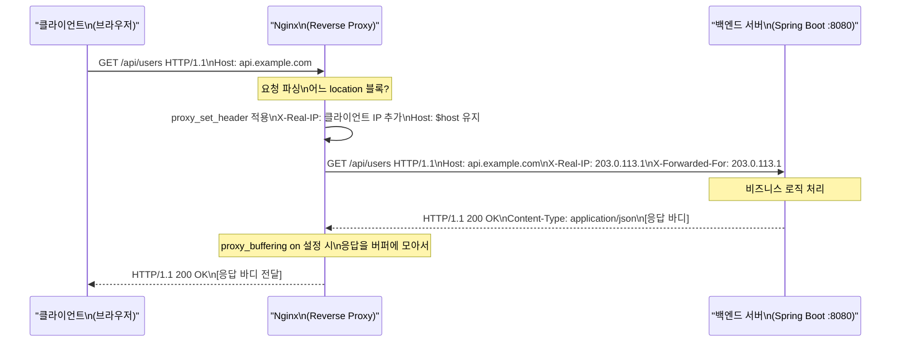

**proxy_buffering의 역할**: 백엔드 서버가 빠르게 응답을 보내더라도 클라이언트가 느리면, Nginx가 응답을 버퍼에 저장하고 클라이언트 속도에 맞춰 전달한다. 이를 통해 백엔드 서버가 느린 클라이언트를 기다리지 않고 빠르게 연결을 해제할 수 있다.

```nginx
server {
    listen 80;
    server_name api.example.com;

    location /api/ {
        proxy_pass http://127.0.0.1:8080;

        # 원래 클라이언트 정보를 헤더로 전달
        # (Nginx가 대신 연결하면 백엔드엔 Nginx IP가 보임 — 이를 보정)
        proxy_set_header Host $host;
        proxy_set_header X-Real-IP $remote_addr;
        proxy_set_header X-Forwarded-For $proxy_add_x_forwarded_for;
        proxy_set_header X-Forwarded-Proto $scheme;

        # 타임아웃 설정
        proxy_connect_timeout 5s;    # 백엔드 연결 수립 대기 시간
        proxy_send_timeout 60s;      # 백엔드에 요청 전송 대기 시간
        proxy_read_timeout 60s;      # 백엔드 응답 대기 시간

        # 버퍼 설정
        proxy_buffering on;
        proxy_buffer_size 4k;        # 응답 헤더 버퍼
        proxy_buffers 8 4k;          # 응답 바디 버퍼 (8개 × 4KB = 32KB)
    }
}
```

---

## 8️⃣ SSL Termination 동작원리

SSL Termination은 Nginx가 클라이언트와의 암호화를 담당하고, 뒷단 서버와는 평문(HTTP)으로 통신하는 패턴이다.

### TLS 핸드셰이크 과정

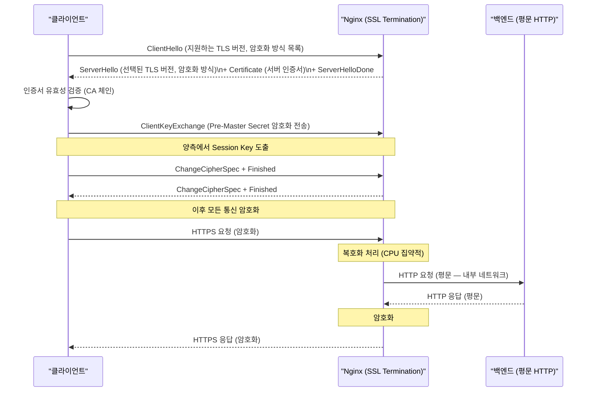

**SSL Termination의 장점**:
- 백엔드 서버가 암호화/복호화 부담 없이 비즈니스 로직에 집중
- 인증서 관리를 Nginx 한 곳에서 처리
- 내부 네트워크가 신뢰할 수 있는 환경이라면 평문 통신으로 지연 감소
- SSL Session Cache로 핸드셰이크 재사용

```nginx
server {
    listen 443 ssl http2;
    server_name api.example.com;

    ssl_certificate     /etc/nginx/ssl/fullchain.pem;
    ssl_certificate_key /etc/nginx/ssl/privkey.pem;

    # TLS 버전 (1.2, 1.3만 허용 — 1.0, 1.1은 취약점 있음)
    ssl_protocols TLSv1.2 TLSv1.3;

    # 강력한 암호화 스위트 (ECDHE: 완전 순방향 비밀성 지원)
    ssl_ciphers ECDHE-ECDSA-AES128-GCM-SHA256:ECDHE-RSA-AES128-GCM-SHA256:ECDHE-ECDSA-AES256-GCM-SHA384;
    ssl_prefer_server_ciphers off;  # TLS 1.3에서는 off 권장

    # SSL 세션 캐시 — 핸드셰이크 재사용으로 CPU 절약
    # 세션 ID로 이전 핸드셰이크 결과를 재사용 (1.5 RTT → 1 RTT)
    ssl_session_cache shared:SSL:10m;   # 10MB = 약 4만 세션
    ssl_session_timeout 1d;
    ssl_session_tickets off;

    # HSTS — 브라우저가 HTTPS만 사용하도록 강제
    add_header Strict-Transport-Security "max-age=63072000" always;

    # OCSP Stapling — 인증서 폐기 여부 확인 속도 향상
    # (클라이언트가 CA에 직접 묻는 대신 Nginx가 미리 확인 결과를 캐싱)
    ssl_stapling on;
    ssl_stapling_verify on;

    location / {
        proxy_pass http://backend;    # 뒷단은 평문 HTTP
    }
}

# HTTP → HTTPS 리다이렉트
server {
    listen 80;
    server_name api.example.com;
    return 301 https://$host$request_uri;
}
```

---

## 9️⃣ 캐싱 동작원리

Nginx의 프록시 캐시는 동일한 요청에 대해 백엔드 서버를 거치지 않고 직접 응답한다. 내부적으로 파일 시스템 기반의 캐시 저장소를 사용한다.

### 캐시 키 생성과 조회

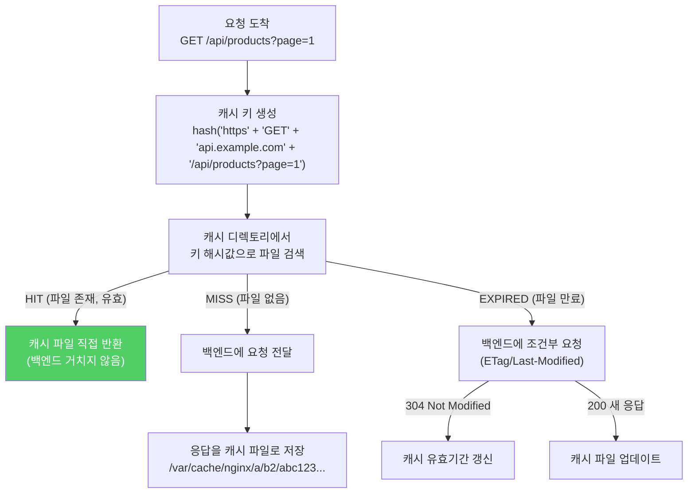

**캐시 파일 저장 구조**: `levels=1:2` 설정은 디렉토리 깊이를 지정한다. 키 해시값이 `a1b2c3d4`라면 `/var/cache/nginx/4/d3/a1b2c3d4`에 저장된다. 모든 파일을 한 디렉토리에 넣으면 ls 명령도 느려지기 때문에 서브디렉토리로 분산한다.

```nginx
http {
    # 캐시 저장 경로 및 설정
    proxy_cache_path /var/cache/nginx
        levels=1:2                  # 2단계 서브디렉토리 분산
        keys_zone=api_cache:10m     # 키 메타데이터를 메모리에 저장 (10MB ≈ 8만 키)
        max_size=1g                 # 디스크 최대 캐시 크기
        inactive=60m                # 60분간 미사용 시 삭제
        use_temp_path=off;          # 임시 파일 없이 직접 캐시 경로에 쓰기

    server {
        location /api/products {
            proxy_cache api_cache;
            proxy_cache_key "$scheme$host$request_uri";  # 캐시 키 구성
            proxy_cache_valid 200 304 10m;    # 200/304 응답 10분 캐시
            proxy_cache_valid 404 1m;          # 404는 1분 (네거티브 캐싱)
            proxy_cache_bypass $http_pragma;   # Pragma: no-cache 시 캐시 우회
            proxy_no_cache $http_authorization;  # Authorization 헤더 있으면 캐시 안 함

            # 백엔드 오류 시 이전 캐시 사용
            proxy_cache_use_stale error timeout updating http_500 http_502 http_503;

            # 캐시 재갱신 중 이전 캐시 사용
            proxy_cache_background_update on;

            # 캐시 상태 헤더 (디버깅용): HIT / MISS / EXPIRED / BYPASS
            add_header X-Cache-Status $upstream_cache_status;

            proxy_pass http://backend;
        }

        # 정적 파일 캐싱
        location ~* \.(css|js|png|jpg|gif|ico|woff2)$ {
            expires 1y;
            add_header Cache-Control "public, immutable";
            add_header Vary "Accept-Encoding";

            # Gzip 사전 압축 파일 사용 (.gz 파일이 존재하면 직접 전송)
            gzip_static on;
        }
    }
}
```

**`proxy_cache_lock`**: 동시에 같은 URL로 여러 요청이 오면, 첫 번째 요청만 백엔드로 보내고 나머지는 캐시 결과를 기다린다. 캐시 없이 갑자기 대량 트래픽이 오는 "Cache Stampede" 현상을 방지한다.

---

## 🔟 Rate Limiting 동작원리 — Leaky Bucket 알고리즘

Nginx의 Rate Limiting은 "Leaky Bucket(새는 양동이)" 알고리즘을 기반으로 한다. 양동이에 물(요청)을 붓고, 구멍에서 일정 속도로 물이 흘러나온다. 양동이가 넘치면(burst 초과) 요청을 버린다.

### Leaky Bucket 동작 시각화

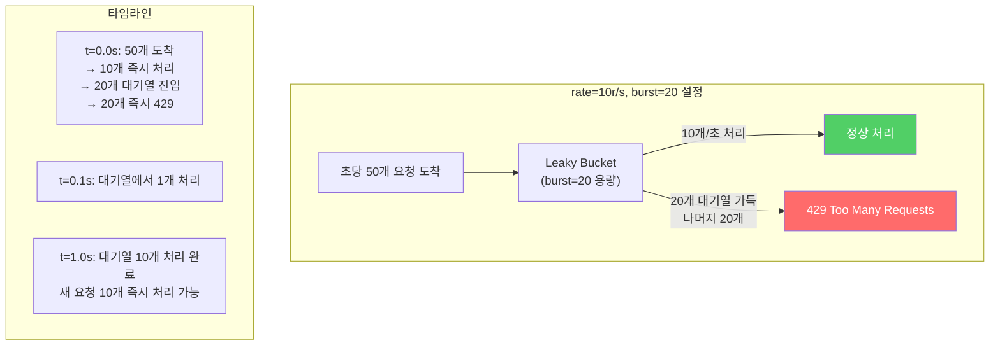

`nodelay` 옵션은 대기열의 요청도 즉시 처리한다. 단, 처리량은 제한된다.

- `burst=20` (nodelay 없음): 대기열에 들어간 요청은 `1/rate` 간격으로 순차 처리됨 (지연 발생)
- `burst=20 nodelay`: 대기열의 20개도 즉시 처리, 단 이후 새 요청은 거부됨 (지연 없음)

```nginx
http {
    # 공유 메모리 Zone 생성
    # $binary_remote_addr: 클라이언트 IP (binary 형식으로 저장, IPv4=4B, IPv6=16B)
    # zone=api_limit:10m: 10MB 공유 메모리에 IP별 상태 저장 (약 16만 IP)
    # rate=10r/s: 초당 10요청 허용
    limit_req_zone $binary_remote_addr zone=api_limit:10m rate=10r/s;

    # 로그인 엔드포인트는 더 엄격하게 (브루트포스 방지)
    limit_req_zone $binary_remote_addr zone=login_limit:1m rate=1r/s;

    # 연결 수 제한 Zone (DDoS 방어)
    limit_conn_zone $binary_remote_addr zone=conn_limit:10m;

    server {
        location /api/ {
            limit_req zone=api_limit burst=20 nodelay;
            limit_req_status 429;  # Too Many Requests

            proxy_pass http://backend;
        }

        location /auth/login {
            limit_req zone=login_limit burst=5;  # nodelay 없음 → 지연 처리
            limit_req_status 429;
            proxy_pass http://backend;
        }

        # IP당 최대 동시 연결 수 제한
        location / {
            limit_conn conn_limit 10;
            proxy_pass http://backend;
        }
    }
}
```

**Zone 메모리 크기 계산**: `$binary_remote_addr` 상태 하나가 약 64B를 차지한다. 10MB / 64B = 약 163,840개 IP의 상태를 저장할 수 있다.

---

## 1️⃣1️⃣ 무중단 재로드 동작원리

```bash
nginx -s reload
```

이 명령 하나가 어떻게 서비스 중단 없이 설정을 반영하는지, 내부 동작을 단계별로 살펴보자.

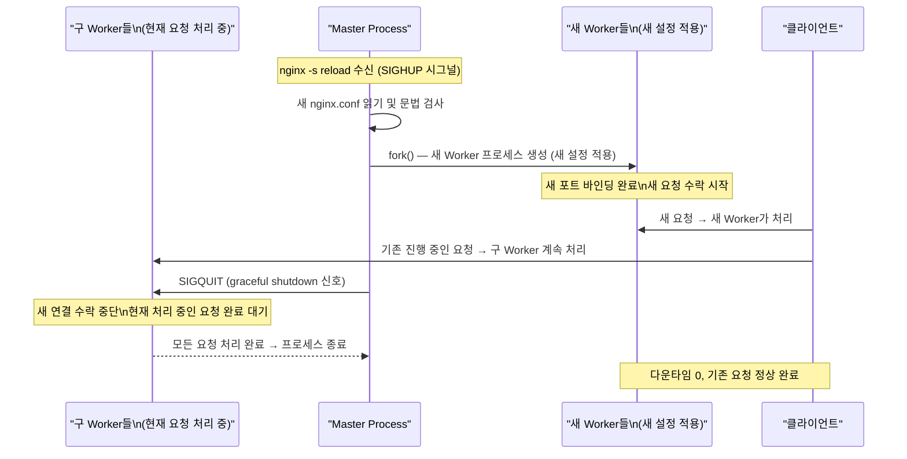

**이것이 가능한 이유**: Linux의 `SO_REUSEPORT` 소켓 옵션 덕분이다. 여러 프로세스가 같은 포트(80/443)를 동시에 바인딩할 수 있다. 새 Worker가 포트를 바인딩해도 구 Worker가 이미 처리 중인 연결에는 영향을 주지 않는다.

---

## 1️⃣2️⃣ 헬스체크와 페일오버 동작원리

Nginx OSS(무료 버전)는 패시브 헬스체크만 지원한다. 요청을 실제로 보내보고 실패하면 해당 서버를 임시 제외한다.

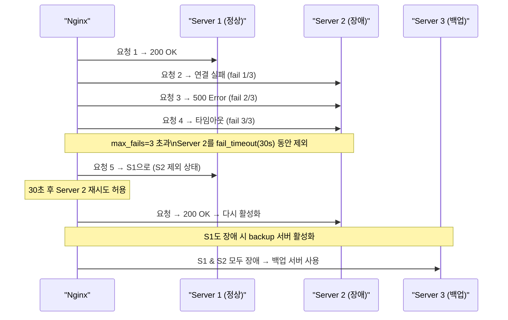

```nginx
upstream backend {
    server 10.0.0.1:8080 max_fails=3 fail_timeout=30s;
    server 10.0.0.2:8080 max_fails=3 fail_timeout=30s;
    server 10.0.0.3:8080 backup;  # 나머지 모두 장애 시 활성화

    keepalive 32;   # 업스트림 Keep-Alive 연결 풀 크기
}

server {
    location / {
        proxy_pass http://backend;
        proxy_http_version 1.1;
        proxy_set_header Connection "";  # Keep-Alive 활성화

        # 오류 발생 시 다음 서버로 자동 전환
        proxy_next_upstream error timeout http_500 http_502 http_503;
        proxy_next_upstream_tries 3;
        proxy_next_upstream_timeout 10s;
    }
}
```

---

## 1️⃣3️⃣ 보안 설정

### 보안 헤더

```nginx
http {
    server_tokens off;   # Server: nginx 헤더에서 버전 정보 제거

    # 보안 헤더
    add_header X-Frame-Options SAMEORIGIN always;                    # 클릭재킹 방지
    add_header X-Content-Type-Options nosniff always;               # MIME 스니핑 방지
    add_header X-XSS-Protection "1; mode=block" always;             # XSS 필터 강제
    add_header Referrer-Policy "strict-origin-when-cross-origin" always;
    add_header Content-Security-Policy "default-src 'self'; script-src 'self' 'unsafe-inline'" always;
    add_header Permissions-Policy "camera=(), microphone=(), geolocation=()" always;
}
```

### 요청 필터링 및 접근 제어

```nginx
server {
    # 허용된 HTTP 메서드만 수락
    if ($request_method !~ ^(GET|HEAD|POST|PUT|DELETE|PATCH)$) {
        return 405;
    }

    # 악성 봇/스캐너 차단
    if ($http_user_agent ~* (sqlmap|nikto|nmap|masscan)) {
        return 403;
    }

    # 버퍼 크기 제한 (버퍼 오버플로 공격 방어)
    client_body_buffer_size 1k;
    client_header_buffer_size 1k;
    client_max_body_size 10m;
    large_client_header_buffers 4 8k;

    # 타임아웃 (Slowloris 공격 방어 — 느리게 헤더를 보내는 공격)
    client_body_timeout 10s;
    client_header_timeout 10s;
    send_timeout 10s;

    # 관리자 경로는 내부 IP만 허용
    location /admin/ {
        allow 10.0.0.0/8;
        deny all;
        proxy_pass http://backend;
    }

    # 숨겨진 파일 접근 차단 (.git, .env 등)
    location ~ /\. {
        deny all;
        return 404;
    }

    # 백업/설정 파일 접근 차단
    location ~* \.(bak|config|sql|fla|psd|ini|log|sh|inc|swp|dist)$ {
        deny all;
        return 404;
    }
}
```

---

## 1️⃣4️⃣ WebSocket 프록시

WebSocket은 HTTP 업그레이드 프로토콜로 시작해 양방향 연결을 유지한다. Nginx가 이 연결을 유지하려면 특별한 설정이 필요하다.

```nginx
server {
    location /ws/ {
        proxy_pass http://websocket_backend;
        proxy_http_version 1.1;

        # WebSocket 업그레이드 헤더 전달 (없으면 업그레이드 실패)
        proxy_set_header Upgrade $http_upgrade;
        proxy_set_header Connection "upgrade";

        # WebSocket은 장시간 연결 유지 (기본 타임아웃으로는 끊김)
        proxy_read_timeout 3600s;
        proxy_send_timeout 3600s;

        # IP Hash: 같은 클라이언트는 같은 백엔드로 (세션 유지)
        # 업스트림에 ip_hash 또는 sticky 설정 권장
    }
}
```

---

## 1️⃣5️⃣ HTTP/2 및 gRPC 프록시

gRPC는 HTTP/2 기반 RPC 프레임워크다. Nginx는 1.13.10부터 gRPC 프록시를 네이티브로 지원한다. `grpc_pass` 디렉티브로 gRPC 백엔드를 연결하며, `proxy_pass`와 유사하지만 HTTP/2 프레임 레벨에서 동작한다.

```nginx
server {
    listen 443 ssl http2;

    # gRPC 백엔드 프록시
    location /grpc.service/ {
        grpc_pass grpc://127.0.0.1:50051;

        # gRPC 헤더 설정
        grpc_set_header Host            $host;
        grpc_set_header X-Real-IP       $remote_addr;

        # gRPC 타임아웃 (스트리밍 호출은 길게 설정)
        grpc_read_timeout  300s;
        grpc_send_timeout  300s;
    }

    # gRPC-Web (브라우저에서 gRPC 호출 시 사용)
    location /grpc-web/ {
        grpc_pass grpcs://127.0.0.1:50051;
    }
}
```

---

## 1️⃣6️⃣ 모니터링 — stub_status

Nginx의 내장 모니터링 모듈이다. 실시간 연결 상태를 확인할 수 있다. Prometheus exporter 등 외부 모니터링 도구와 연동할 때 이 엔드포인트를 스크래핑한다.

```nginx
server {
    listen 127.0.0.1:8080;  # 내부에서만 접근

    location /nginx_status {
        stub_status on;
        allow 127.0.0.1;
        deny all;
    }
}
```

**출력 예시:**
```
Active connections: 291
server accepts handled requests
 16630948 16630948 31070465
Reading: 6 Writing: 179 Waiting: 106
```

| 항목 | 설명 |
|------|------|
| Active connections | 현재 활성 연결 수 |
| accepts | 수락된 총 연결 수 |
| handled | 처리된 총 연결 수 (accepts와 다르면 리소스 부족) |
| requests | 처리된 총 요청 수 |
| Reading | 요청 헤더를 읽는 중인 연결 |
| Writing | 응답을 쓰는 중인 연결 |
| Waiting | Keep-Alive 상태로 대기 중인 유휴 연결 |

---

## 1️⃣7️⃣ 성능 최적화 튜닝

```nginx
worker_processes auto;
worker_cpu_affinity auto;          # CPU 코어 자동 바인딩
worker_rlimit_nofile 65535;

events {
    worker_connections 4096;
    use epoll;
    multi_accept on;
    accept_mutex off;              # Linux 3.9+ 성능 향상
}

http {
    # 파일 전송 최적화
    sendfile           on;
    sendfile_max_chunk 1m;         # sendfile 호출당 최대 전송 크기
    tcp_nopush         on;
    tcp_nodelay        on;

    # Keep-Alive 최적화
    keepalive_timeout     65;
    keepalive_requests    10000;   # Keep-Alive당 최대 요청 수

    # 해시 테이블 최적화
    server_names_hash_bucket_size 64;
    types_hash_max_size           2048;

    # 오픈 파일 캐시 — 자주 접근하는 파일의 디스크립터를 메모리에 캐싱
    open_file_cache          max=65535 inactive=20s;
    open_file_cache_valid    30s;
    open_file_cache_min_uses 2;
    open_file_cache_errors   on;

    # Gzip 최적화
    gzip                on;
    gzip_vary           on;        # Vary: Accept-Encoding 헤더 추가
    gzip_proxied        any;       # 프록시 응답도 압축
    gzip_comp_level     6;
    gzip_min_length     1024;
    gzip_buffers        16 8k;
    gzip_http_version   1.1;
    gzip_types
        text/plain
        text/css
        text/xml
        text/javascript
        application/json
        application/javascript
        application/xml
        application/rss+xml
        image/svg+xml;

    # 클라이언트 버퍼
    client_body_buffer_size     128k;
    client_max_body_size        100m;
    client_header_buffer_size   1k;
    large_client_header_buffers 4 8k;

    # 타임아웃
    client_body_timeout   12s;
    client_header_timeout 12s;
    send_timeout          10s;
}
```

---

## 1️⃣8️⃣ 극한 시나리오

### 100 TPS — 기본 설정으로 충분

초당 100요청은 Nginx 기본 설정으로 문제없다. 병목은 Nginx가 아니라 데이터베이스나 백엔드 서버에 있을 가능성이 높다.

```nginx
worker_processes auto;        # CPU 코어 수
worker_connections 1024;      # 기본값으로 충분

# 최대 처리: 4코어 × 1024 = 4,096 동시 연결
# 100 TPS에서는 여유 있음
```

### 10,000 TPS — 튜닝 필요

```nginx
worker_processes auto;
worker_rlimit_nofile 65535;
worker_cpu_affinity auto;    # CPU 코어에 1:1 바인딩

events {
    worker_connections 4096;
    use epoll;
    multi_accept on;
    accept_mutex off;         # Linux 3.9+에서 성능 향상
}

http {
    sendfile on;
    tcp_nopush on;
    tcp_nodelay on;
    keepalive_timeout 30s;
    keepalive_requests 1000;

    upstream backend {
        server 10.0.0.1:8080;
        server 10.0.0.2:8080;
        keepalive 100;         # 업스트림 연결 풀: 100개 유지
    }
}
```

OS 레벨 튜닝도 필요하다:

```bash
# /etc/sysctl.conf
net.core.somaxconn = 65535
net.core.netdev_max_backlog = 65535
net.ipv4.tcp_max_syn_backlog = 65535
net.ipv4.tcp_tw_reuse = 1        # TIME_WAIT 소켓 재사용
net.ipv4.tcp_fin_timeout = 10
net.ipv4.tcp_keepalive_time = 300
net.ipv4.ip_local_port_range = 1024 65535
fs.file-max = 2097152
```

### 100,000 TPS — 수평 확장 필수

단일 Nginx 인스턴스의 이론상 최대 처리량은 하드웨어와 요청 복잡도에 따라 다르지만, 일반적으로 단일 서버에서 수만 TPS가 한계다. 100,000 TPS에서는 수평 확장이 필요하다.

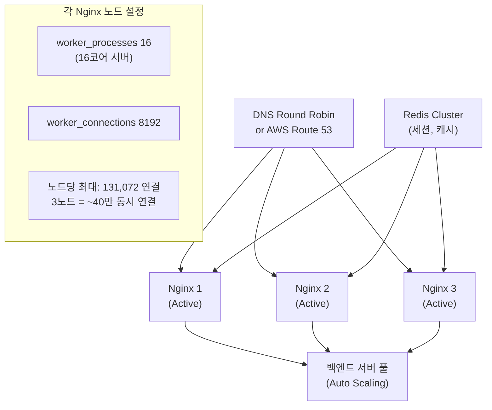

---

## 1️⃣9️⃣ 프로덕션 완성 예시

```nginx
# 전체 아키텍처
# 클라이언트 → Nginx (리버스 프록시) → Spring Boot 앱들

upstream spring_backend {
    least_conn;
    server 10.0.1.1:8080 max_fails=3 fail_timeout=30s;
    server 10.0.1.2:8080 max_fails=3 fail_timeout=30s;
    server 10.0.1.3:8080 max_fails=3 fail_timeout=30s;
    keepalive 32;
}

proxy_cache_path /var/cache/nginx levels=1:2 keys_zone=api_cache:10m max_size=1g;
limit_req_zone $binary_remote_addr zone=api_rate:10m rate=100r/s;

server {
    listen 443 ssl http2;
    server_name api.myapp.com;

    ssl_certificate /etc/letsencrypt/live/api.myapp.com/fullchain.pem;
    ssl_certificate_key /etc/letsencrypt/live/api.myapp.com/privkey.pem;

    # 보안 헤더
    add_header Strict-Transport-Security "max-age=31536000" always;
    add_header X-Frame-Options DENY always;
    add_header X-Content-Type-Options nosniff always;

    # API 엔드포인트
    location /api/ {
        limit_req zone=api_rate burst=200 nodelay;

        proxy_pass http://spring_backend;
        proxy_http_version 1.1;
        proxy_set_header Host $host;
        proxy_set_header X-Real-IP $remote_addr;
        proxy_set_header X-Forwarded-For $proxy_add_x_forwarded_for;
        proxy_set_header X-Forwarded-Proto $scheme;
        proxy_set_header Connection "";

        # GET 요청 캐싱
        proxy_cache api_cache;
        proxy_cache_methods GET;
        proxy_cache_valid 200 5m;
        proxy_cache_bypass $http_authorization;  # 인증 요청은 캐시 안 함
        add_header X-Cache-Status $upstream_cache_status;
    }

    # 정적 파일
    location /static/ {
        root /var/www;
        expires 1y;
        add_header Cache-Control "public, immutable";
        gzip_static on;
    }

    # 헬스체크
    location /health {
        return 200 "OK";
        access_log off;
    }
}
```

---

## 핵심 요약

Nginx의 성능은 "이벤트 루프 + epoll + Worker 프로세스" 3가지의 조합에서 나온다. Apache가 요청마다 스레드를 만드는 동안, Nginx의 Worker는 epoll로 수천 개 소켓을 동시에 감시하다가 실제 데이터가 도착한 소켓만 처리한다.

로드밸런싱 알고리즘 선택은 트래픽 특성에 따라 달라진다. 서버 동질적이면 Round Robin, 성능 차이가 있으면 Weighted Round Robin, 세션 유지가 필요하면 IP Hash, 요청 처리 시간이 들쭉날쭉하면 Least Connection이 적합하다.

SSL Termination, 캐싱, Rate Limiting 모두 Nginx 레이어에서 처리함으로써 백엔드 서버는 순수한 비즈니스 로직에만 집중할 수 있다.

| 기능 | 동작 핵심 |
|------|-----------|
| 이벤트 기반 | epoll로 I/O 이벤트 감시, 대기 중 CPU 0% |
| Worker 프로세스 | CPU 코어 수만큼, 독립 이벤트 루프 |
| Round Robin | 인덱스 순환, O(1) |
| Weighted RR | Smooth WRR 알고리즘으로 비율 보장 |
| IP Hash | IP 앞 3옥텟 해싱 → 서버 고정 |
| Least Connection | 실시간 연결 수 추적, 최소값 선택 |
| SSL Termination | 핸드셰이크를 Nginx가 담당, 세션 캐시로 재사용 |
| Rate Limiting | Leaky Bucket 알고리즘 + 연결 수 제한 |
| Proxy Cache | 파일 시스템 기반, 키 해시로 디렉토리 분산 |
| 무중단 재로드 | 새 Worker 생성 후 구 Worker graceful shutdown |
| gRPC 프록시 | HTTP/2 네이티브 지원, grpc_pass 디렉티브 |
| 모니터링 | stub_status로 실시간 연결 상태 확인 |
