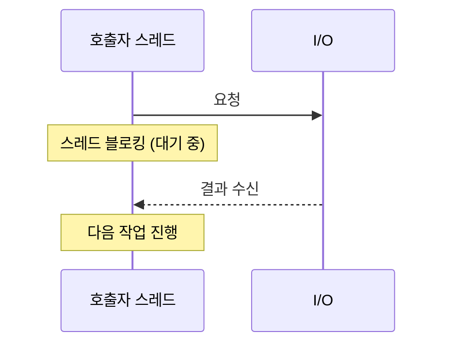
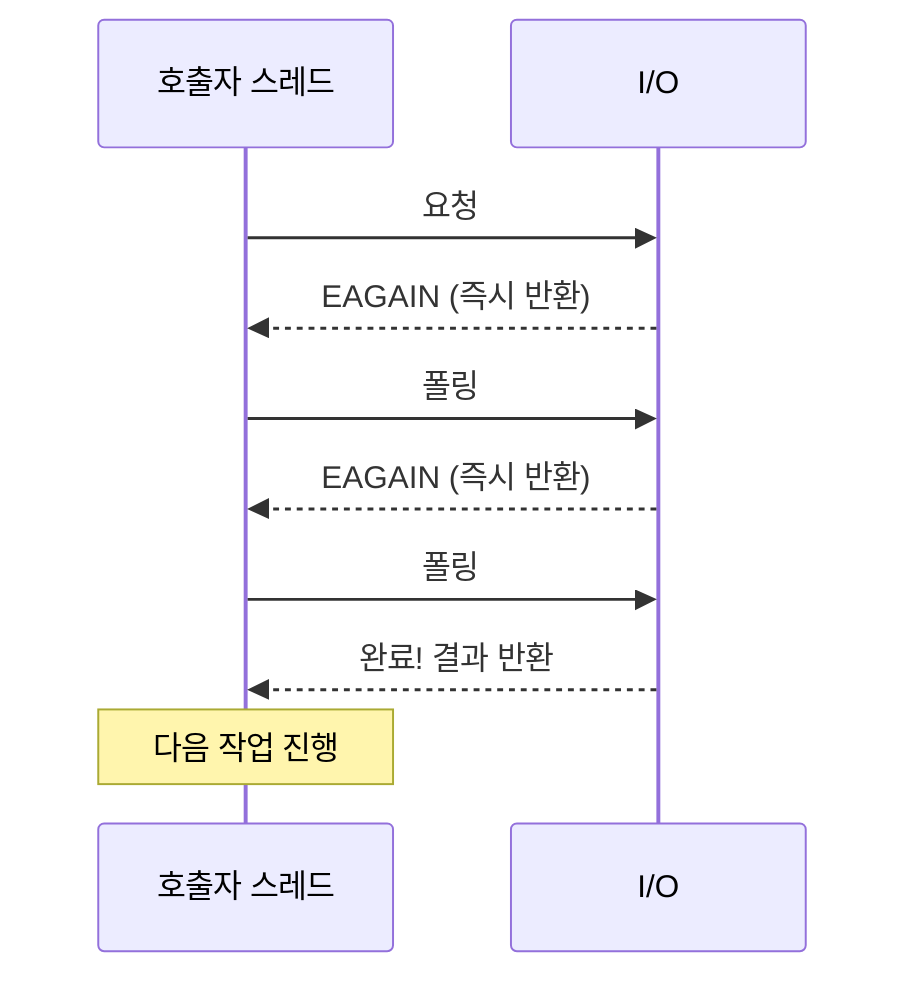
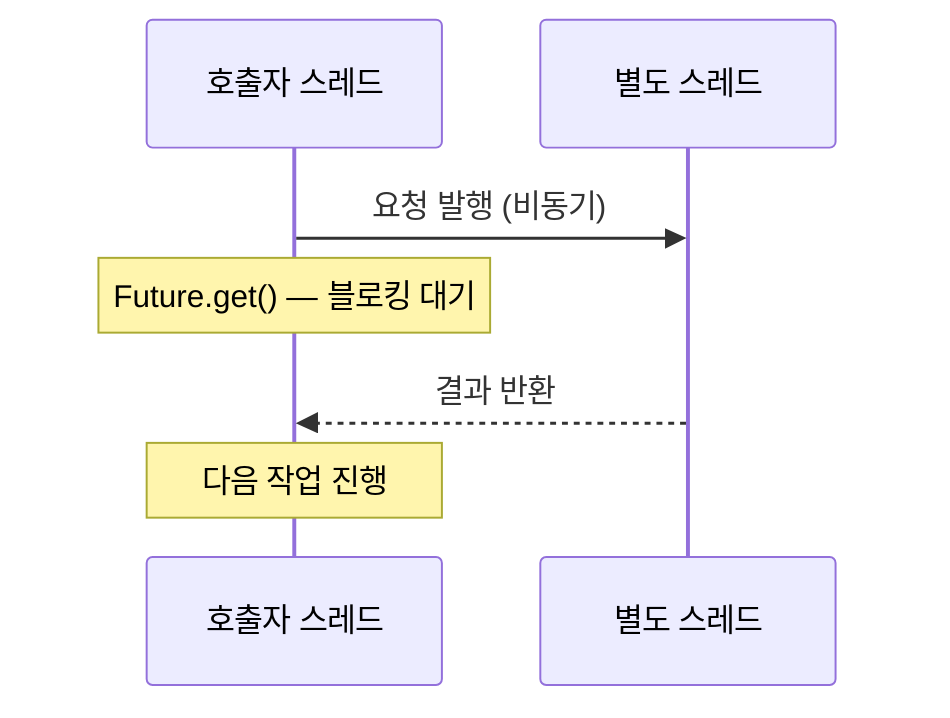
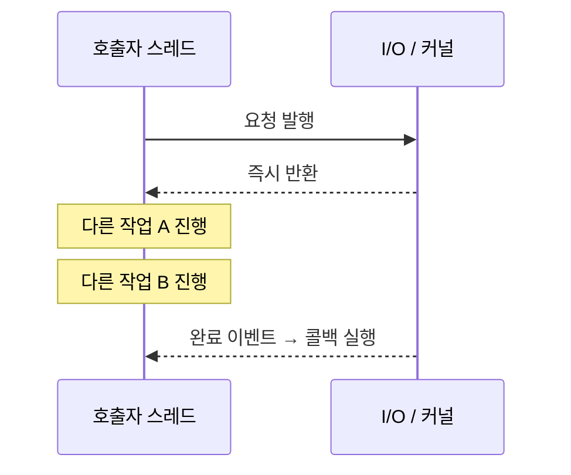
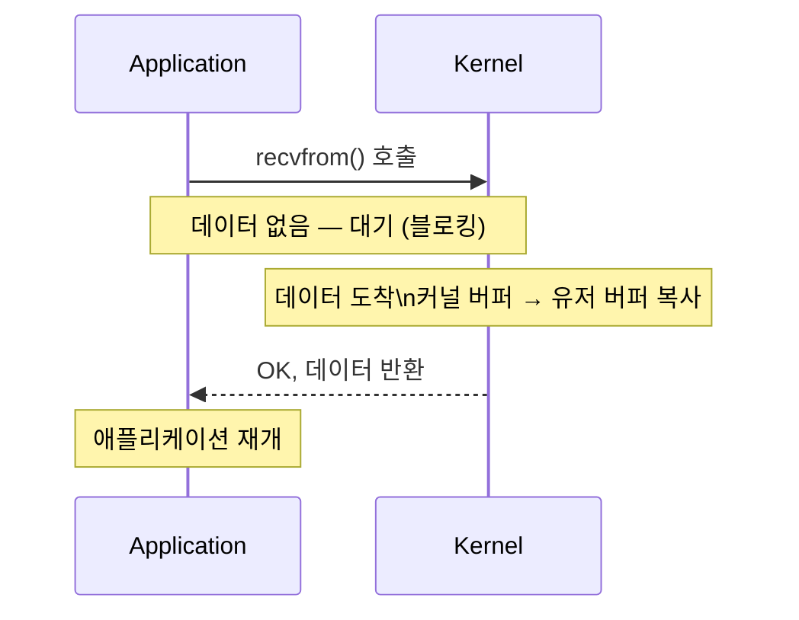
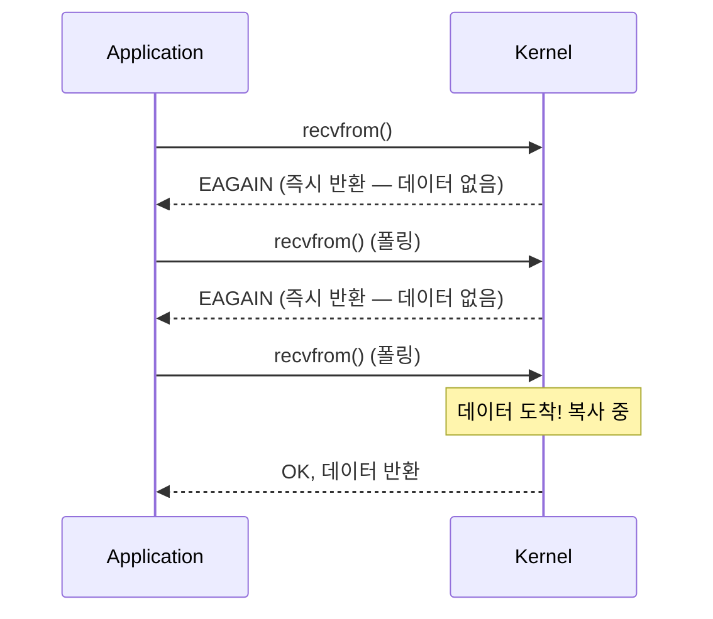
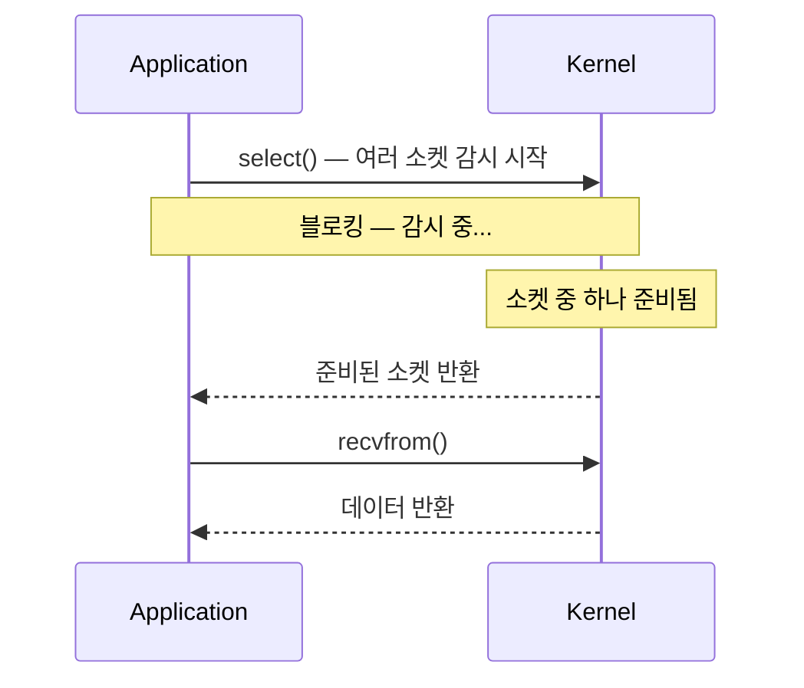
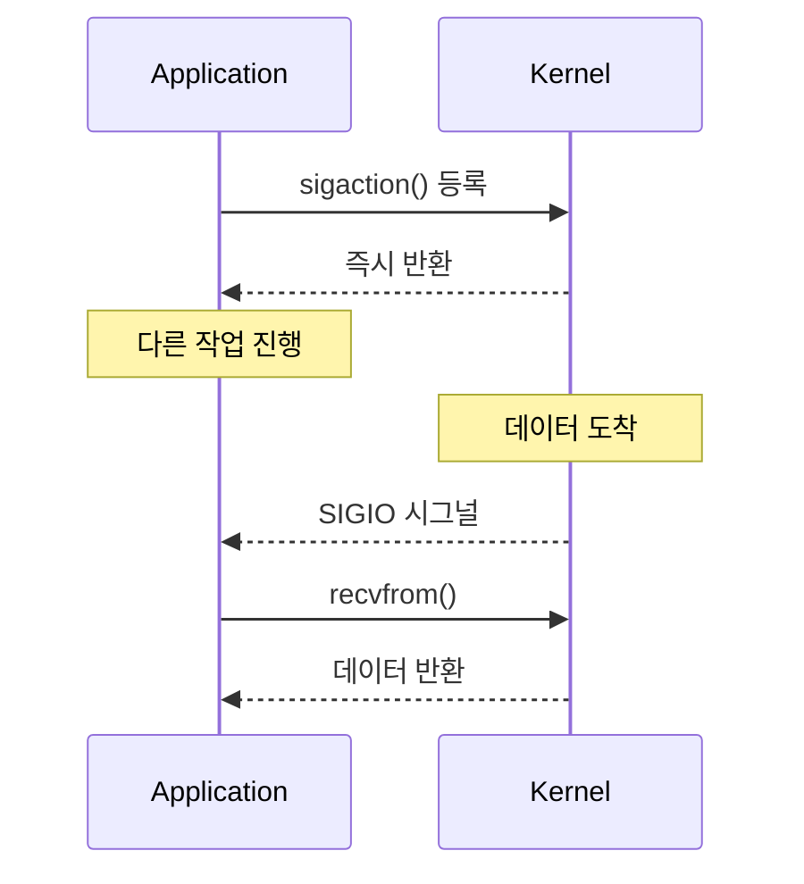
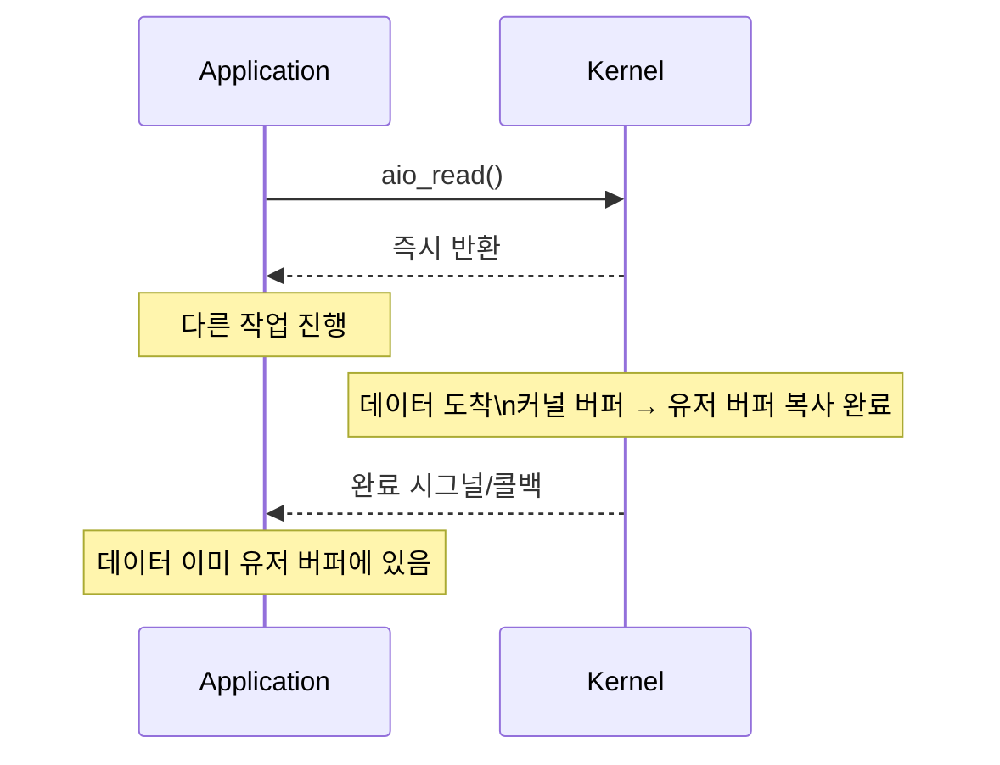

동기(Synchronous), 비동기(Asynchronous), 블로킹(Blocking), 논블로킹(Non-blocking)은 I/O와 동시성 프로그래밍에서 자주 혼용되는 개념이다. 이 네 가지는 서로 독립된 두 축이며, 조합에 따라 4가지 모드가 만들어진다.

> 비유: 음식점에서 음식을 기다리는 방법은 여러 가지다. 자리에서 주문하고 음식이 올 때까지 다른 아무것도 안 하면 동기+블로킹, 진동벨을 받고 돌아다니다가 벨이 울리면 받으러 가면 비동기+논블로킹이다.

---

## 핵심 개념 정의

### 동기(Synchronous) vs 비동기(Asynchronous)

**동기**와 **비동기**는 **결과를 어떻게 받는가**에 관한 개념이다.

| | 동기 | 비동기 |
|--|------|--------|
| 결과 수신 | 호출자가 직접 기다려 결과를 받음 | 결과를 나중에 콜백/이벤트/Future로 받음 |
| 제어 흐름 | 결과가 올 때까지 다음 코드 실행 안 함 | 결과와 무관하게 다음 코드 바로 실행 |
| 주체 | 호출자가 완료를 직접 확인 | 시스템/런타임이 완료를 알려줌 |

### 블로킹(Blocking) vs 논블로킹(Non-blocking)

**블로킹**과 **논블로킹**은 **I/O 대기 중 스레드가 어떻게 동작하는가**에 관한 개념이다.

| | 블로킹 | 논블로킹 |
|--|--------|----------|
| I/O 대기 중 | 스레드가 멈춰서 대기 | 스레드가 즉시 반환되어 다른 작업 가능 |
| 커널 관점 | 데이터 준비 전까지 시스템 콜 반환 안 함 | 데이터 미준비 시 즉시 EAGAIN/EWOULDBLOCK 반환 |
| 스레드 활용 | 대기 중 CPU 낭비 | 대기 중 다른 작업 가능 |

---

## 4가지 조합

### 1. 동기 + 블로킹 (Synchronous Blocking)

> 비유: 전화를 걸고 상대방이 받을 때까지 수화기를 들고 기다린다. 그 동안 아무것도 할 수 없다.

가장 일반적인 방식. 결과를 기다리는 동안 스레드가 멈춘다.



```java
// Java - 전통적인 블로킹 I/O
try (Socket socket = new Socket("example.com", 80)) {
    InputStream in = socket.getInputStream();
    byte[] buffer = new byte[1024];
    int bytesRead = in.read(buffer); // 데이터가 올 때까지 블로킹
    System.out.println("받은 바이트: " + bytesRead);
}

// JDBC 쿼리
Connection conn = DriverManager.getConnection(url, user, password);
PreparedStatement ps = conn.prepareStatement("SELECT * FROM users WHERE id = ?");
ps.setLong(1, 1L);
ResultSet rs = ps.executeQuery(); // 쿼리 완료까지 블로킹
```

**특징**
- 코드가 단순하고 직관적
- 스레드당 하나의 요청만 처리 가능
- 대용량 동시 처리 시 스레드 폭발 문제

**사용 사례**: 전통적인 Spring MVC, JDBC, 일반 파일 I/O

---

### 2. 동기 + 논블로킹 (Synchronous Non-blocking)

> 비유: 음식점에서 "아직 됐어요?" 하고 반복해서 물어본다. 스레드는 막히지 않지만 계속 확인하느라 CPU를 낭비한다.

I/O 시스템 콜은 즉시 반환하지만, 호출자가 직접 반복 폴링(polling)해서 결과를 확인한다.



```java
// Java NIO - 논블로킹 소켓
SocketChannel channel = SocketChannel.open();
channel.configureBlocking(false); // 논블로킹 모드 설정
channel.connect(new InetSocketAddress("example.com", 80));

// 연결 완료까지 직접 폴링
while (!channel.finishConnect()) {
    // 연결 대기 중 다른 작업 가능하지만, 여기선 spin-wait
    Thread.onSpinWait();
}

ByteBuffer buffer = ByteBuffer.allocate(1024);
int bytesRead;
while ((bytesRead = channel.read(buffer)) == 0) {
    // 데이터 없으면 0 반환 → 폴링 반복
    Thread.onSpinWait();
}
```

**특징**
- I/O 대기 중 스레드가 반환되지만, 폴링으로 CPU를 계속 사용
- 단독으로 쓰이기보다 Selector와 결합해서 사용
- CPU 낭비(busy-waiting) 문제 있음

**사용 사례**: NIO Selector 내부 동작, 게임 루프에서의 I/O 처리

---

### 3. 비동기 + 블로킹 (Asynchronous Blocking)

> 비유: 진동벨을 받았지만 카운터 앞에 서서 벨이 울릴 때까지 기다린다. 비동기로 시작했지만 결국 블로킹하는 안티패턴이다.

드문 조합. 비동기로 요청하지만 결과를 받을 때 블로킹한다.



```java
// Java Future - 비동기 요청 후 블로킹 대기
ExecutorService executor = Executors.newCachedThreadPool();

Future<String> future = executor.submit(() -> {
    // 별도 스레드에서 실행 (비동기)
    Thread.sleep(1000);
    return "결과";
});

// 결과를 기다리며 블로킹 → 비동기의 이점이 반감됨
String result = future.get(); // 블로킹!
System.out.println(result);
```

**특징**
- 비동기로 시작했지만 결과 수집 시 블로킹
- `Future.get()` 패턴이 대표적
- 실질적인 이점이 없어 안티패턴으로 간주됨

**사용 사례**: 여러 Future를 병렬 실행 후 한꺼번에 join하는 경우에는 의미 있음

```java
// 의미 있는 경우: 여러 작업 병렬 실행
Future<String> f1 = executor.submit(() -> callApi1());
Future<String> f2 = executor.submit(() -> callApi2());
Future<String> f3 = executor.submit(() -> callApi3());

// 각각 독립 실행 후 결과 수집
String r1 = f1.get();
String r2 = f2.get();
String r3 = f3.get();
```

---

### 4. 비동기 + 논블로킹 (Asynchronous Non-blocking)

> 비유: 진동벨을 받고 자리에 앉아 다른 일을 한다. 벨이 울리면 그때 가서 음식을 받는다. 스레드를 막지 않고 완료 시 콜백으로 통보된다.

가장 효율적인 조합. 요청 후 즉시 반환되고, 완료 시 콜백/이벤트로 통보된다.



```java
// Java NIO2 (AsynchronousSocketChannel)
AsynchronousSocketChannel channel = AsynchronousSocketChannel.open();

channel.connect(new InetSocketAddress("example.com", 80), null,
    new CompletionHandler<Void, Void>() {
        @Override
        public void completed(Void result, Void attachment) {
            // 연결 완료 콜백 (다른 스레드에서 실행)
            ByteBuffer buffer = ByteBuffer.allocate(1024);
            channel.read(buffer, buffer, new CompletionHandler<Integer, ByteBuffer>() {
                @Override
                public void completed(Integer bytesRead, ByteBuffer buf) {
                    // 읽기 완료 콜백
                    System.out.println("받은 바이트: " + bytesRead);
                }
                @Override
                public void failed(Throwable exc, ByteBuffer buf) {
                    exc.printStackTrace();
                }
            });
        }
        @Override
        public void failed(Throwable exc, Void attachment) {
            exc.printStackTrace();
        }
    }
);

// 연결 대기 없이 즉시 다음 코드 실행
System.out.println("연결 요청 발행 완료, 다른 작업 진행");
```

**CompletableFuture (콜백 지옥 개선)**
```java
CompletableFuture.supplyAsync(() -> callExternalApi())
    .thenApply(response -> parseResponse(response))
    .thenCompose(data -> saveToDatabase(data))
    .thenAccept(saved -> log.info("저장 완료: {}", saved))
    .exceptionally(ex -> {
        log.error("처리 실패", ex);
        return null;
    });
```

**Project Reactor (WebFlux)**
```java
webClient.get()
    .uri("/api/data")
    .retrieve()
    .bodyToMono(Data.class)
    .map(data -> transform(data))
    .flatMap(data -> saveReactive(data))
    .subscribe(
        result -> log.info("완료: {}", result),
        error -> log.error("실패", error)
    );
```

**특징**
- 스레드를 블로킹하지 않아 리소스 효율 최대
- 코드 복잡도가 높음(콜백, 리액티브 체인)
- 대용량 동시 I/O에 최적

**사용 사례**: Spring WebFlux, Node.js, Netty, Redis Lettuce

---

## Unix I/O 모델 5가지

Unix/Linux 시스템에서 I/O는 5가지 모델로 분류된다. (W. Richard Stevens, "Unix Network Programming" 기준)

### 1. Blocking I/O



### 2. Non-blocking I/O



### 3. I/O Multiplexing (select/poll/epoll)

하나의 스레드로 여러 소켓을 감시할 수 있다. Java NIO Selector가 이 방식이다.



**epoll (Linux 고성능 방식)**

| 방식 | 복잡도 | 설명 |
|------|--------|------|
| select/poll | O(n) | 감시 중인 모든 fd를 순회 |
| epoll | O(1) | 준비된 fd만 반환 |

Java NIO `Selector`는 내부적으로 epoll(Linux), kqueue(macOS)를 사용한다.

```java
Selector selector = Selector.open();
ServerSocketChannel serverChannel = ServerSocketChannel.open();
serverChannel.configureBlocking(false);
serverChannel.bind(new InetSocketAddress(8080));
serverChannel.register(selector, SelectionKey.OP_ACCEPT);

while (true) {
    int readyCount = selector.select(); // 준비된 채널이 생길 때까지 블로킹
    if (readyCount == 0) continue;

    Set<SelectionKey> selectedKeys = selector.selectedKeys();
    Iterator<SelectionKey> iter = selectedKeys.iterator();

    while (iter.hasNext()) {
        SelectionKey key = iter.next();
        iter.remove();

        if (key.isAcceptable()) {
            SocketChannel client = serverChannel.accept();
            client.configureBlocking(false);
            client.register(selector, SelectionKey.OP_READ);
        } else if (key.isReadable()) {
            SocketChannel client = (SocketChannel) key.channel();
            ByteBuffer buffer = ByteBuffer.allocate(1024);
            int bytesRead = client.read(buffer);
            if (bytesRead == -1) {
                client.close();
            } else {
                // 데이터 처리
                buffer.flip();
                System.out.println(StandardCharsets.UTF_8.decode(buffer));
            }
        }
    }
}
```

### 4. Signal-driven I/O (SIGIO)

소켓이 준비되면 커널이 SIGIO 시그널을 보낸다. 잘 사용하지 않는다.



### 5. Asynchronous I/O (aio_read)

데이터 복사(커널 버퍼 → 유저 버퍼)까지 완료된 후 통보된다. Java의 `AsynchronousSocketChannel`이 이 방식이다.



**5가지 모델 비교**

| 모델 | I/O 대기 | 데이터 복사 대기 | 동기/비동기 | 블로킹/논블로킹 |
|------|----------|-----------------|------------|----------------|
| Blocking I/O | 블로킹 | 블로킹 | 동기 | 블로킹 |
| Non-blocking I/O | 즉시 반환 | 블로킹 | 동기 | 논블로킹 |
| I/O Multiplexing | 블로킹(select) | 블로킹 | 동기 | 블로킹(select 단계) |
| Signal-driven | 즉시 반환 | 블로킹 | 동기 | 논블로킹 |
| Asynchronous I/O | 즉시 반환 | 즉시 반환 | 비동기 | 논블로킹 |

---

## Java 구현

### Java IO vs NIO vs NIO.2

| | java.io (BIO) | java.nio (NIO) | java.nio (NIO.2 / AIO) |
|--|---------------|----------------|------------------------|
| 패키지 | java.io | java.nio | java.nio.channels (Async) |
| 방식 | 동기 블로킹 | 동기 논블로킹 | 비동기 논블로킹 |
| 스트림 | Stream 기반 | Buffer 기반 | 콜백/Future 기반 |
| 대표 클래스 | InputStream/OutputStream | SocketChannel/Selector | AsynchronousSocketChannel |
| 등장 | Java 1.0 | Java 1.4 | Java 7 |

### BIO vs NIO 파일 읽기

```java
// BIO - InputStream
try (FileInputStream fis = new FileInputStream("data.txt");
     BufferedReader reader = new BufferedReader(new InputStreamReader(fis))) {
    String line;
    while ((line = reader.readLine()) != null) { // 블로킹
        System.out.println(line);
    }
}

// NIO - FileChannel + Buffer
try (FileChannel channel = FileChannel.open(Paths.get("data.txt"), StandardOpenOption.READ)) {
    ByteBuffer buffer = ByteBuffer.allocateDirect(4096); // Direct Buffer (OS 버퍼 직접 접근)
    while (channel.read(buffer) != -1) {
        buffer.flip();
        while (buffer.hasRemaining()) {
            System.out.print((char) buffer.get());
        }
        buffer.clear();
    }
}
```

### CompletableFuture - 비동기 조합

```java
// 여러 비동기 작업 조합
CompletableFuture<String> userFuture = CompletableFuture.supplyAsync(() -> fetchUser(userId));
CompletableFuture<String> orderFuture = CompletableFuture.supplyAsync(() -> fetchOrder(orderId));

// 두 작업이 모두 완료되면 조합
CompletableFuture<String> combined = userFuture.thenCombine(orderFuture,
    (user, order) -> "User: " + user + ", Order: " + order
);

// 결과 처리 (블로킹 없이)
combined.thenAccept(result -> log.info(result))
        .exceptionally(ex -> {
            log.error("실패", ex);
            return null;
        });
```

### Spring WebFlux - 리액티브

```java
@Service
@RequiredArgsConstructor
public class OrderService {

    private final WebClient webClient;
    private final R2dbcOrderRepository orderRepository;

    // 비동기 논블로킹 파이프라인
    public Mono<OrderResponse> createOrder(OrderRequest request) {
        return validateInventory(request.productId())  // 재고 확인 (외부 API)
            .flatMap(available -> {
                if (!available) {
                    return Mono.error(new OutOfStockException());
                }
                return orderRepository.save(Order.from(request)); // R2DBC 논블로킹
            })
            .flatMap(order -> notifyUser(order.userId()).thenReturn(order)) // 알림 발송
            .map(OrderResponse::from)
            .timeout(Duration.ofSeconds(5))
            .onErrorMap(TimeoutException.class, e -> new ServiceTimeoutException());
    }

    private Mono<Boolean> validateInventory(Long productId) {
        return webClient.get()
            .uri("/inventory/{id}", productId)
            .retrieve()
            .bodyToMono(InventoryResponse.class)
            .map(InventoryResponse::isAvailable);
    }
}
```

---

## 정리

| 구분 | 핵심 질문 |
|------|----------|
| 동기 vs 비동기 | 결과를 누가 어떻게 받는가 |
| 블로킹 vs 논블로킹 | I/O 대기 중 스레드가 어떻게 동작하는가 |

| 조합 | 대표 기술 | 특징 |
|------|----------|------|
| 동기 + 블로킹 | 전통 Spring MVC, JDBC | 심플, 낮은 처리량 |
| 동기 + 논블로킹 | NIO Selector | Netty 내부 구조 |
| 비동기 + 블로킹 | Future.get() | 안티패턴 (병렬 수집 시에만 유효) |
| 비동기 + 논블로킹 | WebFlux, CompletableFuture | 복잡, 높은 처리량 |

> **Java 21 Virtual Thread**: 동기 블로킹 코드로 작성하지만 내부적으로 비동기처럼 동작 — 복잡한 리액티브 없이 높은 처리량 달성 가능
