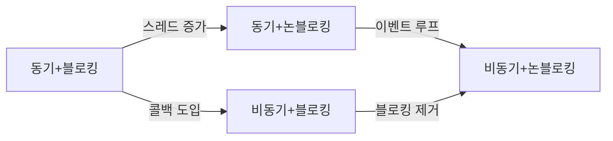
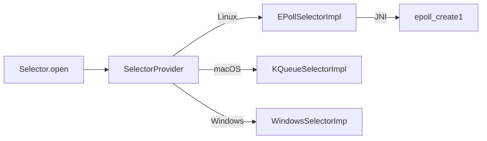
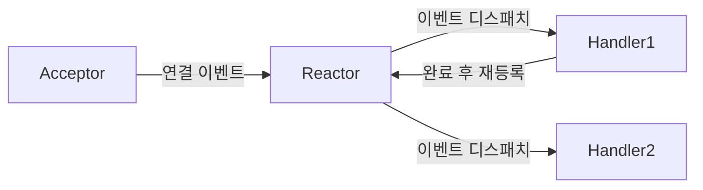
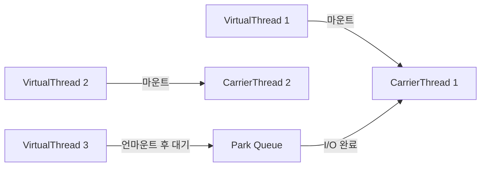

동기(Synchronous), 비동기(Asynchronous), 블로킹(Blocking), 논블로킹(Non-blocking)은 I/O와 동시성 프로그래밍에서 가장 자주 혼용되는 개념이다. 단순히 "블로킹은 스레드가 기다리는 것"이라는 암기 수준을 넘어, **왜 그렇게 동작하는지** — 커널 내부, CPU 레지스터, 컨텍스트 스위치 비용, 그리고 Spring 실무까지 — 를 완전히 이해해야 시니어 면접과 실제 설계에서 쓸 수 있다.

> **비유로 먼저 잡기**: 음식점에서 음식을 기다리는 방법은 네 가지다. 카운터 앞에 서서 눈도 못 돌리고 기다리면 동기+블로킹, "됐어요?" 하고 계속 들락날락하면 동기+논블로킹, 진동벨 받고 카운터 앞에 서서 울릴 때까지 기다리면 비동기+블로킹(안티패턴), 진동벨 받고 자리에서 독서하다 벨 울리면 받으러 가면 비동기+논블로킹이다.

---

## 1. 핵심 개념 정의 — 두 축의 독립성

### 동기(Synchronous) vs 비동기(Asynchronous)

**동기와 비동기는 "결과를 누가, 언제 확인하는가"에 관한 제어 흐름 개념이다.**

| 구분 | 동기 | 비동기 |
|--|------|--------|
| 결과 수신 | 호출자가 직접 기다려 결과를 받음 | 결과를 나중에 콜백/이벤트/Future로 받음 |
| 제어 흐름 | 결과가 올 때까지 다음 코드 실행 안 함 | 결과와 무관하게 다음 코드 즉시 실행 |
| 완료 확인 주체 | 호출자가 직접 폴링하거나 대기 | 시스템/런타임이 완료를 알려줌 |

동기/비동기는 **I/O 대기 중 스레드가 멈추는가와 무관하다.** 스레드가 멈추지 않아도 결과를 직접 확인하면 동기고, 스레드가 멈춰도 결과 통보를 시스템이 해주면 비동기다.

### 블로킹(Blocking) vs 논블로킹(Non-blocking)

**블로킹과 논블로킹은 "I/O 대기 중 스레드(OS 관점)가 어떻게 동작하는가"에 관한 I/O 모델 개념이다.**

| 구분 | 블로킹 | 논블로킹 |
|--|--------|----------|
| 시스템 콜 | 데이터 준비 전까지 반환 안 함 | 즉시 EAGAIN/EWOULDBLOCK 반환 |
| 스레드 상태 | WAITING 상태 — CPU 스케줄링 대상에서 제외 | RUNNABLE 상태 유지 |
| 커널 행동 | 스레드를 wait queue에 넣고 I/O 완료 시 wake up | 즉시 제어 반환, 재시도는 호출자 책임 |

**두 축이 독립적인 이유**: 비동기 요청 후 `Future.get()`으로 결과를 기다리면 비동기 호출이지만 블로킹 대기다. NIO 폴링은 논블로킹 시스템 콜이지만 호출자가 직접 확인하므로 동기다.



---

## 2. 컨텍스트 스위치(Context Switch) — 블로킹 비용의 실체

블로킹이 왜 "비싼가"를 이해하려면 컨텍스트 스위치가 내부적으로 무슨 일을 하는지 알아야 한다. 이것이 논블로킹, 가상 스레드, 이벤트 루프가 존재하는 근본 이유다.

### 2.1 컨텍스트 스위치란 무엇인가

스레드가 블로킹 I/O 시스템 콜(read, write, accept 등)을 호출하면, 커널은 해당 스레드를 **대기 상태(WAITING)**로 전환하고 다른 스레드에게 CPU를 넘긴다. 이 전환 과정 전체를 컨텍스트 스위치라 한다.


### 2.2 CPU 레지스터 저장/복원

컨텍스트 스위치가 발생하면 커널은 현재 실행 중인 스레드의 CPU 상태를 **PCB(Process Control Block)** 또는 **TCB(Thread Control Block)**에 저장한다. 저장 대상은 다음과 같다.

| 레지스터 그룹 | x86-64 기준 | 역할 |
|---|---|---|
| 범용 레지스터 | rax, rbx, rcx, rdx, rsi, rdi, r8~r15 | 연산 피연산자, 함수 인자 |
| 스택 포인터 | rsp | 현재 스택 최상단 주소 |
| 명령 포인터 | rip | 다음 실행할 명령어 주소 |
| 플래그 레지스터 | rflags | 조건 코드(ZF, CF, SF 등) |
| 세그먼트 레지스터 | cs, ss, ds, es, fs, gs | 메모리 세그먼트 기준 |
| FPU/SSE 상태 | xmm0~xmm15, st0~st7 | 부동소수점, SIMD 연산 상태 |

x86-64에서 범용 레지스터만 해도 16개 × 8바이트 = 128바이트, FPU 상태까지 포함하면 수백 바이트를 메모리에 쓰고 새 스레드 것을 읽는 작업이 발생한다.

### 2.3 커널 모드 전환(Kernel Mode Switch) 오버헤드

블로킹 시스템 콜은 반드시 **유저 모드 → 커널 모드** 전환을 수반한다. 이 전환 자체도 비용이 있다.

**유저 모드 → 커널 모드 전환 절차 (syscall 명령 기준):**

1. `syscall` 명령 실행 → CPU가 MSR(Model-Specific Register)에 기록된 커널 진입점으로 점프
2. 스택을 커널 스택으로 교체 (GS 레지스터 기반 per-CPU 데이터 참조)
3. 유저 레지스터를 커널 스택에 저장 (pt_regs 구조체)
4. 시스템 콜 번호로 sys_call_table 조회 → 해당 핸들러 실행
5. 복귀 시 저장된 레지스터 복원 → `sysret` 명령으로 유저 모드 복귀

이 과정에서 **Spectre/Meltdown 패치(KPTI, Retpoline)** 적용 후에는 추가 비용이 발생한다. KPTI는 커널 진입/복귀 시 페이지 테이블 전체를 교체하기 때문이다.

### 2.4 TLB Flush와 캐시 무효화

**TLB(Translation Lookaside Buffer)**는 가상 주소 → 물리 주소 변환 결과를 캐싱하는 CPU 내부 구조다. 페이지 테이블 워크(4단계 페이지 테이블 순회)를 매번 하지 않기 위해 존재한다.

컨텍스트 스위치 시 다른 프로세스로 전환되면 (같은 프로세스 내 스레드 간에는 주소 공간을 공유하므로 TLB flush 불필요, 단 KPTI 환경에서는 커널 공간 매핑 분리로 부분 flush 발생):

- **TLB flush**: `mov cr3, [새 프로세스 pgd]` 명령으로 CR3 레지스터 업데이트 → TLB 전체 무효화
- **캐시 오염**: 새 스레드가 다른 데이터를 접근하면서 L1/L2 캐시의 이전 스레드 데이터를 밀어냄
- **Branch Predictor 오염**: CPU의 분기 예측 히스토리가 이전 스레드 기준으로 맞춰져 있어 초기 예측 실패 증가

TLB miss 1회 비용은 약 100~300 사이클이다. L1 캐시 히트(4 사이클)와 비교하면 수십 배 차이다.

### 2.5 PCB(Process Control Block) 업데이트

커널은 스레드 상태를 **task_struct** (Linux 기준, PCB에 해당)에 기록한다. 블로킹 시 변경되는 핵심 필드:

| 필드 | 변경 내용 |
|---|---|
| `__state` | TASK_RUNNING → TASK_INTERRUPTIBLE |
| `thread.sp` | 현재 스택 포인터 저장 |
| `thread.ip` | 재개 시 실행할 코드 포인터 저장 |
| `sched_info` | 스케줄링 통계 업데이트 |
| `wait_entry` | wait queue에 연결 (I/O 완료 시 깨우기 위함) |

I/O가 완료되면 인터럽트 핸들러가 wait queue를 순회하며 해당 task_struct를 찾아 `__state`를 TASK_RUNNING으로 되돌리고 run queue에 재삽입한다.

### 2.6 비용 비교 — 왜 1~10μs인가

| 연산 | 비용(대략) | 비고 |
|---|---|---|
| 함수 호출 (call/ret) | ~1ns (2~5 사이클) | 스택 push/pop만 |
| 시스템 콜 (syscall 명령만) | ~100~300ns | 모드 전환 + 레지스터 저장 |
| 컨텍스트 스위치 (같은 프로세스 스레드) | ~1~3μs | 레지스터 저장+복원, 스케줄러 실행, 캐시 오염 |
| 컨텍스트 스위치 (다른 프로세스) | ~3~10μs | TLB flush + 추가 캐시 오염 |
| L1 캐시 히트 | ~4 사이클 (~1.5ns) | 참고용 |
| 메인 메모리 접근 | ~100ns | DRAM 레이턴시 |

**왜 scale에서 문제가 되는가**: 초당 10,000 요청을 처리하는 서버에서 요청당 블로킹 I/O가 1번이라면, 초당 10,000번의 컨텍스트 스위치가 발생한다. 컨텍스트 스위치 1회에 3μs라고 하면 초당 30ms를 순수하게 스위칭에 소비한다. 스레드를 100개 유지하면 스레드 스택(기본 512KB~1MB) 메모리도 50~100MB가 필요하다.

```java
// 스프링 MVC에서 블로킹 비용이 누적되는 실제 패턴
@RestController
public class OrderController {

    @GetMapping("/order/{id}")
    public OrderResponse getOrder(@PathVariable Long id) {
        // 각 호출은 다음 컨텍스트 스위치를 유발:
        // 1. DB 쿼리 블로킹 → 스레드 WAITING → 컨텍스트 스위치
        // 2. 외부 API 호출 블로킹 → 스레드 WAITING → 컨텍스트 스위치
        // 3. 캐시 조회 블로킹 → 스레드 WAITING → 컨텍스트 스위치
        // 동시 요청 1000개 → 스레드 1000개 → 스택 메모리 ~1GB
        Order order = orderRepository.findById(id).orElseThrow(); // 블로킹
        Inventory inv = inventoryClient.getInventory(id);         // 블로킹
        return OrderResponse.from(order, inv);
    }
}
```

---

## 3. 4가지 조합 — 메커니즘과 코드

### 3.1 동기 + 블로킹 (Synchronous Blocking)

> **비유**: 전화를 걸고 상대방이 받을 때까지 수화기를 들고 아무것도 못 한다.

**내부 동작**: 호출자 스레드가 `read()` 시스템 콜을 호출하면 커널은 데이터가 소켓 버퍼에 도착할 때까지 스레드를 wait queue에 넣는다. 데이터가 도착하면 인터럽트가 발생하고, 커널이 스레드를 run queue에 복귀시킨다.


```java
// Spring MVC — 전통적인 동기 블로킹
@Service
@RequiredArgsConstructor
public class UserService {

    private final UserRepository userRepository;
    private final RestTemplate restTemplate;

    // 이 메서드가 실행되는 동안 tomcat 스레드 1개 점유
    public UserProfileResponse getProfile(Long userId) {
        // syscall read() 내부에서 스레드 블로킹
        User user = userRepository.findById(userId)
            .orElseThrow(() -> new UserNotFoundException(userId));

        // HTTP 소켓 read() 에서 스레드 블로킹
        ExternalProfile profile = restTemplate.getForObject(
            "https://profile-service/users/" + userId,
            ExternalProfile.class
        );

        return UserProfileResponse.of(user, profile);
    }
}
```

**스레드 모델**: Tomcat 기본 스레드 풀 200개. 동시 요청 200개를 초과하면 큐 대기 → 응답 지연 → 타임아웃 체인이 발생한다.

**장점**: 코드 단순, 디버깅 쉬움, 스택 트레이스 명확
**단점**: 스레드 수 = 동시 처리 수의 상한선

---

### 3.2 동기 + 논블로킹 (Synchronous Non-blocking)

> **비유**: "됐어요?" 하고 반복해서 계속 물어본다. 스레드는 막히지 않지만 CPU를 낭비한다.

**내부 동작**: 소켓을 `O_NONBLOCK` 플래그로 열면, 데이터가 없을 때 `read()`가 즉시 `EAGAIN`(errno=11)을 반환한다. 호출자는 재시도 루프를 돌아야 한다.

```java
// Java NIO — 논블로킹 소켓 직접 제어
SocketChannel channel = SocketChannel.open();
channel.configureBlocking(false); // fcntl(fd, F_SETFL, O_NONBLOCK) 내부 호출
channel.connect(new InetSocketAddress("api.example.com", 443));

// 연결 완료 폴링 — CPU 낭비이지만 스레드는 안 멈춤
while (!channel.finishConnect()) {
    Thread.onSpinWait(); // x86 PAUSE 명령 — 스핀락 효율 개선
}

ByteBuffer buffer = ByteBuffer.allocate(4096);
int bytesRead;
// 데이터 없으면 0 반환(EAGAIN) → 반복
while ((bytesRead = channel.read(buffer)) == 0) {
    Thread.onSpinWait();
}
// 데이터가 있을 때만 처리
buffer.flip();
processData(buffer, bytesRead);
```

**단독 사용의 문제**: busy-wait으로 CPU를 100% 사용하며 데이터를 기다린다. 실제로는 단독 사용하지 않고 Selector(epoll)와 결합해 이벤트 기반으로 전환한다.

---

### 3.3 비동기 + 블로킹 (Asynchronous Blocking) — 안티패턴

> **비유**: 진동벨을 받았지만 카운터 앞에 서서 벨이 울릴 때까지 기다린다. 결국 블로킹과 다를 바 없다.

**내부 동작**: 비동기로 작업을 제출했지만 `Future.get()`이 현재 스레드를 블로킹한다. 제출 스레드 + 작업 실행 스레드, 두 스레드가 사용되지만 제출 스레드는 낭비된다.

```java
// 안티패턴: CompletableFuture를 쓰면서 즉시 get() 호출
@RestController
public class BadAsyncController {

    @GetMapping("/data")
    public DataResponse getData() throws Exception {
        // 비동기로 시작했지만...
        CompletableFuture<DataResponse> future =
            CompletableFuture.supplyAsync(() -> fetchData());

        return future.get(); // 현재 스레드를 블로킹! 비동기의 이점 제로
    }
}

// 유효한 사용: 여러 독립 작업을 병렬 실행 후 조합
@GetMapping("/dashboard")
public DashboardResponse getDashboard(@RequestParam Long userId) throws Exception {
    // 세 작업을 병렬 실행 — 총 시간 = max(각 작업 시간)
    CompletableFuture<User> userFuture =
        CompletableFuture.supplyAsync(() -> userService.getUser(userId));
    CompletableFuture<List<Order>> orderFuture =
        CompletableFuture.supplyAsync(() -> orderService.getOrders(userId));
    CompletableFuture<Wallet> walletFuture =
        CompletableFuture.supplyAsync(() -> walletService.getWallet(userId));

    // 모두 완료 대기 — 여기서의 블로킹은 "모두 끝날 때까지" 목적이므로 의미 있음
    CompletableFuture.allOf(userFuture, orderFuture, walletFuture).join();

    return DashboardResponse.of(
        userFuture.get(),
        orderFuture.get(),
        walletFuture.get()
    );
}
```

---

### 3.4 비동기 + 논블로킹 (Asynchronous Non-blocking)

> **비유**: 진동벨을 받고 자리에서 책을 읽다가 벨이 울리면 음식을 받는다. 기다리는 동안 완전히 자유롭다.

**내부 동작**: 커널 AIO 또는 epoll 이벤트 루프를 통해 I/O 완료 시 콜백이 호출된다. 호출 스레드는 요청 후 즉시 반환되어 다른 작업을 처리한다.

```java
// Spring WebFlux — 비동기 논블로킹 파이프라인
@Service
@RequiredArgsConstructor
public class OrderService {

    private final WebClient webClient;
    private final R2dbcOrderRepository orderRepository;

    public Mono<OrderResponse> createOrder(OrderRequest request) {
        return validateInventory(request.productId())
            .flatMap(available -> {
                if (!available) {
                    return Mono.error(new OutOfStockException(request.productId()));
                }
                return orderRepository.save(Order.from(request));
            })
            .flatMap(order -> sendNotification(order).thenReturn(order))
            .map(OrderResponse::from)
            .timeout(Duration.ofSeconds(5))
            .onErrorMap(TimeoutException.class,
                e -> new ServiceTimeoutException("주문 처리 타임아웃"));
    }

    private Mono<Boolean> validateInventory(Long productId) {
        return webClient.get()
            .uri("/inventory/{id}", productId)
            .retrieve()
            .onStatus(HttpStatusCode::is4xxClientError,
                response -> Mono.error(new InventoryServiceException()))
            .bodyToMono(InventoryResponse.class)
            .map(InventoryResponse::isAvailable)
            .timeout(Duration.ofSeconds(2));
    }

    private Mono<Void> sendNotification(Order order) {
        return webClient.post()
            .uri("/notifications")
            .bodyValue(NotificationRequest.from(order))
            .retrieve()
            .bodyToMono(Void.class)
            .onErrorResume(e -> {
                // 알림 실패는 주문에 영향 없음 — 무시하고 계속
                log.warn("알림 발송 실패: orderId={}", order.getId(), e);
                return Mono.empty();
            });
    }
}
```

---

## 4. Unix I/O 모델 5가지 — Stevens 분류의 내부 구현

UNIX Network Programming(W. Richard Stevens)의 5가지 I/O 모델을 커널 구현 관점에서 분석한다.

### 4.1 Blocking I/O

`read()` 시스템 콜 → 커널 내부 `sock_recvmsg()` → 소켓 수신 큐 비어 있으면 `sk_wait_data()` 호출 → 현재 태스크를 소켓의 wait queue에 추가하고 `schedule()` 호출 → CPU 다른 태스크로 이동.

네트워크 패킷 도착 → NIC 인터럽트 → 드라이버가 sk_buff 할당 후 소켓 수신 큐에 삽입 → `sk->sk_data_ready()` 콜백으로 wait queue의 태스크 깨움 → 태스크 run queue 복귀.

### 4.2 Non-blocking I/O

동일한 `read()` 경로이지만, 소켓에 `O_NONBLOCK`이 설정된 경우 수신 큐가 비면 `EAGAIN`을 즉시 반환한다. `schedule()`을 호출하지 않으므로 스레드는 계속 실행된다.

### 4.3 I/O Multiplexing — epoll vs select vs kqueue

세 방식 모두 "여러 fd를 감시하다가 준비된 것이 생기면 알려주는" 목적이지만 내부 구현이 근본적으로 다르다.

**select/poll의 구현**

```
사용자 공간: fd_set 또는 pollfd 배열 → 커널 공간으로 매번 복사
커널: 모든 fd를 순회하며 준비 여부 확인 → O(n)
반환: 준비된 fd 수만 반환, 어떤 fd인지 다시 순회해서 찾아야 함 → O(n)
제한: select는 fd 1024개 상한 (FD_SETSIZE), poll은 상한 없지만 여전히 O(n)
```

**epoll의 구현 (Linux 2.5.44+)**

epoll은 세 가지 자료구조로 동작한다:

1. **epoll 인스턴스**: `epoll_create1()`으로 생성. 커널 내부에 red-black tree와 준비 리스트(linked list)를 할당
2. **red-black tree**: 감시 중인 fd들을 O(log n)으로 관리. `epoll_ctl(EPOLL_CTL_ADD)`로 추가
3. **ready list**: fd가 준비되면 드라이버의 poll callback이 이 리스트에 추가. `epoll_wait()`은 이 리스트만 반환

```
epoll_ctl(ADD): fd를 red-black tree에 삽입, fd의 wait queue에 콜백 등록 → O(log n)
이벤트 발생:   드라이버 인터럽트 → 등록된 콜백 실행 → ready list에 epitem 추가
epoll_wait():  ready list를 복사해서 반환 → O(준비된 fd 수) = O(1) 실질적으로
```

**kqueue (FreeBSD/macOS)**

kqueue는 epoll보다 더 일반화된 설계다. 소켓 뿐 아니라 파일 변경, 프로세스 이벤트, 타이머, 시그널을 단일 인터페이스로 감시한다.

```
kevent 구조체: ident(fd/pid/signal), filter(EVFILT_READ 등), flags, data
kqueue():       인스턴스 생성
kevent():       이벤트 등록과 대기를 하나의 시스템 콜로 처리 (changelist + eventlist)
내부 구조:      filter별로 특화된 처리 모듈 (kn_fop), knote로 이벤트 추적
```

| 비교 | select/poll | epoll | kqueue |
|---|---|---|---|
| 알고리즘 | O(n) 순회 | O(1) ready list | O(1) ready list |
| fd 수 제한 | select 1024 | 제한 없음 | 제한 없음 |
| fd 목록 복사 | 매번 유저→커널 | 최초 등록만 | changelist로 배치 |
| 이벤트 종류 | I/O만 | I/O만 | I/O+파일+시그널+타이머 |
| 플랫폼 | 크로스플랫폼 | Linux 전용 | BSD/macOS |
| 에지/레벨 트리거 | 레벨만 | 둘 다(EPOLLET) | 둘 다(EV_CLEAR) |

**에지 트리거(Edge-triggered) vs 레벨 트리거(Level-triggered)**

레벨 트리거: 버퍼에 데이터가 있으면 항상 이벤트 보고. 읽지 않으면 계속 통보된다.
에지 트리거: 상태 변화 시 1번만 통보. 데이터가 새로 도착했을 때만 알림. 에지 트리거는 한 번 통보 받으면 버퍼를 다 읽어야 한다(`EAGAIN`까지). 안 읽으면 다음 이벤트를 놓친다.

```java
// epoll ET 모드에 해당하는 Java NIO Selector 처리 — 다 읽어야 함
private void handleRead(SelectionKey key) throws IOException {
    SocketChannel channel = (SocketChannel) key.channel();
    ByteBuffer buffer = ByteBuffer.allocate(4096);

    // 에지 트리거 의미: 이번 이벤트에서 가능한 모든 데이터를 읽어야 함
    while (true) {
        buffer.clear();
        int bytesRead = channel.read(buffer);
        if (bytesRead == -1) {
            key.cancel();
            channel.close();
            break;
        }
        if (bytesRead == 0) {
            // EAGAIN에 해당 — 더 이상 읽을 데이터 없음
            break;
        }
        buffer.flip();
        processData(buffer);
    }
}
```

### 4.4 Signal-driven I/O (SIGIO)

소켓 준비 시 커널이 SIGIO 시그널을 프로세스에 전송한다. 시그널 핸들러에서 `recvfrom()`을 호출한다. 실무에서는 거의 쓰지 않는다. 시그널 핸들러의 비동기 안전(async-signal-safe) 제약이 너무 크고, 다중 소켓 구분이 어렵다.

### 4.5 Asynchronous I/O (POSIX AIO)

`aio_read()`를 호출하면 커널이 데이터를 유저 버퍼까지 완전히 복사한 후 시그널 또는 콜백으로 통보한다. select/epoll과의 핵심 차이는, **select/epoll은 "읽을 준비가 됐음"을 알려주고 여전히 `recvfrom()`을 직접 호출해야 하지만**, POSIX AIO는 **커널이 데이터를 유저 버퍼까지 이미 복사한 후** 통보한다는 점이다.

```
Stevens 정의 기준 동기 vs 비동기:
- 동기: I/O 완료 중(데이터 복사 중) 프로세스가 블로킹되는 모든 모델
- 비동기: I/O 전 과정(대기 + 복사)을 커널이 처리하고 완료 후 통보하는 모델
→ Blocking, Non-blocking, I/O Multiplexing, Signal-driven은 모두 "동기"
→ POSIX AIO만 "비동기"
```

**5가지 모델 비교**

| 모델 | I/O 대기 | 데이터 복사 | Stevens 분류 |
|------|----------|------------|-------------|
| Blocking I/O | 블로킹 | 블로킹 | 동기 블로킹 |
| Non-blocking I/O | 즉시 EAGAIN | 블로킹 | 동기 논블로킹 |
| I/O Multiplexing | select 블로킹 | 블로킹 | 동기 블로킹 |
| Signal-driven | 즉시 반환 | 블로킹 | 동기 논블로킹 |
| Asynchronous I/O | 즉시 반환 | 커널이 처리 | 비동기 논블로킹 |

---

## 5. Java NIO Selector — epoll 매핑 내부 구현

Java NIO `Selector`가 내부적으로 어떻게 OS 이벤트 통지 메커니즘에 매핑되는지 추적한다.

### 5.1 Selector 구현 계층



`Selector.open()`은 `SelectorProvider.provider()`를 통해 플랫폼별 구현을 선택한다. Linux에서는 `EPollSelectorImpl`이 로드된다.

### 5.2 EPollSelectorImpl 내부 동작

```
EPollSelectorImpl 생성:
  epfd = epoll_create1(0)        // epoll 인스턴스 생성
  pipe(pipefd)                   // wakeup pipe 생성 (select() 깨우기용)
  epoll_ctl(epfd, ADD, pipefd[0], EPOLLIN)  // wakeup fd 등록

channel.register(selector, SelectionKey.OP_READ):
  epoll_ctl(epfd, EPOLL_CTL_ADD, channel.fd, EPOLLIN)
  red-black tree에 fd 추가

selector.select():
  epoll_wait(epfd, events[], maxEvents, timeout)
  // timeout=-1이면 무한 대기, timeout=0이면 즉시 반환
  반환된 events[]를 selectedKeys Set에 추가

selector.wakeup():
  write(pipefd[1], 1byte)  // wakeup pipe에 쓰기 → epoll_wait 즉시 반환
```

### 5.3 SelectionKey와 관심 연산

```java
// Selector 기반 단일 스레드 서버 — Netty 내부와 동일한 패턴
public class NioServer {

    public void start(int port) throws IOException {
        Selector selector = Selector.open();

        ServerSocketChannel serverChannel = ServerSocketChannel.open();
        serverChannel.configureBlocking(false);
        serverChannel.bind(new InetSocketAddress(port));
        // epoll_ctl ADD, EPOLLIN (accept 이벤트)
        serverChannel.register(selector, SelectionKey.OP_ACCEPT);

        ByteBuffer buffer = ByteBuffer.allocateDirect(4096); // Direct: OS 버퍼 직접 접근

        while (true) {
            // epoll_wait() 호출 — 이벤트 있을 때까지 블로킹
            // 이 블로킹은 "이벤트 루프 스레드"가 블로킹되는 것
            // 수천 개 클라이언트를 단일 스레드로 처리 가능
            selector.select();

            Iterator<SelectionKey> keys = selector.selectedKeys().iterator();
            while (keys.hasNext()) {
                SelectionKey key = keys.next();
                keys.remove(); // 처리 후 반드시 제거

                if (key.isAcceptable()) {
                    SocketChannel client = serverChannel.accept();
                    client.configureBlocking(false);
                    // epoll_ctl ADD, EPOLLIN (읽기 이벤트)
                    client.register(selector, SelectionKey.OP_READ,
                        ByteBuffer.allocateDirect(4096)); // attachment로 버퍼 전달
                }

                if (key.isReadable()) {
                    SocketChannel client = (SocketChannel) key.channel();
                    ByteBuffer clientBuffer = (ByteBuffer) key.attachment();
                    clientBuffer.clear();
                    int read = client.read(clientBuffer);
                    if (read == -1) {
                        client.close(); // epoll_ctl DEL 자동 처리
                    } else {
                        clientBuffer.flip();
                        // 에코 응답
                        key.interestOps(SelectionKey.OP_WRITE);
                    }
                }

                if (key.isWritable()) {
                    SocketChannel client = (SocketChannel) key.channel();
                    ByteBuffer clientBuffer = (ByteBuffer) key.attachment();
                    client.write(clientBuffer);
                    if (!clientBuffer.hasRemaining()) {
                        key.interestOps(SelectionKey.OP_READ); // 다시 읽기 감시
                    }
                }
            }
        }
    }
}
```

**Direct ByteBuffer vs Heap ByteBuffer**: `allocateDirect()`는 OS 메모리 영역에 버퍼를 할당한다. `read()` 시스템 콜 시 JVM이 Heap 버퍼를 내부적으로 Direct 버퍼로 복사한 뒤 syscall을 하는 이중 복사를 피할 수 있다. 대신 GC 대상이 아니므로 명시적 관리가 필요하다.

---

## 6. Reactor 패턴 — 이벤트 루프의 설계 원리

Netty와 WebFlux의 기반이 되는 Reactor 패턴의 내부 구조를 분석한다.

### 6.1 Reactor 패턴 구성 요소



| 구성 요소 | 역할 | Java 매핑 |
|---|---|---|
| Reactor | 이벤트 루프, 이벤트 감지 및 디스패치 | Selector.select() 루프 |
| Acceptor | 신규 연결 수락, Handler 생성 | ServerSocketChannel.accept() |
| Handler | 이벤트 처리 로직 | SelectionKey attachment |
| Event Demultiplexer | OS 이벤트 통지 메커니즘 | epoll/kqueue |

### 6.2 Single Reactor vs Multi Reactor

**Single Reactor (단순)**

하나의 스레드가 accept + 이벤트 감지 + 처리를 모두 담당. Redis의 기본 동작 방식이다. CPU 코어를 하나밖에 활용하지 못하지만, 락이 불필요하다.

**Multi Reactor (Netty 방식)**

```
Boss Group (1~2 스레드): accept 전용 Reactor
                ↓ 연결 수락 후 Worker Group에 할당
Worker Group (N 스레드): 읽기/쓰기 이벤트 처리 Reactor

N = 기본값: CPU 코어 수 * 2
```

```java
// Netty Multi Reactor 설정 (Spring WebFlux 내부와 동일 구조)
EventLoopGroup bossGroup = new NioEventLoopGroup(1);     // accept 전용
EventLoopGroup workerGroup = new NioEventLoopGroup();    // CPU*2 개

ServerBootstrap bootstrap = new ServerBootstrap();
bootstrap.group(bossGroup, workerGroup)
    .channel(NioServerSocketChannel.class)
    .childHandler(new ChannelInitializer<SocketChannel>() {
        @Override
        protected void initChannel(SocketChannel ch) {
            ch.pipeline()
                .addLast(new HttpServerCodec())
                .addLast(new HttpObjectAggregator(65536))
                .addLast(new BusinessHandler()); // 비즈니스 로직
        }
    });
```

**Worker 스레드에서 블로킹하면 안 되는 이유**: Worker EventLoop 하나가 수천 개의 채널을 담당한다. 그 스레드가 블로킹되면 해당 스레드가 담당하는 모든 채널의 이벤트 처리가 멈춘다. Netty에서 블로킹 작업은 반드시 별도 executor로 오프로딩해야 한다.

```java
// Netty Handler에서 블로킹 작업 오프로딩
public class BusinessHandler extends SimpleChannelInboundHandler<FullHttpRequest> {

    private final ExecutorService blockingPool =
        Executors.newFixedThreadPool(20); // 블로킹 전용 풀

    @Override
    protected void channelRead0(ChannelHandlerContext ctx, FullHttpRequest req) {
        // EventLoop 스레드에서 블로킹 작업 직접 호출 금지
        // ctx.executor()는 EventLoop 스레드 → 블로킹하면 다른 채널 전체 멈춤

        blockingPool.submit(() -> {
            try {
                String result = callBlockingDatabase(); // DB 호출
                ctx.executor().execute(() -> {
                    // 결과 전송은 반드시 EventLoop 스레드에서
                    sendResponse(ctx, result);
                });
            } catch (Exception e) {
                ctx.executor().execute(() -> ctx.fireExceptionCaught(e));
            }
        });
    }
}
```

---

## 7. CompletableFuture — 스레드 풀 내부 동작

### 7.1 기본 스레드 풀: ForkJoinPool.commonPool()

`CompletableFuture.supplyAsync(() -> ...)` 에서 Executor를 명시하지 않으면 **ForkJoinPool.commonPool()**을 사용한다.

```
commonPool 특성:
- 스레드 수: Runtime.getRuntime().availableProcessors() - 1
- 4코어 CPU → 3개 스레드
- Work-stealing 방식: 유휴 스레드가 다른 스레드의 큐에서 작업을 훔쳐옴
- Blocking 작업이 들어오면 commonPool이 포화될 위험
```

**블로킹 작업을 commonPool에 넣으면 안 되는 이유**:

```java
// 위험한 코드: commonPool에 블로킹 작업
CompletableFuture.supplyAsync(() -> {
    return jdbcTemplate.queryForObject(...); // DB 블로킹 — commonPool 스레드 점유
});

// commonPool 스레드가 3개인데 DB 쿼리 4개 동시 실행 →
// 1개는 대기, 다른 CompletableFuture 연산들 모두 멈춤
// commonPool은 CPU 집약적 작업 전용

// 올바른 코드: I/O 전용 Executor 분리
ExecutorService ioPool = Executors.newFixedThreadPool(
    20,
    new ThreadFactoryBuilder().setNameFormat("io-pool-%d").build()
);

CompletableFuture.supplyAsync(() -> {
    return jdbcTemplate.queryForObject(...);
}, ioPool); // 전용 I/O 스레드 풀 사용
```

### 7.2 CompletableFuture 체이닝과 스레드

```java
@Service
public class OrderProcessingService {

    private final ExecutorService ioPool;
    private final ExecutorService cpuPool;

    public OrderProcessingService() {
        // I/O용: 스레드 많이, CPU 낮음 — 블로킹 대기 중에도 스레드 있어야 함
        this.ioPool = Executors.newFixedThreadPool(50);
        // CPU용: 코어 수만큼, 컨텍스트 스위치 최소화
        this.cpuPool = Executors.newFixedThreadPool(
            Runtime.getRuntime().availableProcessors());
    }

    public CompletableFuture<ProcessedOrder> processOrder(Long orderId) {
        return CompletableFuture
            // DB 조회 — ioPool에서 실행
            .supplyAsync(() -> orderRepository.findById(orderId)
                .orElseThrow(() -> new OrderNotFoundException(orderId)), ioPool)

            // JSON 파싱/변환 — CPU 집약적, cpuPool에서 실행
            .thenApplyAsync(order -> enrichOrderData(order), cpuPool)

            // 외부 API 호출 — ioPool에서 실행
            .thenComposeAsync(enriched ->
                CompletableFuture.supplyAsync(
                    () -> paymentClient.validate(enriched), ioPool), ioPool)

            // 결과 저장 — ioPool
            .thenApplyAsync(validated ->
                orderRepository.save(validated.toOrder()), ioPool)

            // 실패 처리 — 어느 단계에서 실패해도 여기서 처리
            .exceptionally(ex -> {
                log.error("주문 처리 실패: orderId={}", orderId, ex);
                throw new OrderProcessingException(orderId, ex);
            });
    }
}
```

### 7.3 thenApply vs thenApplyAsync

| 메서드 | 실행 스레드 | 사용 시점 |
|---|---|---|
| thenApply(fn) | 이전 단계를 완료한 스레드 | 빠른 변환, 스레드 전환 오버헤드 피할 때 |
| thenApplyAsync(fn) | commonPool (Executor 미지정) | 이전 단계 스레드 해방, 다른 작업 처리 가능할 때 |
| thenApplyAsync(fn, exec) | 지정한 Executor | I/O vs CPU 스레드 풀 분리할 때 |

---

## 8. Java Virtual Thread — 캐리어 스레드 메커니즘

Java 21에서 정식 도입된 Virtual Thread는 블로킹 코드를 작성하면서도 비동기 수준의 처리량을 달성한다. 내부 메커니즘을 추적한다.

### 8.1 Virtual Thread vs Platform Thread



| 구분 | Platform Thread | Virtual Thread |
|---|---|---|
| 생성 비용 | ~1ms, ~1MB 스택 | ~1μs, ~수KB 초기 스택 |
| OS 스레드 | 1:1 매핑 | N:M (N 가상, M OS) |
| 블로킹 시 | OS 스레드 점유 | 캐리어 스레드 반환 |
| 스택 | 고정(OS 관리) | 동적 heap 저장 |
| 스케줄링 | OS 커널 | JVM ForkJoinPool |

### 8.2 캐리어 스레드(Carrier Thread) 내부 동작

Virtual Thread가 블로킹 I/O(예: `socket.read()`)를 만났을 때의 처리 순서:

```
1. VirtualThread가 블로킹 syscall 진입
2. JVM이 해당 syscall을 인터셉트 (java.io 클래스들이 VT aware로 재작성됨)
3. VirtualThread를 Carrier Thread에서 "언마운트(unmount)"
   - VT의 스택을 heap으로 이동 (continuation 저장)
   - Carrier Thread(=OS 스레드)는 즉시 해방
4. 언더라이잉 NIO + epoll로 fd 등록 (블로킹 대신 논블로킹 fd 사용)
5. Carrier Thread는 다른 VirtualThread를 마운트하여 실행 계속
6. I/O 완료 epoll 이벤트 → ForkJoinPool이 VT를 스케줄
7. VT를 Carrier Thread에 재마운트
   - heap의 continuation 복원
   - syscall 반환값 전달
8. VirtualThread 코드 실행 재개
```

**핵심 포인트**: 개발자는 `socket.read()`라고 작성하지만, JVM 내부에서는 이것이 `epoll` 기반 비동기로 실행된다. 추상화 레이어가 복잡도를 숨겨준다.

### 8.3 Virtual Thread 실무 적용

```java
// Spring Boot 3.2+ — application.properties
// spring.threads.virtual.enabled=true
// 또는 명시적 설정

@Configuration
public class VirtualThreadConfig {

    @Bean
    public TomcatProtocolHandlerCustomizer<?> virtualThreadCustomizer() {
        return protocolHandler -> {
            // Tomcat 요청 처리 스레드를 Virtual Thread로 교체
            protocolHandler.setExecutor(Executors.newVirtualThreadPerTaskExecutor());
        };
    }
}

// 서비스 코드는 기존 동기 블로킹 그대로
@Service
@RequiredArgsConstructor
public class ProductService {

    private final ProductRepository productRepository; // JPA (블로킹)
    private final RestTemplate restTemplate;           // 블로킹 HTTP

    // Virtual Thread 환경에서는 이 블로킹 코드가 캐리어 스레드를 점유하지 않음
    public ProductDetailResponse getDetail(Long productId) {
        Product product = productRepository.findById(productId)
            .orElseThrow(() -> new ProductNotFoundException(productId));

        PriceInfo priceInfo = restTemplate.getForObject(
            "https://pricing-service/products/" + productId,
            PriceInfo.class
        );

        return ProductDetailResponse.of(product, priceInfo);
    }
}
```

### 8.4 Virtual Thread에서 주의해야 할 것들

**Pinning (캐리어 스레드 점유) 발생 조건**:

```java
// Pinning 발생: synchronized 블록 내부에서 블로킹
public class BadService {

    private final Object lock = new Object();

    public String getData() {
        synchronized (lock) {
            // 여기서 블로킹 I/O를 호출하면 Carrier Thread가 핀(pin)됨
            // Virtual Thread의 이점이 사라짐
            return jdbcTemplate.queryForObject("SELECT ...", String.class);
        }
    }
}

// 해결: synchronized → ReentrantLock (VT aware)
public class GoodService {

    private final ReentrantLock lock = new ReentrantLock();

    public String getData() {
        lock.lock();
        try {
            // ReentrantLock은 Virtual Thread 언마운트를 허용
            return jdbcTemplate.queryForObject("SELECT ...", String.class);
        } finally {
            lock.unlock();
        }
    }
}
```

**JVM 플래그로 pinning 감지**:

```
-Djdk.tracePinnedThreads=full
→ 핀된 Virtual Thread의 스택 트레이스를 stderr에 출력
```

---

## 9. Spring WebFlux 블로킹 오염 방지

### 9.1 왜 WebFlux에서 블로킹이 치명적인가

WebFlux의 Netty 이벤트 루프는 기본적으로 CPU 코어 수만큼의 스레드만 존재한다. 그 스레드 하나가 블로킹되면 해당 스레드가 담당하는 수천 개 연결의 이벤트 처리가 모두 멈춘다.

```java
// 잘못된 WebFlux 코드 — 이벤트 루프 스레드 블로킹
@RestController
public class BadWebFluxController {

    @GetMapping("/data")
    public Mono<String> getData() {
        return Mono.fromCallable(() -> {
            // 이벤트 루프 스레드에서 직접 실행 → 블로킹 발생
            Thread.sleep(1000); // 절대 금지
            return jdbcTemplate.queryForObject("SELECT ...", String.class); // 절대 금지
        });
    }
}

// 올바른 코드 — 블로킹 작업을 별도 스케줄러로 오프로딩
@RestController
@RequiredArgsConstructor
public class GoodWebFluxController {

    private final JdbcTemplate jdbcTemplate;

    @GetMapping("/data")
    public Mono<String> getData() {
        return Mono.fromCallable(() ->
            jdbcTemplate.queryForObject("SELECT value FROM config LIMIT 1", String.class)
        )
        // boundedElastic: 블로킹 I/O 전용 스케줄러
        // 스레드 수 = CPU 코어 * 10, 최대 100,000개 작업 큐잉
        .subscribeOn(Schedulers.boundedElastic());
    }
}
```

### 9.2 Schedulers 종류와 선택 기준

| Scheduler | 내부 스레드 | 용도 |
|---|---|---|
| `Schedulers.parallel()` | CPU 코어 수, ForkJoinPool | CPU 집약적 연산 |
| `Schedulers.boundedElastic()` | CPU*10 (상한 있음) | 블로킹 I/O, 레거시 통합 |
| `Schedulers.single()` | 스레드 1개 | 단일 순서 보장 필요 |
| `Schedulers.fromExecutor(e)` | 커스텀 | 세밀한 제어 필요 시 |

### 9.3 WebFlux에서 R2DBC vs JDBC

R2DBC는 SQL 데이터베이스에 대한 완전 논블로킹 드라이버다. 네트워크 패킷 수준에서 에지 트리거 이벤트로 동작하여 이벤트 루프 스레드와 직접 통합된다.

```java
// R2DBC — 이벤트 루프 스레드 내에서 블로킹 없이 실행
@Repository
@RequiredArgsConstructor
public class ReactiveOrderRepository {

    private final R2dbcEntityTemplate template;

    public Flux<Order> findByUserId(Long userId) {
        return template.select(Order.class)
            .matching(Query.query(Criteria.where("user_id").is(userId)))
            .all();
        // 내부: epoll → 소켓 read ready → 패킷 파싱 → Flux 방출
        // 이벤트 루프 스레드를 블로킹하지 않음
    }

    public Mono<Order> save(Order order) {
        return template.insert(order)
            .doOnSuccess(saved -> log.debug("저장 완료: {}", saved.getId()));
    }
}
```

---

## 10. 실무에서 자주 하는 실수

**실수 1: WebFlux 이벤트 루프에서 블로킹**

WebFlux의 `Mono.fromCallable()` 또는 핸들러 메서드 내부에서 `Thread.sleep()`, 동기 JDBC 호출, `RestTemplate` 호출을 직접 사용하면 이벤트 루프 스레드가 블로킹된다. `.subscribeOn(Schedulers.boundedElastic())`으로 반드시 오프로딩해야 한다.

**실수 2: @Async 메서드를 같은 클래스에서 호출**

Spring의 `@Async`는 AOP 프록시 기반이다. 같은 클래스 내부에서 `this.asyncMethod()`를 호출하면 프록시를 거치지 않아 동기로 실행된다. 반드시 다른 빈에서 호출하거나, `ApplicationContext`에서 프록시 빈을 직접 주입받아야 한다.

```java
// 잘못된 패턴
@Service
public class NotificationService {
    @Async
    public void sendEmail(String to) { ... }

    public void processEvent(Event event) {
        sendEmail(event.getUserEmail()); // this 호출 → @Async 무시됨, 동기 실행
    }
}

// 올바른 패턴: 자기 자신의 빈을 주입받아 호출
@Service
public class NotificationService {

    @Autowired
    private NotificationService self; // 프록시 빈 주입

    @Async
    public void sendEmail(String to) { ... }

    public void processEvent(Event event) {
        self.sendEmail(event.getUserEmail()); // 프록시 경유 → 비동기 실행
    }
}
```

**실수 3: CompletableFuture를 commonPool에서 블로킹 작업으로 사용**

`supplyAsync()` Executor를 지정하지 않으면 `ForkJoinPool.commonPool()`을 사용한다. DB 쿼리 같은 블로킹 작업을 여기에 넣으면 commonPool이 포화되어 다른 CompletableFuture 체인 전체가 영향받는다. I/O 전용 스레드 풀을 별도 생성해서 사용해야 한다.

**실수 4: Reactive 파이프라인에서 subscribe() 중복 호출**

```java
// 잘못된 패턴: subscribe를 두 번 호출
Mono<Order> orderMono = orderRepository.save(order);
orderMono.subscribe(); // 여기서 한 번 실행
return orderMono;      // 컨트롤러가 subscribe하면 또 실행 → 두 번 저장
```

**실수 5: Virtual Thread + synchronized 혼용**

Virtual Thread 환경에서 `synchronized` 블록 안에서 블로킹 I/O를 호출하면 캐리어 스레드가 핀(pin)되어 Virtual Thread의 이점이 사라진다. `ReentrantLock`이나 `StampedLock`으로 교체해야 한다.

---

## 11. 극한 시나리오 — 동시 접속 10만 명

**상황**: 실시간 주문 알림 서버. 10만 명이 동시에 SSE(Server-Sent Events) 연결을 유지한다. 초당 5만 건의 이벤트가 발생한다.

**동기 블로킹 방식(Spring MVC + Tomcat)**:
- 기본 스레드 풀 200개. 연결 10만 개 → 99,800개는 수락도 못 함
- 스레드 10만 개로 확장 시: 스택 메모리 ~100GB, 컨텍스트 스위치 폭발
- 10만 번 컨텍스트 스위치 × 3μs = 초당 0.3초를 스위칭에 낭비

**비동기 논블로킹 방식(Spring WebFlux + Netty)**:

```java
@RestController
@RequiredArgsConstructor
public class OrderNotificationController {

    private final OrderEventPublisher eventPublisher;

    @GetMapping(value = "/orders/stream/{userId}",
                produces = MediaType.TEXT_EVENT_STREAM_VALUE)
    public Flux<ServerSentEvent<OrderEvent>> streamOrders(
            @PathVariable Long userId,
            ServerHttpRequest request) {

        return eventPublisher.getEventsForUser(userId)
            // 연결 유지 — heartbeat로 프록시 타임아웃 방지
            .mergeWith(Flux.interval(Duration.ofSeconds(30))
                .map(tick -> ServerSentEvent.<OrderEvent>builder()
                    .comment("heartbeat").build()))
            .map(event -> ServerSentEvent.<OrderEvent>builder()
                .id(String.valueOf(event.getEventId()))
                .event("order-update")
                .data(event)
                .build())
            .doOnCancel(() ->
                log.info("클라이언트 연결 종료: userId={}", userId))
            .doOnError(e ->
                log.error("스트림 오류: userId={}", userId, e));
    }
}

@Component
public class OrderEventPublisher {

    // 유저별 Sink — 이벤트 발행 창구
    private final ConcurrentHashMap<Long, Sinks.Many<OrderEvent>> userSinks =
        new ConcurrentHashMap<>();

    public Flux<OrderEvent> getEventsForUser(Long userId) {
        Sinks.Many<OrderEvent> sink = userSinks.computeIfAbsent(userId,
            id -> Sinks.many().multicast().onBackpressureBuffer(1000));

        return sink.asFlux()
            .doFinally(signal -> {
                if (userSinks.get(userId) != null &&
                    !userSinks.get(userId).currentSubscriberCount() > 0) {
                    userSinks.remove(userId);
                }
            });
    }

    // 주문 이벤트 발생 시 해당 유저의 Sink에 emit
    public void publishOrderEvent(Long userId, OrderEvent event) {
        Sinks.Many<OrderEvent> sink = userSinks.get(userId);
        if (sink != null) {
            sink.tryEmitNext(event);
        }
    }
}
```

**결과**: Netty EventLoop CPU 코어 수(예: 8)개 스레드로 10만 연결 처리. 컨텍스트 스위치는 8개 스레드 수준. 메모리: 연결당 수KB의 상태 객체만 유지.

**Virtual Thread 방식(Spring Boot 3.2 + MVC)**:

```java
// application.properties
// spring.threads.virtual.enabled=true

// 코드는 기존 MVC 그대로, 동시 접속 처리량은 WebFlux 수준
@GetMapping(value = "/orders/stream/{userId}",
            produces = MediaType.TEXT_EVENT_STREAM_VALUE)
public SseEmitter streamOrders(@PathVariable Long userId) {
    SseEmitter emitter = new SseEmitter(Long.MAX_VALUE);
    // Virtual Thread: 연결당 1개 VT, OS 스레드 점유 없음
    // 10만 연결 = 10만 VT, OS 스레드는 CPU 코어 수 수준
    eventPublisher.subscribe(userId, emitter);
    return emitter;
}
```

---

## 12. 정리

| 구분 | 핵심 질문 | 커널 관점 |
|------|----------|----------|
| 동기 vs 비동기 | 완료를 누가 확인하는가 | 폴링 vs 이벤트 콜백 |
| 블로킹 vs 논블로킹 | 시스템 콜이 즉시 반환하는가 | wait queue 진입 여부 |

| 조합 | 대표 기술 | 컨텍스트 스위치 | 처리량 |
|------|----------|---------------|-------|
| 동기+블로킹 | Spring MVC, JDBC | 요청당 1+ 회 | 스레드 수에 비례 |
| 동기+논블로킹 | NIO Selector 직접 | 최소 (단일 루프) | 높음 |
| 비동기+블로킹 | Future.get() | 요청당 2+ 회 | 낮음 (안티패턴) |
| 비동기+논블로킹 | WebFlux, Netty | 이벤트 루프만 | 최고 |
| 동기+블로킹+VT | Spring MVC+VT | OS 스위치 최소 | 높음 |

---

## 13. 면접 포인트

**Q1. Blocking I/O에서 스레드가 대기할 때 CPU는 실제로 무엇을 하는가?**

A. 블로킹 시스템 콜을 호출하면 커널은 해당 스레드의 `task_struct.__state`를 `TASK_INTERRUPTIBLE`로 변경하고 소켓의 wait queue에 등록한다. 그리고 `schedule()`을 호출해 스케줄러가 run queue에서 다음 태스크를 선택하게 한다. **CPU는 즉시 다른 스레드를 실행**한다. 대기 중인 스레드는 CPU를 전혀 사용하지 않는다. 소켓에 데이터가 도착하면 NIC 인터럽트 → 드라이버 → `sk->sk_data_ready()` 콜백 → wait queue의 스레드를 `TASK_RUNNING`으로 전환 → run queue에 재삽입 → 다음 스케줄링 기회에 실행 재개. 비용은 컨텍스트 스위치 2회(언마운트 + 리마운트), 각각 1~3μs이다.

**Q2. epoll이 select보다 빠른 근본 이유는 무엇인가? O(1)이 어떻게 가능한가?**

A. select/poll은 매번 모든 fd를 순회해서 준비 여부를 확인한다(O(n)). 그리고 어떤 fd가 준비됐는지 알기 위해 다시 순회해야 한다. epoll은 세 가지로 이 문제를 해결한다. 첫째, fd를 red-black tree에 한 번만 등록한다(O(log n)). 둘째, 각 fd의 소켓 드라이버 wait queue에 epoll 콜백을 등록한다. 셋째, fd가 준비되면 드라이버가 인터럽트에서 직접 epoll의 ready list에 추가한다. `epoll_wait()`은 이 ready list만 반환하므로 **"준비된 fd 수"에만 비례**한다. 1만 개 fd를 감시해도 준비된 fd가 10개면 10개만 처리한다. 또한 select는 fd 목록을 매 호출마다 유저→커널 공간으로 복사하지만, epoll은 최초 등록 시만 복사하고 이후에는 ready list 포인터만 복사한다.

**Q3. Spring WebFlux에서 블로킹 코드를 실수로 넣으면 어떤 일이 발생하는가? 내부 메커니즘과 함께 설명하라.**

A. Netty의 Worker EventLoop는 기본적으로 CPU 코어 수만큼의 스레드로 구성된다. 각 EventLoop 스레드는 `epoll_wait()`으로 이벤트를 기다리다가 이벤트가 오면 처리하고 다시 대기하는 루프를 실행한다. 하나의 EventLoop 스레드는 수천 개의 채널(연결)을 담당한다. 이 스레드에서 `Thread.sleep(1000)`이나 블로킹 JDBC 쿼리를 실행하면, 그 1초 동안 해당 스레드가 담당하는 수천 개 채널의 이벤트가 전혀 처리되지 않는다. 즉, 수천 개 요청이 동시에 타임아웃 위기에 처한다. `subscribeOn(Schedulers.boundedElastic())`을 사용하면 블로킹 작업이 별도 스레드 풀에서 실행되고 EventLoop 스레드는 즉시 해방된다.

**Q4. Java Virtual Thread가 synchronized 블록 내부에서 블로킹 I/O를 만나면 어떤 일이 발생하는가?**

A. Virtual Thread가 블로킹 I/O를 만나면 정상적으로는 캐리어 스레드(OS 스레드)에서 언마운트되고 스택을 heap에 저장한다. 그런데 `synchronized` 블록 안에서 이 언마운트가 발생하면 JVM은 언마운트를 할 수 없다. 이유는 `synchronized`가 OS 모니터(Monitor)를 기반으로 동작하는데, 모니터는 **OS 스레드에 연결**되어 있기 때문이다. Virtual Thread를 언마운트하면 어떤 OS 스레드가 모니터를 보유하고 있는지 추적이 깨진다. 결과적으로 캐리어 스레드(OS 스레드)가 블로킹 I/O 동안 점유된다 — 이를 "핀(pin)"이라고 한다. Virtual Thread 1만 개가 모두 핀되면 캐리어 스레드 풀이 고갈된다. 해결책은 `synchronized` → `ReentrantLock`/`StampedLock` 교체다. 이들은 JVM 레벨 락으로 OS 모니터와 독립적으로 동작해 언마운트를 허용한다.

**Q5. CompletableFuture의 thenApply()와 thenApplyAsync()는 어떤 스레드에서 실행되는가? 어떤 상황에서 deadlock이 발생할 수 있는가?**

A. `thenApply(fn)`은 이전 단계를 완료한 스레드에서 fn을 실행한다. 이전 단계가 이미 완료된 상태이면 `thenApply()`를 호출하는 스레드에서 즉시 실행된다. `thenApplyAsync(fn)`은 `ForkJoinPool.commonPool()`에서 실행한다. Deadlock 시나리오: `ForkJoinPool.commonPool()`의 모든 스레드가 `CompletableFuture.get()`을 호출하며 대기 중인데, 그 get()이 기다리는 CompletableFuture가 역시 commonPool에서 실행되어야 하는 경우다. 예를 들어 commonPool이 4개 스레드인데, 4개 태스크가 각각 또 다른 CompletableFuture를 commonPool에 제출하고 `join()`으로 기다리면 — 나머지 태스크를 실행할 스레드가 없어 deadlock이 발생한다. 해결책은 블로킹 대기(`get()/join()`)를 commonPool에서 하지 않거나, 전용 스레드 풀을 사용하는 것이다.
