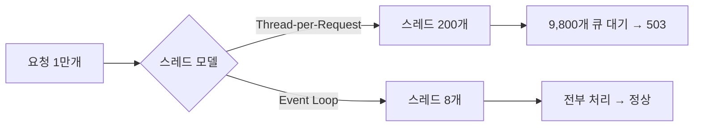
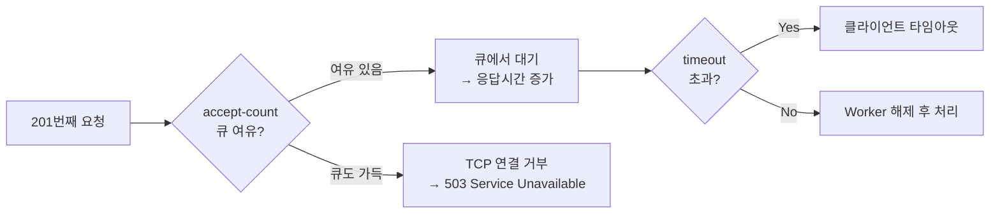
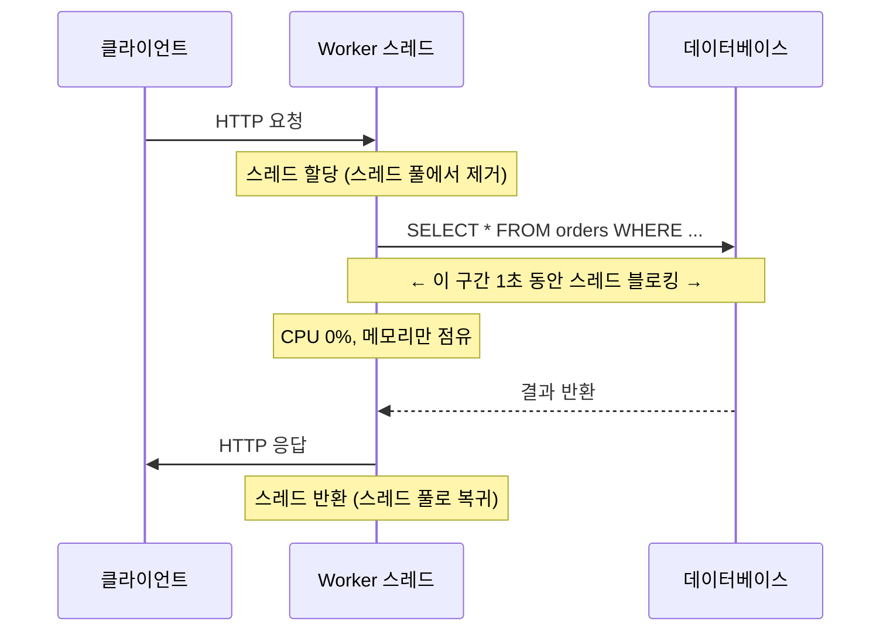
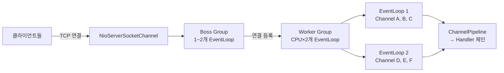
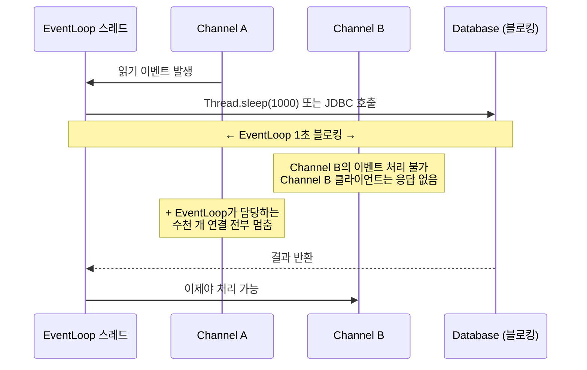
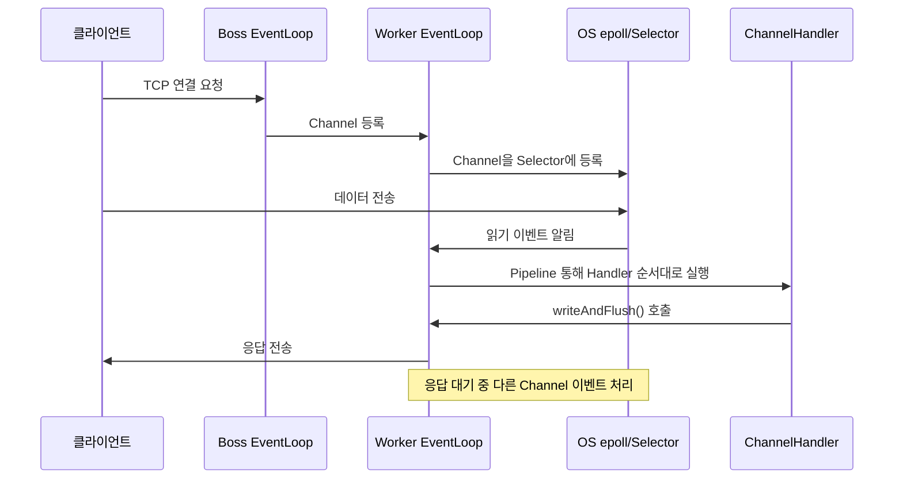
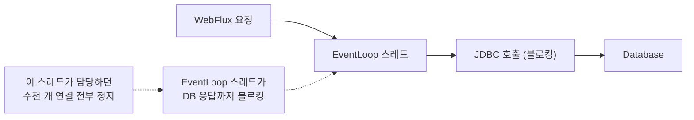
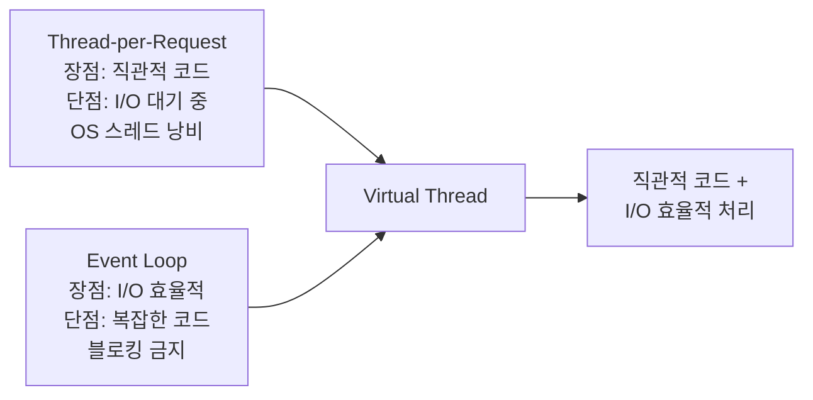
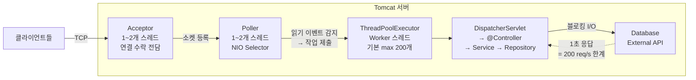
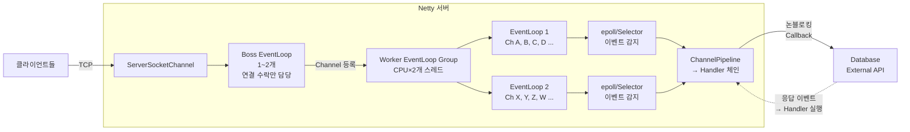

동시 접속자가 늘어나는 순간, Tomcat과 Netty는 전혀 다른 방식으로 반응한다. 같은 Java 생태계, 같은 HTTP, 같은 서버이지만 설계 철학이 근본적으로 다르다. 그 차이가 10만 동시 접속에서 생사를 가른다. 왜 그런지, 내부에서 실제로 무슨 일이 벌어지는지를 파헤친다.

---

## 실제 문제 — 동시 접속 1만에서 Tomcat이 멈춘 이유

### 사건 재현

전자상거래 서비스에서 블랙프라이데이 세일이 시작됐다. 평소 TPS 500이던 서비스에 갑자기 동시 접속 1만 명이 몰렸다.

```
[13:00:00] 동시 접속 200명   → 응답시간 120ms  (정상)
[13:00:30] 동시 접속 500명   → 응답시간 280ms  (느려짐)
[13:01:00] 동시 접속 1,000명 → 응답시간 1,200ms (심각)
[13:01:30] 동시 접속 2,000명 → 응답시간 타임아웃 (503 폭발)
[13:02:00] 동시 접속 10,000명 → 서비스 응답 불가
```

Netty 기반 서버(같은 스펙)는 같은 상황에서 응답시간 200ms를 유지했다. 왜 이런 차이가 발생했는가?

### 근본 원인: 스레드가 "기다리는" 방식의 차이

Tomcat은 요청 하나에 스레드 하나를 묶어 둔다. 상품 상세 페이지를 불러올 때 DB 쿼리(100ms) + 재고 API 호출(150ms)이 발생하면, 그 스레드는 250ms 동안 아무것도 하지 않고 대기한다.

Netty는 스레드를 기다리게 하지 않는다. I/O가 완료되면 "이벤트"가 발생하고, 그때 처리한다. 스레드는 그 사이에 다른 연결을 처리한다.



---

## 스레드 모델의 근본 차이

### Tomcat — Thread-per-Request 모델

#### 왜 이 모델을 선택했는가

Tomcat은 Java Servlet 명세 기반으로 설계됐다. Servlet 명세는 2000년대 초 설계됐고, 당시의 가정은 "개발자가 동기 코드를 작성한다"는 것이었다. `HttpServletRequest`와 `HttpServletResponse`를 하나의 스레드에서 읽고 쓰는 모델은 직관적이고 디버깅이 쉽다. 스레드 로컬로 요청 상태를 관리할 수 있어 Security Context나 Transaction Context를 자연스럽게 바인딩할 수 있다.

이 모델의 핵심 가정은 "OS 스레드가 충분하면 동시 처리가 가능하다"는 것이다. 문제는 OS 스레드가 I/O를 기다리는 동안 점유 상태로 남는다는 점이다.

#### 스레드 풀 구조 — Acceptor에서 Worker까지


각 계층의 역할:

1. **Acceptor**: TCP 연결 수락 전담. `ServerSocket.accept()`를 루프로 호출하며 새 연결을 Poller에 넘긴다. 1~2개로 충분하다.
2. **Poller**: NIO Selector를 사용해 연결된 소켓 중 읽기 가능한 것을 감지한다. I/O 이벤트가 발생하면 Worker에 요청을 넘긴다.
3. **Worker**: 실제 요청을 처리하는 스레드 풀. HTTP 파싱, Servlet 호출, 응답 전송을 담당한다. 기본 최대 200개.

```yaml
# Spring Boot application.yml
server:
  tomcat:
    threads:
      max: 200          # 최대 Worker 스레드 수 (기본값)
      min-spare: 10     # 항상 대기 중인 최소 스레드 수
    max-connections: 8192  # Poller가 관리하는 최대 연결 수
    accept-count: 100      # Worker 풀이 가득 찰 때 대기 큐 크기
    connection-timeout: 20s
```

#### maxThreads=200이면 201번째 요청은 어떻게 되는가



`accept-count=100` 기본값이라면, Worker 200개 + 큐 100개 = 최대 300개 요청을 동시에 처리할 수 있다. 301번째 요청은 TCP 레벨에서 거부된다.

#### 왜 DB 쿼리 1초면 TPS가 200으로 제한되는가

Worker 스레드가 DB 쿼리를 기다리는 동안 블로킹 상태로 점유되는 원리다.



수학적으로 보면:

```
최대 TPS = Worker 스레드 수 / 요청 처리 시간(초)

DB 쿼리 1초짜리 요청, 스레드 200개:
  최대 TPS = 200 / 1.0 = 200 req/s

DB 쿼리 0.1초짜리 요청, 스레드 200개:
  최대 TPS = 200 / 0.1 = 2,000 req/s
```

DB가 느릴수록 TPS 한계가 낮아진다. 스레드는 I/O를 기다리는 동안 CPU를 쓰지 않는다. CPU 사용률 0%인데 서버가 응답 불가 상태가 되는 이유가 바로 이것이다.

#### 스레드 수를 늘리면 해결되는가

OS 스레드는 생성할 때 스택 메모리를 예약한다. 기본값은 JVM 옵션과 OS에 따라 다르지만 통상 512KB~1MB다.

```
스레드 1,000개 × 1MB = 1GB RAM (스택만)
스레드 10,000개 × 1MB = 10GB RAM (스택만)

컨텍스트 스위칭:
  스레드 200개:  관리 가능한 수준
  스레드 2,000개: 컨텍스트 스위칭 비용이 실제 작업 비용 초과
  스레드 10,000개: OS 스케줄러가 포화
```

스레드 수를 늘리는 것은 밴드에이드다. 근본 해결책이 아니다.

---

### Netty — Event Loop 모델

#### 왜 스레드 수가 CPU 코어 수와 같은가

Netty의 Event Loop는 블로킹을 하지 않는다. I/O가 완료되면 OS가 알려준다(epoll/kqueue). 스레드는 알림을 기다리는 동안 다른 연결의 이벤트를 처리한다. 따라서 CPU 코어당 하나의 스레드로 모든 CPU를 100% 활용할 수 있다.

컨텍스트 스위칭이 없으므로 코어 수보다 많은 스레드는 오히려 낭비다.

```
8코어 서버 기준:
  Tomcat:  Worker 200개 스레드 (I/O 대기 중 190개는 자고 있음)
  Netty:   Worker 16개 스레드 (CPU×2, 항상 바쁨)

왜 CPU×2인가:
  - I/O 처리 중 잠깐 대기하는 경우가 있어 여유 1개씩 추가
  - Boss Group 1~2개 + Worker Group CPU×2가 관례
```

#### Boss Group + Worker Group 구조



Boss Group은 TCP 연결 수락만 전담한다. 새 연결이 들어오면 Worker Group의 EventLoop 하나에 등록하고 끝이다. Worker Group은 등록된 Channel의 모든 I/O 이벤트를 처리한다.

#### 왜 10만 동시 접속이 가능한가

핵심 개념: **연결 = 파일 디스크립터(File Descriptor), 스레드 ≠ 연결**

```
Tomcat Thread-per-Request:
  10만 연결 = 10만 스레드 필요
  10만 스레드 × 1MB = 100GB RAM → 불가능

Netty Event Loop:
  10만 연결 = 10만 파일 디스크립터 (소켓)
  실제 스레드: CPU×2 = 16개
  16개 스레드가 10만 개 소켓 이벤트를 순서대로 처리
```

파일 디스크립터는 정수 하나(소켓 번호)다. 10만 개 연결이 열려 있어도 OS에서 epoll로 관리하므로 메모리 오버헤드는 연결당 수 KB에 불과하다. 스레드 오버헤드가 없다.

#### Channel Pipeline Handler 체인 동작 원리


각 Handler는 단일 책임을 가진다. 바이트 스트림 → HTTP 객체 → 비즈니스 로직 → HTTP 응답 → 바이트 스트림 순서로 체인이 구성된다. 각 단계는 다음 Handler에게 위임한다.

#### 왜 Handler에서 블로킹 코드를 쓰면 안 되는가



EventLoop 스레드 하나가 수천 개 Channel을 담당한다. 그 스레드가 블로킹되면 담당하는 모든 Channel이 정지한다. 단 하나의 실수로 수천 개 연결이 영향 받는다.

#### Netty 서버 연결 처리 흐름



---

## Spring MVC (Tomcat) vs Spring WebFlux (Netty) 비교

### 같은 API를 두 방식으로 구현

**Spring MVC (Tomcat, 동기/블로킹)**

```java
@RestController
@RequiredArgsConstructor
public class UserController {

    private final UserRepository userRepository;
    private final ExternalApiClient externalClient;

    // 직관적이고 디버깅 쉬움
    // 단점: DB 쿼리 + 외부 API 호출 동안 스레드 블로킹
    @GetMapping("/users/{id}")
    public UserDto getUser(@PathVariable Long id) {
        User user = userRepository.findById(id)   // 블로킹 — 스레드 대기
                        .orElseThrow(() -> new UserNotFoundException(id));

        ExternalProfile profile = externalClient.getProfile(user.getExternalId()); // 블로킹

        return UserDto.of(user, profile);
    }
}
```

**Spring WebFlux (Netty, 비동기/논블로킹)**

```java
@RestController
@RequiredArgsConstructor
public class UserReactiveController {

    private final R2dbcUserRepository userRepository;  // 리액티브 DB 드라이버
    private final WebClient webClient;

    // 논블로킹 — EventLoop 스레드를 점유하지 않음
    // 단점: 코드가 복잡하고 스택 트레이스 추적 어려움
    @GetMapping("/users/{id}")
    public Mono<UserDto> getUser(@PathVariable Long id) {
        return userRepository.findById(id)
            .switchIfEmpty(Mono.error(new UserNotFoundException(id)))
            .flatMap(user ->
                webClient.get()
                    .uri("/profiles/{id}", user.getExternalId())
                    .retrieve()
                    .bodyToMono(ExternalProfile.class)
                    .map(profile -> UserDto.of(user, profile))
            )
            .timeout(Duration.ofSeconds(3))
            .onErrorResume(TimeoutException.class,
                e -> Mono.error(new ServiceUnavailableException()));
    }
}
```

같은 결과를 반환하지만 동작 방식이 완전히 다르다. MVC는 스레드를 점유하고, WebFlux는 이벤트 발생 시에만 스레드를 사용한다.

### 왜 WebFlux가 항상 좋은 게 아닌가

WebFlux가 빛을 발하는 조건은 **I/O 바운드 작업이 많고, 동시 연결 수가 많을 때**다.

다음 경우에는 WebFlux가 이점이 없거나 오히려 불리하다:

**1. CPU 바운드 작업**

```java
// CPU 집약적 이미지 처리 — 블로킹이 없으므로 WebFlux 이점 없음
@GetMapping("/resize")
public Mono<byte[]> resizeImage(@RequestBody byte[] imageData) {
    return Mono.fromCallable(() -> {
        // CPU를 100% 사용하는 작업 — EventLoop 스레드가 점유됨
        // 별도 스레드 풀로 오프로드해야 함
        return ImageUtils.resize(imageData, 800, 600);
    }).subscribeOn(Schedulers.boundedElastic()); // 결국 별도 스레드 필요
}
```

CPU 바운드라면 Tomcat + 충분한 Worker 스레드가 더 단순하다.

**2. 팀의 리액티브 경험이 없을 때**

리액티브 프로그래밍은 학습 곡선이 가파르다. `flatMap`, `switchIfEmpty`, `zipWith`, `mergeWith` 등의 연산자를 잘못 쓰면 오히려 성능이 나빠지고, 버그를 찾기가 극히 어렵다.

**3. 간단한 CRUD API**

응답 시간이 10ms 미만인 단순 CRUD API에서는 Tomcat과 Netty의 성능 차이가 거의 없다. 복잡성만 늘어난다.

### 왜 블로킹 라이브러리(JDBC)를 WebFlux에서 쓰면 안 되는가



JDBC는 블로킹 I/O 기반이다. WebFlux의 EventLoop 스레드에서 JDBC를 직접 호출하면 그 스레드가 DB 응답을 기다리는 동안 블로킹된다. 수천 개 연결이 동시에 멈춘다. Tomcat에서 Worker 스레드 하나가 블로킹되는 것과는 차원이 다른 피해다.

### R2DBC가 필요한 이유

```java
// JDBC — 블로킹. WebFlux에서 직접 쓰면 위험
User user = jdbcTemplate.queryForObject(
    "SELECT * FROM users WHERE id = ?",
    User.class, id
); // ← 이 줄에서 EventLoop 스레드 블로킹

// R2DBC — 논블로킹. WebFlux와 함께 사용
Mono<User> userMono = r2dbcTemplate.selectOne(
    Query.query(Criteria.where("id").is(id)),
    User.class
); // ← 즉시 반환. DB 응답 시 이벤트로 처리
```

R2DBC는 JDBC의 리액티브 대안이다. DB 쿼리 결과를 콜백/이벤트로 처리하므로 EventLoop 스레드를 블로킹하지 않는다. 단, JPA와 호환되지 않으므로 QueryDSL, jOOQ 등 다른 ORM/쿼리 도구가 필요하다.

WebFlux를 쓴다면 반드시 논블로킹 드라이버 체계를 갖춰야 한다:

| 계층 | 블로킹 (MVC용) | 논블로킹 (WebFlux용) |
|------|--------------|---------------------|
| HTTP 클라이언트 | RestTemplate | WebClient |
| DB 접근 | JDBC / JPA | R2DBC |
| 캐시 | Jedis (Redis) | Lettuce (비동기 모드) |
| 메시지 | KafkaTemplate (sync) | ReactiveKafkaTemplate |

---

## Java Virtual Thread가 판도를 바꾸는 이유

### Virtual Thread란 무엇인가

Java 21에서 정식 출시(JEP 444)된 경량 스레드다. JVM이 OS 스레드(Platform Thread) 위에 수백만 개의 가상 스레드를 마운트/언마운트해 실행한다.

핵심은 **블로킹 발생 시 JVM이 OS 스레드를 해제한다**는 점이다.

```java
// 기존 Platform Thread — JDBC 호출 시 OS 스레드 블로킹
Thread platformThread = new Thread(() -> {
    String result = jdbcTemplate.queryForObject(...); // OS 스레드 대기
});

// Virtual Thread — JDBC 호출 시 OS 스레드 해제
Thread virtualThread = Thread.ofVirtual().start(() -> {
    String result = jdbcTemplate.queryForObject(...);
    // ↑ 블로킹 발생 → JVM이 이 Virtual Thread를 OS 스레드에서 언마운트
    //                → OS 스레드는 다른 Virtual Thread 실행
    //                → DB 응답 도착 → 이 Virtual Thread 재마운트
});
```

개발자는 기존 블로킹 코드를 그대로 쓴다. JVM이 내부적으로 비동기로 처리한다.

### Thread-per-Request + 논블로킹 장점 결합



Virtual Thread를 사용하면 다음이 가능해진다:

```java
// Spring Boot 3.2+, Java 21+
@SpringBootApplication
public class Application {
    public static void main(String[] args) {
        SpringApplication.run(Application.class, args);
    }
}
```

```yaml
# application.yml — 한 줄로 Virtual Thread 활성화
spring:
  threads:
    virtual:
      enabled: true
```

이 설정 하나로 Tomcat의 Worker 스레드가 Virtual Thread로 교체된다. 기존 코드 변경 없이 I/O 바운드 성능이 대폭 향상된다.

### 왜 Virtual Thread면 Netty가 필요 없을 수 있는가

Virtual Thread는 I/O 대기 중 OS 스레드를 해제하므로, 수만 개의 동시 연결을 처리할 때도 실제 OS 스레드 수는 소수로 유지된다. Thread-per-Request 모델을 유지하면서 Event Loop와 유사한 자원 효율을 얻는다.

```
10만 동시 연결 처리 시:

Tomcat (Platform Thread): 10만 OS 스레드 필요 → 불가능
Netty (Event Loop):       16개 OS 스레드로 처리 → 가능
Tomcat (Virtual Thread):  10만 Virtual Thread, OS 스레드는 수십~수백 개
                           → 가능, 코드는 동기식 그대로
```

단순 I/O 바운드 REST API에서는 Virtual Thread + Tomcat이 Netty/WebFlux와 거의 동등한 성능을 낸다.

### Virtual Thread의 한계

**1. CPU 바운드에서는 이점 없음**

Virtual Thread는 I/O 블로킹 시 OS 스레드를 해제하는 게 핵심이다. CPU를 실제로 사용하는 작업에서는 OS 스레드를 점유해야 한다. CPU 바운드 작업에서는 Platform Thread와 성능 차이가 없다.

**2. Pinning 문제**

`synchronized` 블록이나 특정 네이티브 코드 안에서 블로킹이 발생하면, Virtual Thread가 OS 스레드에 고정(pinned)된다. 해제가 안 된다.

```java
// 문제: synchronized 안에서 블로킹 → Pinning
public synchronized void updateWithLock() {
    jdbcTemplate.update(...); // 블로킹 — OS 스레드에 Pinned
}

// 해결: ReentrantLock 사용
private final ReentrantLock lock = new ReentrantLock();

public void updateWithLock() {
    lock.lock();
    try {
        jdbcTemplate.update(...); // 블로킹이어도 Pinning 없음
    } finally {
        lock.unlock();
    }
}
```

JVM 옵션 `-Djdk.tracePinnedThreads=full`로 Pinning 발생 위치를 추적할 수 있다.

**3. 수만 개 장기 유지 연결에서는 Netty가 여전히 유리**

WebSocket, SSE, IoT처럼 연결을 수만 개 열고 오랫동안 유지하는 시나리오에서는 Netty가 여전히 유리하다. Virtual Thread는 연결 수만큼 Virtual Thread를 생성하므로, 스케줄링 오버헤드가 발생할 수 있다. Netty는 연결 수와 무관하게 EventLoop 스레드 수는 고정이다.

---

## 종합 비교

### 4가지 모델 전체 비교

| 모델 | 동시 접속 한계 | OS 스레드 수 | 코드 복잡도 | I/O 대기 처리 | CPU 바운드 | JPA/JDBC |
|------|:---:|:---:|:---:|------|:---:|:---:|
| Tomcat (Platform Thread) | ~1,000 | Worker 수 = 동시 연결 수 | 낮음 | OS 스레드 블로킹 (낭비) | 보통 | 가능 |
| Netty (Event Loop) | 10만+ | CPU × 2 | 높음 (리액티브) | 논블로킹 이벤트 | 별도 풀 필요 | 불가 (R2DBC 필요) |
| Tomcat (Virtual Thread) | ~10만 | 수십~수백 | 낮음 | VT 언마운트 | 보통 | 가능 |
| Kotlin Coroutine | 10만+ | 구성 가능 | 중간 | Suspend 함수 | 별도 Dispatcher 필요 | 불가 (R2DBC 필요) |

### 선택 기준

| 상황 | 권장 선택 | 이유 |
|------|---------|------|
| 기존 JPA/Hibernate 코드베이스 | Tomcat + Platform Thread | 리팩토링 불필요 |
| Java 21+, 신규 I/O 바운드 API | Tomcat + Virtual Thread | 코드 단순 + 높은 성능 |
| WebSocket, SSE, IoT 서버 | Netty (WebFlux) | 수만 장기 연결 유지 |
| gRPC 서버 | Netty | 기본 구현이 Netty 기반 |
| 커스텀 프로토콜 (게임, 금융) | Netty | 프로토콜 커스터마이징 |
| Kotlin 팀 + 높은 동시성 | Kotlin Coroutine | 언어 레벨 지원 |

---

## 극한 시나리오

### 극한 시나리오 1: "CPU 0%인데 서버가 먹통" — 스레드 고갈

온라인 쇼핑몰에서 타임세일 시작과 동시에 재고 확인 API가 폭주했다. 재고 서버는 CPU 사용률 0%이지만 HTTP 503을 뱉고 있다.

```
원인 진단:
1. 재고 서버: Tomcat, Worker 200개
2. 재고 DB 응답 시간: 평소 20ms → 갑자기 800ms (DB 슬로우 쿼리)
3. 동시 요청: 분당 5만 건

계산:
  초당 요청 = 50,000 / 60 ≈ 833 req/s
  요청당 처리 시간 = 800ms
  필요 스레드 = 833 × 0.8 = 666개
  실제 스레드 = 200개 → 466개 큐 대기 → 큐 초과 → 503
```

해결 순서:
1. 즉각 조치: DB 슬로우 쿼리 인덱스 추가 (응답 20ms 복구)
2. 중기 조치: Virtual Thread 활성화 (스레드 고갈 근본 해결)
3. 장기 조치: 재고 조회에 Redis 캐시 도입 (DB 부하 감소)

### 극한 시나리오 2: "WebFlux 도입했더니 오히려 느려짐" — EventLoop 오염

리액티브 전환을 위해 WebFlux를 도입했다. 그런데 성능이 기존 Tomcat보다 나빠졌다.

```java
// 범인: EventLoop 스레드에서 슬롯 변환 로직 실행
@GetMapping("/products")
public Flux<ProductDto> getProducts() {
    return productRepository.findAll()
        .map(p -> {
            // 무거운 CPU 연산 — EventLoop 스레드에서 실행됨
            String encodedImage = Base64.encodeToString(
                ImageUtils.resize(p.getImage(), 200, 200), // 10ms/건
                Base64.DEFAULT
            );
            return new ProductDto(p.getId(), p.getName(), encodedImage);
        });
}
```

EventLoop 스레드에서 CPU 집약 작업을 실행하면 해당 EventLoop가 담당하는 수천 개 연결이 모두 느려진다.

```java
// 해결: CPU 작업을 boundedElastic으로 오프로드
@GetMapping("/products")
public Flux<ProductDto> getProducts() {
    return productRepository.findAll()
        .flatMap(p ->
            Mono.fromCallable(() -> {
                String encodedImage = Base64.encodeToString(
                    ImageUtils.resize(p.getImage(), 200, 200),
                    Base64.DEFAULT
                );
                return new ProductDto(p.getId(), p.getName(), encodedImage);
            }).subscribeOn(Schedulers.boundedElastic()) // 별도 스레드 풀
        );
}
```

### 극한 시나리오 3: "Virtual Thread 도입 후 간헐적 응답 지연" — Pinning 문제

Virtual Thread 활성화 후 간헐적으로 P99 응답시간이 치솟는다.

```
JVM 진단:
  -Djdk.tracePinnedThreads=full 활성화

출력:
  Thread[#123,ForkJoinPool-1-worker-5,5,CarrierThreads]
      java.base/java.lang.Object.wait(Object.java)
      com.example.legacy.SynchronizedPool.acquire(SynchronizedPool.java:45)
          <== PINNED (synchronized)
```

`SynchronizedPool`의 `acquire()` 메서드가 `synchronized` 블록 안에서 블로킹 I/O를 수행하고 있었다. Virtual Thread가 OS 스레드에 Pinned되어 해제가 안 됐다.

```java
// 문제: 레거시 synchronized 기반 커넥션 풀
public synchronized Connection acquire() {
    while (available.isEmpty()) {
        wait(); // synchronized 안에서 wait — Pinning 발생
    }
    return available.poll();
}

// 해결: ReentrantLock으로 교체
private final ReentrantLock lock = new ReentrantLock();
private final Condition notEmpty = lock.newCondition();

public Connection acquire() throws InterruptedException {
    lock.lock();
    try {
        while (available.isEmpty()) {
            notEmpty.await(); // ReentrantLock — Pinning 없음
        }
        return available.poll();
    } finally {
        lock.unlock();
    }
}
```

---

## 면접 포인트

### Q1. Tomcat NIO도 비블로킹인데, Netty와 뭐가 다른가?

Tomcat은 NIO를 사용하지만 **요청당 Worker 스레드 하나를 할당하는 모델을 유지한다**. Poller(NIO Selector)가 읽기 가능한 소켓을 감지해 Worker에 넘기는 것뿐이다. Worker 스레드가 실제로 DB 쿼리나 외부 API를 호출하면 그 스레드는 블로킹 상태로 대기한다.

Netty는 EventLoop 스레드 자체가 I/O 완료 이벤트를 기다리다가, 이벤트 발생 시 콜백을 실행한다. I/O 대기 중에 EventLoop는 다른 Channel의 이벤트를 처리한다. 스레드가 블로킹되지 않는다.

한 줄 요약: Tomcat NIO는 "연결 수락을 비블로킹으로 하고, 처리는 블로킹으로 한다." Netty는 "연결 수락과 처리 모두 이벤트 기반으로 논블로킹으로 한다."

### Q2. C10K 문제란 무엇이고, 각 방식이 어떻게 해결하는가?

C10K(Concurrent 10,000 connections) 문제는 동시 연결 1만 개를 처리할 때 Thread-per-Request 서버가 한계에 부딪히는 현상이다. 1999년 Dan Kegel이 제시한 문제다.

- **Tomcat (Platform Thread)**: 스레드 1만 개 = 10GB RAM 스택 + 컨텍스트 스위칭 폭발 → C10K 불가
- **Netty (Event Loop)**: 연결 수만 개를 파일 디스크립터로 관리, OS 스레드는 CPU×2개 → C10K 이상 처리 가능
- **Tomcat (Virtual Thread)**: Virtual Thread 1만 개, OS 스레드는 수백 개 → C10K 처리 가능

### Q3. Virtual Thread는 Netty를 완전히 대체할 수 있는가?

단순 I/O 바운드 REST API에서는 대체 가능하다. 하지만 다음 경우에는 Netty가 여전히 유리하다.

1. **수만 개 장기 연결 유지** (WebSocket, SSE, 게임 서버): Virtual Thread는 연결당 하나 생성되므로 스케줄링 오버헤드가 있다. Netty EventLoop는 연결 수와 무관하게 스레드 수가 고정이다.
2. **커스텀 프로토콜**: Netty의 ChannelPipeline은 TCP 위에서 임의 프로토콜을 구현하는 데 최적화되어 있다.
3. **극한의 처리량이 필요한 경우**: EventLoop 모델이 Virtual Thread보다 컨텍스트 스위칭 오버헤드가 적다.

### Q4. WebFlux에서 JDBC를 써야 한다면 어떻게 해야 하는가?

`Schedulers.boundedElastic()`을 사용해 블로킹 작업을 별도 스레드 풀로 오프로드한다.

```java
// R2DBC 마이그레이션이 불가능한 레거시 상황
public Mono<User> findByIdLegacy(Long id) {
    return Mono.fromCallable(() ->
        jdbcTemplate.queryForObject(
            "SELECT * FROM users WHERE id = ?",
            userRowMapper, id
        )
    ).subscribeOn(Schedulers.boundedElastic()); // I/O 블로킹 전용 스레드 풀
}
```

단, 이 방식은 사실상 Tomcat의 Thread-per-Request와 동일하다. 진정한 논블로킹 이점을 얻으려면 R2DBC로 전환해야 한다.

### Q5. 같은 서버 스펙에서 Tomcat vs Netty, 어떤 경우에 Tomcat이 더 나은가?

**CPU 집약적 연산이 많은 서비스**에서는 Tomcat이 WebFlux보다 관리가 쉽다. CPU 바운드 작업은 블로킹/논블로킹 구분이 의미 없으므로, 리액티브 코드의 복잡성만 늘어난다.

**팀의 리액티브 경험이 없을 때**: 잘못 작성된 WebFlux 코드는 Tomcat보다 성능이 나쁘다. EventLoop 오염, 잘못된 Scheduler 선택, flatMap 남용 등으로 오히려 성능이 악화된다.

**응답 시간 목표가 매우 짧은 CRUD** (< 5ms): 이 구간에서는 두 서버의 처리량 차이가 거의 없다. 단순성과 디버깅 편의성에서 Tomcat이 유리하다.

---

## 실무 실수 Top 5

### 실수 1: I/O 바운드 서비스에 기본 Tomcat 스레드 설정 유지

외부 API를 다수 호출하는 서비스에서 `maxThreads=200` 기본값을 그대로 사용한다. 외부 API 평균 응답이 200ms라면 이론적 최대 TPS는 1,000이다. 트래픽이 몰리면 스레드 고갈이 발생한다.

```yaml
# Java 21 + Spring Boot 3.2 — 한 줄로 해결
spring:
  threads:
    virtual:
      enabled: true
```

### 실수 2: WebFlux 환경에서 블로킹 코드 직접 호출

```java
// 잘못된 예: EventLoop 스레드에서 블로킹 JPA 호출
@GetMapping("/orders/{id}")
public Mono<OrderDto> getOrder(@PathVariable Long id) {
    Order order = orderRepository.findById(id).orElseThrow(); // 블로킹!
    return Mono.just(OrderDto.of(order));
    // → EventLoop 스레드 블로킹 → 수천 개 연결 정지
}

// 올바른 예: boundedElastic으로 오프로드
@GetMapping("/orders/{id}")
public Mono<OrderDto> getOrder(@PathVariable Long id) {
    return Mono.fromCallable(() -> orderRepository.findById(id).orElseThrow())
               .subscribeOn(Schedulers.boundedElastic())
               .map(OrderDto::of);
}
```

### 실수 3: 단순 REST API에 WebFlux 도입

응답 시간 5ms 미만의 단순 CRUD API에 WebFlux를 도입한다. 성능 이점은 없고, 코드 복잡도, 디버깅 난이도, 팀 학습 비용만 증가한다. WebFlux는 **수만 동시 연결 유지** 또는 **스트리밍**이 필요할 때 도입한다.

### 실수 4: Tomcat 스레드 수를 무한정 증가

```yaml
# 나쁜 예 — 스레드를 늘려서 문제를 임시방편 처리
server:
  tomcat:
    threads:
      max: 2000
# → 스레드 2,000개 × 1MB = 2GB RAM 스택 소모
# → 컨텍스트 스위칭 비용 폭발
# → 근본 원인(느린 DB 쿼리, 느린 외부 API)은 해결 안 됨
```

올바른 접근: 스레드를 늘리기 전에 병목 원인을 찾는다. DB 슬로우 쿼리라면 인덱스 최적화가 우선이다.

### 실수 5: Virtual Thread 활성화 후 Pinning 점검 생략

Virtual Thread를 활성화하면 기존 `synchronized` 기반 코드에서 Pinning이 발생할 수 있다. 특히 레거시 라이브러리의 `synchronized` 내부에서 I/O가 발생하는 경우 OS 스레드가 해제되지 않는다.

```bash
# Pinning 발생 여부 추적
java -Djdk.tracePinnedThreads=full -jar app.jar

# 출력 예시
Thread[#125,ForkJoinPool-1-worker-3,5,CarrierThreads]
    com.zaxxer.hikari.pool.ProxyConnection.close(ProxyConnection.java:...)
        <== PINNED (synchronized)
```

Pinning이 발견되면 해당 `synchronized`를 `ReentrantLock`으로 교체하거나, 해당 라이브러리의 최신 버전(Virtual Thread 대응 버전)으로 업그레이드한다.

---

## Tomcat 스레드 풀 구조와 Netty EventLoop 아키텍처

### Tomcat 내부 구조



### Netty EventLoop 구조



두 구조의 핵심 차이는 Database/External API와의 연결 방식이다. Tomcat은 스레드가 직접 기다리고, Netty는 응답이 오면 이벤트가 발생해 Handler가 실행된다.

---

## 마치며

Tomcat과 Netty는 각각 다른 문제를 해결하기 위해 설계됐다. Tomcat Thread-per-Request는 개발자가 직관적으로 코드를 작성할 수 있게 하고, Netty Event Loop는 극한의 동시 연결 처리를 가능하게 한다.

Java 21 Virtual Thread의 등장으로 많은 경우 WebFlux 대신 Virtual Thread + Tomcat이 현실적인 선택이 됐다. 기존 코드를 바꾸지 않고, 리액티브 코드의 복잡성 없이, I/O 바운드 성능을 크게 향상시킬 수 있다.

기술 선택의 기준은 단순하다. **팀이 유지보수할 수 있는 코드**, **실제 트래픽 패턴에 맞는 모델**, **장애 발생 시 디버깅 가능한 구조**. 최신 기술보다 이 세 가지 기준이 더 중요하다.
