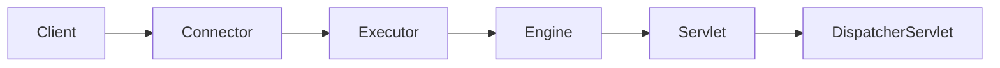
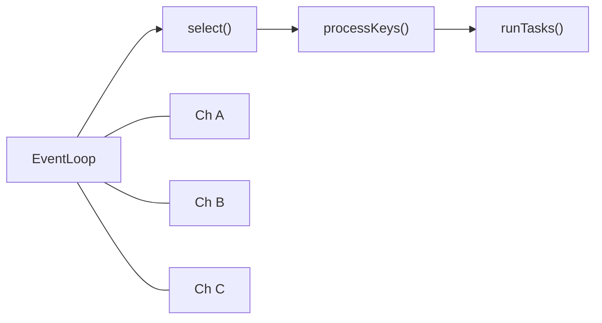

Tomcat과 Netty는 Java 생태계에서 가장 널리 사용되는 두 서버 엔진이다. 둘 다 네트워크 I/O를 처리하지만 설계 철학과 스레드 모델이 근본적으로 다르다. Spring MVC와 Spring WebFlux의 기반이 되는 두 엔진을 이해하면 성능 문제를 더 잘 진단하고 올바른 기술을 선택할 수 있다.

---

## Tomcat 아키텍처

### 개요

> 비유: 음식점에서 손님 한 명이 오면 직원 한 명이 전담해 주문받고 요리 나올 때까지 기다리는 방식이다. 손님이 200명이면 직원도 200명이 필요하다.

Apache Tomcat은 Java Servlet 명세를 구현한 서블릿 컨테이너이자 웹 서버다. Spring MVC의 기본 내장 서버이며, Thread-Per-Request 모델을 따른다.

### 내부 컴포넌트



- **Connector**: 클라이언트 연결을 받아들이는 입구. HTTP/1.1, HTTP/2, AJP 등 프로토콜 지원
- **ProtocolHandler**: 실제 소켓 I/O를 처리. NIO, NIO2, APR 방식 선택 가능
- **Executor**: 요청을 처리하는 스레드 풀

### NIO 스레드 모델

Tomcat 8.5부터 NIO가 기본값이다.


```yaml
# Spring Boot application.yml
server:
  tomcat:
    threads:
      max: 200          # 최대 워커 스레드 수
      min-spare: 10     # 최소 유지 스레드 수
    max-connections: 8192
    accept-count: 100
    connection-timeout: 20s
```

### Thread-Per-Request의 한계

Tomcat의 워커 스레드는 요청을 받아 응답을 반환할 때까지 해당 스레드를 독점한다. DB 쿼리나 외부 API 호출처럼 I/O 대기가 발생하면 스레드는 그 시간 동안 아무것도 하지 않고 멈춰 있다. CPU는 놀고 있지만 스레드는 점유 상태다.

기본값 200개 스레드 서버에 각각 200ms짜리 외부 API 호출이 포함된 요청이 동시에 200개 들어오면, 200개 스레드 전부가 I/O 대기 상태로 블로킹된다. 이 순간 201번째 요청은 `accept-count` 큐에서 대기하고, 큐마저 가득 차면 TCP 연결 자체가 거부된다.

> **비유**: 식당에 웨이터 200명이 있는데, 모두 주방에서 요리가 나오기를 서서 기다리고 있다. 새 손님이 와도 안내할 웨이터가 없어 입구에서 대기하다가 결국 돌아간다. 요리(I/O)가 느릴수록 웨이터(스레드)가 더 오래 묶인다.


스레드 수를 늘리면 일시적으로 해결되는 것처럼 보이지만, OS 스레드는 스택 메모리(기본 1MB)를 차지하므로 스레드 1,000개면 1GB RAM이 스택에만 소모된다. 더 근본적인 문제는 스레드 간 컨텍스트 스위칭 오버헤드가 스레드 수 증가에 따라 비선형으로 폭발한다는 점이다.

---

## Netty 아키텍처

### 개요

Netty는 비동기 이벤트 기반 네트워크 I/O 프레임워크다. Spring WebFlux의 기본 서버이며, Reactor 패턴을 기반으로 한다.

### 핵심 컴포넌트

> 비유: 교환원(Boss)이 전화를 받아 직원(Worker)에게 연결하고, 직원은 여러 통화를 동시에 돌아가며 처리한다. 직원이 통화 중 잠깐 대기하는 동안 다른 통화를 처리한다.


### EventLoop

하나의 스레드가 하나의 EventLoop를 담당하고, 하나의 EventLoop는 여러 Channel을 처리한다.



**핵심 원칙**: EventLoop 스레드를 절대 블로킹하면 안 된다. 블로킹 작업은 별도 스레드 풀(`Schedulers.boundedElastic()`)로 오프로드해야 한다.

### ChannelPipeline

```mermaid
graph LR
    Socket1[소켓 수신] -->|인바운드| D1[ByteToMessag..|아웃바운드| E1[HTTP 객체 Encoder]
    E1 --> E2[MessageToByte Encoder]
    E2 --> Socket2[소켓 송신]
```

### 기본 Netty 서버 코드

```java
public class SimpleNettyServer {

    public void start(int port) throws InterruptedException {
        NioEventLoopGroup bossGroup = new NioEventLoopGroup(1);
        NioEventLoopGroup workerGroup = new NioEventLoopGroup(); // 기본: CPU × 2

        try {
            ServerBootstrap bootstrap = new ServerBootstrap()
                .group(bossGroup, workerGroup)
                .channel(NioServerSocketChannel.class)
                .option(ChannelOption.SO_BACKLOG, 128)
                .childOption(ChannelOption.SO_KEEPALIVE, true)
                .childHandler(new ChannelInitializer<SocketChannel>() {
                    @Override
                    protected void initChannel(SocketChannel ch) {
                        ch.pipeline()
                            .addLast(new HttpServerCodec())
                            .addLast(new HttpObjectAggregator(65536))
                            .addLast(new SimpleServerHandler());
                    }
                });

            ChannelFuture future = bootstrap.bind(port).sync();
            future.channel().closeFuture().sync();
        } finally {
            bossGroup.shutdownGracefully();
            workerGroup.shutdownGracefully();
        }
    }
}

@ChannelHandler.Sharable
class SimpleServerHandler extends SimpleChannelInboundHandler<FullHttpRequest> {

    @Override
    protected void channelRead0(ChannelHandlerContext ctx, FullHttpRequest request) {
        // EventLoop 스레드에서 실행 — 블로킹 금지!
        ByteBuf content = Unpooled.copiedBuffer("Hello, Netty!", CharsetUtil.UTF_8);
        FullHttpResponse response = new DefaultFullHttpResponse(
            HttpVersion.HTTP_1_1, HttpResponseStatus.OK, content
        );
        response.headers()
            .set(HttpHeaderNames.CONTENT_TYPE, "text/plain")
            .set(HttpHeaderNames.CONTENT_LENGTH, content.readableBytes());
        ctx.writeAndFlush(response);
    }
}
```

### Spring WebFlux + Netty

```java
@RestController
public class ReactiveController {

    private final WebClient webClient = WebClient.create("https://api.example.com");

    @GetMapping("/users/{id}")
    public Mono<UserDto> getUser(@PathVariable Long id) {
        return webClient.get()
            .uri("/users/{id}", id)
            .retrieve()
            .bodyToMono(UserDto.class)
            .map(user -> new UserDto(user.id(), user.name().toUpperCase()))
            .timeout(Duration.ofSeconds(3))
            .onErrorReturn(new UserDto(-1L, "Unknown"));
    }

    @GetMapping(value = "/stream", produces = MediaType.TEXT_EVENT_STREAM_VALUE)
    public Flux<String> stream() {
        return Flux.interval(Duration.ofSeconds(1))
            .map(i -> "Event: " + i)
            .take(10);
    }
}
```

---

## 스레드 모델 비교

### 동시 연결 처리

```mermaid
graph LR
    T["Tomcat: 200 스레드"] -->|"1000 요청"| TB["800개 큐 대기"]..|"1000 연결"| NB["전부 처리"]
```

### I/O 바운드 vs CPU 바운드

| 작업 유형 | Tomcat | Netty |
|-----------|--------|-------|
| I/O 바운드 (외부 API, DB) | 스레드 블로킹 → 낭비 | EventLoop가 다른 채널 처리 → 효율적 |
| CPU 바운드 (복잡한 계산) | 자연스러움 | EventLoop 점유 시 다른 채널 지연 → 별도 풀 필요 |

### 처리량 비교 (이론적)

| 시나리오 | Tomcat (200스레드) | Netty (8 EventLoop) |
|----------|-------------------|---------------------|
| 빠른 응답 (<1ms) | 높음 | 더 높음 |
| I/O 대기 (100ms) | ~200 req/s | 수천 req/s |
| CPU 집약 (50ms) | ~4,000 req/s | 비슷 (별도 풀 필요) |
| 대용량 연결 유지 | 스레드 고갈 가능 | 수만 연결 가능 |

---

## Virtual Thread와의 비교 (Java 21+)

### Virtual Thread란

Java 21에서 정식 출시된 경량 스레드다. JVM이 OS 스레드 위에 수백만 개의 가상 스레드를 실행할 수 있다.

```java
// 블로킹 코드를 그대로 작성해도 OS 스레드는 해제됨
Thread.ofVirtual().start(() -> {
    String result = blockingHttpCall(); // 블로킹 발생 시 OS 스레드 언마운트
    process(result);                    // 응답 도착 시 다시 마운트
});
```

**Spring Boot + Virtual Thread 활성화**
```yaml
spring:
  threads:
    virtual:
      enabled: true  # Spring Boot 3.2+
```

### 3가지 모델 비교

| 항목 | Tomcat (플랫폼 스레드) | Netty (리액티브) | Tomcat + Virtual Thread |
|------|----------------------|-----------------|------------------------|
| 프로그래밍 모델 | 동기/블로킹 | 비동기/비블로킹 | 동기/블로킹 |
| 코드 복잡도 | 낮음 | 높음 | 낮음 |
| I/O 바운드 성능 | 낮음 | 매우 높음 | 높음 |
| CPU 바운드 성능 | 보통 | 보통 | 보통 |
| 스택 트레이스 가독성 | 명확 | 복잡(리액티브 체인) | 명확 |
| 메모리 (1만 연결) | ~10GB | ~수십MB | ~수백MB |
| JPA/JDBC 사용 | 자연스러움 | 불가(블로킹) | 자연스러움 |
| 학습 곡선 | 낮음 | 높음 | 낮음 |

### WebFlux에서 블로킹 코드 처리

```java
@Service
public class UserService {

    // JPA(블로킹)를 WebFlux 환경에서 사용할 때
    public Mono<User> findById(Long id) {
        return Mono.fromCallable(() -> userRepository.findById(id).orElseThrow())
            .subscribeOn(Schedulers.boundedElastic()); // 블로킹 작업용 스레드 풀
    }

    // R2DBC(리액티브 DB 드라이버) 사용 시
    public Mono<User> findByIdReactive(Long id) {
        return r2dbcUserRepository.findById(id); // 논블로킹
    }
}
```

---

## 선택 기준

| 상황 | 권장 선택 |
|------|----------|
| 레거시 코드베이스, JPA 사용, 단순 CRUD | Tomcat (플랫폼 스레드) |
| 대용량 실시간 스트리밍, SSE, WebSocket, 극한 성능 | Netty (WebFlux) |
| 신규 프로젝트, I/O 바운드 위주, Java 21+, Spring Boot 3.2+ | Tomcat + Virtual Thread |

---

## 마치며

Tomcat과 Netty는 각각 다른 문제를 해결하기 위해 설계됐다. Tomcat은 단순함과 안정성을, Netty는 극한의 처리량과 확장성을 추구한다. Java 21의 Virtual Thread 도입으로 Tomcat도 I/O 바운드 시나리오에서 경쟁력을 갖게 됐다. 새 프로젝트라면 Virtual Thread + Tomcat 조합이 학습 비용 대비 성능을 얻기 쉬운 선택이다.

---

## 왜 이 기술인가? — 서버 모델 선택 가이드

### 서버 I/O 모델 비교

| 항목 | Tomcat (BIO/NIO) | Netty (NIO) | Tomcat + Virtual Thread | Spring WebFlux |
|------|-----------------|-------------|------------------------|----------------|
| 프로그래밍 모델 | 동기/블로킹 | 비동기/이벤트 | 동기/블로킹 | 리액티브 |
| 코드 복잡도 | 낮음 | 높음 | 낮음 | 높음 |
| I/O 바운드 성능 | 보통 | 매우 높음 | 높음 | 매우 높음 |
| CPU 바운드 성능 | 보통 | 별도 스레드 풀 필요 | 보통 | 별도 스케줄러 필요 |
| JPA/JDBC 사용 | 자연스러움 | 불가(블로킹) | 자연스러움 | 불가(R2DBC 필요) |
| 메모리 (1만 동시 연결) | ~10GB | ~수십MB | ~수백MB | ~수십MB |
| 스택 트레이스 가독성 | 명확 | 복잡 | 명확 | 복잡(리액티브 체인) |
| 학습 곡선 | 낮음 | 매우 높음 | 낮음 | 높음 |
| 적합한 사례 | REST API, 레거시 | WebSocket, gRPC, IoT | REST API, Java 21+ | 스트리밍, SSE |

**Tomcat을 선택해야 할 때:**
- JPA/Hibernate를 사용하는 기존 코드베이스
- 팀의 리액티브 프로그래밍 경험이 없을 때
- 단순 CRUD 위주의 비즈니스 API

**Netty를 선택해야 할 때:**
- 수만 개의 동시 연결을 유지해야 하는 경우 (WebSocket, SSE, 게임 서버)
- gRPC 서버 구축
- 커스텀 프로토콜 처리가 필요한 경우

---

## 실무에서 자주 하는 실수

### 실수 1: I/O 바운드 작업에 Tomcat 기본 설정 그대로 사용

외부 API를 많이 호출하는 서비스에서 `server.tomcat.threads.max=200` 기본값을 유지한다. 각 요청이 평균 200ms 대기하면 초당 최대 1,000 req/s가 한계다. Virtual Thread 활성화나 스레드 수 증가, 또는 WebFlux 전환을 고려해야 한다.

```yaml
# Java 21 + Spring Boot 3.2: 한 줄로 해결
spring:
  threads:
    virtual:
      enabled: true
```

### 실수 2: WebFlux 환경에서 블로킹 코드를 호출한다

Netty 기반 WebFlux에서 JPA나 `Thread.sleep()` 같은 블로킹 코드를 EventLoop 스레드에서 직접 실행한다. EventLoop 스레드가 블로킹되면 해당 스레드가 처리하는 **모든 연결이 멈춘다**.

```java
// 잘못된 예: EventLoop 스레드에서 블로킹 호출
public Mono<User> getUser(Long id) {
    User user = userRepository.findById(id).get(); // 블로킹!
    return Mono.just(user);
}

// 올바른 예: boundedElastic 스케줄러로 오프로드
public Mono<User> getUser(Long id) {
    return Mono.fromCallable(() -> userRepository.findById(id).get())
               .subscribeOn(Schedulers.boundedElastic());
}
```

### 실수 3: Netty를 단순 REST API에 도입한다

처리 시간이 짧은 단순 REST API(< 5ms)는 Tomcat과 Netty의 성능 차이가 거의 없다. 오히려 리액티브 코드의 복잡성, 디버깅 어려움, 팀 학습 비용이 더 크다. Netty는 **수만 개의 동시 연결 유지** 또는 **스트리밍**이 필요할 때 도입한다.

### 실수 4: Tomcat 스레드 수를 무한정 늘린다

`server.tomcat.threads.max=2000`으로 늘려도 효과가 없다. OS 스레드 하나당 기본 스택 메모리가 512KB ~ 1MB이므로, 2,000 스레드면 약 2GB를 스레드 스택에 사용한다. 컨텍스트 스위칭 비용도 급증한다. 스레드 수보다는 연결 자체를 비동기로 처리하는 것이 근본 해결책이다.

### 실수 5: keep-alive 타임아웃을 너무 길게 설정한다

```yaml
server:
  tomcat:
    keep-alive-timeout: 60000  # 60초 — 너무 길다
    max-keep-alive-requests: 100
```

keep-alive 시간이 길면 스레드가 유휴 연결을 잡고 있어 스레드 풀이 고갈된다. 로드밸런서(Nginx/ALB) 타임아웃보다 서버 타임아웃을 짧게 설정해야 한다. 통상 20~30초가 적정값이다.

---

## 면접 포인트

### Q1: Tomcat의 이벤트 기반 NIO와 Netty의 차이는?

Tomcat NIO도 비블로킹 I/O를 사용하지만, **요청당 하나의 스레드를 할당하는 모델**은 유지한다. 스레드가 I/O를 기다리는 동안에는 다른 작업을 하지 않고 대기한다. Netty는 소수의 EventLoop 스레드가 수천 개의 연결을 **이벤트 기반**으로 처리한다. I/O 대기 중에는 다른 연결의 이벤트를 처리하므로 스레드 효율이 훨씬 높다.

### Q2: C10K 문제란 무엇이고, 어떻게 해결하는가?

C10K(Concurrent 10,000 connections) 문제는 10,000개 동시 연결을 처리할 때 스레드 기반 서버가 한계에 부딪히는 현상이다. 스레드당 1MB 스택 메모리라면 10,000 스레드는 10GB가 필요하다. 해결책은 세 가지다: (1) Netty같은 이벤트 루프 모델, (2) Java 21 Virtual Thread, (3) WebFlux + R2DBC 리액티브 스택.

### Q3: Virtual Thread가 Netty를 대체할 수 있는가?

단순 I/O 바운드 API에서는 Virtual Thread + Tomcat이 Netty/WebFlux와 비슷한 성능을 낸다. 하지만 **수만 개 연결을 장시간 유지**하는 WebSocket, SSE, IoT 서버에서는 Netty가 여전히 유리하다. Virtual Thread는 연결 하나에 스레드 하나를 생성하므로, 연결 수만큼 Virtual Thread가 생기고 스케줄링 오버헤드가 발생할 수 있다. 반면 Netty는 연결 수와 무관하게 EventLoop 스레드 수는 고정이다.
