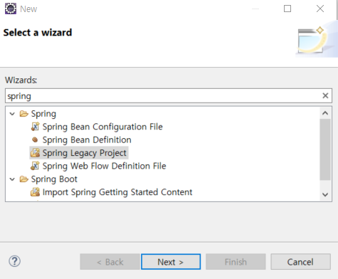
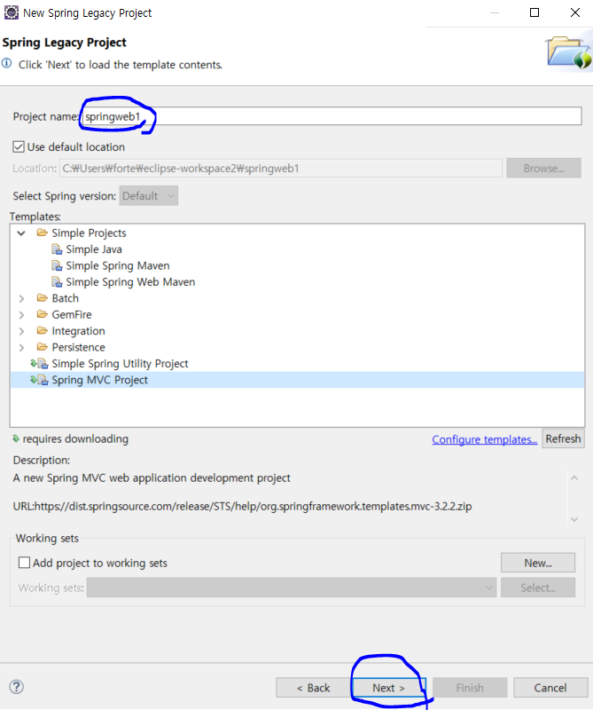
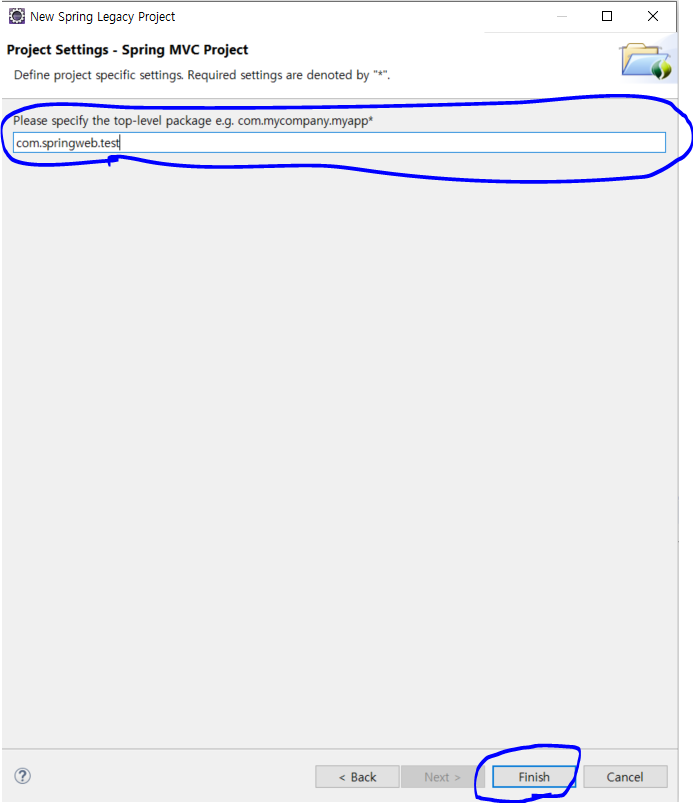
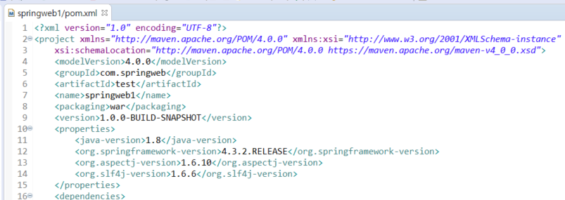
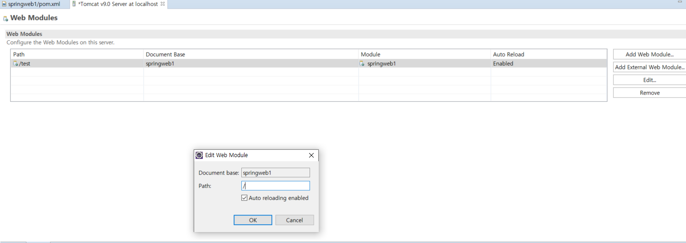
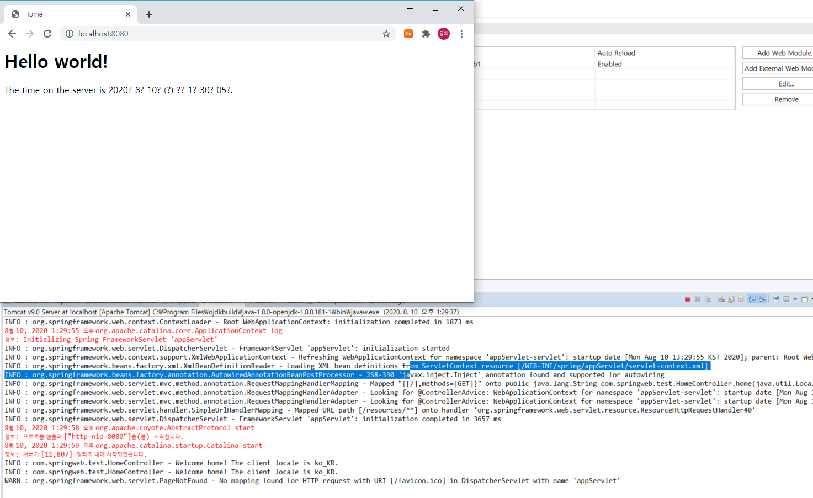
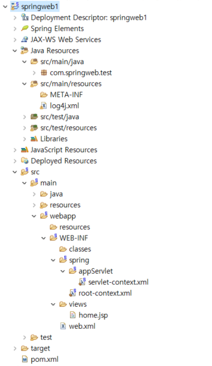

---

title: Spring Project 시작하기
categories:
- Spring Legacy
toc: true
toc_sticky: true
toc_label: 목차

---

## Step 1:  프로젝트 생성

File -> New -> Other -> Spring Legacy Projcet 

Spring MVC Project 선택 -> Project Name 작성 후 Next 클릭

패키지 명 작성 [패키지명은 xxx.xxx.xxx 처럼 3구간으로 나누어야한다.]

패키지 생성 후 pom.xml에서 자바 버전과 스프링버전을 변경해준다. [필자는 자바 1.8에 스프링 4버전대를 사용]

완료 후 메이븐 업데이트

톰캣의 환경설정에서 생성한 프로젝트를 등록하고 Path를 /로 설정한다.

톰캣 시작 후 웹 접속

**프로젝트 디렉터리 구조**

1) src/main/java 

 자바코드 (Controller, Service, Dao) 가 들어가며 기능별로 패키징을 묶는다. 

2) src/main/resource 

자바 코드에서 사용할 리소스 (log4j2.xml, mapper.xml, *.properties 등) 

3) src/test/test 

 테스트 코드가 들어간다. (필자는 보통 테스트 코드에서 junit을 통해 디비 접속 테스트를 하지만..  TDD(테스트 주도 개발) 에서는 기능 단위로 테스트를 만든다.)

4)  src/test/resources 

테스트 코드에서 사용할 리소스

5)  src/main/webapp/resources

js,css,image등 파일 관리

6) src/main/webapp/class

컴파일된 클래스들을 관리

7) src/main/webapp/WEB-INF/views

html,jsp등 페이지를 관리

5) servlet-context.xml  

웹과 관련된 설정 파일

6) root-context.xml 

디비 관련 설정 파일

7) web.xml 

 웹프로젝트 환경설정 파일

