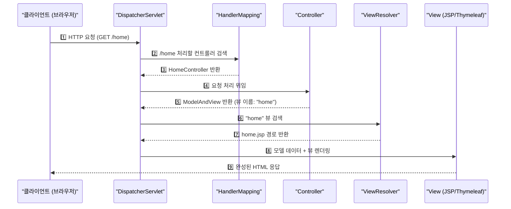
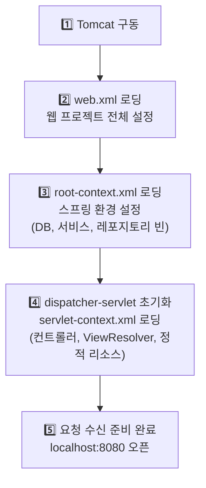
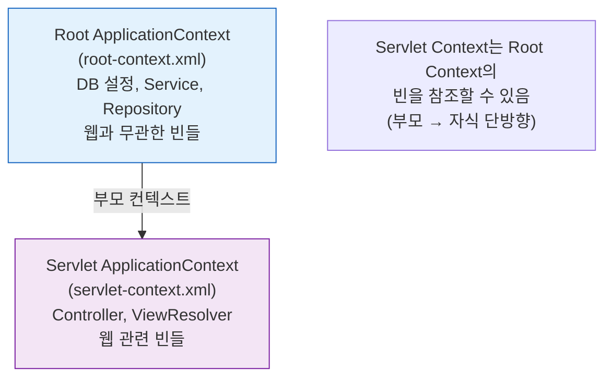
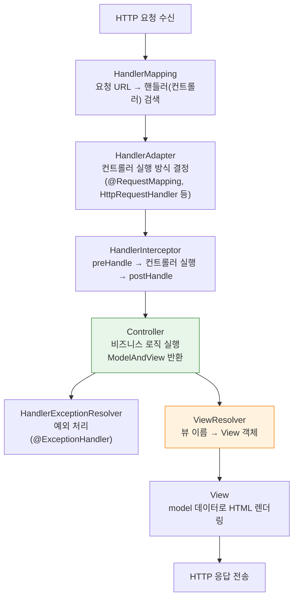
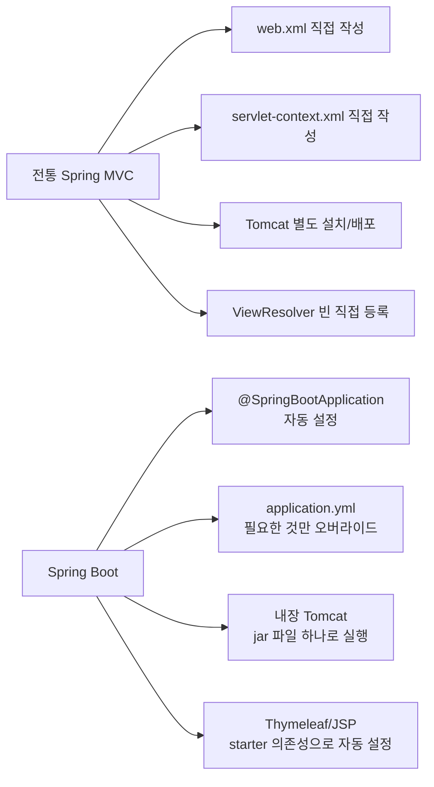

Spring MVC의 핵심은 DispatcherServlet이다. 모든 HTTP 요청이 이 하나의 서블릿을 통해 들어오고, DispatcherServlet이 적절한 컨트롤러를 찾아 요청을 위임하고, 최종 응답을 조립해서 클라이언트에게 돌려준다. 이 흐름을 정확히 이해하면 Spring MVC의 동작 원리 전체가 보인다.

> **비유**: DispatcherServlet은 공항의 안내 데스크와 같다. 여행자(요청)가 오면 목적지(컨트롤러)를 찾아주고, 게이트(ViewResolver)를 안내하고, 최종적으로 비행기(응답)에 탑승시킨다. 안내 데스크 자체는 직접 비행기를 조종하지 않는다.

---

## 1단계: Spring MVC 전체 요청 처리 흐름



---

## 2단계: 애플리케이션 구동 시 설정 로딩 순서

Spring MVC 애플리케이션이 Tomcat에서 시작될 때 다음 순서로 설정 파일을 읽는다.



### web.xml — 웹 프로젝트의 시작점

```xml
<!-- web.xml: 서블릿 컨테이너가 가장 먼저 읽는 설정 파일 -->
<web-app>
    <!-- 1. root-context.xml 로딩 (스프링 환경 설정) -->
    <context-param>
        <param-name>contextConfigLocation</param-name>
        <param-value>/WEB-INF/spring/root-context.xml</param-value>
    </context-param>
    <listener>
        <listener-class>
            org.springframework.web.context.ContextLoaderListener
        </listener-class>
    </listener>

    <!-- 2. DispatcherServlet 등록 (모든 요청 처리) -->
    <servlet>
        <servlet-name>appServlet</servlet-name>
        <servlet-class>
            org.springframework.web.servlet.DispatcherServlet
        </servlet-class>
        <init-param>
            <param-name>contextConfigLocation</param-name>
            <param-value>/WEB-INF/spring/appServlet/servlet-context.xml</param-value>
        </init-param>
        <load-on-startup>1</load-on-startup>
    </servlet>

    <!-- 3. 모든 URL을 DispatcherServlet이 처리하도록 매핑 -->
    <servlet-mapping>
        <servlet-name>appServlet</servlet-name>
        <url-pattern>/</url-pattern>
    </servlet-mapping>

    <!-- 4. 인코딩 필터 (한국어 깨짐 방지) -->
    <filter>
        <filter-name>encodingFilter</filter-name>
        <filter-class>
            org.springframework.web.filter.CharacterEncodingFilter
        </filter-class>
        <init-param>
            <param-name>encoding</param-name>
            <param-value>UTF-8</param-value>
        </init-param>
    </filter>
    <filter-mapping>
        <filter-name>encodingFilter</filter-name>
        <url-pattern>/*</url-pattern>
    </filter-mapping>
</web-app>
```

---

## 3단계: 두 개의 ApplicationContext

Spring MVC는 두 개의 스프링 컨텍스트를 계층 구조로 관리한다.



### root-context.xml — 공통 빈 설정

```xml
<!-- root-context.xml: 웹과 무관한 공통 빈 설정 -->
<beans>
    <!-- DB 연결 설정 -->
    <bean id="dataSource"
          class="org.springframework.jdbc.datasource.DriverManagerDataSource">
        <property name="driverClassName" value="com.mysql.jdbc.Driver"/>
        <property name="url" value="jdbc:mysql://localhost:3306/mydb"/>
        <property name="username" value="root"/>
        <property name="password" value="password"/>
    </bean>

    <!-- 서비스, 레포지토리 컴포넌트 스캔 -->
    <context:component-scan base-package="com.example.service"/>
    <context:component-scan base-package="com.example.repository"/>
</beans>
```

### servlet-context.xml — 웹 전용 빈 설정

```xml
<!-- servlet-context.xml: 웹 MVC 관련 설정 -->
<beans>
    <!-- MVC 어노테이션 활성화 (@Controller, @RequestMapping 등) -->
    <mvc:annotation-driven/>

    <!-- ViewResolver: 뷰 이름 → 실제 JSP 파일 경로 변환 -->
    <beans:bean class="org.springframework.web.servlet.view.InternalResourceViewResolver">
        <beans:property name="prefix" value="/WEB-INF/views/"/>
        <beans:property name="suffix" value=".jsp"/>
    </beans:bean>
    <!-- return "home" → /WEB-INF/views/home.jsp -->

    <!-- 정적 리소스 처리 (CSS, JS, 이미지) -->
    <mvc:resources mapping="/resources/**" location="/resources/"/>

    <!-- 컨트롤러 컴포넌트 스캔 -->
    <context:component-scan base-package="com.example.controller"/>
</beans>
```

---

## 4단계: DispatcherServlet 내부 동작 상세



### 컨트롤러 예시

```java
@Controller
public class HomeController {

    @RequestMapping(value = "/", method = RequestMethod.GET)
    public String home(Model model) {
        // 1. 비즈니스 로직 처리
        model.addAttribute("serverTime", new Date());

        // 2. 뷰 이름 반환 → ViewResolver가 /WEB-INF/views/home.jsp 로 변환
        return "home";
    }

    @RequestMapping(value = "/members", method = RequestMethod.GET)
    public String members(Model model) {
        model.addAttribute("members", memberService.findAll());
        return "members"; // /WEB-INF/views/members.jsp
    }
}
```

---

## 5단계: Spring Boot에서의 변화

Spring Boot를 사용하면 web.xml, servlet-context.xml, root-context.xml이 모두 자동 설정된다.



```java
// Spring Boot: 이것만으로 위의 모든 XML 설정을 대체
@SpringBootApplication
public class Application {
    public static void main(String[] args) {
        SpringApplication.run(Application.class, args);
    }
}
```

---

<details class="extreme-scenario-details" ontoggle="if(this.open){var ad=this.querySelector('.extreme-scenario-ad');if(ad&&!ad.dataset.loaded){ad.dataset.loaded='1';(adsbygoogle=window.adsbygoogle||[]).push({});}}">
<summary class="extreme-scenario-summary">
<span class="extreme-scenario-icon">🔥</span>
<span class="extreme-scenario-label">극한 시나리오 — 클릭하여 펼치기</span>
<span class="extreme-scenario-toggle"></span>
</summary>
<div class="extreme-scenario-body">
<div class="extreme-scenario-ad" style="text-align:center; margin-bottom:1.5em;">
<ins class="adsbygoogle"
     style="display:block"
     data-ad-client="ca-pub-7225106491387870"
     data-ad-slot="0000000000"
     data-ad-format="auto"
     data-full-width-responsive="true"></ins>
</div>
<div class="extreme-scenario-content" markdown="1">

### 시나리오 1: 404 — 컨트롤러 매핑 없음

```
요청: GET /about
HandlerMapping: @RequestMapping("/about") 없음
→ NoHandlerFoundException → 404 응답

해결 방법:
1. @Controller + @RequestMapping("/about") 추가
2. 또는 정적 파일 /resources/about.html 추가
3. DefaultServletHttpRequestHandler 활성화 확인
```

### 시나리오 2: 500 — 뷰 파일 없음

```java
@Controller
public class HomeController {
    @GetMapping("/home")
    public String home() {
        return "hom"; // 오타! home.jsp 대신 hom.jsp를 찾음
    }
}
// 결과: /WEB-INF/views/hom.jsp 없음 → 500 에러

// ViewResolver 설정 확인:
// prefix=/WEB-INF/views/, suffix=.jsp
// → 반환 문자열이 파일명과 정확히 일치해야 함
```

### 시나리오 3: 한국어 깨짐 — 인코딩 필터 누락

```
web.xml에 CharacterEncodingFilter가 없거나 DispatcherServlet 이후에 등록된 경우
→ POST 파라미터의 한글이 ???로 깨짐

필터 등록 순서:
1. CharacterEncodingFilter (가장 먼저)
2. CustomFilter
3. DispatcherServlet
```

### 시나리오 4: Root Context와 Servlet Context 빈 참조 혼동

```
Servlet Context의 @Controller → Root Context의 @Service → OK (부모 참조 가능)
Root Context의 @Service → Servlet Context의 @Controller → X (자식 참조 불가)

→ @Transactional이 있는 Service는 반드시 Root Context에 등록해야
  트랜잭션 프록시가 올바르게 생성됨
  Servlet Context에 Service가 스캔되면 @Transactional이 작동하지 않는 경우 발생
```

---
</div>
</div>
</details>

## 실무 체크리스트

```
□ web.xml의 CharacterEncodingFilter가 DispatcherServlet보다 먼저 등록되었는지 확인
□ ViewResolver prefix/suffix 경로가 실제 파일 위치와 일치하는지 확인
□ @Service, @Repository는 root-context.xml 스캔 패키지에 포함
□ @Controller는 servlet-context.xml 스캔 패키지에 포함
□ 현재 신규 프로젝트는 Spring Boot 사용 권장 (XML 설정 불필요)
□ HandlerInterceptor로 공통 전처리/후처리 (인증, 로깅) 처리
```

---

```
참조 - 스프링 MVC 구조 및 동작 원리
```
