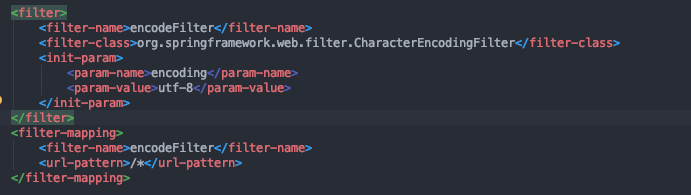
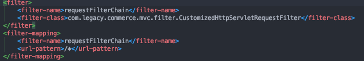
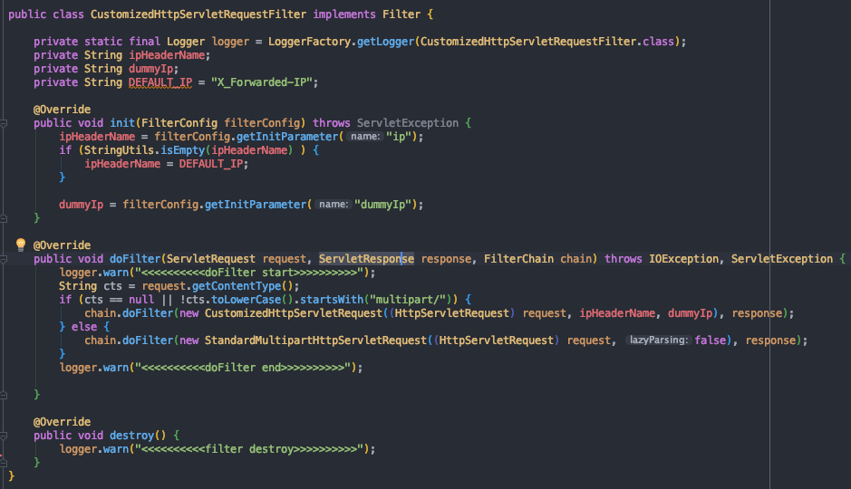
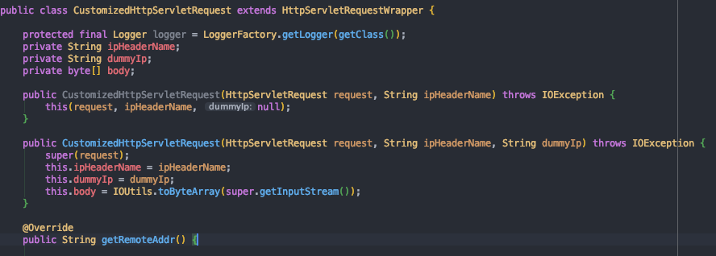

---

title: Filter Customizing
categories:
- Spring Legacy
toc: true
toc_sticky: true
toc_label: 목차

---

## Step 1:  Filter 

#### Filter 란? 

> ***필터는 스프링의 독자적인 기능이 아닌 자바 서블릿에서 제공하는 기능이다.***
>
> ###### ***필터는 주로 요청에 대한 인증, 권한 체크 등을 하는데에 쓰인다.***
>
> *** 구체적으로 들어온 요청이 DispatcherServlet에 전달되기 전에 헤더를 검사해 인증 토큰이 있는지 없는지, 올바른지 올바르지 않은지 등을 검사할 수 있다.***

* 필터 동작 부분 [빨간색 화살표 표시] DispatcherServlet 이전

#### Filter의 동작 과정

1. **Servlet Container는 웹 어플리케이션을 시작할 때 web.xml에 등록된 필터의 인스턴스를 생성하고 init()을 호출한다.**
2. **클라이언트 요청이 들어오면 해당하는 필터의 doFilter()를 호출한다.**
3. **doFilter()에서 작업을 실행하고 다음 필터의 doFilter()를 호출한다.**
4. **마지막 필터까지 3번을 반복한다. -> filterChaining**
5. **마지막 필터는 서블릿의 service()를 호출한다.**
6. **서블릿의 service()가 끝나면 service()를 호출했던 이전 필터로 돌아간다.**
7. **반복해서 제일 처음 호출했던 필터까지 돌아간다.**
8. **마지막으로 클라이언트에게 응답 결과를 보낸다.**

## Step 2: Filter Customizing

보통 필터는 와스 구동 시 가장 먼저 읽게되는 web.xml에 등록한다.

일반적으로 encoding 필터를 등록 할 때 아래와 같이한다. 

**web.xml**

커스터마이징한 필터를 등록하려면 아래와 같이 진행한다.

Filter-mapping 모든 url-pattern에 대하여 설정하겠다는것이고, 해당 필터 클래스는 커스터마이징을 위해 새로 생성한 CustomizedHttpServletRequestFilter를 사용한다.

위와 같이 2가지 필터를 등록을 하게되면 최초로 EncodeFilter가 구동되고 이후에 체이닝필터로 커스텀필터가 구동된다.

CustomizedHttpServletRequestFilter 클래스는 filter 인터페이스를 상속받아 init, doFilter, destory 메소드를 구현한다 [오버라이드].

* **init()** 

  이 메소드는 필터 객체가 생성되고 준비 작업을 위해 딱 한번 호출된다. 서블릿의 init()과 같은 용도이다.

  이 메소드의 매개변수는 FilterConfig의 인스턴스이다. 이 인스턴스를 통해 필터 초기화 매개변수의 값을 꺼낼 수 있다.

* **doFilter()**

  이 메소드는 필터와 매핑된 URl에 요청이 들어올때마다 호출된다. 이 메소드에 필터가 할 작업을 작성한다.

  filterChain은 다음 필터를 가리키고 filterChain.doFilter()는 다음 필터를 호출한다. 다음 필터가 없다면 내부적으로 서블릿의 service()를 호출한다.

* **destory()**

  서블릿 컨테이너는 웹 어플리케이션을 종료하기 전에 필터들에 대해 destory()를 호출해서 마무리 작업을 한다.

이건 필자가 커스터마이징 한 부분이기에 원하는 방법으로 오버라이드 하면된다.

필자는 requestContentType이 null 이거나 multipart가 아니면 필터에 CustomizedHttpServletRequest를 사용하고,  그렇지않으면 spring에서 제공하는 standardMultipartHttpServletRequest를 사용한다.

CustomizedHttpServletRequest는 HttpServletRequestWrapper를 상속받아서 구현하였다.

HttpServletRequestWrapper는 ServletRequest를 상속받고 있으니 알아서 커스터마이징 하면된다!!

