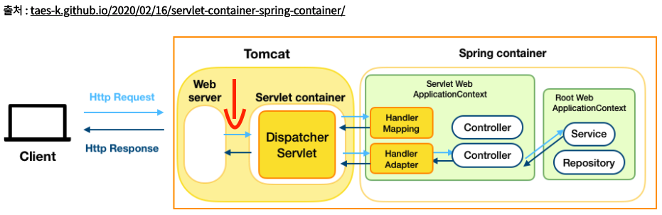

---

title: filter
categories:
- Spring
toc: true
toc_sticky: true
toc_label: 목차

---

## Step 1:  Filter 

#### Filter 란? 

필터는 스프링의 독자적인 기능이 아닌 자바 서블릿에서 제공하는 기능이다. 

필터는 주로 요청에 대한 인증, 권한 체크 등을 하는데에 쓰인다. 구체적으로 들어온 요청이 DispatcherServlet에 전달되기 전에 헤더를 검사해 인증 토큰이 있는지 없는지, 올바른지 올바르지 않은지 등을 검사할 수 있다.

* 필터 동작 부분 [빨간색 화살표 표시]  DispatcherServlet 이전

