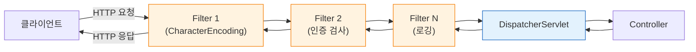
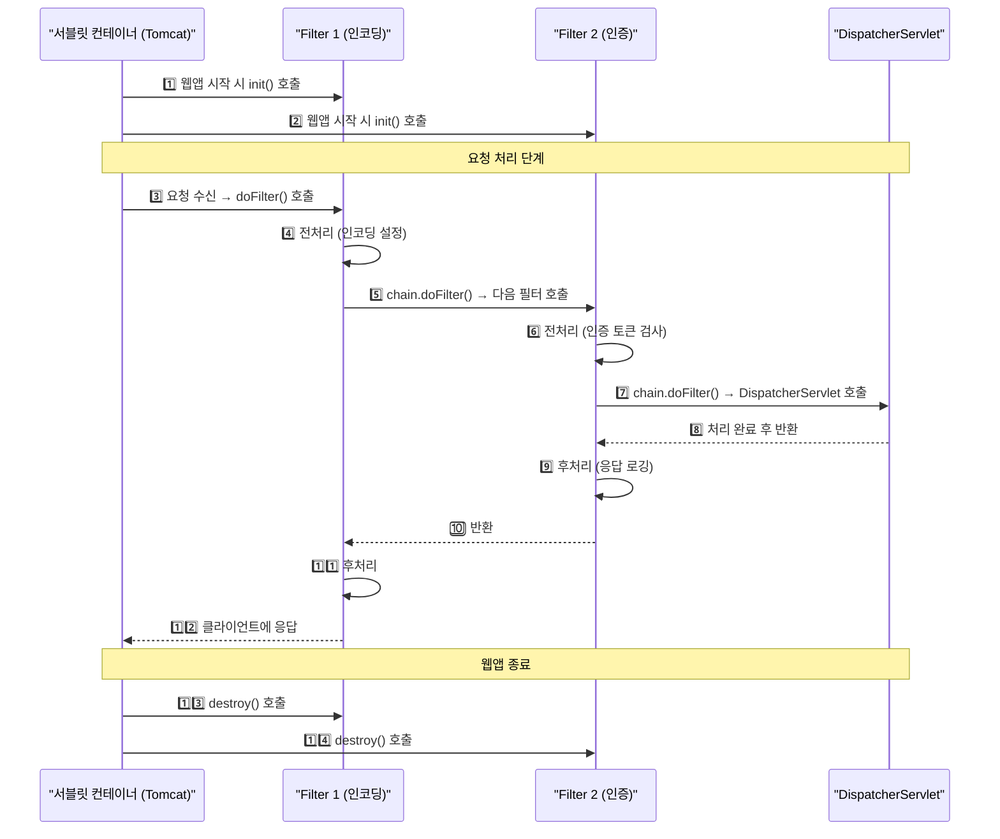

필터(Filter)는 스프링의 독자적인 기능이 아니라 자바 서블릿 스펙이 제공하는 기능이다. DispatcherServlet에 도달하기 전에 모든 요청을 가로챌 수 있어서 인증 토큰 검사, 문자 인코딩 설정, 요청/응답 로깅 같은 공통 처리에 활용된다. 필터가 언제 실행되고 어떻게 체인으로 연결되는지 이해하는 것이 핵심이다.

> **비유**: 필터는 공항 보안 검색대와 같다. 비행기(컨트롤러)에 탑승하기 전에 모든 승객(요청)이 여러 검색대(필터 체인)를 통과해야 한다. 검색대마다 다른 검사를 하고, 마지막 검색대를 통과해야 비행기에 탑승할 수 있다.

---

## 1단계: 필터의 위치


```mermaid
graph LR
    CLIENT["클라이언트"]
    F1["Filter 1\n(CharacterEncoding)"]
    F2["Filter 2\n(인증 검사)"]
    F3["Filter N\n(로깅)"]
    DS["DispatcherServlet"]
    CTRL["Controller"]

    CLIENT -->|"HTTP 요청"| F1
    F1 --> F2
    F2 --> F3
    F3 --> DS
    DS --> CTRL
    CTRL --> DS
    DS --> F3
    F3 --> F2
    F2 --> F1
    F1 -->|"HTTP 응답"| CLIENT

    style DS fill:#e3f2fd,stroke:#1565c0
    style F1 fill:#fff3e0,stroke:#f57c00
    style F2 fill:#fff3e0,stroke:#f57c00
    style F3 fill:#fff3e0,stroke:#f57c00
```

필터는 DispatcherServlet 이전에 실행된다. 이것이 스프링의 인터셉터(HandlerInterceptor)와의 핵심 차이다. 인터셉터는 DispatcherServlet 이후, 컨트롤러 이전에 실행된다.

| 구분 | 필터 (Filter) | 인터셉터 (HandlerInterceptor) |
|------|--------------|------------------------------|
| 실행 위치 | DispatcherServlet 이전 | DispatcherServlet 이후 |
| 스펙 | 서블릿 스펙 (javax.servlet) | 스프링 MVC |
| 스프링 빈 접근 | 어려움 (직접 getBean) | 용이 (@Autowired) |
| 주요 용도 | 인코딩, 보안 토큰, CORS | 인증/인가, 로깅, 공통 처리 |

---

## 2단계: 필터 생명주기와 동작 과정


```mermaid
sequenceDiagram
    participant SC as "서블릿 컨테이너 (Tomcat)"
    participant F1 as "Filter 1 (인코딩)"
    participant F2 as "Filter 2 (인증)"
    participant DS as "DispatcherServlet"

    SC->>F1: 1️⃣ 웹앱 시작 시 init() 호출
    SC->>F2: 2️⃣ 웹앱 시작 시 init() 호출

    Note over SC,DS: 요청 처리 단계
    SC->>F1: 3️⃣ 요청 수신 → doFilter() 호출
    F1->>F1: 4️⃣ 전처리 (인코딩 설정)
    F1->>F2: 5️⃣ chain.doFilter() → 다음 필터 호출
    F2->>F2: 6️⃣ 전처리 (인증 토큰 검사)
    F2->>DS: 7️⃣ chain.doFilter() → DispatcherServlet 호출
    DS-->>F2: 8️⃣ 처리 완료 후 반환
    F2->>F2: 9️⃣ 후처리 (응답 로깅)
    F2-->>F1: 🔟 반환
    F1->>F1: 1️⃣1️⃣ 후처리
    F1-->>SC: 1️⃣2️⃣ 클라이언트에 응답

    Note over SC,DS: 웹앱 종료
    SC->>F1: 1️⃣3️⃣ destroy() 호출
    SC->>F2: 1️⃣4️⃣ destroy() 호출
```

---

## 3단계: Filter 인터페이스

```java
// javax.servlet.Filter 인터페이스
public interface Filter {
    // 필터 초기화 — 서블릿 컨테이너가 필터 생성 후 단 한 번 호출
    default void init(FilterConfig filterConfig) throws ServletException {}

    // 요청마다 호출 — 실제 필터 로직 구현
    void doFilter(ServletRequest request, ServletResponse response,
                  FilterChain chain) throws IOException, ServletException;

    // 필터 소멸 — 웹앱 종료 전 한 번 호출 (리소스 해제)
    default void destroy() {}
}
```

---

## 4단계: web.xml로 필터 등록 (전통적 방법)

```xml
<!-- web.xml: 서블릿 컨테이너가 읽는 설정 파일 -->

<!-- 1. 기본 인코딩 필터 등록 -->
<filter>
    <filter-name>encodingFilter</filter-name>
    <filter-class>
        org.springframework.web.filter.CharacterEncodingFilter
    </filter-class>
    <init-param>
        <param-name>encoding</param-name>
        <param-value>UTF-8</param-value>
    </init-param>
    <init-param>
        <param-name>forceResponseEncoding</param-name>
        <param-value>true</param-value>
    </init-param>
</filter>
<filter-mapping>
    <filter-name>encodingFilter</filter-name>
    <url-pattern>/*</url-pattern> <!-- 모든 URL에 적용 -->
</filter-mapping>

<!-- 2. 커스텀 필터 등록 -->
<filter>
    <filter-name>customFilter</filter-name>
    <filter-class>com.example.filter.CustomHttpServletRequestFilter</filter-class>
</filter>
<filter-mapping>
    <filter-name>customFilter</filter-name>
    <url-pattern>/*</url-pattern>
</filter-mapping>

<!-- 필터 체인 순서: encodingFilter → customFilter → DispatcherServlet -->
```

---

## 5단계: 커스텀 필터 구현

### Filter 인터페이스 구현

```java
// com/example/filter/CustomHttpServletRequestFilter.java
public class CustomHttpServletRequestFilter implements Filter {

    @Override
    public void init(FilterConfig filterConfig) throws ServletException {
        // 필터 초기화 로직 (설정값 로딩 등)
        String configParam = filterConfig.getInitParameter("myConfig");
        System.out.println("Filter 초기화: " + configParam);
    }

    @Override
    public void doFilter(ServletRequest request,
                         ServletResponse response,
                         FilterChain chain)
            throws IOException, ServletException {

        HttpServletRequest httpRequest = (HttpServletRequest) request;
        String contentType = httpRequest.getContentType();

        HttpServletRequest wrappedRequest;

        // Content-Type에 따라 다른 래퍼 사용
        if (contentType == null || !contentType.contains("multipart")) {
            // 일반 요청: 커스텀 래퍼로 처리 (요청 바디 여러 번 읽기 등)
            wrappedRequest = new CustomHttpServletRequest(httpRequest);
        } else {
            // 멀티파트(파일 업로드): 스프링 표준 처리
            wrappedRequest = httpRequest;
        }

        // 다음 필터 또는 서블릿으로 요청 전달 (이 라인 없으면 요청이 멈춤!)
        chain.doFilter(wrappedRequest, response);
    }

    @Override
    public void destroy() {
        // 리소스 해제 (DB 커넥션, 파일 핸들 등)
        System.out.println("Filter 소멸");
    }
}
```

### HttpServletRequestWrapper 구현

```java
// 요청 바디를 여러 번 읽을 수 있도록 커스터마이징
public class CustomHttpServletRequest extends HttpServletRequestWrapper {

    private final byte[] cachedBody;

    public CustomHttpServletRequest(HttpServletRequest request) throws IOException {
        super(request);
        // 요청 바디를 미리 읽어서 캐싱
        // HttpServletRequest의 InputStream은 한 번만 읽을 수 있음
        InputStream is = request.getInputStream();
        this.cachedBody = is.readAllBytes();
    }

    @Override
    public ServletInputStream getInputStream() {
        // 캐싱된 바디로 새 InputStream 반환 → 여러 번 읽기 가능
        ByteArrayInputStream bais = new ByteArrayInputStream(cachedBody);
        return new CachedBodyServletInputStream(bais);
    }

    @Override
    public BufferedReader getReader() {
        return new BufferedReader(new InputStreamReader(getInputStream()));
    }
}
```

---

## 6단계: Spring Boot에서 필터 등록

Spring Boot에서는 web.xml 없이 코드로 필터를 등록한다.

```java
// 방법 1: @Component + @Order
@Component
@Order(1) // 필터 실행 순서 (낮을수록 먼저)
public class AuthFilter implements Filter {

    @Override
    public void doFilter(ServletRequest request, ServletResponse response,
                         FilterChain chain) throws IOException, ServletException {
        HttpServletRequest httpRequest = (HttpServletRequest) request;

        String token = httpRequest.getHeader("Authorization");
        if (token == null || !isValidToken(token)) {
            HttpServletResponse httpResponse = (HttpServletResponse) response;
            httpResponse.setStatus(HttpServletResponse.SC_UNAUTHORIZED);
            return; // chain.doFilter 호출하지 않음 → 요청 차단
        }

        chain.doFilter(request, response); // 토큰 유효 → 다음으로 진행
    }

    private boolean isValidToken(String token) {
        return token.startsWith("Bearer ") && token.length() > 10;
    }
}

// 방법 2: FilterRegistrationBean (URL 패턴, 순서 세밀 조정)
@Configuration
public class FilterConfig {

    @Bean
    public FilterRegistrationBean<CustomHttpServletRequestFilter> customFilter() {
        FilterRegistrationBean<CustomHttpServletRequestFilter> bean =
            new FilterRegistrationBean<>();
        bean.setFilter(new CustomHttpServletRequestFilter());
        bean.addUrlPatterns("/api/*"); // /api/로 시작하는 요청에만 적용
        bean.setOrder(2);             // 두 번째로 실행
        bean.setName("customFilter");
        return bean;
    }
}
```

---

<details class="extreme-scenario-details" ontoggle="if(this.open){var ad=this.querySelector('.extreme-scenario-ad');if(ad&&!ad.dataset.loaded){ad.dataset.loaded='1';(adsbygoogle=window.adsbygoogle||[]).push({});}}">
<summary class="extreme-scenario-summary">
<span class="extreme-scenario-icon">🔥</span>
<span class="extreme-scenario-label">극한 시나리오 — 클릭하여 펼치기</span>
<span class="extreme-scenario-toggle"></span>
</summary>
<div class="extreme-scenario-body">
<div class="extreme-scenario-ad" style="text-align:center; margin-bottom:1.5em;">
<ins class="adsbygoogle"
     style="display:block"
     data-ad-client="ca-pub-7225106491387870"
     data-ad-slot="0000000000"
     data-ad-format="auto"
     data-full-width-responsive="true"></ins>
</div>
<div class="extreme-scenario-content" markdown="1">

### 시나리오 1: chain.doFilter 호출 누락

```java
// 잘못된 코드: chain.doFilter()를 호출하지 않음
@Override
public void doFilter(ServletRequest request, ServletResponse response,
                     FilterChain chain) throws IOException, ServletException {
    System.out.println("요청 수신: " + ((HttpServletRequest)request).getRequestURI());
    // chain.doFilter(request, response); → 누락!
}
// 결과: 모든 요청이 필터에서 멈추고 컨트롤러에 도달하지 못함
//       브라우저에는 응답 없이 타임아웃 발생

// 해결: 요청을 차단할 의도가 없다면 반드시 chain.doFilter 호출
chain.doFilter(request, response);
```

### 시나리오 2: 필터에서 스프링 빈 주입 문제

```java
// 문제: web.xml에 등록한 필터는 스프링 컨테이너가 관리하지 않음
//       → @Autowired가 동작하지 않음
public class LegacyFilter implements Filter {
    @Autowired
    private UserService userService; // null! @Autowired 동작 안 함

    @Override
    public void doFilter(...) {
        userService.findUser(1L); // NullPointerException!
    }
}

// 해결 방법 1: Spring Boot의 FilterRegistrationBean 사용 (@Bean으로 등록)
// 해결 방법 2: DelegatingFilterProxy 사용 (web.xml → 스프링 빈에 위임)
// 해결 방법 3: WebApplicationContextUtils로 직접 ApplicationContext 접근
WebApplicationContext ctx = WebApplicationContextUtils
    .getWebApplicationContext(filterConfig.getServletContext());
userService = ctx.getBean(UserService.class);
```

### 시나리오 3: 요청 바디 두 번 읽기 문제

```java
// 문제: 필터에서 request.getInputStream()으로 바디를 읽으면
//       컨트롤러에서 @RequestBody로 바디를 다시 읽을 수 없음
//       (InputStream은 한 번 읽으면 소비됨)

// 해결: HttpServletRequestWrapper로 바디 캐싱
// → 위의 CustomHttpServletRequest 구현 참고
// 로깅 필터, 암호화 필터에서 자주 발생하는 문제
```

### 시나리오 4: 인코딩 필터 순서 오류

```xml
<!-- 잘못된 순서: 커스텀 필터가 인코딩 필터보다 먼저 -->
<filter-mapping>
    <filter-name>customFilter</filter-name>
    <url-pattern>/*</url-pattern>
</filter-mapping>
<filter-mapping>
    <filter-name>encodingFilter</filter-name> <!-- 너무 늦음! -->
    <url-pattern>/*</url-pattern>
</filter-mapping>
<!-- 결과: 커스텀 필터에서 읽은 파라미터가 이미 깨진 인코딩으로 처리됨 -->

<!-- 올바른 순서: 인코딩 필터가 가장 먼저 -->
<filter-mapping>
    <filter-name>encodingFilter</filter-name> <!-- 1순위 -->
    <url-pattern>/*</url-pattern>
</filter-mapping>
<filter-mapping>
    <filter-name>customFilter</filter-name>   <!-- 2순위 -->
    <url-pattern>/*</url-pattern>
</filter-mapping>
```

---
</div>
</div>
</details>

## 실무 체크리스트

```
□ chain.doFilter() 호출 여부 확인 — 누락 시 모든 요청 차단
□ 인코딩 필터(CharacterEncodingFilter)는 필터 체인에서 가장 먼저 등록
□ Spring Boot는 FilterRegistrationBean으로 URL 패턴과 순서 명시
□ 필터에서 스프링 빈 필요 시 @Component + @Order 방식 사용
□ 요청 바디 여러 번 읽으려면 HttpServletRequestWrapper 구현 필요
□ 인증/인가 로직은 Spring Security의 SecurityFilterChain 사용 권장 (필터 직접 구현보다)
□ 필터 예외 처리: 필터에서 발생한 예외는 @ControllerAdvice로 처리 안됨
   → 필터 내부에서 직접 HttpServletResponse에 에러 응답 작성
```

---

```
참조 - 스프링 MVC 서블릿 필터 커스터마이징
```
