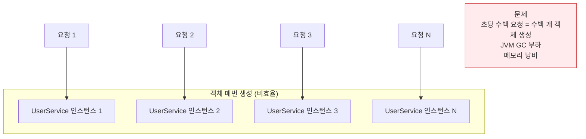
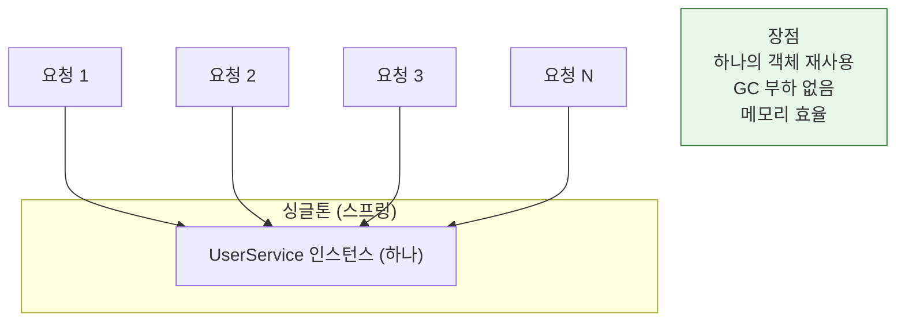
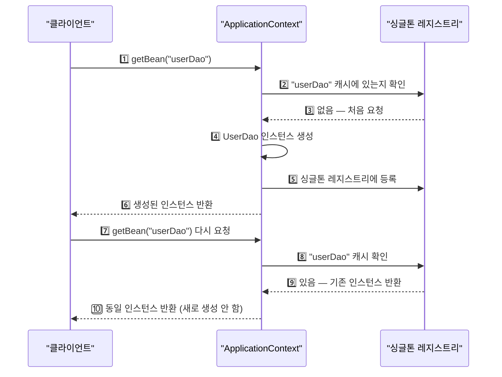
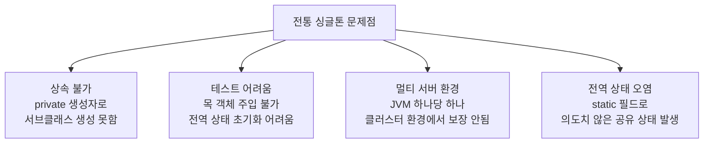
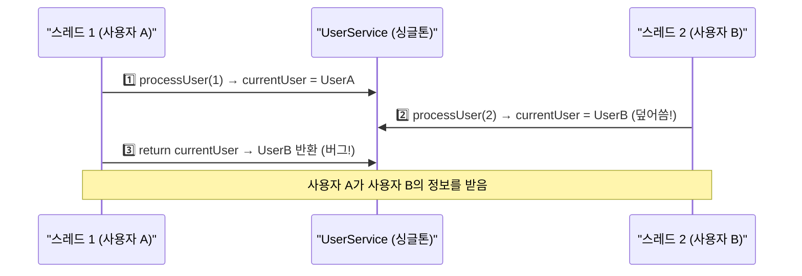
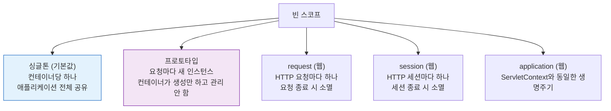

스프링은 왜 빈을 싱글톤으로 관리할까? 스프링이 처음 설계된 환경인 대규모 엔터프라이즈 서버는 초당 수백 개의 요청을 처리해야 한다. 요청마다 새 객체를 만들면 JVM 메모리 부하와 GC 압박이 심해진다. 스프링의 싱글톤 레지스트리는 이 문제를 우아하게 해결한다.

> **비유**: 스프링 싱글톤은 회사의 공용 프린터와 같다. 모든 직원(요청)이 각자 프린터를 구매하는 대신(매번 새 객체 생성), 하나의 공용 프린터(싱글톤 빈)를 공유해서 사용한다. 단, 프린터는 인쇄 중인 문서 정보(상태)를 내부에 저장하면 안 된다.

---

## 1단계: 싱글톤이 필요한 이유

### 요청마다 새 객체를 만들면 발생하는 문제





---

## 2단계: 일반 팩토리 vs 스프링 컨테이너

### 일반 자바 팩토리 — 매번 다른 객체

```java
// 일반 팩토리 클래스
public class DaoFactory {
    public UserDao userDao() {
        return new UserDao(connectionMaker()); // 호출할 때마다 새 객체 생성
    }
    public ConnectionMaker connectionMaker() {
        return new DConnectionMaker(); // 마찬가지로 새 객체
    }
}

// 테스트
DaoFactory factory = new DaoFactory();
UserDao dao1 = factory.userDao();
UserDao dao2 = factory.userDao();

System.out.println(dao1 == dao2); // false — 서로 다른 인스턴스
System.out.println(dao1);         // UserDao@118f375
System.out.println(dao2);         // UserDao@117a8bd
```

### 스프링 컨테이너 — 항상 같은 객체 (싱글톤)

```java
// 스프링 ApplicationContext 사용
ApplicationContext context =
    new AnnotationConfigApplicationContext(AppConfig.class);

UserDao dao1 = context.getBean("userDao", UserDao.class);
UserDao dao2 = context.getBean("userDao", UserDao.class);

System.out.println(dao1 == dao2); // true — 동일한 인스턴스
System.out.println(dao1);         // UserDao@ee22f7
System.out.println(dao2);         // UserDao@ee22f7 (같은 주소)
```



---

## 3단계: 디자인 패턴 싱글톤의 한계

스프링이 직접 싱글톤을 관리하는 이유는 전통적인 싱글톤 패턴의 문제점 때문이다.

```java
// 전통적인 싱글톤 패턴
public class UserService {
    // 1. private static 인스턴스 — 전역 상태
    private static UserService instance;

    // 2. private 생성자 — 외부에서 new 불가
    private UserService() {}

    // 3. 정적 팩토리 메서드
    public static UserService getInstance() {
        if (instance == null) {
            instance = new UserService();
        }
        return instance;
    }
}
```

전통적 싱글톤의 문제점:



---

## 4단계: 스프링 싱글톤 레지스트리의 장점

스프링은 싱글톤 패턴의 단점을 해결하면서 싱글톤의 이점을 제공한다.

```java
// 스프링이 관리하는 싱글톤 빈 — 일반 클래스처럼 작성
@Service // 스프링이 싱글톤으로 관리
public class UserService {
    // private 생성자 없음 — 상속 가능
    // static 없음 — 일반 클래스
    // 테스트 시 new UserService(mockRepo)로 생성 가능

    private final UserRepository userRepository;

    public UserService(UserRepository userRepository) {
        this.userRepository = userRepository;
    }
}
```

| 항목 | 전통 싱글톤 패턴 | 스프링 싱글톤 레지스트리 |
|------|----------------|----------------------|
| 생성자 | private 필수 | public 허용 |
| 상속 | 불가 | 가능 |
| 테스트 | 어려움 | 용이 (생성자 주입) |
| DI | 불가 | 가능 |
| 스코프 변경 | 불가 | @Scope로 변경 가능 |

---

## 5단계: 싱글톤 빈의 필수 조건 — 무상태(Stateless)

싱글톤은 여러 스레드가 동시에 접근한다. 인스턴스 변수에 상태를 저장하면 스레드 간 데이터가 섞인다.

```java
// 위험한 코드 — 인스턴스 변수에 상태 저장
@Service
public class UserService {
    private User currentUser; // 공유 상태! 위험!

    public User processUser(Long id) {
        currentUser = userRepository.findById(id).get(); // 여기서 다른 스레드가 덮어쓸 수 있음
        // ... 처리 중 ...
        return currentUser; // 다른 스레드가 바꾼 currentUser를 반환할 수 있음
    }
}
```



```java
// 올바른 코드 — 로컬 변수 또는 파라미터 사용
@Service
public class UserService {
    // 인스턴스 변수 없음 (또는 final 의존성만)
    private final UserRepository userRepository;

    public UserService(UserRepository userRepository) {
        this.userRepository = userRepository;
    }

    public User processUser(Long id) {
        // 로컬 변수: 각 스레드의 스택에 독립적으로 생성 — 안전
        User user = userRepository.findById(id).get();
        // ... 처리 ...
        return user; // 로컬 변수이므로 스레드 간 간섭 없음
    }
}
```

**핵심 규칙**: 싱글톤 빈에서 인스턴스 변수는 `final` 의존성 객체만 허용한다. 요청별 데이터는 반드시 로컬 변수, 파라미터, 반환값으로만 처리한다.

---

## 6단계: 빈 스코프 종류

스프링 빈의 기본 스코프는 싱글톤이지만, 용도에 따라 변경할 수 있다.



```java
// 프로토타입 스코프: 요청마다 새 인스턴스
@Bean
@Scope("prototype")
public ShoppingCart shoppingCart() {
    return new ShoppingCart(); // 장바구니는 사용자마다 달라야 함
}

// request 스코프: HTTP 요청마다 새 인스턴스
@Component
@Scope(value = "request", proxyMode = ScopedProxyMode.TARGET_CLASS)
public class RequestInfo {
    private String requestId; // 요청별 고유 ID — 싱글톤에 주입 가능
}
```

### 싱글톤 빈에 프로토타입 빈 주입 시 주의사항

```java
// 문제: 싱글톤에 프로토타입 주입 → 프로토타입이 싱글톤처럼 동작
@Service // 싱글톤
public class OrderService {
    @Autowired
    private ShoppingCart cart; // 프로토타입이지만 한 번만 주입됨 → 사실상 싱글톤
}

// 해결: Provider 사용 (매번 새 인스턴스 요청)
@Service
public class OrderService {
    @Autowired
    private ObjectProvider<ShoppingCart> cartProvider;

    public void processOrder() {
        ShoppingCart cart = cartProvider.getObject(); // 매번 새 인스턴스
    }
}
```

---

<details class="extreme-scenario-details" ontoggle="if(this.open){var ad=this.querySelector('.extreme-scenario-ad');if(ad&&!ad.dataset.loaded){ad.dataset.loaded='1';(adsbygoogle=window.adsbygoogle||[]).push({});}}">
<summary class="extreme-scenario-summary">
<span class="extreme-scenario-icon">🔥</span>
<span class="extreme-scenario-label">극한 시나리오 — 클릭하여 펼치기</span>
<span class="extreme-scenario-toggle"></span>
</summary>
<div class="extreme-scenario-body">
<div class="extreme-scenario-ad" style="text-align:center; margin-bottom:1.5em;">
<ins class="adsbygoogle"
     style="display:block"
     data-ad-client="ca-pub-7225106491387870"
     data-ad-slot="0000000000"
     data-ad-format="auto"
     data-full-width-responsive="true"></ins>
</div>
<div class="extreme-scenario-content" markdown="1">

### 시나리오 1: 싱글톤 빈에 상태 저장 — 데이터 오염

```java
@Service
public class StatefulService {
    private int price; // 인스턴스 변수 — 위험!

    public void order(String name, int price) {
        this.price = price; // 스레드 A가 10000 저장
    }

    public int getPrice() {
        return this.price; // 스레드 B가 읽으면 스레드 A의 값이 나올 수 있음
    }
}

// 재현 시나리오:
// 스레드 A: order("A", 10000) → price = 10000
// 스레드 B: order("B", 20000) → price = 20000 (덮어씀)
// 스레드 A: getPrice() → 20000 반환 (버그! A는 10000을 기대)

// 해결: price를 로컬 변수로 처리
public int order(String name, int price) {
    return price; // 반환값으로 처리 — 인스턴스 변수 사용 안 함
}
```

### 시나리오 2: @Configuration 없이 @Bean 사용 — 싱글톤 깨짐

```java
// 잘못된 코드: @Configuration 없이 @Bean 사용
public class AppConfig { // @Configuration 없음!
    @Bean
    public UserRepository userRepository() {
        return new MemoryUserRepository();
    }

    @Bean
    public UserService userService() {
        return new UserService(userRepository()); // userRepository() 직접 호출
    }
}
// 결과: userRepository() 호출 시마다 new MemoryUserRepository() 실행
//       → userService에 주입된 레포지토리와 getBean("userRepository")의 레포지토리가 다름
//       → 싱글톤 보장 안됨

// 올바른 코드: @Configuration 필수
@Configuration // CGLIB 프록시로 감싸서 메서드 호출 가로채기 → 싱글톤 보장
public class AppConfig {
    @Bean
    public UserRepository userRepository() { ... }
    @Bean
    public UserService userService() { return new UserService(userRepository()); }
}
```

### 시나리오 3: 프로토타입 빈의 소멸 관리 문제

```java
@Bean
@Scope("prototype")
public ExpensiveResource resource() {
    return new ExpensiveResource(); // DB 커넥션, 파일 핸들 등
}

// 프로토타입 스코프: 스프링이 생성만 하고 소멸은 관리 안 함
// → destroy() 메서드 자동 호출 안됨
// → 클라이언트가 직접 close() 해야 함

// 해결: try-with-resources 또는 명시적 close()
ExpensiveResource res = context.getBean(ExpensiveResource.class);
try {
    res.doWork();
} finally {
    res.close(); // 직접 정리
}
```

---
</div>
</div>
</details>

## 실무 체크리스트

```
□ 싱글톤 빈에 인스턴스 변수로 상태 저장 절대 금지
□ 요청별 데이터는 로컬 변수, 파라미터, 반환값으로만 처리
□ 사용자별 데이터(장바구니 등)는 prototype 또는 request 스코프 사용
□ @Configuration 없이 @Bean 사용 시 싱글톤 보장 안됨 → @Configuration 필수
□ 싱글톤에 프로토타입 빈 주입 시 ObjectProvider 사용
□ 스프링 빈의 기본 스코프는 싱글톤 — 변경 시 이유 명확하게 문서화
```

---

```
참조 - 토비의 스프링 3.1 By 이일민
```
