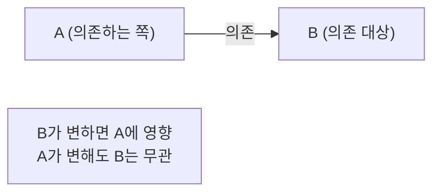
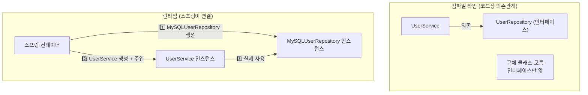
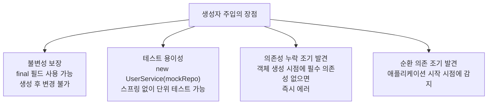
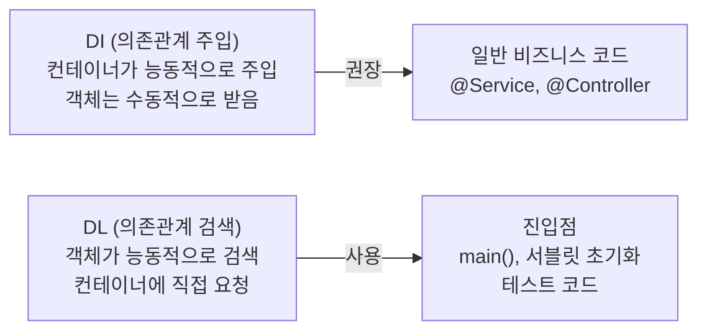
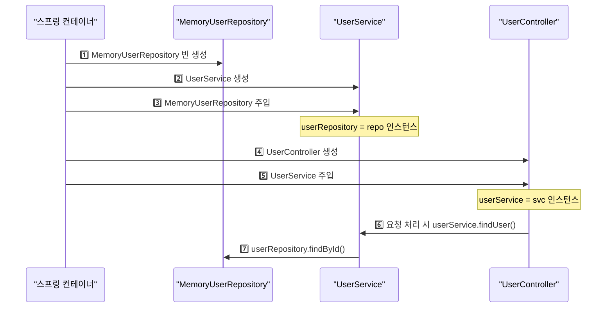

의존관계 주입(DI, Dependency Injection)은 객체가 스스로 의존 객체를 생성하지 않고, 외부(스프링 컨테이너)에서 주입받는 방식이다. DI를 올바르게 이해하면 왜 스프링이 인터페이스 중심으로 설계하는지, 왜 테스트가 쉬워지는지 자연스럽게 이해할 수 있다.

> **비유**: DI는 콘센트와 전기 코드의 관계와 같다. 가전제품(객체)은 직접 발전소(구현체)에 연결되지 않는다. 콘센트(인터페이스)를 통해 연결되므로, 발전소가 바뀌어도(구현체 교체) 가전제품을 바꿀 필요가 없다.

---

## 1단계: 의존관계란 무엇인가

두 클래스 A, B가 있을 때 A가 B를 사용한다면 A는 B에 의존한다. 의존관계에서 중요한 것은 방향성이다. B가 변하면 A에 영향을 미치지만, A가 변해도 B는 영향을 받지 않는다.



### 강한 결합 — 문제 있는 코드

```java
// 강한 결합: A가 B의 구체 클래스를 직접 알고 있음
public class UserService {
    // 직접 구체 클래스를 생성 → 결합도가 높음
    private UserRepository userRepository = new MySQLUserRepository();

    public User findUser(Long id) {
        return userRepository.findById(id); // MySQLUserRepository에 직접 의존
    }
}

// 문제: DB를 PostgreSQL로 바꾸려면 UserService 코드를 직접 수정해야 함
// → OCP(개방-폐쇄 원칙) 위반: 확장에는 열려있고 변경에는 닫혀있어야 하는데
//   DB 교체 = UserService 수정이 되어버림
```

### 느슨한 결합 — 올바른 설계

```java
// 느슨한 결합: 인터페이스에만 의존
public class UserService {
    private UserRepository userRepository; // 인터페이스 타입

    // 어떤 구현체가 올지는 외부에서 결정 (DI)
    public UserService(UserRepository userRepository) {
        this.userRepository = userRepository;
    }
}
// UserRepository 구현체가 바뀌어도 UserService 코드는 변경 없음
```

---

## 2단계: 컴파일 타임 의존관계 vs 런타임 의존관계

DI의 핵심은 컴파일 타임에는 구체 클래스를 모르고, 런타임에 컨테이너가 연결해준다는 것이다.



---

## 3단계: 의존관계 주입 세 가지 방법

### 방법 1 — 생성자 주입 (권장)

```java
@Service
public class UserService {
    // final: 불변 보장 — 한 번 주입되면 변경 불가
    private final UserRepository userRepository;

    // @Autowired: 생성자가 하나면 생략 가능 (Spring 4.3+)
    @Autowired
    public UserService(UserRepository userRepository) {
        this.userRepository = userRepository;
    }
}
```

생성자 주입을 권장하는 이유:



### 방법 2 — 필드 주입 (비권장)

```java
@Service
public class UserService {
    // 간편하지만 문제가 많음
    @Autowired
    private UserRepository userRepository;
}

// 문제 1: final 사용 불가 → 불변 보장 안됨
// 문제 2: 테스트 시 스프링 컨테이너 없이는 주입 불가
//         → new UserService()로 생성하면 userRepository = null
// 문제 3: DI 프레임워크에 강하게 결합
// → 테스트 코드, @Configuration 내부에서만 제한적으로 사용
```

### 방법 3 — Setter 주입 (선택적 의존성에만 사용)

```java
@Service
public class UserService {
    private UserRepository userRepository;

    @Autowired(required = false) // 선택적 의존성 — 없어도 동작 가능
    public void setUserRepository(UserRepository userRepository) {
        this.userRepository = userRepository;
    }
}

// 문제: 의존성이 언제든 변경될 수 있음 (불변 보장 안됨)
// 사용 시점: 선택적으로 주입받는 의존성에만 사용
```

### 세 가지 방법 비교

| 방법 | final | 테스트 | 스프링 없이 사용 | 순환 의존 감지 |
|------|-------|--------|-----------------|--------------|
| 생성자 주입 | 가능 | 용이 | 가능 | 시작 시점 |
| 필드 주입 | 불가 | 어려움 | 불가 | 늦게 감지 |
| Setter 주입 | 불가 | 가능 | 가능 | 늦게 감지 |

---

## 4단계: 의존관계 검색 (DL, Dependency Lookup)

DI의 반대 방향인 의존관계 검색(DL)은 객체가 스스로 컨테이너에서 의존 객체를 꺼내는 방식이다.

```java
// 의존관계 주입 (DI) — 외부에서 주입
@Service
public class UserService {
    private final UserRepository userRepository;

    public UserService(UserRepository userRepository) { // 주입받음
        this.userRepository = userRepository;
    }
}

// 의존관계 검색 (DL) — 직접 꺼냄
public class UserService {
    public UserService() {
        // 직접 컨테이너에서 검색
        ApplicationContext context =
            new AnnotationConfigApplicationContext(AppConfig.class);
        this.userRepository = context.getBean("userRepository", UserRepository.class);
    }
}
```



**DL이 필요한 경우**: `main()` 메서드는 스프링 컨테이너 밖에 있어서 DI를 받을 수 없다. 이때는 직접 `getBean()`으로 빈을 꺼내야 한다. 하지만 서블릿은 스프링이 대신 처리하므로 직접 구현할 필요가 없다.

---

## 5단계: DI의 실제 동작 원리



---

## 6단계: @Qualifier와 @Primary — 같은 타입 빈 구분

같은 인터페이스를 구현한 빈이 여러 개 있을 때 어떤 것을 주입할지 지정해야 한다.

```java
@Repository
@Primary // 기본으로 사용할 구현체
public class JpaUserRepository implements UserRepository { ... }

@Repository
@Qualifier("memoryRepo") // 특정 상황에서 직접 지정
public class MemoryUserRepository implements UserRepository { ... }

// 주입 시
@Service
public class UserService {
    // @Primary가 붙은 JpaUserRepository가 주입됨
    public UserService(UserRepository userRepository) { ... }
}

@Service
public class TestService {
    // @Qualifier로 명시적 지정
    public TestService(@Qualifier("memoryRepo") UserRepository userRepository) { ... }
}
```

---

<details class="extreme-scenario-details" ontoggle="if(this.open){var ad=this.querySelector('.extreme-scenario-ad');if(ad&&!ad.dataset.loaded){ad.dataset.loaded='1';(adsbygoogle=window.adsbygoogle||[]).push({});}}">
<summary class="extreme-scenario-summary">
<span class="extreme-scenario-icon">🔥</span>
<span class="extreme-scenario-label">극한 시나리오 — 클릭하여 펼치기</span>
<span class="extreme-scenario-toggle"></span>
</summary>
<div class="extreme-scenario-body">
<div class="extreme-scenario-ad" style="text-align:center; margin-bottom:1.5em;">
<ins class="adsbygoogle"
     style="display:block"
     data-ad-client="ca-pub-7225106491387870"
     data-ad-slot="0000000000"
     data-ad-format="auto"
     data-full-width-responsive="true"></ins>
</div>
<div class="extreme-scenario-content" markdown="1">

### 시나리오 1: 필드 주입으로 단위 테스트 불가

```java
// 필드 주입 코드
@Service
public class UserService {
    @Autowired
    private UserRepository userRepository; // 스프링 없이 주입 불가
}

// 단위 테스트 시도
@Test
void test() {
    UserService service = new UserService(); // userRepository = null!
    service.findUser(1L); // NullPointerException!
}

// 해결: 생성자 주입으로 변경
public UserService(UserRepository userRepository) {
    this.userRepository = userRepository;
}

// 테스트
@Test
void test() {
    UserRepository mockRepo = new MemoryUserRepository();
    UserService service = new UserService(mockRepo); // 문제없음
    service.findUser(1L);
}
```

### 시나리오 2: 같은 타입 빈 2개 — NoUniqueBeanDefinitionException

```java
@Repository
public class MySQLUserRepository implements UserRepository { ... }

@Repository
public class PostgreSQLUserRepository implements UserRepository { ... }

@Service
public class UserService {
    // UserRepository 타입이 2개 → 어느 것을 주입할지 모름
    public UserService(UserRepository userRepository) { ... }
    // NoUniqueBeanDefinitionException 발생!
}

// 해결 방법:
// 1. @Primary로 기본 구현체 지정
// 2. @Qualifier로 이름 명시
// 3. 빈 이름과 파라미터 이름 맞추기 (파라미터 이름 = mySQLUserRepository)
```

### 시나리오 3: 순환 의존 관계

```java
@Service
public class ServiceA {
    private final ServiceB serviceB;
    public ServiceA(ServiceB serviceB) { this.serviceB = serviceB; }
}

@Service
public class ServiceB {
    private final ServiceA serviceA;
    public ServiceB(ServiceA serviceA) { this.serviceA = serviceA; }
}
// BeanCurrentlyInCreationException
// ServiceA 생성하려면 ServiceB 필요 → ServiceB 생성하려면 ServiceA 필요 → 무한 루프

// 해결: 두 서비스가 공통으로 사용하는 ServiceC를 분리
// 또는 의존 방향 단방향으로 재설계
```

---
</div>
</div>
</details>

## 실무 체크리스트

```
□ 의존성 주입은 생성자 주입 사용 (final + 불변 + 테스트 용이성)
□ 필드 주입(@Autowired 필드)은 테스트 코드와 @Configuration에서만 허용
□ 인터페이스 타입으로 주입 받기 (구체 클래스 직접 주입 지양)
□ 같은 타입 빈 여러 개면 @Primary 또는 @Qualifier로 명확하게 지정
□ 순환 의존 관계는 설계 문제 신호 → 책임 분리 재검토
□ Lombok @RequiredArgsConstructor로 생성자 주입 보일러플레이트 제거
```

```java
// Lombok으로 생성자 주입 간소화
@Service
@RequiredArgsConstructor // final 필드에 대한 생성자 자동 생성
public class UserService {
    private final UserRepository userRepository; // @Autowired 없이 자동 주입
}
```

---

```
참조 - 토비의 스프링 3.1 By 이일민
```
