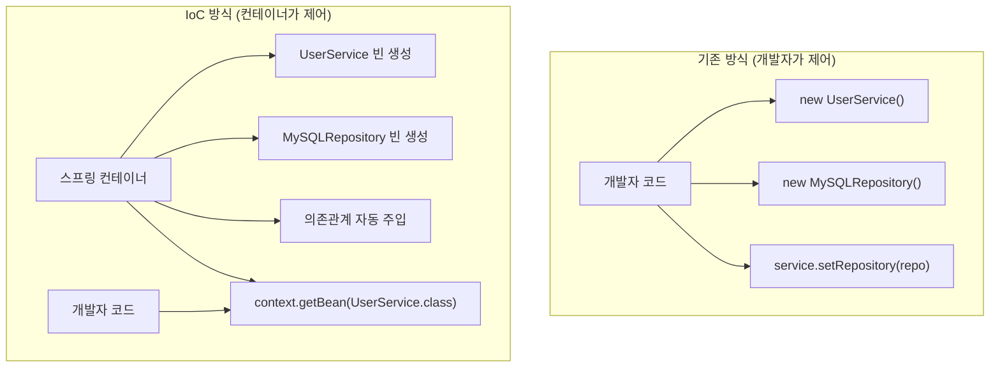
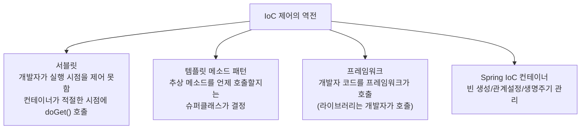
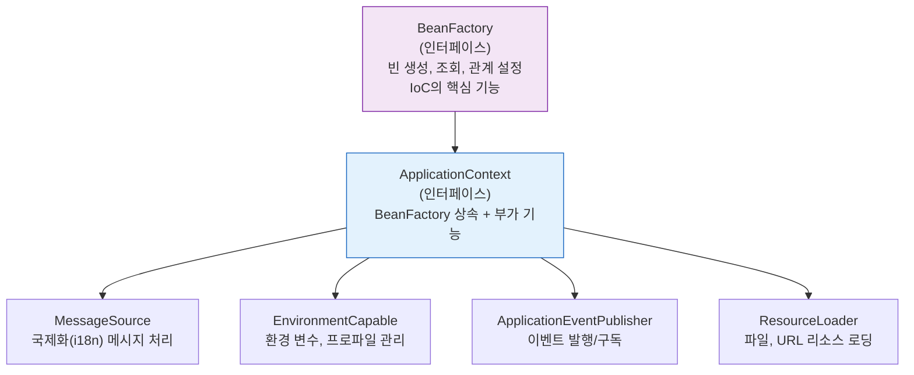
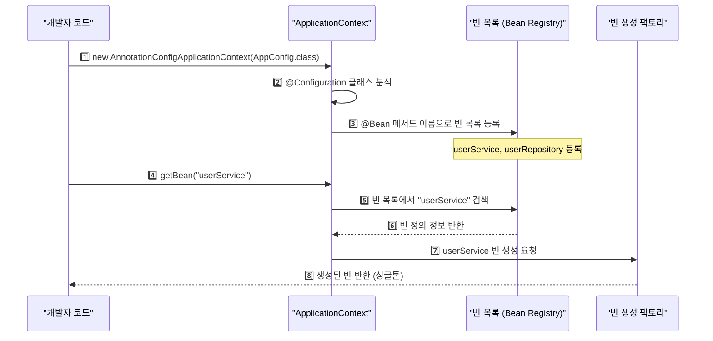

제어의 역전(IoC, Inversion of Control)은 스프링의 모든 기능의 기초가 되는 핵심 원리다. 기존 프로그래밍에서는 개발자가 직접 객체를 생성하고 의존 관계를 맺었지만, IoC에서는 이 제어권을 컨테이너에게 넘긴다. 스프링이 객체를 만들고, 연결하고, 생명주기를 관리한다.

> **비유**: 제어의 역전은 레스토랑과 같다. 일반 요리(일반 프로그래밍)는 요리사가 직접 재료를 구매하고 조리한다. IoC는 재료 구매, 칼 관리, 청소까지 레스토랑 매니저(컨테이너)가 담당하고, 요리사는 요리 자체(비즈니스 로직)에만 집중한다.

---

## 1단계: 일반 프로그래밍 vs IoC

### 기존 방식 — 개발자가 직접 제어

```java
// 기존 방식: 개발자가 직접 객체 생성 및 의존 관계 설정
public class UserService {
    // 직접 구체 클래스를 생성 → 강한 결합
    private UserRepository userRepository = new MySQLUserRepository();

    public void createUser(String name) {
        userRepository.save(new User(name));
    }
}

// 문제: MySQLUserRepository를 PostgreSQLUserRepository로 바꾸려면
//       UserService 코드를 직접 수정해야 함 → OCP 위반
```

### IoC 방식 — 컨테이너가 제어

```java
// IoC 방식: 스프링 컨테이너가 의존 관계 주입
@Service
public class UserService {
    // 어떤 구현체가 올지 알 필요 없음 — 인터페이스에만 의존
    private final UserRepository userRepository;

    // 생성자 주입 — 스프링 컨테이너가 런타임에 적절한 구현체 주입
    public UserService(UserRepository userRepository) {
        this.userRepository = userRepository;
    }
}
// UserRepository 구현체를 변경해도 UserService 코드는 건드리지 않아도 됨
```

### IoC 전후 제어 흐름 비교



---

## 2단계: IoC의 구체적인 예시들

IoC는 스프링만의 기술이 아니다. 이미 여러 곳에서 사용되고 있다.



### 서블릿에서의 IoC

```java
// 개발자는 서블릿 코드를 작성하지만
// 서블릿이 언제 생성되고, 언제 destroy되는지는
// 서블릿 컨테이너(Tomcat)가 결정한다
public class MyServlet extends HttpServlet {
    // Tomcat이 필요할 때 호출 (개발자가 직접 호출 불가)
    @Override
    protected void doGet(HttpServletRequest req, HttpServletResponse resp) {
        // 요청 처리 로직
    }
}
```

---

## 3단계: 스프링 IoC 컨테이너

### BeanFactory vs ApplicationContext



**핵심 요약**: 실무에서는 항상 `ApplicationContext`를 사용한다. `BeanFactory`는 IoC 기본 기능만 있고, `ApplicationContext`는 엔터프라이즈 개발에 필요한 모든 부가 기능을 제공한다.

---

## 4단계: 빈 설정 방법

### 방법 1 — 자바 설정 클래스 (@Configuration)

```java
// 자바 코드로 빈 설정 (현재 가장 많이 사용)
@Configuration // 이 클래스가 빈 설정 파일임을 표시
public class AppConfig {

    @Bean // 이 메서드가 반환하는 객체를 빈으로 등록
    public UserRepository userRepository() {
        return new MemoryUserRepository(); // 구현체 선택은 여기서만
    }

    @Bean
    public UserService userService() {
        return new UserService(userRepository()); // 의존관계 주입
    }
}
```

```java
// ApplicationContext 생성 및 빈 사용
public class Main {
    public static void main(String[] args) {
        // @Configuration 클래스를 설정 정보로 사용
        ApplicationContext context =
            new AnnotationConfigApplicationContext(AppConfig.class);

        // 빈 이름 또는 타입으로 조회
        UserService userService = context.getBean("userService", UserService.class);
        // 또는
        UserService userService2 = context.getBean(UserService.class);
    }
}
```

### 방법 2 — XML 설정 (레거시)

```xml
<!-- applicationContext.xml (레거시 프로젝트에서 사용) -->
<beans>
    <bean id="userRepository"
          class="com.example.repository.MemoryUserRepository"/>

    <bean id="userService"
          class="com.example.service.UserService">
        <!-- 생성자 주입 -->
        <constructor-arg ref="userRepository"/>
    </bean>
</beans>
```

```java
// XML 설정 사용
ApplicationContext context =
    new GenericXmlApplicationContext("applicationContext.xml");
UserService userService = context.getBean("userService", UserService.class);
```

### 방법 3 — 컴포넌트 스캔 (현재 표준)

```java
// @Component, @Service, @Repository, @Controller 어노테이션으로 자동 등록
@Service // @Component + 서비스 계층 의미
public class UserService {
    private final UserRepository userRepository;

    @Autowired // 스프링이 자동으로 UserRepository 빈을 주입
    public UserService(UserRepository userRepository) {
        this.userRepository = userRepository;
    }
}

@Repository // @Component + 데이터 접근 계층 의미
public class MemoryUserRepository implements UserRepository { ... }
```

---

## 5단계: ApplicationContext 동작 원리



---

## 6단계: IoC 용어 정리

| 용어 | 설명 | 특징 |
|------|------|------|
| **빈 (Bean)** | 스프링이 관리하는 객체 | 스프링이 직접 생성/제어 |
| **빈 팩토리 (BeanFactory)** | IoC 핵심 컨테이너 | 빈 등록/생성/조회 |
| **애플리케이션 컨텍스트** | BeanFactory + 부가 기능 | 실무에서 사용하는 컨테이너 |
| **설정 메타정보** | 빈 정의 정보 | @Configuration, XML, @Component |
| **IoC 컨테이너** | ApplicationContext의 다른 이름 | 빈의 생명주기 관리 |

---

<details class="extreme-scenario-details">
<summary class="extreme-scenario-summary">
<span class="extreme-scenario-icon">🔥</span>
<span class="extreme-scenario-label">극한 시나리오 — 클릭하여 펼치기</span>
<span class="extreme-scenario-toggle"></span>
</summary>
<div class="extreme-scenario-body">

<div class="extreme-scenario-content" markdown="1">

### 시나리오 1: 빈 이름 충돌

```java
@Configuration
public class AppConfig {
    @Bean
    public UserRepository userRepository() { // 빈 이름: "userRepository"
        return new MemoryUserRepository();
    }
}

@Configuration
public class TestConfig {
    @Bean
    public UserRepository userRepository() { // 이름 충돌!
        return new JpaUserRepository();
    }
}
// 결과: 나중에 등록된 빈이 덮어씀 (Spring Boot에서는 기본값으로 오류 발생)
// spring.main.allow-bean-definition-overriding=true 로 명시적으로 허용 가능
```

### 시나리오 2: 순환 의존 관계

```java
@Service
public class ServiceA {
    private final ServiceB serviceB;
    public ServiceA(ServiceB serviceB) { this.serviceB = serviceB; }
}

@Service
public class ServiceB {
    private final ServiceA serviceA;
    public ServiceB(ServiceA serviceA) { this.serviceA = serviceA; }
}
// 결과: BeanCurrentlyInCreationException — 생성자 순환 의존 불가
// 해결:
// 1. 순환 의존 제거 (설계 문제 — 서비스 분리)
// 2. 필드 주입 또는 setter 주입으로 변경 (비권장)
// 3. @Lazy 어노테이션으로 지연 초기화
```

### 시나리오 3: 빈 범위(Scope) 오해

```java
// 기본값: 싱글톤 — 컨테이너당 하나의 인스턴스
@Service
public class UserService { ... }

// 요청마다 새 인스턴스 필요 시
@Bean
@Scope("prototype") // 요청마다 새 객체 생성
public ExpensiveObject expensiveObject() { ... }

// 주의: 싱글톤 빈에 프로토타입 빈을 주입하면 프로토타입이 싱글톤처럼 동작
// → Provider 또는 ObjectFactory 사용 필요
```

---
</div>
</div>
</details>

## 실무 체크리스트

```
□ 신규 프로젝트는 @Component, @Service, @Repository 컴포넌트 스캔 방식 사용
□ 레거시 XML 설정을 @Configuration으로 마이그레이션 시 빈 이름 충돌 확인
□ 순환 의존 관계는 설계 문제 신호 — 서비스/책임 분리 검토
□ 빈의 기본 스코프는 싱글톤 — 멀티스레드 환경에서 상태(인스턴스 변수) 금지
□ ApplicationContext vs BeanFactory: 항상 ApplicationContext 사용
□ getBean() 직접 호출은 테스트 코드나 진입점에서만 사용 (일반 코드에서는 DI 사용)
```

---

```
참조 - 토비의 스프링 3.1 By 이일민
```
