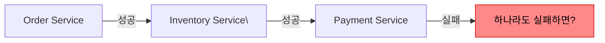
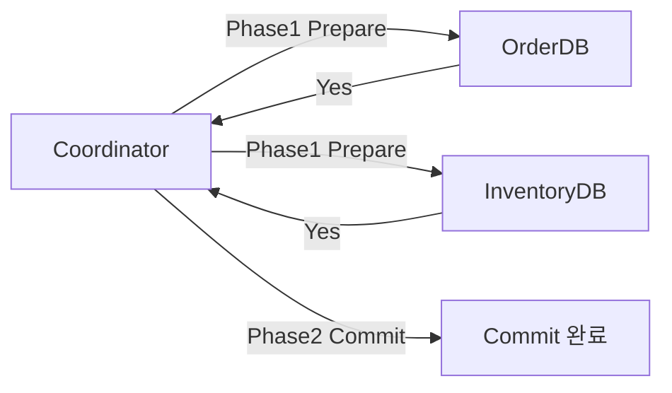
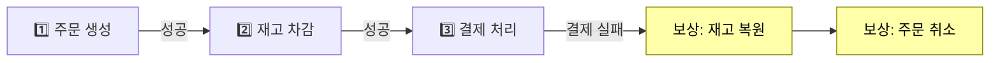
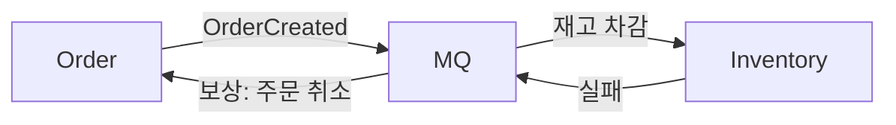
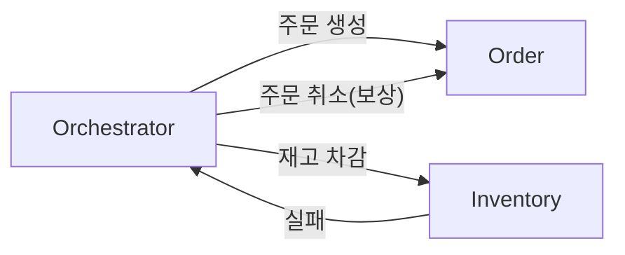
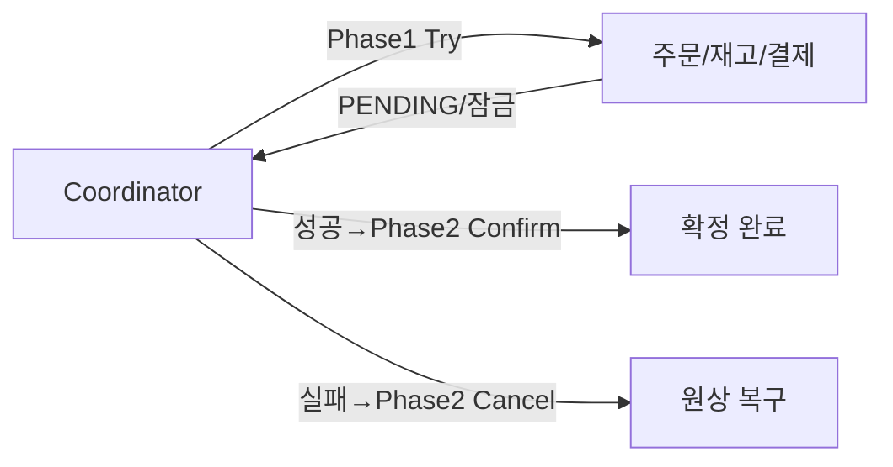
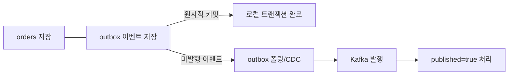
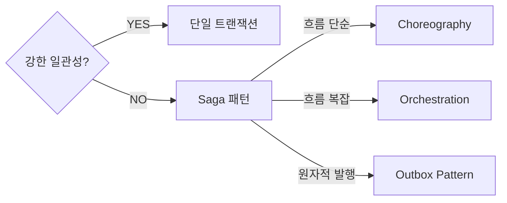

마이크로서비스 아키텍처에서는 단일 비즈니스 작업이 여러 서비스에 걸쳐 실행된다. 각 서비스는 독립적인 데이터베이스를 가지므로 전통적인 ACID 트랜잭션을 사용할 수 없다. 분산 트랜잭션은 이 문제를 해결하기 위한 다양한 패턴을 다룬다.

> **비유**: 여러 은행 계좌 간 이체와 같다. A 은행에서 출금하고 B 은행에 입금할 때 중간에 네트워크가 끊기면 출금만 되고 입금이 안 될 수 있다. 각 은행(서비스)이 독립적이라 한쪽이 실패해도 다른 쪽을 자동으로 되돌릴 수 없다.

---

## 왜 분산 트랜잭션이 어려운가

단일 DB에서는 `BEGIN/COMMIT/ROLLBACK`이 원자적으로 동작한다. 하지만 마이크로서비스에서는 각 서비스가 독립 DB를 소유하므로 하나의 트랜잭션으로 묶을 수 없다.



### CAP 정리

분산 시스템은 CAP(일관성, 가용성, 파티션 내성) 중 2개만 동시에 보장할 수 있다.

| 조합 | 특징 | 예시 |
|------|------|------|
| CP | 일관성 + 파티션 내성 | ZooKeeper, HBase |
| AP | 가용성 + 파티션 내성 | Cassandra, DynamoDB |
| CA | 일관성 + 가용성 | 단일 노드 DB |

마이크로서비스에서는 네트워크 파티션이 불가피하므로 **AP를 선택하고 최종 일관성(Eventual Consistency)**을 추구하는 것이 현실적이다.

---

## 2PC (Two-Phase Commit)

분산 환경에서 강한 일관성(Strong Consistency)을 제공하려는 프로토콜이다. **코디네이터**가 모든 참여자를 2단계로 조율한다.

1️⃣ **Phase 1 - Prepare(투표)**: 코디네이터가 모든 참여자에게 "준비됐나?" 질문 → 각 참여자가 로컬 트랜잭션을 준비하고 Yes/No 응답
2️⃣ **Phase 2 - Commit/Rollback(결정)**: 모든 참여자 Yes → Commit 명령 / 하나라도 No → Rollback 명령



### 2PC의 문제점

- **동기 블로킹**: Phase 1과 2 사이에 모든 참여자가 락을 보유한 채 대기한다. 코디네이터 장애 시 참여자들이 무한 대기 상태가 된다
- **단일 실패 지점**: 코디네이터가 장애나면 전체 트랜잭션이 중단된다
- **성능 저하**: 가장 느린 참여자에 전체가 종속된다
- **마이크로서비스와 맞지 않음**: 서비스 간 강한 결합을 만들어 독립 배포가 어려워진다

```java
// Spring JTA + XA 트랜잭션 (2PC)
@Service
@Transactional  // JTA가 2PC로 여러 DB에 걸쳐 트랜잭션 처리
public class OrderService {
    public void placeOrder(OrderRequest request) {
        orderRepository.save(...);       // order DB
        inventoryRepository.update(...); // inventory DB
        // 2PC로 양쪽 모두 커밋 또는 롤백
    }
}
```

2PC는 레거시 단일 서버 환경이나 강한 일관성이 절대적으로 필요한 경우에만 제한적으로 사용한다.

---

## Saga 패턴

Saga는 **각 서비스의 로컬 트랜잭션 + 실패 시 보상 트랜잭션(Compensating Transaction)**으로 분산 트랜잭션을 구현한다. 강한 일관성 대신 **최종 일관성**을 목표로 한다.

> **비유**: 여행 예약과 같다. 항공권 예약 → 호텔 예약 → 렌터카 예약 중 렌터카가 실패하면, 이미 예약한 호텔과 항공권을 취소(보상 트랜잭션)해야 한다.



각 단계가 실패하면 이미 완료된 단계를 역순으로 되돌리는 보상 트랜잭션을 실행한다.

---

### Choreography (코레오그래피) Saga

중앙 오케스트레이터 없이 **이벤트를 통해 각 서비스가 자율적으로 참여**한다.



**장점**: 느슨한 결합, 단순한 구현, 중앙 실패 지점 없음

**단점**: 전체 흐름 파악 어려움, 이벤트 추적 복잡, 테스트 어려움

---

### Orchestration (오케스트레이션) Saga

**중앙 오케스트레이터(Saga Orchestrator)**가 전체 흐름을 명시적으로 제어한다.



**장점**: 전체 흐름이 한곳에 집중 → 이해하고 모니터링하기 쉬움

**단점**: 오케스트레이터가 단일 실패 지점, 서비스 간 결합도 증가

```java
@Component
@RequiredArgsConstructor
public class OrderSagaOrchestrator {

    private final OrderServiceClient orderServiceClient;
    private final InventoryServiceClient inventoryServiceClient;
    private final PaymentServiceClient paymentServiceClient;

    public SagaResult executeOrderSaga(OrderRequest request) {
        Long orderId = null;
        boolean inventoryReserved = false;

        try {
            // Step 1: 주문 생성
            orderId = orderServiceClient.createOrder(request);

            // Step 2: 재고 차감
            inventoryServiceClient.reserveInventory(request.productId(), request.quantity());
            inventoryReserved = true;

            // Step 3: 결제
            paymentServiceClient.processPayment(request.userId(), request.amount());

            return SagaResult.success(orderId);

        } catch (PaymentFailedException e) {
            // 역순 보상: 재고 복원 → 주문 취소
            if (inventoryReserved) {
                inventoryServiceClient.releaseInventory(request.productId(), request.quantity());
            }
            if (orderId != null) {
                orderServiceClient.cancelOrder(orderId);
            }
            return SagaResult.failure("결제 실패");

        } catch (InventoryException e) {
            // 역순 보상: 주문 취소만
            if (orderId != null) {
                orderServiceClient.cancelOrder(orderId);
            }
            return SagaResult.failure("재고 부족");
        }
    }
}
```

보상 트랜잭션 실패에 대비해 상태를 DB에 저장하고 재시도할 수 있는 구조로 만들어야 한다.

---

## TCC (Try-Confirm-Cancel)

TCC는 각 서비스의 비즈니스 로직을 Try / Confirm / Cancel 3단계로 분리한다.

> **비유**: 음식점 예약과 같다. Try(자리 임시 예약) → Confirm(당일 확정) / Cancel(예약 취소). 자리를 실제 점유하기 전에 먼저 확보해두고, 전체 조건이 맞으면 확정한다.

| 단계 | 동작 |
|------|------|
| Try | 리소스 예약 — 잠금/임시 차감 |
| Confirm | 예약 확정 — 실제 처리 |
| Cancel | 예약 취소 — 원상 복구 |



```java
@Service
public class InventoryTccService {

    // Try: 재고 임시 차감
    @Transactional
    public String tryReserve(Long productId, int quantity) {
        Product product = productRepository.findByIdWithLock(productId);

        if (product.getAvailableStock() < quantity) {
            throw new InsufficientStockException();
        }

        product.reserve(quantity); // 가용 재고 감소, 예약 재고 증가

        String reservationId = UUID.randomUUID().toString();
        reservationRepository.save(new Reservation(reservationId, productId, quantity, PENDING));
        return reservationId;
    }

    // Confirm: 예약 확정
    @Transactional
    public void confirm(String reservationId) {
        Reservation reservation = reservationRepository.findById(reservationId).orElseThrow();
        reservation.confirm();
        Product product = productRepository.findById(reservation.getProductId()).orElseThrow();
        product.confirmReservation(reservation.getQuantity());
    }

    // Cancel: 예약 취소 (멱등성 보장)
    @Transactional
    public void cancel(String reservationId) {
        Reservation reservation = reservationRepository.findById(reservationId).orElse(null);
        if (reservation == null || reservation.isCancelled()) return; // 중복 취소 방지

        reservation.cancel();
        Product product = productRepository.findById(reservation.getProductId()).orElseThrow();
        product.releaseReservation(reservation.getQuantity());
    }
}
```

Cancel은 반드시 멱등성을 보장해야 한다. 네트워크 이슈로 Cancel이 중복 호출될 수 있기 때문이다.

**TCC vs Saga 비교**

| 항목 | TCC | Saga |
|------|-----|------|
| 일관성 수준 | 준강한 일관성 | 최종 일관성 |
| 중간 상태 외부 노출 | 임시 상태 노출 안 함 | 중간 상태 노출될 수 있음 |
| 구현 복잡도 | 높음 (3단계 분리) | 중간 |
| 성능 | 2PC보다 좋음 | 좋음 |

---

## Outbox Pattern

Saga와 이벤트 기반 아키텍처에서 **"서비스 로컬 DB에 저장 + 이벤트 발행"의 원자성**을 보장하는 패턴이다.

### 문제: DB 저장과 이벤트 발행의 원자성 불일치

```java
@Transactional
public void placeOrder(OrderRequest request) {
    Order order = orderRepository.save(Order.from(request)); // DB 저장 성공
    eventPublisher.publish(new OrderCreatedEvent(order));    // 이벤트 발행 실패?
    // DB는 커밋됐는데 이벤트가 안 나감 → 재고가 차감 안 됨 → 데이터 불일치
}
```

DB 커밋은 성공했지만 이벤트 브로커 발행이 실패하면, 서비스 간 데이터가 영구적으로 불일치 상태가 된다.

### 해결: outbox 테이블을 같은 트랜잭션으로 저장



```java
@Transactional
public Order placeOrder(OrderRequest request) {
    Order order = orderRepository.save(Order.from(request));

    // 같은 트랜잭션에서 outbox 저장 → DB 원자적 보장
    OutboxEvent outboxEvent = OutboxEvent.builder()
        .id(UUID.randomUUID().toString())
        .aggregateType("Order")
        .aggregateId(String.valueOf(order.getId()))
        .eventType("OrderCreated")
        .payload(objectMapper.writeValueAsString(new OrderCreatedEvent(order)))
        .createdAt(LocalDateTime.now())
        .published(false)
        .build();

    outboxEventRepository.save(outboxEvent);
    return order;
}

// Relay: outbox를 폴링해서 Kafka에 발행
@Scheduled(fixedDelay = 1000)
@Transactional
public void relay() {
    List<OutboxEvent> events = outboxEventRepository.findByPublishedFalse();
    for (OutboxEvent event : events) {
        kafkaTemplate.send(event.getEventType(), event.getAggregateId(), event.getPayload());
        event.setPublished(true);
    }
}
```

outbox 레코드 저장과 주문 저장이 같은 트랜잭션이므로 둘 다 성공하거나 둘 다 롤백된다. Relay가 재실행되더라도 `published=true` 체크로 중복 발행을 방지한다.

**Debezium CDC 방식 (권장)**: 폴링 지연 없이 DB 변경 로그에서 실시간으로 이벤트를 발행한다.

```json
{
  "name": "order-outbox-connector",
  "config": {
    "connector.class": "io.debezium.connector.mysql.MySqlConnector",
    "database.hostname": "order-db",
    "table.include.list": "orders.outbox_events",
    "transforms": "outbox",
    "transforms.outbox.type": "io.debezium.transforms.outbox.EventRouter"
  }
}
```

---

## 실무 선택 가이드



### 패턴별 특성 비교

| 항목 | 2PC | Saga (Choreography) | Saga (Orchestration) | TCC |
|------|-----|---------------------|----------------------|-----|
| 일관성 | 강한 | 최종 | 최종 | 준강한 |
| 가용성 | 낮음 | 높음 | 높음 | 중간 |
| 복잡도 | 낮음 | 중간 | 중간 | 높음 |
| 성능 | 낮음 | 높음 | 높음 | 중간 |
| 디버깅 | 쉬움 | 어려움 | 중간 | 중간 |
| 서비스 결합도 | 높음 | 낮음 | 중간 | 중간 |

---


## 극한 시나리오

### 시나리오 1: 보상 트랜잭션도 실패하면?

보상 트랜잭션 실행 중 네트워크 장애로 보상 자체가 실패할 수 있다. 이때 시스템이 영구적으로 불일치 상태가 된다.

```
대응 전략:
1. 보상 트랜잭션도 멱등성 있게 구현 (같은 보상을 여러 번 실행해도 안전하게)
2. Saga 상태를 DB에 저장하고 재시도 스케줄러 운영
3. Dead Letter Queue: 반복 실패 시 수동 처리 대기열로 이관
4. 최후 수단: 운영자 수동 보정
```

### 시나리오 2: 이벤트 중복 수신

메시지 브로커는 최소 1회 배달(at-least-once)을 보장하므로 같은 이벤트가 여러 번 올 수 있다.

```java
// 멱등성 처리: 이미 처리된 이벤트는 무시
@KafkaListener(topics = "OrderCreated")
public void handleOrderCreated(OrderCreatedEvent event) {
    if (processedEventRepository.existsById(event.getEventId())) {
        log.info("중복 이벤트 무시: {}", event.getEventId());
        return;
    }
    // 비즈니스 로직 처리
    inventoryService.reserve(event.getProductId(), event.getQuantity());
    processedEventRepository.save(new ProcessedEvent(event.getEventId()));
}
```

### 시나리오 3: TCC에서 Try 성공 후 서버 다운

Try는 성공했지만 서버가 재시작되면 Confirm/Cancel이 실행되지 못한 채 리소스가 임시 예약 상태로 남는다.

```
대응 전략:
1. Try 시 타임아웃 설정 (예: 5분 내 Confirm/Cancel 없으면 자동 Cancel)
2. 스케줄러로 PENDING 상태가 오래된 예약 자동 Cancel
3. Try 결과를 DB에 저장해 서버 재시작 후 상태 복구
```

---

## 왜 이 기술인가?

| 방식 | 일관성 | 가용성 | 복잡도 | 적합한 상황 |
|---|---|---|---|---|
| 2PC | 강함 | 낮음 (블로킹) | 중간 | 단일 DB, 짧은 트랜잭션 |
| Saga (Choreography) | 최종 일관성 | 높음 | 높음 (이벤트 추적 어려움) | 느슨한 결합 마이크로서비스 |
| Saga (Orchestration) | 최종 일관성 | 높음 | 중간 (중앙 제어) | 복잡한 비즈니스 흐름 |
| TCC | 강함 | 높음 | 매우 높음 | 금융·결제, 정확한 보상 필요 |
| Outbox Pattern | 최종 일관성 | 높음 | 낮음 | 이벤트 발행 신뢰성 보장 |

**결론:** 대부분의 마이크로서비스에는 Outbox Pattern + Saga Orchestration 조합이 실용적이다. 2PC는 분산 환경에서 코디네이터 단일 장애점 문제로 인해 회피하는 것이 권장된다.

---

## 실무에서 자주 하는 실수

1. **보상 트랜잭션 멱등성 미보장** — 네트워크 재시도로 보상 트랜잭션이 중복 실행될 수 있다. `processedEventId` 테이블로 중복 처리를 방어하지 않으면 데이터가 두 번 취소된다.

2. **Saga 이벤트 순서 보장 가정** — Kafka 파티션이 다르면 이벤트 순서가 뒤바뀔 수 있다. 주문 생성 이벤트보다 결제 완료 이벤트가 먼저 도착하는 경우를 반드시 처리해야 한다.

3. **TCC Confirm/Cancel 타임아웃 미설정** — Try 성공 후 Confirm/Cancel이 오지 않으면 리소스가 영원히 임시 예약 상태로 남는다. 스케줄러로 오래된 PENDING 상태를 자동 Cancel해야 한다.

4. **Outbox 폴링 주기를 너무 길게 설정** — 폴링 간격이 길면 이벤트 지연이 커진다. Debezium CDC(Change Data Capture)를 사용하면 DB 변경 즉시 이벤트를 발행할 수 있다.

5. **분산 트랜잭션 성공 여부를 클라이언트에 즉시 반환** — Saga는 최종 일관성이므로 API 응답 시점에 트랜잭션이 완료된 것이 아니다. 클라이언트에는 `ACCEPTED(202)` + 상태 조회 URL을 반환하는 패턴이 올바르다.

---

## 면접 포인트

### Q1. 2PC와 Saga의 핵심 차이는 무엇인가?
> 2PC는 코디네이터가 모든 참여자를 동기로 잠그는 블로킹 프로토콜이다. 코디네이터 장애 시 참여자들이 PREPARED 상태로 무기한 대기한다. Saga는 각 서비스가 로컬 트랜잭션을 커밋하고 이벤트를 발행하는 비동기 패턴이다. 최종 일관성을 수용하는 대신 가용성이 높다.

### Q2. Outbox Pattern이 해결하는 문제는?
> 비즈니스 DB 쓰기와 Kafka 발행이 각각 다른 시스템이라 동시에 실패할 수 있다. Outbox Pattern은 이벤트를 같은 DB 트랜잭션 안의 outbox 테이블에 저장하고, 별도 폴러/CDC가 이를 Kafka로 발행한다. DB 커밋이 성공하면 이벤트 발행도 반드시 성공한다.

### Q3. TCC의 Try-Confirm-Cancel 각 단계의 책임은?
> Try: 리소스를 임시 예약(실제 차감 아님). Confirm: 예약된 리소스를 실제 차감. Cancel: 예약된 리소스를 복원. 모든 단계는 멱등해야 하며, Confirm과 Cancel은 반드시 성공해야 한다(무한 재시도 + 알람).

### Q4. Saga Choreography vs Orchestration 선택 기준은?
> 서비스가 3개 이하이고 흐름이 단순하면 Choreography(이벤트 기반, 중앙 제어 없음). 서비스가 많고 비즈니스 흐름이 복잡하면 Orchestration(Saga 오케스트레이터가 흐름 제어). Choreography는 이벤트 추적이 어렵고, Orchestration은 오케스트레이터가 단일 장애점이 될 수 있다.

### Q5. 분산 트랜잭션에서 멱등성을 구현하는 방법은?
> 각 이벤트에 고유 `eventId`를 부여하고, 처리 전 `processed_events` 테이블에서 중복 확인 후 INSERT한다. DB의 유니크 제약으로 중복 처리를 원자적으로 방지한다. Kafka `enable.idempotence=true`와 조합하면 발행 측도 중복을 방지할 수 있다.
