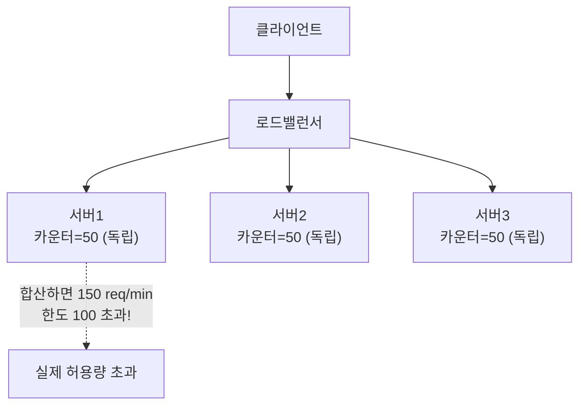
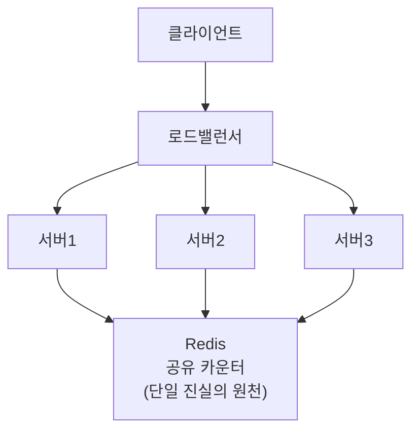
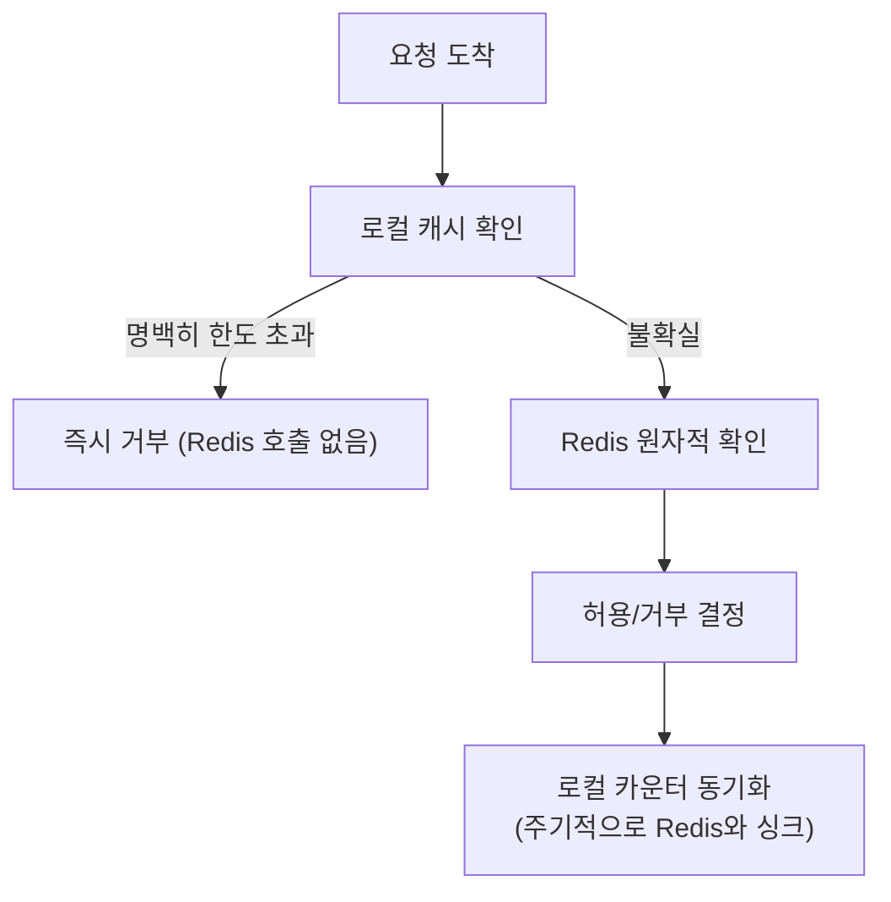
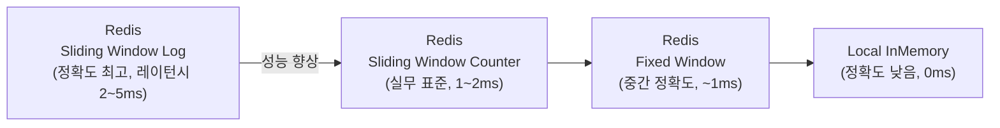
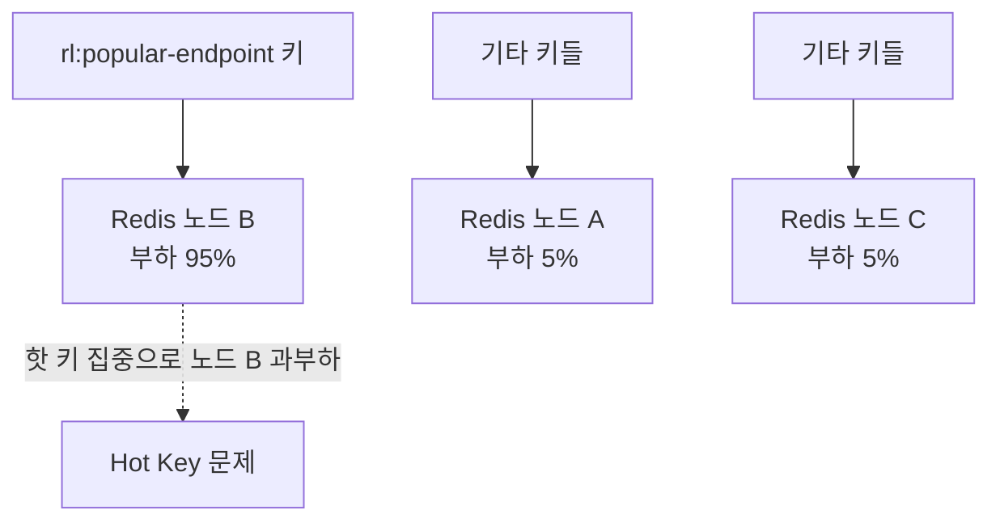
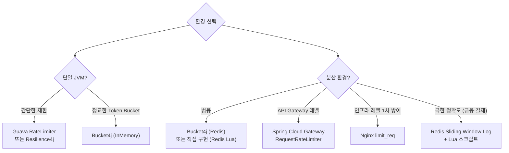

## 1. Rate Limiting이란?

> 비유: 놀이공원 입구에서 시간당 입장 인원을 제한하는 것과 같다. 한꺼번에 너무 많은 사람이 몰리면 내부가 혼잡해지므로, 일정 속도로만 입장을 허용해 서비스 품질을 유지한다.

Rate Limiting(속도 제한)은 **특정 시간 내에 시스템으로 들어오는 요청 수를 제어하는 기법**이다. 네트워크, API, 애플리케이션 레벨에서 광범위하게 사용된다.

### 왜 필요한가?

**1) DDoS / 브루트포스 공격 방어**

공격자가 초당 수만 건의 요청을 보내 서버를 마비시키는 공격을 차단한다. Rate Limiting이 없으면 단 몇 대의 클라이언트가 전체 서비스를 다운시킬 수 있다.

<div class="mermaid">
graph LR
    subgraph BEFORE["Rate Limiting 미적용"]
        A1[공격자] -->|"10,000 req/s"| S1["서버 💀 다운"]
    end
    subgraph AFTER["Rate Limiting 적용 후"]
        A2[공격자] -->|"10,000 req/s"| RL[Rate Limiter]
        RL -->|"100 req/s"| S2[서버 정상]
        RL -->|"429 Too Many Requests"| A2
    end
</div>

**2) 비용 보호**

클라우드 환경에서 무제한 트래픽은 곧 무제한 비용이다. AWS API Gateway, OpenAI API 등 외부 서비스 호출에 Rate Limiting을 걸면 예상치 못한 폭탄 청구서를 방지할 수 있다.

**3) 공정한 리소스 분배**

특정 사용자가 시스템 자원을 독점하지 못하도록 막아 모든 사용자에게 균등한 서비스 품질을 보장한다. 멀티테넌트(Multi-tenant) SaaS 환경에서 필수적이다.

**4) 서비스 안정성 (Cascading Failure 방지)**

업스트림 서비스가 트래픽 급증을 견디지 못하면 의존하는 모든 서비스가 연쇄적으로 장애를 일으킨다. Rate Limiting은 이 연쇄 장애(Cascading Failure)를 방어하는 첫 번째 방어선이다.

---

### Rate Limiting 적용 레벨

| 레벨 | 위치 | 도구 | 특징 |
|------|------|------|------|
| **인프라 레벨** | L4/L7 로드밸런서, 방화벽 | Nginx, HAProxy, AWS WAF | 가장 빠름. 앱 코드 진입 전 차단 |
| **API Gateway 레벨** | API Gateway | AWS API Gateway, Kong, Istio | 서비스 간 공통 정책 적용 |
| **애플리케이션 레벨** | 서버 코드 내부 | Bucket4j, Resilience4j | 세밀한 비즈니스 로직 적용 가능 |
| **클라이언트 레벨** | SDK, 클라이언트 | Guava RateLimiter | 호출자 자체 제어 |

각 레벨을 **중첩 적용(Defense in Depth)**하는 것이 실무 표준이다.

<div class="mermaid">
graph TD
    INT[Internet]
    INT --> NW["Nginx/WAF<br>인프라 레벨 - 초당 IP당 요청 제한"]
    NW --> GW["API Gateway<br>Gateway 레벨 - API Key별 제한"]
    GW --> APP["Spring App<br>애플리케이션 레벨 - 비즈니스 로직 기반 세밀 제한"]
    APP --> DB["DB / External API<br>클라이언트 레벨 - Guava 등으로 외부 호출 제어"]
</div>

---

## 2. Rate Limiting 알고리즘

### 2-1. Fixed Window Counter (고정 윈도우 카운터)

시간을 **고정된 윈도우(예: 1분 단위)**로 나누고, 각 윈도우 안에서 카운터를 증가시킨다.

<div class="mermaid">
graph LR
    W1["윈도우1 (0s~60s)<br>req: 95 - 허용"]
    W2["윈도우2 (60s~120s)<br>req: 100 - 한도 초과 → 429"]
    W3["윈도우3 (120s~180s)<br>req: 80 - 허용"]
    W1 --> W2 --> W3
    style W2 fill:#f88,stroke:#c00,color:#000
</div>

**경계 문제(Boundary Burst)**

<div class="mermaid">
graph LR
    W1["윈도우1 (59초 시점)<br>100 req 전송"]
    W2["윈도우2 (61초 시점)<br>100 req 전송"]
    W1 --> BURST["⚠️ 경계(60s) 기준 2초 안에<br>200 req 허용!"]
    W2 --> BURST
    style BURST fill:#f88,stroke:#c00,color:#000
</div>

59초에 100건, 61초에 100건을 보내면 실제로는 2초 안에 200건이 처리된다. 이것이 Fixed Window의 치명적 단점이다.

**장점**
- 구현이 매우 단순하다
- 메모리 사용량이 적다 (윈도우당 카운터 1개)
- Redis INCR + EXPIRE로 원자적 구현 가능

**단점**
- 윈도우 경계에서 2배 버스트가 허용된다
- 트래픽이 균일하지 않을 때 실제 제한이 느슨해진다

**구현 예시**

```java
@Component
public class FixedWindowRateLimiter {
    private final ConcurrentHashMap<String, AtomicInteger> counters = new ConcurrentHashMap<>();
    private final ConcurrentHashMap<String, Long> windowStart = new ConcurrentHashMap<>();
    private final int limit = 100;
    private final long windowMs = 60_000L; // 1분

    public boolean allowRequest(String key) {
        long now = System.currentTimeMillis();
        windowStart.putIfAbsent(key, now);
        counters.putIfAbsent(key, new AtomicInteger(0));

        long start = windowStart.get(key);
        if (now - start >= windowMs) {
            // 새 윈도우 시작
            windowStart.put(key, now);
            counters.put(key, new AtomicInteger(1));
            return true;
        }

        int count = counters.get(key).incrementAndGet();
        return count <= limit;
    }
}
```

---

### 2-2. Sliding Window Log (슬라이딩 윈도우 로그)

각 요청의 **타임스탬프를 전부 기록**하고, 현재 시각 기준 과거 N초 내의 요청 수를 카운팅한다.

현재시각 1:00:30을 기준으로 슬라이딩 윈도우 `[0:59:30 ~ 1:00:30]`에는 0:59:31, 0:59:45, 1:00:10, 1:00:25 총 4건이 있다. 새 요청이 오면 5건이 되어 한도 5라면 허용된다. 1:00:32가 되면 윈도우는 `[0:59:32 ~ 1:00:32]`로 이동하고, 0:59:31은 만료되어 0:59:45, 1:00:10, 1:00:25, 1:00:30 총 4건으로 유지된다.

**장점**
- 경계 문제가 없다. 어느 시점에서도 정확히 N초 내 요청 수를 센다
- 가장 정확한 알고리즘

**단점**
- 모든 요청 타임스탬프를 저장해야 하므로 **메모리 사용량이 요청 수에 비례**한다
- 트래픽이 많을 때 메모리 폭발 위험
- Redis Sorted Set 사용 시 고트래픽에서 성능 저하

**Redis Sorted Set 구현**

```java
@Component
public class SlidingWindowLogRateLimiter {
    private final RedisTemplate<String, String> redisTemplate;
    private final int limit = 100;
    private final long windowMs = 60_000L;

    public SlidingWindowLogRateLimiter(RedisTemplate<String, String> redisTemplate) {
        this.redisTemplate = redisTemplate;
    }

    public boolean allowRequest(String key) {
        long now = System.currentTimeMillis();
        long windowStart = now - windowMs;

        // Lua 스크립트로 원자적 처리
        String script =
            "redis.call('ZREMRANGEBYSCORE', KEYS[1], '-inf', ARGV[1])\n" +
            "local count = redis.call('ZCARD', KEYS[1])\n" +
            "if count < tonumber(ARGV[2]) then\n" +
            "  redis.call('ZADD', KEYS[1], ARGV[3], ARGV[3])\n" +
            "  redis.call('EXPIRE', KEYS[1], ARGV[4])\n" +
            "  return 1\n" +
            "end\n" +
            "return 0";

        DefaultRedisScript<Long> redisScript = new DefaultRedisScript<>(script, Long.class);
        Long result = redisTemplate.execute(
            redisScript,
            Collections.singletonList("ratelimit:" + key),
            String.valueOf(windowStart),
            String.valueOf(limit),
            String.valueOf(now),
            String.valueOf(windowMs / 1000 + 1)
        );
        return Long.valueOf(1L).equals(result);
    }
}
```

---

### 2-3. Sliding Window Counter (슬라이딩 윈도우 카운터)

Fixed Window와 Sliding Window Log의 **절충안**이다. 이전 윈도우의 카운터와 현재 윈도우의 카운터를 가중 평균으로 합산한다.

<div class="mermaid">
graph TD
    PW["이전 윈도우 (0:59~1:00)<br>count: 80"]
    CW["현재 윈도우 (1:00~1:01)<br>count: 30"]
    NOW["현재 시각: 1:00:45<br>현재 윈도우 75% 경과"]
    CALC["예상 요청 수 계산<br>= 80 × (1 - 0.75) + 30<br>= 20 + 30 = 50건"]
    RESULT["한도 100 미만 → 허용"]
    PW --> CALC
    CW --> CALC
    NOW --> CALC
    CALC --> RESULT
    style RESULT fill:#8f8,stroke:#080,color:#000
</div>

**장점**
- 메모리 사용량이 적다 (윈도우당 카운터 2개)
- 경계 문제를 상당히 완화한다
- 실무에서 Redis + Lua로 구현하기 쉽다

**단점**
- 정확히 100% 정밀하지는 않다 (통계적 근사)
- 트래픽이 완전히 균일하다는 가정에 기반

```java
@Component
public class SlidingWindowCounterRateLimiter {
    private final RedisTemplate<String, String> redisTemplate;
    private final int limit = 100;
    private final long windowMs = 60_000L;

    public boolean allowRequest(String key) {
        long now = System.currentTimeMillis();
        long currentWindowStart = (now / windowMs) * windowMs;
        long prevWindowStart = currentWindowStart - windowMs;
        double elapsed = (double)(now - currentWindowStart) / windowMs;

        String currentKey = "ratelimit:" + key + ":" + currentWindowStart;
        String prevKey = "ratelimit:" + key + ":" + prevWindowStart;

        String script =
            "local prev = tonumber(redis.call('GET', KEYS[1])) or 0\n" +
            "local curr = tonumber(redis.call('GET', KEYS[2])) or 0\n" +
            "local estimate = prev * (1 - tonumber(ARGV[1])) + curr\n" +
            "if estimate < tonumber(ARGV[2]) then\n" +
            "  redis.call('INCR', KEYS[2])\n" +
            "  redis.call('EXPIRE', KEYS[2], ARGV[3])\n" +
            "  return 1\n" +
            "end\n" +
            "return 0";

        DefaultRedisScript<Long> redisScript = new DefaultRedisScript<>(script, Long.class);
        Long result = redisTemplate.execute(
            redisScript,
            Arrays.asList(prevKey, currentKey),
            String.format("%.4f", elapsed),
            String.valueOf(limit),
            String.valueOf((windowMs / 1000) * 2)
        );
        return Long.valueOf(1L).equals(result);
    }
}
```

---

### 2-4. Token Bucket (토큰 버킷)

버킷에 **일정 속도로 토큰이 채워지고**, 요청이 올 때마다 토큰을 소비한다. 버킷이 가득 차면 새 토큰은 버려진다.

<div class="mermaid">
graph TD
    GEN["토큰 생성기<br>1 token/sec"]
    GEN --> BKT["버킷 (최대 10 토큰)"]
    BKT --> REQ{요청 도착}
    REQ -->|토큰 있음| OK["처리됨"]
    REQ -->|토큰 없음| DENY["429: 토큰 없음"]
    NOTE["버스트 허용: 버킷 가득 찼을 때 순간 10 req 처리 가능"]
</div>

**실제 동작 흐름**

<div class="mermaid">
graph TD
    T0["t=0s: 버킷 10/10 토큰"]
    T0A["t=0s: 요청 5건 → 토큰 5개 소비 → 버킷 5/10"]
    T1["t=1s: 토큰 1개 추가 → 버킷 6/10"]
    T1A["t=1s: 요청 7건 → 6개 처리 + 1건 거부 → 버킷 0/10"]
    T2["t=2s: 토큰 1개 추가 → 버킷 1/10"]
    T0 --> T0A --> T1 --> T1A --> T2
</div>

**장점**
- 버스트 트래픽 허용 (버킷이 가득 찰 때까지 쌓인 토큰으로 순간 처리)
- AWS API Gateway, Stripe, GitHub API가 이 방식 사용
- 구현이 비교적 단순

**단점**
- 버킷 크기와 충전 속도 두 파라미터를 튜닝해야 한다
- 분산 환경에서 토큰 동기화가 필요하다

---

### 2-5. Leaky Bucket (누출 버킷)

요청을 큐(버킷)에 넣고 **일정한 속도로만 처리**한다. 버킷(큐)이 가득 차면 새 요청을 거부한다.

<div class="mermaid">
graph TD
    IN["요청 입력 (불규칙)"]
    IN --> Q["큐 - Leaky Bucket<br>최대 100개"]
    Q -->|"일정한 속도로 처리 (10 req/s)"| OUT["처리됨"]
    IN2["요청 초과"] -->|버킷 가득 참| DROP["거부"]
</div>

**Token Bucket vs Leaky Bucket 비교**

<div class="mermaid">
graph TD
    subgraph TB["Token Bucket - 버스트 허용"]
        TB1["요청 도착 (불규칙)"] --> TB2["토큰 있으면 즉시 처리"]
        TB2 --> TB3["순간 몰아서 처리 가능"]
    end
    subgraph LB["Leaky Bucket - 균일한 처리"]
        LB1["요청 도착 (불규칙)"] --> LB2["큐에 적재"]
        LB2 -->|"일정 간격으로"| LB3["균일하게 처리"]
    end
</div>

**장점**
- 출력 속도가 완전히 일정하다 → 다운스트림 서비스 보호에 유리
- Nginx의 기본 방식

**단점**
- 버스트를 완전히 허용하지 않으므로 정상적인 트래픽 급증에도 응답이 느려진다
- 큐 대기 시 레이턴시 증가

---

### 알고리즘 비교 표

| 알고리즘 | 구현 복잡도 | 메모리 사용 | 버스트 허용 | 정확도 | 대표 사용처 |
|----------|------------|------------|------------|--------|------------|
| Fixed Window | ★☆☆☆☆ | 매우 낮음 | 경계에서 2× | 낮음 | 단순 시스템 |
| Sliding Window Log | ★★★★☆ | 높음 (요청수 비례) | 없음 | 매우 높음 | 정확성 중요한 API |
| Sliding Window Counter | ★★★☆☆ | 낮음 | 거의 없음 | 높음 | **실무 표준** |
| Token Bucket | ★★★☆☆ | 낮음 | **허용** | 높음 | AWS, Stripe, GitHub |
| Leaky Bucket | ★★★☆☆ | 중간 (큐) | **불허** | 높음 | Nginx, 균일 처리 필요 시 |

---

## 3. 직접 구현 (Java / Spring)

### 3-1. 인메모리 Token Bucket 구현

단일 JVM 환경에서 사용할 수 있는 Thread-safe Token Bucket 구현이다.

```java
import java.util.concurrent.ConcurrentHashMap;
import java.util.concurrent.atomic.AtomicLong;

public class TokenBucket {
    private final long capacity;       // 버킷 최대 용량
    private final long refillRate;     // 초당 토큰 충전량
    private final AtomicLong tokens;
    private volatile long lastRefillTime;

    public TokenBucket(long capacity, long refillRate) {
        this.capacity = capacity;
        this.refillRate = refillRate;
        this.tokens = new AtomicLong(capacity);
        this.lastRefillTime = System.currentTimeMillis();
    }

    public synchronized boolean tryConsume(long tokensToConsume) {
        refill();
        if (tokens.get() >= tokensToConsume) {
            tokens.addAndGet(-tokensToConsume);
            return true;
        }
        return false;
    }

    private void refill() {
        long now = System.currentTimeMillis();
        long elapsed = now - lastRefillTime;
        long tokensToAdd = (elapsed / 1000) * refillRate;

        if (tokensToAdd > 0) {
            long newTokens = Math.min(capacity, tokens.get() + tokensToAdd);
            tokens.set(newTokens);
            lastRefillTime = now;
        }
    }
}

@Component
public class InMemoryTokenBucketRateLimiter {
    // 사용자별 버킷 관리
    private final ConcurrentHashMap<String, TokenBucket> buckets = new ConcurrentHashMap<>();
    private final long capacity = 100L;
    private final long refillRate = 10L; // 초당 10 토큰 충전

    public boolean allowRequest(String userId) {
        TokenBucket bucket = buckets.computeIfAbsent(
            userId,
            k -> new TokenBucket(capacity, refillRate)
        );
        return bucket.tryConsume(1);
    }
}
```

**메모리 누수 방지**: 오래된 버킷을 정리하는 스케줄러를 함께 운용해야 한다.

```java
@Scheduled(fixedDelay = 3600_000) // 1시간마다
public void evictStaleBuckets() {
    // TTL 기반 제거 로직 추가
    buckets.entrySet().removeIf(entry -> isStale(entry.getValue()));
}
```

---

### 3-2. Redis 기반 Sliding Window Counter 구현

분산 환경에서 사용하는 Redis + Lua 스크립트 기반 구현이다.

```java
@Component
public class RedisRateLimiter {

    private final RedisTemplate<String, String> redisTemplate;

    // Lua 스크립트: 원자적으로 카운터 확인 + 증가
    private static final String SLIDING_WINDOW_SCRIPT =
        "local now = tonumber(ARGV[1])\n" +
        "local window = tonumber(ARGV[2])\n" +
        "local limit = tonumber(ARGV[3])\n" +
        "local key = KEYS[1]\n" +
        "\n" +
        "-- 만료된 요청 제거\n" +
        "redis.call('ZREMRANGEBYSCORE', key, '-inf', now - window)\n" +
        "\n" +
        "-- 현재 요청 수 확인\n" +
        "local count = redis.call('ZCARD', key)\n" +
        "\n" +
        "if count < limit then\n" +
        "  -- 현재 요청 추가 (score = timestamp, member = timestamp+random)\n" +
        "  redis.call('ZADD', key, now, now .. '-' .. math.random(100000))\n" +
        "  redis.call('EXPIRE', key, math.ceil(window / 1000) + 1)\n" +
        "  return {1, limit - count - 1}\n" +
        "end\n" +
        "\n" +
        "return {0, 0}";

    private final DefaultRedisScript<List> script;

    public RedisRateLimiter(RedisTemplate<String, String> redisTemplate) {
        this.redisTemplate = redisTemplate;
        this.script = new DefaultRedisScript<>(SLIDING_WINDOW_SCRIPT, List.class);
    }

    public RateLimitResult checkLimit(String key, int limit, long windowMs) {
        long now = System.currentTimeMillis();

        @SuppressWarnings("unchecked")
        List<Long> result = (List<Long>) redisTemplate.execute(
            script,
            Collections.singletonList("rl:" + key),
            String.valueOf(now),
            String.valueOf(windowMs),
            String.valueOf(limit)
        );

        boolean allowed = result != null && result.get(0) == 1L;
        long remaining = result != null ? result.get(1) : 0L;

        return new RateLimitResult(allowed, remaining, limit, windowMs);
    }
}

public record RateLimitResult(
    boolean allowed,
    long remaining,
    int limit,
    long windowMs
) {}
```

---

### 3-3. Spring Filter로 Rate Limiting 적용

```java
@Component
@Order(1)
public class RateLimitFilter implements Filter {

    private final RedisRateLimiter rateLimiter;

    public RateLimitFilter(RedisRateLimiter rateLimiter) {
        this.rateLimiter = rateLimiter;
    }

    @Override
    public void doFilter(ServletRequest request, ServletResponse response, FilterChain chain)
            throws IOException, ServletException {

        HttpServletRequest httpRequest = (HttpServletRequest) request;
        HttpServletResponse httpResponse = (HttpServletResponse) response;

        String clientKey = resolveClientKey(httpRequest);
        RateLimitResult result = rateLimiter.checkLimit(clientKey, 100, 60_000L);

        // 표준 헤더 설정
        httpResponse.setHeader("X-RateLimit-Limit", String.valueOf(result.limit()));
        httpResponse.setHeader("X-RateLimit-Remaining", String.valueOf(result.remaining()));
        httpResponse.setHeader("X-RateLimit-Reset",
            String.valueOf(System.currentTimeMillis() / 1000 + 60));

        if (!result.allowed()) {
            httpResponse.setStatus(HttpStatus.TOO_MANY_REQUESTS.value());
            httpResponse.setHeader("Retry-After", "60");
            httpResponse.setContentType("application/json");
            httpResponse.getWriter().write("""
                {
                  "error": "Too Many Requests",
                  "message": "Rate limit exceeded. Please retry after 60 seconds.",
                  "retryAfter": 60
                }
                """);
            return;
        }

        chain.doFilter(request, response);
    }

    private String resolveClientKey(HttpServletRequest request) {
        // API Key 우선, 없으면 IP
        String apiKey = request.getHeader("X-API-Key");
        if (apiKey != null && !apiKey.isBlank()) {
            return "apikey:" + apiKey;
        }
        // X-Forwarded-For 헤더 처리 (프록시 뒤에 있을 경우)
        String forwarded = request.getHeader("X-Forwarded-For");
        if (forwarded != null) {
            return "ip:" + forwarded.split(",")[0].trim();
        }
        return "ip:" + request.getRemoteAddr();
    }
}
```

---

### 3-4. Spring Interceptor로 어노테이션 기반 적용

엔드포인트별로 다른 Rate Limit을 적용하는 어노테이션 기반 방식이다.

```java
@Target(ElementType.METHOD)
@Retention(RetentionPolicy.RUNTIME)
public @interface RateLimit {
    int limit() default 100;
    long windowMs() default 60_000L;
    String keyPrefix() default "";
}

@Component
public class RateLimitInterceptor implements HandlerInterceptor {

    private final RedisRateLimiter rateLimiter;

    public RateLimitInterceptor(RedisRateLimiter rateLimiter) {
        this.rateLimiter = rateLimiter;
    }

    @Override
    public boolean preHandle(HttpServletRequest request,
                             HttpServletResponse response,
                             Object handler) throws Exception {

        if (!(handler instanceof HandlerMethod handlerMethod)) {
            return true;
        }

        RateLimit rateLimit = handlerMethod.getMethodAnnotation(RateLimit.class);
        if (rateLimit == null) {
            return true;
        }

        String prefix = rateLimit.keyPrefix().isBlank()
            ? handlerMethod.getMethod().getName()
            : rateLimit.keyPrefix();

        String clientIp = getClientIp(request);
        String key = prefix + ":" + clientIp;

        RateLimitResult result = rateLimiter.checkLimit(key, rateLimit.limit(), rateLimit.windowMs());

        response.setHeader("X-RateLimit-Limit", String.valueOf(rateLimit.limit()));
        response.setHeader("X-RateLimit-Remaining", String.valueOf(result.remaining()));

        if (!result.allowed()) {
            response.setStatus(429);
            response.setHeader("Retry-After", String.valueOf(rateLimit.windowMs() / 1000));
            response.getWriter().write("{\"error\":\"Too Many Requests\"}");
            return false;
        }

        return true;
    }

    private String getClientIp(HttpServletRequest request) {
        String forwarded = request.getHeader("X-Forwarded-For");
        return (forwarded != null) ? forwarded.split(",")[0].trim() : request.getRemoteAddr();
    }
}

// 사용 예시
@RestController
@RequestMapping("/api")
public class UserController {

    @RateLimit(limit = 5, windowMs = 60_000L, keyPrefix = "login")
    @PostMapping("/login")
    public ResponseEntity<String> login(@RequestBody LoginRequest req) {
        // 로그인 로직
        return ResponseEntity.ok("OK");
    }

    @RateLimit(limit = 1000, windowMs = 3600_000L, keyPrefix = "search")
    @GetMapping("/search")
    public ResponseEntity<List<String>> search(@RequestParam String q) {
        // 검색 로직
        return ResponseEntity.ok(List.of());
    }
}
```

---

## 4. 라이브러리 & 프레임워크

### 4-1. Bucket4j

Token Bucket 알고리즘 기반의 Java 전용 Rate Limiting 라이브러리다. 로컬(in-memory)과 분산(Redis, Hazelcast, Infinispan) 모드를 모두 지원한다.

**의존성 추가**

```xml
<!-- Bucket4j Core -->
<dependency>
    <groupId>com.bucket4j</groupId>
    <artifactId>bucket4j-core</artifactId>
    <version>8.10.1</version>
</dependency>

<!-- Redis 분산 지원 -->
<dependency>
    <groupId>com.bucket4j</groupId>
    <artifactId>bucket4j-redis</artifactId>
    <version>8.10.1</version>
</dependency>
```

**인메모리 사용 예시**

```java
import io.github.bucket4j.Bandwidth;
import io.github.bucket4j.Bucket;
import io.github.bucket4j.Refill;
import java.time.Duration;

@Service
public class Bucket4jRateLimiterService {

    private final Map<String, Bucket> buckets = new ConcurrentHashMap<>();

    private Bucket createBucket() {
        // 1분에 100개, 최대 버스트 200개 허용
        Bandwidth limit = Bandwidth.classic(
            100,
            Refill.greedy(100, Duration.ofMinutes(1))
        );
        Bandwidth burst = Bandwidth.classic(
            200,
            Refill.intervally(200, Duration.ofMinutes(1))
        );
        return Bucket.builder()
            .addLimit(limit)
            .addLimit(burst)
            .build();
    }

    public boolean tryConsume(String userId) {
        Bucket bucket = buckets.computeIfAbsent(userId, k -> createBucket());
        return bucket.tryConsume(1);
    }

    // 블로킹 방식: 토큰이 생길 때까지 대기
    public void consumeBlocking(String userId) throws InterruptedException {
        Bucket bucket = buckets.computeIfAbsent(userId, k -> createBucket());
        bucket.asBlocking().consume(1);
    }
}
```

**Redis 분산 모드**

```java
@Configuration
public class Bucket4jRedisConfig {

    @Bean
    public ProxyManager<String> proxyManager(RedissonClient redissonClient) {
        return Bucket4jRedisson.casBasedBuilder(redissonClient)
            .build();
    }
}

@Service
public class DistributedBucket4jService {

    private final ProxyManager<String> proxyManager;

    public DistributedBucket4jService(ProxyManager<String> proxyManager) {
        this.proxyManager = proxyManager;
    }

    public boolean tryConsume(String userId) {
        BucketConfiguration config = BucketConfiguration.builder()
            .addLimit(Bandwidth.classic(100, Refill.greedy(100, Duration.ofMinutes(1))))
            .build();

        Bucket bucket = proxyManager.builder()
            .build(userId, () -> config);

        return bucket.tryConsume(1);
    }
}
```

**Spring Boot Starter 사용 시 자동 설정 (application.yml)**

```yaml
bucket4j:
  enabled: true
  filters:
    - cache-name: buckets
      url: /api/.*
      rate-limits:
        - bandwidths:
            - capacity: 100
              time: 1
              unit: minutes
          cache-key: "getRemoteAddr()"
```

---

### 4-2. Resilience4j RateLimiter

Resilience4j는 Circuit Breaker, Retry, Rate Limiter, Bulkhead 등 다양한 안정성 패턴을 제공하는 라이브러리다. Rate Limiter는 **Semaphore** 기반으로 동작한다.

**의존성 추가**

```xml
<dependency>
    <groupId>io.github.resilience4j</groupId>
    <artifactId>resilience4j-spring-boot3</artifactId>
    <version>2.2.0</version>
</dependency>
```

**application.yml 설정**

```yaml
resilience4j:
  ratelimiter:
    instances:
      backendA:
        limit-for-period: 100          # 갱신 주기당 허용 요청 수
        limit-refresh-period: 1s       # 갱신 주기 (1초)
        timeout-duration: 0s           # 토큰 대기 시간 (0 = 즉시 실패)
      userLoginEndpoint:
        limit-for-period: 5
        limit-refresh-period: 1m
        timeout-duration: 500ms        # 500ms 대기 후 실패
```

**어노테이션 기반 사용**

```java
@Service
public class UserService {

    @RateLimiter(name = "userLoginEndpoint", fallbackMethod = "loginFallback")
    public String login(String userId, String password) {
        // 로그인 처리
        return "success";
    }

    public String loginFallback(String userId, String password, RequestNotPermitted e) {
        return "Too many login attempts. Please try again later.";
    }
}
```

**Circuit Breaker + Rate Limiter 조합**

```java
@Service
public class PaymentService {

    private final RateLimiter rateLimiter;
    private final CircuitBreaker circuitBreaker;

    public PaymentService(RateLimiterRegistry rateLimiterRegistry,
                          CircuitBreakerRegistry circuitBreakerRegistry) {
        this.rateLimiter = rateLimiterRegistry.rateLimiter("payment");
        this.circuitBreaker = circuitBreakerRegistry.circuitBreaker("payment");
    }

    public String processPayment(PaymentRequest request) {
        // Rate Limiter → Circuit Breaker 순서로 적용 (바깥에서 안으로)
        Supplier<String> decoratedSupplier = RateLimiter
            .decorateSupplier(rateLimiter,
                CircuitBreaker.decorateSupplier(circuitBreaker,
                    () -> doProcessPayment(request)));

        return Try.ofSupplier(decoratedSupplier)
            .recover(RequestNotPermitted.class, e -> "Rate limit exceeded")
            .recover(CallNotPermittedException.class, e -> "Circuit is open")
            .get();
    }

    private String doProcessPayment(PaymentRequest request) {
        // 실제 결제 처리
        return "payment-id-12345";
    }
}
```

---

### 4-3. Spring Cloud Gateway RateLimiter

Spring Cloud Gateway에서 기본 제공하는 **RequestRateLimiter** 필터로, Redis 기반 Token Bucket을 사용한다.

**의존성 추가**

```xml
<dependency>
    <groupId>org.springframework.cloud</groupId>
    <artifactId>spring-cloud-starter-gateway</artifactId>
</dependency>
<dependency>
    <groupId>org.springframework.boot</groupId>
    <artifactId>spring-boot-starter-data-redis-reactive</artifactId>
</dependency>
```

**application.yml 설정**

```yaml
spring:
  cloud:
    gateway:
      routes:
        - id: user-service
          uri: lb://user-service
          predicates:
            - Path=/api/users/**
          filters:
            - name: RequestRateLimiter
              args:
                redis-rate-limiter.replenishRate: 10    # 초당 토큰 충전량
                redis-rate-limiter.burstCapacity: 20    # 버킷 최대 용량
                redis-rate-limiter.requestedTokens: 1   # 요청당 소비 토큰
                key-resolver: "#{@userKeyResolver}"     # 키 결정 Bean
```

**Key Resolver 구현**

```java
@Configuration
public class RateLimiterConfig {

    // IP 기반 키
    @Bean
    public KeyResolver ipKeyResolver() {
        return exchange -> Mono.just(
            Objects.requireNonNull(
                exchange.getRequest().getRemoteAddress()
            ).getAddress().getHostAddress()
        );
    }

    // 사용자 ID 기반 키 (인증 헤더에서 추출)
    @Bean
    public KeyResolver userKeyResolver() {
        return exchange -> {
            String userId = exchange.getRequest().getHeaders()
                .getFirst("X-User-Id");
            return Mono.just(userId != null ? userId : "anonymous");
        };
    }

    // API Key 기반 키
    @Bean
    public KeyResolver apiKeyResolver() {
        return exchange -> {
            String apiKey = exchange.getRequest().getHeaders()
                .getFirst("X-API-Key");
            if (apiKey == null) {
                return Mono.just("no-api-key");
            }
            return Mono.just(apiKey);
        };
    }
}
```

**커스텀 Rate Limiter (엔드포인트별 차등 제한)**

```java
@Component
public class CustomRedisRateLimiter extends AbstractRateLimiter<CustomRedisRateLimiter.Config> {

    @Data
    public static class Config {
        private int replenishRate;
        private int burstCapacity;
    }

    // 경로별 설정 커스터마이징
    @Override
    public Mono<Response> isAllowed(String routeId, String id) {
        // Redis Lua 스크립트 실행
        // ...
        return Mono.just(new Response(true, Map.of(
            "X-RateLimit-Remaining", "50"
        )));
    }
}
```

---

### 4-4. Guava RateLimiter

Google Guava 라이브러리의 `RateLimiter`는 **단일 JVM** 환경에서 간편하게 사용할 수 있는 Token Bucket 구현이다. 분산 환경에서는 사용할 수 없다.

**두 가지 모드**

```java
import com.google.common.util.concurrent.RateLimiter;

// 1. SmoothBursty: 버스트 허용 (기본값)
// 초당 10개 처리 허용, 최대 1초치 버스트 저장
RateLimiter burstyLimiter = RateLimiter.create(10.0);

// 2. SmoothWarmingUp: 워밍업 후 최대 속도 도달 (cold start 시뮬레이션)
// 초당 10개, 5초의 워밍업 기간
RateLimiter warmingLimiter = RateLimiter.create(10.0, 5, TimeUnit.SECONDS);
```

**사용 예시**

```java
@Service
public class ExternalApiService {

    // 외부 API 호출을 초당 5회로 제한
    private final RateLimiter limiter = RateLimiter.create(5.0);

    public String callExternalApi(String param) {
        // 블로킹: 토큰이 생길 때까지 대기 (최대 100ms)
        if (!limiter.tryAcquire(100, TimeUnit.MILLISECONDS)) {
            throw new RateLimitExceededException("External API call rate limit exceeded");
        }

        // 외부 API 호출
        return restTemplate.getForObject("https://api.example.com/data?q=" + param, String.class);
    }

    public String callWithBlock(String param) {
        // 블로킹: 토큰이 생길 때까지 무조건 대기
        double waitTime = limiter.acquire();
        log.debug("Waited {}s for rate limiter", waitTime);

        return restTemplate.getForObject("https://api.example.com/data?q=" + param, String.class);
    }
}
```

**SmoothBursty vs SmoothWarmingUp 동작 차이**

```
SmoothBursty (create(10.0)):
t=0s:  10개 즉시 처리 가능 (버스트)
t=1s:  10개 즉시 처리 가능
t=1.5s: 5개 즉시 처리 가능

SmoothWarmingUp (create(10.0, 5s)):
t=0s:  1개 처리 (워밍업 시작)
t=1s:  3개 처리
t=3s:  7개 처리
t=5s:  10개 처리 (최대 속도 도달)
```

---

### 4-5. Nginx Rate Limiting

인프라 레벨에서 가장 먼저 차단하는 Nginx의 `ngx_http_limit_req_module`이다.

```nginx
http {
    # Rate Limit Zone 정의
    # 키: $binary_remote_addr (클라이언트 IP)
    # 메모리: 10MB (약 16만 IP 저장 가능)
    # 속도: 초당 10 요청
    limit_req_zone $binary_remote_addr zone=api_limit:10m rate=10r/s;

    # API Key 기반 제한
    limit_req_zone $http_x_api_key zone=apikey_limit:10m rate=100r/s;

    server {
        listen 80;

        location /api/ {
            # burst: 최대 20개 요청을 큐에 보관 (Leaky Bucket 방식)
            # nodelay: 큐에 있는 요청을 바로 처리 (큐 대기 없이)
            limit_req zone=api_limit burst=20 nodelay;

            # 429 상태 코드 반환 (기본은 503)
            limit_req_status 429;

            proxy_pass http://backend;
        }

        location /api/login {
            # 로그인은 더 엄격하게: 초당 1 요청, 버스트 5
            limit_req zone=api_limit burst=5;
            limit_req_status 429;

            proxy_pass http://backend;
        }

        # 429 에러 페이지 커스터마이징
        error_page 429 /rate_limit.json;
        location = /rate_limit.json {
            default_type application/json;
            return 429 '{"error":"Too Many Requests","message":"Please slow down"}';
        }
    }
}
```

**Nginx 설정 설명**

`limit_req_zone [key] zone=[name]:[size] rate=[N]r/s`에서 `r/s`는 초당, `r/m`은 분당 요청을 의미한다. `limit_req zone=[name] burst=[N] nodelay`에서 `burst`는 큐에 보관할 최대 버스트 요청 수이고, `nodelay`는 버스트 요청을 즉시 처리(지연 없이)하는 옵션이다. `nodelay`가 없으면 rate에 맞게 지연 후 처리된다.

---

### 라이브러리 비교 표

| 라이브러리 | 알고리즘 | 분산 지원 | 성능 | Spring Boot 통합 | 난이도 | 추천 상황 |
|-----------|----------|----------|------|-----------------|--------|----------|
| **Bucket4j** | Token Bucket | Redis, Hazelcast, Infinispan | 매우 빠름 | Spring Boot Starter | ★★★☆☆ | 분산 환경 범용 |
| **Resilience4j** | Semaphore | 없음 (단일 JVM) | 빠름 | Spring Boot Starter | ★★☆☆☆ | 안정성 패턴 통합 |
| **Spring Cloud Gateway** | Token Bucket (Redis) | Redis | 빠름 | 내장 | ★★★☆☆ | API Gateway |
| **Guava RateLimiter** | Token Bucket | 없음 (단일 JVM) | 매우 빠름 | 없음 | ★☆☆☆☆ | 단일 JVM, 외부 API 호출 |
| **Nginx** | Leaky Bucket | 없음 | 극도로 빠름 | 없음 | ★★☆☆☆ | 인프라 레벨 1차 차단 |

---

## 5. 분산 환경에서의 Rate Limiting

### 왜 단일 서버 Rate Limiting이 부족한가?

로드밸런서가 요청을 분산시키므로, 각 서버의 인메모리 카운터는 **전체 요청 수를 반영하지 못한다**. 한도를 100 req/min으로 설정해도 서버 3대가 각각 독립 카운터를 갖고 있으면 실제로는 150 req/min이 허용된다.



---

### Redis 기반 중앙 집중식 Rate Limiting

모든 서버가 Redis의 동일한 카운터를 읽고 쓴다. 정확하지만 Redis가 병목이 될 수 있다.



**Lua 스크립트로 Race Condition 방지**

Redis는 단일 스레드로 명령을 처리하고, Lua 스크립트는 원자적으로 실행된다. 따라서 별도의 락 없이 Race Condition을 방지할 수 있다.

```lua
-- 원자적 카운터 확인 + 증가 스크립트
local key = KEYS[1]
local limit = tonumber(ARGV[1])
local expire = tonumber(ARGV[2])

local current = redis.call('GET', key)
if current and tonumber(current) >= limit then
    return 0  -- 거부
end

local new_value = redis.call('INCR', key)
if new_value == 1 then
    -- 첫 번째 요청: TTL 설정
    redis.call('EXPIRE', key, expire)
end

if new_value > limit then
    -- 동시 요청 경쟁으로 한도 초과 시 롤백
    redis.call('DECR', key)
    return 0  -- 거부
end

return 1  -- 허용
```

---

### 로컬 + 글로벌 하이브리드 방식

Redis 호출을 줄이면서도 정확도를 유지하는 하이브리드 방식이다.



```java
@Component
public class HybridRateLimiter {

    private final RedisRateLimiter redisLimiter;
    // 로컬 추정치: 실제보다 낮게 설정 (예: 전체 한도의 80%)
    private final ConcurrentHashMap<String, AtomicInteger> localCounters = new ConcurrentHashMap<>();
    private final int localThreshold = 80; // 로컬 한도
    private final int globalLimit = 100;   // 전체 한도

    public boolean allowRequest(String key) {
        // 1단계: 로컬 카운터로 빠른 사전 거부
        AtomicInteger local = localCounters.computeIfAbsent(key, k -> new AtomicInteger(0));
        if (local.get() >= localThreshold) {
            // 로컬 한도 초과 → Redis 확인 (더 정확한 판단)
            boolean redisResult = redisLimiter.checkLimit(key, globalLimit, 60_000L).allowed();
            if (!redisResult) return false;
            local.set(0); // 리셋 (윈도우 갱신)
        }

        local.incrementAndGet();
        return true;
    }
}
```

---

### Race Condition 처리 상세

**문제 상황**

서버1과 서버2가 동시에 `GET counter = 99`를 읽은 뒤 각각 `SET counter = 100`을 실행하면, 두 번째 요청도 허용되어 사실상 200번째 요청이 통과된다.

**Lua 스크립트로 해결**

Redis Lua 스크립트는 원자적으로 실행되므로, 서버1의 EVAL이 먼저 실행되어 99→100(허용)이 되면, 서버2의 EVAL은 이미 100임을 감지하고 롤백하여 거부한다. **원자적 CAS(Compare-And-Swap)**처럼 동작하므로 별도의 분산 락 없이 정확한 카운팅이 가능하다.

Redis Lua 스크립트는 **원자적 CAS(Compare-And-Swap)**처럼 동작하므로, 별도의 분산 락 없이 정확한 카운팅이 가능하다.

---

## 6. HTTP 표준 헤더

RFC 6585과 IETF 드래프트에서 정의하는 Rate Limiting 관련 표준 헤더다.

### 요청 허용 시 응답 헤더

```
HTTP/1.1 200 OK
X-RateLimit-Limit: 100
X-RateLimit-Remaining: 73
X-RateLimit-Reset: 1746094800
Content-Type: application/json
```

| 헤더 | 의미 | 예시 |
|------|------|------|
| `X-RateLimit-Limit` | 현재 윈도우의 최대 요청 허용 수 | `100` |
| `X-RateLimit-Remaining` | 현재 윈도우에서 남은 요청 가능 수 | `73` |
| `X-RateLimit-Reset` | 윈도우가 리셋되는 시각 (Unix timestamp) | `1746094800` |

### 429 Too Many Requests 응답

```
HTTP/1.1 429 Too Many Requests
X-RateLimit-Limit: 100
X-RateLimit-Remaining: 0
X-RateLimit-Reset: 1746094800
Retry-After: 47
Content-Type: application/json

{
  "error": "Too Many Requests",
  "message": "Rate limit exceeded",
  "limit": 100,
  "retryAfter": 47,
  "resetAt": "2026-05-01T12:00:00Z"
}
```

| 헤더 | 의미 |
|------|------|
| `Retry-After` | N초 후 재시도하라는 권고 (초 단위 또는 HTTP 날짜) |

**Spring에서 표준 헤더 구현**

```java
@RestControllerAdvice
public class RateLimitExceptionHandler {

    @ExceptionHandler(RateLimitExceededException.class)
    public ResponseEntity<ErrorResponse> handleRateLimit(
            RateLimitExceededException e,
            HttpServletRequest request) {

        long resetTime = System.currentTimeMillis() / 1000 + 60;
        long retryAfter = 60;

        HttpHeaders headers = new HttpHeaders();
        headers.set("X-RateLimit-Limit", String.valueOf(e.getLimit()));
        headers.set("X-RateLimit-Remaining", "0");
        headers.set("X-RateLimit-Reset", String.valueOf(resetTime));
        headers.set("Retry-After", String.valueOf(retryAfter));

        ErrorResponse body = new ErrorResponse(
            "Too Many Requests",
            "Rate limit exceeded. Retry after " + retryAfter + " seconds.",
            retryAfter,
            Instant.ofEpochSecond(resetTime).toString()
        );

        return ResponseEntity.status(HttpStatus.TOO_MANY_REQUESTS)
            .headers(headers)
            .body(body);
    }
}

public record ErrorResponse(
    String error,
    String message,
    long retryAfter,
    String resetAt
) {}
```

---

## 7. 실무 설계 패턴

### 7-1. 사용자 식별 방식별 Rate Limiting

```java
@Component
public class RateLimitKeyResolver {

    public String resolve(HttpServletRequest request) {
        // 1순위: JWT에서 사용자 ID 추출
        String jwt = extractJwt(request);
        if (jwt != null) {
            String userId = jwtService.extractUserId(jwt);
            return "user:" + userId;
        }

        // 2순위: API Key
        String apiKey = request.getHeader("X-API-Key");
        if (apiKey != null && !apiKey.isBlank()) {
            return "apikey:" + apiKey;
        }

        // 3순위: IP 주소 (인증되지 않은 요청)
        String forwarded = request.getHeader("X-Forwarded-For");
        String ip = (forwarded != null)
            ? forwarded.split(",")[0].trim()
            : request.getRemoteAddr();
        return "ip:" + ip;
    }
}
```

**식별 방식 비교**

| 방식 | 장점 | 단점 | 사용 시점 |
|------|------|------|----------|
| IP 기반 | 인증 없이 적용 가능 | NAT 뒤 다수 사용자 동일 IP | 비인증 엔드포인트 |
| API Key 기반 | 클라이언트 앱별 구분 | 키 노출 위험 | B2B API |
| User ID 기반 | 가장 정확한 사용자 구분 | 인증 필요 | 로그인 필요 서비스 |

---

### 7-2. 엔드포인트별 차등 Rate Limit

```java
@Configuration
public class RateLimitRules {

    @Bean
    public Map<String, RateLimitConfig> rateLimitConfigs() {
        Map<String, RateLimitConfig> configs = new HashMap<>();

        // 로그인: 매우 엄격 (브루트포스 방지)
        configs.put("/api/auth/login", new RateLimitConfig(5, Duration.ofMinutes(1)));

        // 회원가입: 엄격
        configs.put("/api/auth/register", new RateLimitConfig(3, Duration.ofHours(1)));

        // 비밀번호 초기화: 엄격
        configs.put("/api/auth/password-reset", new RateLimitConfig(3, Duration.ofHours(1)));

        // 일반 API: 보통
        configs.put("/api/**", new RateLimitConfig(100, Duration.ofMinutes(1)));

        // 검색: 다소 느슨
        configs.put("/api/search", new RateLimitConfig(30, Duration.ofMinutes(1)));

        // 파일 업로드: 제한적
        configs.put("/api/files/upload", new RateLimitConfig(10, Duration.ofHours(1)));

        return configs;
    }
}

public record RateLimitConfig(int limit, Duration window) {}
```

---

### 7-3. 티어별 Rate Limit (Free / Pro / Enterprise)

```java
public enum UserTier {
    FREE(100, Duration.ofHours(1)),
    PRO(10_000, Duration.ofHours(1)),
    ENTERPRISE(1_000_000, Duration.ofHours(1));

    private final int requestLimit;
    private final Duration window;

    UserTier(int requestLimit, Duration window) {
        this.requestLimit = requestLimit;
        this.window = window;
    }

    public int getRequestLimit() { return requestLimit; }
    public Duration getWindow() { return window; }
}

@Component
public class TieredRateLimiter {

    private final RedisRateLimiter redisLimiter;
    private final UserService userService;

    public RateLimitResult checkTieredLimit(String userId, HttpServletRequest request) {
        UserTier tier = userService.getUserTier(userId);

        String key = "tier:" + tier.name().toLowerCase() + ":user:" + userId;
        return redisLimiter.checkLimit(
            key,
            tier.getRequestLimit(),
            tier.getWindow().toMillis()
        );
    }
}
```

**티어별 Rate Limit 정책 예시**

| 티어 | 요청 한도 | 윈도우 | 비고 |
|------|---------|-------|------|
| Free | 100 req | 시간당 | 무료 사용자 |
| Pro | 10,000 req | 시간당 | 월 $29 |
| Enterprise | 1,000,000 req | 시간당 | 커스텀 계약 |
| Internal | 무제한 | - | 내부 서비스 |

---

### 7-4. Graceful Degradation (큐잉으로 부드러운 처리)

429를 즉시 반환하는 대신, 요청을 큐에 넣어 처리 능력이 생기면 처리하는 방식이다.

```java
@RestController
public class SearchController {

    private final BlockingQueue<SearchRequest> queue = new LinkedBlockingQueue<>(1000);
    private final SearchService searchService;

    @PostMapping("/api/search")
    public ResponseEntity<?> search(@RequestBody SearchRequest req) {
        if (isRateLimited(req.userId())) {
            // 즉시 거부 대신 큐잉 시도
            boolean queued = queue.offer(req);
            if (queued) {
                return ResponseEntity.accepted()
                    .body(new QueuedResponse("Request queued", estimateWaitTime()));
            } else {
                // 큐도 가득 찬 경우에만 429
                return ResponseEntity.status(429)
                    .header("Retry-After", "30")
                    .body(new ErrorResponse("Service busy. Please retry later."));
            }
        }

        return ResponseEntity.ok(searchService.search(req));
    }

    @Scheduled(fixedDelay = 100) // 100ms마다 큐 처리
    public void processQueue() {
        SearchRequest req = queue.poll();
        if (req != null) {
            searchService.searchAsync(req);
        }
    }

    private long estimateWaitTime() {
        return (long) queue.size() * 100; // 대략적인 대기 시간 (ms)
    }
}
```

---

## 8. 극한 시나리오

### 8-1. Redis 장애 시 Rate Limiter 동작

Redis 장애는 Rate Limiter를 완전히 무력화시킬 수 있다. 두 가지 전략이 있다.

**Fail-Open (장애 시 허용)**

```java
public boolean allowRequest(String key) {
    try {
        return redisLimiter.checkLimit(key, limit, windowMs).allowed();
    } catch (RedisConnectionException e) {
        log.warn("Redis unavailable, failing open for key: {}", key);
        // Redis 장애 시 모든 요청 허용 → 서비스 가용성 우선
        return true;
    }
}
```

- 장점: 서비스가 중단되지 않는다
- 단점: 장애 시 Rate Limiting 효과 없음 → 공격에 취약

**Fail-Close (장애 시 거부)**

```java
public boolean allowRequest(String key) {
    try {
        return redisLimiter.checkLimit(key, limit, windowMs).allowed();
    } catch (RedisConnectionException e) {
        log.error("Redis unavailable, failing closed for key: {}", key);
        // Redis 장애 시 모든 요청 거부 → 보안 우선
        return false;
    }
}
```

- 장점: 장애 시에도 서버를 보호한다
- 단점: 정상 트래픽도 차단됨 → 서비스 중단

**실무 권장: 로컬 캐시 폴백**

```java
@Component
public class ResilientRateLimiter {

    private final RedisRateLimiter redisLimiter;
    // Redis 장애 시 폴백용 로컬 카운터
    private final ConcurrentHashMap<String, AtomicInteger> localFallback = new ConcurrentHashMap<>();
    // Redis 장애 감지 상태
    private volatile boolean redisHealthy = true;

    public boolean allowRequest(String key) {
        if (redisHealthy) {
            try {
                return redisLimiter.checkLimit(key, 100, 60_000L).allowed();
            } catch (RedisConnectionException e) {
                log.error("Redis connection failed, switching to local fallback");
                redisHealthy = false;
                alertOps("Redis rate limiter down - using local fallback");
            }
        }

        // 로컬 폴백: 한도를 절반으로 낮춰서 부분적 보호
        return localFallbackCheck(key, 50);
    }

    @Scheduled(fixedDelay = 5_000) // 5초마다 Redis 복구 확인
    public void checkRedisHealth() {
        try {
            redisTemplate.opsForValue().get("health-check");
            if (!redisHealthy) {
                log.info("Redis recovered, switching back to Redis rate limiter");
                redisHealthy = true;
                localFallback.clear();
            }
        } catch (Exception e) {
            // Redis 여전히 장애
        }
    }

    private boolean localFallbackCheck(String key, int limit) {
        AtomicInteger counter = localFallback.computeIfAbsent(key, k -> new AtomicInteger(0));
        return counter.incrementAndGet() <= limit;
    }
}
```

---

### 8-2. 시간 동기화 문제 (NTP Drift)

Fixed Window, Sliding Window 알고리즘은 **시스템 시계**에 의존한다. NTP 동기화 오차가 수 초 발생하면 윈도우 경계 계산이 틀어진다.

**문제 예시**

```
서버1 시각: 1:00:00.000  ← NTP 정확
서버2 시각: 1:00:02.500  ← NTP 2.5초 느림

윈도우 경계(1:00:00)에서:
- 서버1: 새 윈도우 시작 → 카운터 초기화
- 서버2: 아직 이전 윈도우 → 카운터 계속 증가
→ 실제 허용 요청 수가 의도보다 많아짐
```

**대응 방법**

```java
// Redis 서버 시간을 신뢰의 원천으로 사용
public long getServerTime() {
    // Redis TIME 명령으로 Redis 서버의 Unix timestamp 가져오기
    List<Long> time = redisTemplate.execute(
        (RedisCallback<List<Long>>) connection -> connection.serverCommands().time()
    );
    // [seconds, microseconds]
    return time.get(0) * 1000 + time.get(1) / 1000;
}
```

- 모든 서버가 Redis의 시간을 기준으로 윈도우를 계산하면 NTP Drift의 영향을 제거할 수 있다
- 추가 Redis 호출 비용이 있으므로, 윈도우 시작 시에만 호출하는 방식으로 최적화한다

---

### 8-3. 분산 환경에서 정확도 vs 성능 트레이드오프

정확도와 성능은 트레이드오프 관계다. Redis Sliding Window Log는 가장 정확하지만 레이턴시가 높고, 로컬 인메모리는 가장 빠르지만 분산 환경에서 정확도가 낮다. 실무 표준은 Redis Sliding Window Counter로 정확도와 성능의 균형점이다.



| 접근 방식 | 정확도 | 레이턴시 추가 | 적합한 상황 |
|----------|--------|-------------|------------|
| 로컬 인메모리 | 낮음 | 0ms | 단일 서버, 내부 서비스 |
| Redis Fixed Window | 중간 | ~1ms | 빠른 응답 필요 |
| Redis Sliding Window Counter | 높음 | ~1-2ms | **실무 표준** |
| Redis Sliding Window Log | 매우 높음 | ~2-5ms | 정확도 최우선 |
| 로컬+Redis 하이브리드 | 높음 | ~0.5ms | 고성능 + 정확도 균형 |

---

### 8-4. Hot Key 문제

인기 API 엔드포인트나 유명 사용자의 Rate Limit 키가 Redis의 특정 슬롯에 집중되면 **Hot Key** 문제가 발생한다.

**문제 상황**



**해결책 1: 키 샤딩 (Key Sharding)**

```java
public String shardedKey(String key, int shards) {
    // 키를 N개의 샤드로 분산
    int shard = Math.abs(key.hashCode() % shards);
    return key + ":shard:" + shard;
}

public boolean allowRequest(String key) {
    // 샤드 4개로 분산
    String shardKey = shardedKey(key, 4);
    // 전체 한도 100을 샤드 수로 나눠서 각 샤드에 적용
    return redisLimiter.checkLimit(shardKey, 100 / 4, windowMs).allowed();
}
```

**해결책 2: 로컬 캐시 선처리**

```java
@Component
public class HotKeyAwareRateLimiter {

    // 인기 키 목록 (운영 중 동적으로 감지 가능)
    private final Set<String> hotKeys = ConcurrentHashMap.newKeySet();
    private final ConcurrentHashMap<String, AtomicInteger> localCounters = new ConcurrentHashMap<>();

    public boolean allowRequest(String key) {
        if (hotKeys.contains(key)) {
            // Hot Key: 로컬에서 먼저 빠르게 처리
            AtomicInteger local = localCounters.computeIfAbsent(key, k -> new AtomicInteger(0));
            int count = local.incrementAndGet();
            if (count > 20) { // 로컬 소프트 한도 초과 시 Redis 확인
                local.set(0);
                return redisLimiter.checkLimit(key, 100, windowMs).allowed();
            }
            return true;
        }
        return redisLimiter.checkLimit(key, 100, windowMs).allowed();
    }
}
```

**해결책 3: Redis Cluster의 해시 태그 회피**

```java
// 나쁜 예: 같은 해시 태그 → 같은 슬롯에 집중
String badKey = "{popular-endpoint}:user:" + userId;

// 좋은 예: 사용자 ID를 해시 기준으로 → 자연스러운 분산
String goodKey = "rl:" + userId + ":popular-endpoint";
```

---

## 정리

Rate Limiting은 단순한 카운터처럼 보이지만, 실무에서는 **알고리즘 선택 → 분산 처리 → 장애 대응 → 성능 튜닝**까지 고려해야 하는 깊이 있는 주제다.

**핵심 선택 가이드**



Redis 장애 시 **Fail-Open + 로컬 폴백**을 기본 전략으로, Hot Key는 **키 샤딩 + 로컬 캐시**로 대응하고, 모든 Rate Limit 응답에는 **표준 헤더(X-RateLimit-*, Retry-After)**를 반드시 포함하는 것이 실무 표준이다.
