API를 운영하다 보면 특정 클라이언트가 초당 수천 건의 요청을 보내 서버가 다운되거나, 공격자가 로그인 API에 브루트포스 공격을 시도하는 상황을 맞닥뜨리게 된다. Rate Limiting은 이런 상황을 사전에 막는 필수 방어 기제다.

> **비유**: 놀이공원 입구에서 시간당 입장 인원을 제한하는 것과 같다. 한꺼번에 너무 많은 사람이 몰리면 내부가 혼잡해지므로, 일정 속도로만 입장을 허용해 서비스 품질을 유지한다.

---

## 1. Rate Limiting이란?

**특정 시간 내에 시스템으로 들어오는 요청 수를 제어하는 기법**이다. 네트워크, API, 애플리케이션 레벨에서 광범위하게 사용된다.

### 왜 필요한가?

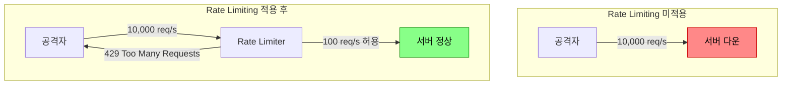

**1) DDoS / 브루트포스 공격 방어**: 공격자가 초당 수만 건의 요청을 보내 서버를 마비시키는 공격을 차단한다.

**2) 비용 보호**: 클라우드 환경에서 무제한 트래픽은 무제한 비용이다. AWS API Gateway, OpenAI API 등 외부 서비스 호출에 Rate Limiting을 걸면 예상치 못한 폭탄 청구서를 방지한다.

**3) 공정한 리소스 분배**: 특정 사용자가 시스템 자원을 독점하지 못하도록 막아 모든 사용자에게 균등한 서비스 품질을 보장한다. 멀티테넌트(Multi-tenant) SaaS 환경에서 필수적이다.

**4) Cascading Failure 방지**: 업스트림 서비스가 트래픽 급증을 견디지 못하면 의존하는 모든 서비스가 연쇄 장애를 일으킨다. Rate Limiting은 이 연쇄 장애의 첫 번째 방어선이다.

### Rate Limiting 적용 레벨

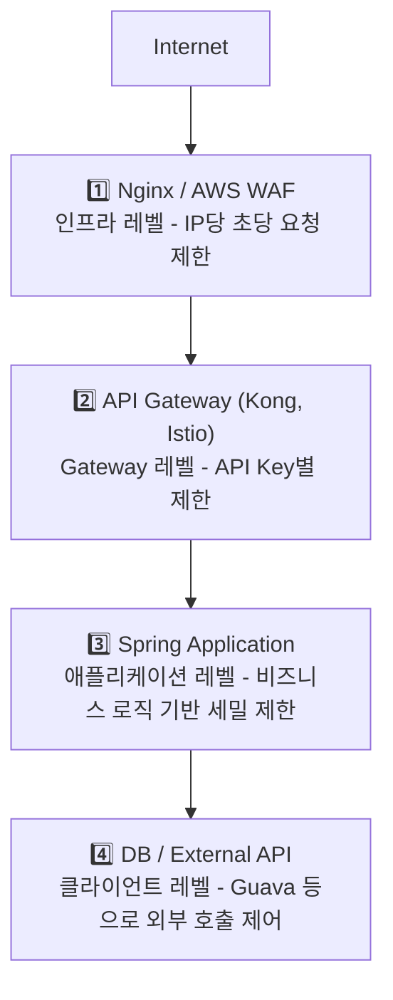

각 레벨을 **중첩 적용(Defense in Depth)**하는 것이 실무 표준이다.

| 레벨 | 위치 | 도구 | 특징 |
|------|------|------|------|
| 인프라 레벨 | L4/L7 로드밸런서, 방화벽 | Nginx, HAProxy, AWS WAF | 가장 빠름. 앱 코드 진입 전 차단 |
| API Gateway 레벨 | API Gateway | AWS API Gateway, Kong, Istio | 서비스 간 공통 정책 적용 |
| 애플리케이션 레벨 | 서버 코드 내부 | Bucket4j, Resilience4j | 세밀한 비즈니스 로직 적용 가능 |
| 클라이언트 레벨 | SDK, 클라이언트 | Guava RateLimiter | 호출자 자체 제어 |

---

## 2. Rate Limiting 알고리즘

### 2-1. Fixed Window Counter (고정 윈도우 카운터)

시간을 **고정된 윈도우(예: 1분 단위)**로 나누고, 각 윈도우 안에서 카운터를 증가시킨다.

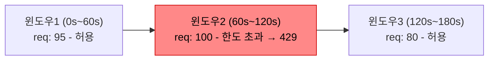

**경계 문제 (Boundary Burst)**: 59초에 100건, 61초에 100건을 보내면 실제로 2초 안에 200건이 처리된다.

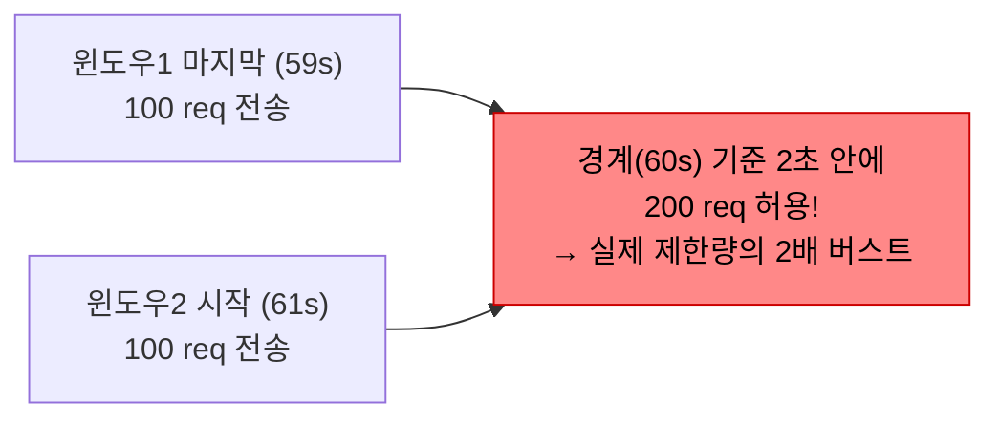

- 장점: 구현 단순, 메모리 사용 적음 (윈도우당 카운터 1개), Redis INCR + EXPIRE로 원자적 구현 가능
- 단점: 윈도우 경계에서 2배 버스트 허용

```java
@Component
public class FixedWindowRateLimiter {
    private final ConcurrentHashMap<String, AtomicInteger> counters = new ConcurrentHashMap<>();
    private final ConcurrentHashMap<String, Long> windowStart = new ConcurrentHashMap<>();
    private final int limit = 100;
    private final long windowMs = 60_000L;

    public boolean allowRequest(String key) {
        long now = System.currentTimeMillis();
        windowStart.putIfAbsent(key, now);
        counters.putIfAbsent(key, new AtomicInteger(0));

        long start = windowStart.get(key);
        if (now - start >= windowMs) {
            windowStart.put(key, now);
            counters.put(key, new AtomicInteger(1));
            return true;
        }
        return counters.get(key).incrementAndGet() <= limit;
    }
}
```

---

### 2-2. Sliding Window Log (슬라이딩 윈도우 로그)

각 요청의 **타임스탬프를 전부 기록**하고, 현재 시각 기준 과거 N초 내의 요청 수를 카운팅한다. 윈도우가 실시간으로 이동하므로 경계 문제가 없다.

- 장점: 경계 문제 없음, 가장 정확한 알고리즘
- 단점: 모든 요청 타임스탬프 저장 → 메모리 사용량이 요청 수에 비례, 고트래픽 시 Redis Sorted Set 성능 저하

```java
// Redis Sorted Set으로 구현: score=timestamp, member=timestamp+random
String script =
    "redis.call('ZREMRANGEBYSCORE', KEYS[1], '-inf', ARGV[1])\n" + // 만료 제거
    "local count = redis.call('ZCARD', KEYS[1])\n" +
    "if count < tonumber(ARGV[2]) then\n" +
    "  redis.call('ZADD', KEYS[1], ARGV[3], ARGV[3])\n" +  // 현재 요청 추가
    "  redis.call('EXPIRE', KEYS[1], ARGV[4])\n" +
    "  return 1\n" +
    "end\n" +
    "return 0";
```

---

### 2-3. Sliding Window Counter (슬라이딩 윈도우 카운터)

Fixed Window와 Sliding Window Log의 **절충안**이다. 이전 윈도우의 카운터와 현재 윈도우의 카운터를 가중 평균으로 합산한다.

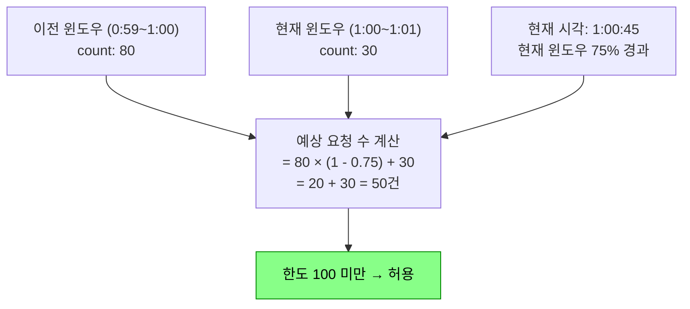

- 장점: 메모리 사용 적음 (윈도우당 카운터 2개), 경계 문제 대부분 해소, Redis + Lua로 구현 쉬움
- 단점: 통계적 근사 (100% 정밀하지 않음)

```java
// Lua 스크립트: 이전/현재 윈도우 카운터 + 경과 비율로 예상 요청 수 계산
String script =
    "local prev = tonumber(redis.call('GET', KEYS[1])) or 0\n" +
    "local curr = tonumber(redis.call('GET', KEYS[2])) or 0\n" +
    "local estimate = prev * (1 - tonumber(ARGV[1])) + curr\n" +  // 가중 평균
    "if estimate < tonumber(ARGV[2]) then\n" +
    "  redis.call('INCR', KEYS[2])\n" +
    "  redis.call('EXPIRE', KEYS[2], ARGV[3])\n" +
    "  return 1\n" +
    "end\n" +
    "return 0";
```

---

### 2-4. Token Bucket (토큰 버킷)

버킷에 **일정 속도로 토큰이 채워지고**, 요청이 올 때마다 토큰을 소비한다. 버킷이 가득 차면 새 토큰은 버려진다.

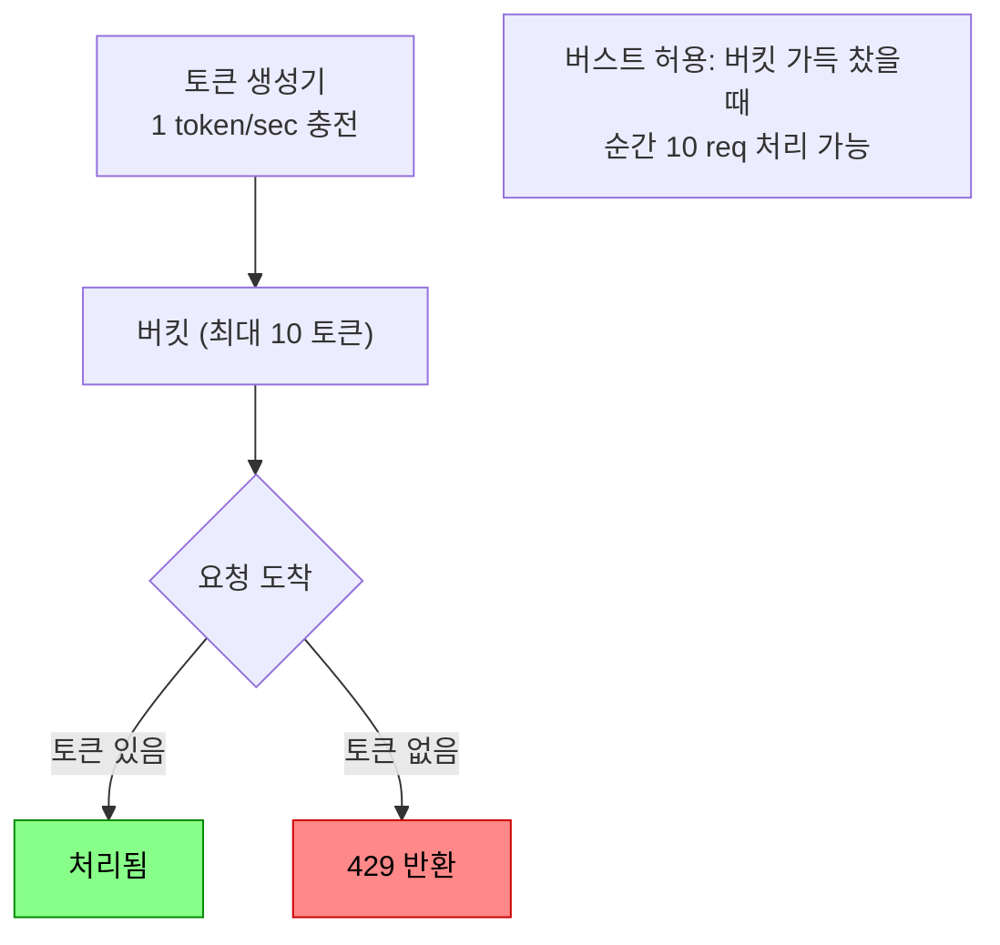

**실제 동작 흐름**

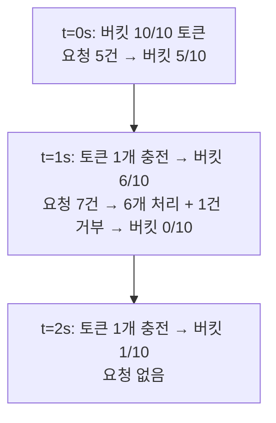

- 장점: 버스트 트래픽 허용, AWS API Gateway/Stripe/GitHub API가 이 방식 사용
- 단점: 버킷 크기와 충전 속도 두 파라미터 튜닝 필요, 분산 환경에서 토큰 동기화 필요

---

### 2-5. Leaky Bucket (누출 버킷)

요청을 큐(버킷)에 넣고 **일정한 속도로만 처리**한다. 버킷이 가득 차면 새 요청을 거부한다.

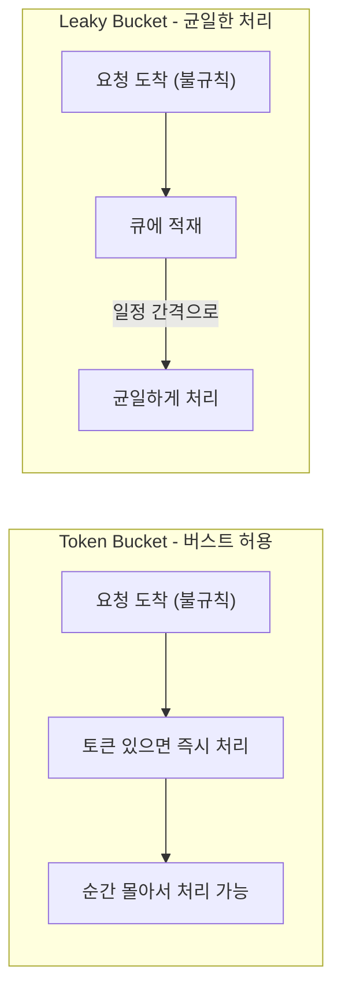

- 장점: 출력 속도 완전히 일정 → 다운스트림 서비스 보호, Nginx의 기본 방식
- 단점: 정상적인 트래픽 급증에도 응답 지연, 큐 대기 시 레이턴시 증가

### 알고리즘 비교

| 알고리즘 | 구현 복잡도 | 메모리 | 버스트 허용 | 정확도 | 대표 사용처 |
|----------|------------|--------|------------|--------|------------|
| Fixed Window | 낮음 | 매우 낮음 | 경계에서 2× | 낮음 | 단순 시스템 |
| Sliding Window Log | 높음 | 높음 (요청수 비례) | 없음 | 매우 높음 | 정확성 중요한 API |
| Sliding Window Counter | 중간 | 낮음 | 거의 없음 | 높음 | **실무 표준** |
| Token Bucket | 중간 | 낮음 | **허용** | 높음 | AWS, Stripe, GitHub |
| Leaky Bucket | 중간 | 중간 (큐) | **불허** | 높음 | Nginx, 균일 처리 |

---

## 3. 직접 구현 (Java / Spring)

### 3-1. 인메모리 Token Bucket 구현

단일 JVM 환경에서 사용할 수 있는 Thread-safe Token Bucket 구현이다.

```java
public class TokenBucket {
    private final long capacity;
    private final long refillRate; // 초당 충전량
    private final AtomicLong tokens;
    private volatile long lastRefillTime;

    public TokenBucket(long capacity, long refillRate) {
        this.capacity = capacity;
        this.refillRate = refillRate;
        this.tokens = new AtomicLong(capacity);
        this.lastRefillTime = System.currentTimeMillis();
    }

    public synchronized boolean tryConsume(long tokensToConsume) {
        refill();
        if (tokens.get() >= tokensToConsume) {
            tokens.addAndGet(-tokensToConsume);
            return true;
        }
        return false;
    }

    private void refill() {
        long now = System.currentTimeMillis();
        long elapsed = now - lastRefillTime;
        long tokensToAdd = (elapsed / 1000) * refillRate;
        if (tokensToAdd > 0) {
            tokens.set(Math.min(capacity, tokens.get() + tokensToAdd));
            lastRefillTime = now;
        }
    }
}

@Component
public class InMemoryTokenBucketRateLimiter {
    private final ConcurrentHashMap<String, TokenBucket> buckets = new ConcurrentHashMap<>();

    public boolean allowRequest(String userId) {
        TokenBucket bucket = buckets.computeIfAbsent(userId,
            k -> new TokenBucket(100L, 10L)); // 최대 100 토큰, 초당 10 충전
        return bucket.tryConsume(1);
    }

    @Scheduled(fixedDelay = 3600_000) // 1시간마다 오래된 버킷 정리
    public void evictStaleBuckets() {
        buckets.entrySet().removeIf(entry -> isStale(entry.getValue()));
    }
}
```

---

### 3-2. Redis 기반 Sliding Window Counter 구현

분산 환경에서 사용하는 Redis + Lua 스크립트 기반 구현이다. Lua 스크립트는 Redis에서 원자적으로 실행되므로 Race Condition 없이 정확한 카운팅이 가능하다.

```java
@Component
public class RedisRateLimiter {

    private final RedisTemplate<String, String> redisTemplate;

    // Lua 스크립트: 만료된 요청 제거 + 현재 요청 수 확인 + 추가 — 원자적 실행
    private static final String SLIDING_WINDOW_SCRIPT =
        "local now = tonumber(ARGV[1])\n" +
        "local window = tonumber(ARGV[2])\n" +
        "local limit = tonumber(ARGV[3])\n" +
        "local key = KEYS[1]\n" +
        "redis.call('ZREMRANGEBYSCORE', key, '-inf', now - window)\n" + // 만료 제거
        "local count = redis.call('ZCARD', key)\n" +                   // 현재 수 확인
        "if count < limit then\n" +
        "  redis.call('ZADD', key, now, now .. '-' .. math.random(100000))\n" + // 추가
        "  redis.call('EXPIRE', key, math.ceil(window / 1000) + 1)\n" +
        "  return {1, limit - count - 1}\n" +  // {허용, 남은 수}
        "end\n" +
        "return {0, 0}";

    public RateLimitResult checkLimit(String key, int limit, long windowMs) {
        long now = System.currentTimeMillis();
        DefaultRedisScript<List> script = new DefaultRedisScript<>(SLIDING_WINDOW_SCRIPT, List.class);

        @SuppressWarnings("unchecked")
        List<Long> result = (List<Long>) redisTemplate.execute(
            script,
            Collections.singletonList("rl:" + key),
            String.valueOf(now),
            String.valueOf(windowMs),
            String.valueOf(limit)
        );

        boolean allowed = result != null && result.get(0) == 1L;
        long remaining = result != null ? result.get(1) : 0L;
        return new RateLimitResult(allowed, remaining, limit, windowMs);
    }
}

public record RateLimitResult(boolean allowed, long remaining, int limit, long windowMs) {}
```

---

### 3-3. Spring Filter로 Rate Limiting 적용

```java
@Component
@Order(1)
public class RateLimitFilter implements Filter {

    private final RedisRateLimiter rateLimiter;

    @Override
    public void doFilter(ServletRequest request, ServletResponse response, FilterChain chain)
            throws IOException, ServletException {

        HttpServletRequest httpRequest = (HttpServletRequest) request;
        HttpServletResponse httpResponse = (HttpServletResponse) response;

        String clientKey = resolveClientKey(httpRequest);
        RateLimitResult result = rateLimiter.checkLimit(clientKey, 100, 60_000L);

        // RFC 표준 헤더 설정
        httpResponse.setHeader("X-RateLimit-Limit", String.valueOf(result.limit()));
        httpResponse.setHeader("X-RateLimit-Remaining", String.valueOf(result.remaining()));
        httpResponse.setHeader("X-RateLimit-Reset",
            String.valueOf(System.currentTimeMillis() / 1000 + 60));

        if (!result.allowed()) {
            httpResponse.setStatus(HttpStatus.TOO_MANY_REQUESTS.value());
            httpResponse.setHeader("Retry-After", "60");
            httpResponse.setContentType("application/json");
            httpResponse.getWriter().write("""
                {
                  "error": "Too Many Requests",
                  "message": "Rate limit exceeded. Please retry after 60 seconds.",
                  "retryAfter": 60
                }
                """);
            return;
        }
        chain.doFilter(request, response);
    }

    private String resolveClientKey(HttpServletRequest request) {
        // API Key 우선, 없으면 IP
        String apiKey = request.getHeader("X-API-Key");
        if (apiKey != null && !apiKey.isBlank()) return "apikey:" + apiKey;

        // X-Forwarded-For 헤더 처리 (프록시 뒤에 있을 경우)
        String forwarded = request.getHeader("X-Forwarded-For");
        if (forwarded != null) return "ip:" + forwarded.split(",")[0].trim();
        return "ip:" + request.getRemoteAddr();
    }
}
```

---

### 3-4. 어노테이션 기반 엔드포인트별 적용

엔드포인트별로 다른 Rate Limit을 적용하는 어노테이션 기반 방식이다.

```java
@Target(ElementType.METHOD)
@Retention(RetentionPolicy.RUNTIME)
public @interface RateLimit {
    int limit() default 100;
    long windowMs() default 60_000L;
    String keyPrefix() default "";
}

@Component
public class RateLimitInterceptor implements HandlerInterceptor {

    @Override
    public boolean preHandle(HttpServletRequest request,
                             HttpServletResponse response, Object handler) throws Exception {

        if (!(handler instanceof HandlerMethod handlerMethod)) return true;

        RateLimit rateLimit = handlerMethod.getMethodAnnotation(RateLimit.class);
        if (rateLimit == null) return true;

        String prefix = rateLimit.keyPrefix().isBlank()
            ? handlerMethod.getMethod().getName() : rateLimit.keyPrefix();
        String key = prefix + ":" + getClientIp(request);

        RateLimitResult result = rateLimiter.checkLimit(key, rateLimit.limit(), rateLimit.windowMs());
        response.setHeader("X-RateLimit-Limit", String.valueOf(rateLimit.limit()));
        response.setHeader("X-RateLimit-Remaining", String.valueOf(result.remaining()));

        if (!result.allowed()) {
            response.setStatus(429);
            response.setHeader("Retry-After", String.valueOf(rateLimit.windowMs() / 1000));
            response.getWriter().write("{\"error\":\"Too Many Requests\"}");
            return false;
        }
        return true;
    }
}

// 사용 예시
@RestController
public class UserController {
    @RateLimit(limit = 5, windowMs = 60_000L, keyPrefix = "login") // 분당 5번
    @PostMapping("/api/login")
    public ResponseEntity<String> login(@RequestBody LoginRequest req) { ... }

    @RateLimit(limit = 1000, windowMs = 3600_000L, keyPrefix = "search") // 시간당 1000번
    @GetMapping("/api/search")
    public ResponseEntity<List<String>> search(@RequestParam String q) { ... }
}
```

---

## 4. 라이브러리 & 프레임워크

### 4-1. Bucket4j — Token Bucket 전용 Java 라이브러리

Token Bucket 알고리즘 기반의 Java 전용 Rate Limiting 라이브러리다. 로컬(in-memory)과 분산(Redis, Hazelcast) 모드를 모두 지원한다.

```xml
<dependency>
    <groupId>com.bucket4j</groupId>
    <artifactId>bucket4j-core</artifactId>
    <version>8.10.1</version>
</dependency>
<dependency>
    <groupId>com.bucket4j</groupId>
    <artifactId>bucket4j-redis</artifactId>
    <version>8.10.1</version>
</dependency>
```

```java
@Service
public class Bucket4jRateLimiterService {

    private final Map<String, Bucket> buckets = new ConcurrentHashMap<>();

    private Bucket createBucket() {
        Bandwidth limit = Bandwidth.classic(
            100, Refill.greedy(100, Duration.ofMinutes(1))  // 분당 100개
        );
        Bandwidth burst = Bandwidth.classic(
            200, Refill.intervally(200, Duration.ofMinutes(1)) // 순간 200개 버스트 허용
        );
        return Bucket.builder().addLimit(limit).addLimit(burst).build();
    }

    public boolean tryConsume(String userId) {
        Bucket bucket = buckets.computeIfAbsent(userId, k -> createBucket());
        return bucket.tryConsume(1);
    }
}
```

**Redis 분산 모드**

```java
@Configuration
public class Bucket4jRedisConfig {
    @Bean
    public ProxyManager<String> proxyManager(RedissonClient redissonClient) {
        return Bucket4jRedisson.casBasedBuilder(redissonClient).build();
    }
}

@Service
public class DistributedBucket4jService {

    public boolean tryConsume(String userId) {
        BucketConfiguration config = BucketConfiguration.builder()
            .addLimit(Bandwidth.classic(100, Refill.greedy(100, Duration.ofMinutes(1))))
            .build();

        Bucket bucket = proxyManager.builder().build(userId, () -> config);
        return bucket.tryConsume(1);
    }
}
```

---

### 4-2. Resilience4j RateLimiter — Semaphore 기반

Circuit Breaker, Retry, Rate Limiter를 통합 제공하는 라이브러리다. **Semaphore** 기반으로 동작한다.

```yaml
resilience4j:
  ratelimiter:
    instances:
      userLoginEndpoint:
        limit-for-period: 5         # 갱신 주기당 허용 요청 수
        limit-refresh-period: 1m    # 갱신 주기
        timeout-duration: 500ms     # 토큰 대기 시간 (500ms 후 실패)
```

```java
@Service
public class UserService {

    @RateLimiter(name = "userLoginEndpoint", fallbackMethod = "loginFallback")
    public String login(String userId, String password) {
        return "success";
    }

    public String loginFallback(String userId, String password, RequestNotPermitted e) {
        return "Too many login attempts. Please try again later.";
    }
}

// Circuit Breaker + Rate Limiter 조합
// Rate Limiter(바깥) → Circuit Breaker(안) 순서로 적용
Supplier<String> decoratedSupplier = RateLimiter.decorateSupplier(rateLimiter,
    CircuitBreaker.decorateSupplier(circuitBreaker, () -> doProcessPayment(request)));
```

---

### 4-3. Spring Cloud Gateway RateLimiter — Redis Token Bucket

Spring Cloud Gateway에서 기본 제공하는 **RequestRateLimiter** 필터로, Redis 기반 Token Bucket을 사용한다.

```yaml
spring:
  cloud:
    gateway:
      routes:
        - id: user-service
          uri: lb://user-service
          predicates:
            - Path=/api/users/**
          filters:
            - name: RequestRateLimiter
              args:
                redis-rate-limiter.replenishRate: 10    # 초당 토큰 충전량
                redis-rate-limiter.burstCapacity: 20    # 버킷 최대 용량
                redis-rate-limiter.requestedTokens: 1   # 요청당 소비 토큰
                key-resolver: "#{@userKeyResolver}"     # 키 결정 Bean
```

**Key Resolver 구현**

```java
@Configuration
public class RateLimiterConfig {

    @Bean
    public KeyResolver userKeyResolver() {
        return exchange -> {
            String userId = exchange.getRequest().getHeaders().getFirst("X-User-Id");
            return Mono.just(userId != null ? userId : "anonymous");
        };
    }

    @Bean
    public KeyResolver ipKeyResolver() {
        return exchange -> Mono.just(
            Objects.requireNonNull(
                exchange.getRequest().getRemoteAddress()
            ).getAddress().getHostAddress()
        );
    }
}
```

---

### 4-4. Guava RateLimiter — 단일 JVM 전용

Google Guava의 `RateLimiter`는 단일 JVM 환경에서 간편하게 사용할 수 있는 Token Bucket 구현이다. 분산 환경에서는 사용할 수 없다.

```java
// SmoothBursty: 버스트 허용 (기본값)
RateLimiter burstyLimiter = RateLimiter.create(10.0); // 초당 10개

// SmoothWarmingUp: 워밍업 후 최대 속도 도달 (cold start 시뮬레이션)
RateLimiter warmingLimiter = RateLimiter.create(10.0, 5, TimeUnit.SECONDS);

@Service
public class ExternalApiService {
    private final RateLimiter limiter = RateLimiter.create(5.0); // 초당 5회

    public String callExternalApi(String param) {
        if (!limiter.tryAcquire(100, TimeUnit.MILLISECONDS)) {
            throw new RateLimitExceededException("External API call rate limit exceeded");
        }
        return restTemplate.getForObject("https://api.example.com/data?q=" + param, String.class);
    }
}
```

---

### 4-5. Nginx Rate Limiting — 인프라 레벨 1차 차단

인프라 레벨에서 가장 먼저 차단하는 `ngx_http_limit_req_module`이다.

```nginx
http {
    # Rate Limit Zone 정의: 클라이언트 IP당 초당 10 요청
    limit_req_zone $binary_remote_addr zone=api_limit:10m rate=10r/s;

    server {
        location /api/ {
            # burst: 최대 20개를 큐에 보관
            # nodelay: 큐 대기 없이 즉시 처리
            limit_req zone=api_limit burst=20 nodelay;
            limit_req_status 429; # 기본 503 대신 429 반환

            proxy_pass http://backend;
        }

        location /api/login {
            limit_req zone=api_limit burst=5; # 로그인은 더 엄격하게
            limit_req_status 429;
            proxy_pass http://backend;
        }

        error_page 429 /rate_limit.json;
        location = /rate_limit.json {
            default_type application/json;
            return 429 '{"error":"Too Many Requests","message":"Please slow down"}';
        }
    }
}
```

`burst`는 큐에 보관할 최대 요청 수이고, `nodelay`는 버스트 요청을 지연 없이 즉시 처리하는 옵션이다. `nodelay`가 없으면 rate에 맞게 지연 후 처리된다.

### 라이브러리 비교

| 라이브러리 | 알고리즘 | 분산 지원 | Spring Boot 통합 | 추천 상황 |
|-----------|----------|----------|-----------------|----------|
| **Bucket4j** | Token Bucket | Redis, Hazelcast | Spring Boot Starter | 분산 환경 범용 |
| **Resilience4j** | Semaphore | 없음 (단일 JVM) | Spring Boot Starter | 안정성 패턴 통합 |
| **Spring Cloud Gateway** | Token Bucket (Redis) | Redis | 내장 | API Gateway |
| **Guava RateLimiter** | Token Bucket | 없음 (단일 JVM) | 없음 | 외부 API 호출 제어 |
| **Nginx** | Leaky Bucket | 없음 | 없음 | 인프라 레벨 1차 차단 |

---

## 5. 분산 환경에서의 Rate Limiting

### 왜 단일 서버 Rate Limiting이 부족한가?

로드밸런서가 요청을 분산시키므로, 각 서버의 인메모리 카운터는 전체 요청 수를 반영하지 못한다.

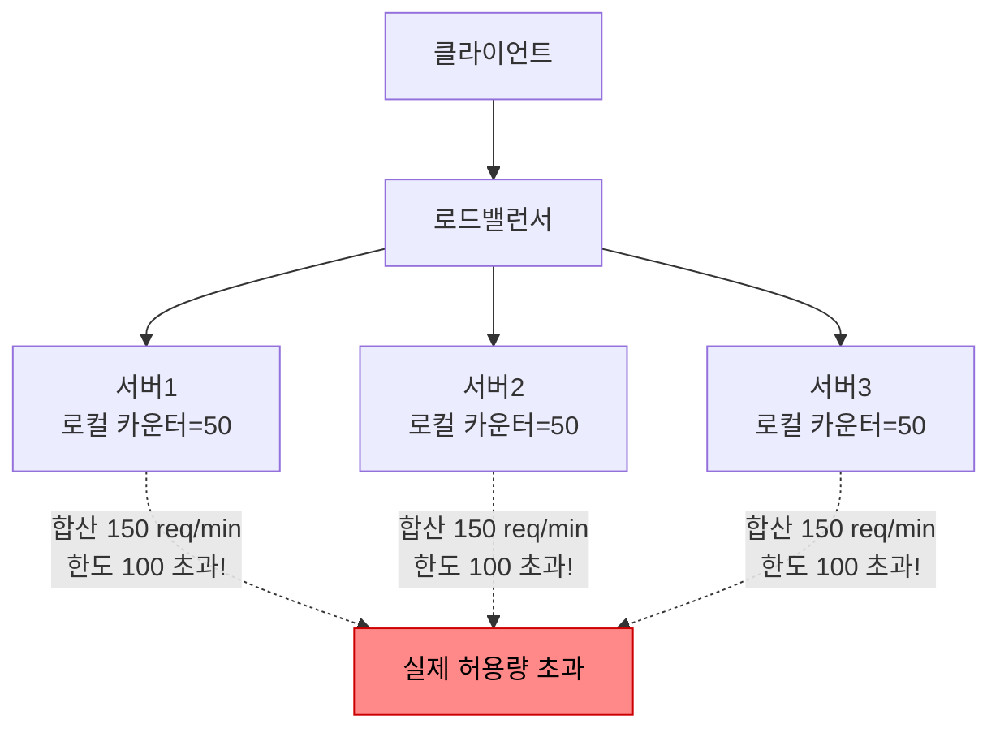

### Redis 중앙 집중식 Rate Limiting

모든 서버가 Redis의 동일한 카운터를 읽고 쓴다. Lua 스크립트로 Race Condition을 방지한다.

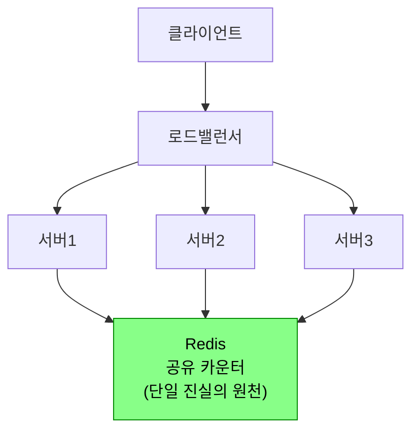

**Lua 스크립트로 Race Condition 방지**

Redis는 단일 스레드로 명령을 처리하고, Lua 스크립트는 원자적으로 실행된다. 서버1의 EVAL이 먼저 실행되어 99→100(허용)이 되면, 서버2의 EVAL은 이미 100임을 감지하고 거부한다. 별도의 분산 락 없이 **원자적 CAS(Compare-And-Swap)**처럼 동작한다.

```lua
local key = KEYS[1]
local limit = tonumber(ARGV[1])
local expire = tonumber(ARGV[2])

local current = redis.call('GET', key)
if current and tonumber(current) >= limit then
    return 0  -- 거부
end

local new_value = redis.call('INCR', key)
if new_value == 1 then
    redis.call('EXPIRE', key, expire)
end
if new_value > limit then
    redis.call('DECR', key)  -- 동시 요청 경쟁으로 초과 시 롤백
    return 0
end
return 1  -- 허용
```

---

## 6. HTTP 표준 헤더

RFC 6585과 IETF 드래프트에서 정의하는 Rate Limiting 관련 표준 헤더다.

```
HTTP/1.1 200 OK
X-RateLimit-Limit: 100        ← 현재 윈도우의 최대 요청 허용 수
X-RateLimit-Remaining: 73     ← 현재 윈도우에서 남은 요청 가능 수
X-RateLimit-Reset: 1746094800 ← 윈도우가 리셋되는 시각 (Unix timestamp)

HTTP/1.1 429 Too Many Requests
X-RateLimit-Limit: 100
X-RateLimit-Remaining: 0
X-RateLimit-Reset: 1746094800
Retry-After: 47               ← N초 후 재시도하라는 권고
```

```java
@RestControllerAdvice
public class RateLimitExceptionHandler {

    @ExceptionHandler(RateLimitExceededException.class)
    public ResponseEntity<ErrorResponse> handleRateLimit(RateLimitExceededException e) {
        long resetTime = System.currentTimeMillis() / 1000 + 60;
        HttpHeaders headers = new HttpHeaders();
        headers.set("X-RateLimit-Limit", String.valueOf(e.getLimit()));
        headers.set("X-RateLimit-Remaining", "0");
        headers.set("X-RateLimit-Reset", String.valueOf(resetTime));
        headers.set("Retry-After", "60");

        return ResponseEntity.status(HttpStatus.TOO_MANY_REQUESTS)
            .headers(headers)
            .body(new ErrorResponse("Too Many Requests",
                "Rate limit exceeded. Retry after 60 seconds.",
                60, Instant.ofEpochSecond(resetTime).toString()));
    }
}

public record ErrorResponse(String error, String message, long retryAfter, String resetAt) {}
```

---

## 7. 실무 설계 패턴

### 7-1. 사용자 식별 방식별 Rate Limiting

```java
@Component
public class RateLimitKeyResolver {

    public String resolve(HttpServletRequest request) {
        // 1순위: JWT에서 사용자 ID 추출 (가장 정확)
        String jwt = extractJwt(request);
        if (jwt != null) return "user:" + jwtService.extractUserId(jwt);

        // 2순위: API Key
        String apiKey = request.getHeader("X-API-Key");
        if (apiKey != null && !apiKey.isBlank()) return "apikey:" + apiKey;

        // 3순위: IP 주소 (인증되지 않은 요청)
        String forwarded = request.getHeader("X-Forwarded-For");
        String ip = (forwarded != null) ? forwarded.split(",")[0].trim() : request.getRemoteAddr();
        return "ip:" + ip;
    }
}
```

| 방식 | 장점 | 단점 | 사용 시점 |
|------|------|------|----------|
| IP 기반 | 인증 없이 적용 가능 | NAT 뒤 다수 사용자 동일 IP | 비인증 엔드포인트 |
| API Key 기반 | 클라이언트 앱별 구분 | 키 노출 위험 | B2B API |
| User ID 기반 | 가장 정확한 사용자 구분 | 인증 필요 | 로그인 필요 서비스 |

### 7-2. 티어별 Rate Limit (Free / Pro / Enterprise)

```java
public enum UserTier {
    FREE(100, Duration.ofHours(1)),
    PRO(10_000, Duration.ofHours(1)),
    ENTERPRISE(1_000_000, Duration.ofHours(1));

    private final int requestLimit;
    private final Duration window;
}

@Component
public class TieredRateLimiter {

    public RateLimitResult checkTieredLimit(String userId) {
        UserTier tier = userService.getUserTier(userId);
        String key = "tier:" + tier.name().toLowerCase() + ":user:" + userId;
        return redisLimiter.checkLimit(key, tier.getRequestLimit(), tier.getWindow().toMillis());
    }
}
```

---

## 극한 시나리오

### 시나리오 1: Redis 장애 시 Rate Limiter 동작

Redis 장애는 Rate Limiter를 완전히 무력화시킬 수 있다.

```java
@Component
public class ResilientRateLimiter {

    private volatile boolean redisHealthy = true;
    private final ConcurrentHashMap<String, AtomicInteger> localFallback = new ConcurrentHashMap<>();

    public boolean allowRequest(String key) {
        if (redisHealthy) {
            try {
                return redisLimiter.checkLimit(key, 100, 60_000L).allowed();
            } catch (RedisConnectionException e) {
                log.error("Redis connection failed, switching to local fallback");
                redisHealthy = false;
            }
        }
        // 로컬 폴백: 한도를 절반으로 낮춰 부분적 보호
        AtomicInteger counter = localFallback.computeIfAbsent(key, k -> new AtomicInteger(0));
        return counter.incrementAndGet() <= 50;
    }

    @Scheduled(fixedDelay = 5_000) // 5초마다 Redis 복구 확인
    public void checkRedisHealth() {
        try {
            redisTemplate.opsForValue().get("health-check");
            if (!redisHealthy) {
                log.info("Redis recovered, switching back");
                redisHealthy = true;
                localFallback.clear();
            }
        } catch (Exception ignored) {}
    }
}
```

- **Fail-Open (장애 시 허용)**: 서비스 가용성 우선. Rate Limiting 효과 없음 → 공격에 취약.
- **Fail-Close (장애 시 거부)**: 보안 우선. 정상 트래픽도 차단됨 → 서비스 중단.
- **실무 권장**: 로컬 캐시 폴백 — 한도를 낮춰서 부분적으로 보호하면서 서비스는 유지.

### 시나리오 2: 시간 동기화 문제 (NTP Drift)

Fixed Window, Sliding Window 알고리즘은 시스템 시계에 의존한다. 서버 간 NTP 동기화 오차가 수 초 발생하면 윈도우 경계 계산이 틀어진다.

```java
// 해결: Redis 서버 시간을 신뢰의 원천으로 사용
public long getServerTime() {
    // Redis TIME 명령으로 Redis 서버의 Unix timestamp 가져오기
    List<Long> time = redisTemplate.execute(
        (RedisCallback<List<Long>>) conn -> conn.serverCommands().time()
    );
    return time.get(0) * 1000 + time.get(1) / 1000; // [seconds, microseconds] → ms
}
```

모든 서버가 Redis의 시간을 기준으로 윈도우를 계산하면 NTP Drift의 영향을 제거할 수 있다.

### 시나리오 3: Hot Key 문제

인기 API 엔드포인트의 Rate Limit 키가 Redis의 특정 슬롯에 집중되면 해당 노드에 과부하가 발생한다.

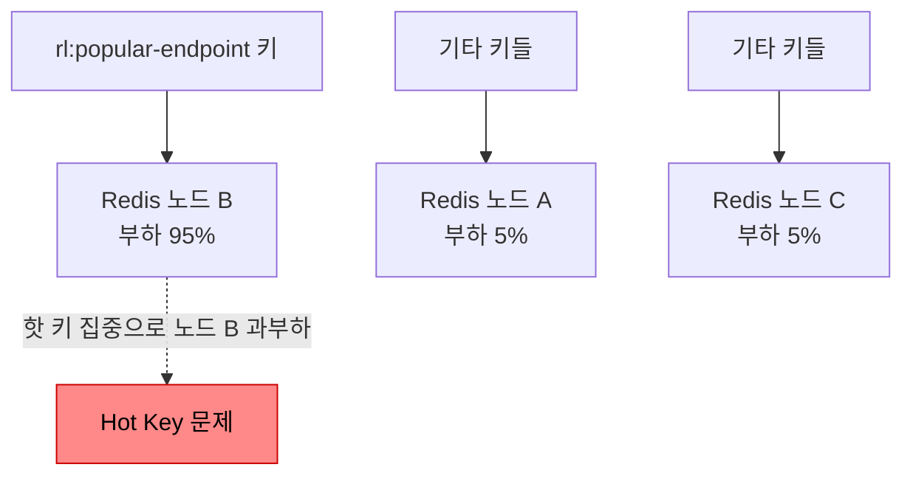

**해결책: 키 샤딩**

```java
public String shardedKey(String key, int shards) {
    int shard = Math.abs(key.hashCode() % shards);
    return key + ":shard:" + shard; // 4개 샤드로 분산
}

// 전체 한도 100을 샤드 수로 나눠서 각 샤드에 적용
// rl:popular:shard:0, rl:popular:shard:1, ... → 각 Redis 노드로 분산
```

### 시나리오 4: 분산 환경 정확도 vs 성능 트레이드오프

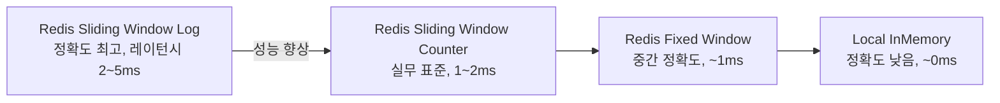

| 접근 방식 | 정확도 | 레이턴시 추가 | 적합한 상황 |
|----------|--------|-------------|------------|
| 로컬 인메모리 | 낮음 | ~0ms | 단일 서버, 내부 서비스 |
| Redis Fixed Window | 중간 | ~1ms | 빠른 응답 필요 |
| Redis Sliding Window Counter | 높음 | ~1-2ms | **실무 표준** |
| Redis Sliding Window Log | 매우 높음 | ~2-5ms | 금융·결제, 정확도 최우선 |
| 로컬+Redis 하이브리드 | 높음 | ~0.5ms | 고성능 + 정확도 균형 |

---

## 정리

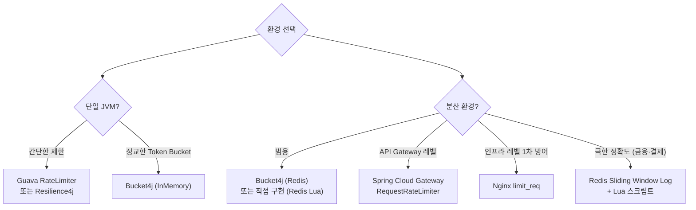

Redis 장애 시 **로컬 캐시 폴백**을 기본 전략으로, Hot Key는 **키 샤딩**으로 대응하고, 모든 Rate Limit 응답에는 **표준 헤더(X-RateLimit-*, Retry-After)**를 반드시 포함하는 것이 실무 표준이다.
