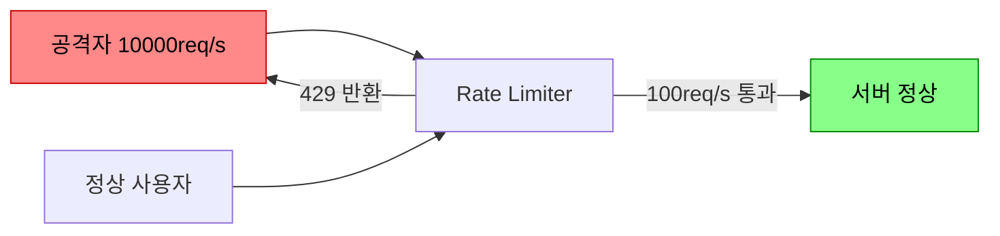
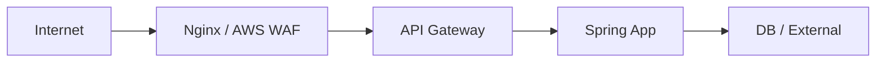
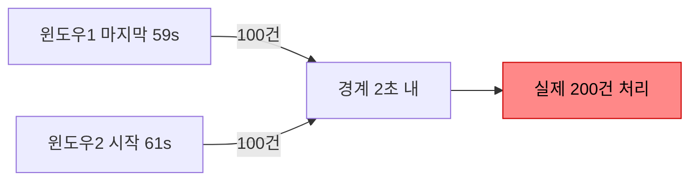
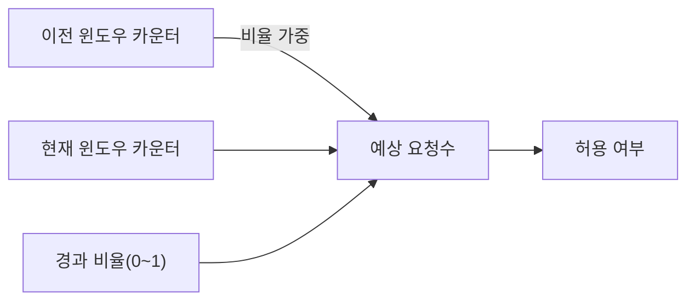
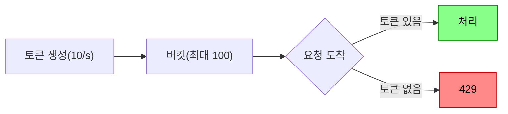
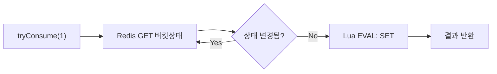
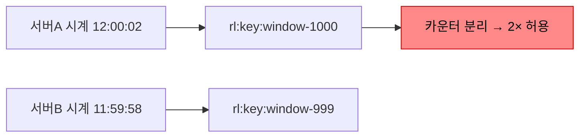
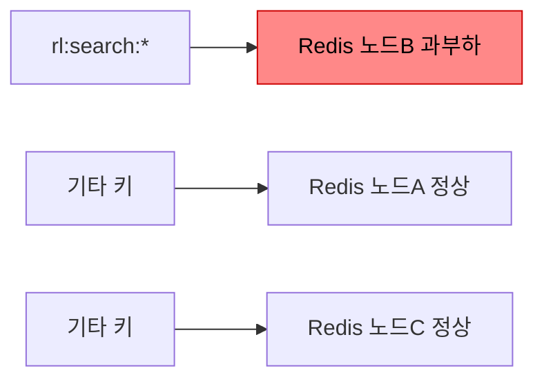
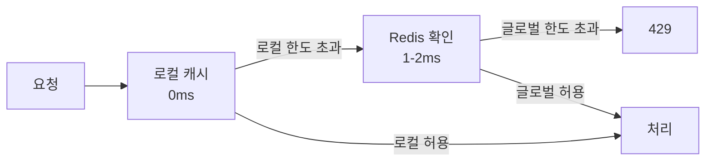
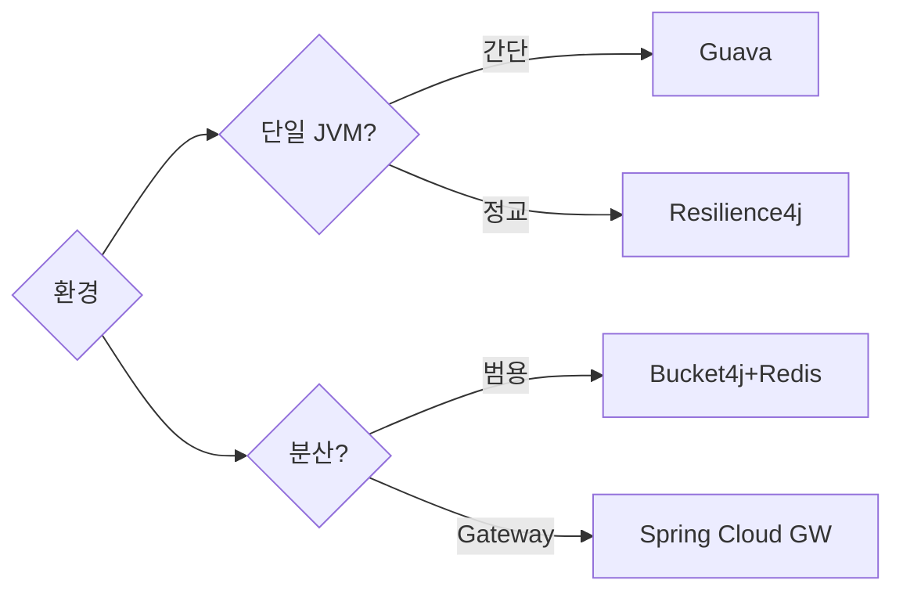

API를 운영하다 보면 한 클라이언트가 초당 수천 건의 요청을 보내 서버 전체가 다운되거나, 브루트포스 공격으로 로그인 API가 마비되는 상황을 맞닥뜨린다. Rate Limiting은 이를 막는 첫 번째 방어선이다. 그런데 "왜 Token Bucket인가?", "Lua 스크립트를 쓰지 않으면 어떤 Race Condition이 발생하는가?", "Redis가 죽으면 어떻게 되는가?" — 이 질문들에 답할 수 있어야 실무 엔지니어다.

> **비유**: 인기 놀이공원 입구에서 "1분에 100명만 입장"을 관리하는 방식에는 여러 가지가 있다. 타이머를 보고 1분마다 카운터를 리셋할 수도 있고(Fixed Window), 매 입장마다 입장 시각을 메모지에 기록했다가 1분 지난 메모를 찢어버릴 수도 있다(Sliding Window Log). 어떤 방식이 더 공정하고 어떤 방식이 더 빠른지 — 그 트레이드오프를 이해하는 것이 Rate Limiting 설계의 핵심이다.

---

## 1. 왜 Rate Limiting이 필요한가



**1) DDoS·브루트포스 방어** — 공격자가 초당 수만 건으로 서버를 마비시키기 전에 차단한다. 로그인 API에 분당 5회 제한을 걸면 10만 개 패스워드 시도에 1.4일이 걸린다.

**2) 비용 보호** — 클라우드 환경에서 무제한 트래픽은 무제한 비용이다. OpenAI API, AWS Lambda 호출에 Rate Limiting을 걸면 예상 밖의 청구서를 막는다.

**3) 공정한 자원 분배** — 멀티테넌트 SaaS에서 한 고객이 전체 DB Connection Pool을 독점하지 못하게 막아 모든 고객에게 균등한 SLA를 보장한다.

**4) Cascading Failure 방지** — 업스트림이 폭증을 견디지 못하면 의존하는 모든 서비스가 연쇄 장애를 일으킨다. Rate Limiting은 이 도미노의 첫 번째 패를 세운다.

### 적용 레벨: Defense in Depth



각 레벨을 중첩 적용하는 것이 실무 표준이다. Nginx에서 1차로 차단하고, Spring에서 사용자별 세밀한 정책을 적용한다.

| 레벨 | 도구 | 특징 |
|------|------|------|
| 인프라 L7 | Nginx, AWS WAF | 가장 빠름. 앱 코드 진입 전 차단 |
| API Gateway | Kong, Istio, SCG | 서비스 간 공통 정책 |
| 애플리케이션 | Bucket4j, Resilience4j | 비즈니스 로직 세밀 제어 |
| 클라이언트 SDK | Guava RateLimiter | 호출자 자체 제어 |

---

## 2. 알고리즘 내부 구조와 WHY

### 2-1. Fixed Window Counter — 가장 단순하지만 위험한 이유

시간을 고정 윈도우(예: 1분)로 나누고 윈도우마다 카운터를 증가시킨다.

**왜 위험한가?** 59초에 100건, 61초에 100건을 보내면 2초 안에 200건이 처리된다. 윈도우 경계에서 실제 허용량의 2배 버스트가 발생한다.



```java
@Component
public class FixedWindowRateLimiter {
    private final ConcurrentHashMap<String, AtomicInteger> counters = new ConcurrentHashMap<>();
    private final ConcurrentHashMap<String, Long> windowStart = new ConcurrentHashMap<>();
    private final int limit = 100;
    private final long windowMs = 60_000L;

    public boolean allowRequest(String key) {
        long now = System.currentTimeMillis();
        windowStart.putIfAbsent(key, now);
        counters.putIfAbsent(key, new AtomicInteger(0));

        long start = windowStart.get(key);
        if (now - start >= windowMs) {
            // 윈도우 리셋 — 이 시점이 경계 버스트의 원인
            windowStart.put(key, now);
            counters.put(key, new AtomicInteger(1));
            return true;
        }
        return counters.get(key).incrementAndGet() <= limit;
    }
}
```

**Redis 구현**: `INCR` + `EXPIRE`로 원자적 구현 가능하나 경계 문제는 여전히 존재한다.

```java
public boolean allowFixedWindow(String key, int limit, int windowSec) {
    String redisKey = "fw:" + key + ":" + (System.currentTimeMillis() / 1000 / windowSec);
    Long count = redisTemplate.opsForValue().increment(redisKey);
    if (count == 1) {
        redisTemplate.expire(redisKey, Duration.ofSeconds(windowSec));
    }
    return count <= limit;
}
```

---

### 2-2. Sliding Window Log — 가장 정확하지만 메모리가 문제

요청의 타임스탬프를 전부 저장하고, 현재 기준 N초 이내 요청 수를 센다. 경계 버스트가 없다.

**왜 메모리가 문제인가?** 초당 1만 건 API라면 60초 윈도우에 60만 개의 타임스탬프를 저장해야 한다. Redis Sorted Set으로 구현하면 메모리가 요청 수에 비례한다.

**Redis Lua 스크립트 — 원자적 파이프라인**

Lua를 쓰는 이유는 Redis가 Lua 스크립트를 단일 트랜잭션으로 실행하기 때문이다. ZREMRANGEBYSCORE → ZCARD → ZADD 세 명령이 원자적으로 실행되어 두 서버가 동시에 99번째 요청을 처리하는 Race Condition을 원천 차단한다.

```java
@Component
public class SlidingWindowLogRateLimiter {

    private final RedisTemplate<String, String> redisTemplate;

    // KEYS[1] = 레디스 키
    // ARGV[1] = 현재 시각(ms), ARGV[2] = 윈도우 크기(ms)
    // ARGV[3] = 요청 한도, ARGV[4] = 만료 시간(초)
    private static final String SLIDING_LOG_SCRIPT = """
        local now = tonumber(ARGV[1])
        local window = tonumber(ARGV[2])
        local limit = tonumber(ARGV[3])
        local expire = tonumber(ARGV[4])
        local key = KEYS[1]

        -- 1단계: 윈도우 밖의 오래된 요청 제거 (만료 처리)
        redis.call('ZREMRANGEBYSCORE', key, '-inf', now - window)

        -- 2단계: 현재 윈도우 내 요청 수 확인
        local count = redis.call('ZCARD', key)

        -- 3단계: 한도 미만이면 현재 요청 추가 후 허용
        if count < limit then
            local member = now .. '-' .. math.random(1, 100000)
            redis.call('ZADD', key, now, member)
            redis.call('EXPIRE', key, expire)
            return {1, limit - count - 1}
        end

        -- 한도 초과 — 거부
        return {0, 0}
        """;

    public RateLimitResult checkLimit(String key, int limit, long windowMs) {
        long now = System.currentTimeMillis();
        DefaultRedisScript<List> script = new DefaultRedisScript<>(SLIDING_LOG_SCRIPT, List.class);

        @SuppressWarnings("unchecked")
        List<Long> result = (List<Long>) redisTemplate.execute(
            script,
            List.of("rl:log:" + key),
            String.valueOf(now),
            String.valueOf(windowMs),
            String.valueOf(limit),
            String.valueOf((windowMs / 1000) + 1)
        );

        boolean allowed = result != null && result.get(0) == 1L;
        long remaining = result != null ? result.get(1) : 0L;
        return new RateLimitResult(allowed, remaining, limit, windowMs);
    }
}
```

**Lua 없이 GET → CHECK → SET 방식의 Race Condition**

Lua 없이 Java에서 GET → 비교 → INCR 순서로 구현하면 두 서버가 동시에 GET해서 둘 다 99를 읽고, 둘 다 INCR해서 101이 되는 순간이 발생한다. Lua는 이 간격을 0으로 만든다.

```java
// 위험한 방식 — Race Condition 발생
public boolean dangerousCheck(String key, int limit) {
    Long current = redisTemplate.opsForValue().get(key); // 서버A, 서버B 모두 99 읽음
    if (current != null && current >= limit) return false;
    redisTemplate.opsForValue().increment(key);          // 둘 다 100으로 만듦 → 동시에 통과
    return true;
}
```

---

### 2-3. Sliding Window Counter — 실무 표준이 된 이유

이전 윈도우와 현재 윈도우의 카운터를 경과 비율로 가중 평균한다. 타임스탬프를 저장하지 않으므로 메모리가 O(1)이고, 경계 버스트도 대부분 방지한다.



**가중 평균 수식**: `예상_요청수 = 이전_카운터 × (1 - 경과_비율) + 현재_카운터`

예: 1분 100개 제한, 이전 윈도우 80건, 현재 윈도우 45초 경과(비율 0.75), 현재 카운터 60건.
`예상 = 80 × (1 - 0.75) + 60 = 20 + 60 = 80` → 100 미만이므로 허용.

```java
@Component
public class SlidingWindowCounterRateLimiter {

    private final RedisTemplate<String, String> redisTemplate;

    // KEYS[1] = 이전 윈도우 키, KEYS[2] = 현재 윈도우 키
    // ARGV[1] = 경과 비율(0.0~1.0), ARGV[2] = 한도, ARGV[3] = 만료(초)
    private static final String SLIDING_COUNTER_SCRIPT = """
        local prev = tonumber(redis.call('GET', KEYS[1])) or 0
        local curr = tonumber(redis.call('GET', KEYS[2])) or 0
        local elapsed_ratio = tonumber(ARGV[1])
        local limit = tonumber(ARGV[2])
        local expire = tonumber(ARGV[3])

        -- 가중 평균: 이전 윈도우 기여분 + 현재 카운터
        local estimate = prev * (1 - elapsed_ratio) + curr

        if estimate < limit then
            redis.call('INCR', KEYS[2])
            redis.call('EXPIRE', KEYS[2], expire)
            return {1, math.floor(limit - estimate - 1)}
        end

        return {0, 0}
        """;

    public RateLimitResult checkLimit(String key, int limit, long windowMs) {
        long now = System.currentTimeMillis();
        long windowSec = windowMs / 1000;
        long currentWindow = now / windowMs;
        long prevWindow = currentWindow - 1;
        double elapsedRatio = (double) (now % windowMs) / windowMs;

        String prevKey = "rl:sw:" + key + ":" + prevWindow;
        String currKey = "rl:sw:" + key + ":" + currentWindow;

        DefaultRedisScript<List> script = new DefaultRedisScript<>(SLIDING_COUNTER_SCRIPT, List.class);

        @SuppressWarnings("unchecked")
        List<Long> result = (List<Long>) redisTemplate.execute(
            script,
            List.of(prevKey, currKey),
            String.format("%.4f", elapsedRatio),
            String.valueOf(limit),
            String.valueOf(windowSec * 2)   // 이전 윈도우도 충분히 살아있게
        );

        boolean allowed = result != null && result.get(0) == 1L;
        long remaining = result != null ? result.get(1) : 0L;
        return new RateLimitResult(allowed, remaining, limit, windowMs);
    }
}

public record RateLimitResult(boolean allowed, long remaining, int limit, long windowMs) {}
```

---

### 2-4. Token Bucket — AWS·Stripe·GitHub가 이 방식을 쓰는 이유

버킷에 일정 속도로 토큰이 충전되고, 요청마다 토큰을 소비한다. 버킷이 가득 차면 버스트 트래픽을 자연스럽게 허용한다.



**왜 버스트를 허용하는가?** 실제 트래픽은 균일하지 않다. 정각에 일괄 배치 작업이 실행되거나, 아침에 사용자가 한꺼번에 접속하는 패턴이 있다. Token Bucket은 조용했던 시간에 토큰을 비축해뒀다가 순간적인 폭증을 흡수한다. Leaky Bucket처럼 100% 균일한 처리를 강제하면 정상적인 버스트도 느려진다.

**단일 JVM Token Bucket 구현 — CAS 기반 Thread-safe**

```java
public class TokenBucket {
    private final long capacity;          // 최대 토큰 수
    private final long refillRatePerSec;  // 초당 충전량
    private final AtomicLong tokens;
    private final AtomicLong lastRefillNanos;

    public TokenBucket(long capacity, long refillRatePerSec) {
        this.capacity = capacity;
        this.refillRatePerSec = refillRatePerSec;
        this.tokens = new AtomicLong(capacity);
        this.lastRefillNanos = new AtomicLong(System.nanoTime());
    }

    public boolean tryConsume(long requested) {
        refill();
        // CAS 루프: 토큰이 충분하면 원자적으로 차감
        while (true) {
            long current = tokens.get();
            if (current < requested) return false;
            if (tokens.compareAndSet(current, current - requested)) return true;
            // CAS 실패 = 다른 스레드가 먼저 차감 → 재시도
        }
    }

    private void refill() {
        long now = System.nanoTime();
        long lastRefill = lastRefillNanos.get();
        long elapsedNanos = now - lastRefill;
        long tokensToAdd = (long) (elapsedNanos * refillRatePerSec / 1_000_000_000.0);

        if (tokensToAdd > 0 && lastRefillNanos.compareAndSet(lastRefill, now)) {
            // lastRefillNanos CAS 성공한 스레드만 충전 수행 → 중복 충전 방지
            tokens.updateAndGet(t -> Math.min(capacity, t + tokensToAdd));
        }
    }
}
```

**왜 `synchronized`가 아닌 CAS인가?** `synchronized`는 Lock을 획득하지 못한 스레드를 대기 큐에 넣는다. CAS는 Lock 없이 원자적 교환만 시도한다. 경합이 낮은 경우 CAS가 수십 배 빠르다. 경합이 높아지면 CAS 재시도가 많아져 CPU를 낭비하지만, Rate Limiter의 특성상 토큰이 없으면 즉시 거부하므로 경합 자체가 짧다.

---

### 2-5. Leaky Bucket — 다운스트림 보호에 최적

요청을 큐에 넣고 일정 속도로만 처리한다. 출력이 완전히 균일하므로 데이터베이스나 외부 API 같은 다운스트림 서비스를 과부하로부터 보호한다.

- 장점: 다운스트림 서비스가 예측 가능한 부하를 받는다. Nginx의 기본 방식.
- 단점: 정상적인 버스트도 큐에서 기다린다. 실시간 API에서는 레이턴시 급증 원인이 된다.

### 알고리즘 비교

| 알고리즘 | 버스트 허용 | 정확도 | 메모리 | 대표 사용처 |
|----------|------------|--------|--------|------------|
| Fixed Window | 경계에서 2× | 낮음 | O(1) | 단순 보호 |
| Sliding Window Log | 없음 | 매우 높음 | O(요청수) | 금융·결제 |
| Sliding Window Counter | 거의 없음 | 높음 | O(1) | 실무 표준 |
| Token Bucket | 자연스럽게 허용 | 높음 | O(1) | AWS·Stripe·GitHub |
| Leaky Bucket | 없음 | 높음 | O(큐) | Nginx·다운스트림 보호 |

---

## 3. Bucket4j — Token Bucket 전용 Java 라이브러리 내부

### 왜 Bucket4j인가

Guava RateLimiter는 단일 JVM에서만 동작한다. 인스턴스 3개면 실제 허용량이 3배가 된다. Bucket4j는 JCache(JSR-107) 표준 위에서 동작해 Redis, Hazelcast, Infinispan을 백엔드로 투명하게 전환할 수 있다.

```xml
<dependency>
    <groupId>com.bucket4j</groupId>
    <artifactId>bucket4j-core</artifactId>
    <version>8.10.1</version>
</dependency>
<dependency>
    <groupId>com.bucket4j</groupId>
    <artifactId>bucket4j-redis</artifactId>
    <version>8.10.1</version>
</dependency>
<dependency>
    <groupId>org.redisson</groupId>
    <artifactId>redisson</artifactId>
    <version>3.27.2</version>
</dependency>
```

### JCache 통합 — 로컬에서 분산으로 코드 변경 없이 전환

```java
@Configuration
public class Bucket4jConfig {

    // 로컬 JCache (단일 JVM)
    @Bean
    @Profile("local")
    public javax.cache.Cache<String, byte[]> localCache() {
        CachingProvider provider = Caching.getCachingProvider();
        CacheManager manager = provider.getCacheManager();
        MutableConfiguration<String, byte[]> config = new MutableConfiguration<String, byte[]>()
            .setTypes(String.class, byte[].class)
            .setExpiryPolicyFactory(CreatedExpiryPolicy.factoryOf(new Duration(MINUTES, 10)));
        return manager.createCache("rate-limit", config);
    }

    // Redisson 분산 환경
    @Bean
    @Profile("prod")
    public ProxyManager<String> redisProxyManager(RedissonClient redissonClient) {
        // CAS 기반 분산 Token Bucket: Lua 스크립트로 Redis에서 원자적 토큰 연산
        return Bucket4jRedisson.casBasedBuilder(redissonClient)
            .expirationAfterWrite(ExpirationAfterWriteStrategy.basedOnTimeForRefillingBucketUpToMax(
                Duration.ofMinutes(10)))
            .build();
    }

    // Hazelcast 대안 — 클러스터 멤버십 활용
    @Bean
    @Profile("hazelcast")
    public ProxyManager<String> hazelcastProxyManager(HazelcastInstance hazelcast) {
        IMap<String, byte[]> map = hazelcast.getMap("rate-limit-buckets");
        return Bucket4jHazelcast.entryProcessorBasedBuilder(map).build();
    }
}
```

### 복합 대역폭 정책 — 층별 버스트 제어

```java
@Service
public class Bucket4jRateLimiterService {

    private final ProxyManager<String> proxyManager;

    @Autowired
    public Bucket4jRateLimiterService(ProxyManager<String> proxyManager) {
        this.proxyManager = proxyManager;
    }

    private BucketConfiguration buildConfig(UserTier tier) {
        return switch (tier) {
            case FREE -> BucketConfiguration.builder()
                // 분당 100 요청 — 꾸준한 보충
                .addLimit(Bandwidth.classic(100, Refill.greedy(100, Duration.ofMinutes(1))))
                // 순간 최대 20 버스트 — 짧은 스파이크 허용
                .addLimit(Bandwidth.classic(20, Refill.intervally(20, Duration.ofSeconds(10))))
                .build();

            case PRO -> BucketConfiguration.builder()
                .addLimit(Bandwidth.classic(1_000, Refill.greedy(1_000, Duration.ofMinutes(1))))
                .addLimit(Bandwidth.classic(100, Refill.greedy(100, Duration.ofSeconds(5))))
                .build();

            case ENTERPRISE -> BucketConfiguration.builder()
                .addLimit(Bandwidth.classic(100_000, Refill.greedy(100_000, Duration.ofMinutes(1))))
                .build();
        };
    }

    public RateLimitDecision tryConsume(String userId, UserTier tier) {
        BucketConfiguration config = buildConfig(tier);
        // proxyManager.builder().build()는 키가 없으면 생성, 있으면 기존 버킷 반환
        Bucket bucket = proxyManager.builder().build(userId, () -> config);

        ConsumptionProbe probe = bucket.tryConsumeAndReturnRemaining(1);
        if (probe.isConsumed()) {
            return RateLimitDecision.allowed(probe.getRemainingTokens());
        }
        // nanosToWaitForRefill: 다음 토큰 충전까지 대기 시간
        long waitMs = probe.getNanosToWaitForRefill() / 1_000_000;
        return RateLimitDecision.denied(waitMs);
    }
}

public record RateLimitDecision(boolean allowed, long remaining, long retryAfterMs) {
    public static RateLimitDecision allowed(long remaining) {
        return new RateLimitDecision(true, remaining, 0);
    }
    public static RateLimitDecision denied(long retryAfterMs) {
        return new RateLimitDecision(false, 0, retryAfterMs);
    }
}
```

### Bucket4j Redis 내부 동작 — CAS 기반 분산 합의

Bucket4j의 Redisson 프록시는 내부적으로 다음 Lua 스크립트 패턴으로 동작한다.



1. Redis에서 직렬화된 버킷 상태(토큰 수, 마지막 충전 시각)를 GET
2. 로컬에서 토큰 소비 후 새 상태 계산
3. Lua EVAL로 조건부 SET (현재 상태가 읽은 값과 동일할 때만) — CAS
4. CAS 실패 시 재시도 → 경합이 있어도 결과적 일관성 보장

이 방식은 분산 Lock이 필요 없어 Redis 처리량을 최대화한다.

---

## 4. Resilience4j RateLimiter — AtomicRateLimiter CAS 내부

### 왜 Resilience4j의 구현이 다른가

일반적인 Rate Limiter는 "1분에 100번" 같은 윈도우 기반이다. Resilience4j의 `AtomicRateLimiter`는 **Semaphore 모델**이다. 갱신 주기(limit-refresh-period)마다 permissions를 리셋하고, 요청은 permission을 획득해야 진행한다.

**내부 상태 구조:**

```java
// Resilience4j AtomicRateLimiter 내부 State (개념 코드)
private static final class State {
    private final RateLimiterConfig config;
    private final long activeCycle;        // 현재 활성 사이클 번호
    private final int activePermissions;   // 현재 사이클에서 남은 permissions
    private final long nanosToWait;        // 다음 permission 획득까지 대기 시간
}
```

**Permission 획득 흐름:**

```java
// AtomicRateLimiter.acquirePermission() 내부 동작 (단순화)
private boolean acquirePermission(int permits, long timeoutNanos) {
    long timeoutTime = System.nanoTime() + timeoutNanos;

    while (true) {
        State current = state.get();      // 현재 상태 읽기
        State next = calculateNextState(permits, current); // 새 상태 계산

        // CAS: 다른 스레드가 상태를 바꾸지 않았으면 교환
        if (state.compareAndSet(current, next)) {
            // CAS 성공 — 나의 상태 변경이 적용됨
            return waitForPermission(next.nanosToWait, timeoutTime);
        }
        // CAS 실패 — 다른 스레드가 먼저 바꿈, 재시도
        if (System.nanoTime() > timeoutTime) return false;
    }
}
```

**왜 이 방식인가?** 전통적인 Semaphore는 `acquire()`가 blocking이다. `AtomicRateLimiter`는 CAS로 상태를 계산 후 `LockSupport.parkNanos()`로 정확한 시간만 대기한다. Lock 없이 나노초 단위 정밀도를 달성한다.

### Spring Boot 설정과 구현

```yaml
resilience4j:
  ratelimiter:
    instances:
      loginEndpoint:
        limit-for-period: 5          # 갱신 주기당 허용 요청 수
        limit-refresh-period: 1m     # 갱신 주기 (이 주기마다 permissions 리셋)
        timeout-duration: 0          # 0 = 즉시 실패 (대기 없음)

      searchEndpoint:
        limit-for-period: 100
        limit-refresh-period: 1s
        timeout-duration: 500ms      # 500ms 대기 후 없으면 실패

      paymentEndpoint:
        limit-for-period: 10
        limit-refresh-period: 1m
        timeout-duration: 0
```

```java
@Service
@Slf4j
public class UserService {

    private final RateLimiterRegistry rateLimiterRegistry;

    // 어노테이션 방식 — 가장 간단
    @RateLimiter(name = "loginEndpoint", fallbackMethod = "loginFallback")
    public LoginResponse login(String userId, String password) {
        return authService.authenticate(userId, password);
    }

    // fallback: RequestNotPermitted 예외가 발생하면 호출
    public LoginResponse loginFallback(String userId, String password, RequestNotPermitted ex) {
        log.warn("Rate limit exceeded for user login: {}", userId);
        throw new TooManyRequestsException("로그인 시도가 너무 많습니다. 1분 후 다시 시도하세요.");
    }

    // 프로그래밍 방식 — 세밀한 제어
    public PaymentResult processPayment(PaymentRequest request) {
        RateLimiter limiter = rateLimiterRegistry.rateLimiter("paymentEndpoint");

        // executeSupplier: Rate Limit 초과 시 RequestNotPermitted 예외
        return RateLimiter.decorateSupplier(limiter,
            () -> paymentGateway.charge(request)
        ).get();
    }

    // Circuit Breaker + Rate Limiter 조합
    // 순서: Rate Limiter(외부) → Circuit Breaker(내부) — 이 순서가 중요하다
    // Rate Limiter가 먼저 과부하를 막고, Circuit Breaker가 장애 전파를 막는다
    public String callExternalApi(String param) {
        RateLimiter rateLimiter = rateLimiterRegistry.rateLimiter("externalApi");
        CircuitBreaker circuitBreaker = circuitBreakerRegistry.circuitBreaker("externalApi");

        Supplier<String> decorated = RateLimiter.decorateSupplier(rateLimiter,
            CircuitBreaker.decorateSupplier(circuitBreaker,
                () -> externalApiClient.call(param)));

        return Try.ofSupplier(decorated)
            .recover(RequestNotPermitted.class, e -> "rate-limit-fallback")
            .recover(CallNotPermittedException.class, e -> "circuit-open-fallback")
            .get();
    }
}
```

### Resilience4j가 분산 환경에서 부족한 이유

`AtomicRateLimiter`는 단일 JVM 내 AtomicReference만 다룬다. 인스턴스가 3개면 각각 독립적인 Rate Limiter를 갖는다. 분산 환경에서 정확한 Rate Limiting이 필요하면 Bucket4j + Redis나 Spring Cloud Gateway를 써야 한다. Resilience4j Rate Limiter는 단일 서비스 내부의 외부 API 호출 제어에 적합하다.

---

## 5. Spring Cloud Gateway RequestRateLimiter — Lua 스크립트 내부

### 왜 SCG는 Redis Lua로 구현되었는가

Spring Cloud Gateway는 WebFlux 기반 비동기 Gateway다. 각 요청이 Rate Limit 검사를 위해 Redis에 동기 블로킹 호출을 하면 이벤트 루프가 멈춘다. 그래서 `ReactiveRedisTemplate`과 Lua 스크립트를 조합해 비동기 + 원자적 검사를 구현한다.

### 내장 Lua 스크립트 — Token Bucket 구현

SCG의 `RedisRateLimiter`는 내부적으로 두 개의 Redis 키를 관리한다:
- `{prefix}.{key}.tokens` — 현재 토큰 수
- `{prefix}.{key}.timestamp` — 마지막 충전 시각

```lua
-- Spring Cloud Gateway 내부 lua 스크립트 (단순화)
local tokens_key = KEYS[1]           -- 토큰 수 키
local timestamp_key = KEYS[2]        -- 타임스탬프 키

local rate = tonumber(ARGV[1])       -- replenishRate (초당 충전량)
local capacity = tonumber(ARGV[2])   -- burstCapacity (최대 토큰)
local now = tonumber(ARGV[3])        -- 현재 시각(초)
local requested = tonumber(ARGV[4])  -- 요청당 소비 토큰

-- 마지막 충전 이후 경과 시간으로 토큰 보충량 계산
local last_tokens = tonumber(redis.call("get", tokens_key))
if last_tokens == nil then last_tokens = capacity end

local last_refreshed = tonumber(redis.call("get", timestamp_key))
if last_refreshed == nil then last_refreshed = 0 end

local delta = math.max(0, now - last_refreshed)
local filled_tokens = math.min(capacity, last_tokens + (delta * rate))
local allowed = filled_tokens >= requested

local new_tokens = filled_tokens
if allowed then
    new_tokens = filled_tokens - requested
end

-- 원자적으로 새 상태 저장
redis.call("setex", tokens_key, math.ceil(capacity / rate) * 2, new_tokens)
redis.call("setex", timestamp_key, math.ceil(capacity / rate) * 2, now)

return { allowed and 1 or 0, new_tokens }
```

### YAML 설정 — 전체 옵션

```yaml
spring:
  cloud:
    gateway:
      routes:
        - id: user-service
          uri: lb://user-service
          predicates:
            - Path=/api/users/**
          filters:
            - name: RequestRateLimiter
              args:
                # 초당 토큰 충전량 — 지속 가능한 평균 처리율
                redis-rate-limiter.replenishRate: 10
                # 버킷 최대 용량 — 순간 버스트 허용 한도
                redis-rate-limiter.burstCapacity: 20
                # 요청당 소비 토큰 (1이 기본, 무거운 요청은 높게 설정)
                redis-rate-limiter.requestedTokens: 1
                # 키 결정 Bean 참조
                key-resolver: "#{@userKeyResolver}"
                # 한도 초과 시 상태 코드 (기본 429)
                deny-empty-key: true
                empty-key-status-code: 403

        - id: search-service
          uri: lb://search-service
          predicates:
            - Path=/api/search/**
          filters:
            - name: RequestRateLimiter
              args:
                redis-rate-limiter.replenishRate: 50
                redis-rate-limiter.burstCapacity: 100
                # 검색은 DB 부하가 크므로 요청당 2토큰 소비
                redis-rate-limiter.requestedTokens: 2
                key-resolver: "#{@apiKeyResolver}"
```

### KeyResolver 구현 — 다양한 전략

```java
@Configuration
public class GatewayRateLimiterConfig {

    // 사용자 ID 기반 (JWT 파싱)
    @Bean
    @Primary
    public KeyResolver userKeyResolver() {
        return exchange -> {
            String token = exchange.getRequest().getHeaders().getFirst("Authorization");
            if (token != null && token.startsWith("Bearer ")) {
                String userId = jwtParser.extractUserId(token.substring(7));
                return Mono.just("user:" + userId);
            }
            return Mono.just("anonymous");
        };
    }

    // API Key 기반 (B2B)
    @Bean
    public KeyResolver apiKeyResolver() {
        return exchange -> {
            String apiKey = exchange.getRequest().getHeaders().getFirst("X-API-Key");
            if (apiKey != null && !apiKey.isBlank()) {
                return Mono.just("apikey:" + apiKey);
            }
            // API Key 없으면 IP로 폴백
            return ipKeyResolver().resolve(exchange);
        };
    }

    // IP 기반 (공개 엔드포인트)
    @Bean
    public KeyResolver ipKeyResolver() {
        return exchange -> {
            String forwarded = exchange.getRequest().getHeaders().getFirst("X-Forwarded-For");
            String ip = (forwarded != null)
                ? forwarded.split(",")[0].trim()
                : Objects.requireNonNull(exchange.getRequest().getRemoteAddress())
                    .getAddress().getHostAddress();
            return Mono.just("ip:" + ip);
        };
    }

    // 엔드포인트별 다른 정책 — 커스텀 RedisRateLimiter
    @Bean
    public RedisRateLimiter loginRateLimiter() {
        // replenishRate=1, burstCapacity=5 → 분당 60건이지만 순간 5건 버스트
        return new RedisRateLimiter(1, 5, 1);
    }
}
```

### 커스텀 RateLimiter Bean 등록

```java
@Configuration
public class CustomRateLimiterConfig {

    // 여러 정책을 라우트별로 분리
    @Bean("standardRateLimiter")
    public RedisRateLimiter standardRateLimiter() {
        return new RedisRateLimiter(10, 20, 1);
    }

    @Bean("premiumRateLimiter")
    public RedisRateLimiter premiumRateLimiter() {
        return new RedisRateLimiter(100, 200, 1);
    }
}

// application.yml에서 참조
// filters:
//   - name: RequestRateLimiter
//     args:
//       rate-limiter: "#{@premiumRateLimiter}"
//       key-resolver: "#{@userKeyResolver}"
```

---

## 6. 구현 패턴

### 6-1. AOP 기반 @RateLimited 커스텀 어노테이션

```java
@Target(ElementType.METHOD)
@Retention(RetentionPolicy.RUNTIME)
@Documented
public @interface RateLimited {
    int limit() default 100;
    long windowMs() default 60_000L;
    String keyPrefix() default "";
    // 한도 초과 시 동작: REJECT(429) 또는 QUEUE(대기)
    RateLimitAction action() default RateLimitAction.REJECT;
}

public enum RateLimitAction { REJECT, QUEUE }
```

```java
@Aspect
@Component
@Slf4j
public class RateLimitAspect {

    private final SlidingWindowCounterRateLimiter rateLimiter;

    @Around("@annotation(rateLimited)")
    public Object aroundRateLimited(ProceedingJoinPoint pjp, RateLimited rateLimited)
            throws Throwable {

        String prefix = rateLimited.keyPrefix().isBlank()
            ? pjp.getSignature().toShortString()
            : rateLimited.keyPrefix();

        // 현재 요청의 사용자 식별자 추출
        String clientKey = resolveClientKey();
        String fullKey = prefix + ":" + clientKey;

        RateLimitResult result = rateLimiter.checkLimit(
            fullKey, rateLimited.limit(), rateLimited.windowMs());

        // 응답 헤더 추가 (Spring MVC 컨텍스트)
        addRateLimitHeaders(result, rateLimited.limit(), rateLimited.windowMs());

        if (!result.allowed()) {
            if (rateLimited.action() == RateLimitAction.REJECT) {
                throw new RateLimitExceededException(
                    fullKey, rateLimited.limit(), rateLimited.windowMs());
            }
            // QUEUE: 다음 토큰까지 대기 (주의: 스레드 블로킹)
            long waitMs = calculateWaitMs(result, rateLimited.windowMs());
            Thread.sleep(waitMs);
        }

        return pjp.proceed();
    }

    private String resolveClientKey() {
        ServletRequestAttributes attrs =
            (ServletRequestAttributes) RequestContextHolder.getRequestAttributes();
        if (attrs == null) return "unknown";

        HttpServletRequest request = attrs.getRequest();
        // JWT → API Key → IP 순서로 우선순위
        String auth = request.getHeader("Authorization");
        if (auth != null && auth.startsWith("Bearer ")) {
            return "user:" + jwtParser.extractUserId(auth.substring(7));
        }
        String apiKey = request.getHeader("X-API-Key");
        if (apiKey != null) return "apikey:" + apiKey;

        String forwarded = request.getHeader("X-Forwarded-For");
        return "ip:" + (forwarded != null ? forwarded.split(",")[0].trim()
                                          : request.getRemoteAddr());
    }

    private void addRateLimitHeaders(RateLimitResult result, int limit, long windowMs) {
        try {
            ServletRequestAttributes attrs =
                (ServletRequestAttributes) RequestContextHolder.getRequestAttributes();
            if (attrs == null) return;
            HttpServletResponse response = attrs.getResponse();
            if (response == null) return;
            response.setHeader("X-RateLimit-Limit", String.valueOf(limit));
            response.setHeader("X-RateLimit-Remaining", String.valueOf(result.remaining()));
            response.setHeader("X-RateLimit-Reset",
                String.valueOf(System.currentTimeMillis() / 1000 + windowMs / 1000));
        } catch (Exception ignored) {}
    }
}
```

```java
// 사용 예시
@RestController
@RequestMapping("/api")
public class UserController {

    // 로그인: 분당 5번 제한 — 브루트포스 방어
    @RateLimited(limit = 5, windowMs = 60_000L, keyPrefix = "login")
    @PostMapping("/login")
    public ResponseEntity<LoginResponse> login(@RequestBody LoginRequest req) {
        return ResponseEntity.ok(userService.login(req));
    }

    // 검색: 시간당 1000번 — 남용 방지
    @RateLimited(limit = 1_000, windowMs = 3_600_000L, keyPrefix = "search")
    @GetMapping("/search")
    public ResponseEntity<List<SearchResult>> search(@RequestParam String q) {
        return ResponseEntity.ok(searchService.search(q));
    }

    // 파일 업로드: 분당 10번, 초과 시 대기
    @RateLimited(limit = 10, windowMs = 60_000L, keyPrefix = "upload",
                 action = RateLimitAction.QUEUE)
    @PostMapping("/upload")
    public ResponseEntity<String> upload(@RequestParam MultipartFile file) {
        return ResponseEntity.ok(storageService.upload(file));
    }
}
```

---

### 6-2. HandlerInterceptor — 엔드포인트별 세밀한 제어

```java
@Component
@Slf4j
public class RateLimitInterceptor implements HandlerInterceptor {

    private final SlidingWindowCounterRateLimiter rateLimiter;
    private final ObjectMapper objectMapper;

    @Override
    public boolean preHandle(HttpServletRequest request,
                             HttpServletResponse response,
                             Object handler) throws Exception {

        if (!(handler instanceof HandlerMethod handlerMethod)) return true;

        RateLimited annotation = handlerMethod.getMethodAnnotation(RateLimited.class);
        if (annotation == null) {
            // 어노테이션 없어도 글로벌 기본 정책 적용 (IP당 분당 200)
            return checkGlobalLimit(request, response);
        }

        String prefix = annotation.keyPrefix().isBlank()
            ? handlerMethod.getMethod().getName()
            : annotation.keyPrefix();
        String key = prefix + ":" + resolveClientKey(request);

        RateLimitResult result = rateLimiter.checkLimit(
            key, annotation.limit(), annotation.windowMs());

        // RFC 표준 헤더
        response.setHeader("X-RateLimit-Limit", String.valueOf(annotation.limit()));
        response.setHeader("X-RateLimit-Remaining", String.valueOf(result.remaining()));
        response.setHeader("X-RateLimit-Reset",
            String.valueOf(System.currentTimeMillis() / 1000 + annotation.windowMs() / 1000));

        if (!result.allowed()) {
            response.setStatus(HttpStatus.TOO_MANY_REQUESTS.value());
            response.setHeader("Retry-After",
                String.valueOf(annotation.windowMs() / 1000));
            response.setContentType(MediaType.APPLICATION_JSON_VALUE);
            response.getWriter().write(objectMapper.writeValueAsString(Map.of(
                "error", "Too Many Requests",
                "message", "Rate limit exceeded",
                "retryAfter", annotation.windowMs() / 1000
            )));
            return false;
        }
        return true;
    }

    private boolean checkGlobalLimit(HttpServletRequest request,
                                     HttpServletResponse response) throws IOException {
        String key = "global:ip:" + resolveClientKey(request);
        RateLimitResult result = rateLimiter.checkLimit(key, 200, 60_000L);
        if (!result.allowed()) {
            response.setStatus(429);
            response.getWriter().write("{\"error\":\"Global rate limit exceeded\"}");
            return false;
        }
        return true;
    }

    private String resolveClientKey(HttpServletRequest request) {
        String apiKey = request.getHeader("X-API-Key");
        if (apiKey != null && !apiKey.isBlank()) return "apikey:" + apiKey;
        String forwarded = request.getHeader("X-Forwarded-For");
        if (forwarded != null) return forwarded.split(",")[0].trim();
        return request.getRemoteAddr();
    }
}

@Configuration
public class WebMvcConfig implements WebMvcConfigurer {

    private final RateLimitInterceptor rateLimitInterceptor;

    @Override
    public void addInterceptors(InterceptorRegistry registry) {
        registry.addInterceptor(rateLimitInterceptor)
            .addPathPatterns("/api/**")
            .excludePathPatterns("/api/health", "/api/metrics");
    }
}
```

---

### 6-3. WebFilter — WebFlux 리액티브 Rate Limiting

WebFlux에서는 블로킹 코드를 이벤트 루프에서 실행하면 안 된다. `ReactiveRedisTemplate`을 사용해 완전 비동기 Rate Limiting을 구현한다.

```java
@Component
@Order(Ordered.HIGHEST_PRECEDENCE)
@Slf4j
public class ReactiveRateLimitFilter implements WebFilter {

    private final ReactiveRedisTemplate<String, String> reactiveRedisTemplate;
    private final ObjectMapper objectMapper;

    // 리액티브 Lua 스크립트 실행
    private static final String REACTIVE_SLIDING_SCRIPT = """
        local prev = tonumber(redis.call('GET', KEYS[1])) or 0
        local curr = tonumber(redis.call('GET', KEYS[2])) or 0
        local ratio = tonumber(ARGV[1])
        local limit = tonumber(ARGV[2])
        local expire = tonumber(ARGV[3])

        local estimate = prev * (1 - ratio) + curr
        if estimate < limit then
            redis.call('INCR', KEYS[2])
            redis.call('EXPIRE', KEYS[2], expire)
            return {1, math.floor(limit - estimate - 1)}
        end
        return {0, 0}
        """;

    @Override
    public Mono<Void> filter(ServerWebExchange exchange, WebFilterChain chain) {
        String key = resolveKey(exchange);

        return checkRateLimit(key, 100, 60_000L)
            .flatMap(result -> {
                ServerHttpResponse response = exchange.getResponse();
                response.getHeaders().set("X-RateLimit-Limit", "100");
                response.getHeaders().set("X-RateLimit-Remaining",
                    String.valueOf(result.remaining()));

                if (!result.allowed()) {
                    response.setStatusCode(HttpStatus.TOO_MANY_REQUESTS);
                    response.getHeaders().set("Retry-After", "60");
                    response.getHeaders().setContentType(MediaType.APPLICATION_JSON);

                    byte[] body;
                    try {
                        body = objectMapper.writeValueAsBytes(Map.of(
                            "error", "Too Many Requests",
                            "retryAfter", 60
                        ));
                    } catch (JsonProcessingException e) {
                        body = "{\"error\":\"Too Many Requests\"}".getBytes();
                    }
                    DataBuffer buffer = response.bufferFactory().wrap(body);
                    return response.writeWith(Mono.just(buffer));
                }
                return chain.filter(exchange);
            });
    }

    private Mono<RateLimitResult> checkRateLimit(String key, int limit, long windowMs) {
        long now = System.currentTimeMillis();
        long windowSec = windowMs / 1000;
        long currentWindow = now / windowMs;
        double elapsedRatio = (double) (now % windowMs) / windowMs;

        String prevKey = "rl:reactive:" + key + ":" + (currentWindow - 1);
        String currKey = "rl:reactive:" + key + ":" + currentWindow;

        RedisScript<List> script = RedisScript.of(REACTIVE_SLIDING_SCRIPT, List.class);

        return reactiveRedisTemplate.execute(script,
                List.of(prevKey, currKey),
                List.of(
                    String.format("%.4f", elapsedRatio),
                    String.valueOf(limit),
                    String.valueOf(windowSec * 2)))
            .collectList()
            .map(results -> {
                if (results.isEmpty()) return new RateLimitResult(true, limit, limit, windowMs);
                @SuppressWarnings("unchecked")
                List<Long> r = (List<Long>) results.get(0);
                boolean allowed = r.get(0) == 1L;
                long remaining = r.get(1);
                return new RateLimitResult(allowed, remaining, limit, windowMs);
            })
            .onErrorReturn(new RateLimitResult(true, limit, limit, windowMs)); // Fail-Open
    }

    private String resolveKey(ServerWebExchange exchange) {
        ServerHttpRequest request = exchange.getRequest();
        String apiKey = request.getHeaders().getFirst("X-API-Key");
        if (apiKey != null && !apiKey.isBlank()) return "apikey:" + apiKey;
        String forwarded = request.getHeaders().getFirst("X-Forwarded-For");
        if (forwarded != null) return "ip:" + forwarded.split(",")[0].trim();
        InetSocketAddress addr = request.getRemoteAddress();
        return "ip:" + (addr != null ? addr.getAddress().getHostAddress() : "unknown");
    }
}
```

---

## 7. 분산 환경 도전 과제

### 7-1. Clock Skew — 서버 간 시계 불일치

Fixed Window와 Sliding Window는 시스템 시계에 의존한다. NTP 동기화 오차가 수 초 발생하면 서버 A와 서버 B가 서로 다른 윈도우 키를 사용하게 된다. 예: 서버 A는 `rl:key:1000` 윈도우, 서버 B는 `rl:key:999` 윈도우에 기록. 같은 사용자의 요청이 두 개의 카운터로 분산된다.



**해결: Redis 서버 시각을 신뢰의 원천으로**

```java
@Component
public class RedisTimeProvider {

    private final RedisTemplate<String, String> redisTemplate;

    // Redis TIME 명령: [Unix초, 마이크로초] 반환
    public long currentTimeMillis() {
        List<Long> time = redisTemplate.execute(
            (RedisCallback<List<Long>>) connection ->
                connection.serverCommands().time()
        );
        if (time == null || time.size() < 2) {
            return System.currentTimeMillis(); // 폴백
        }
        return time.get(0) * 1000L + time.get(1) / 1000L;
    }
}
```

모든 서버가 Redis의 시간으로 윈도우 키를 계산하면 NTP Drift의 영향을 제거한다. 단, Redis TIME 호출 자체가 네트워크 레이턴시를 추가하므로 짧은 윈도우(1초 미만)에서는 주의가 필요하다.

---

### 7-2. Redis Failover — 장애 시 전략

**Fail-Open vs Fail-Close**

```java
@Component
@Slf4j
public class ResilientRateLimiter {

    private final SlidingWindowCounterRateLimiter redisLimiter;
    private final ConcurrentHashMap<String, AtomicInteger> localCounters =
        new ConcurrentHashMap<>();
    private final AtomicBoolean redisHealthy = new AtomicBoolean(true);

    // 일반 API: Fail-Open (Redis 장애 시 로컬 폴백으로 부분 보호)
    public boolean allowRequest(String key) {
        if (redisHealthy.get()) {
            try {
                return redisLimiter.checkLimit(key, 100, 60_000L).allowed();
            } catch (RedisConnectionFailureException | QueryTimeoutException e) {
                log.error("[RateLimit] Redis 장애 감지, 로컬 폴백 전환: {}", e.getMessage());
                redisHealthy.set(false);
                scheduleHealthCheck();
            }
        }
        // 로컬 폴백: 한도를 절반(50)으로 낮춰 부분 보호
        // 이유: 분산 카운터 없이 인스턴스당 50 → 3인스턴스면 실제 150이지만
        //       Redis 없이 최선의 보호 제공
        AtomicInteger counter = localCounters.computeIfAbsent(key,
            k -> new AtomicInteger(0));
        return counter.incrementAndGet() <= 50;
    }

    // 결제·보안 API: Fail-Close (Redis 장애 시 모든 요청 거부)
    public boolean allowSecureRequest(String key) {
        if (!redisHealthy.get()) {
            log.warn("[RateLimit] Redis 장애 중, 보안 요청 거부: {}", key);
            return false; // 보안 우선 — 서비스 중단을 감수
        }
        try {
            return redisLimiter.checkLimit(key, 5, 60_000L).allowed();
        } catch (Exception e) {
            log.error("[RateLimit] Redis 오류, 보안 요청 거부: {}", e.getMessage());
            redisHealthy.set(false);
            return false;
        }
    }

    private void scheduleHealthCheck() {
        Executors.newSingleThreadScheduledExecutor().scheduleAtFixedRate(() -> {
            try {
                redisTemplate.opsForValue().get("__health__");
                if (redisHealthy.compareAndSet(false, true)) {
                    log.info("[RateLimit] Redis 복구 확인, 분산 모드 재전환");
                    localCounters.clear(); // 로컬 카운터 리셋
                }
            } catch (Exception ignored) {}
        }, 5, 5, TimeUnit.SECONDS);
    }
}
```

---

### 7-3. Lua 없이 발생하는 Race Condition

**시나리오**: 1분 100개 제한. 현재 카운터 99.

```
서버A: GET rl:key → 99 (한도 미만 확인)
서버B: GET rl:key → 99 (한도 미만 확인)
서버A: INCR rl:key → 100 (허용)
서버B: INCR rl:key → 101 (허용! — 한도 초과)
```

**Lua 스크립트는 이를 원천 차단한다:**

Redis는 단일 스레드로 명령을 처리한다. `EVAL`로 실행된 Lua 스크립트 전체가 원자적 단위로 처리된다. 서버A의 EVAL이 실행 중이면 서버B의 EVAL은 Redis 내부 큐에서 대기한다. 서버A EVAL 완료 후 서버B EVAL이 실행될 때 카운터는 이미 100 → 거부.

---

### 7-4. Hot Key 문제와 샤딩

인기 엔드포인트의 Rate Limit 키가 Redis 클러스터의 특정 슬롯에 집중되면 해당 노드가 과부하 상태가 된다.



**해결: 키 샤딩 + 합산**

```java
@Component
public class ShardedRateLimiter {

    private final SlidingWindowCounterRateLimiter rateLimiter;
    private static final int SHARDS = 4;

    // 각 요청은 샤드 중 하나에 카운트. 전체 합산으로 실제 카운터 계산
    public boolean allowRequest(String key, int totalLimit, long windowMs) {
        // 요청별 샤드를 랜덤하게 선택 → 균등 분산
        int shard = ThreadLocalRandom.current().nextInt(SHARDS);
        String shardKey = key + ":shard:" + shard;

        // 샤드당 한도 = 전체 한도 / 샤드 수
        int shardLimit = totalLimit / SHARDS;
        return rateLimiter.checkLimit(shardKey, shardLimit, windowMs).allowed();
    }
}
```

단점: 각 샤드 카운터의 실시간 합산이 어렵다. 한도를 샤드 수로 나누므로 정확도가 낮아진다. 정확성이 필요하면 주기적으로 전체 샤드를 합산하는 별도 집계 로직이 필요하다.

---

## 8. 모니터링 — Micrometer + Prometheus

### Micrometer 게이지 등록

```java
@Component
public class RateLimitMetrics {

    private final MeterRegistry registry;
    private final SlidingWindowCounterRateLimiter rateLimiter;

    // 주요 엔드포인트의 남은 토큰 수를 게이지로 노출
    @EventListener(ApplicationReadyEvent.class)
    public void registerGauges() {
        List<String> monitoredKeys = List.of(
            "login", "search", "payment", "upload"
        );

        for (String endpoint : monitoredKeys) {
            // 게이지: 현재 남은 토큰 수 (실시간)
            Gauge.builder("rate_limit.remaining_tokens",
                    rateLimiter, limiter -> fetchRemaining(limiter, endpoint))
                .tag("endpoint", endpoint)
                .description("현재 남은 Rate Limit 토큰 수")
                .register(registry);
        }
    }

    private double fetchRemaining(SlidingWindowCounterRateLimiter limiter, String endpoint) {
        // 실제 조회 없이 현재 카운터에서 계산 (probe only, 소비 없음)
        try {
            // Redis에서 현재 카운터 읽기 (쓰기 없음)
            String currKey = "rl:sw:" + endpoint + ":*";
            // 구현: 현재 윈도우 카운터를 직접 조회
            return 100 - getCurrentCount(endpoint);
        } catch (Exception e) {
            return -1; // 오류 시 -1로 표시
        }
    }

    // Rate Limit 거부 카운터
    public void recordRejection(String endpoint, String clientKey) {
        registry.counter("rate_limit.rejections",
            "endpoint", endpoint,
            "client_type", extractClientType(clientKey)
        ).increment();
    }

    // Rate Limit 허용 카운터 (샘플링)
    public void recordAllowance(String endpoint) {
        registry.counter("rate_limit.allowed", "endpoint", endpoint).increment();
    }

    // 거부율 타이머 (429 응답 레이턴시)
    public Timer.Sample startTimer() {
        return Timer.start(registry);
    }

    public void stopTimer(Timer.Sample sample, String endpoint, boolean allowed) {
        sample.stop(Timer.builder("rate_limit.check.duration")
            .tag("endpoint", endpoint)
            .tag("result", allowed ? "allowed" : "rejected")
            .register(registry));
    }

    private String extractClientType(String clientKey) {
        if (clientKey.startsWith("user:")) return "authenticated";
        if (clientKey.startsWith("apikey:")) return "api_key";
        return "ip";
    }
}
```

### Prometheus Alerting 규칙

```yaml
# prometheus-rules.yml
groups:
  - name: rate_limiting
    rules:
      # 특정 엔드포인트 거부율 30% 이상 → 공격 의심
      - alert: HighRateLimitRejectionRate
        expr: |
          rate(rate_limit_rejections_total[5m])
          / (rate(rate_limit_allowed_total[5m]) + rate(rate_limit_rejections_total[5m]))
          > 0.3
        for: 2m
        labels:
          severity: warning
        annotations:
          summary: "Rate Limit 거부율 30% 초과: {{ $labels.endpoint }}"
          description: "{{ $labels.endpoint }} 엔드포인트 거부율 {{ $value | humanizePercentage }}"

      # 남은 토큰이 10% 미만 → 용량 임박
      - alert: RateLimitTokensNearlyExhausted
        expr: rate_limit_remaining_tokens < 10
        for: 1m
        labels:
          severity: warning
        annotations:
          summary: "Rate Limit 토큰 소진 임박: {{ $labels.endpoint }}"

      # 거부 급증 → DDoS 공격 의심
      - alert: RateLimitRejectionSpike
        expr: |
          increase(rate_limit_rejections_total[1m]) > 1000
        for: 0s
        labels:
          severity: critical
        annotations:
          summary: "1분 내 거부 1000건 초과 — DDoS 의심"
```

### Grafana 대시보드 패널 예시

```java
// Actuator 엔드포인트에서 Rate Limit 상태 노출
@RestController
@RequestMapping("/actuator/rate-limit")
public class RateLimitActuatorEndpoint {

    private final RateLimitMetrics metrics;

    @GetMapping("/status")
    public Map<String, Object> status() {
        return Map.of(
            "endpoints", Map.of(
                "login", Map.of("remaining", metrics.fetchRemaining(null, "login"),
                                "limit", 5, "window", "1m"),
                "search", Map.of("remaining", metrics.fetchRemaining(null, "search"),
                                 "limit", 1000, "window", "1h")
            ),
            "redisHealthy", metrics.isRedisHealthy(),
            "timestamp", Instant.now()
        );
    }
}
```

---

## 9. HTTP 표준 헤더와 예외 처리

```java
@RestControllerAdvice
@Slf4j
public class RateLimitExceptionHandler {

    @ExceptionHandler(RateLimitExceededException.class)
    public ResponseEntity<RateLimitErrorResponse> handleRateLimit(
            RateLimitExceededException ex,
            HttpServletRequest request) {

        long resetEpochSec = System.currentTimeMillis() / 1000 + ex.getWindowSec();
        String retryAfter = String.valueOf(ex.getWindowSec());

        log.warn("[RateLimit] 한도 초과: key={}, limit={}, uri={}",
            ex.getKey(), ex.getLimit(), request.getRequestURI());

        HttpHeaders headers = new HttpHeaders();
        headers.set("X-RateLimit-Limit", String.valueOf(ex.getLimit()));
        headers.set("X-RateLimit-Remaining", "0");
        headers.set("X-RateLimit-Reset", String.valueOf(resetEpochSec));
        headers.set("Retry-After", retryAfter);
        headers.setContentType(MediaType.APPLICATION_JSON);

        return ResponseEntity.status(HttpStatus.TOO_MANY_REQUESTS)
            .headers(headers)
            .body(new RateLimitErrorResponse(
                "TOO_MANY_REQUESTS",
                "Rate limit exceeded. Please retry after " + ex.getWindowSec() + " seconds.",
                ex.getLimit(),
                0,
                Instant.ofEpochSecond(resetEpochSec).toString(),
                ex.getWindowSec()
            ));
    }
}

public record RateLimitErrorResponse(
    String code,
    String message,
    int limit,
    int remaining,
    String resetAt,
    long retryAfterSeconds
) {}
```

**표준 헤더 의미**

```
HTTP/1.1 429 Too Many Requests
X-RateLimit-Limit: 100        ← 현재 윈도우 최대 허용 수
X-RateLimit-Remaining: 0      ← 남은 요청 가능 수
X-RateLimit-Reset: 1746094800 ← 리셋 시각 (Unix timestamp)
Retry-After: 47               ← N초 후 재시도 권고 (RFC 6585)
```

`Retry-After` 헤더가 없으면 클라이언트가 429를 받는 즉시 재시도하는 **Retry Storm**이 발생한다. 이 헤더를 반드시 포함해야 한다.

---

## 10. 실무 설계 패턴

### 티어별 Rate Limit — SaaS 표준

```java
public enum UserTier {
    FREE(60, Duration.ofHours(1), 10),          // 시간당 60, 버스트 10
    PRO(10_000, Duration.ofHours(1), 500),       // 시간당 10000, 버스트 500
    ENTERPRISE(1_000_000, Duration.ofHours(1), 10_000); // 무제한에 가까운

    private final int requestLimit;
    private final Duration window;
    private final int burstSize;
}

@Component
public class TieredRateLimiter {

    public RateLimitResult checkTieredLimit(String userId) {
        UserTier tier = userService.getUserTier(userId);
        String key = "tier:" + tier.name().toLowerCase() + ":user:" + userId;
        return rateLimiter.checkLimit(key, tier.getRequestLimit(),
            tier.getWindow().toMillis());
    }

    // 엔드포인트별 추가 제한 — 비용이 큰 API 보호
    public RateLimitResult checkEndpointLimit(String userId, String endpoint) {
        UserTier tier = userService.getUserTier(userId);
        // AI 요청은 일반 요청의 1/10 한도
        int endpointLimit = switch (endpoint) {
            case "ai-generate" -> tier.getRequestLimit() / 10;
            case "bulk-export" -> tier.getRequestLimit() / 20;
            default -> tier.getRequestLimit();
        };
        String key = "ep:" + endpoint + ":user:" + userId;
        return rateLimiter.checkLimit(key, endpointLimit,
            tier.getWindow().toMillis());
    }
}
```

---

## 11. 면접 포인트 5개 — 극한 시나리오

### 면접 포인트 1: Token Bucket vs Sliding Window — 내부 구조 차이

**Q: Token Bucket과 Sliding Window Counter의 차이를 내부 구조 수준에서 설명하라.**

Token Bucket은 **잔액 기반** 모델이다. 버킷에 토큰이 쌓이고 요청이 소비한다. 상태는 `(현재_토큰, 마지막_충전_시각)` 두 값이다. 조용했던 1시간 동안 토큰이 가득 차면 그 에너지를 한 번에 버스트로 방출할 수 있다. AWS API Gateway, GitHub API, Stripe가 이 방식을 쓰는 이유는 **버스트 친화적**이기 때문이다.

Sliding Window Counter는 **이동 평균 기반** 모델이다. 이전 윈도우와 현재 윈도우의 카운터를 경과 비율로 가중 평균한다. 조용했던 과거가 현재 한도에 영향을 주지 않는다. 버스트가 없어 **트래픽 형태를 더 엄격히 제어**한다.

**극한 시나리오**: 사용자가 23시 59분에 100건, 자정에 100건을 보낸다. Token Bucket이면 자정 직후 버킷이 가득 차 있으면 100건이 모두 통과한다. Sliding Window Counter면 자정에 이전 윈도우(23:00~24:00)의 카운터가 아직 가중치로 반영되어 일부 거부된다. 어느 쪽이 맞는지는 비즈니스 요구사항에 달려있다.

---

### 면접 포인트 2: Lua 스크립트 없이 Redis Rate Limiting 구현하면 어떤 문제가 발생하는가

**Q: GET → 비교 → INCR 방식의 Race Condition을 구체적으로 설명하라.**

서버 A와 서버 B가 동시에 `GET rl:user:1`을 실행해 둘 다 99를 읽는다. 둘 다 `99 < 100`이므로 허용을 결정하고 `INCR`을 실행한다. 결과는 101 — 한도를 초과한 두 번째 요청이 통과된다.

Lua 스크립트는 Redis의 단일 스레드 특성과 결합해 이 간격을 0으로 만든다. `EVAL` 명령이 실행되는 동안 다른 명령은 큐에서 기다린다. ZREMRANGEBYSCORE → ZCARD → ZADD 세 명령이 불가분의 단위로 실행된다.

**면접관이 더 파고들면**: `MULTI/EXEC` 트랜잭션으로도 원자성을 보장할 수 있지 않냐? → MULTI/EXEC는 `WATCH`와 함께 써야 Optimistic Locking이 되지만, EXEC 실패 시 재시도 로직을 애플리케이션에서 구현해야 한다. Lua는 Redis 내부에서 재시도 없이 한 번에 끝난다. Lua가 더 단순하고 빠르다.

---

### 면접 포인트 3: Spring Cloud Gateway RequestRateLimiter 내부 Lua 동작

**Q: SCG의 RequestRateLimiter가 어떻게 분산 환경에서 정확한 Rate Limiting을 구현하는가.**

SCG는 WebFlux 기반이다. 각 요청은 이벤트 루프의 스레드에서 처리된다. Redis 블로킹 호출을 이벤트 루프에서 실행하면 전체 처리가 멈춘다. SCG는 `ReactiveRedisTemplate`으로 비동기 Redis 호출을 하고, Lua 스크립트로 Token Bucket 상태(토큰 수, 타임스탬프)를 원자적으로 읽고 쓴다.

`replenishRate`는 초당 토큰 충전량이다. `burstCapacity`는 버킷 최대 용량이다. Lua 스크립트는 `now - last_refreshed`로 충전량을 계산하고, `min(capacity, last_tokens + delta * rate)`로 새 토큰 수를 결정한 뒤, 요청이 허용되면 토큰을 차감하고 새 상태를 `SETEX`로 저장한다. 이 모든 과정이 단일 Lua EVAL로 원자적으로 실행된다.

**극한 시나리오**: Redis 노드가 Sentinel 페일오버 중이다. 새 마스터가 선출되기 전 5초간 모든 Redis 쓰기가 실패한다. SCG의 기본 동작은 `deny-empty-key: true`이면 키 해석 실패 시 거부, Redis 오류 시 허용(Fail-Open)이다. 실무에서는 이 기본 동작이 DDoS 취약점이 될 수 있으므로 Redis Sentinel 연결 풀의 failover-timeout을 최소화하거나 로컬 폴백을 추가해야 한다.

---

### 면접 포인트 4: Resilience4j AtomicRateLimiter CAS 메커니즘

**Q: Resilience4j의 AtomicRateLimiter가 Lock 없이 스레드 안전성을 보장하는 방법은?**

`AtomicRateLimiter`는 `AtomicReference<State>`로 전체 상태를 관리한다. `State`는 `(activeCycle, activePermissions, nanosToWait)` 세 값의 불변 객체다.

permission 요청이 오면:
1. 현재 `State`를 읽는다
2. 현재 사이클과 요청 시각을 비교해 새 사이클인지 판단한다
3. 새 사이클이면 `activePermissions`를 `limitForPeriod`로 리셋한다
4. permission을 차감하고 새 `State`를 만든다
5. `compareAndSet`으로 교환 시도한다
6. CAS 실패(다른 스레드가 먼저 바꿈) → 처음부터 재시도

이 방식은 `synchronized`보다 빠르지만 경합이 극심하면 CAS 루프가 CPU를 낭비한다. Rate Limiter 특성상 거부되면 즉시 리턴하므로 경합 기간이 매우 짧다.

**왜 Resilience4j는 분산을 지원하지 않는가?** `AtomicReference`는 단일 JVM 힙에 존재한다. 분산 환경에서는 각 인스턴스가 독립적인 `State`를 갖는다. 분산 Rate Limiting이 필요하면 Bucket4j + Redis로 교체해야 한다.

---

### 면접 포인트 5: 분산 Rate Limiting의 정확도 vs 성능 트레이드오프

**Q: 분산 Rate Limiting에서 100% 정확도와 고성능을 동시에 달성할 수 없는 이유와 실무 해결 방법은?**

정확도 100%를 위해서는 모든 요청이 글로벌 카운터를 단일 지점(Redis)에서 동기적으로 확인해야 한다. 이는 Redis가 모든 요청의 병목이 된다는 의미다. 초당 100만 건 API라면 Redis에 100만 건의 Lua EVAL이 몰린다.

**레이어드 접근으로 트레이드오프 해결:**



```java
@Component
public class HybridRateLimiter {

    // 로컬 빠른 경로: 인스턴스당 한도의 1/N 적용
    private final ConcurrentHashMap<String, AtomicInteger> localCounters =
        new ConcurrentHashMap<>();
    private static final int INSTANCE_COUNT = 3; // 총 인스턴스 수 (설정으로 관리)

    // Redis 느린 경로: 글로벌 한도 확인
    private final SlidingWindowCounterRateLimiter redisLimiter;

    public boolean allowRequest(String key, int globalLimit, long windowMs) {
        int localLimit = globalLimit / INSTANCE_COUNT;

        // 1단계: 로컬 카운터로 빠른 사전 거부 (Redis 호출 없음)
        AtomicInteger local = localCounters.computeIfAbsent(key,
            k -> new AtomicInteger(0));
        if (local.incrementAndGet() > localLimit) {
            local.decrementAndGet();
            return false; // 로컬 한도 초과 — 즉시 거부
        }

        // 2단계: 로컬 한도 이하면 Redis에서 글로벌 확인
        // Redis 호출 빈도가 1/N으로 감소
        return redisLimiter.checkLimit(key, globalLimit, windowMs).allowed();
    }
}
```

**극한 시나리오**: 인스턴스 3개, 전체 한도 100. 인스턴스당 로컬 한도 33. 공격자가 한 인스턴스에만 100건을 보내면? 로컬에서 33건 이후 거부. Redis 글로벌 카운터는 33을 기록. 다른 인스턴스는 남은 67을 허용. 결국 정확히 100건이 통과된다. 공격자가 3 인스턴스에 균등하게 33건씩 보내면? 각 인스턴스 로컬에서 33 허용, Redis 글로벌 99 → 1건 더 허용 가능. 실제 오차는 인스턴스 수와 트래픽 분산에 따라 달라지지만 허용 가능한 수준이다.

---

## 정리



**알고리즘 선택 기준 요약**

| 상황 | 선택 | 이유 |
|------|------|------|
| 버스트 허용 필요 | Token Bucket | 버킷에 에너지 비축 가능 |
| 정확한 속도 제어 | Sliding Window Log | 타임스탬프 기반 정확 측정 |
| 메모리 효율 + 정확도 균형 | Sliding Window Counter | 실무 표준 |
| 다운스트림 보호 | Leaky Bucket | 균일한 출력 속도 보장 |
| 단순 구현 | Fixed Window | 단, 경계 버스트 감수 |

**분산 환경 핵심 원칙**:
- Lua 스크립트로 Race Condition 원천 차단
- Redis 시각을 신뢰 원천으로 Clock Skew 방지
- Fail-Open(일반 API) / Fail-Close(보안·결제 API) 정책 명시
- `Retry-After` 헤더 필수 — Retry Storm 방지
- Hot Key는 샤딩으로 Redis 클러스터 균형 유지
- Micrometer 게이지로 남은 토큰 수 실시간 모니터링, 거부율 30% 초과 시 알람
