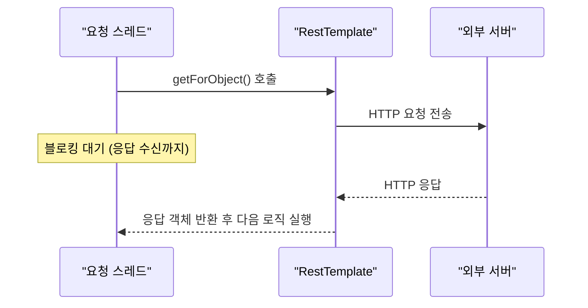
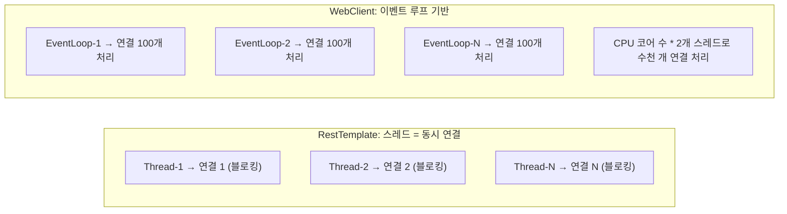
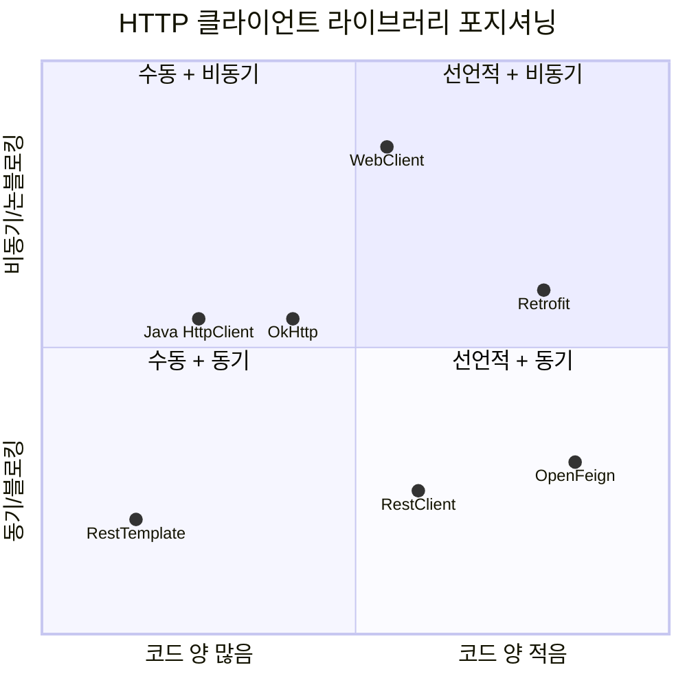
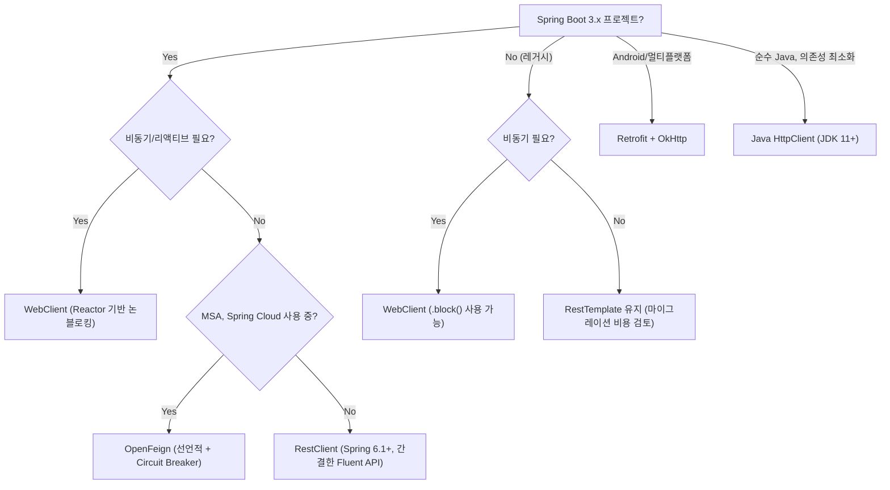

> **비유로 먼저 이해하기**: HTTP 클라이언트 라이브러리를 택배사에 비유하면, RestTemplate은 직접 전화해서 배차하는 방식, WebClient는 배차 앱에 요청 올려두고 다른 일 하는 방식, OpenFeign/Retrofit은 계약서(인터페이스) 한 장 쓰면 나머지는 자동 처리되는 방식이다. 어떤 택배사가 최고인가는 없다. 배송 규모와 요구사항에 따라 다르다.

Java/Spring 생태계에는 HTTP 클라이언트 라이브러리가 매우 다양하다. RestTemplate, WebClient, RestClient, OpenFeign, Retrofit, Java HttpClient, OkHttp까지 선택지가 많아 어떤 것을 써야 할지 혼란스러울 수 있다. 이 글에서는 각 라이브러리의 동작 원리, 장단점, 실무 코드 예제까지 깊이 있게 비교한다.

---

## 1. RestTemplate

> **비유:** RestTemplate은 은행 창구와 같다. 번호표를 뽑고 내 차례가 올 때까지 줄을 서서 기다린다. 창구 직원(스레드)이 한 고객의 업무를 끝내야 다음 고객을 처리한다. 동시에 100명이 오면 창구 100개가 필요하다.

### 동작 원리 — 동기/블로킹

`RestTemplate`은 Spring Framework 3.0에서 도입된 동기(synchronous) HTTP 클라이언트다. 호출 스레드가 HTTP 응답이 올 때까지 블로킹된다. 내부적으로 `ClientHttpRequestFactory`를 통해 실제 HTTP 연결을 생성하며, 기본 구현은 `SimpleClientHttpRequestFactory`(JDK HttpURLConnection)이고 Apache HttpClient나 OkHttp로 교체 가능하다.



블로킹 방식이므로 동시 요청 수만큼 스레드가 필요하다. 스레드 1개당 연결 1개를 처리한다. 동시 요청이 많아지면 스레드 수가 늘어 메모리와 컨텍스트 스위칭 비용이 증가한다.

### 기본 사용법

RestTemplate의 API는 HTTP 메서드별로 메서드가 분리되어 있다. `getForObject`, `postForObject`, `exchange` 등 다양한 메서드를 제공한다. 제네릭 타입(List 등)을 반환할 때는 `ParameterizedTypeReference`를 사용해야 타입 안전성이 보장된다.

```java
@Configuration
public class RestTemplateConfig {
    @Bean
    public RestTemplate restTemplate(RestTemplateBuilder builder) {
        return builder
            .connectTimeout(Duration.ofSeconds(5))
            .readTimeout(Duration.ofSeconds(10))
            .build();
    }
}

@Service
public class UserService {
    private final RestTemplate restTemplate;
    private static final String BASE_URL = "https://api.example.com";

    // GET — 단일 객체 반환
    public User getUser(Long id) {
        return restTemplate.getForObject(BASE_URL + "/users/{id}", User.class, id);
    }

    // GET — 헤더/상태코드 포함
    public ResponseEntity<User> getUserWithResponse(Long id) {
        return restTemplate.getForEntity(BASE_URL + "/users/{id}", User.class, id);
    }

    // POST
    public User createUser(UserRequest request) {
        return restTemplate.postForObject(BASE_URL + "/users", request, User.class);
    }

    // exchange — 메서드/헤더/바디 완전 제어
    public List<User> searchUsers(String keyword) {
        HttpHeaders headers = new HttpHeaders();
        headers.set("Authorization", "Bearer " + getToken());
        HttpEntity<Void> entity = new HttpEntity<>(headers);

        ResponseEntity<List<User>> response = restTemplate.exchange(
            BASE_URL + "/users/search?keyword=" + keyword,
            HttpMethod.GET,
            entity,
            new ParameterizedTypeReference<List<User>>() {}
        );
        return response.getBody();
    }
}
```

**핵심**: `exchange()` 메서드는 가장 범용적이지만 장황하다. 헤더, HTTP 메서드, 바디, 응답 타입을 모두 명시해야 한다. 이 장황함이 Spring 6.1에서 RestClient가 도입된 주요 이유다.

### 설정 — 커넥션 풀, 인터셉터, 에러 핸들러

기본 `SimpleClientHttpRequestFactory`는 커넥션 풀을 지원하지 않는다. 운영 환경에서는 반드시 Apache HttpClient나 OkHttp 기반으로 교체하여 커넥션 풀을 설정해야 한다.

```java
@Bean
public RestTemplate restTemplate() {
    // Apache HttpClient 기반 커넥션 풀
    PoolingHttpClientConnectionManager connectionManager =
        new PoolingHttpClientConnectionManager();
    connectionManager.setMaxTotal(200);          // 전체 최대 커넥션
    connectionManager.setDefaultMaxPerRoute(50); // 호스트당 최대 커넥션

    CloseableHttpClient httpClient = HttpClients.custom()
        .setConnectionManager(connectionManager)
        .setDefaultRequestConfig(RequestConfig.custom()
            .setConnectTimeout(Timeout.ofSeconds(5))
            .setResponseTimeout(Timeout.ofSeconds(10))
            .setConnectionRequestTimeout(Timeout.ofSeconds(2)) // 풀에서 획득 타임아웃
            .build())
        .build();

    RestTemplate restTemplate = new RestTemplate(
        new HttpComponentsClientHttpRequestFactory(httpClient));

    // 로깅 인터셉터 추가
    restTemplate.setInterceptors(List.of(new LoggingInterceptor()));

    // 커스텀 에러 핸들러
    restTemplate.setErrorHandler(new CustomErrorHandler());
    return restTemplate;
}

// 커스텀 에러 핸들러: 4xx/5xx를 비즈니스 예외로 변환
public class CustomErrorHandler extends DefaultResponseErrorHandler {
    @Override
    public void handleError(ClientHttpResponse response) throws IOException {
        HttpStatusCode statusCode = response.getStatusCode();
        if (statusCode.is4xxClientError()) {
            throw new ClientException("클라이언트 오류: " + statusCode);
        } else if (statusCode.is5xxServerError()) {
            throw new ServerException("서버 오류: " + statusCode);
        }
        super.handleError(response);
    }
}
```

**핵심**: `setConnectionRequestTimeout`은 풀에서 커넥션을 기다리는 시간이다. 이 값이 없으면 커넥션 풀이 고갈됐을 때 스레드가 무한 대기할 수 있다. 반드시 설정해야 한다.

### 왜 Deprecated 방향인가?

Spring 공식 문서는 Spring Framework 6.1부터 `RestTemplate`을 유지보수 모드로 전환하고 `RestClient` 또는 `WebClient` 사용을 권장한다. 블로킹 I/O로 인해 동시 요청이 많으면 스레드 수가 늘어 메모리/컨텍스트 스위칭 비용이 증가하고, `exchange()` 등 API 설계가 장황하며 WebFlux와의 부조화 문제가 있다.

---

## 2. WebClient (Spring WebFlux)

> **비유:** WebClient는 카페 키오스크와 같다. 주문을 넣으면 진동벨을 받고 자리에 앉아 다른 일을 한다. 주문이 완성되면 벨이 울려 받으러 간다. 키오스크 1대(이벤트 루프 스레드 1개)가 수십 명의 주문을 동시에 접수할 수 있다.

### 비동기/논블로킹 동작 원리

`WebClient`는 Spring WebFlux에서 제공하는 논블로킹(non-blocking) HTTP 클라이언트다. 요청 스레드가 응답을 기다리지 않고 다른 작업을 계속 처리한다. Reactor의 `Mono`/`Flux`를 반환하여 리액티브 파이프라인으로 처리할 수 있다.



**핵심**: Reactor Netty 이벤트 루프는 CPU 코어 수 × 2개의 스레드만으로 수천 개의 동시 연결을 처리한다. 이 모델이 동시 처리량이 높은 환경에서 RestTemplate보다 훨씬 효율적인 이유다.

### Mono/Flux 사용법

WebClient는 빌더 패턴으로 구성하고, 요청마다 메서드 체이닝으로 표현한다. `retrieve()`는 응답 바디만 처리하고, `exchangeToMono()`는 응답 전체(헤더 포함)를 처리할 때 사용한다.

```java
@Bean
public WebClient webClient() {
    HttpClient httpClient = HttpClient.create()
        .option(ChannelOption.CONNECT_TIMEOUT_MILLIS, 5000)
        .responseTimeout(Duration.ofSeconds(10));

    return WebClient.builder()
        .baseUrl("https://api.example.com")
        .clientConnector(new ReactorClientHttpConnector(httpClient))
        .defaultHeader(HttpHeaders.CONTENT_TYPE, MediaType.APPLICATION_JSON_VALUE)
        .codecs(c -> c.defaultCodecs().maxInMemorySize(2 * 1024 * 1024)) // 2MB
        .filter(logRequest())
        .build();
}

@Service
public class UserWebClientService {
    private final WebClient webClient;

    // GET — 단일 객체 (Mono)
    public Mono<User> getUser(Long id) {
        return webClient.get()
            .uri("/users/{id}", id)
            .retrieve()
            .onStatus(HttpStatusCode::is4xxClientError,
                response -> Mono.error(new ClientException("4xx 오류")))
            .onStatus(HttpStatusCode::is5xxServerError,
                response -> Mono.error(new ServerException("5xx 오류")))
            .bodyToMono(User.class);
    }

    // GET — 목록 (Flux: 스트리밍 처리 가능)
    public Flux<User> getAllUsers() {
        return webClient.get()
            .uri("/users")
            .retrieve()
            .bodyToFlux(User.class);
    }

    // 에러 처리 + 타임아웃 + 재시도
    public Mono<User> getUserSafe(Long id) {
        return webClient.get()
            .uri("/users/{id}", id)
            .retrieve()
            .bodyToMono(User.class)
            .timeout(Duration.ofSeconds(3))                      // 개별 요청 타임아웃
            .retry(2)                                             // 실패 시 2회 재시도
            .onErrorReturn(TimeoutException.class, User.defaultUser()) // 타임아웃 시 기본값
            .onErrorResume(WebClientResponseException.NotFound.class,
                e -> Mono.empty());                               // 404 시 빈 Mono
    }

    // 병렬 요청 — Mono.zip으로 3개 동시 호출 후 합산
    public Mono<UserProfile> getUserProfile(Long userId) {
        Mono<User> userMono = getUser(userId);
        Mono<List<Order>> ordersMono = getOrders(userId).collectList();
        Mono<Address> addressMono = getAddress(userId);

        return Mono.zip(userMono, ordersMono, addressMono)
            .map(tuple -> UserProfile.of(tuple.getT1(), tuple.getT2(), tuple.getT3()));
    }
}
```

**핵심**: `Mono.zip`은 세 요청을 동시에 실행하고 모두 완료되면 결과를 합산한다. RestTemplate으로 같은 작업을 하면 세 요청이 순차적으로 실행되어 3배의 시간이 걸린다.

### 동기 모드로 사용 (.block())

WebFlux를 사용하지 않는 Spring MVC 환경에서도 WebClient를 동기적으로 사용할 수 있다. 단, 리액티브 파이프라인 내에서 `.block()` 호출은 데드락을 유발할 수 있으므로 서블릿 스레드(컨트롤러)에서만 사용해야 한다.

```java
// Spring MVC 컨트롤러에서 동기 사용
User user = webClient.get()
    .uri("/users/{id}", 1L)
    .retrieve()
    .bodyToMono(User.class)
    .block(Duration.ofSeconds(5)); // 최대 5초 대기
```

---

## 3. RestClient (Spring 6.1+)

> **비유:** RestClient는 RestTemplate의 리모델링 버전이다. 같은 은행 창구(동기/블로킹)이지만, 서류 양식이 한 장짜리로 간소화됐다. RestTemplate이 5장짜리 서류를 작성하게 했다면, RestClient는 같은 내용을 1장에 담는다. 창구 뒤 시스템(커넥션 풀)은 그대로 재사용할 수 있다.

### 새로운 동기 HTTP 클라이언트

`RestClient`는 Spring Framework 6.1(Spring Boot 3.2)에서 도입된 **RestTemplate의 후계자**다. RestTemplate과 동일하게 동기/블로킹으로 동작하지만, WebClient에서 영감을 받은 Fluent API로 코드가 훨씬 간결하다.

RestTemplate과 RestClient의 API 차이는 극명하다. RestTemplate의 `exchange()` 호출이 5줄 이상 필요한 반면, RestClient는 메서드 체이닝으로 2~3줄로 처리된다.

```java
// RestTemplate — 장황한 API
ResponseEntity<List<User>> response = restTemplate.exchange(
    "/users", HttpMethod.GET,
    new HttpEntity<>(headers),
    new ParameterizedTypeReference<List<User>>() {}
);
List<User> users = response.getBody();

// RestClient — 간결한 Fluent API
List<User> users = restClient.get()
    .uri("/users")
    .headers(h -> h.addAll(headers))
    .retrieve()
    .body(new ParameterizedTypeReference<List<User>>() {});
```

### Fluent API 사용법

RestClient는 빌더로 기본 설정을 구성하고, 각 요청을 메서드 체이닝으로 표현한다. 기존 RestTemplate 빈을 재사용하여 마이그레이션할 수도 있다.

```java
@Bean
public RestClient restClient() {
    return RestClient.builder()
        .baseUrl("https://api.example.com")
        .defaultHeader(HttpHeaders.CONTENT_TYPE, MediaType.APPLICATION_JSON_VALUE)
        .defaultStatusHandler(HttpStatusCode::is4xxClientError,
            (req, res) -> { throw new ClientException("4xx: " + res.getStatusCode()); })
        .defaultStatusHandler(HttpStatusCode::is5xxServerError,
            (req, res) -> { throw new ServerException("5xx: " + res.getStatusCode()); })
        .requestInterceptor((req, body, execution) -> {
            req.getHeaders().add("X-Request-Id", UUID.randomUUID().toString());
            return execution.execute(req, body);
        })
        .build();
}

@Service
public class UserRestClientService {
    private final RestClient restClient;

    // GET — 단일 객체
    public User getUser(Long id) {
        return restClient.get()
            .uri("/users/{id}", id)
            .retrieve()
            .body(User.class);
    }

    // GET — 제네릭 타입
    public List<User> getAllUsers() {
        return restClient.get()
            .uri("/users")
            .retrieve()
            .body(new ParameterizedTypeReference<List<User>>() {});
    }

    // GET — 헤더/상태코드 포함
    public ResponseEntity<User> getUserWithMeta(Long id) {
        return restClient.get()
            .uri("/users/{id}", id)
            .retrieve()
            .toEntity(User.class);
    }

    // POST
    public User createUser(UserRequest request) {
        return restClient.post()
            .uri("/users")
            .body(request)
            .retrieve()
            .body(User.class);
    }

    // 쿼리 파라미터 빌더 활용
    public List<User> searchUsers(String name, int page, int size) {
        return restClient.get()
            .uri(uriBuilder -> uriBuilder
                .path("/users/search")
                .queryParam("name", name)
                .queryParam("page", page)
                .queryParam("size", size)
                .build())
            .retrieve()
            .body(new ParameterizedTypeReference<List<User>>() {});
    }
}
```

**핵심**: `RestClient.create(restTemplate)`으로 기존 RestTemplate의 커넥션 풀, 인터셉터, 타임아웃 설정을 그대로 재사용하면서 API만 RestClient로 전환할 수 있다. 점진적 마이그레이션에 이상적이다.

```java
// RestTemplate 설정 재사용하여 RestClient 생성
@Bean
public RestClient restClientFromRestTemplate(RestTemplate restTemplate) {
    return RestClient.create(restTemplate);
}
```

---

## 4. OpenFeign (Spring Cloud)

> **비유:** OpenFeign은 대행사 계약과 같다. 택배를 보낼 때마다 직접 포장하고 접수하는 대신, "이 주소로 이 물건 보내줘"라는 계약서(인터페이스)만 작성하면 대행사가 알아서 포장·접수·추적·재발송까지 처리한다. MSA 환경에서는 이 대행사가 Circuit Breaker까지 겸비한 종합 물류 파트너가 된다.

### 선언적 HTTP 클라이언트

OpenFeign은 인터페이스 선언만으로 HTTP 클라이언트를 구현하는 **선언적(Declarative) HTTP 클라이언트**다. 실제 HTTP 호출 코드를 직접 작성하지 않는다. Spring MVC 어노테이션(`@GetMapping`, `@PostMapping` 등)을 그대로 사용할 수 있어 컨트롤러 코드와 일관성이 유지된다.

MSA 환경에서 서비스 간 호출이 많을 때 가장 적합하다. Feign 인터페이스가 해당 서비스의 API 계약(contract)을 명시적으로 표현하므로, 코드 리뷰와 유지보수가 쉽다.

```java
// 인터페이스 선언만으로 HTTP 클라이언트 완성
@FeignClient(
    name = "user-service",
    url = "${services.user-service.url}",
    fallback = UserServiceFallback.class,       // Circuit Breaker fallback
    configuration = FeignClientConfig.class      // 커스텀 설정
)
public interface UserServiceClient {

    @GetMapping("/users/{id}")
    User getUser(@PathVariable Long id);

    @GetMapping("/users")
    List<User> getAllUsers(
        @RequestParam String name,
        @RequestParam int page,
        @RequestParam int size
    );

    @PostMapping("/users")
    User createUser(@RequestBody UserRequest request);

    // 헤더 전달
    @GetMapping("/users/me")
    User getCurrentUser(@RequestHeader("Authorization") String token);
}

// 서비스에서 일반 Spring 빈처럼 사용 — HTTP 호출 코드 없음
@Service
public class OrderService {
    private final UserServiceClient userServiceClient;

    public Order createOrder(Long userId, OrderRequest request) {
        User user = userServiceClient.getUser(userId); // HTTP 호출 자동 처리
        // ...
    }
}
```

**핵심**: OpenFeign의 진정한 가치는 코드 간결함뿐 아니라 Circuit Breaker, 로드밸런싱, Retry를 Spring Cloud 생태계와 자연스럽게 통합한다는 점이다. 서비스 간 호출 안정성이 중요한 MSA 환경에서 이 통합 효과가 가장 크다.

### Feign 설정 커스터마이즈

```java
@Configuration
public class FeignClientConfig {

    @Bean
    public Request.Options options() {
        return new Request.Options(5, TimeUnit.SECONDS, 10, TimeUnit.SECONDS, true);
    }

    @Bean
    public Retryer retryer() {
        return new Retryer.Default(100, 1000, 3); // 초기대기, 최대대기, 횟수
    }

    @Bean
    public Logger.Level feignLoggerLevel() {
        return Logger.Level.FULL; // NONE, BASIC, HEADERS, FULL
    }

    // 모든 요청에 Authorization 헤더 자동 추가
    @Bean
    public RequestInterceptor requestInterceptor() {
        return requestTemplate -> {
            String token = SecurityContextHolder.getContext()
                .getAuthentication().getCredentials().toString();
            requestTemplate.header("Authorization", "Bearer " + token);
        };
    }

    // 에러 디코더: HTTP 상태코드를 비즈니스 예외로 변환
    @Bean
    public ErrorDecoder errorDecoder() {
        return (methodKey, response) -> {
            if (response.status() == 404) return new NotFoundException("리소스 없음");
            if (response.status() >= 500) return new ServiceException("서비스 오류");
            return new Default().decode(methodKey, response);
        };
    }
}
```

### Circuit Breaker 연동 (Resilience4j)

Circuit Breaker는 외부 서비스 장애 시 폭포식 장애(Cascading Failure)를 방지한다. 일정 비율 이상 실패가 감지되면 Circuit이 열려 즉시 Fallback을 반환하고, 일정 시간 후 Half-Open 상태로 전환하여 실제 복구 여부를 확인한다.

```yaml
resilience4j:
  circuitbreaker:
    instances:
      user-service:
        slidingWindowSize: 10
        failureRateThreshold: 50     # 50% 이상 실패 시 Circuit Open
        waitDurationInOpenState: 30s  # 30초 후 Half-Open으로 전환
```

```java
@Component
public class UserServiceFallback implements UserServiceClient {
    @Override
    public User getUser(Long id) {
        return User.defaultUser(id); // Circuit Open 시 기본값 반환
    }

    @Override
    public List<User> getAllUsers(String name, int page, int size) {
        return Collections.emptyList();
    }
}
```

---

## 5. Retrofit

> **비유:** Retrofit은 프랜차이즈 가맹점 매뉴얼과 같다. 본사(Square)가 제공하는 표준 양식(인터페이션 어노테이션)에 맞춰 메뉴판(API 인터페이스)만 작성하면, 주방 설비(OkHttp)가 자동으로 요리를 처리한다. Android 매장이든 서버 매장이든 같은 매뉴얼로 운영할 수 있어 멀티플랫폼에 강하다.

### Square 라이브러리

Retrofit은 Square가 개발한 인터페이스 기반 HTTP 클라이언트다. Android와 서버 양쪽에서 모두 사용 가능하며, OkHttp를 기반으로 한다. OpenFeign과 유사하게 인터페이스 선언 방식을 사용하지만, Spring MVC 어노테이션 대신 Retrofit 전용 어노테이션(`@GET`, `@POST`, `@Path` 등)을 사용한다.

Kotlin Coroutines를 지원하므로 Kotlin 기반 프로젝트에서 특히 강력하다.

```java
// API 인터페이스 정의
public interface UserApi {
    @GET("users/{id}")
    Call<User> getUser(@Path("id") Long id);

    @GET("users")
    Call<List<User>> getUsers(@Query("name") String name, @Query("page") int page);

    @POST("users")
    Call<User> createUser(@Body UserRequest request);

    @Headers("Accept: application/json")
    @GET("users/profile")
    Call<User> getProfile(@Header("Authorization") String token);
}

// Retrofit 인스턴스 생성
@Bean
public UserApi userApi() {
    OkHttpClient okHttpClient = new OkHttpClient.Builder()
        .connectTimeout(5, TimeUnit.SECONDS)
        .readTimeout(10, TimeUnit.SECONDS)
        .addInterceptor(new HttpLoggingInterceptor().setLevel(Level.BODY))
        .build();

    return new Retrofit.Builder()
        .baseUrl("https://api.example.com/")
        .client(okHttpClient)
        .addConverterFactory(JacksonConverterFactory.create())
        .build()
        .create(UserApi.class);
}

// 사용 예
@Service
public class UserRetrofitService {
    private final UserApi userApi;

    // 동기 호출
    public User getUser(Long id) throws IOException {
        Response<User> response = userApi.getUser(id).execute();
        if (response.isSuccessful()) return response.body();
        throw new ApiException("API 오류: " + response.code());
    }

    // 비동기 콜백
    public void getUserAsync(Long id, Consumer<User> onSuccess, Consumer<Throwable> onError) {
        userApi.getUser(id).enqueue(new Callback<User>() {
            @Override
            public void onResponse(Call<User> call, Response<User> response) {
                if (response.isSuccessful()) onSuccess.accept(response.body());
                else onError.accept(new ApiException("오류: " + response.code()));
            }

            @Override
            public void onFailure(Call<User> call, Throwable t) {
                onError.accept(t);
            }
        });
    }
}
```

| 항목 | Retrofit | OpenFeign |
|---|---|---|
| 주요 환경 | Android + 서버 | Spring Cloud 서버 |
| Spring 통합 | 직접 구성 필요 | @EnableFeignClients로 통합 |
| 비동기 | RxJava/Coroutines | 기본 동기 |
| Circuit Breaker | 직접 연동 필요 | Spring Cloud 통합 용이 |
| 어노테이션 | Retrofit 전용 | Spring MVC 호환 |

---

## 6. Java HttpClient (Java 11+)

> **비유:** Java HttpClient는 자가용과 같다. 택시(Spring 라이브러리)를 부르지 않아도 직접 운전해서 어디든 갈 수 있다. 연료(JDK)만 있으면 추가 비용(외부 의존성)이 없다. 다만 네비게이션(JSON 파싱), 자동 주차(Spring 통합) 같은 편의 기능은 직접 설치해야 한다.

### JDK 내장 — 외부 의존성 없음

Java 11에서 도입된 `java.net.http.HttpClient`는 JDK 내장 HTTP 클라이언트다. 외부 라이브러리 없이 HTTP/1.1, HTTP/2, WebSocket을 지원한다. 의존성 최소화가 중요한 경우나 순수 Java 프로젝트에 적합하다.

동기(`send`)와 비동기(`sendAsync`) 두 방식을 모두 지원한다. 비동기는 `CompletableFuture`를 반환하므로 병렬 요청 처리도 가능하다.

```java
HttpClient client = HttpClient.newBuilder()
    .version(HttpClient.Version.HTTP_2)         // HTTP/2 우선
    .connectTimeout(Duration.ofSeconds(5))
    .followRedirects(HttpClient.Redirect.NORMAL)
    .executor(Executors.newFixedThreadPool(10))  // 비동기 스레드 풀
    .build();

// 동기 GET
public User getUser(Long id) throws Exception {
    HttpRequest request = HttpRequest.newBuilder()
        .GET()
        .uri(URI.create(BASE_URL + "/users/" + id))
        .header("Accept", "application/json")
        .timeout(Duration.ofSeconds(10))
        .build();

    HttpResponse<String> response = client.send(
        request, HttpResponse.BodyHandlers.ofString());

    if (response.statusCode() == 200) {
        return objectMapper.readValue(response.body(), User.class);
    }
    throw new ApiException("오류: " + response.statusCode());
}

// 비동기 GET — CompletableFuture 반환
public CompletableFuture<User> getUserAsync(Long id) {
    HttpRequest request = HttpRequest.newBuilder()
        .GET()
        .uri(URI.create(BASE_URL + "/users/" + id))
        .build();

    return client.sendAsync(request, HttpResponse.BodyHandlers.ofString())
        .thenApply(response -> {
            if (response.statusCode() != 200)
                throw new RuntimeException("오류: " + response.statusCode());
            try {
                return objectMapper.readValue(response.body(), User.class);
            } catch (JsonProcessingException e) {
                throw new RuntimeException("JSON 파싱 오류", e);
            }
        });
}

// 병렬 요청 — 여러 사용자 동시 조회
public List<User> getUsersParallel(List<Long> userIds) {
    List<CompletableFuture<User>> futures = userIds.stream()
        .map(this::getUserAsync)
        .toList();

    return futures.stream()
        .map(CompletableFuture::join)
        .toList();
}
```

**핵심**: Java HttpClient의 최대 장점은 외부 의존성이 없다는 것이다. 단점은 JSON 직렬화/역직렬화를 직접 처리해야 하고, Spring 통합(자동 설정, Security 연동 등)이 없어 보일러플레이트 코드가 많아진다.

---

## 7. OkHttp

> **비유:** OkHttp는 만능 공구 세트와 같다. 드라이버(커넥션 풀), 렌치(인터셉터 체인), 테이프(응답 캐시)가 기본 포함되어 있고, 필요한 공구만 골라 쓸 수 있다. Retrofit이라는 자동화 로봇의 내부 엔진이기도 하지만, 공구 세트만 단독으로 써도 충분히 강력하다.

### 커넥션 풀, 인터셉터, 캐시

OkHttp는 Square가 개발한 효율적인 HTTP 클라이언트다. Retrofit의 기반이기도 하며, 자체적으로 사용해도 강력하다. 커넥션 풀 기본 지원, 인터셉터 체인, 응답 캐싱이 특징이다.

```java
OkHttpClient client = new OkHttpClient.Builder()
    .connectTimeout(5, TimeUnit.SECONDS)
    .readTimeout(10, TimeUnit.SECONDS)
    .connectionPool(new ConnectionPool(20, 5, TimeUnit.MINUTES)) // 커넥션 풀
    .cache(new Cache(new File("cache"), 10 * 1024 * 1024))       // 10MB 캐시

    // 애플리케이션 인터셉터: 모든 요청에 인증 헤더 추가
    .addInterceptor(chain -> {
        Request request = chain.request().newBuilder()
            .header("Authorization", "Bearer " + getToken())
            .build();
        return chain.proceed(request);
    })

    // 네트워크 인터셉터: 캐시 제어 헤더 수정
    .addNetworkInterceptor(chain -> {
        Response response = chain.proceed(chain.request());
        return response.newBuilder()
            .header("Cache-Control", "max-age=60")
            .build();
    })
    .retryOnConnectionFailure(true)
    .build();

// 동기 GET
public User getUser(Long id) throws IOException {
    Request request = new Request.Builder()
        .url("https://api.example.com/users/" + id)
        .get()
        .build();

    try (Response response = client.newCall(request).execute()) {
        if (!response.isSuccessful()) throw new ApiException("오류: " + response.code());
        return objectMapper.readValue(response.body().string(), User.class);
    }
}
```

OkHttp는 Retrofit과 함께 사용할 때 가장 자연스럽다. Retrofit이 OkHttp를 내부 HTTP 엔진으로 사용하므로, OkHttp 설정을 Retrofit에 그대로 전달할 수 있다.

---

## 8. 종합 비교

### 7개 라이브러리 포지셔닝 맵



### 기본 특성 비교

| 라이브러리 | 동기/비동기 | Spring 통합 | 외부 의존성 | 선언적 API | HTTP/2 |
|---|---|---|---|---|---|
| RestTemplate | 동기 | Spring MVC 내장 | 없음 | X | 제한적 |
| WebClient | 비동기 (동기 가능) | Spring WebFlux 내장 | Reactor Netty | X | O |
| RestClient | 동기 | Spring 6.1+ 내장 | 없음 | X | 제한적 |
| OpenFeign | 동기 | Spring Cloud | Spring Cloud | O | X |
| Retrofit | 동기/비동기 | 수동 설정 | OkHttp | O | O |
| Java HttpClient | 동기/비동기 | 없음 | 없음 (JDK) | X | O |
| OkHttp | 동기/비동기 | 없음 | 없음 | X | O |

### 성능 및 편의성 비교

| 라이브러리 | 처리량 | 코드 양 | 학습 곡선 | 테스트 용이성 |
|---|---|---|---|---|
| RestTemplate | 보통 | 많음 | 낮음 | 보통 |
| WebClient | 높음 | 중간 | 높음 | 보통 |
| RestClient | 보통 | 적음 | 낮음 | 높음 |
| OpenFeign | 보통 | 매우 적음 | 낮음 | 높음 |
| Retrofit | 보통~높음 | 매우 적음 | 낮음 | 높음 |
| Java HttpClient | 보통~높음 | 많음 | 중간 | 낮음 |
| OkHttp | 높음 | 중간 | 중간 | 중간 |

---

## 9. 실무 선택 가이드

### 의사결정 플로우



### 시나리오별 추천 코드

**시나리오 1: Spring Boot 3.x MVC, 단순 외부 API 호출**

```java
// 추천: RestClient
// 이유: Spring 내장, 간결한 Fluent API, 동기 방식으로 충분
@Bean
public RestClient restClient() {
    return RestClient.builder()
        .baseUrl("https://external-api.com")
        .build();
}
```

**시나리오 2: MSA 환경, 서비스 간 동기 호출**

```java
// 추천: OpenFeign
// 이유: 선언적 API, Circuit Breaker 통합, 로드밸런싱 용이
@FeignClient(name = "inventory-service", fallback = InventoryFallback.class)
public interface InventoryClient {
    @GetMapping("/inventory/{productId}")
    Inventory checkInventory(@PathVariable Long productId);
}
```

**시나리오 3: 고트래픽 비동기 처리, WebFlux 스택**

```java
// 추천: WebClient
// 이유: 논블로킹 I/O, Reactor 파이프라인 통합
webClient.get()
    .uri("/products")
    .retrieve()
    .bodyToFlux(Product.class)
    .flatMap(product -> processAsync(product))
    .subscribe();
```

**시나리오 4: 외부 라이브러리 최소화**

```java
// 추천: Java HttpClient (JDK 11+)
HttpClient.newBuilder().version(HttpClient.Version.HTTP_2).build();
```

---

<details class="extreme-scenario-details">
<summary class="extreme-scenario-summary">
<span class="extreme-scenario-icon">🔥</span>
<span class="extreme-scenario-label">극한 시나리오 — 클릭하여 펼치기</span>
<span class="extreme-scenario-toggle"></span>
</summary>
<div class="extreme-scenario-body">

<div class="extreme-scenario-content" markdown="1">

### 시나리오 1: 동시 1,000 요청에서 RestTemplate 스레드 고갈

초당 1,000개의 외부 API 호출이 발생하는 상황에서 RestTemplate을 사용하면 스레드 풀이 금세 고갈된다. 각 요청이 스레드 1개를 블로킹하며 외부 API 응답이 500ms라면, 동시에 500개 이상의 스레드가 필요하다.

WebClient로 전환하면 이벤트 루프 스레드 수개가 수천 개의 동시 연결을 처리한다. 단, Spring MVC 서블릿 스택에서 WebClient를 사용할 때는 `.block()` 호출로 다시 블로킹이 발생하므로, 완전한 이점을 얻으려면 Spring WebFlux로 전환해야 한다.

### 시나리오 2: OpenFeign Circuit Breaker 오탐으로 정상 서비스 차단

Resilience4j의 `slidingWindowSize=10`, `failureRateThreshold=50`으로 설정 시, 10개 요청 중 5개가 실패하면 Circuit이 열린다. 네트워크 일시적 지연으로 타임아웃이 5번 발생하면 정상 서비스도 30초간 차단된다.

`minimumNumberOfCalls`를 충분히 크게(20~50) 설정하고, `permittedNumberOfCallsInHalfOpenState`로 Half-Open 상태에서 실제 복구를 천천히 확인하는 것이 중요하다. 너무 민감한 설정은 오히려 가용성을 해친다.

### 시나리오 3: RestClient 타임아웃 미설정으로 스레드 영구 대기

`RestClient.builder().baseUrl(url).build()`처럼 타임아웃 없이 생성하면, 외부 서비스가 응답하지 않을 때 스레드가 영구적으로 대기한다. 이 스레드들이 쌓이면 전체 서버가 응답 불가 상태가 된다.

반드시 `connectTimeout`과 `readTimeout`을 설정하고, 커넥션 풀에서의 획득 대기 시간(`connectionRequestTimeout`)도 설정해야 한다.

---
</div>
</div>
</details>

## 실무에서 자주 하는 실수

### 실수 1: RestTemplate에 커넥션 풀 미설정

기본 `SimpleClientHttpRequestFactory`는 커넥션 풀이 없어 매 요청마다 새 TCP 연결을 생성한다. TCP 핸드셰이크 비용이 누적되어 성능이 저하된다. 운영 환경에서는 반드시 Apache HttpClient 또는 OkHttp로 교체하고 `setMaxTotal`, `setDefaultMaxPerRoute`를 설정해야 한다.

### 실수 2: Spring MVC에서 WebFlux 리액티브 파이프라인 안에서 .block() 호출

리액티브 파이프라인(Mono/Flux 체인) 내에서 `.block()`을 호출하면 Netty 이벤트 루프 스레드가 블로킹되어 데드락이 발생한다. WebFlux를 사용하기로 결정했다면 파이프라인 전체를 리액티브로 유지해야 한다.

### 실수 3: OpenFeign @FeignClient URL을 하드코딩

`url = "https://api.example.com"` 처럼 하드코딩하면 환경별 설정이 불가능하다. `url = "${services.user-service.url}"` 처럼 환경 변수를 참조해야 하며, Eureka/Consul 같은 서비스 디스커버리를 사용하면 url 없이 name만으로 동적 라우팅이 가능하다.

### 실수 4: RestClient/RestTemplate 응답 스트림을 닫지 않음

`ResponseEntity`를 받아 바디만 추출하는 경우 응답 스트림이 자동으로 닫힌다. 그러나 `ClientHttpResponse`를 직접 다루거나 스트리밍 응답을 처리할 때는 반드시 `response.close()`를 호출해야 커넥션이 풀로 반환된다.

### 실수 5: OpenFeign 재시도 설정이 멱등하지 않은 API에 적용

`Retryer.Default(100, 1000, 3)` 설정은 POST, PUT, DELETE 같은 비멱등 API에도 적용된다. 주문 생성 API가 3번 재시도되면 주문이 3개 생성될 수 있다. 재시도는 GET 같은 멱등 API에만 적용하거나, 멱등성을 보장하는 `X-Idempotency-Key` 헤더를 함께 사용해야 한다.

---

## 정리

| 라이브러리 | 추천 상황 | 비추천 상황 |
|---|---|---|
| **RestClient** | Spring Boot 3.x 신규, 동기 API 호출 | 비동기, Spring 6.1 미만 |
| **WebClient** | 비동기/리액티브, 고동시성 | 단순 동기 호출 (.block() 남용) |
| **OpenFeign** | MSA 서비스 간 호출, Spring Cloud | 단독 사용, 비동기 필요 |
| **RestTemplate** | 레거시 유지보수 | 신규 개발 |
| **Retrofit** | Android/멀티플랫폼, Kotlin Coroutines | Spring 전용 서버 |
| **Java HttpClient** | 의존성 최소화, HTTP/2 | 복잡한 요청 구성 |
| **OkHttp** | Retrofit 하위, 커스텀 인터셉터/캐시 | Spring 통합이 필요한 경우 |

Spring Boot 3.x 신규 프로젝트라면 **동기는 RestClient, 비동기는 WebClient, MSA는 OpenFeign** 조합이 가장 자연스럽다. 레거시 코드의 RestTemplate은 섣불리 마이그레이션하기보다 RestClient로의 점진적 전환을 권장한다.
