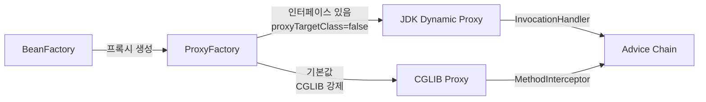
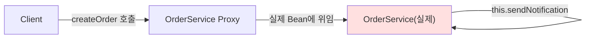

AOP를 "로깅이나 트랜잭션에 쓰는 것"으로만 알고 있다면 시니어 면접에서 멈춘다. 면접관이 진짜 묻는 것은 "프록시가 어떻게 만들어지는가", "왜 self-invocation이 뚫리는가", "CGLIB이 JDK Proxy보다 왜 느린가"다. 이 글은 AOP의 표면이 아니라 내부 작동 원리를 Java 코드 수준에서 해부한다.

---

## 1. AOP가 존재하는 이유 — WHY부터

### 횡단 관심사 문제의 본질

로그인 체크, 트랜잭션, 실행 시간 측정. 이 코드가 서비스 50개에 똑같이 붙어 있다면?

```java
// AOP 없는 세상 — 핵심 로직이 보조 로직에 묻힌다
public class OrderService {
    public Order createOrder(OrderDto dto) {
        // 보안 검사 (핵심 아님)
        if (!SecurityContext.hasPermission("ORDER_CREATE")) {
            throw new AccessDeniedException("권한 없음");
        }
        // 트랜잭션 시작 (핵심 아님)
        Transaction tx = TransactionManager.begin();
        // 실행 시간 측정 시작 (핵심 아님)
        long startTime = System.currentTimeMillis();
        // 로깅 (핵심 아님)
        log.info("[OrderService] createOrder 시작 args={}", dto);

        try {
            // ▼ 진짜 핵심 로직 — 고작 두 줄
            Order order = new Order(dto);
            orderRepository.save(order);
            // ▲ 핵심 끝

            tx.commit();
            log.info("[OrderService] createOrder 완료 {}ms",
                System.currentTimeMillis() - startTime);
            return order;
        } catch (Exception e) {
            tx.rollback();
            log.error("[OrderService] createOrder 실패", e);
            throw e;
        }
    }
}
```

핵심 로직은 2줄인데 보조 코드가 20줄이다. 이 패턴이 `UserService`, `PaymentService`, `InventoryService`에 똑같이 복붙된다.

**변경의 고통**: 로그 포맷을 바꾸려면 50개 파일을 전부 열어야 한다. 트랜잭션 전파 규칙을 바꾸려면 마찬가지다. 이것이 OOP가 해결하지 못하는 **횡단 관심사(Cross-Cutting Concerns)** 문제다.

OOP는 계층(Layer)으로 관심사를 분리한다. Service, Repository, Controller. 하지만 로깅은 모든 계층에 걸쳐 있다. 트랜잭션도 마찬가지다. 이 "세로가 아닌 가로로 자르는" 관심사를 OOP만으로는 분리할 수 없다.

> **비유**: AOP는 건물 모든 층에 공통 CCTV 시스템을 한 번에 설치하는 것이다. 각 방마다 카메라를 개별 설치(코드 복붙)하는 대신, 건물 관리 시스템(Aspect) 하나가 모든 출입문(JoinPoint)을 감시한다. 방(Service 클래스)은 자신이 감시받는지조차 모른다.

### AOP로 분리한 세계

```java
// 핵심 로직만 남긴 서비스 — 2줄이 전부
@Service
public class OrderService {
    public Order createOrder(OrderDto dto) {
        Order order = new Order(dto);
        return orderRepository.save(order);
    }
}

// 보조 기능은 Aspect 하나에 집중
@Aspect
@Component
public class LoggingAspect {
    private static final Logger log = LoggerFactory.getLogger(LoggingAspect.class);

    @Around("execution(* com.example.service.*.*(..))")
    public Object logExecutionTime(ProceedingJoinPoint joinPoint) throws Throwable {
        long start = System.currentTimeMillis();
        String method = joinPoint.getSignature().toShortString();
        log.info("[AOP] {} 시작", method);
        try {
            Object result = joinPoint.proceed();
            log.info("[AOP] {} 완료 {}ms", method, System.currentTimeMillis() - start);
            return result;
        } catch (Throwable t) {
            log.error("[AOP] {} 실패 {}ms", method, System.currentTimeMillis() - start, t);
            throw t;
        }
    }
}
```

이제 로그 포맷을 바꾸려면 `LoggingAspect` 하나만 수정한다. 50개 서비스는 전혀 건드리지 않는다.

---

## 2. AOP 핵심 용어 — 각각이 왜 존재하는가

> **비유**: AOP 용어를 영화 제작에 비유하면 기억하기 쉽다. **Aspect**는 "특수효과 팀"이다. **Advice**는 "특수효과 장면 하나"다. **Pointcut**은 "특수효과를 넣을 장면 목록"이고, **JoinPoint**는 "현재 촬영 중인 바로 그 장면"이다. **Weaving**은 "원본 필름에 특수효과를 합성하는 편집 과정"이다.

### 2-1. Aspect — 모듈화된 횡단 관심사

Aspect는 왜 존재하는가? 횡단 관심사를 하나의 클래스로 모아서 단일 책임 원칙을 지키기 위해서다. 로깅 관련 Advice와 Pointcut은 `LoggingAspect`에, 트랜잭션 관련 내용은 `TransactionAspect`에.

```java
@Aspect          // 이 클래스가 횡단 관심사 모듈임을 선언
@Component       // Spring Bean으로 등록 (없으면 AOP가 인식 못함)
public class AuditAspect {
    // Pointcut 정의 + Advice 정의 = 하나의 Aspect
    // Aspect = Advice + Pointcut 의 조합
}
```

`@Aspect`만 붙이고 `@Component`를 빠뜨리는 실수가 많다. `@Aspect`는 AspectJ 어노테이션으로 AOP 메타 정보를 표시하지만, Spring 컨테이너가 Bean으로 등록하는 것은 `@Component`가 담당한다. 둘 다 있어야 동작한다.

### 2-2. Advice — 실제로 실행될 코드

Advice는 "언제(When)" + "무엇을(What)"의 조합이다. 다섯 가지 종류가 있고, 각각의 존재 이유가 다르다.

| Advice 종류 | 어노테이션 | 실행 시점 | 존재 이유 |
|------------|-----------|---------|---------|
| Before | `@Before` | 메서드 실행 전 | 사전 검증, 파라미터 검사 |
| After Returning | `@AfterReturning` | 정상 반환 후 | 반환값 로깅, 캐시 저장 |
| After Throwing | `@AfterThrowing` | 예외 발생 후 | 예외 알림, 에러 집계 |
| After | `@After` | 정상/예외 모두 | 리소스 정리 (finally와 동일) |
| Around | `@Around` | 실행 전후 완전 제어 | 트랜잭션, 캐시, 재시도 등 |

**왜 @Around가 가장 강력한가**: 나머지 Advice는 메서드 실행을 "관찰"할 뿐이다. `@Around`는 실행 자체를 "제어"한다. `joinPoint.proceed()`를 호출하지 않으면 실제 메서드가 실행되지 않는다. 반환값을 바꿀 수도 있고, 예외를 삼킬 수도 있다. `@Transactional`이 `@Around`로 구현되는 이유가 바로 이것이다 — 메서드 실행 전후에 트랜잭션을 열고 닫아야 하기 때문이다.

```java
@Aspect
@Component
public class AllAdviceTypesExample {

    // Before: 메서드 실행 전, 반환값/예외 제어 불가
    @Before("execution(* com.example.service.*.*(..))")
    public void before(JoinPoint jp) {
        log.info("Before: {}", jp.getSignature().getName());
        // return 해도 의미 없음 — 실행 흐름 변경 불가
    }

    // AfterReturning: 정상 반환 후, returning으로 반환값 참조
    @AfterReturning(
        pointcut = "execution(* com.example.service.*.*(..))",
        returning = "result"  // 반환값을 파라미터로 바인딩
    )
    public void afterReturning(JoinPoint jp, Object result) {
        log.info("AfterReturning: {} → {}", jp.getSignature().getName(), result);
        // result를 수정해도 실제 반환값은 바뀌지 않음
        // 반환값을 바꾸려면 @Around를 써야 한다
    }

    // AfterThrowing: 예외 발생 후, throwing으로 예외 참조
    @AfterThrowing(
        pointcut = "execution(* com.example.service.*.*(..))",
        throwing = "ex"  // 예외를 파라미터로 바인딩
    )
    public void afterThrowing(JoinPoint jp, Exception ex) {
        log.error("AfterThrowing: {} 예외={}", jp.getSignature().getName(), ex.getMessage());
        // 예외를 삼키거나 교체하려면 @Around를 써야 한다
    }

    // After: 정상/예외 무관 (Java finally와 동일한 의미)
    @After("execution(* com.example.service.*.*(..))")
    public void after(JoinPoint jp) {
        log.info("After(finally): {}", jp.getSignature().getName());
    }

    // Around: 실행 흐름 완전 제어
    @Around("execution(* com.example.service.*.*(..))")
    public Object around(ProceedingJoinPoint pjp) throws Throwable {
        log.info("Around Before");
        try {
            Object result = pjp.proceed(); // 실제 메서드 실행 — 호출 안 하면 실행 안 됨
            log.info("Around AfterReturning");
            return result; // 반환값 변경 가능
        } catch (Throwable t) {
            log.error("Around AfterThrowing");
            throw t; // 예외 교체 가능
        } finally {
            log.info("Around After(finally)");
        }
    }
}
```

**하나의 메서드에 여러 Advice가 적용될 때 실행 순서**:

```
Around(before) → Before → [실제 메서드] → AfterReturning/AfterThrowing → After → Around(after)
```

`@Around`가 가장 바깥에서 감싼다. 그래서 `@Around`에서 `proceed()`를 호출하기 전에 `@Before`가 실행된다.

### 2-3. Pointcut — 어디에 적용할지 선별

Pointcut이 왜 별도 개념으로 존재하는가? Advice(무엇을 할지)와 적용 대상(어디에 할지)을 분리해서 재사용성을 높이기 위해서다. 하나의 Pointcut을 여러 Advice에서 공유할 수 있다.

```java
@Aspect
@Component
public class LayeredPointcuts {

    // Pointcut 정의 — 빈 메서드에 표현식만 붙임
    @Pointcut("execution(* com.example.service..*(..))")
    public void serviceLayer() {}   // 이름으로 참조 가능

    @Pointcut("execution(* com.example.repository..*(..))")
    public void repositoryLayer() {}

    @Pointcut("@annotation(org.springframework.transaction.annotation.Transactional)")
    public void transactionalMethods() {}

    // AND 조합: service 레이어이면서 @Transactional인 메서드
    @Pointcut("serviceLayer() && transactionalMethods()")
    public void transactionalServiceMethods() {}

    // OR 조합: service 또는 repository
    @Pointcut("serviceLayer() || repositoryLayer()")
    public void applicationLayer() {}

    // 여러 Advice에서 동일한 Pointcut 참조
    @Before("transactionalServiceMethods()")
    public void auditBefore(JoinPoint jp) { /* ... */ }

    @AfterReturning("transactionalServiceMethods()")
    public void auditAfter(JoinPoint jp) { /* ... */ }
}
```

### 2-4. JoinPoint — 현재 실행 중인 그 지점

JoinPoint는 Advice가 실행되는 순간의 "문맥 정보 캡슐"이다. 어떤 메서드가 어떤 인자로 어떤 객체에서 호출됐는지를 담는다.

**왜 Spring AOP는 메서드 실행만 JoinPoint로 지원하는가**: AspectJ는 필드 읽기/쓰기, 생성자 호출, 예외 핸들링 등 다양한 지점을 JoinPoint로 지원한다. Spring AOP는 런타임 프록시 기반이므로 프록시가 가로챌 수 있는 지점은 "메서드 호출" 뿐이다. 필드 접근은 프록시가 개입할 수 없다. 이것이 Spring AOP와 AspectJ의 근본적인 차이다.

```java
@Around("execution(* com.example.service.*.*(..))")
public Object inspectJoinPoint(ProceedingJoinPoint pjp) throws Throwable {
    // 메서드 시그니처 정보
    MethodSignature sig = (MethodSignature) pjp.getSignature();
    String methodName  = sig.getName();             // "createOrder"
    Class<?> returnType = sig.getReturnType();      // Order.class
    Class<?>[] paramTypes = sig.getParameterTypes(); // [OrderDto.class]
    String[] paramNames = sig.getParameterNames();  // ["dto"]

    // 런타임 호출 정보
    Object[] args    = pjp.getArgs();               // 실제 인자 값
    Object target    = pjp.getTarget();             // 실제 Bean (OrderServiceImpl)
    Object thisProxy = pjp.getThis();               // 프록시 객체

    // 클래스 정보
    String className = pjp.getTarget().getClass().getName();

    // 어노테이션 참조
    Transactional txAnno = sig.getMethod().getAnnotation(Transactional.class);

    log.info("호출: {}.{}({}) this={}, target={}",
        className, methodName, Arrays.toString(args),
        thisProxy.getClass().getSimpleName(),
        target.getClass().getSimpleName());

    return pjp.proceed(args); // 인자를 변경해서 proceed도 가능
}
```

### 2-5. Weaving — 어떻게, 언제 결합하는가

Weaving은 Aspect를 Target 객체에 적용하는 과정이다. "언제" 결합하느냐가 핵심이다.

| Weaving 시점 | 도구 | 동작 방식 | 장단점 |
|-------------|------|---------|-------|
| **Compile-time** | AspectJ 컴파일러 (ajc) | `.java` → `.class` 변환 시 바이트코드 직접 삽입 | 성능 최고, 빌드 도구 변경 필요 |
| **Load-time (LTW)** | AspectJ + Java Agent | ClassLoader가 `.class`를 로딩할 때 바이트코드 조작 | 런타임 유연성, JVM 옵션 필요 (-javaagent) |
| **Runtime** | Spring AOP (프록시) | Bean 생성 시 프록시 객체로 교체 | 설정 간단, 메서드 호출만 가능 |

**왜 Spring은 런타임 Weaving을 선택했는가**: AspectJ 컴파일 타임 Weaving은 `ajc`라는 별도 컴파일러가 필요하고, IDE 지원이 복잡하며, 빌드 파이프라인을 변경해야 한다. LTW는 JVM 시작 시 `-javaagent:aspectjweaver.jar` 옵션이 필요하다. Spring의 철학은 "설정보다 관례(Convention over Configuration)"다. 별도 도구 없이 `@EnableAspectJAutoProxy` 하나로 AOP를 활성화하는 런타임 프록시 방식이 Spring의 생태계 철학과 맞는다.

**런타임 Weaving의 한계**: 프록시가 가로채지 못하는 지점(필드, private 메서드, static 메서드, self-invocation)에는 Advice를 적용할 수 없다. 이 한계를 알아야 함정을 피할 수 있다.

---

## 3. 프록시 내부 메커니즘 — JDK Dynamic Proxy vs CGLIB

Spring AOP의 실체는 **프록시 패턴**이다. `OrderService`를 주입받는다고 생각하지만, 실제로 주입된 것은 AOP가 적용된 프록시 객체다. 이 프록시를 만드는 방법이 두 가지다.



### 3-1. JDK Dynamic Proxy — 인터페이스 기반

JDK Dynamic Proxy는 `java.lang.reflect.Proxy`와 `InvocationHandler`를 사용해 런타임에 인터페이스 구현체를 생성한다. Spring이 내부적으로 하는 일을 직접 구현하면 다음과 같다.

```java
// 인터페이스 필수
public interface OrderService {
    Order createOrder(OrderDto dto);
    void cancelOrder(Long orderId);
}

@Service
public class OrderServiceImpl implements OrderService {
    @Override
    public Order createOrder(OrderDto dto) {
        return orderRepository.save(new Order(dto));
    }

    @Override
    public void cancelOrder(Long orderId) {
        orderRepository.deleteById(orderId);
    }
}

// JDK Dynamic Proxy 직접 구현 — Spring이 내부에서 하는 일
public class AopProxyDemo {
    public static void main(String[] args) {
        OrderService target = new OrderServiceImpl(/* deps */);

        // InvocationHandler: 모든 메서드 호출이 이 람다로 들어온다
        InvocationHandler handler = (proxy, method, methodArgs) -> {
            System.out.println("[Before] " + method.getName());
            long start = System.currentTimeMillis();
            try {
                // 실제 메서드 실행 — reflection 기반
                Object result = method.invoke(target, methodArgs);
                System.out.println("[AfterReturning] " + method.getName()
                    + " " + (System.currentTimeMillis() - start) + "ms");
                return result;
            } catch (InvocationTargetException e) {
                System.out.println("[AfterThrowing] " + e.getCause().getMessage());
                throw e.getCause();
            }
        };

        // 런타임에 OrderService 구현체를 생성
        OrderService proxy = (OrderService) Proxy.newProxyInstance(
            OrderServiceImpl.class.getClassLoader(),  // 클래스로더
            new Class<?>[] { OrderService.class },    // 구현할 인터페이스 목록
            handler                                   // 호출 핸들러
        );

        // 이 proxy는 OrderService이지, OrderServiceImpl이 아니다
        System.out.println(proxy instanceof OrderService);     // true
        System.out.println(proxy instanceof OrderServiceImpl); // false!

        proxy.createOrder(new OrderDto());
    }
}
```

**JDK Proxy가 동작하는 내부 원리**: `Proxy.newProxyInstance()`가 호출되면 JVM은 런타임에 바이트코드를 생성한다. 이 바이트코드는 `OrderService`를 구현하고, 모든 메서드 구현부에서 `InvocationHandler.invoke()`를 호출한다. 생성된 클래스의 이름은 `$Proxy0`, `$Proxy1` 같은 형태다. `-Dsun.misc.ProxyGenerator.saveGeneratedFiles=true` JVM 옵션으로 실제 바이트코드 파일을 저장해 볼 수 있다.

**JDK Proxy의 치명적 제약**: 프록시 클래스가 인터페이스의 구현체이므로, 구체 클래스 타입으로 캐스팅하거나 주입받을 수 없다.

```java
// JDK 프록시 사용 시 이런 오류가 발생한다
@Autowired
private OrderServiceImpl orderService; // BeanNotOfRequiredTypeException!
// 실제 주입된 것은 $Proxy0 인데 OrderServiceImpl로 캐스팅 시도 → 실패

// 반드시 인터페이스 타입으로 받아야 한다
@Autowired
private OrderService orderService; // OK — proxy는 OrderService를 구현함
```

### 3-2. CGLIB — 바이트코드 서브클래스 생성

CGLIB(Code Generation Library)은 인터페이스가 없어도 동작한다. 대상 클래스를 **상속**하는 서브클래스를 바이트코드 레벨에서 동적으로 생성한다.

```java
// 인터페이스 없는 서비스 — CGLIB 대상
@Service
public class PaymentService {
    public PaymentResult pay(int amount, String cardNumber) {
        // 실제 결제 로직
        return new PaymentResult(amount);
    }

    public final void audit() {  // final → CGLIB이 오버라이드 불가
        log.info("audit");
    }
}

// CGLIB이 생성하는 프록시 클래스 (개념적 표현)
// 실제 클래스명: PaymentService$$EnhancerBySpringCGLIB$$1234abcd
public class PaymentService$$EnhancerBySpringCGLIB extends PaymentService {

    private MethodInterceptor interceptor; // Advice Chain

    @Override
    public PaymentResult pay(int amount, String cardNumber) {
        // MethodProxy를 통해 super.pay() 호출 — reflection 없음
        return (PaymentResult) interceptor.intercept(
            this,                    // 프록시 자신
            PaymentService.class.getMethod("pay", int.class, String.class),
            new Object[]{amount, cardNumber},
            methodProxy              // super 메서드 직접 참조
        );
    }

    // final 메서드 audit()은 오버라이드 불가 → AOP 적용 안 됨
}

// CGLIB 직접 사용 예제 — Spring이 내부에서 하는 일
public class CglibProxyDemo {
    public static void main(String[] args) {
        Enhancer enhancer = new Enhancer();
        enhancer.setSuperclass(PaymentService.class); // 상속할 클래스 지정
        enhancer.setCallback(new MethodInterceptor() {
            @Override
            public Object intercept(Object obj, Method method,
                                    Object[] args, MethodProxy proxy) throws Throwable {
                System.out.println("[CGLIB Before] " + method.getName());
                // proxy.invokeSuper() — reflection 없이 직접 super 메서드 호출
                // method.invoke(target) 보다 훨씬 빠름
                Object result = proxy.invokeSuper(obj, args);
                System.out.println("[CGLIB After] " + method.getName());
                return result;
            }
        });

        PaymentService proxy = (PaymentService) enhancer.create();
        // CGLIB 프록시는 PaymentService를 상속했으므로
        System.out.println(proxy instanceof PaymentService); // true!
        proxy.pay(1000, "1234-5678-9012-3456");
    }
}
```

**왜 CGLIB이 JDK Proxy보다 빠른가**: JDK Proxy는 `method.invoke(target, args)`로 리플렉션을 사용한다. 리플렉션은 메서드 찾기, 접근 제어 검사, 인자 박싱/언박싱 과정에서 오버헤드가 있다. CGLIB은 `MethodProxy.invokeSuper()`를 사용하는데, 이것은 내부적으로 FastClass 인덱스를 사용해 리플렉션 없이 직접 메서드를 호출한다. 벤치마크 기준 CGLIB이 약 10~20% 빠르다.

### 3-3. ProxyFactory — Spring이 프록시를 결정하는 방법

Spring은 `ProxyFactory`를 통해 JDK Proxy와 CGLIB 중 하나를 선택한다. 결정 로직을 이해해야 `ClassCastException`이나 `BeanNotOfRequiredTypeException`을 피할 수 있다.

```java
// ProxyFactory 직접 사용 — Spring 내부 동작을 이해하기 위한 예제
public class ProxyFactoryDemo {
    public static void main(String[] args) {
        OrderServiceImpl target = new OrderServiceImpl();

        ProxyFactory factory = new ProxyFactory();
        factory.setTarget(target);

        // 어드바이저 추가 (Pointcut + Advice 묶음)
        factory.addAdvice(new MethodInterceptor() {
            @Override
            public Object invoke(MethodInvocation invocation) throws Throwable {
                System.out.println("Before: " + invocation.getMethod().getName());
                Object result = invocation.proceed();
                System.out.println("After: " + invocation.getMethod().getName());
                return result;
            }
        });

        // CGLIB 강제 사용
        factory.setProxyTargetClass(true);
        OrderServiceImpl proxy1 = (OrderServiceImpl) factory.getProxy(); // OK

        // JDK Proxy 사용 (인터페이스 있을 때)
        factory.setProxyTargetClass(false);
        factory.setInterfaces(OrderService.class);
        OrderService proxy2 = (OrderService) factory.getProxy(); // OK
        // OrderServiceImpl로 캐스팅하면 ClassCastException
    }
}
```

**ProxyFactory 선택 알고리즘**:

```
1. proxyTargetClass=true이면 → CGLIB (Spring Boot 2.0+ 기본값)
2. proxyTargetClass=false이고 인터페이스 존재하면 → JDK Dynamic Proxy
3. proxyTargetClass=false이고 인터페이스 없으면 → CGLIB
```

**왜 Spring Boot 2.0부터 CGLIB이 기본값인가**: Spring Boot 1.x에서는 인터페이스가 있으면 JDK Proxy를 사용했다. 이 때문에 `@Autowired`로 구체 클래스 타입을 주입받으면 `BeanNotOfRequiredTypeException`이 발생했고, 이 버그 리포트가 수천 건이었다. Spring Boot 2.0에서 `spring.aop.proxy-target-class=true`를 기본값으로 변경해 이 혼란을 없앴다. 개발자가 인터페이스 타입과 구체 클래스 타입 어느 쪽으로 주입받아도 동작한다.

```yaml
# application.yml — 필요할 때만 변경
spring:
  aop:
    proxy-target-class: true   # Spring Boot 기본값 (CGLIB)
    # proxy-target-class: false  # JDK Proxy 사용 (인터페이스 필수)
```

### 3-4. @EnableAspectJAutoProxy 내부 — BeanPostProcessor 체인

`@EnableAspectJAutoProxy`는 `AnnotationAwareAspectJAutoProxyCreator`라는 `BeanPostProcessor`를 등록한다. 이것이 AOP의 심장이다.

```java
// @EnableAspectJAutoProxy가 임포트하는 클래스
@Import(AspectJAutoProxyRegistrar.class)
public @interface EnableAspectJAutoProxy {
    boolean proxyTargetClass() default false;
    boolean exposeProxy() default false; // AopContext.currentProxy() 활성화 여부
}

// AspectJAutoProxyRegistrar가 등록하는 핵심 Bean
// 클래스 계층: AnnotationAwareAspectJAutoProxyCreator
//              → AspectJAwareAdvisorAutoProxyCreator
//                → AbstractAdvisorAutoProxyCreator
//                  → AbstractAutoProxyCreator (← BeanPostProcessor 구현)
//                    → SmartInstantiationAwareBeanPostProcessor
//                      → BeanPostProcessor
```

**동작 흐름**:

```
ApplicationContext 시작
  → BeanDefinition 로딩
  → AnnotationAwareAspectJAutoProxyCreator 등록 (최우선 BeanPostProcessor)
  → 각 Bean 생성 시:
      postProcessAfterInitialization() 호출
        → 이 Bean에 적용할 Advisor 목록 조회
        → Advisor 있으면 → ProxyFactory로 프록시 생성
        → 프록시를 원래 Bean 대신 컨테이너에 등록
  → 완료: 컨테이너에는 실제 Bean이 아닌 프록시가 들어있음
```

```java
// AbstractAutoProxyCreator.postProcessAfterInitialization() 핵심 로직 (단순화)
@Override
public Object postProcessAfterInitialization(Object bean, String beanName) {
    if (bean != null) {
        // 이 Bean을 감쌀 Advisor(=Pointcut+Advice) 목록 조회
        Object[] specificInterceptors = getAdvicesAndAdvisorsForBean(
            bean.getClass(), beanName, null);

        if (specificInterceptors != DO_NOT_PROXY) {
            // Advisor가 있으면 프록시 생성
            Object proxy = createProxy(bean.getClass(), beanName,
                specificInterceptors, new SingletonTargetSource(bean));
            return proxy; // 컨테이너에는 이 프록시가 등록됨
        }
    }
    return bean; // Advisor 없으면 원본 Bean 그대로
}
```

Spring Boot에서는 `@EnableAspectJAutoProxy`를 명시하지 않아도 `spring-boot-autoconfigure`의 `AopAutoConfiguration`이 자동으로 활성화한다.

---

## 4. Pointcut 표현식 심층 분석

Pointcut은 단순한 문자열이 아니다. 런타임에 메서드가 호출될 때마다 이 표현식을 평가해서 Advice를 적용할지 결정한다. 표현식이 복잡할수록 매칭 비용이 올라간다.

### 4-1. execution() — 가장 범용적인 표현식

```
execution([접근제어자] 반환타입 [선언타입].메서드명(파라미터) [throws 예외])
```

각 부분의 의미를 정확히 이해해야 의도치 않은 Advice 적용을 막을 수 있다.

```java
@Aspect
@Component
public class ExecutionPointcutGuide {

    // 패턴 1: 서비스 레이어 모든 메서드
    // * : 모든 반환타입
    // com.example.service.* : service 패키지의 모든 클래스
    // .* : 모든 메서드명
    // (..) : 모든 파라미터 (0개 이상, 어떤 타입도)
    @Pointcut("execution(* com.example.service.*.*(..))")
    public void serviceLayer() {}

    // 패턴 2: 서브패키지 포함 (.. 는 0개 이상의 패키지 계층)
    @Pointcut("execution(* com.example.service..*(..))")
    public void serviceLayerDeep() {}  // service.order.OrderService 도 포함

    // 패턴 3: 특정 메서드명 패턴
    @Pointcut("execution(* com.example..*Service.find*(..))")
    public void findMethods() {}  // findById, findAll, findByName 등

    // 패턴 4: 특정 파라미터 타입
    @Pointcut("execution(* com.example..*.*(com.example.dto.OrderDto))")
    public void methodsWithOrderDto() {}  // OrderDto를 첫 번째 파라미터로 받는 메서드

    // 패턴 5: 반환 타입 지정
    @Pointcut("execution(com.example.domain.Order com.example.service.*.*(..))")
    public void orderReturningMethods() {}

    // 패턴 6: 접근 제어자 지정 (public만)
    @Pointcut("execution(public * com.example.service.*.*(..))")
    public void publicServiceMethods() {}

    // 패턴 7: 예외 지정
    @Pointcut("execution(* com.example..*.*(..)) throws java.io.IOException)")
    public void ioExceptionMethods() {}
}
```

### 4-2. within() — 타입(클래스/패키지) 기반

`execution()`이 메서드 시그니처를 보는 것과 달리, `within()`은 타입(클래스)을 기준으로 필터링한다.

```java
// within() vs execution() 차이
// execution(* com.example.service.*.*(..))  → 특정 시그니처 패턴
// within(com.example.service.*)             → 특정 타입 내 모든 메서드

@Pointcut("within(com.example.service.*)")
public void inServicePackage() {}  // service 패키지의 모든 클래스

@Pointcut("within(com.example.service..*)")
public void inServicePackageDeep() {}  // 서브패키지 포함

// 특정 인터페이스 구현체에만 적용
@Pointcut("within(com.example.repository.JpaRepository+)")
// + : 해당 타입 및 그 서브타입 모두 (상속 계층 포함)
public void jpaRepositories() {}
```

### 4-3. @annotation() — 어노테이션 기반

가장 실용적인 Pointcut이다. 특정 어노테이션이 붙은 메서드에만 Advice를 적용한다.

```java
// 커스텀 어노테이션 정의
@Target(ElementType.METHOD)
@Retention(RetentionPolicy.RUNTIME)  // 런타임 유지 필수!
public @interface Auditable {
    String action() default "";
}

// @annotation() Pointcut + 어노테이션 파라미터 바인딩
@Aspect
@Component
public class AuditAspect {

    // @Auditable 붙은 메서드에만 적용
    @Around("@annotation(auditable)")  // 소문자 — 파라미터 바인딩
    public Object audit(ProceedingJoinPoint pjp, Auditable auditable) throws Throwable {
        String action = auditable.action(); // 어노테이션 속성 참조
        String user = SecurityContextHolder.getContext()
            .getAuthentication().getName();
        log.info("[AUDIT] user={} action={} method={}",
            user, action, pjp.getSignature().getName());
        try {
            Object result = pjp.proceed();
            auditRepository.save(new AuditLog(user, action, "SUCCESS"));
            return result;
        } catch (Throwable t) {
            auditRepository.save(new AuditLog(user, action, "FAILURE: " + t.getMessage()));
            throw t;
        }
    }
}

// 사용
@Service
public class OrderService {
    @Auditable(action = "ORDER_CREATE")
    public Order createOrder(OrderDto dto) { /* ... */ }

    @Auditable(action = "ORDER_CANCEL")
    public void cancelOrder(Long id) { /* ... */ }

    // @Auditable 없는 메서드는 Advice 미적용
    public List<Order> findAll() { /* ... */ }
}
```

### 4-4. args() — 런타임 인자 타입 매칭

`execution()`의 파라미터 패턴은 컴파일 타임 타입을 본다. `args()`는 런타임 실제 인자 타입을 본다.

```java
// args() 파라미터 바인딩 — 실제 인자 값을 Advice에서 사용
@Before("execution(* com.example.service.*.*(..)) && args(dto, ..)")
public void inspectFirstArg(JoinPoint jp, Object dto) {
    // 첫 번째 인자가 무엇이든 dto로 바인딩
    log.info("첫 번째 인자: {}", dto);
}

// 특정 타입만 매칭
@Before("args(com.example.dto.OrderDto)")
public void onlyOrderDtoMethods(JoinPoint jp) {
    // OrderDto를 정확히 하나 받는 메서드에만 적용
}

// args + 타입 명시 + 바인딩
@Around("execution(* com.example.service.*.*(..)) && args(orderId)")
public Object aroundWithLongArg(ProceedingJoinPoint pjp, Long orderId) throws Throwable {
    log.info("orderId={}", orderId);
    return pjp.proceed();
}
```

### 4-5. bean() — Spring Bean 이름 기반

```java
// 특정 Bean 이름 패턴에만 적용
@Pointcut("bean(orderService)")          // 정확히 orderService Bean만
@Pointcut("bean(*Service)")              // 이름이 Service로 끝나는 모든 Bean
@Pointcut("bean(order*) || bean(pay*)") // or 조합

@Before("bean(*Service) && execution(public * *(..))")
public void servicePublicMethods(JoinPoint jp) {
    // *Service 이름의 Bean의 public 메서드만
}
```

**Pointcut 매칭 알고리즘**: Pointcut 표현식은 두 단계로 평가된다. (1) **정적 매칭**: 클래스/메서드 시그니처를 보고 Advice 적용 여부를 결정한다. 애플리케이션 시작 시 한 번 수행되어 캐시된다. (2) **동적 매칭**: `args()`, `this()`, `target()` 등 런타임 정보가 필요한 경우 매 호출마다 평가한다. 동적 매칭이 포함된 Pointcut은 성능에 영향을 줄 수 있다.

---

## 5. Advice 실행 순서 — 왜 @Around가 가장 바깥을 감싸는가

### 5-1. 단일 Aspect 내 Advice 순서

같은 JoinPoint에 여러 Advice가 있을 때 실행 순서:

```
[진입]
  @Around (proceed 호출 전)
    @Before
    [실제 메서드 실행]
    @AfterReturning 또는 @AfterThrowing
    @After
  @Around (proceed 호출 후)
[반환]
```

`@Around`가 가장 바깥인 이유는 구현 방식 때문이다. `@Around`는 `proceed()`를 직접 호출하면서 나머지 Advice 체인 전체를 안에서 실행한다. `@Before`는 `proceed()` 호출 직전에 인터셉터 체인에 삽입되고, `@After`는 `proceed()` 반환 후에 삽입된다.

```java
@Aspect
@Component
public class OrderAspect {

    @Before("execution(* com.example.service.OrderService.createOrder(..))")
    public void before(JoinPoint jp) {
        log.info("1. @Before");
    }

    @Around("execution(* com.example.service.OrderService.createOrder(..))")
    public Object around(ProceedingJoinPoint pjp) throws Throwable {
        log.info("2. @Around before proceed");
        Object result = pjp.proceed();
        log.info("6. @Around after proceed");
        return result;
    }

    @After("execution(* com.example.service.OrderService.createOrder(..))")
    public void after(JoinPoint jp) {
        log.info("5. @After (finally)");
    }

    @AfterReturning("execution(* com.example.service.OrderService.createOrder(..))")
    public void afterReturning(JoinPoint jp) {
        log.info("4. @AfterReturning");
    }
}

// 실행 로그:
// 2. @Around before proceed
// 1. @Before
// [실제 메서드 실행]
// 4. @AfterReturning
// 5. @After (finally)
// 6. @Around after proceed
```

### 5-2. 여러 Aspect 간 순서 — @Order

여러 Aspect가 같은 JoinPoint에 적용될 때 `@Order`로 순서를 제어한다. 숫자가 낮을수록 "바깥 레이어"가 된다.

```java
@Aspect @Component @Order(1)  // 가장 바깥
public class SecurityAspect {
    @Around("execution(* com.example.service.*.*(..))")
    public Object checkSecurity(ProceedingJoinPoint pjp) throws Throwable {
        log.info("[Security] 인증 검사 시작");
        if (!isAuthenticated()) throw new UnauthorizedException();
        Object result = pjp.proceed();
        log.info("[Security] 완료");
        return result;
    }
}

@Aspect @Component @Order(2)
public class TransactionAspect {
    @Around("execution(* com.example.service.*.*(..))")
    public Object manageTransaction(ProceedingJoinPoint pjp) throws Throwable {
        log.info("[Tx] 트랜잭션 시작");
        // proceed() 내부에서 LoggingAspect가 실행됨
        Object result = pjp.proceed();
        log.info("[Tx] 커밋");
        return result;
    }
}

@Aspect @Component @Order(3)  // 가장 안쪽 (실제 메서드와 가장 가까운)
public class LoggingAspect {
    @Around("execution(* com.example.service.*.*(..))")
    public Object log(ProceedingJoinPoint pjp) throws Throwable {
        log.info("[Log] 시작");
        Object result = pjp.proceed(); // 여기서 실제 메서드 실행
        log.info("[Log] 완료");
        return result;
    }
}

// 실행 순서:
// [Security] 인증 검사 시작
//   [Tx] 트랜잭션 시작
//     [Log] 시작
//       [실제 메서드]
//     [Log] 완료
//   [Tx] 커밋
// [Security] 완료
```

**왜 Security가 Order(1)이어야 하는가**: Security가 Order(1)이면 가장 바깥 레이어다. 인증 실패 시 트랜잭션도 로깅도 실행되지 않고 즉시 예외를 던진다. 만약 Security가 Order(3)이면 DB 커넥션을 점유한 채 인증 검사를 하게 되고, 인증 실패 시 불필요하게 롤백이 발생한다. 초당 1000번 인증 실패 공격이 오면 DB 커넥션 풀이 고갈된다.

---

## 6. Self-Invocation 문제 — 왜 뚫리는가, 모든 해결책과 트레이드오프

Self-Invocation은 Spring AOP에서 가장 자주 발생하는 버그이면서, 가장 많이 오해받는 주제다.

### 6-1. 왜 뚫리는가 — 근본 원인

```java
@Service
public class OrderService {

    @Transactional
    public void createOrder(OrderDto dto) {
        orderRepository.save(new Order(dto));
        this.sendNotification(dto);  // ← 이 호출이 문제
    }

    @Transactional(propagation = Propagation.REQUIRES_NEW)
    public void sendNotification(OrderDto dto) {
        // 새 트랜잭션에서 실행되길 기대하지만 실제로는 안 됨
        notificationRepository.save(new Notification(dto));
    }
}
```



`Client`가 `createOrder()`를 호출할 때는 **프록시**를 통한다. 프록시가 `@Transactional`을 처리하고 `TransactionInterceptor`가 실행된다.

그런데 `createOrder()` 내부에서 `this.sendNotification()`을 호출하면? `this`는 **실제 OrderService 객체**를 가리킨다. 프록시가 아니다. `sendNotification()`의 `@Transactional(REQUIRES_NEW)`는 프록시를 통해서만 처리되므로, 실제 객체를 직접 호출하면 완전히 무시된다.

**왜 this가 프록시가 아닌가**: 프록시는 컨테이너가 관리하는 외부 래퍼다. 실제 Bean 객체 내부에서 `this`를 참조하면 당연히 프록시가 아닌 자기 자신(실제 Bean)을 가리킨다. 이것은 Java 언어의 기본 동작이지, Spring의 버그가 아니다.

### 6-2. 해결책 1: Bean 분리 (권장)

```java
// OrderService — 핵심 로직
@Service
public class OrderService {
    private final NotificationService notificationService;

    @Autowired
    public OrderService(NotificationService notificationService) {
        this.notificationService = notificationService;
    }

    @Transactional
    public void createOrder(OrderDto dto) {
        orderRepository.save(new Order(dto));
        // notificationService는 별도 Bean이므로 프록시를 통해 호출됨
        notificationService.sendNotification(dto); // ← REQUIRES_NEW 정상 동작
    }
}

// NotificationService — 별도 Bean
@Service
public class NotificationService {
    @Transactional(propagation = Propagation.REQUIRES_NEW)
    public void sendNotification(OrderDto dto) {
        notificationRepository.save(new Notification(dto));
    }
}
```

**트레이드오프**: 클래스가 늘어난다. 그러나 단일 책임 원칙에도 맞고, 테스트하기도 쉬워진다. 실무에서 가장 권장되는 방법이다.

### 6-3. 해결책 2: AopContext.currentProxy()

```java
@EnableAspectJAutoProxy(exposeProxy = true) // 반드시 설정
@SpringBootApplication
public class Application { }

@Service
public class OrderService {

    @Transactional
    public void createOrder(OrderDto dto) {
        orderRepository.save(new Order(dto));
        // 현재 프록시를 직접 가져와서 호출
        ((OrderService) AopContext.currentProxy()).sendNotification(dto);
    }

    @Transactional(propagation = Propagation.REQUIRES_NEW)
    public void sendNotification(OrderDto dto) {
        notificationRepository.save(new Notification(dto));
    }
}
```

**트레이드오프**: `exposeProxy=true`는 `ThreadLocal`에 프록시를 저장하므로 매 요청마다 미세한 오버헤드가 있다. 코드가 Spring AOP에 강하게 결합된다. 단위 테스트에서 `AopContext.currentProxy()`가 null을 반환한다. 긴급 패치 외에는 권장하지 않는다.

### 6-4. 해결책 3: 자기 자신 주입 (Self-Injection)

```java
@Service
public class OrderService {

    @Lazy  // 순환 참조 방지 — 지연 주입
    @Autowired
    private OrderService self; // 자기 자신의 프록시가 주입됨

    @Transactional
    public void createOrder(OrderDto dto) {
        orderRepository.save(new Order(dto));
        self.sendNotification(dto); // 프록시를 통한 호출
    }

    @Transactional(propagation = Propagation.REQUIRES_NEW)
    public void sendNotification(OrderDto dto) {
        notificationRepository.save(new Notification(dto));
    }
}
```

**트레이드오프**: `@Lazy`가 없으면 순환 참조로 애플리케이션이 시작 안 된다. 코드가 직관적이지 않아 혼란을 준다. Spring 6.x에서는 순환 참조를 기본으로 금지하므로 주의가 필요하다.

### 6-5. Self-Invocation이 문제가 되는 다른 케이스들

```java
@Service
public class CacheService {

    @Cacheable("products")  // self-invocation이면 무시됨
    public Product findById(Long id) { /* ... */ }

    @CacheEvict("products") // self-invocation이면 무시됨
    public void update(Long id, ProductDto dto) {
        Product product = this.findById(id); // @Cacheable 무시!
        product.update(dto);
    }
}

@Service
public class RetryService {

    @Retryable(maxAttempts = 3, backoff = @Backoff(delay = 1000))
    public void callExternalApi() { /* ... */ }

    public void processAll() {
        for (Long id : ids) {
            this.callExternalApi(); // @Retryable 무시!
        }
    }
}
```

---

## 7. 실전 @Aspect 구현 패턴

### 7-1. 로깅 Aspect — 구조화된 로그

```java
@Aspect
@Component
@Slf4j
public class StructuredLoggingAspect {

    @Around("execution(* com.example.service..*(..)) && "
          + "!execution(* com.example.service..*get*(..))")  // getter 제외
    public Object logWithMdc(ProceedingJoinPoint pjp) throws Throwable {
        String traceId = UUID.randomUUID().toString().substring(0, 8);
        String method = pjp.getSignature().toShortString();

        // MDC: 로그에 컨텍스트 정보 자동 추가
        MDC.put("traceId", traceId);
        MDC.put("method", method);
        long start = System.currentTimeMillis();

        try {
            log.info("START args={}", Arrays.toString(pjp.getArgs()));
            Object result = pjp.proceed();
            log.info("END duration={}ms result={}",
                System.currentTimeMillis() - start, result);
            return result;
        } catch (Throwable t) {
            log.error("ERROR duration={}ms exception={}",
                System.currentTimeMillis() - start, t.getMessage(), t);
            throw t;
        } finally {
            MDC.clear(); // 반드시 정리 — 스레드 풀 재사용 시 오염 방지
        }
    }
}
```

### 7-2. 재시도 Aspect — @Retryable 직접 구현

```java
@Target(ElementType.METHOD)
@Retention(RetentionPolicy.RUNTIME)
public @interface Retry {
    int maxAttempts() default 3;
    long backoffMs() default 1000L;
    Class<? extends Throwable>[] retryOn() default { Exception.class };
}

@Aspect
@Component
@Slf4j
public class RetryAspect {

    @Around("@annotation(retry)")
    public Object retry(ProceedingJoinPoint pjp, Retry retry) throws Throwable {
        int maxAttempts = retry.maxAttempts();
        long backoffMs = retry.backoffMs();
        Class<? extends Throwable>[] retryOn = retry.retryOn();

        Throwable lastException = null;
        for (int attempt = 1; attempt <= maxAttempts; attempt++) {
            try {
                if (attempt > 1) {
                    log.warn("[Retry] {}/{}회 재시도 method={}",
                        attempt, maxAttempts, pjp.getSignature().getName());
                }
                return pjp.proceed();
            } catch (Throwable t) {
                // retryOn에 포함된 예외만 재시도
                if (!isRetryable(t, retryOn)) throw t;

                lastException = t;
                if (attempt < maxAttempts) {
                    Thread.sleep(backoffMs * attempt); // 지수 백오프
                }
            }
        }
        log.error("[Retry] 최대 재시도 초과 method={}", pjp.getSignature().getName());
        throw lastException;
    }

    private boolean isRetryable(Throwable t, Class<? extends Throwable>[] retryOn) {
        for (Class<? extends Throwable> retryClass : retryOn) {
            if (retryClass.isInstance(t)) return true;
        }
        return false;
    }
}

// 사용
@Service
public class ExternalApiService {
    @Retry(maxAttempts = 3, backoffMs = 500L,
           retryOn = { ConnectTimeoutException.class, SocketTimeoutException.class })
    public ApiResponse callExternalApi(String endpoint) {
        return restTemplate.getForObject(endpoint, ApiResponse.class);
    }
}
```

### 7-3. Rate Limiting Aspect

```java
@Target(ElementType.METHOD)
@Retention(RetentionPolicy.RUNTIME)
public @interface RateLimit {
    int requestsPerSecond() default 10;
    String key() default ""; // 키가 없으면 메서드명 사용
}

@Aspect
@Component
@Slf4j
public class RateLimitAspect {

    // 메서드별 RateLimiter 캐시
    private final ConcurrentHashMap<String, RateLimiter> limiters
        = new ConcurrentHashMap<>();

    @Around("@annotation(rateLimit)")
    public Object limitRate(ProceedingJoinPoint pjp, RateLimit rateLimit) throws Throwable {
        String key = rateLimit.key().isEmpty()
            ? pjp.getSignature().toShortString()
            : rateLimit.key();

        RateLimiter limiter = limiters.computeIfAbsent(key,
            k -> RateLimiter.create(rateLimit.requestsPerSecond()));

        // tryAcquire: 즉시 반환 (false이면 한도 초과)
        if (!limiter.tryAcquire()) {
            log.warn("[RateLimit] 한도 초과 key={} limit={}/s",
                key, rateLimit.requestsPerSecond());
            throw new TooManyRequestsException("요청 한도 초과: " + key);
        }

        return pjp.proceed();
    }
}
```

### 7-4. 캐시 Aspect — TTL 지원

```java
@Target(ElementType.METHOD)
@Retention(RetentionPolicy.RUNTIME)
public @interface Cacheable {
    String key();
    long ttlSeconds() default 300;
}

@Aspect
@Component
public class CacheAspect {

    private final RedisTemplate<String, Object> redisTemplate;

    public CacheAspect(RedisTemplate<String, Object> redisTemplate) {
        this.redisTemplate = redisTemplate;
    }

    @Around("@annotation(cacheable)")
    public Object cacheResult(ProceedingJoinPoint pjp, Cacheable cacheable) throws Throwable {
        // SpEL로 동적 키 생성 (인자 포함)
        String cacheKey = buildKey(cacheable.key(), pjp);

        // 캐시 조회
        Object cached = redisTemplate.opsForValue().get(cacheKey);
        if (cached != null) {
            log.debug("[Cache] HIT key={}", cacheKey);
            return cached;
        }

        // 캐시 미스 — 실제 메서드 실행
        // proceed()를 반드시 호출해야 함! 빠뜨리면 항상 null 반환
        Object result = pjp.proceed();

        // 결과 캐싱
        if (result != null) {
            redisTemplate.opsForValue().set(
                cacheKey, result,
                Duration.ofSeconds(cacheable.ttlSeconds())
            );
            log.debug("[Cache] MISS+STORE key={} ttl={}s", cacheKey, cacheable.ttlSeconds());
        }

        return result;
    }

    private String buildKey(String keyTemplate, ProceedingJoinPoint pjp) {
        // 간단한 구현 — 실제로는 SpEL 파서 사용
        Object[] args = pjp.getArgs();
        String key = keyTemplate;
        for (int i = 0; i < args.length; i++) {
            key = key.replace("{" + i + "}", String.valueOf(args[i]));
        }
        return key;
    }
}

// 사용
@Service
public class ProductService {
    @Cacheable(key = "product:{0}", ttlSeconds = 600)
    public Product findById(Long id) {
        return productRepository.findById(id).orElseThrow();
    }
}
```

---

## 8. AspectJ 컴파일 타임 vs Spring 런타임 Weaving

### 8-1. 왜 Spring은 런타임을 선택했는가

AspectJ 컴파일 타임 Weaving(CTW)은 이론적으로 가장 강력하다. 바이트코드에 직접 Advice를 삽입하므로 런타임 오버헤드가 거의 없고, 메서드뿐 아니라 필드 접근, 생성자, static 메서드에도 적용 가능하다.

그러나 CTW를 사용하려면:
1. `ajc` 컴파일러로 빌드해야 한다 (`javac` 대신)
2. Maven/Gradle 플러그인을 추가해야 한다
3. IntelliJ, Eclipse에서 AspectJ 플러그인 설정이 필요하다
4. 라이브러리 코드(JAR)에 Weaving하려면 Binary Weaving이 필요하다

Spring의 핵심 가치는 **"간편한 설정"**이다. `@EnableAspectJAutoProxy` 하나, 또는 Spring Boot에서는 아무 설정 없이도 AOP가 동작해야 한다. 런타임 프록시 방식이 이 철학에 부합한다.

### 8-2. Spring AOP의 한계

런타임 프록시 방식의 한계를 정확히 알아야 한다.

```java
// 한계 1: private 메서드 — 프록시가 오버라이드 불가
@Service
public class OrderService {
    @Transactional
    private void internalProcess() { // 동작 안 함
        orderRepository.save(new Order());
    }
}

// 한계 2: static 메서드 — 인스턴스 없이 호출, 프록시 불가
public class UtilService {
    @Transactional
    public static void staticMethod() { // 동작 안 함
    }
}

// 한계 3: final 클래스/메서드 — CGLIB이 상속/오버라이드 불가
@Service
public final class SecurityService {
    @Transactional // 동작 안 함 — final class
    public void process() { }
}

// 한계 4: Spring Bean이 아닌 객체 — 컨테이너 밖이라 프록시 없음
OrderService svc = new OrderService(); // new로 생성
svc.createOrder(dto); // @Transactional 무시
```

이러한 한계가 문제가 된다면 AspectJ LTW(Load-Time Weaving)를 사용한다.

```xml
<!-- pom.xml -->
<dependency>
    <groupId>org.springframework</groupId>
    <artifactId>spring-instrument</artifactId>
</dependency>
<dependency>
    <groupId>org.aspectj</groupId>
    <artifactId>aspectjweaver</artifactId>
</dependency>
```

```java
// JVM 시작 시 -javaagent:aspectjweaver.jar 옵션 추가 필요
@EnableLoadTimeWeaving  // CTW가 아닌 LTW
@Configuration
public class AspectJConfig { }
```

---

## 9. 성능 — 프록시 생성 비용과 메서드 호출 오버헤드

### 9-1. 프록시 생성 비용

프록시는 애플리케이션 시작 시 한 번 생성된다. 런타임 호출 시에는 이미 생성된 프록시를 재사용한다.

```java
// 프록시 생성 비용 측정
@SpringBootTest
public class ProxyCreationBenchmark {

    @Test
    public void measureJdkProxyCreation() {
        long start = System.nanoTime();
        for (int i = 0; i < 1000; i++) {
            OrderService target = new OrderServiceImpl();
            OrderService proxy = (OrderService) Proxy.newProxyInstance(
                target.getClass().getClassLoader(),
                new Class[]{ OrderService.class },
                (p, m, a) -> m.invoke(target, a)
            );
        }
        long elapsed = System.nanoTime() - start;
        System.out.println("JDK Proxy 1000개 생성: " + elapsed / 1_000_000 + "ms");
        // 일반적으로 50~200ms (JVM 최적화에 따라 다름)
    }

    @Test
    public void measureCglibCreation() {
        long start = System.nanoTime();
        for (int i = 0; i < 1000; i++) {
            Enhancer enhancer = new Enhancer();
            enhancer.setSuperclass(OrderServiceImpl.class);
            enhancer.setCallback((MethodInterceptor)(o, m, a, p) -> p.invokeSuper(o, a));
            enhancer.create();
        }
        long elapsed = System.nanoTime() - start;
        System.out.println("CGLIB 1000개 생성: " + elapsed / 1_000_000 + "ms");
        // 일반적으로 JDK보다 2~5배 느림 (바이트코드 생성 비용)
        // 그러나 이는 애플리케이션 시작 시 한 번만 발생
    }
}
```

CGLIB 프록시 생성이 JDK Proxy보다 느린 이유: CGLIB은 바이트코드를 직접 생성하고 FastClass 인덱스를 빌드하는 과정이 추가되기 때문이다. 그러나 이 비용은 **애플리케이션 시작 시 단 한 번**이므로 실제 운영 환경에서는 무시할 수 있다.

### 9-2. 메서드 호출 오버헤드

```java
// 호출 경로별 오버헤드 비교
// [직접 호출] target.method()  → 기준
// [JDK Proxy] proxy.method()  → InvocationHandler → Method.invoke() → 리플렉션
// [CGLIB]     proxy.method()  → MethodInterceptor → MethodProxy.invokeSuper() → FastClass

@Test
public void measureCallOverhead() throws Exception {
    OrderService direct = new OrderServiceImpl();

    // JDK Proxy 생성
    OrderService jdkProxy = (OrderService) Proxy.newProxyInstance(
        direct.getClass().getClassLoader(),
        new Class[]{ OrderService.class },
        (proxy, method, args) -> method.invoke(direct, args)  // 리플렉션
    );

    // CGLIB 프록시 생성
    Enhancer enhancer = new Enhancer();
    enhancer.setSuperclass(OrderServiceImpl.class);
    enhancer.setCallback((MethodInterceptor)(obj, method, args, proxy) ->
        proxy.invokeSuper(obj, args)  // FastClass
    );
    OrderServiceImpl cglibProxy = (OrderServiceImpl) enhancer.create();

    int iterations = 100_000;

    // 직접 호출
    long t0 = System.nanoTime();
    for (int i = 0; i < iterations; i++) direct.findById(1L);
    System.out.println("Direct:    " + (System.nanoTime()-t0)/iterations + "ns/call");

    // JDK Proxy
    long t1 = System.nanoTime();
    for (int i = 0; i < iterations; i++) jdkProxy.findById(1L);
    System.out.println("JDK Proxy: " + (System.nanoTime()-t1)/iterations + "ns/call");

    // CGLIB
    long t2 = System.nanoTime();
    for (int i = 0; i < iterations; i++) cglibProxy.findById(1L);
    System.out.println("CGLIB:     " + (System.nanoTime()-t2)/iterations + "ns/call");

    // 일반적인 결과 (JVM 워밍업 후):
    // Direct:     5~10ns/call
    // JDK Proxy:  50~150ns/call  (리플렉션 오버헤드)
    // CGLIB:      20~80ns/call   (FastClass가 리플렉션보다 빠름)
    // → 둘 다 직접 호출보다 느리지만, 실제 DB I/O (ms단위)와 비교하면 무시 수준
}
```

**실전 결론**: 초당 1만 건 이상의 AOP 적용 메서드 호출에서도 프록시 오버헤드는 전체 응답 시간의 0.1% 미만이다. 실제 성능 병목은 DB I/O, 네트워크, GC이지 프록시가 아니다. 단, Pointcut이 너무 넓으면 불필요한 Advice 체인 평가 비용이 누적된다.

---

## 10. 극한 시나리오

### 시나리오 1: Self-Invocation + REQUIRES_NEW로 데이터 정합성 붕괴

주문 서비스에서 `createOrder()` 안에 `this.deductInventory()`를 호출하고, `deductInventory()`에 `@Transactional(REQUIRES_NEW)`를 붙였다. 의도는 재고 차감을 별도 트랜잭션에서 커밋하여, 주문 실패 시에도 재고 차감 기록을 남기는 것이었다.

그러나 self-invocation이므로 프록시를 거치지 않는다. `REQUIRES_NEW`가 무시되고 두 메서드가 같은 트랜잭션에서 실행된다. 주문 실패 시 재고 차감까지 롤백된다. 재고가 실제로는 차감됐지만 DB에는 기록이 없는 상태가 되어 물리 재고와 DB 재고가 불일치한다. 3만 건 주문 처리 후 재고 음수 오류가 대량 발생하며 운영이 중단된다.

진단 포인트: `@Transactional(REQUIRES_NEW)`가 있는데 새 트랜잭션이 생성되지 않는다면 self-invocation을 의심한다. `TransactionSynchronizationManager.getCurrentTransactionName()`으로 현재 트랜잭션 이름을 로깅해서 확인한다.

### 시나리오 2: @Around에서 proceed() 누락 → 전체 서비스 null 반환

새 개발자가 커스텀 캐시 Aspect를 작성했다. 캐시 히트 시 저장된 값을 반환하고, 캐시 미스 시 실제 메서드를 실행하는 로직이었다. 그런데 캐시 미스 분기에서 `pjp.proceed()`를 호출하지 않고 `return null`을 했다.

```java
// 버그 있는 코드
@Around("@annotation(Cacheable)")
public Object brokenCache(ProceedingJoinPoint pjp, Cacheable cacheable) throws Throwable {
    Object cached = cache.get(cacheable.key());
    if (cached != null) return cached;
    // proceed() 호출 없음! → null 반환
    return null; // ← 실제 메서드가 실행되지 않음
}
```

이 Aspect가 100개 API에 적용되어 있었고, 캐시가 비어있는 새벽 배포 후 전체 API가 null을 반환했다. 클라이언트에서는 NPE가 터지고, 모니터링에는 500 오류가 쏟아졌다. 원인 파악에 20분이 걸렸다.

방어 패턴: `@Around`는 항상 `try-finally`로 `proceed()`를 감싸고, 모든 코드 경로에서 `proceed()` 또는 의도적인 반환값이 있는지 검토한다.

### 시나리오 3: Pointcut 범위 폭발 → GC 압박으로 레이턴시 급증

`execution(* com.example..*(..))` — 최상위 패키지 전체를 대상으로 로깅 Aspect를 배포했다. DTO의 getter/setter, Lombok 생성 메서드, Jackson 직렬화 메서드까지 모두 AOP 대상이 됐다. API 하나 호출에 수백 번의 Advice가 실행됐다. 로그 문자열 생성이 초당 수십만 건에 달해 GC가 1초마다 Major GC를 트리거했다. 평균 응답 시간이 50ms에서 800ms로 폭증했다.

해결: Pointcut을 `@annotation(Loggable)` 또는 `within(com.example.service.*)` 수준으로 제한했다. Advice 수가 98% 감소하고 응답 시간이 정상으로 돌아왔다.

### 시나리오 4: Aspect 순서 미지정 + DB 커넥션 풀 고갈 공격

`SecurityAspect`와 `TransactionAspect`에 `@Order`를 명시하지 않았다. 비결정적 순서로 인해 `TransactionAspect`가 먼저 실행되어 DB 커넥션을 점유한 뒤 `SecurityAspect`가 인증을 검사하는 순서가 됐다.

인증 실패(401) 응답이 와도 DB 커넥션은 트랜잭션 롤백 완료 후에야 반환된다. 공격자가 초당 500회 잘못된 인증 요청을 보냈고, 각 요청이 DB 커넥션을 50ms씩 점유하며 커넥션 풀(최대 50개)이 고갈됐다. 인증된 정상 사용자의 요청도 커넥션 대기로 인해 30초 타임아웃이 발생했다.

해결: `SecurityAspect @Order(1)`, `TransactionAspect @Order(2)`. 인증 실패 시 즉시 반환하고 DB에 전혀 접근하지 않는다.

### 시나리오 5: final 클래스 + CGLIB → 조용한 AOP 미적용

Kotlin 클래스는 기본적으로 `final`이다. Kotlin으로 작성한 Service 클래스에 `@Transactional`을 붙였지만 트랜잭션이 전혀 동작하지 않았다.

```kotlin
// Kotlin — 기본이 final
@Service
class OrderService {  // = public final class OrderService
    @Transactional  // CGLIB이 오버라이드 불가 → AOP 미적용!
    fun createOrder(dto: OrderDto): Order {
        return orderRepository.save(Order(dto))
    }
}
```

CGLIB이 프록시 생성 자체는 했지만 (부모 클래스 생성은 가능) `final` 메서드를 오버라이드하지 못해 Advice가 전혀 실행되지 않았다. Spring은 경고 로그도 내지 않았다.

해결: `open` 키워드 추가 또는 `kotlin-spring` 플러그인 적용 (`@Component`, `@Service`, `@Transactional` 붙은 클래스를 자동으로 `open`으로 만든다).

```kotlin
plugins {
    id("org.jetbrains.kotlin.plugin.spring") version "1.9.0"
}
```

---

## 면접 포인트

<details>
<summary>펼쳐보기</summary>


### Q1. Spring AOP는 내부적으로 어떻게 동작하는가?

핵심 메커니즘은 세 단계다. 첫째, `@EnableAspectJAutoProxy`가 `AnnotationAwareAspectJAutoProxyCreator`라는 `BeanPostProcessor`를 등록한다. 둘째, 이 `BeanPostProcessor`는 컨테이너의 모든 Bean이 생성될 때 `postProcessAfterInitialization()`을 호출하고, 해당 Bean에 적용 가능한 Advisor(Pointcut + Advice 묶음) 목록을 조회한다. 셋째, Advisor가 하나라도 있으면 `ProxyFactory`를 통해 프록시 객체를 생성하고, 원래 Bean 대신 프록시를 컨테이너에 등록한다. 클라이언트가 Bean을 주입받으면 실제로는 이 프록시를 받는다.

**깊은 WHY**: 왜 BeanPostProcessor인가? Spring 컨테이너는 Bean 생성 후 후처리 단계를 제공한다. AOP는 Bean을 프록시로 교체해야 하므로 이 후처리 단계가 적합하다. `BeanPostProcessor`를 사용하면 개발자가 어떤 Bean을 선언해도 AOP가 투명하게 적용된다.

### Q2. JDK Dynamic Proxy와 CGLIB의 차이, 그리고 Spring Boot 기본값이 왜 CGLIB인가?

JDK Dynamic Proxy는 `java.lang.reflect.Proxy`로 인터페이스 구현체를 런타임 생성한다. `InvocationHandler.invoke()`를 통해 모든 메서드 호출을 가로채며, `Method.invoke()` 리플렉션으로 실제 메서드를 실행한다. 인터페이스가 반드시 있어야 하고, 구체 클래스 타입으로 주입받을 수 없다는 제약이 있다.

CGLIB은 바이트코드를 생성해 대상 클래스를 상속하는 서브클래스를 만든다. `MethodInterceptor.intercept()`가 모든 메서드를 가로채고, `MethodProxy.invokeSuper()`로 FastClass 인덱스를 통해 직접 메서드를 호출한다. 리플렉션이 없어 JDK Proxy보다 런타임 호출이 빠르고, 구체 클래스 타입으로도 주입받을 수 있다.

Spring Boot 2.0+에서 CGLIB이 기본값인 이유: Spring Boot 1.x에서 JDK Proxy를 기본으로 쓸 때, 인터페이스 없는 Service에 `@Autowired`로 구체 클래스를 주입받으면 `BeanNotOfRequiredTypeException`이 발생하는 혼란이 수천 건의 이슈로 보고됐다. 개발자가 인터페이스/구체클래스 어느 타입으로 주입받아도 동작하게 하려면 CGLIB이 유일한 해법이다.

### Q3. Self-Invocation 문제를 설명하고, 모든 해결책의 트레이드오프를 말하라

Self-Invocation은 같은 클래스 내에서 `this.method()`로 호출하는 것이다. `this`는 Spring 컨테이너가 관리하는 프록시가 아닌 실제 Bean 객체를 가리키므로 AOP가 적용되지 않는다. `@Transactional(REQUIRES_NEW)`, `@Cacheable` 등이 모두 무시된다.

해결책:
1. **Bean 분리**: 가장 권장. 메서드를 별도 Bean으로 추출하면 외부 호출로 변환돼 프록시를 거친다. 단일 책임 원칙에도 부합한다. 클래스가 늘어나는 단점이 있지만 테스트 용이성이 높아진다.
2. **AopContext.currentProxy()**: `exposeProxy=true` 설정 후 현재 스레드의 프록시를 가져온다. ThreadLocal 오버헤드와 Spring 의존성 결합, 단위 테스트 어려움이 단점이다.
3. **Self-Injection**: `@Lazy @Autowired private MyService self`로 자기 자신의 프록시를 주입받는다. 순환 참조 위험과 코드 가독성 저하가 단점이다. Spring 6.x에서는 순환 참조 기본 금지로 동작하지 않을 수 있다.

### Q4. Pointcut 표현식의 매칭 알고리즘과 성능 영향을 설명하라

Pointcut 매칭은 정적 매칭과 동적 매칭 두 단계로 이루어진다.

정적 매칭은 `execution()`, `within()`, `@annotation()` 등 컴파일 타임 정보(클래스명, 메서드명, 파라미터 타입)를 기반으로 한다. 애플리케이션 시작 시 각 Bean의 메서드에 대해 한 번 수행되고 결과가 캐시된다. 런타임 호출마다 재평가하지 않는다.

동적 매칭은 `args()`, `this()`, `target()` 등 런타임 실제 값을 봐야 하는 표현식에서 발생한다. 매 호출마다 평가되므로 성능에 영향을 줄 수 있다. 특히 `args()`에서 런타임 타입을 instanceof로 체크하는 비용이 누적된다.

성능 최적화: Pointcut을 최소 범위로 제한한다. `execution(* com.example..*(..))` 대신 `execution(* com.example.service.*.*(..))`나 `@annotation(MyAnnotation)`을 사용한다. 동적 매칭을 피하고 정적 매칭만 사용하면 캐시 효과로 추가 비용이 거의 없다.

### Q5. @Transactional이 Checked Exception에 롤백하지 않는 이유는?

`@Transactional`의 기본 롤백 규칙은 `RuntimeException`과 `Error`만 롤백한다. `IOException` 같은 Checked Exception은 기본으로 롤백하지 않는다.

**WHY**: EJB 시대의 관례를 이어받은 설계다. Java의 철학에서 Checked Exception은 "복구 가능한 예외"다. `FileNotFoundException`이 발생했을 때 대안 파일을 시도하는 것처럼, Checked Exception은 비즈니스 로직에서 명시적으로 처리한다고 가정한다. 그러므로 트랜잭션이 자동으로 롤백하면 안 된다는 논리다. 반면 `RuntimeException`은 "프로그래밍 오류" 또는 "예측 불가능한 오류"이므로 트랜잭션을 롤백하는 것이 안전하다.

실무에서는 이 기본값이 버그를 만든다. Checked Exception에도 롤백이 필요하다면 `@Transactional(rollbackFor = Exception.class)`를 명시한다. 또는 회사 표준 Aspect에서 모든 트랜잭션 메서드에 `rollbackFor = Exception.class`를 기본으로 적용하는 것도 방법이다.

---

## 정리

| 개념 | 핵심 | 왜 존재하는가 |
|------|------|-------------|
| AOP | 횡단 관심사 분리 패러다임 | OOP가 해결 못하는 반복 보조 코드 제거 |
| Aspect | Advice + Pointcut의 모듈 | 횡단 관심사를 하나의 클래스로 캡슐화 |
| Advice | 실제 실행 코드 | 무엇을 할지 정의 (Before/After/Around) |
| Pointcut | 적용 대상 선별 표현식 | 어디에 할지 정의, Advice와 분리해 재사용 |
| JoinPoint | 현재 실행 문맥 | Advice에 메서드/인자/대상 정보 제공 |
| Weaving | Aspect를 Target에 결합 | 언제 결합하느냐가 성능/기능 트레이드오프 |
| JDK Proxy | 인터페이스 기반 런타임 프록시 | 표준 Java API, 인터페이스 필수 |
| CGLIB | 바이트코드 서브클래스 프록시 | 인터페이스 불필요, 더 빠른 호출 |
| Self-Invocation | this 호출로 프록시 우회 | 프록시는 외부에서만 개입 가능 |
| BeanPostProcessor | Bean 생성 후 프록시로 교체 | Spring IoC와 AOP를 투명하게 결합 |

</details>
