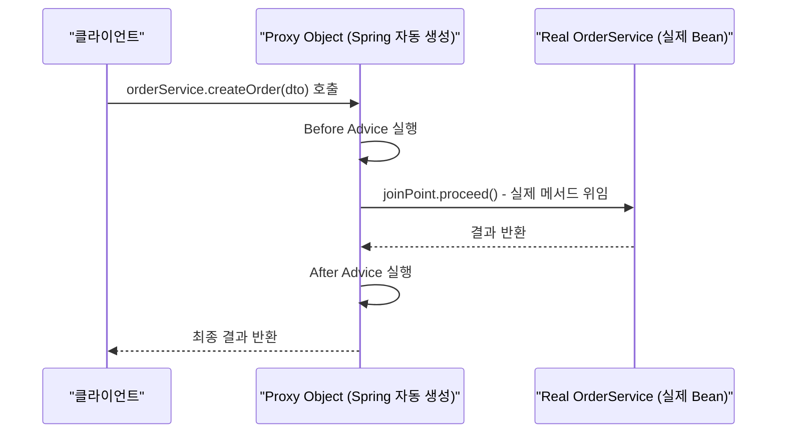
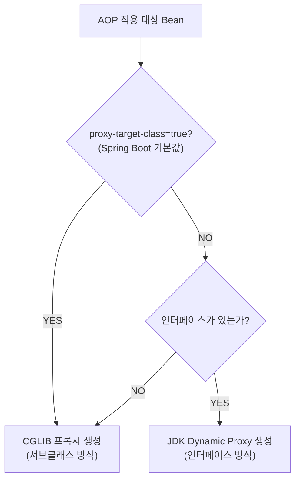
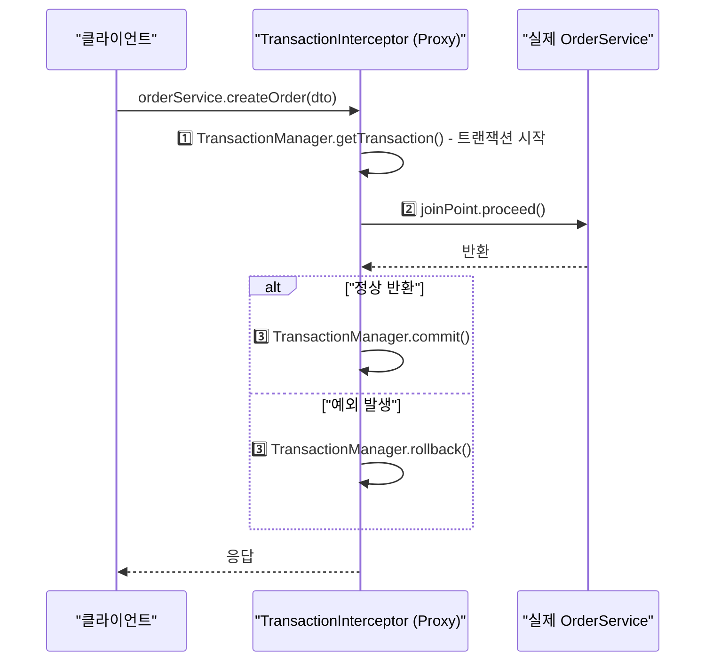
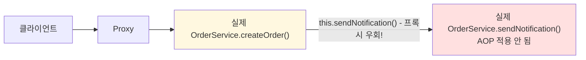
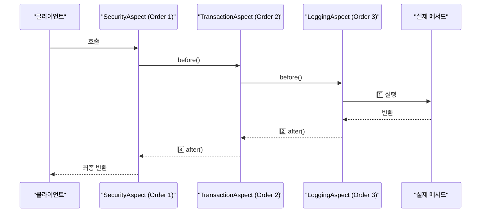

## 1. AOP란? (관심사 분리)

로그인 체크, 트랜잭션 시작/종료, 실행 시간 측정 — 이 코드가 서비스 50개에 똑같이 붙어 있다면? 하나를 고칠 때마다 50군데를 손봐야 한다. AOP는 이 반복을 끊는 방법이다.

> **비유로 먼저 이해하기**: AOP는 건물 CCTV와 같다. 각 방(서비스 클래스)마다 카메라를 설치하는 대신, 건물 입구 하나에 카메라를 달면 모든 출입을 감시할 수 있다. 로깅·트랜잭션·보안이 바로 그 입구 카메라 역할이다.

AOP(Aspect-Oriented Programming)는 **횡단 관심사(Cross-Cutting Concerns)**를 핵심 비즈니스 로직과 분리하는 프로그래밍 패러다임이다.

횡단 관심사란 여러 클래스에 걸쳐 반복적으로 나타나는 공통 기능을 말한다. 로깅, 트랜잭션 관리, 보안 검사, 성능 측정이 대표적이다. 이들은 핵심 비즈니스 로직과는 성격이 다르지만, 어느 클래스에나 끼어든다.

### 횡단 관심사의 문제

```java
// AOP 없이 로깅, 트랜잭션, 보안을 직접 구현
public class OrderService {
    public Order createOrder(OrderDto dto) {
        // 보안 체크
        SecurityContext.checkPermission("ORDER_CREATE");

        // 트랜잭션 시작
        Transaction tx = TransactionManager.begin();

        // 로깅
        log.info("createOrder 시작: {}", dto);
        long startTime = System.currentTimeMillis();

        try {
            // ↓ 실제 비즈니스 로직 (단 몇 줄)
            Order order = new Order(dto);
            orderRepository.save(order);
            // ↑ 여기까지가 핵심

            tx.commit();
            log.info("createOrder 완료: {}ms", System.currentTimeMillis() - startTime);
            return order;
        } catch (Exception e) {
            tx.rollback();
            log.error("createOrder 실패", e);
            throw e;
        }
    }
}
```

비즈니스 로직(주문 생성)은 2~3줄인데 나머지는 모두 부가 기능이다. 이런 코드가 수십 개 서비스에 반복된다. 한 곳을 고치려면 모든 파일을 열어야 한다.

### AOP로 분리

```java
// 핵심 로직만 남긴 서비스
@Service
public class OrderService {
    public Order createOrder(OrderDto dto) {
        Order order = new Order(dto);
        orderRepository.save(order);
        return order;
    }
}

// 부가 기능을 한 곳에 모음
@Aspect
@Component
public class LoggingAspect {
    @Around("execution(* com.example.service.*.*(..))")
    public Object logExecutionTime(ProceedingJoinPoint joinPoint) throws Throwable {
        long start = System.currentTimeMillis();
        Object result = joinPoint.proceed();
        log.info("{} 실행시간: {}ms",
            joinPoint.getSignature().getName(),
            System.currentTimeMillis() - start);
        return result;
    }
}
```

이제 서비스 클래스에는 핵심 로직만 있고, 부가 기능은 Aspect 하나에 집중됐다. 로깅 방식을 바꾸려면 `LoggingAspect` 하나만 수정하면 된다.

---

## 2. 핵심 용어

### Aspect

횡단 관심사를 모듈화한 것. Advice + Pointcut의 조합이다. 클래스 하나로 선언하며 `@Aspect` 어노테이션을 붙인다.

```java
@Aspect  // 이 클래스가 Aspect임을 선언
@Component
public class TransactionAspect {
    // Pointcut + Advice = Aspect
}
```

### Advice

Aspect가 언제 무엇을 할지 정의한다. 실제로 실행되는 코드다. 실행 시점에 따라 다섯 종류가 있다.

| Advice 종류 | 어노테이션 | 실행 시점 |
|------------|-----------|---------|
| Before | `@Before` | 메서드 실행 전 |
| After Returning | `@AfterReturning` | 정상 반환 후 |
| After Throwing | `@AfterThrowing` | 예외 발생 후 |
| After | `@After` | 정상/예외 모두 (finally) |
| Around | `@Around` | 실행 전/후 모두 제어 |

`@Around`가 가장 강력하다. 메서드 실행을 직접 제어하고, 반환값을 바꾸거나, 예외를 가로챌 수 있다. `@Transactional`도 내부적으로 `@Around`로 구현된다.

```java
@Aspect
@Component
public class LoggingAspect {

    @Before("execution(* com.example.service.*.*(..))")
    public void logBefore(JoinPoint joinPoint) {
        log.info("→ {} 호출", joinPoint.getSignature().getName());
    }

    @AfterReturning(pointcut = "execution(* com.example.service.*.*(..))",
                    returning = "result")
    public void logAfterReturning(JoinPoint joinPoint, Object result) {
        log.info("← {} 반환: {}", joinPoint.getSignature().getName(), result);
    }

    @AfterThrowing(pointcut = "execution(* com.example.service.*.*(..))",
                   throwing = "ex")
    public void logAfterThrowing(JoinPoint joinPoint, Exception ex) {
        log.error("✗ {} 예외: {}", joinPoint.getSignature().getName(), ex.getMessage());
    }

    @Around("execution(* com.example.service.*.*(..))")
    public Object logAround(ProceedingJoinPoint joinPoint) throws Throwable {
        log.info("→ 시작");
        try {
            Object result = joinPoint.proceed(); // 실제 메서드 실행
            log.info("← 성공");
            return result;
        } catch (Exception e) {
            log.error("✗ 실패");
            throw e;
        }
    }
}
```

### Pointcut

Advice를 적용할 메서드를 선별하는 표현식이다. "어떤 메서드에 부가 기능을 붙일지"를 정의한다.

```java
// execution 표현식 문법
// execution([접근제어자] 반환타입 [선언타입].메서드명(파라미터) [예외])

execution(* com.example.service.*.*(..))
//        ^  ^^^^^^^^^^^^^^^^^^^^^^^  ^^
//        |  패키지.클래스.메서드     파라미터(모두)
//        반환타입(모두)

// 자주 쓰는 패턴
@Pointcut("execution(* com.example.service..*(..))")  // service 하위 모든 메서드
@Pointcut("@annotation(org.springframework.transaction.annotation.Transactional)")  // 어노테이션 기반
@Pointcut("within(com.example.service.*)")  // 특정 패키지 내 모든 메서드
@Pointcut("bean(orderService)")  // 특정 Bean
```

Pointcut은 재사용할 수 있다. 자주 쓰는 표현식을 빈 메서드에 선언해두고 이름으로 참조한다.

```java
@Aspect
@Component
public class MyAspect {

    @Pointcut("execution(* com.example.service.*.*(..))")
    public void serviceLayer() {}

    @Pointcut("execution(* com.example.repository.*.*(..))")
    public void repositoryLayer() {}

    @Pointcut("serviceLayer() || repositoryLayer()")
    public void applicationLayer() {}

    @Before("applicationLayer()")
    public void log(JoinPoint joinPoint) { ... }
}
```

### JoinPoint

Advice가 적용될 수 있는 지점이다. Spring AOP에서는 **메서드 실행**만 JoinPoint다. `@Around`에서는 `ProceedingJoinPoint`를 사용해 실제 메서드를 호출할 수 있다.

```java
@Before("execution(* com.example.service.*.*(..))")
public void before(JoinPoint joinPoint) {
    String methodName = joinPoint.getSignature().getName();
    Object[] args = joinPoint.getArgs();
    Object target = joinPoint.getTarget();         // 실제 대상 객체
    Object proxy = joinPoint.getThis();            // 프록시 객체
    String className = joinPoint.getTarget().getClass().getName();
}
```

### Weaving

Aspect를 Target 객체에 적용하는 과정이다. 언제 이 결합이 일어나느냐에 따라 세 가지로 나뉜다.

| Weaving 시점 | 설명 |
|-------------|------|
| Compile-time | 컴파일 시 바이트코드 조작 (AspectJ) |
| Load-time | 클래스 로딩 시 조작 (AspectJ LTW) |
| **Runtime** | 런타임 프록시 생성 (**Spring AOP**) |

Spring AOP는 런타임 Weaving을 사용한다. 애플리케이션이 구동될 때 AOP가 적용된 Bean 대신 프록시 객체를 생성해서 주입한다.

---

## 3. Spring AOP vs AspectJ

| 구분 | Spring AOP | AspectJ |
|------|-----------|---------|
| Weaving | Runtime (프록시) | Compile/Load-time (바이트코드 조작) |
| 적용 대상 | Spring Bean의 메서드만 | 모든 Java 코드 (필드, 생성자 등) |
| 설정 복잡도 | 간단 | 복잡 (컴파일러/에이전트 필요) |
| 성능 | 약간 낮음 | 높음 (런타임 오버헤드 없음) |
| 실무 사용 | 대부분 상황에서 충분 | 필드 접근, Spring Bean 외 적용 필요 시 |

Spring AOP는 AspectJ의 어노테이션(`@Aspect`, `@Before` 등)을 차용하지만, 내부적으로는 **프록시 기반**으로 동작한다. 실무에서 90% 이상의 경우 Spring AOP로 충분하다.

```java
@EnableAspectJAutoProxy  // Spring Boot는 자동 활성화
@Configuration
public class AopConfig { }
```

---

## 4. 프록시 기반 AOP 동작 원리

Spring AOP의 핵심은 **프록시 패턴**이다. 클라이언트가 `OrderService`를 요청하면 Spring은 실제 `OrderService` 대신 프록시 객체를 주입한다. 클라이언트는 프록시를 통해 메서드를 호출하고, 프록시가 Advice를 실행한 뒤 실제 메서드에 위임한다.

1️⃣ **클라이언트 → 프록시 호출**: 클라이언트는 프록시인지 모르고 Bean을 호출한다
2️⃣ **프록시 → Advice 실행**: Before Advice, Around Advice의 앞부분이 실행된다
3️⃣ **프록시 → 실제 Bean 위임**: `joinPoint.proceed()`로 실제 메서드를 호출한다
4️⃣ **결과 반환**: After Advice, Around Advice의 뒷부분이 실행된 후 결과를 반환한다



### JDK Dynamic Proxy

인터페이스가 있을 때 사용된다. `java.lang.reflect.Proxy`를 활용해 런타임에 인터페이스 구현체를 생성한다.

```java
// 인터페이스 존재
public interface OrderService {
    Order createOrder(OrderDto dto);
}

@Service
public class OrderServiceImpl implements OrderService {
    public Order createOrder(OrderDto dto) { ... }
}

// Spring이 생성하는 JDK 동적 프록시 (개념적 표현)
public class OrderServiceProxy implements OrderService {
    private final OrderService target;

    public Order createOrder(OrderDto dto) {
        // Before Advice 실행
        // target.createOrder(dto) 호출
        // After Advice 실행
    }
}
```

**제약**: 인터페이스를 통해서만 접근 가능하다.

```java
// 오류: JDK 프록시는 인터페이스 구현체이므로 구체 클래스 타입으로 캐스팅 불가
@Autowired
private OrderServiceImpl orderService; // ClassCastException!

// 정상: 인터페이스 타입으로 주입
@Autowired
private OrderService orderService; // OK
```

### CGLIB (Code Generation Library)

인터페이스가 없거나 구체 클래스로 주입받을 때 사용된다. 바이트코드 조작으로 **서브클래스**를 생성한다. 즉, `OrderService`를 상속한 프록시 클래스를 런타임에 만든다.

```java
// CGLIB이 생성하는 프록시 (개념적 표현)
public class PaymentService$$EnhancerBySpringCGLIB extends PaymentService {
    @Override
    public void pay(int amount) {
        // Advice 실행
        super.pay(amount);
        // Advice 실행
    }
}
```

**제약**: `final` 클래스/메서드에는 서브클래스를 만들 수 없으므로 적용 불가다.

### 프록시 선택 흐름

Spring Boot 2.0+부터 `spring.aop.proxy-target-class=true`가 기본값이므로 CGLIB을 먼저 사용한다.



---

## 5. @Transactional의 AOP 동작 원리

`@Transactional`은 Spring AOP의 대표적인 활용 사례다. 개발자가 `@Transactional`을 붙이면 Spring은 해당 Bean을 프록시로 감싸고, `TransactionInterceptor`라는 Around Advice를 적용한다.

메서드 호출 전에 트랜잭션을 시작하고, 정상 반환이면 커밋, 예외 발생이면 롤백하는 코드가 자동으로 삽입된다. 개발자는 트랜잭션 관리 코드를 전혀 작성하지 않아도 된다.



```java
@Service
public class OrderService {

    @Transactional  // → AOP 프록시가 트랜잭션 처리
    public Order createOrder(OrderDto dto) {
        // 이 메서드 실행 전: 트랜잭션 시작
        Order order = orderRepository.save(new Order(dto));
        notificationService.notify(order);
        return order;
        // 정상 반환: commit / 예외 발생: rollback
    }
}
```

---

## 6. AOP가 동작하지 않는 케이스

### Self-Invocation (내부 호출)

가장 흔한 함정이다. 같은 클래스 내부에서 `this`로 메서드를 호출하면 프록시를 거치지 않고 실제 객체를 직접 호출하기 때문에 AOP가 적용되지 않는다.

> **비유**: CCTV(프록시)는 건물 입구(외부 호출)에만 있다. 직원이 건물 안에서 옆 사무실로 걸어가는 것(내부 호출)은 CCTV에 찍히지 않는다.

```java
@Service
public class OrderService {

    @Transactional
    public void createOrder(OrderDto dto) {
        // ...
        this.sendNotification(dto);  // ← 문제! this는 프록시가 아닌 실제 객체
    }

    @Transactional(propagation = Propagation.REQUIRES_NEW)
    public void sendNotification(OrderDto dto) {
        // REQUIRES_NEW가 적용되지 않음!
    }
}
```



**해결책: 빈 분리**

```java
@Service
public class OrderService {
    @Autowired
    private NotificationService notificationService; // 별도 Bean

    @Transactional
    public void createOrder(OrderDto dto) {
        notificationService.sendNotification(dto); // 프록시를 통해 호출
    }
}

@Service
public class NotificationService {
    @Transactional(propagation = Propagation.REQUIRES_NEW)
    public void sendNotification(OrderDto dto) { ... }
}
```

### private 메서드

```java
@Service
public class OrderService {

    @Transactional
    private void createOrder() {  // private → AOP 적용 안 됨
        // ...
    }
}
```

CGLIB은 서브클래스를 생성하는데 `private` 메서드는 오버라이드 불가하다. JDK 프록시도 인터페이스에 `private`을 선언할 수 없으므로 동일하다.

### final 클래스/메서드

```java
@Service
public final class OrderService {  // final → CGLIB 프록시 생성 불가
    @Transactional
    public void createOrder() { ... }
}
```

### Spring Bean이 아닌 경우

```java
// new로 직접 생성한 객체는 AOP 적용 안 됨
OrderService orderService = new OrderService();
orderService.createOrder(); // @Transactional 동작 안 함
```

Spring 컨텍스트 밖에서 생성한 객체는 Bean이 아니므로 프록시도 없다.

---

## 7. Advice 실행 순서

여러 Aspect가 같은 JoinPoint에 적용될 때 `@Order`로 순서를 제어한다. 숫자가 낮을수록 먼저 실행된다.

```java
@Aspect
@Component
@Order(1)
public class SecurityAspect { ... }

@Aspect
@Component
@Order(2)
public class TransactionAspect { ... }

@Aspect
@Component
@Order(3)
public class LoggingAspect { ... }
```

실행 순서는 양파 껍질처럼 쌓인다. 바깥쪽(낮은 Order)이 먼저 감싸고, 실행은 안쪽에서 바깥쪽 순서로 돌아온다.



---

## 8. 실무 실수 모음

**실수 1: Checked Exception과 @Transactional 롤백**

```java
@Transactional
public void process() throws IOException {
    repository.save(data);
    throw new IOException("파일 오류"); // Checked → 기본적으로 롤백 안 됨!
}
// 해결: @Transactional(rollbackFor = Exception.class)
```

**실수 2: Spring Bean이 아닌 곳에 @Aspect 선언**

```java
@Aspect
// @Component 빠뜨림 → Spring Bean이 아니므로 AOP 동작 안 함
public class MyAspect {
    @Before("execution(* com.example..*(..))")
    public void log() { ... }
}
```

**실수 3: 같은 메서드에 중복 Advice 적용**

여러 Aspect가 같은 메서드에 적용될 때 `@Order`를 명시하지 않으면 순서가 비결정적이다. 보안 검사가 트랜잭션보다 나중에 실행되면 인증 전에 DB 작업이 시작될 수 있다.

---

## 정리

| 개념 | 핵심 |
|------|------|
| AOP | 횡단 관심사(로깅, 트랜잭션 등)를 핵심 로직과 분리 |
| Aspect | Advice + Pointcut의 모듈 |
| Advice | 실제 실행 코드 (Before/After/Around 등) |
| Pointcut | Advice 적용 대상 선별 표현식 |
| JoinPoint | Advice가 적용되는 지점 (Spring: 메서드 실행) |
| Weaving | Aspect를 Target에 적용하는 과정 |
| Spring AOP | 런타임 프록시 기반, Bean 메서드에만 적용 |
| JDK Proxy | 인터페이스 기반 |
| CGLIB | 서브클래스 생성, final 불가 |
| Self-invocation | 내부 this 호출은 프록시 우회 → AOP 미적용 |
