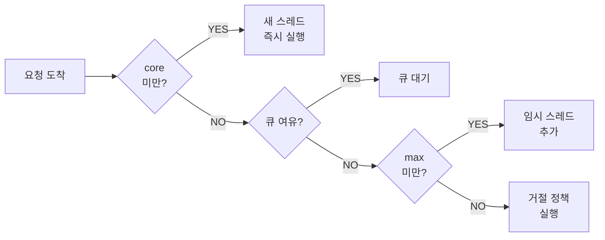
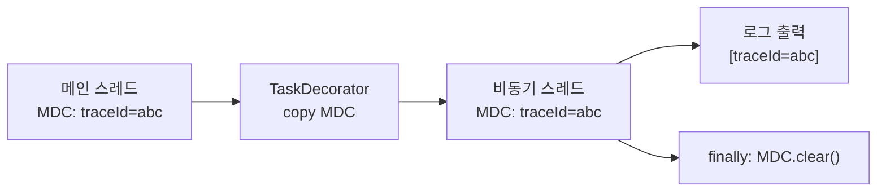
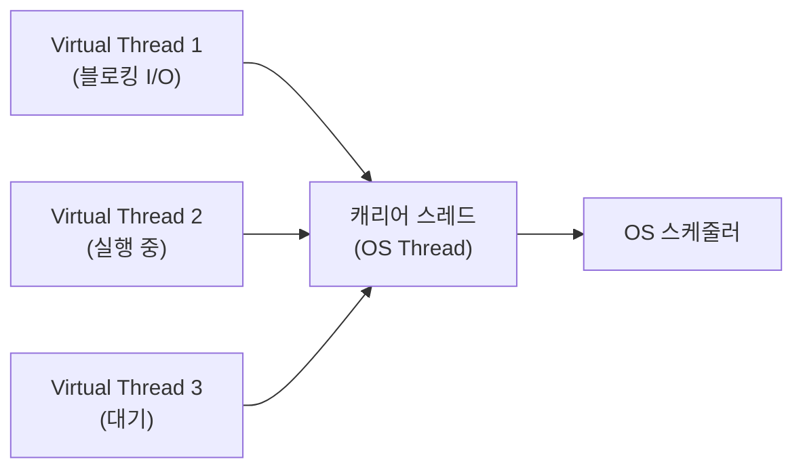

Spring `@Async`는 메서드 한 줄로 비동기를 선언할 수 있어 단순해 보인다. 하지만 내부 구조를 모르면 예외가 조용히 사라지고, 로그에서 TraceId가 증발하며, 트랜잭션 데이터가 보이지 않는 운영 장애로 이어진다. 이 글은 `AsyncAnnotationBeanPostProcessor`부터 Virtual Thread 통합까지 깊이 파고들어, 면접에서 "왜?"를 설명할 수 있는 수준을 목표로 한다.

> **비유:** 레스토랑 주방을 생각하자. 웨이터(호출자 스레드)가 주문을 받아 주방에 티켓을 붙이면(TaskExecutor에 제출), 셰프(풀 스레드)가 비동기로 요리한다. 웨이터는 다음 손님을 바로 받는다. 셰프가 요리 중 실수해도 웨이터는 모른다 — 별도 오류 채널(AsyncUncaughtExceptionHandler)이 없으면 실수는 영원히 묻힌다.

---

## 1. @Async 내부 구조 — 프록시는 왜 필요한가

### AsyncAnnotationBeanPostProcessor

`@EnableAsync`를 선언하면 Spring은 `AsyncAnnotationBeanPostProcessor`를 빈으로 등록한다. 이 BeanPostProcessor는 컨텍스트 초기화 시점에 모든 빈을 순회하며 `@Async` 애노테이션이 붙은 메서드가 있는 빈을 프록시로 교체한다.

```java
// Spring 내부 코드를 단순화한 의사 코드
public class AsyncAnnotationBeanPostProcessor implements BeanPostProcessor {

    @Override
    public Object postProcessAfterInitialization(Object bean, String beanName) {
        // @Async 메서드가 있으면 AOP 어드바이저를 적용
        if (hasAsyncAnnotation(bean.getClass())) {
            return createProxy(bean, asyncAnnotationAdvisor());
        }
        return bean;
    }
}
```

핵심은 `AsyncAnnotationAdvisor`다. 이 어드바이저는 `@Async` 메서드 호출을 가로채는 `AsyncExecutionInterceptor`를 어드바이스로 사용한다.

### AsyncExecutionInterceptor — 실제 비동기 실행 지점

```java
// Spring 소스 기반 단순화
public class AsyncExecutionInterceptor implements MethodInterceptor {

    @Override
    public Object invoke(MethodInvocation invocation) throws Throwable {
        // 1. 어느 Executor를 쓸지 결정 (@Async("name") 또는 기본값)
        AsyncTaskExecutor executor = determineAsyncExecutor(invocation.getMethod());

        // 2. 메서드 호출을 Callable로 감싸기
        Callable<Object> task = () -> {
            try {
                Object result = invocation.proceed(); // 실제 메서드 실행
                // Future 타입이면 unwrap
                if (result instanceof Future) {
                    return ((Future<?>) result).get();
                }
            } catch (ExecutionException ex) {
                handleError(ex.getCause(), invocation.getMethod(), invocation.getArguments());
            } catch (Throwable ex) {
                handleError(ex, invocation.getMethod(), invocation.getArguments());
            }
            return null;
        };

        // 3. Executor에 제출 — 호출자 스레드는 즉시 반환
        return doSubmit(task, executor, invocation.getMethod().getReturnType());
    }
}
```

**왜 프록시 기반인가?** Spring은 비침습적(non-invasive) 설계 원칙을 따른다. 인터페이스를 변경하거나 코드를 직접 수정하지 않고 횡단 관심사(비동기화)를 주입하려면 AOP 프록시가 가장 자연스러운 해법이다. 프록시는 빈 컨테이너가 관리하므로 Executor 선택, 예외 처리, 반환 타입 변환을 호출자 코드와 완전히 분리할 수 있다.


---

## 2. 스레드 풀 설정 — ThreadPoolTaskExecutor 완전 해부

### 기본 설정과 각 파라미터의 의미

```java
@Configuration
@EnableAsync
public class AsyncConfig implements AsyncConfigurer {

    @Bean("applicationExecutor")
    public ThreadPoolTaskExecutor applicationExecutor() {
        ThreadPoolTaskExecutor executor = new ThreadPoolTaskExecutor();

        // 항상 유지하는 스레드 수. 유휴 상태여도 죽이지 않는다.
        executor.setCorePoolSize(10);

        // 큐가 꽉 찼을 때 추가로 생성할 수 있는 최대 스레드 수
        executor.setMaxPoolSize(50);

        // corePoolSize 스레드가 모두 바쁠 때 요청이 쌓이는 대기열 크기
        executor.setQueueCapacity(500);

        // 로그에서 "async-0", "async-1"로 식별 가능
        executor.setThreadNamePrefix("async-");

        // maxPoolSize까지 늘어난 초과 스레드가 유휴 후 사라지는 시간
        executor.setKeepAliveSeconds(60);

        // 큐 + maxPoolSize 모두 초과 시 정책
        executor.setRejectedExecutionHandler(new ThreadPoolExecutor.CallerRunsPolicy());

        // 초기화 필수 — 내부적으로 ThreadPoolExecutor를 생성함
        executor.initialize();
        return executor;
    }

    @Override
    public AsyncUncaughtExceptionHandler getAsyncUncaughtExceptionHandler() {
        return new CustomAsyncExceptionHandler();
    }
}
```

### 요청 처리 순서 — 반드시 기억해야 할 함정



**함정:** Java의 `ThreadPoolExecutor` 구현은 큐를 먼저 채우고, 큐가 꽉 찬 뒤에야 `maxPoolSize`까지 스레드를 추가한다. 따라서 `queueCapacity=500`으로 크게 잡으면 트래픽 급증 시 스레드가 늘어나지 않고 큐만 쌓인다. 처리 속도가 급감해도 알아채기 어렵다.

**왜 이 순서인가?** Java 설계 철학은 "스레드는 비싸다"이다. 스레드 생성은 OS 시스템 콜을 유발하고 스택 메모리를 점유하므로, 가능한 한 기존 스레드로 처리하고 큐를 활용한다. `maxPoolSize`는 진짜 급증 트래픽을 위한 비상구다.

### 거절 정책 비교

```java
// 정책 1: CallerRunsPolicy (권장)
// 호출자 스레드가 직접 실행 → 요청 유실 없음, 단 호출자 블로킹
executor.setRejectedExecutionHandler(new ThreadPoolExecutor.CallerRunsPolicy());

// 정책 2: AbortPolicy (기본값)
// RejectedExecutionException 발생 → 명시적 예외로 문제를 드러냄
executor.setRejectedExecutionHandler(new ThreadPoolExecutor.AbortPolicy());

// 정책 3: DiscardPolicy
// 조용히 버림 → 데이터 유실, 운영에서 가장 위험
executor.setRejectedExecutionHandler(new ThreadPoolExecutor.DiscardPolicy());

// 정책 4: 커스텀 — Redis 대기열로 오버플로우 처리
executor.setRejectedExecutionHandler((r, pool) -> {
    log.warn("ThreadPool saturated, routing to Redis queue");
    redisQueue.push(r); // 비상 큐로 이관
});
```

### 용도별 Executor 분리

이메일 발송이 느려져도 결제 알림에 영향이 없어야 한다. Executor를 분리하면 장애 격리(bulkhead)가 가능하다.

```java
@Configuration
@EnableAsync
public class AsyncConfig {

    // I/O 바운드 (이메일, SMS, 외부 API): 스레드 많이, 큐 넉넉히
    @Bean("ioExecutor")
    public ThreadPoolTaskExecutor ioExecutor() {
        ThreadPoolTaskExecutor e = new ThreadPoolTaskExecutor();
        e.setCorePoolSize(20);
        e.setMaxPoolSize(100);
        e.setQueueCapacity(1000);
        e.setThreadNamePrefix("io-async-");
        e.initialize();
        return e;
    }

    // CPU 바운드 (보고서 생성, 이미지 처리): 코어 수 기준
    @Bean("cpuExecutor")
    public ThreadPoolTaskExecutor cpuExecutor() {
        int cores = Runtime.getRuntime().availableProcessors();
        ThreadPoolTaskExecutor e = new ThreadPoolTaskExecutor();
        e.setCorePoolSize(cores);
        e.setMaxPoolSize(cores * 2);
        e.setQueueCapacity(50);
        e.setThreadNamePrefix("cpu-async-");
        e.initialize();
        return e;
    }
}

@Service
public class NotificationService {

    @Async("ioExecutor")
    public CompletableFuture<Void> sendEmail(String to, String content) {
        emailSender.send(to, content);
        return CompletableFuture.completedFuture(null);
    }

    @Async("cpuExecutor")
    public CompletableFuture<byte[]> generateReport(Long reportId) {
        byte[] pdf = pdfGenerator.generate(reportId);
        return CompletableFuture.completedFuture(pdf);
    }
}
```

---

## 3. 예외 처리 — void가 예외를 삼키는 이유

### void 반환 타입의 예외 흐름

`@Async` void 메서드에서 예외가 발생하면 Spring은 이를 `AsyncUncaughtExceptionHandler`로 라우팅한다. 핸들러가 없으면 예외는 로그조차 남기지 않고 사라진다.

**왜 조용히 사라지는가?** 비동기 스레드에서 발생한 예외는 호출자 스레드의 콜스택에 존재하지 않는다. `void` 반환 타입이므로 결과를 기다리는 코드도 없다. 예외를 받을 주체가 없기 때문에 `AsyncExecutionInterceptor`가 잡아서 `AsyncUncaughtExceptionHandler`로 전달하는 구조가 필요하다.

```java
@Slf4j
public class CustomAsyncExceptionHandler implements AsyncUncaughtExceptionHandler {

    private final SlackNotifier slackNotifier;
    private final RetryQueue retryQueue;

    @Override
    public void handleUncaughtException(Throwable ex, Method method, Object... params) {
        String context = String.format(
            "비동기 메서드 실패: %s.%s(%s)",
            method.getDeclaringClass().getSimpleName(),
            method.getName(),
            Arrays.toString(params)
        );

        log.error(context, ex);

        // 심각도별 처리
        if (ex instanceof RecoverableException) {
            retryQueue.enqueue(method, params);
        } else {
            slackNotifier.alert("[ASYNC ERROR] " + context + ": " + ex.getMessage());
        }
    }
}
```

### Future와 CompletableFuture의 예외 처리

`Future`를 반환하는 경우 예외는 `get()` 호출 시점까지 보관된다.

```java
@Async
public Future<String> processWithFuture(String data) {
    if (data == null) {
        throw new IllegalArgumentException("data는 null일 수 없다");
        // 이 예외는 AsyncResult 내부에 감싸여 호출자의 get()에서 ExecutionException으로 나온다
    }
    return new AsyncResult<>(process(data));
}

// 호출측
Future<String> future = service.processWithFuture(data);
try {
    String result = future.get(5, TimeUnit.SECONDS); // 여기서 ExecutionException 발생
} catch (ExecutionException e) {
    log.error("비동기 처리 실패", e.getCause());
}
```

`CompletableFuture`는 더 풍부한 예외 처리를 제공한다.

```java
@Async
public CompletableFuture<String> processAsync(String data) {
    try {
        String result = process(data);
        return CompletableFuture.completedFuture(result);
    } catch (Exception e) {
        // 실패 상태의 CompletableFuture 반환
        return CompletableFuture.failedFuture(e);
    }
}

// 호출측 — 논블로킹 예외 처리
service.processAsync(data)
    .thenApply(result -> result.toUpperCase())
    .exceptionally(ex -> {
        log.error("처리 실패: {}", ex.getMessage());
        return "DEFAULT_VALUE"; // 폴백
    })
    .thenAccept(result -> responseQueue.push(result));
```

---

## 4. Self-invocation 문제 — AOP 프록시 우회

### 왜 같은 클래스 내 호출이 안 되는가

Spring AOP 프록시는 빈 컨테이너 안에서만 작동한다. `@Service` 클래스의 `this` 참조는 프록시가 아닌 실제 객체를 가리킨다. 따라서 내부에서 `this.asyncMethod()`를 호출하면 프록시의 `invoke()`를 타지 않아 `@Async`가 무시된다.

```java
@Service
public class UserService {

    // 잘못된 코드 — self-invocation
    public void register(User user) {
        save(user);
        // this.sendWelcomeEmail() 와 동일 → 프록시 우회 → 동기 실행
        sendWelcomeEmail(user.getId());
    }

    @Async
    public void sendWelcomeEmail(Long userId) {
        // 이 메서드는 동기로 실행됨
        emailSender.send(userId);
    }
}
```

### 해결책 1: 빈 분리 (권장)

```java
@Service
@RequiredArgsConstructor
public class UserService {

    private final EmailService emailService; // 별도 빈

    public void register(User user) {
        save(user);
        // 프록시를 통한 호출 → @Async 동작
        emailService.sendWelcomeEmail(user.getId());
    }
}

@Service
public class EmailService {

    @Async("ioExecutor")
    public void sendWelcomeEmail(Long userId) {
        emailSender.send(userId);
    }
}
```

### 해결책 2: ApplicationContext에서 프록시 직접 획득

```java
@Service
@RequiredArgsConstructor
public class UserService implements ApplicationContextAware {

    private ApplicationContext ctx;

    public void register(User user) {
        save(user);
        // ApplicationContext에서 꺼내면 프록시 객체가 반환됨
        ctx.getBean(UserService.class).sendWelcomeEmail(user.getId());
    }

    @Async
    public void sendWelcomeEmail(Long userId) {
        emailSender.send(userId);
    }

    @Override
    public void setApplicationContext(ApplicationContext ctx) {
        this.ctx = ctx;
    }
}
```

빈 분리가 코드 구조 측면에서 훨씬 깔끔하므로 실무에서는 해결책 1을 항상 권장한다. 해결책 2는 순환 참조와 테스트 복잡도를 높인다.

---

## 5. SecurityContext 전파 — ThreadLocal의 함정

### 왜 SecurityContext가 비동기 스레드로 전파되지 않는가

`SecurityContextHolder`는 기본적으로 `ThreadLocal` 전략을 사용한다. 각 스레드는 독립적인 `ThreadLocal` 저장소를 가지므로 메인 스레드의 `SecurityContext`를 비동기 스레드에서는 볼 수 없다.

```java
@Service
public class SecureAsyncService {

    @Async
    public void doSecureWork() {
        // 이 시점에 SecurityContextHolder는 비어 있다
        Authentication auth = SecurityContextHolder.getContext().getAuthentication();
        // auth == null → NullPointerException 또는 AccessDeniedException
        String username = auth.getName(); // NPE!
    }
}
```

### 해결책 1: DelegatingSecurityContextAsyncTaskExecutor

Spring Security가 제공하는 래퍼로 호출자 스레드의 `SecurityContext`를 캡처해 비동기 스레드로 전달한다.

```java
@Configuration
@EnableAsync
public class AsyncSecurityConfig {

    @Bean("secureExecutor")
    public Executor secureExecutor() {
        ThreadPoolTaskExecutor executor = new ThreadPoolTaskExecutor();
        executor.setCorePoolSize(10);
        executor.setMaxPoolSize(50);
        executor.setQueueCapacity(200);
        executor.setThreadNamePrefix("secure-async-");
        executor.initialize();

        // SecurityContext를 자동으로 전파하는 래퍼
        return new DelegatingSecurityContextAsyncTaskExecutor(executor);
    }
}
```

### 해결책 2: TaskDecorator로 직접 구현

`DelegatingSecurityContextAsyncTaskExecutor`가 내부적으로 하는 일을 `TaskDecorator`로 직접 구현할 수 있다. MDC와 SecurityContext를 함께 처리할 때 유용하다.

```java
public class SecurityContextTaskDecorator implements TaskDecorator {

    @Override
    public Runnable decorate(Runnable runnable) {
        // 호출자 스레드에서 SecurityContext 캡처
        SecurityContext securityContext = SecurityContextHolder.getContext();

        return () -> {
            try {
                // 비동기 스레드에 SecurityContext 주입
                SecurityContextHolder.setContext(securityContext);
                runnable.run();
            } finally {
                // 반드시 정리 — 스레드 풀 재사용 시 오염 방지
                SecurityContextHolder.clearContext();
            }
        };
    }
}

@Bean("secureExecutor")
public ThreadPoolTaskExecutor secureExecutor() {
    ThreadPoolTaskExecutor executor = new ThreadPoolTaskExecutor();
    executor.setCorePoolSize(10);
    executor.setMaxPoolSize(50);
    executor.setQueueCapacity(200);
    executor.setTaskDecorator(new SecurityContextTaskDecorator());
    executor.initialize();
    return executor;
}
```

**주의:** `SecurityContextHolder.MODE_INHERITABLETHREADLOCAL`로 전략을 바꾸면 자식 스레드가 부모의 컨텍스트를 상속받는다. 그러나 스레드 풀에서 재사용되는 스레드는 새로 생성된 스레드가 아니므로 이 전략만으로는 부족하다. `TaskDecorator` 방식이 더 안전하다.

---

## 6. MDC 전파 — TaskDecorator 패턴

### MDC가 비동기 스레드에서 사라지는 이유

MDC(Mapped Diagnostic Context)는 Logback/Log4j가 제공하는 스레드 격리 로그 컨텍스트다. 내부는 `ThreadLocal<Map<String, String>>`이다. 비동기 스레드는 새 스레드(또는 풀에서 재사용된 다른 스레드)이므로 MDC가 비어 있다.

실무 영향: Zipkin/Jaeger 연동 시 `traceId`, `spanId`가 MDC를 통해 로그에 기록된다. 비동기 메서드의 로그에서 이 값이 빠지면 분산 추적이 불가능해진다.

```java
// MDC + SecurityContext 동시 전파
public class ContextPropagationDecorator implements TaskDecorator {

    @Override
    public Runnable decorate(Runnable runnable) {
        // 호출자 스레드에서 캡처 (submit 시점)
        Map<String, String> mdcContext = MDC.getCopyOfContextMap();
        SecurityContext secCtx = SecurityContextHolder.getContext();

        return () -> {
            // 비동기 스레드에서 복원 (실행 시점)
            try {
                if (mdcContext != null) {
                    MDC.setContextMap(mdcContext);
                }
                SecurityContextHolder.setContext(secCtx);
                runnable.run();
            } finally {
                // 스레드 풀 재사용 시 이전 컨텍스트가 남지 않도록 반드시 정리
                MDC.clear();
                SecurityContextHolder.clearContext();
            }
        };
    }
}

@Configuration
@EnableAsync
public class AsyncConfig implements AsyncConfigurer {

    @Bean("applicationExecutor")
    public ThreadPoolTaskExecutor applicationExecutor() {
        ThreadPoolTaskExecutor executor = new ThreadPoolTaskExecutor();
        executor.setCorePoolSize(10);
        executor.setMaxPoolSize(50);
        executor.setQueueCapacity(500);
        executor.setThreadNamePrefix("async-");
        executor.setTaskDecorator(new ContextPropagationDecorator()); // 핵심
        executor.setRejectedExecutionHandler(new ThreadPoolExecutor.CallerRunsPolicy());
        executor.initialize();
        return executor;
    }

    @Override
    public AsyncUncaughtExceptionHandler getAsyncUncaughtExceptionHandler() {
        return new CustomAsyncExceptionHandler();
    }
}
```



---

## 7. @Async + @Transactional — 새 스레드 = 새 ThreadLocal

### 왜 트랜잭션이 전파되지 않는가

Spring 트랜잭션은 `TransactionSynchronizationManager`를 통해 현재 스레드의 `ThreadLocal`에 커넥션과 트랜잭션 메타데이터를 저장한다. `@Async`로 새 스레드가 생성되는 순간, 그 스레드는 새 `ThreadLocal` 컨텍스트를 갖는다. 호출자 트랜잭션과 완전히 무관한 새 트랜잭션이 시작된다.

```java
@Service
public class OrderService {

    @Transactional // 트랜잭션 A 시작
    public void placeOrder(OrderRequest request) {
        Order order = orderRepository.save(Order.from(request));
        // 이 시점에 트랜잭션 A는 아직 커밋되지 않음
        // notificationService는 별도 스레드에서 실행됨
        notificationService.sendOrderNotification(order.getId());
        // 트랜잭션 A 커밋 (메서드 종료 시)
    }
}

@Service
public class NotificationService {

    @Async // 새 스레드 → 새 ThreadLocal → 트랜잭션 A와 무관
    @Transactional(propagation = Propagation.REQUIRES_NEW) // 새 트랜잭션 B
    public void sendOrderNotification(Long orderId) {
        // 문제: 트랜잭션 A가 아직 커밋 안 됐을 수 있음
        // findById → 데이터 없음 → EntityNotFoundException
        Order order = orderRepository.findById(orderId).orElseThrow();
        send(order);
    }
}
```

### 해결책: TransactionalEventListener(AFTER_COMMIT)

트랜잭션 커밋이 완료된 후 이벤트를 처리하도록 설계한다.

```java
// 1단계: 이벤트 정의
public record OrderPlacedEvent(Long orderId, String userEmail) {}

// 2단계: 트랜잭션 내에서 이벤트 발행
@Service
@RequiredArgsConstructor
public class OrderService {

    private final ApplicationEventPublisher eventPublisher;

    @Transactional
    public void placeOrder(OrderRequest request) {
        Order order = orderRepository.save(Order.from(request));
        // 트랜잭션 커밋 시점에 이벤트가 실제로 발행됨
        eventPublisher.publishEvent(
            new OrderPlacedEvent(order.getId(), request.getUserEmail())
        );
        // 메서드 종료 → 트랜잭션 커밋 → 이벤트 발행 → 리스너 실행
    }
}

// 3단계: 커밋 이후에 비동기 실행
@Service
@RequiredArgsConstructor
public class OrderNotificationService {

    @Async("ioExecutor")
    @TransactionalEventListener(phase = TransactionPhase.AFTER_COMMIT)
    public void onOrderPlaced(OrderPlacedEvent event) {
        // 이 시점에는 트랜잭션이 커밋 완료됨 → 데이터 정상 조회
        Order order = orderRepository.findById(event.orderId()).orElseThrow();
        emailSender.send(event.userEmail(), buildEmailContent(order));
    }
}
```

**주의:** `@TransactionalEventListener`는 기본적으로 `phase = AFTER_COMMIT`이다. `@Async`와 함께 쓰면 비동기 스레드에서 커밋 후 실행되어 두 문제를 동시에 해결한다.

---

## 8. CompletableFuture 통합 — 비동기 파이프라인

### @Async + CompletableFuture 조합 패턴

`@Async`가 반환하는 `CompletableFuture`는 Spring이 비동기 스레드에서 완성시킨다. 이를 체이닝하면 강력한 비동기 파이프라인을 구성할 수 있다.

```java
@Service
public class AsyncPipelineService {

    // 각 단계가 별도 스레드에서 실행
    @Async("ioExecutor")
    public CompletableFuture<UserProfile> fetchUserProfile(Long userId) {
        UserProfile profile = userApiClient.getProfile(userId);
        return CompletableFuture.completedFuture(profile);
    }

    @Async("ioExecutor")
    public CompletableFuture<List<Order>> fetchUserOrders(Long userId) {
        List<Order> orders = orderApiClient.getOrders(userId);
        return CompletableFuture.completedFuture(orders);
    }

    @Async("cpuExecutor")
    public CompletableFuture<DashboardData> buildDashboard(
            UserProfile profile, List<Order> orders) {
        DashboardData data = dashboardBuilder.build(profile, orders);
        return CompletableFuture.completedFuture(data);
    }
}

// 조합: 병렬 실행 후 결합
@Service
@RequiredArgsConstructor
public class DashboardService {

    private final AsyncPipelineService pipeline;

    public DashboardData getUserDashboard(Long userId) throws Exception {
        // 두 API 호출을 병렬로 실행
        CompletableFuture<UserProfile> profileFuture =
            pipeline.fetchUserProfile(userId);
        CompletableFuture<List<Order>> ordersFuture =
            pipeline.fetchUserOrders(userId);

        // 둘 다 완료되면 조합
        return profileFuture
            .thenCombine(ordersFuture,
                (profile, orders) -> new Object[]{profile, orders})
            .thenCompose(pair ->
                pipeline.buildDashboard(
                    (UserProfile) pair[0],
                    (List<Order>) pair[1]
                )
            )
            .exceptionally(ex -> {
                log.error("대시보드 구성 실패: userId={}", userId, ex);
                return DashboardData.empty();
            })
            .get(10, TimeUnit.SECONDS); // 타임아웃 설정 필수
    }
}
```

### thenApply vs thenCompose vs thenAccept

```java
CompletableFuture<String> future = service.fetchData();

// thenApply: 동기 변환 (값 → 값)
// 변환 함수가 가볍고 즉시 실행될 때 사용
CompletableFuture<Integer> lengthFuture = future.thenApply(String::length);

// thenCompose: 비동기 체이닝 (값 → CompletableFuture<값>)
// 다음 단계도 @Async 메서드일 때 중첩 Future를 평탄화
CompletableFuture<ProcessedData> processed = future
    .thenCompose(data -> service.processAsync(data)); // service.processAsync는 @Async

// thenAccept: 결과 소비 (값 → void)
// 로그, 저장, 알림 등 최종 소비
future.thenAccept(data -> log.info("처리 완료: {}", data));

// exceptionally: 예외 복구
// 예외 발생 시 폴백 값 반환, 정상이면 그대로 통과
CompletableFuture<String> safe = future
    .exceptionally(ex -> {
        log.error("실패, 폴백 반환", ex);
        return "FALLBACK";
    });

// handle: 정상/예외 모두 처리
CompletableFuture<String> handled = future
    .handle((result, ex) -> {
        if (ex != null) return "ERROR: " + ex.getMessage();
        return result.toUpperCase();
    });
```

### allOf vs anyOf

```java
@Service
public class ParallelNotificationService {

    @Async("ioExecutor")
    public CompletableFuture<Void> sendEmail(Long userId) { ... }

    @Async("ioExecutor")
    public CompletableFuture<Void> sendSms(Long userId) { ... }

    @Async("ioExecutor")
    public CompletableFuture<Void> sendPush(Long userId) { ... }

    public void notifyAll(Long userId) {
        CompletableFuture<Void> email = sendEmail(userId);
        CompletableFuture<Void> sms   = sendSms(userId);
        CompletableFuture<Void> push  = sendPush(userId);

        // 모두 완료될 때까지 대기
        CompletableFuture.allOf(email, sms, push)
            .thenRun(() -> log.info("모든 채널 알림 완료: userId={}", userId))
            .exceptionally(ex -> {
                log.error("일부 채널 알림 실패: userId={}", userId, ex);
                return null;
            });
    }

    public CompletableFuture<String> fetchFromFastest(Long userId) {
        CompletableFuture<String> primary   = fetchFromPrimary(userId);
        CompletableFuture<String> secondary = fetchFromSecondary(userId);

        // 가장 빠른 결과를 사용
        return (CompletableFuture<String>) CompletableFuture.anyOf(primary, secondary);
    }
}
```

---

## 9. Virtual Thread 통합 — Spring 6.1 / Java 21

### Virtual Thread가 @Async를 바꾸는 이유

Java 21의 Virtual Thread(가상 스레드)는 JVM이 관리하는 경량 스레드다. OS 스레드에 1:N으로 매핑되므로 블로킹 I/O 시 캐리어 스레드를 반납하고 다른 가상 스레드가 실행된다. 수천~수만 개의 동시 스레드를 OS 스레드 수십 개로 처리할 수 있다.

**왜 @Async 패러다임을 바꾸는가?** 기존 `@Async`가 필요했던 이유 중 하나는 "블로킹 I/O로 스레드를 낭비하지 말자"였다. Virtual Thread에서는 블로킹 I/O가 실질적으로 논블로킹이 되므로, 복잡한 `CompletableFuture` 체인 없이 단순한 동기 코드 그대로 높은 처리량을 얻을 수 있다.

### Spring 6.1에서의 Virtual Thread 설정

```java
@Configuration
@EnableAsync
public class VirtualThreadAsyncConfig implements AsyncConfigurer {

    @Bean("virtualThreadExecutor")
    public Executor virtualThreadExecutor() {
        // Spring 6.1+: SimpleAsyncTaskExecutor에 Virtual Thread 지원 추가
        SimpleAsyncTaskExecutor executor = new SimpleAsyncTaskExecutor();
        executor.setVirtualThreads(true); // Virtual Thread 활성화
        executor.setThreadNamePrefix("virtual-");
        return executor;
    }

    // 또는 Java 21 Executors.newVirtualThreadPerTaskExecutor() 직접 사용
    @Bean("rawVirtualExecutor")
    public Executor rawVirtualExecutor() {
        return Executors.newVirtualThreadPerTaskExecutor();
    }
}

@Service
public class VirtualThreadService {

    // 각 호출마다 새 Virtual Thread 생성 — OS 스레드 부담 없음
    @Async("virtualThreadExecutor")
    public CompletableFuture<String> fetchFromExternalApi(String endpoint) {
        // 이 블로킹 호출이 Virtual Thread에서는 캐리어 스레드를 반납함
        String result = restTemplate.getForObject(endpoint, String.class);
        return CompletableFuture.completedFuture(result);
    }
}
```

### Spring Boot 3.2+ 전역 Virtual Thread 설정

```yaml
# application.yml
spring:
  threads:
    virtual:
      enabled: true  # Tomcat, @Async 모두 Virtual Thread로 전환
```

이 설정 하나로 Tomcat 요청 처리 스레드와 `@Async` 기본 Executor가 모두 Virtual Thread로 전환된다.

### Virtual Thread 주의사항

```java
// 주의 1: synchronized 블록은 Virtual Thread를 핀닝(pinning)시킨다
// synchronized 대신 ReentrantLock 사용
@Async("virtualThreadExecutor")
public CompletableFuture<Void> badExample() {
    synchronized (this) { // Virtual Thread가 캐리어 스레드에 고정됨
        doWork();
    }
    return CompletableFuture.completedFuture(null);
}

@Async("virtualThreadExecutor")
public CompletableFuture<Void> goodExample() {
    lock.lock(); // ReentrantLock: 핀닝 없음
    try {
        doWork();
    } finally {
        lock.unlock();
    }
    return CompletableFuture.completedFuture(null);
}

// 주의 2: ThreadLocal은 Virtual Thread에서도 동작하지만
// 수백만 개의 Virtual Thread가 각각 ThreadLocal을 가지면 메모리 부담
// Java 21의 ScopedValue를 장기적으로 검토할 것
```



---

## 10. 테스트 — Awaitility와 CountDownLatch

### 비동기 코드 테스트의 어려움

`@Async` 메서드는 다른 스레드에서 실행되므로 테스트에서 `Thread.sleep()`으로 대기하면 타이밍에 의존적이고 불안정하다. `Awaitility`는 조건이 충족될 때까지 폴링하는 방식으로 이 문제를 해결한다.

```java
@SpringBootTest
class AsyncServiceTest {

    @Autowired
    private AsyncService asyncService;

    @Autowired
    private ResultRepository resultRepository;

    // 방법 1: Awaitility — 권장
    @Test
    void 비동기_처리_결과가_DB에_저장된다() {
        asyncService.processAndSave("test-data");

        // 최대 5초, 100ms 간격으로 조건 확인
        await()
            .atMost(5, TimeUnit.SECONDS)
            .pollInterval(100, TimeUnit.MILLISECONDS)
            .untilAsserted(() -> {
                Optional<Result> result = resultRepository.findByData("test-data");
                assertThat(result).isPresent();
                assertThat(result.get().getStatus()).isEqualTo("COMPLETED");
            });
    }

    // 방법 2: CountDownLatch — 단일 완료 대기
    @Test
    void 비동기_콜백이_호출된다() throws InterruptedException {
        CountDownLatch latch = new CountDownLatch(1);
        AtomicReference<String> capturedResult = new AtomicReference<>();

        asyncService.processWithCallback("input", result -> {
            capturedResult.set(result);
            latch.countDown(); // 비동기 완료 신호
        });

        boolean completed = latch.await(5, TimeUnit.SECONDS);
        assertThat(completed).isTrue();
        assertThat(capturedResult.get()).isEqualTo("PROCESSED:input");
    }

    // 방법 3: CompletableFuture 반환 타입이면 직접 get()
    @Test
    void CompletableFuture_결과를_직접_검증한다() throws Exception {
        CompletableFuture<String> future = asyncService.processAsync("input");

        String result = future.get(5, TimeUnit.SECONDS);
        assertThat(result).isEqualTo("PROCESSED:input");
    }
}
```

### @Async 테스트 설정 — @EnableAsync 누락 주의

```java
// 테스트 전용 설정
@TestConfiguration
@EnableAsync // 테스트 컨텍스트에도 반드시 선언
public class AsyncTestConfig {

    @Bean
    public Executor asyncExecutor() {
        // 테스트에서는 단순 executor 사용 (스레드 추적 용이)
        ThreadPoolTaskExecutor executor = new ThreadPoolTaskExecutor();
        executor.setCorePoolSize(2);
        executor.setMaxPoolSize(5);
        executor.setQueueCapacity(10);
        executor.setThreadNamePrefix("test-async-");
        executor.initialize();
        return executor;
    }
}

@SpringBootTest
@Import(AsyncTestConfig.class)
class AsyncIntegrationTest {
    // ...
}
```

### 동기로 강제 실행하는 단위 테스트

`@Async`를 무시하고 동기로 실행해 비즈니스 로직만 검증할 때는 Mock을 사용한다.

```java
// 단위 테스트: 비동기 동작 자체가 아닌 로직만 검증
@ExtendWith(MockitoExtension.class)
class EmailServiceTest {

    @InjectMocks
    private EmailService emailService; // 프록시 없이 직접 주입

    @Mock
    private EmailSender emailSender;

    @Test
    void 이메일_발송_로직이_올바르게_동작한다() {
        // @Async 애노테이션은 프록시 없이 직접 호출 시 무시됨
        // → 동기로 실행되어 즉시 결과 검증 가능
        emailService.sendWelcomeEmail(1L);

        verify(emailSender).send(eq(1L), any(String.class));
    }
}
```

---

## 11. 반환 타입별 완전 정리

```java
@Service
public class AsyncReturnTypeDemo {

    // void: fire-and-forget. 예외는 AsyncUncaughtExceptionHandler로만 잡힘
    @Async
    public void fireAndForget(String data) {
        riskyProcess(data); // 예외 발생 시 자동으로 핸들러로 전달
    }

    // Future<T>: 블로킹 get() 필요. 구형 API. 새 코드에서는 사용 자제
    @Async
    public Future<String> withFuture(String data) {
        return new AsyncResult<>(process(data));
    }

    // ListenableFuture: Spring 6에서 deprecated. CompletableFuture 사용 권장
    @Async
    @Deprecated
    public ListenableFuture<String> withListenableFuture(String data) {
        return new AsyncResult<>(process(data));
    }

    // CompletableFuture<T>: 권장. 논블로킹 체이닝, 예외 처리, 타임아웃 모두 지원
    @Async
    public CompletableFuture<String> withCompletableFuture(String data) {
        try {
            return CompletableFuture.completedFuture(process(data));
        } catch (Exception e) {
            return CompletableFuture.failedFuture(e);
        }
    }
}
```

---

## 12. 극한 시나리오

### 시나리오 1: 스레드 풀 고갈 → 전체 서비스 응답 불가

**상황:** 이메일 발송 서버가 느려지면서 ioExecutor 큐가 가득 찼다. `CallerRunsPolicy`를 설정하지 않아 `TaskRejectedException`이 발생한다. 이메일 발송 실패 알림이 급증하면서 알림 자체도 이메일 Executor를 사용해 알림 발송도 실패한다.

```java
// 문제 진단
executor.getActiveCount()       // 현재 실행 중인 스레드 수
executor.getQueueSize()         // 현재 큐에 쌓인 작업 수
executor.getPoolSize()          // 현재 풀의 총 스레드 수
executor.getCompletedTaskCount() // 완료된 작업 수

// 방어: Executor 상태를 Micrometer로 노출
@Configuration
public class ExecutorMonitoringConfig {

    @Autowired
    private MeterRegistry meterRegistry;

    @PostConstruct
    public void bindMetrics() {
        ThreadPoolTaskExecutor executor = applicationExecutor();
        ExecutorServiceMetrics.monitor(
            meterRegistry,
            executor.getThreadPoolExecutor(),
            "application.executor"
        );
    }
}
```

Grafana에서 `application.executor.queue.size`가 임계치를 넘으면 PagerDuty 알림을 보내야 한다.

### 시나리오 2: MDC 전파 누락 → 분산 추적 불가

**상황:** Zipkin에서 특정 요청의 트레이스가 중간에 끊긴다. 비동기 메서드의 로그에서 `traceId`가 없어 어느 요청에서 발생한 오류인지 추적이 불가능하다.

원인: `TaskDecorator`가 없거나, `MDC.clear()`를 `finally` 블록 밖에서 호출해 다음 Runnable에서 이전 컨텍스트가 사용된다.

```java
// 잘못된 코드 — MDC.clear()가 finally 밖에 있음
public Runnable decorate(Runnable r) {
    Map<String, String> mdc = MDC.getCopyOfContextMap();
    return () -> {
        MDC.setContextMap(mdc);
        r.run();
        MDC.clear(); // 예외 발생 시 실행 안 됨 → 다음 Runnable에 오염
    };
}

// 올바른 코드
public Runnable decorate(Runnable r) {
    Map<String, String> mdc = MDC.getCopyOfContextMap();
    return () -> {
        try {
            if (mdc != null) MDC.setContextMap(mdc);
            r.run();
        } finally {
            MDC.clear(); // 반드시 finally
        }
    };
}
```

### 시나리오 3: @Async + @Transactional 데이터 레이스

**상황:** 주문 생성 API 응답은 200이 왔는데 알림 이메일에 주문 번호가 없다. 비동기 메서드가 트랜잭션 커밋 전에 DB를 조회해 데이터를 못 찾은 것이다.

재현 조건: `placeOrder()`의 트랜잭션 커밋에 수십ms가 걸리는 상황에서 `@Async` 스레드가 즉시 DB를 조회하면 데이터가 없다. 부하 테스트 없이는 발견하기 어렵다.

해결: `@TransactionalEventListener(phase = AFTER_COMMIT)` 사용 (7번 절 참고).

### 시나리오 4: Virtual Thread + synchronized 핀닝

**상황:** Virtual Thread를 활성화한 뒤 처리량이 오히려 감소했다. 내부 라이브러리가 `synchronized`를 사용해 Virtual Thread가 캐리어 스레드에 핀닝된다.

진단: JVM 플래그로 핀닝 감지

```bash
java -Djdk.tracePinnedThreads=full -jar app.jar
```

로그에 `VirtualThread[#xxx]/runnable@ForkJoinPool-1-worker-xxx` 형태의 핀닝 경고가 출력된다.

해결: 해당 라이브러리 코드에서 `synchronized` → `ReentrantLock`으로 교체하거나, 핀닝이 발생하는 코드를 별도 `ThreadPoolTaskExecutor`(OS 스레드)로 격리한다.

### 시나리오 5: 테스트에서 @EnableAsync 누락

**상황:** 개발/테스트에서는 정상 동작하는데 운영에서만 비동기가 안 된다. 반대 상황: 운영에서는 비동기인데 테스트에서는 동기로 실행되어 `TimeoutException`이 발생한다.

원인: `@SpringBootTest`는 전체 컨텍스트를 로드하지만, 슬라이스 테스트(`@WebMvcTest` 등)는 일부 설정만 로드한다. 테스트 설정 클래스에 `@EnableAsync`가 없으면 `@Async`가 동기로 실행된다.

---

## 13. 면접 포인트 5가지

### Q1. @Async 내부 동작을 설명하라 — 왜 프록시인가

> `@EnableAsync`를 선언하면 Spring은 `AsyncAnnotationBeanPostProcessor`를 등록한다. 이 BeanPostProcessor가 컨텍스트 초기화 시 `@Async` 메서드를 가진 빈을 AOP 프록시로 감싼다. 프록시 내부의 `AsyncExecutionInterceptor`가 메서드 호출을 가로채 `TaskExecutor`에 `Callable`로 제출한다. 호출자 스레드는 제출 즉시 반환된다.
>
> **왜 프록시인가?** Spring AOP의 핵심 철학은 비침습적 횡단 관심사 주입이다. 소스 코드 변경 없이 비동기화를 주입하려면 런타임 프록시가 유일한 방법이다. 이 프록시 구조가 자기 호출(self-invocation)에서 `@Async`가 동작하지 않는 근본 이유이기도 하다.

### Q2. void 반환 @Async 메서드에서 예외가 사라지는 이유와 해결책은

> 비동기 스레드의 예외는 호출자 스레드의 콜스택과 완전히 분리된다. `void`이므로 결과를 기다리는 코드도 없다. `AsyncExecutionInterceptor`가 예외를 잡아 `AsyncUncaughtExceptionHandler`로 전달하는데, 핸들러가 없으면 예외는 로그조차 남지 않고 사라진다.
>
> **해결책 3가지:** ① `AsyncConfigurer.getAsyncUncaughtExceptionHandler()`를 구현해 핸들러 등록 ② `CompletableFuture` 반환으로 전환해 `exceptionally()`에서 처리 ③ 메서드 내부에서 try-catch로 예외를 잡아 로그/알림 처리.
>
> **극한 시나리오:** 이메일 발송 `void @Async` 메서드에서 예외가 발생했는데 핸들러 없이 사라졌다. 고객은 이메일을 못 받았지만 시스템은 "정상"으로 인식한다. 재무 계산 비동기 메서드라면 수치 오류가 무음으로 처리될 수 있다.

### Q3. MDC가 비동기 스레드에 전파되지 않는 이유와 해결책은

> MDC는 `ThreadLocal<Map<String, String>>`로 구현된다. 비동기 스레드는 새 `ThreadLocal` 컨텍스트를 가지므로 메인 스레드의 MDC 값을 볼 수 없다. Zipkin `traceId`가 MDC를 통해 로그에 기록되므로, 비동기 메서드의 로그에서 `traceId`가 사라져 분산 추적이 불가능해진다.
>
> **해결:** `TaskDecorator`를 구현한다. `decorate()` 메서드는 Runnable이 Executor에 제출될 때(메인 스레드) `MDC.getCopyOfContextMap()`으로 컨텍스트를 캡처한다. 반환된 Runnable이 실행될 때(비동기 스레드) `MDC.setContextMap()`으로 복원하고, `finally`에서 `MDC.clear()`로 정리한다.

### Q4. @Async + @Transactional 조합에서 발생하는 문제는

> `@Transactional`은 `TransactionSynchronizationManager`를 통해 현재 스레드의 `ThreadLocal`에 DB 커넥션과 트랜잭션 메타데이터를 저장한다. `@Async`로 새 스레드가 생성되면 그 스레드는 독립적인 `ThreadLocal`을 가지므로 호출자의 트랜잭션과 완전히 무관하다. 호출자 트랜잭션이 커밋되기 전에 비동기 메서드가 DB를 조회하면 데이터가 없다.
>
> **해결:** `@TransactionalEventListener(phase = AFTER_COMMIT)`을 `@Async`와 조합한다. `ApplicationEventPublisher`로 이벤트를 발행하면 트랜잭션 커밋 이후에 리스너가 비동기로 실행된다.
>
> **극한 시나리오:** 결제 트랜잭션 커밋 전에 비동기 포인트 적립 메서드가 실행되어 포인트는 쌓였는데 결제가 롤백되는 경우. 재고 차감 트랜잭션 커밋 전에 비동기 배송 요청이 나가서 재고 없는 상품의 배송 요청이 발생하는 경우.

### Q5. Virtual Thread와 @Async의 관계 — 언제 Virtual Thread로 전환하는가

> 기존 `@Async` + `ThreadPoolTaskExecutor`의 목적 중 하나는 블로킹 I/O로 스레드를 낭비하지 않기 위함이었다. Java 21 Virtual Thread는 블로킹 I/O 시 캐리어 OS 스레드를 반납하므로, 수만 개의 동시 I/O를 수십 개의 OS 스레드로 처리할 수 있다.
>
> **전환 시점:** 애플리케이션이 I/O 바운드(외부 API, DB)이고 Java 21 + Spring 6.1 이상이라면 Virtual Thread 전환을 검토한다. `spring.threads.virtual.enabled=true` 설정 하나로 `@Async` 기본 Executor와 Tomcat 모두 전환된다. CPU 바운드 작업(이미지 처리, 암호화)은 여전히 `ThreadPoolTaskExecutor`(OS 스레드)로 처리하는 것이 유리하다.
>
> **주의:** `synchronized` 블록은 Virtual Thread를 캐리어 스레드에 핀닝시켜 Virtual Thread의 이점을 완전히 잃는다. 레거시 라이브러리의 `synchronized` 사용 여부를 반드시 확인해야 한다.

---

## 14. 실무 체크리스트

```
✅ @EnableAsync 설정 확인 (테스트 컨텍스트 포함)
✅ 전용 ThreadPoolTaskExecutor 빈 등록
   └ SimpleAsyncTaskExecutor는 스레드 풀 없이 매번 생성 — 운영 금지
✅ AsyncUncaughtExceptionHandler 등록 (void 반환 예외 처리)
✅ TaskDecorator로 MDC + SecurityContext 전파
✅ 빈 분리로 self-invocation 제거 확인
✅ @Transactional + @Async 조합 시 AFTER_COMMIT 이벤트 사용
✅ CompletableFuture 반환으로 결과 추적 및 타임아웃 설정
✅ 스레드 이름 prefix 설정 (로그에서 식별용)
✅ RejectedExecutionHandler 명시 (CallerRunsPolicy 권장)
✅ Executor 상태 Micrometer로 모니터링
✅ 테스트에서 Awaitility 사용 (Thread.sleep 금지)
✅ Java 21 + Spring 6.1 이상 시 Virtual Thread 적용 검토
   └ synchronized 사용 라이브러리 핀닝 여부 확인
```

---

## 15. 기술 선택 가이드

| 방식 | 스레드 차단 | 결과 추적 | 학습 비용 | 적합한 상황 |
|---|---|---|---|---|
| 동기 호출 | O | 쉬움 | 낮음 | 결과가 즉시 필요한 경우 |
| @Async (void) | X | 불가 | 낮음 | 이메일, 알림, 감사 로그 |
| @Async + CompletableFuture | X | 가능 | 중간 | 병렬 API 호출 후 결합 |
| @Async + Virtual Thread | X | 가능 | 낮음 | I/O 바운드, Java 21+ |
| WebFlux Reactive | X | 가능 | 높음 | 전체 스택 논블로킹 필요 시 |

**결론:** 기존 MVC 스택에서 이메일, 알림, 통계 등 일부 작업을 비동기화할 때는 `@Async` + `ThreadPoolTaskExecutor`가 가장 낮은 비용으로 빠르게 적용할 수 있다. 결과를 조합해야 하거나 실패를 추적해야 하면 `CompletableFuture`를 반환 타입으로 사용한다. Java 21 + Spring Boot 3.2 이상이라면 Virtual Thread 활성화로 복잡한 Executor 튜닝 없이 I/O 처리량을 크게 높일 수 있다.
