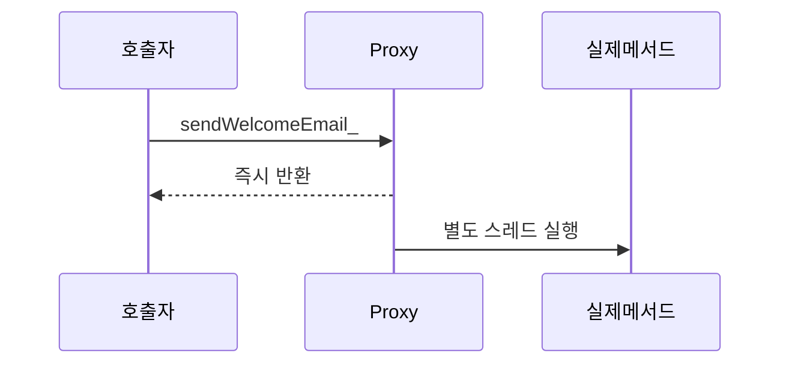
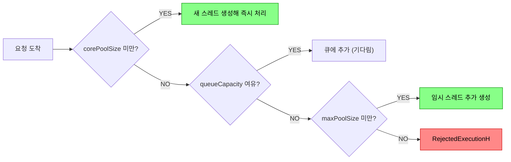

Spring의 `@Async`는 메서드를 별도 스레드에서 비동기로 실행하게 만드는 애노테이션이다. 단순히 붙이면 동작하는 것처럼 보이지만, 내부 동작과 주의사항을 모르면 예외가 무시되거나 MDC 컨텍스트가 사라지는 등 운영 장애로 이어질 수 있다.

> **비유**: 카페 직원(메인 스레드)이 손님 주문을 받고 "커피는 바리스타(별도 스레드)에게 맡길게요"라고 한 뒤 다음 손님을 받는 것과 같다. 단, 바리스타가 실수해도 직원은 알 수 없으므로 별도 오류 처리가 필요하다.

---

## @Async 동작 원리

### 1️⃣ 프록시 기반 동작

`@Async`는 Spring AOP 프록시를 통해 동작한다. `@EnableAsync`가 설정되면 Spring은 `@Async`가 붙은 메서드를 가진 빈을 프록시로 감싸고, 해당 메서드 호출을 가로채서 `TaskExecutor`에 위임한다.

호출자 스레드는 `TaskExecutor`에 작업을 제출한 즉시 반환된다. 실제 메서드는 스레드 풀의 다른 스레드에서 실행된다.



```java
// 내부적으로 이런 식으로 동작함
public class UserServiceProxy extends UserService {

    @Override
    public void sendWelcomeEmail(Long userId) {
        taskExecutor.execute(() -> super.sendWelcomeEmail(userId)); // 별도 스레드
    }
}
```

프록시 구조이므로 호출자 스레드와 실행 스레드는 완전히 분리된다. 호출자는 결과를 기다리지 않고 즉시 다음 작업을 처리할 수 있다.

### 2️⃣ 동작하지 않는 경우

프록시 기반이므로 AOP의 제약을 그대로 받는다.

```java
@Service
public class UserService {

    // 잘못된 예 1: 같은 빈 내부에서 this로 호출 (프록시 우회)
    public void register(User user) {
        save(user);
        sendWelcomeEmail(user.getId()); // this.sendWelcomeEmail() → @Async 무시됨
    }

    @Async
    public void sendWelcomeEmail(Long userId) {
        // 이 메서드는 동기로 실행됨 (프록시를 거치지 않으므로)
    }

    // 잘못된 예 2: private 메서드 (프록시가 오버라이드 불가)
    @Async
    private void privateAsyncMethod() {
        // @Async 동작 안 함
    }
}
```

**해결책: 빈을 분리한다**

```java
@Service
@RequiredArgsConstructor
public class UserService {

    private final EmailService emailService; // 별도 빈으로 분리

    public void register(User user) {
        save(user);
        emailService.sendWelcomeEmail(user.getId()); // 프록시 통과 → @Async 동작
    }
}

@Service
public class EmailService {

    @Async
    public void sendWelcomeEmail(Long userId) {
        // 별도 스레드에서 실행
    }
}
```

---

## @EnableAsync 설정

`@EnableAsync` 없이 `@Async`만 붙이면 **동기로 실행**된다. 이 실수를 모르면 비동기가 동작한다고 착각한 채로 운영에 배포할 수 있다.

```java
@Configuration
@EnableAsync
public class AsyncConfig implements AsyncConfigurer {

    @Override
    public Executor getAsyncExecutor() {
        ThreadPoolTaskExecutor executor = new ThreadPoolTaskExecutor();
        executor.setCorePoolSize(10);          // 기본 스레드 수
        executor.setMaxPoolSize(50);           // 최대 스레드 수
        executor.setQueueCapacity(500);        // 대기 큐 크기
        executor.setThreadNamePrefix("async-"); // 스레드 이름 접두사 (로그에서 식별용)
        executor.setKeepAliveSeconds(60);      // 유휴 스레드 유지 시간
        executor.setRejectedExecutionHandler(new ThreadPoolExecutor.CallerRunsPolicy());
        executor.initialize();
        return executor;
    }

    @Override
    public AsyncUncaughtExceptionHandler getAsyncUncaughtExceptionHandler() {
        return new CustomAsyncExceptionHandler();
    }
}
```

`setRejectedExecutionHandler`는 큐가 가득 찼을 때의 정책을 정의한다. `CallerRunsPolicy`는 호출자 스레드에서 직접 실행해 요청을 버리지 않는다.

---

## TaskExecutor 스레드 풀 동작 원리

스레드 풀은 요청이 들어올 때 네 단계를 순서대로 거쳐 처리한다. 이 순서를 이해해야 적절한 설정값을 고를 수 있다.

1️⃣ **corePoolSize 미만**: 새 스레드를 즉시 생성해 처리한다
2️⃣ **corePoolSize 초과, 큐 여유 있음**: 큐에 넣고 기존 스레드가 처리를 기다린다
3️⃣ **큐 가득 참, maxPoolSize 미만**: maxPoolSize까지 새 스레드를 추가로 생성한다
4️⃣ **maxPoolSize 초과**: RejectedExecutionHandler가 실행된다

> **함정**: 큐가 먼저 채워지고, 큐가 가득 찬 뒤에야 maxPoolSize까지 스레드가 늘어난다. 큐가 크면 스레드가 늘어나지 않아서 처리 속도가 느릴 수 있다.



---

## 여러 Executor 등록 (용도별 분리)

비동기 작업의 특성에 따라 Executor를 분리하면 한 작업이 다른 작업을 방해하지 않는다. 예를 들어 이메일 발송이 느려져도 결제 알림이 지연되지 않는다.

```java
@Configuration
@EnableAsync
public class AsyncConfig {

    @Bean("emailExecutor")
    public Executor emailExecutor() {
        ThreadPoolTaskExecutor executor = new ThreadPoolTaskExecutor();
        executor.setCorePoolSize(5);
        executor.setMaxPoolSize(10);
        executor.setQueueCapacity(200);
        executor.setThreadNamePrefix("email-");
        executor.initialize();
        return executor;
    }

    @Bean("reportExecutor")
    public Executor reportExecutor() {
        ThreadPoolTaskExecutor executor = new ThreadPoolTaskExecutor();
        executor.setCorePoolSize(2);
        executor.setMaxPoolSize(5);
        executor.setQueueCapacity(50);
        executor.setThreadNamePrefix("report-");
        executor.initialize();
        return executor;
    }
}

@Service
public class NotificationService {

    @Async("emailExecutor")    // 특정 Executor 지정
    public void sendEmail(String to, String content) { ... }

    @Async("reportExecutor")
    public void generateReport(Long reportId) { ... }
}
```

---

## 반환 타입: void vs Future vs CompletableFuture

`@Async` 메서드의 반환 타입에 따라 결과를 받는 방식이 달라진다.

```java
@Service
public class AsyncService {

    // 1. void: 결과 필요 없는 단순 비동기 작업
    @Async
    public void fireAndForget(String data) {
        process(data);
    }

    // 2. Future: 결과를 나중에 받아야 할 때 (블로킹 get)
    @Async
    public Future<String> processWithFuture(String data) {
        String result = process(data);
        return new AsyncResult<>(result);
    }

    // 3. CompletableFuture: 논블로킹 체이닝 (권장)
    @Async
    public CompletableFuture<String> processAsync(String data) {
        String result = process(data);
        return CompletableFuture.completedFuture(result);
    }
}

// 호출측에서 CompletableFuture 활용
@Service
public class OrderService {

    public void processOrder(OrderRequest request) {
        CompletableFuture<String> emailFuture = emailService.sendConfirmEmail(request.getUserId());
        CompletableFuture<String> smsFuture   = smsService.sendConfirmSms(request.getUserPhone());

        // 두 비동기 작업이 모두 끝날 때까지 기다림
        CompletableFuture.allOf(emailFuture, smsFuture)
            .thenRun(() -> log.info("모든 알림 발송 완료"))
            .exceptionally(ex -> {
                log.error("알림 발송 실패", ex);
                return null;
            });
    }
}
```

---

## 예외 처리 (AsyncUncaughtExceptionHandler)

`void` 반환 타입의 `@Async` 메서드에서 발생한 예외는 호출자에게 전파되지 않고 **무시된다**. 이를 처리하려면 `AsyncUncaughtExceptionHandler`를 등록해야 한다.

```java
@Slf4j
public class CustomAsyncExceptionHandler implements AsyncUncaughtExceptionHandler {

    @Override
    public void handleUncaughtException(Throwable ex, Method method, Object... params) {
        log.error("비동기 메서드 예외 발생: {}.{}({})",
            method.getDeclaringClass().getSimpleName(),
            method.getName(),
            Arrays.toString(params),
            ex
        );
        // 슬랙/이메일 알림, 재시도 큐 등록 등
    }
}
```

`CompletableFuture`를 반환하는 경우 `exceptionally()`로 예외를 처리한다.

```java
@Async
public CompletableFuture<Void> sendEmail(String to, String content) {
    try {
        emailSender.send(to, content);
        return CompletableFuture.completedFuture(null);
    } catch (Exception e) {
        return CompletableFuture.failedFuture(e);
    }
}
```

---

## MDC 전파 (TaskDecorator)

MDC(Mapped Diagnostic Context)는 `ThreadLocal`에 저장된다. `@Async`는 별도 스레드에서 실행되므로 **MDC가 자동으로 전파되지 않는다**. 로그에서 TraceId가 사라지는 원인이 된다.

`TaskDecorator`를 사용하면 메인 스레드의 MDC를 새 스레드에 복사할 수 있다.

```java
public class MdcTaskDecorator implements TaskDecorator {

    @Override
    public Runnable decorate(Runnable runnable) {
        // 현재 스레드의 MDC를 캡처
        Map<String, String> mdcContext = MDC.getCopyOfContextMap();

        return () -> {
            try {
                // 새 스레드에 MDC 복원
                if (mdcContext != null) {
                    MDC.setContextMap(mdcContext);
                }
                runnable.run();
            } finally {
                MDC.clear(); // 반드시 정리
            }
        };
    }
}

@Configuration
@EnableAsync
public class AsyncConfig {

    @Bean
    public Executor asyncExecutor() {
        ThreadPoolTaskExecutor executor = new ThreadPoolTaskExecutor();
        executor.setCorePoolSize(10);
        executor.setMaxPoolSize(50);
        executor.setQueueCapacity(500);
        executor.setTaskDecorator(new MdcTaskDecorator()); // MDC 전파 설정
        executor.initialize();
        return executor;
    }
}
```

MDC 외에도 `SecurityContextHolder`의 인증 정보도 동일한 방식으로 전파해야 한다.

```java
public class SecurityMdcTaskDecorator implements TaskDecorator {

    @Override
    public Runnable decorate(Runnable runnable) {
        Map<String, String> mdcContext = MDC.getCopyOfContextMap();
        SecurityContext securityContext = SecurityContextHolder.getContext();

        return () -> {
            try {
                MDC.setContextMap(mdcContext != null ? mdcContext : Collections.emptyMap());
                SecurityContextHolder.setContext(securityContext); // 인증 정보 전파
                runnable.run();
            } finally {
                MDC.clear();
                SecurityContextHolder.clearContext();
            }
        };
    }
}
```

---

## @Async와 @Transactional 조합 주의사항

`@Async` 메서드에 `@Transactional`을 함께 사용할 때는 스레드가 분리된다는 점을 반드시 고려해야 한다.

```java
@Service
public class OrderService {

    @Transactional
    public void placeOrder(OrderRequest request) {
        Order order = orderRepository.save(Order.from(request));
        // 아직 트랜잭션이 커밋되지 않은 상태에서 비동기 호출
        notificationService.sendAsync(order.getId()); // 별도 스레드에서 실행
        // 여기서 트랜잭션 커밋
    }
}

@Service
public class NotificationService {

    @Async
    public void sendAsync(Long orderId) {
        // 이 시점에 placeOrder의 트랜잭션이 아직 커밋 안 됐을 수 있음
        // orderRepository.findById(orderId) → 데이터 없음!
    }
}
```

**해결책**: 트랜잭션 커밋 후 비동기 작업이 실행되도록 `TransactionalEventListener`를 사용한다.

```java
@Service
public class OrderService {

    private final ApplicationEventPublisher eventPublisher;

    @Transactional
    public void placeOrder(OrderRequest request) {
        Order order = orderRepository.save(Order.from(request));
        // 트랜잭션 커밋 후 이벤트 발행
        eventPublisher.publishEvent(new OrderPlacedEvent(order.getId()));
    }
}

@Service
public class NotificationService {

    @Async
    @TransactionalEventListener(phase = TransactionPhase.AFTER_COMMIT)
    public void onOrderPlaced(OrderPlacedEvent event) {
        // 트랜잭션 커밋 완료 후 이 메서드 실행 → 데이터 정상 조회 가능
        Order order = orderRepository.findById(event.getOrderId()).orElseThrow();
        sendNotification(order);
    }
}
```

---


## 극한 시나리오

### 시나리오 1: 스레드 풀 고갈

대량 요청 시 큐가 가득 차고 maxPoolSize를 초과하면 `RejectedExecutionException`이 발생한다.

```
대응 전략:
1. CallerRunsPolicy: 호출자 스레드에서 직접 실행 (처리량 유지, 호출자 블로킹)
2. DiscardOldestPolicy: 가장 오래된 큐 항목을 버리고 현재 작업 추가
3. DiscardPolicy: 현재 작업을 조용히 버림 (데이터 유실 위험)
4. 커스텀: 큐 초과 시 Redis 대기열로 이관
```

### 시나리오 2: @Async 메서드에서 예외 발생 - 로그에 안 남음

`void` 반환 메서드의 예외가 `AsyncUncaughtExceptionHandler` 없이 무시되면, 이메일이 발송 안 됐는데 아무도 모르는 상황이 된다.

→ 반드시 `AsyncUncaughtExceptionHandler`를 등록하거나 `CompletableFuture`를 반환해 `.exceptionally()`로 처리한다.

### 시나리오 3: @EnableAsync 누락

`@Async` 붙인 메서드가 동기로 실행되고 있다면 가장 먼저 `@EnableAsync`가 있는지 확인한다. 테스트 환경에서는 별도 `@TestConfiguration`에 `@EnableAsync`를 추가해야 한다.

### 시나리오 4: 트랜잭션 + @Async 데이터 미조회

비동기 메서드가 호출자의 미커밋 데이터를 조회할 때 `EntityNotFoundException`이 발생한다.
→ `@TransactionalEventListener(phase = AFTER_COMMIT)` 패턴으로 커밋 완료 후 실행을 보장한다.

---
## 실무 체크리스트

```
✅ @EnableAsync 설정 확인
✅ 전용 ThreadPoolTaskExecutor 빈 등록 (기본 SimpleAsyncTaskExecutor는 스레드 풀 없이 매번 생성)
✅ AsyncUncaughtExceptionHandler 등록
✅ MDC 전파를 위한 TaskDecorator 설정
✅ 빈 내부 this 호출로 @Async 우회 여부 점검
✅ 트랜잭션과 조합 시 AFTER_COMMIT 이벤트 사용
✅ CompletableFuture 반환으로 결과 추적 가능하게 설계
✅ 스레드 이름 prefix 설정 (로그에서 async- 접두사로 구분)
```

---

## 왜 이 기술인가?

| 방식 | 스레드 차단 | 결과 추적 | 복잡도 | 적합한 상황 |
|---|---|---|---|---|
| 동기 호출 | O | 쉬움 | 낮음 | 결과가 즉시 필요한 경우 |
| @Async (Fire-and-forget) | X | 불가 | 낮음 | 이메일 발송, 알림, 로그 |
| @Async + CompletableFuture | X | 가능 | 중간 | 병렬 API 호출 후 결합 |
| WebFlux (Reactive) | X | 가능 | 높음 | 대용량 스트리밍, 논블로킹 전체 |
| Virtual Thread (Java 21+) | X (캐리어 스레드) | 쉬움 | 낮음 | 기존 동기 코드 그대로 활용 |

**결론:** 단순한 비동기 처리(이메일, 알림, 통계)는 `@Async` + `ThreadPoolTaskExecutor`가 가장 간단하다. 결과를 조합해야 하면 `CompletableFuture`를 사용하고, 전체 스택이 논블로킹이어야 한다면 WebFlux로 전환한다.

---

## 실무에서 자주 하는 실수

1. **같은 클래스 내 `@Async` 메서드 호출 (Self-invocation)** — `this.sendEmail()`처럼 내부 호출하면 Spring AOP 프록시를 우회해 동기로 실행된다. 반드시 별도 빈으로 분리하거나 `ApplicationContext.getBean()`으로 프록시를 통해 호출해야 한다.

2. **기본 SimpleAsyncTaskExecutor 사용** — `@EnableAsync`만 선언하면 기본 실행기가 스레드를 매 요청마다 새로 생성한다(재사용 없음). 반드시 `ThreadPoolTaskExecutor`를 빈으로 등록해 스레드풀을 설정해야 한다.

3. **MDC 컨텍스트 비전파** — `@Async` 스레드는 부모 스레드의 `MDC`를 상속받지 않는다. `TaskDecorator`를 구현해 `MDC.getCopyOfContextMap()`을 복사하지 않으면 비동기 로그에서 `traceId`가 사라진다.

4. **`@Transactional` + `@Async` 조합 오용** — `@Async` 메서드에 `@Transactional`을 붙이면 호출자의 트랜잭션과 완전히 분리된 새 트랜잭션으로 실행된다. 호출자 트랜잭션 커밋 전에 비동기 메서드가 실행되어 데이터가 없는 경우가 발생한다. `TransactionalEventListener(phase = AFTER_COMMIT)`을 사용해야 한다.

5. **스레드풀 포화(saturation) 대응 없음** — `queueCapacity`를 초과하면 `TaskRejectedException`이 발생한다. `setRejectedExecutionHandler`로 거절 정책(CallerRunsPolicy 등)을 명시하지 않으면 요청이 예외와 함께 유실된다.

---

## 면접 포인트

**Q1. `@Async`가 동작하려면 무엇이 필요한가?**
> `@EnableAsync`가 붙은 설정 클래스 + 별도 빈으로 분리된 `@Async` 메서드 + `public` 접근제어자. Spring AOP 프록시를 통해야 하므로 `private` 메서드나 같은 클래스 내 self-invocation에서는 동작하지 않는다.

**Q2. `@Async` 메서드의 예외는 어떻게 처리하는가?**
> `void` 반환 타입이면 예외가 `AsyncUncaughtExceptionHandler`로 전달된다. `Future` / `CompletableFuture` 반환이면 `get()` 호출 시점에 예외를 받을 수 있다. 반드시 `AsyncUncaughtExceptionHandler`를 등록해 예외 유실을 방지해야 한다.

**Q3. MDC를 비동기 스레드에 전파하는 방법은?**
> `TaskDecorator`를 구현하여 `ThreadPoolTaskExecutor.setTaskDecorator()`에 등록한다. Decorator 안에서 `MDC.getCopyOfContextMap()`으로 부모 스레드 컨텍스트를 복사하고, 작업 완료 후 `MDC.clear()`로 정리한다.

**Q4. `ThreadPoolTaskExecutor`의 `corePoolSize`, `maxPoolSize`, `queueCapacity` 관계는?**
> 요청이 들어오면 먼저 `corePoolSize`까지 스레드를 생성한다. 이후 `queueCapacity`가 다 찰 때까지 큐에 쌓는다. 큐도 가득 차면 `maxPoolSize`까지 스레드를 추가 생성한다. `maxPoolSize`도 초과하면 `RejectedExecutionHandler`가 호출된다.

**Q5. `@Async`와 WebFlux 중 언제 무엇을 선택하는가?**
> 기존 MVC 스택에서 일부 작업만 비동기화할 때는 `@Async`가 적합하다. 전체 I/O가 논블로킹이어야 하거나 대용량 스트리밍이 필요하면 WebFlux로 전환한다. Java 21의 Virtual Thread는 기존 동기 코드 그대로 높은 처리량을 얻을 수 있어 `@Async`의 좋은 대안이다.
