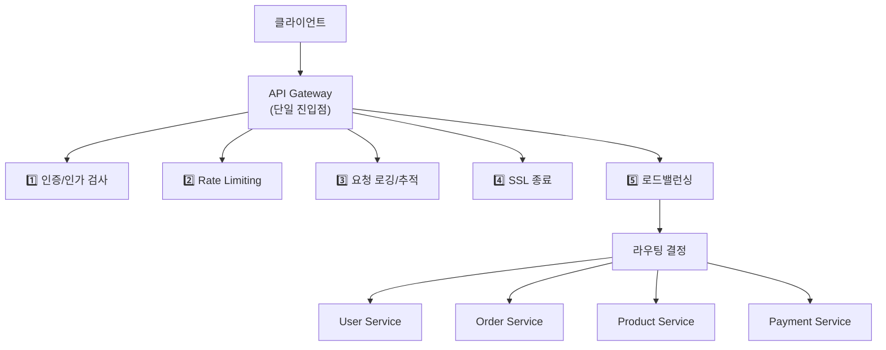
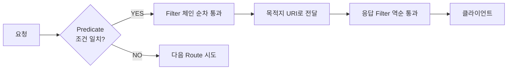
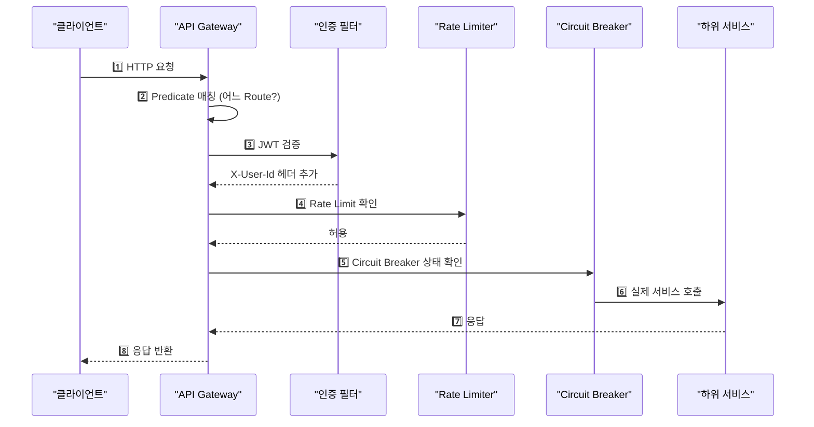

Spring Cloud Gateway는 Spring 생태계의 API Gateway 솔루션이다. Netflix Zuul(블로킹)의 후계자로, Spring WebFlux(Reactor/Netty) 기반의 비동기 논블로킹 방식으로 동작한다. 라우팅, 필터링, 로드밸런싱, 인증, Rate Limiting, Circuit Breaker를 통합 제공한다.

> **비유**: 대형 빌딩 로비의 안내 데스크와 같다. 방문객(요청)이 오면 신원 확인(인증), 출입 제한(Rate Limiting), 방문 기록(로깅) 후 각 부서(마이크로서비스)로 안내한다. 각 부서가 아닌 로비에서 모든 공통 절차를 처리하므로 각 부서는 자기 업무에만 집중할 수 있다.

---

## API Gateway 역할

마이크로서비스 아키텍처에서 클라이언트가 각 서비스를 직접 호출하면 인증, 로깅, Rate Limiting을 모든 서비스에 중복 구현해야 한다. API Gateway는 이 공통 관심사를 단일 진입점에 집중시킨다.



---

## 의존성 설정

```xml
<dependency>
    <groupId>org.springframework.cloud</groupId>
    <artifactId>spring-cloud-starter-gateway</artifactId>
</dependency>
<dependency>
    <groupId>org.springframework.cloud</groupId>
    <artifactId>spring-cloud-starter-loadbalancer</artifactId>
</dependency>
<dependency>
    <groupId>org.springframework.cloud</groupId>
    <artifactId>spring-cloud-starter-circuitbreaker-reactor-resilience4j</artifactId>
</dependency>
```

Spring Cloud Gateway는 WebFlux 기반이므로 `spring-boot-starter-web`과 함께 사용하면 충돌한다. WebFlux 전용으로 구성해야 한다.

---

## Route / Predicate / Filter 핵심 개념

Gateway의 모든 동작은 Route, Predicate, Filter 세 개념으로 설명된다.

- **Route**: 라우팅 규칙 단위. ID, URI, Predicate 목록, Filter 목록으로 구성
- **Predicate**: 요청이 이 Route에 해당하는지 판별하는 조건
- **Filter**: 요청/응답을 변환하거나 횡단 관심사를 처리



### Route 설정 (YAML)

```yaml
spring:
  cloud:
    gateway:
      routes:
        - id: user-service
          uri: http://user-service:8081
          predicates:
            - Path=/api/users/**
          filters:
            - StripPrefix=1  # /api 제거 후 전달 (/api/users/1 → /users/1)

        - id: order-service
          uri: lb://order-service  # lb:// = 서비스 디스커버리 로드밸런싱
          predicates:
            - Path=/api/orders/**
            - Method=GET,POST
          filters:
            - StripPrefix=1
            - AddRequestHeader=X-Gateway-Source, api-gateway
```

`lb://` 프로토콜을 사용하면 Eureka 등 서비스 디스커버리에서 인스턴스 목록을 가져와 자동으로 로드밸런싱한다.

### Route 설정 (Java DSL)

```java
@Configuration
public class GatewayConfig {

    @Bean
    public RouteLocator routeLocator(RouteLocatorBuilder builder) {
        return builder.routes()
            .route("user-service", r -> r
                .path("/api/users/**")
                .filters(f -> f
                    .stripPrefix(1)
                    .addRequestHeader("X-Gateway-Source", "api-gateway")
                    .addResponseHeader("X-Response-Time", LocalDateTime.now().toString())
                )
                .uri("lb://user-service")
            )
            .route("order-service", r -> r
                .path("/api/orders/**")
                .and()
                .method(HttpMethod.GET, HttpMethod.POST)
                .filters(f -> f.stripPrefix(1))
                .uri("lb://order-service")
            )
            .build();
    }
}
```

---

## Predicate

요청이 특정 조건을 만족하는지 검사한다. 여러 조건을 AND로 조합할 수 있다.

```yaml
predicates:
  - Path=/api/**                         # 경로 패턴
  - Method=GET,POST,PUT                  # HTTP 메서드
  - Header=X-Request-Id, \d+            # 헤더 값 (정규식)
  - Query=version, v\d+                  # 쿼리 파라미터
  - Host=**.example.com                  # 호스트
  - Cookie=sessionId, \w+               # 쿠키
  - RemoteAddr=192.168.1.1/24           # 원격 IP 대역
  - Weight=group1, 80                    # 요청 비율 (A/B 테스트)
```

**카나리 배포 예시**: `Weight` Predicate로 트래픽을 비율 분배해 새 버전을 점진적으로 적용한다.

```yaml
routes:
  - id: product-service-v1
    uri: lb://product-service-v1
    predicates:
      - Path=/api/products/**
      - Weight=product, 90  # 90% 트래픽 → 안정 버전

  - id: product-service-v2
    uri: lb://product-service-v2
    predicates:
      - Path=/api/products/**
      - Weight=product, 10  # 10% 트래픽 → 신규 버전 (카나리)
```

---

## Filter

요청/응답을 변환하거나 횡단 관심사(인증, 로깅 등)를 처리한다. 요청 시 순방향, 응답 시 역방향으로 실행된다.

### 내장 필터

```yaml
filters:
  - StripPrefix=1                    # 경로 앞부분 제거 (/api/users → /users)
  - PrefixPath=/v1                   # 경로 앞에 추가 (/users → /v1/users)
  - RewritePath=/api/(?<seg>.*), /$\{seg}  # 정규식 경로 재작성
  - AddRequestHeader=X-Source, gateway
  - AddResponseHeader=X-Frame-Options, DENY
  - RemoveRequestHeader=Cookie
  - Retry=3                          # 재시도 횟수
  - RedirectTo=302, https://example.com
```

### 커스텀 글로벌 필터 (요청 로깅)

글로벌 필터는 모든 Route에 적용된다.

```java
@Component
@Order(Ordered.HIGHEST_PRECEDENCE)
public class RequestLoggingFilter implements GlobalFilter {

    private static final Logger log = LoggerFactory.getLogger(RequestLoggingFilter.class);

    @Override
    public Mono<Void> filter(ServerWebExchange exchange, GatewayFilterChain chain) {
        ServerHttpRequest request = exchange.getRequest();
        String requestId = UUID.randomUUID().toString();
        long startTime = System.currentTimeMillis();

        log.info("[{}] {} {}", requestId, request.getMethod(), request.getPath());

        // 1️⃣ 요청에 X-Request-Id 헤더를 추가해서 하위 서비스로 전달
        return chain.filter(exchange.mutate()
            .request(request.mutate()
                .header("X-Request-Id", requestId)
                .build())
            .build()
        ).then(Mono.fromRunnable(() -> {
            // 2️⃣ 응답이 완료된 후 처리 시간 로깅
            long duration = System.currentTimeMillis() - startTime;
            log.info("[{}] {} {}ms", requestId, exchange.getResponse().getStatusCode(), duration);
        }));
    }
}
```

`then(Mono.fromRunnable(...))` 패턴은 응답이 클라이언트에 전송된 후에 실행된다. WebFlux의 리액티브 체이닝 방식으로 응답 후 처리를 구현한다.

### 커스텀 인증 필터

```java
@Component
public class AuthenticationGatewayFilterFactory
        extends AbstractGatewayFilterFactory<AuthenticationGatewayFilterFactory.Config> {

    private final JwtTokenProvider jwtTokenProvider;

    public AuthenticationGatewayFilterFactory(JwtTokenProvider jwtTokenProvider) {
        super(Config.class);
        this.jwtTokenProvider = jwtTokenProvider;
    }

    @Override
    public GatewayFilter apply(Config config) {
        return (exchange, chain) -> {
            ServerHttpRequest request = exchange.getRequest();
            String token = extractToken(request);

            if (token == null) {
                return unauthorizedResponse(exchange);
            }

            try {
                Claims claims = jwtTokenProvider.validateAndGetClaims(token);
                // JWT 검증 결과를 헤더로 하위 서비스에 전달
                // 하위 서비스는 JWT 검증 없이 헤더만 신뢰하면 됨
                ServerHttpRequest modifiedRequest = request.mutate()
                    .header("X-User-Id", claims.getSubject())
                    .header("X-User-Role", claims.get("role", String.class))
                    .build();
                return chain.filter(exchange.mutate().request(modifiedRequest).build());
            } catch (JwtException e) {
                return unauthorizedResponse(exchange);
            }
        };
    }

    private String extractToken(ServerHttpRequest request) {
        String authHeader = request.getHeaders().getFirst(HttpHeaders.AUTHORIZATION);
        if (StringUtils.hasText(authHeader) && authHeader.startsWith("Bearer ")) {
            return authHeader.substring(7);
        }
        return null;
    }

    private Mono<Void> unauthorizedResponse(ServerWebExchange exchange) {
        exchange.getResponse().setStatusCode(HttpStatus.UNAUTHORIZED);
        return exchange.getResponse().setComplete();
    }

    public static class Config {}
}
```

Gateway에서 JWT를 한 번 검증하고 `X-User-Id` 헤더로 전달하면, 하위 서비스는 JWT 검증 로직 없이 헤더만 읽어서 사용자 정보를 신뢰할 수 있다.

**라우트에 적용**

```yaml
routes:
  - id: order-service
    uri: lb://order-service
    predicates:
      - Path=/api/orders/**
    filters:
      - Authentication   # 커스텀 인증 필터 (이름은 팩토리 클래스에서 "Authentication" 추출)
      - StripPrefix=1
```

---

## 요청 처리 전체 흐름



---

## Rate Limiting (Redis Token Bucket)

Redis 기반 Token Bucket 알고리즘으로 Rate Limiting을 구현한다. 토큰이 있어야 요청이 통과된다. 토큰은 `replenishRate`로 초당 보충되고, `burstCapacity`는 순간 최대 허용량이다.

```xml
<dependency>
    <groupId>org.springframework.boot</groupId>
    <artifactId>spring-boot-starter-data-redis-reactive</artifactId>
</dependency>
```

```yaml
spring:
  cloud:
    gateway:
      routes:
        - id: user-service
          uri: lb://user-service
          predicates:
            - Path=/api/users/**
          filters:
            - name: RequestRateLimiter
              args:
                redis-rate-limiter.replenishRate: 10    # 초당 10개 토큰 보충
                redis-rate-limiter.burstCapacity: 20    # 버스트 최대 20개
                redis-rate-limiter.requestedTokens: 1   # 요청당 소모 토큰 수
                key-resolver: "#{@userKeyResolver}"     # 어떤 단위로 Rate Limit?
```

```java
@Configuration
public class RateLimitConfig {

    // 인증 사용자는 userId 기준, 미인증은 IP 기준
    @Bean
    public KeyResolver userKeyResolver() {
        return exchange -> {
            String userId = exchange.getRequest().getHeaders().getFirst("X-User-Id");
            if (userId != null) {
                return Mono.just(userId);
            }
            return Mono.just(
                Objects.requireNonNull(exchange.getRequest().getRemoteAddress())
                    .getAddress().getHostAddress()
            );
        };
    }

    // API 경로별 Rate Limiting
    @Bean
    public KeyResolver pathKeyResolver() {
        return exchange -> Mono.just(exchange.getRequest().getPath().value());
    }
}
```

Rate Limit 초과 시 `429 Too Many Requests`를 응답하고 `X-RateLimit-Remaining` 헤더로 남은 허용 횟수를 알려준다.

---

## Circuit Breaker (Resilience4j 연동)

하위 서비스가 느리거나 오류가 많으면 Circuit Breaker가 요청을 차단하고 fallback을 반환한다.

```yaml
spring:
  cloud:
    gateway:
      routes:
        - id: order-service
          uri: lb://order-service
          predicates:
            - Path=/api/orders/**
          filters:
            - name: CircuitBreaker
              args:
                name: orderServiceCB
                fallbackUri: forward:/fallback/orders
            - name: Retry
              args:
                retries: 3
                statuses: BAD_GATEWAY, SERVICE_UNAVAILABLE
                methods: GET
                backoff:
                  firstBackoff: 100ms
                  maxBackoff: 500ms
                  factor: 2

resilience4j:
  circuitbreaker:
    instances:
      orderServiceCB:
        slidingWindowSize: 10
        minimumNumberOfCalls: 5
        failureRateThreshold: 50
        waitDurationInOpenState: 5s
        permittedNumberOfCallsInHalfOpenState: 3
```

**Fallback 컨트롤러**

```java
@RestController
@RequestMapping("/fallback")
public class FallbackController {

    @GetMapping("/orders")
    public ResponseEntity<Map<String, String>> orderFallback(ServerWebExchange exchange) {
        // Circuit Breaker가 열려있어 fallback이 호출됨
        return ResponseEntity.status(HttpStatus.SERVICE_UNAVAILABLE)
            .body(Map.of(
                "error", "ORDER_SERVICE_UNAVAILABLE",
                "message", "주문 서비스가 일시적으로 사용 불가합니다. 잠시 후 다시 시도해주세요."
            ));
    }
}
```

---

## CORS 전역 설정

```yaml
spring:
  cloud:
    gateway:
      globalcors:
        cors-configurations:
          '[/**]':
            allowedOrigins: "https://app.example.com"
            allowedMethods: [GET, POST, PUT, DELETE, OPTIONS]
            allowedHeaders: "*"
            allowCredentials: true
            maxAge: 3600
```

Gateway에서 CORS를 처리하면 각 서비스에서 중복으로 설정할 필요가 없다. 단, `allowCredentials: true`이면 `allowedOrigins`에 와일드카드(`*`)를 사용할 수 없다.

---

## 전체 설정 예시

```yaml
spring:
  cloud:
    gateway:
      default-filters:
        - AddResponseHeader=X-Gateway-Version, 1.0

      routes:
        - id: user-service
          uri: lb://user-service
          predicates:
            - Path=/api/users/**
          filters:
            - Authentication
            - StripPrefix=1
            - name: RequestRateLimiter
              args:
                redis-rate-limiter.replenishRate: 20
                redis-rate-limiter.burstCapacity: 40
                key-resolver: "#{@userKeyResolver}"
            - name: CircuitBreaker
              args:
                name: userServiceCB
                fallbackUri: forward:/fallback/users

        - id: public-api
          uri: lb://public-service
          predicates:
            - Path=/api/public/**
          filters:
            - StripPrefix=1
            - name: RequestRateLimiter
              args:
                redis-rate-limiter.replenishRate: 5
                redis-rate-limiter.burstCapacity: 10
                key-resolver: "#{@pathKeyResolver}"
```

---

<details class="extreme-scenario-details" ontoggle="if(this.open){var ad=this.querySelector('.extreme-scenario-ad');if(ad&&!ad.dataset.loaded){ad.dataset.loaded='1';(adsbygoogle=window.adsbygoogle||[]).push({});}}">
<summary class="extreme-scenario-summary">
<span class="extreme-scenario-icon">🔥</span>
<span class="extreme-scenario-label">극한 시나리오 — 클릭하여 펼치기</span>
<span class="extreme-scenario-toggle"></span>
</summary>
<div class="extreme-scenario-body">
<div class="extreme-scenario-ad" style="text-align:center; margin-bottom:1.5em;">
<ins class="adsbygoogle"
     style="display:block"
     data-ad-client="ca-pub-7225106491387870"
     data-ad-slot="0000000000"
     data-ad-format="auto"
     data-full-width-responsive="true"></ins>
</div>
<div class="extreme-scenario-content" markdown="1">

### 시나리오 1: 하위 서비스 전체 다운

Circuit Breaker가 `OPEN` 상태가 되면 Gateway는 하위 서비스를 호출하지 않고 즉시 fallback을 반환한다. 이를 통해 Gateway 자체가 하위 서비스의 느린 응답에 스레드를 점유당하는 상황을 방지한다.

### 시나리오 2: Rate Limit과 인증 순서

인증 필터가 Rate Limit 필터보다 먼저 실행되어야 한다. Rate Limit을 먼저 적용하면 인증되지 않은 요청이 토큰을 소모해 정상 사용자의 Rate Limit에 영향을 줄 수 있다.

```yaml
filters:
  - Authentication    # 1순위: 먼저 인증 (X-User-Id 설정)
  - name: RequestRateLimiter  # 2순위: 인증된 userId 기준 Rate Limit
    args:
      key-resolver: "#{@userKeyResolver}"
```

### 시나리오 3: WebFlux 블로킹 코드 혼입

Gateway 필터에서 동기 블로킹 코드(`RestTemplate`, `JDBC` 직접 호출 등)를 사용하면 이벤트 루프 스레드를 블로킹해 전체 Gateway 성능이 저하된다.

```java
// 잘못된 예: 필터에서 동기 DB 조회
public Mono<Void> filter(ServerWebExchange exchange, GatewayFilterChain chain) {
    User user = userRepository.findById(userId).orElseThrow(); // 블로킹!
    ...
}

// 올바른 예: 리액티브 Repository 사용
public Mono<Void> filter(ServerWebExchange exchange, GatewayFilterChain chain) {
    return reactiveUserRepository.findById(userId)
        .flatMap(user -> chain.filter(exchange));
}
```

### 시나리오 4: 카나리 배포 중 설정 변경

Weight Predicate를 사용한 카나리 배포 중 설정을 동적으로 변경하려면 Actuator의 `/actuator/gateway/refresh`를 호출한다. 단, 설정 변경 중 일시적으로 두 비율의 합이 100%를 벗어날 수 있으므로 주의가 필요하다.
</div>
</div>
</details>

