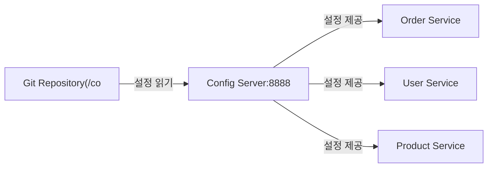

100개의 마이크로서비스에 DB 비밀번호를 바꿔야 한다면? 각 서비스마다 설정 파일을 수정하고 재배포하면 수십 분이 걸린다. Spring Cloud Config는 모든 서비스의 설정을 한 곳에서 관리하고, 재배포 없이 런타임에 반영하는 중앙 집중 설정 관리 솔루션이다.

> **비유**: 대기업 인사팀(Config Server)이 회사 규정집(설정)을 관리한다. 각 부서(마이크로서비스)는 자체 규정집을 갖지 않고 인사팀에 물어본다. 규정이 바뀌면 인사팀만 수정하면 되고, 각 부서에 공지(refresh)를 보내면 새 규정이 즉시 적용된다.

---

## 중앙 집중 설정 관리의 필요성

각 서비스가 설정 파일을 개별 관리하면 변경 시 재빌드·재배포가 필요하고, 환경별 설정 오염 위험이 있으며, 민감 정보가 코드베이스에 흩어진다.

Spring Cloud Config를 사용하면 Git 하나에서 모든 설정을 관리하고, 변경 이력을 추적하며, 재배포 없이 런타임에 반영할 수 있다.



---

## Config Server 구성

```java
@SpringBootApplication
@EnableConfigServer
public class ConfigServerApplication {
    public static void main(String[] args) {
        SpringApplication.run(ConfigServerApplication.class, args);
    }
}
```

```yaml
server:
  port: 8888

spring:
  cloud:
    config:
      server:
        git:
          uri: https://github.com/your-org/config-repo
          default-label: main
          basedir: /tmp/config-repo
          search-paths: '{application}'
          username: ${GIT_USERNAME}
          password: ${GIT_TOKEN}
          force-pull: true
          clone-on-start: true
```

---

## 설정 파일 구조 (Git 저장소)

Config Server는 파일명 패턴으로 설정을 분류한다. 우선순위가 높은 것이 낮은 것을 덮어쓴다.

```
config-repo/
├── application.yml              # 모든 서비스 공통 설정
├── application-prod.yml         # 모든 서비스 prod 환경 공통
├── order-service.yml            # order-service 전용 (모든 환경)
├── order-service-dev.yml        # order-service dev 환경
└── order-service-prod.yml       # order-service prod 환경
```

**설정 우선순위 (높음 → 낮음)**:
1. `{application}-{profile}.yml` (order-service-prod.yml)
2. `{application}.yml` (order-service.yml)
3. `application-{profile}.yml` (application-prod.yml)
4. `application.yml` (전체 공통)

클라이언트는 이 네 파일을 모두 읽어 병합한다. 같은 키가 있으면 우선순위가 높은 것이 적용된다.

---

## Config Client 구성

### Spring Boot 3.x

```yaml
spring:
  application:
    name: order-service
  config:
    import: "configserver:http://localhost:8888"
  cloud:
    config:
      profile: prod
      fail-fast: true       # Config Server 연결 실패 시 즉시 종료
      retry:
        max-attempts: 6
        initial-interval: 1000
        multiplier: 1.1
        max-interval: 2000
```

`fail-fast: true`는 Config Server에 연결되지 않으면 애플리케이션을 시작하지 않는다. 잘못된 설정으로 서비스가 기동되는 것을 방지한다.

---

## 런타임 설정 갱신 (@RefreshScope)

`@RefreshScope`가 붙은 Bean은 `POST /actuator/refresh` 호출 시 재생성된다. 재생성 과정에서 Config Server에서 최신 설정을 다시 읽어온다.

```java
@RestController
@RefreshScope  // POST /actuator/refresh 호출 시 이 Bean이 재생성됨
public class OrderController {

    @Value("${order.max-items:10}")
    private int maxItems;

    @Value("${order.discount-rate:0.0}")
    private double discountRate;

    @GetMapping("/config")
    public Map<String, Object> getConfig() {
        return Map.of(
            "maxItems", maxItems,
            "discountRate", discountRate
        );
    }
}
```

```bash
# Git에 설정 변경 후 커밋
git commit -m "change order.max-items to 20"
git push

# 특정 서비스 인스턴스에 refresh 요청
curl -X POST http://order-service:8080/actuator/refresh
```

---

## Spring Cloud Bus (자동 전파)

인스턴스가 100개일 때 각각 `/actuator/refresh`를 호출하면 100번 호출해야 한다. Spring Cloud Bus는 메시지 브로커(RabbitMQ 또는 Kafka)를 통해 refresh 이벤트를 전체에 전파한다.

1️⃣ 개발자가 Git에 설정 변경 후 Config Server의 `/actuator/bus-refresh`를 1회만 호출한다
2️⃣ Config Server가 메시지 브로커에 `RefreshRemoteApplicationEvent`를 발행한다
3️⃣ 모든 클라이언트가 이벤트를 수신하고 Config Server에서 새 설정을 가져온다


---

## 설정 암호화

민감한 정보(DB 비밀번호, API 키)는 평문으로 Git에 저장하면 안 된다. Config Server는 대칭키/비대칭키 암호화를 지원한다.

```yaml
# Config Server application.yml
encrypt:
  key: my-secret-encryption-key-32chars
```

```bash
# 값 암호화
curl -X POST http://localhost:8888/encrypt -d "my-db-password"
# 결과: AQBxxx...암호화된문자열

# config-repo/order-service-prod.yml
spring:
  datasource:
    password: '{cipher}AQBxxx...암호화된문자열'  # {cipher} 접두사로 암호화된 값 표시
```

Config Server가 클라이언트에 설정을 제공할 때 자동으로 복호화한다.

---


## 극한 시나리오

### 시나리오 1: Config Server 장애

Config Server가 다운되면 `fail-fast: true` 클라이언트는 재시작 불가 상태가 된다.

```
대응 전략:
1. Config Server 다중화 (로드밸런서 뒤에 2개 이상)
2. 클라이언트 retry 설정으로 일시적 장애 흡수
3. 최후 수단: fail-fast=false + 로컬 application.yml 폴백
```

### 시나리오 2: 설정 변경 롤백

Git 기반이라 롤백이 간단하다.

```bash
git revert HEAD
git push

# Bus refresh로 전파
curl -X POST http://config-server:8888/actuator/bus-refresh
```

### 시나리오 3: @RefreshScope 사용 불가 영역

```java
// @RefreshScope는 Spring Bean에만 적용됨
// DataSource, @Scheduled, static 필드는 refresh 불가

// 해결책: 런타임에 동적으로 값을 읽는 구조
@Service
public class OrderService {

    @Autowired
    private Environment environment;

    public double getFeeRate() {
        // 매 호출마다 최신 설정값을 읽음
        return Double.parseDouble(
            environment.getProperty("order.fee-rate", "0.03")
        );
    }
}
```

### 시나리오 4: 환경별 설정 오염 방지

prod 설정에 실수로 dev DB 연결 정보가 들어가면 심각한 문제가 된다.

```
권장 패턴:
config-repo/
├── shared/application.yml        # 진짜 공통 설정만
├── services/order-service/
│   ├── application.yml           # dev 기본값
│   ├── application-staging.yml
│   └── application-prod.yml      # 암호화된 민감 정보
└── secrets/application-prod.yml  # 암호화된 민감 정보만

→ 환경별 디렉토리 분리 + PR 리뷰 필수
```

---
## Config Server 보안

Config Server 자체는 민감한 정보를 제공하므로 반드시 보안을 적용해야 한다.

```yaml
# Config Server에 Basic Auth 적용
spring:
  security:
    user:
      name: config-admin
      password: ${CONFIG_SERVER_PASSWORD}
```

추가 보안 권장사항:
- Config Server는 내부 네트워크에만 노출 (인터넷 직접 접근 차단)
- Git 토큰은 read-only 최소 권한
- 암호화되지 않은 민감 정보는 절대 Git에 커밋 금지
- 감사 로그: Git history로 누가 언제 무엇을 변경했는지 추적

---

## 왜 이 기술인가?

| 방식 | 중앙화 | 동적 갱신 | 암호화 | 적합한 상황 |
|---|---|---|---|---|
| application.yml (로컬) | X | X | X | 단일 서비스, 개발 환경 |
| Spring Cloud Config | O | O (@RefreshScope) | O (JCE) | 다수 서비스, 설정 통합 관리 |
| Kubernetes ConfigMap | O | 제한적 | X | K8s 전용 환경 |
| HashiCorp Vault | O | O | O (전용) | 시크릿 전문 관리 |
| AWS Parameter Store | O | O | O (KMS) | AWS 환경 |

**결론:** Spring 기반 마이크로서비스에서는 Spring Cloud Config가 가장 자연스러운 통합을 제공한다. Git을 백엔드로 사용하면 변경 이력 추적과 PR 리뷰가 가능해 감사(audit) 요건을 충족한다.

---

## 실무에서 자주 하는 실수

1. **`@RefreshScope` 없이 동적 갱신 기대** — `/actuator/refresh`를 호출해도 `@Value`를 주입받은 빈은 갱신되지 않는다. 동적 갱신이 필요한 빈에는 반드시 `@RefreshScope`를 붙여야 한다. 단, `@RefreshScope` 빈은 첫 호출 시 재생성되어 초기화 비용이 발생한다.

2. **민감 정보를 암호화 없이 Git에 저장** — DB 비밀번호, API Key를 평문으로 Git에 커밋하면 이력에 영구 기록된다. `{cipher}` 접두사와 대칭/비대칭 키 암호화를 반드시 적용해야 한다.

3. **Config Server 단일 인스턴스 운영** — Config Server가 단일 장애점이 된다. 모든 서비스 시작 시 Config Server에 의존하므로, Config Server 다운 시 전체 서비스 재시작이 불가능해진다. HA 구성(2개 이상 + Eureka 등록)이 필수다.

4. **Spring Cloud Bus 없이 다수 인스턴스 갱신 시도** — 인스턴스가 10개라면 10번 `/actuator/refresh`를 호출해야 한다. Spring Cloud Bus + Kafka/RabbitMQ로 단 한 번의 호출로 모든 인스턴스를 갱신해야 한다.

5. **`bootstrap.yml` vs `application.yml` 우선순위 혼동** — Spring Cloud에서 `bootstrap.yml`은 `application.yml`보다 먼저 로드된다. Config Server URL 설정을 `application.yml`에 두면 Config 로드 전에 이미 `application.yml`이 처리되어 Config Server를 찾지 못한다.

---

## 면접 포인트

**Q1. Spring Cloud Config의 설정 파일 우선순위는?**
> 높음 → 낮음: `application-{profile}.yml` (Config Server) > `application.yml` (Config Server) > `application-{profile}.yml` (로컬) > `application.yml` (로컬). Config Server의 설정이 로컬을 오버라이드한다.

**Q2. `@RefreshScope`의 동작 원리는?**
> `@RefreshScope` 빈은 Spring의 커스텀 스코프로 등록된다. `/actuator/refresh` 호출 시 해당 스코프의 캐시가 무효화되고, 다음 빈 접근 시 새 프로퍼티 값으로 재생성된다. `@ConfigurationProperties`는 `@RefreshScope` 없이도 갱신되지만 바인딩 빈 자체는 재생성된다.

**Q3. Config Server의 Git 백엔드에서 설정 파일 이름 규칙은?**
> `{application}-{profile}.yml` 형식이다. 예: `order-service-prod.yml`. `application.yml`은 모든 서비스의 공통 설정이고, `{application}.yml`은 특정 서비스 전용이다. Config Server는 공통 + 서비스별 설정을 병합해 반환한다.

**Q4. Config Server에서 민감 정보를 어떻게 암호화하는가?**
> `encrypt.key`(대칭) 또는 키 페어(비대칭)를 Config Server에 설정하고, `POST /encrypt` 엔드포인트로 값을 암호화한다. Git에는 `password: '{cipher}암호화된값'`으로 저장한다. 클라이언트 수신 시 자동 복호화된다.

**Q5. Config Server 없이 서비스가 시작될 수 있게 하려면?**
> `spring.cloud.config.fail-fast=false`로 설정하면 Config Server 연결 실패 시 로컬 설정으로 폴백한다. 운영 환경에서는 `fail-fast=true`로 설정해 잘못된 설정으로 서비스가 시작되는 것을 방지하는 것이 권장된다.
