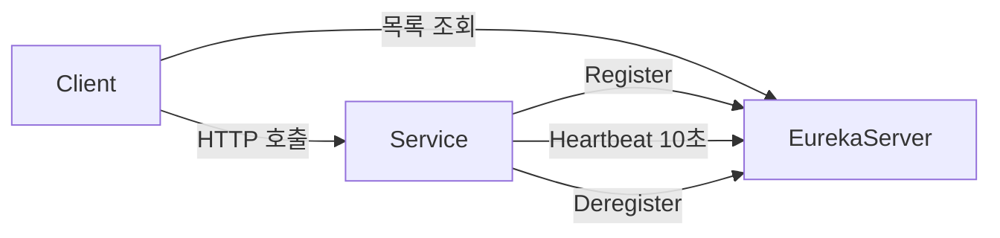
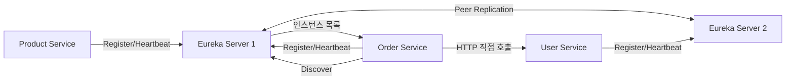
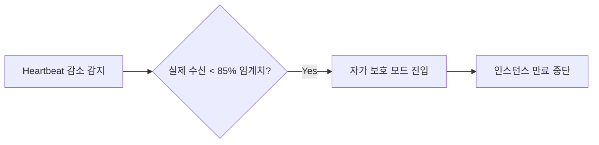
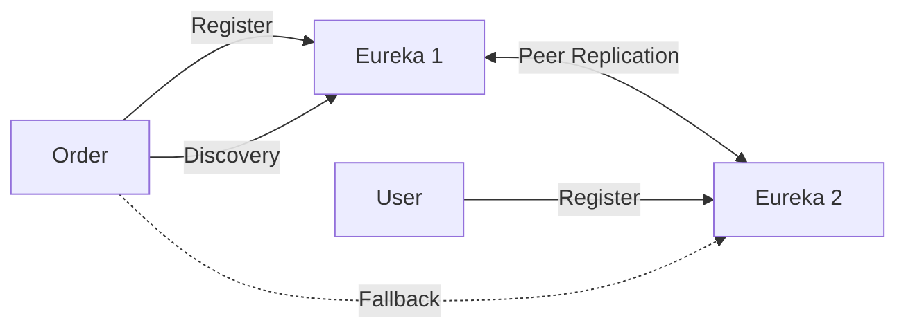

마이크로서비스 환경에서 서비스들은 동적으로 생성·삭제·이동된다. IP와 포트를 하드코딩하면 배포할 때마다 설정을 바꿔야 한다. Spring Cloud Eureka는 이 문제를 해결하는 Service Discovery 솔루션이다. 서비스가 스스로 자신의 위치를 등록하고, 호출자는 이름으로 찾는다.

> **비유**: 넷플릭스 본사 전화번호부(Eureka Server)가 있다. 각 팀(마이크로서비스)이 출근하면 전화번호부에 자기 자리와 번호를 등록한다(자가 등록). 다른 팀이 연락하고 싶으면 전화번호부에서 이름으로 찾으면 된다(Service Discovery). 팀이 자리를 비우면 전화번호부에서 삭제된다(자가 해제).

---

## Service Discovery란?

전통적인 단일 서버 환경에서는 IP가 고정돼 있어 문제가 없었다. 하지만 MSA + 컨테이너 환경에서는 서비스 인스턴스가 수시로 바뀐다.

하드코딩된 IP를 사용하면 재배포 시 IP가 변경될 때 장애가 발생한다. Service Discovery를 사용하면 서비스 이름으로 호출하므로 인스턴스 위치 변경에 자동으로 대응한다.

1️⃣ **자가 등록**: 서비스 인스턴스가 시작할 때 Eureka Server에 자신의 정보(IP, Port, 서비스명)를 등록한다
2️⃣ **서비스 조회**: 호출자가 Eureka Server에 서비스 이름으로 인스턴스 목록을 요청한다
3️⃣ **클라이언트 사이드 로드밸런싱**: 받은 인스턴스 목록 중 하나를 선택해 직접 호출한다
4️⃣ **Heartbeat**: 인스턴스가 살아있음을 주기적으로 알린다



---

## Eureka 아키텍처



---

## Eureka Server 구성

```xml
<dependency>
    <groupId>org.springframework.cloud</groupId>
    <artifactId>spring-cloud-starter-netflix-eureka-server</artifactId>
</dependency>
```

```java
@SpringBootApplication
@EnableEurekaServer
public class EurekaServerApplication {
    public static void main(String[] args) {
        SpringApplication.run(EurekaServerApplication.class, args);
    }
}
```

```yaml
server:
  port: 8761

eureka:
  instance:
    hostname: localhost
  client:
    # 서버 자신은 레지스트리에 등록하지 않음
    register-with-eureka: false
    fetch-registry: false
  server:
    enable-self-preservation: false  # 개발 환경: 빠른 인스턴스 정리
    eviction-interval-timer-in-ms: 5000
```

---

## Eureka Client 구성

```yaml
server:
  port: 8080

spring:
  application:
    name: order-service  # 레지스트리에 등록될 이름

eureka:
  instance:
    prefer-ip-address: true  # 컨테이너 환경에서 중요
    lease-renewal-interval-in-seconds: 10   # Heartbeat 전송 주기
    lease-expiration-duration-in-seconds: 30 # 이 시간 내 Heartbeat 없으면 만료
    instance-id: ${spring.application.name}:${server.port}
  client:
    register-with-eureka: true
    fetch-registry: true
    service-url:
      defaultZone: http://localhost:8761/eureka/
    registry-fetch-interval-seconds: 5  # 레지스트리 갱신 주기
```

---

## 로드밸런싱 (Spring Cloud LoadBalancer 연동)

Eureka에서 인스턴스 목록을 가져와 클라이언트 사이드 로드밸런싱을 수행한다.

```java
@Configuration
public class RestTemplateConfig {

    @Bean
    @LoadBalanced  // 이 어노테이션 하나로 Eureka + 로드밸런싱 활성화
    public RestTemplate restTemplate() {
        return new RestTemplate();
    }
}

@Service
public class OrderService {

    public UserDto getUser(Long userId) {
        // IP:Port 대신 서비스 이름으로 호출
        return restTemplate.getForObject(
            "http://user-service/users/" + userId,  // Spring Cloud LoadBalancer가 실제 주소로 변환
            UserDto.class
        );
    }
}
```

```java
// FeignClient 방식
@FeignClient(name = "user-service")  // Eureka 서비스 이름
public interface UserServiceClient {

    @GetMapping("/users/{userId}")
    UserDto getUser(@PathVariable Long userId);
}
```

---

## 자가 보호 모드 (Self-Preservation Mode)

Eureka Server의 중요한 특성이다. 네트워크 장애로 인해 Heartbeat가 일시적으로 감소했을 때, 멀쩡한 인스턴스를 대거 제거하지 않도록 보호한다.

기대 Heartbeat 수보다 실제 수신량이 85% 미만이 되면 자가 보호 모드에 진입한다. 이 모드에서는 인스턴스 만료/제거가 중단된다. 네트워크가 복구되면 자동으로 해제된다.



이는 Eureka가 AP(Available + Partition-tolerant) 시스템임을 보여준다. 네트워크 파티션 상황에서 일관성보다 가용성을 선택한다.

---

## Eureka Server 고가용성 (HA 구성)

단일 Eureka Server는 SPOF가 된다. 프로덕션에서는 최소 2개 이상의 Peer를 구성한다.

```yaml
# eureka-server-1 (포트 8761)
eureka:
  instance:
    hostname: eureka-server-1
  client:
    register-with-eureka: true   # 피어에게 자신을 등록
    fetch-registry: true
    service-url:
      defaultZone: http://eureka-server-2:8762/eureka/  # 피어 서버 지정

# eureka-server-2 (포트 8762)
eureka:
  instance:
    hostname: eureka-server-2
  client:
    service-url:
      defaultZone: http://eureka-server-1:8761/eureka/
```

```yaml
# 클라이언트: 두 서버 모두 등록
eureka:
  client:
    service-url:
      defaultZone: http://eureka-server-1:8761/eureka/,http://eureka-server-2:8762/eureka/
```



---

## 클라이언트 사이드 캐시

Eureka Client는 서버에서 받은 레지스트리를 로컬에 캐시한다. 서버가 잠시 다운돼도 클라이언트는 캐시로 서비스 호출을 계속할 수 있다.

```
캐시 레이어:
Eureka Server
  ↓ 5초마다 fetch (설정값)
Eureka Client 로컬 캐시
  ↓ 서비스 호출 시 참조
로드밸런서 (Spring Cloud LoadBalancer)
```

---


## 극한 시나리오

### 시나리오 1: Eureka Server 전체 장애

Eureka는 AP 시스템이다. 서버가 모두 다운돼도 클라이언트는 로컬 캐시로 수분간 서비스 호출을 계속할 수 있다. Eureka가 재기동하면 클라이언트가 자동으로 재등록한다.

Circuit Breaker와 Retry를 함께 사용하면 일시적 오류를 흡수할 수 있다.

### 시나리오 2: 배포 시 Graceful Shutdown

```java
// 배포 전 인스턴스를 OUT_OF_SERVICE로 변경 → 새 트래픽 차단 후 기존 요청 처리 완료
@PostMapping("/actuator/out-of-service")
public void outOfService() {
    eurekaClient.getApplicationInfoManager()
        .setInstanceStatus(InstanceStatus.OUT_OF_SERVICE);
}
```

### 시나리오 3: 네트워크 파티션 (Split Brain)

두 Eureka Server가 서로 통신 불가 상태가 되면 각자 다른 레지스트리를 갖게 된다. Eureka는 AP를 선택하므로 불완전한 정보라도 서비스를 계속 제공한다. 파티션이 해소되면 자동으로 수렴한다.

일관성이 중요한 경우 Consul(CP), ZooKeeper(CP)를 대안으로 고려할 수 있다.

---
## Kubernetes 환경에서 Eureka

K8s 내부 통신에는 K8s Service(ClusterIP)가 자체 Service Discovery를 제공한다. 단일 K8s 클러스터에서는 Eureka 없이 K8s Service를 사용하는 것이 권장된다. 하이브리드(온프레미스 + 클라우드) 또는 멀티 클러스터 환경에서는 Eureka가 여전히 유효하다.

---

## 왜 이 기술인가?

| 방식 | 유형 | Spring 통합 | 적합한 상황 |
|---|---|---|---|
| Spring Cloud Eureka | Client-side discovery | 완벽 | Spring 마이크로서비스 |
| Kubernetes Service | Server-side discovery | 없음 (자체 제공) | K8s 전용 환경 |
| Consul | Client-side + Health Check | 좋음 | 다언어 서비스, 헬스체크 강화 |
| AWS Cloud Map | Server-side (관리형) | 없음 | AWS 환경 |
| Nacos | Client-side + Config | 좋음 | Alibaba 클라우드 생태계 |

**결론:** 순수 Spring 마이크로서비스 환경에서는 Eureka가 가장 간단하다. K8s 환경에서는 K8s Service가 Eureka 역할을 대체하므로 Eureka가 불필요해진다. 하이브리드 환경에서는 여전히 유효하다.

---

## 실무에서 자주 하는 실수

1. **Self-Preservation Mode를 운영에서 비활성화** — `enable-self-preservation: false`로 설정하면 네트워크 파티션 상황에서 Eureka가 정상 인스턴스도 제거해버린다. Self-Preservation은 실제 장애와 네트워크 문제를 구분하기 위한 안전장치이므로 운영에서는 기본값(활성화)을 유지해야 한다.

2. **Eureka Client 캐시 TTL 무시** — Eureka 클라이언트는 레지스트리를 30초마다 갱신한다. 인스턴스가 다운되어도 최대 90초(heartbeat 3번 미수신) 동안 레지스트리에 남아 있다. 이 시간 동안 요청이 다운된 인스턴스로 전달될 수 있으므로 Circuit Breaker와 함께 사용해야 한다.

3. **단일 Eureka Server 운영** — Eureka Server가 단일 장애점이 된다. Eureka는 피어 복제(peer replication)를 지원하므로, 반드시 2개 이상의 서버를 서로 등록해 HA를 구성해야 한다.

4. **인스턴스 IP 대신 hostname 등록** — 컨테이너 환경에서 hostname이 컨테이너 ID로 등록되면 외부에서 접근할 수 없다. `prefer-ip-address: true`와 `instance-id: ${spring.application.name}:${spring.cloud.client.ip-address}:${server.port}`를 설정해야 한다.

5. **헬스체크 없이 Eureka에만 의존** — Eureka의 기본 헬스체크는 heartbeat만 확인한다. DB 연결 실패나 외부 의존성 장애로 서비스가 비정상이어도 Eureka에는 UP으로 표시된다. Spring Boot Actuator의 `/actuator/health`를 Eureka 헬스체크로 연동해야 한다.

---

## 면접 포인트

**Q1. Eureka의 Self-Preservation Mode란?**
> 일정 시간 동안 예상보다 적은 heartbeat가 수신되면(기본: 15분 내 85% 이하), Eureka는 네트워크 파티션으로 판단하고 인스턴스 제거를 중단한다. 실제 장애 인스턴스도 레지스트리에 남지만, 정상 인스턴스가 잘못 제거되는 것을 방지한다.

**Q2. Client-side Discovery와 Server-side Discovery의 차이는?**
> Client-side(Eureka): 클라이언트가 레지스트리에서 인스턴스 목록을 가져와 직접 로드밸런싱한다. 레지스트리 캐시 불일치 문제가 있다. Server-side(K8s Service, AWS ALB): 클라이언트는 고정 주소로 요청하고, 인프라가 로드밸런싱한다. 클라이언트가 단순하지만 인프라 의존성이 생긴다.

**Q3. Eureka에 등록된 인스턴스가 다운됐을 때 얼마나 빨리 제거되는가?**
> 기본 설정: heartbeat 간격 30초 × 3번 미수신 = 최대 90초. `lease-renewal-interval-in-seconds`와 `lease-expiration-duration-in-seconds`를 줄이면 더 빨리 감지할 수 있지만, 일시적 네트워크 지연으로 인한 오탐이 증가한다.

**Q4. Spring Cloud LoadBalancer와 Ribbon의 차이는?**
> Ribbon은 Netflix OSS 기반으로 유지보수가 종료됐다. Spring Cloud LoadBalancer는 Spring 팀이 관리하는 반응형 로드밸런서로, Reactor 기반이고 WebClient와 자연스럽게 통합된다. Spring Cloud 2020 이후 Ribbon 대신 표준으로 채택됐다.

**Q5. Eureka 없이 서비스가 시작될 수 있게 하려면?**
> `spring.cloud.discovery.enabled=false` 또는 `eureka.client.register-with-eureka=false`, `eureka.client.fetch-registry=false`로 설정한다. 개발 환경에서 Eureka 없이 직접 URL로 테스트할 때 유용하다.
