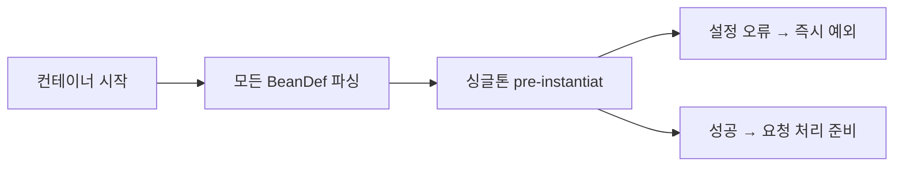
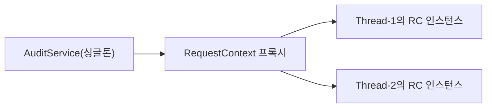

신입 때 `new RateDiscountPolicy()`를 서비스 클래스 내부에 직접 박아뒀다가, 기획 변경 한 번에 수십 개 파일을 열어야 했던 경험이 있을 것이다. IoC와 DI는 그 고통을 제거하기 위한 개념이 아니라, **객체 설계 철학의 전환**이다. 이 글은 "어떻게 쓰는가"가 아니라 "왜 이렇게 동작하는가"에 답한다.

---

## 1. IoC(Inversion of Control): 제어의 역전이 왜 필요한가

### Hollywood Principle

IoC의 본질은 Hollywood Principle이다: **"Don't call us, we'll call you."**

전통적 프로그래밍에서는 개발자 코드가 라이브러리를 호출한다. 프레임워크(IoC)에서는 반대다. 프레임워크가 개발자 코드를 호출한다. 개발자는 특정 계약(인터페이스, 어노테이션)을 지키기만 하면, 생성·연결·소멸의 타이밍은 프레임워크가 결정한다.

```java
// 전통 방식: 개발자가 라이브러리를 호출
public class OrderService {
    private final DiscountPolicy discountPolicy;

    public OrderService() {
        // 개발자가 직접 구체 클래스를 선택하고 생성
        // OrderService가 DiscountPolicy 구현체를 "알아야" 한다
        this.discountPolicy = new RateDiscountPolicy(); // 강한 결합
    }
}

// IoC 방식: 프레임워크가 개발자 코드를 호출
@Service
public class OrderService {
    private final DiscountPolicy discountPolicy;

    // 어떤 구현체가 들어올지 OrderService는 모른다
    // Spring이 "적절한 구현체"를 찾아 생성자를 호출한다
    public OrderService(DiscountPolicy discountPolicy) {
        this.discountPolicy = discountPolicy;
    }
}
```

### 왜 제어를 역전해야 하는가: 세 가지 이유

**이유 1 - 테스트 가능성(Testability)**

`new RateDiscountPolicy()`가 생성자 내부에 있으면, 단위 테스트에서 Mock으로 교체할 방법이 없다. 테스트마다 실제 DB, 실제 결제 모듈이 필요해진다. 제어를 외부로 넘기면 테스트 코드가 Mock을 주입할 수 있다.

```java
// 테스트 코드에서 Mock 주입 가능
DiscountPolicy mockPolicy = mock(DiscountPolicy.class);
given(mockPolicy.discount(any())).willReturn(1000);

OrderService sut = new OrderService(mockRepoistory, mockPolicy);
// 실제 DB, 실제 결제 없이 OrderService 로직만 검증
```

**이유 2 - 느슨한 결합(Loose Coupling)**

`OrderService`가 `RateDiscountPolicy`를 직접 알면, `FixDiscountPolicy`로 바꿀 때 `OrderService`도 수정해야 한다. OCP(Open/Closed Principle) 위반이다. IoC를 적용하면 `OrderService`는 `DiscountPolicy` 인터페이스만 알고, 구현체 교체는 설정만 바꾸면 된다.

**이유 3 - OCP(Open/Closed Principle) 준수**

```java
// 설정 클래스만 바꾸면 된다. OrderService 코드는 건드리지 않는다.
@Configuration
public class AppConfig {
    @Bean
    public DiscountPolicy discountPolicy() {
        // return new RateDiscountPolicy(); // 이전
        return new FixDiscountPolicy();     // 변경
    }
}
```

### IoC 컨테이너의 실체

Spring IoC 컨테이너의 핵심은 `BeanDefinition`의 레지스트리다. 컨테이너는 두 가지 역할만 한다.

1. **메타데이터 읽기**: 어노테이션, XML, Java Config에서 "어떤 클래스를 어떤 방식으로 만들 것인가"를 읽어 `BeanDefinition`으로 변환
2. **인스턴스 관리**: `BeanDefinition`을 기반으로 객체를 생성하고, 의존성을 연결하고, 생명주기를 관리


---

## 2. BeanDefinition: 객체의 설계도

Spring은 Bean을 생성하기 전에 반드시 그 Bean의 **설계도(BeanDefinition)**를 먼저 만든다. 이것이 Spring의 유연성의 근원이다.

### BeanDefinition이 담는 정보

```java
// BeanDefinition의 핵심 속성들 (개념적 표현)
public interface BeanDefinition {
    String getBeanClassName();           // 실제 클래스명
    String getScope();                   // singleton / prototype 등
    boolean isLazyInit();                // 지연 초기화 여부
    String[] getDependsOn();             // 명시적 의존 순서
    ConstructorArgumentValues getConstructorArgumentValues(); // 생성자 인자
    MutablePropertyValues getPropertyValues();                // 프로퍼티 값
    String getInitMethodName();          // init-method
    String getDestroyMethodName();       // destroy-method
    boolean isPrimary();                 // @Primary 여부
}
```

### 왜 BeanDefinition이 필요한가

인스턴스를 바로 만들지 않고 메타데이터를 먼저 분리하는 이유는 **처리 파이프라인**을 끼워 넣을 공간이 필요하기 때문이다. `BeanFactoryPostProcessor`가 바로 이 시점에 개입한다. 예를 들어 `PropertySourcesPlaceholderConfigurer`는 `BeanDefinition` 안의 `${db.url}` 같은 플레이스홀더를 실제 값으로 치환한다. 인스턴스를 먼저 만들어버리면 이런 조작이 불가능하다.

```java
// BeanFactoryPostProcessor: BeanDefinition을 조작하는 훅
@Component
public class CustomBeanFactoryPostProcessor implements BeanFactoryPostProcessor {
    @Override
    public void postProcessBeanFactory(ConfigurableListableBeanFactory beanFactory) {
        // 이 시점: BeanDefinition은 모두 파싱됨, 인스턴스는 아직 하나도 없음
        BeanDefinition bd = beanFactory.getBeanDefinition("orderService");
        // 메타데이터를 동적으로 조작할 수 있다
        bd.getPropertyValues().add("maxRetry", 5);
    }
}
```

### Component Scanning과 ASM

`@ComponentScan`이 동작하면 Spring은 지정한 패키지를 탐색해 `@Component` 계열 어노테이션이 붙은 클래스를 찾는다. 이때 **리플렉션을 사용하지 않고 ASM(Java bytecode manipulation library)을 사용**한다.

왜 ASM인가? 리플렉션으로 클래스를 로드하면 **그 클래스가 JVM 메모리에 올라간다**. 수백 개의 클래스를 스캔할 때 리플렉션을 쓰면 어노테이션이 없는 클래스까지 모두 로드되어 메모리가 낭비된다. ASM은 `.class` 파일을 바이트코드 레벨에서 읽어 어노테이션 여부를 확인한 후, 실제로 필요한 클래스만 JVM에 로드한다.

```
스캔 과정:
1. ClassPathScanningCandidateComponentProvider가 패키지 내 .class 파일 열거
2. ASM의 ClassReader로 바이트코드 파싱 → 어노테이션 메타데이터 추출
3. @Component 계열이면 ScannedGenericBeanDefinition 생성
4. BeanDefinitionRegistry에 등록
5. 이후 실제 Class 로딩
```

---

## 3. BeanFactory vs ApplicationContext: 왜 ApplicationContext를 써야 하는가

### BeanFactory: 기본 계약

```java
public interface BeanFactory {
    Object getBean(String name) throws BeansException;
    <T> T getBean(String name, Class<T> requiredType) throws BeansException;
    <T> T getBean(Class<T> requiredType) throws BeansException;
    boolean containsBean(String name);
    boolean isSingleton(String name) throws NoSuchBeanDefinitionException;
    boolean isPrototype(String name) throws NoSuchBeanDefinitionException;
    Class<?> getType(String name) throws NoSuchBeanDefinitionException;
}
```

`BeanFactory`는 **Lazy Loading** 방식이다. `getBean()`이 호출되는 순간 처음으로 인스턴스를 생성한다. 메모리 측면에서는 효율적이지만, 설정 오류가 런타임 첫 호출 시점에 발견된다. 프로덕션 배포 후 첫 요청에서 `BeanCreationException`이 터지는 상황이 된다.

### ApplicationContext: 왜 Eager Loading인가

```java
public interface ApplicationContext extends
    EnvironmentCapable,          // 환경 프로파일, 프로퍼티 접근
    ListableBeanFactory,         // 여러 Bean을 목록으로 조회
    HierarchicalBeanFactory,     // 부모 컨테이너 계층 (WebMVC의 Root/Child 컨텍스트)
    MessageSource,               // i18n 메시지
    ApplicationEventPublisher,   // 이벤트 발행/구독
    ResourcePatternResolver {    // classpath:, file:, http: 리소스 해석
}
```

`ApplicationContext`는 컨테이너 시작 시점에 **모든 싱글톤 Bean을 미리 생성(Eager Loading)**한다. 이것이 핵심 설계 결정이다.

**Eager Loading의 이유:**

1. **Fail Fast**: 설정 오류를 배포 직후 즉시 발견. 사용자 요청이 들어오기 전에 시스템이 죽는다. 모니터링이 잡아주고, 롤백할 수 있다.
2. **예측 가능한 응답 시간**: 첫 요청부터 Bean이 이미 준비되어 있으므로 지연 없음. 웜업(warmup)이 필요 없다.
3. **초기화 순서 보장**: 모든 Bean의 의존성 그래프를 시작 시점에 해결하므로 순환 참조 감지가 가능하다.



### ApplicationContext 추가 기능이 중요한 이유

**MessageSource (i18n)**: `@Autowired MessageSource messageSource`를 통해 Locale에 따른 메시지를 가져온다. Spring MVC의 `DispatcherServlet`이 이것을 자동으로 활용한다.

**ApplicationEventPublisher**: Bean 간 직접 의존 없이 이벤트로 통신할 수 있다. 순환 참조 문제를 이벤트 기반으로 풀 수 있는 것도 이 기능 덕분이다.

```java
// 이벤트 발행 (OrderService → 직접 NotificationService를 알 필요 없음)
@Service
public class OrderService {
    private final ApplicationEventPublisher eventPublisher;

    public void createOrder(Order order) {
        orderRepository.save(order);
        eventPublisher.publishEvent(new OrderCreatedEvent(order)); // 간접 통신
    }
}

// 이벤트 구독
@Component
public class NotificationService {
    @EventListener
    public void onOrderCreated(OrderCreatedEvent event) {
        // 알림 발송
    }
}
```

---

## 4. Bean 생명주기: 각 단계가 존재하는 이유

Bean 생명주기는 단순히 "생성 → 사용 → 소멸"이 아니다. 각 콜백 단계는 명확한 존재 이유가 있다.

### 전체 생명주기 순서

```
1. BeanDefinition 읽기 (ASM 스캔 또는 @Configuration 파싱)
2. BeanFactoryPostProcessor 실행 (BeanDefinition 조작)
3. Bean 인스턴스화 (생성자 호출)
4. 프로퍼티 주입 (setter DI, 필드 DI)
5. BeanNameAware.setBeanName()
6. BeanFactoryAware.setBeanFactory()
7. ApplicationContextAware.setApplicationContext()
8. BeanPostProcessor.postProcessBeforeInitialization()  ← @PostConstruct 처리 포함
9. InitializingBean.afterPropertiesSet()
10. @Bean(initMethod = "...") 또는 init-method
11. BeanPostProcessor.postProcessAfterInitialization()  ← AOP 프록시 생성 포함
12. Bean 사용 (애플리케이션 실행)
13. @PreDestroy
14. DisposableBean.destroy()
15. @Bean(destroyMethod = "...") 또는 destroy-method
```

### 각 단계가 왜 존재하는가

**3단계: 인스턴스화**

생성자가 호출된다. 생성자 주입은 이 시점에 의존성이 함께 주입된다. 중요한 것은 이 시점까지는 `ApplicationContext`가 아직 완전히 초기화되지 않았을 수 있다는 점이다.

**5~7단계: Aware 인터페이스**

Bean이 자신이 속한 컨테이너 정보를 필요로 할 때 사용한다.

```java
@Component
public class MyBean implements ApplicationContextAware, BeanNameAware {
    private ApplicationContext context;
    private String beanName;

    @Override
    public void setBeanName(String name) {
        this.beanName = name; // "myBean" - 5단계
    }

    @Override
    public void setApplicationContext(ApplicationContext ctx) {
        this.context = ctx;   // ApplicationContext 참조 획득 - 7단계
    }
}
```

`ApplicationContextAware`가 7단계인 이유: `BeanNameAware(5) → BeanFactoryAware(6) → ApplicationContextAware(7)` 순서는 **추상화 수준이 낮은 것부터 높은 것 순**이다. `BeanFactory`가 `ApplicationContext`의 기반이기 때문에 먼저 설정된다.

**8단계: BeanPostProcessor.postProcessBeforeInitialization**

`@PostConstruct`는 사실 `CommonAnnotationBeanPostProcessor`(BeanPostProcessor 구현체)가 8단계에서 처리한다. `@PostConstruct` 메서드를 리플렉션으로 호출하는 것이 이 시점이다.

왜 인스턴스화(3단계)보다 늦는가? setter/필드 주입(4단계)이 완료된 후여야 모든 의존성이 주입된 상태임이 보장되기 때문이다. `@PostConstruct`에서 주입된 의존성을 사용해 초기화 작업을 할 수 있는 이유다.

**9단계: InitializingBean.afterPropertiesSet vs 8단계 @PostConstruct**

두 가지가 모두 있는 이유는 역사적이다. `InitializingBean`은 Spring 초기부터 있었다. 나중에 JSR-250 표준으로 `@PostConstruct`가 도입됐다. 현재는 `@PostConstruct`를 권장하는데, Spring 인터페이스에 의존하지 않아 POJO에 가깝기 때문이다.

**11단계: BeanPostProcessor.postProcessAfterInitialization — AOP 프록시의 탄생 시점**

이 단계가 가장 중요하다. **Spring AOP 프록시는 여기서 만들어진다.**

`AbstractAutoProxyCreator`(BeanPostProcessor 구현체)가 각 Bean을 검사해 어드바이스 대상인지 확인한다. 대상이면 CGLIB 또는 JDK Dynamic Proxy로 프록시 객체를 만들어 원본 Bean 대신 반환한다. 컨테이너에 등록되는 것은 원본 Bean이 아니라 프록시다.

```java
// postProcessAfterInitialization의 개념적 구현
public Object postProcessAfterInitialization(Object bean, String beanName) {
    if (isProxyTarget(bean)) {
        // CGLIB 또는 JDK Dynamic Proxy 생성
        return createProxy(bean, beanName);  // 원본 대신 프록시 반환
    }
    return bean; // 어드바이스 대상 아니면 그대로
}
```

이것이 `@Transactional`이 동작하는 원리다. `@Transactional` 메서드가 있는 Bean은 트랜잭션 어드바이스를 적용한 프록시로 교체된다.

### 코드로 보는 전체 생명주기

```java
@Component
public class PaymentGateway
        implements InitializingBean, DisposableBean,
                   BeanNameAware, ApplicationContextAware {

    private final PaymentApiClient apiClient; // 생성자 주입 - 3단계에서 해결
    private String beanName;
    private ApplicationContext context;

    public PaymentGateway(PaymentApiClient apiClient) {
        // 3단계: 인스턴스화 + 생성자 주입 동시 발생
        this.apiClient = apiClient;
        System.out.println("3. 인스턴스화 완료");
    }

    @Override
    public void setBeanName(String name) {
        // 5단계: BeanNameAware
        this.beanName = name;
        System.out.println("5. setBeanName: " + name);
    }

    @Override
    public void setApplicationContext(ApplicationContext ctx) {
        // 7단계: ApplicationContextAware
        this.context = ctx;
        System.out.println("7. setApplicationContext");
    }

    @PostConstruct
    public void init() {
        // 8단계: BeanPostProcessor가 호출 (CommonAnnotationBeanPostProcessor)
        // 이 시점에 apiClient는 이미 주입 완료
        apiClient.connect();
        System.out.println("8. @PostConstruct: 연결 완료");
    }

    @Override
    public void afterPropertiesSet() throws Exception {
        // 9단계: InitializingBean (레거시, 비권장)
        System.out.println("9. afterPropertiesSet");
    }

    @PreDestroy
    public void shutdown() {
        // 13단계
        apiClient.disconnect();
        System.out.println("13. @PreDestroy: 연결 종료");
    }

    @Override
    public void destroy() throws Exception {
        // 14단계
        System.out.println("14. DisposableBean.destroy");
    }
}
```

### @PostConstruct를 생성자 대신 쓰는 이유

```java
@Component
public class ReportCache implements ApplicationContextAware {
    private ApplicationContext context;
    private List<Report> cachedReports;

    // 생성자에서 context.getBeansOfType()을 호출하면?
    public ReportCache() {
        // 이 시점에 context는 null! ApplicationContextAware 콜백은 아직 안 옴
        // this.cachedReports = context.getBeansOfType(Report.class); → NPE!
    }

    @Override
    public void setApplicationContext(ApplicationContext ctx) {
        this.context = ctx; // 7단계
    }

    @PostConstruct
    public void warmUp() {
        // 8단계: context가 이미 설정된 후
        this.cachedReports = new ArrayList<>(
            context.getBeansOfType(Report.class).values()
        ); // 안전
    }
}
```

---

## 5. DI 타입: 왜 생성자 주입이 최선인가

### 세 가지 주입 방식

**생성자 주입 (Constructor Injection) — 권장**

```java
@Service
public class OrderService {
    // final 선언 가능 → 불변성 보장
    private final OrderRepository orderRepository;
    private final DiscountPolicy discountPolicy;
    private final NotificationPort notificationPort;

    // 생성자 하나면 @Autowired 생략 가능 (Spring 4.3+)
    public OrderService(
            OrderRepository orderRepository,
            DiscountPolicy discountPolicy,
            NotificationPort notificationPort) {
        this.orderRepository = orderRepository;
        this.discountPolicy = discountPolicy;
        this.notificationPort = notificationPort;
    }

    public Order createOrder(Long itemId, int quantity) {
        // orderRepository, discountPolicy는 절대 null이 아님
        // final + 생성자 주입이 보장
        Item item = orderRepository.findItem(itemId);
        int discount = discountPolicy.discount(item.getPrice());
        return new Order(item, quantity, discount);
    }
}
```

**세터 주입 (Setter Injection)**

```java
@Service
public class ReportService {
    private ReportRepository reportRepository; // final 불가

    @Autowired
    public void setReportRepository(ReportRepository reportRepository) {
        this.reportRepository = reportRepository;
    }

    // reportRepository가 null일 수 있다
    // 의존성 주입 전에 메서드가 호출되면 NPE
}
```

세터 주입의 유일한 정당한 사용처: **선택적 의존성**. `required = false`와 함께 쓸 때.

```java
@Autowired(required = false)
public void setOptionalService(OptionalService optionalService) {
    this.optionalService = optionalService; // 없으면 null, 있으면 주입
}
```

**필드 주입 (Field Injection) — 비권장**

```java
@Service
public class UserService {
    @Autowired
    private UserRepository userRepository; // final 불가, 리플렉션으로 주입
}
```

### 왜 생성자 주입이 최선인가: 네 가지 이유

**이유 1 — 불변성(Immutability)**

`final` 키워드를 쓸 수 있다. 한 번 주입된 의존성은 이후 변경되지 않음이 컴파일러 수준에서 보장된다. 멀티스레드 환경에서 사이드 이펙트를 원천 차단한다.

```java
// 필드 주입은 final 불가 → 런타임에 누군가 교체할 수 있음
@Autowired
private DiscountPolicy discountPolicy; // 가변

// 생성자 주입은 final 가능 → 불변
private final DiscountPolicy discountPolicy; // 불변
```

**이유 2 — Null Safety**

필드 주입 Bean을 `new`로 생성하면 주입이 일어나지 않아 `null`이다. 생성자 주입은 `new`를 할 때 반드시 인자를 넘겨야 하므로 컴파일러가 잡는다.

```java
// 단위 테스트에서의 차이
// 필드 주입
OrderService service = new OrderService(); // orderRepository = null
service.createOrder(1L, 1); // NullPointerException, 이유 파악 어려움

// 생성자 주입
OrderService service = new OrderService(); // 컴파일 에러: 인자 필요
// 컴파일러: "OrderRepository, DiscountPolicy 인자가 없습니다"
OrderService service = new OrderService(mock(OrderRepository.class), mock(DiscountPolicy.class)); // OK
```

**이유 3 — 의존성 명시성(Explicit Dependencies)**

생성자 시그니처를 보면 이 클래스가 무엇에 의존하는지 한눈에 보인다. 의존성이 5개 이상이면 SRP 위반 신호다. 필드 주입은 의존성을 숨기므로 비대해진 클래스를 발견하기 어렵다.

```java
// 생성자 주입: 의존성 7개 → 즉각 리팩토링 신호
public OrderService(
    OrderRepository orderRepository,
    ItemRepository itemRepository,
    DiscountPolicy discountPolicy,
    NotificationPort notificationPort,
    AuditService auditService,
    CouponService couponService,
    InventoryService inventoryService // 너무 많다!
) { ... }
// → 이 클래스는 책임이 너무 많다. 분리 필요.
```

**이유 4 — 순환 참조 조기 감지**

생성자 주입은 순환 참조를 컨테이너 **시작 시점**에 감지한다. Spring Boot 2.6+에서는 기본적으로 생성자 주입 순환 참조 시 `BeanCurrentlyInCreationException`이 시작 시점에 발생한다.

---

## 6. 순환 참조: 3단계 캐시가 왜 필요한가

### 순환 참조의 본질적 문제

```java
@Service
public class ServiceA {
    public ServiceA(ServiceB serviceB) { ... }
}

@Service
public class ServiceB {
    public ServiceB(ServiceC serviceC) { ... }
}

@Service
public class ServiceC {
    public ServiceC(ServiceA serviceA) { ... } // 순환
}
```

`ServiceA` 생성을 시작한다 → `ServiceB` 필요 → `ServiceB` 생성 시작 → `ServiceC` 필요 → `ServiceC` 생성 시작 → `ServiceA` 필요 → `ServiceA`는 아직 생성 중 → 데드락. 생성자 주입은 **인스턴스가 완전히 만들어져야 주입할 수 있으므로** 이 사이클을 풀 방법이 없다. 올바르게 예외로 처리된다.

### 세터/필드 주입의 3단계 캐시

세터/필드 주입에서는 Spring이 순환 참조를 허용하기 위해 3단계 캐시를 사용한다. 단, Spring Boot 2.6+부터는 이것도 기본적으로 차단되며, `spring.main.allow-circular-references=true`로 활성화해야 한다.

```
캐시 1: singletonObjects       → 완전히 초기화된 Bean
캐시 2: earlySingletonObjects  → 조기 노출된 Bean (아직 초기화 미완료)
캐시 3: singletonFactories     → Bean을 생성할 수 있는 팩토리 람다
```

**동작 순서 (A → B → A 순환)**:

```
1. A 생성 시작
   → singletonFactories에 A를 위한 Factory 등록 (아직 A 인스턴스 없음)

2. A의 setter/필드에 B 주입 필요 → B 생성 시작
   → singletonFactories에 B를 위한 Factory 등록

3. B의 setter/필드에 A 주입 필요
   → singletonObjects에서 A 조회 → 없음
   → earlySingletonObjects에서 A 조회 → 없음
   → singletonFactories에서 A Factory 조회 → 있음!
   → Factory로 A의 미완성 인스턴스 생성
   → earlySingletonObjects에 미완성 A 캐시
   → B에 미완성 A 주입

4. B 완성 → singletonObjects에 등록

5. A의 setter/필드에 B 주입 완료 → A 완성 → singletonObjects에 등록
```

### 왜 2단계 캐시가 아닌 3단계인가

이것이 면접의 핵심 질문이다.

**2단계(singletonObjects + singletonFactories)만 있다면:**

AOP 프록시가 문제다. `ServiceA`가 AOP 대상이라면, 컨테이너에 등록되는 최종 객체는 `ServiceA`의 프록시다. 만약 2단계 캐시만 있다면, `ServiceB`가 순환 중에 `ServiceA`를 가져올 때 원본 `ServiceA` 인스턴스를 받게 된다. 나중에 AOP가 `ServiceA`를 프록시로 교체하면, `ServiceB`는 원본을 물고 있고 다른 곳은 프록시를 물고 있는 **불일치**가 생긴다.

**3단계 캐시가 해결하는 방법:**

`singletonFactories`의 Factory 람다 내부에는 `SmartInstantiationAwareBeanPostProcessor.getEarlyBeanReference()`가 있다. AOP 대상이면 이 시점에 **미리 프록시를 만들어서** `earlySingletonObjects`에 캐시한다. 순환 중에 다른 Bean이 이 캐시에서 가져가면 이미 프록시다. 최종 등록 시에도 같은 프록시 인스턴스가 사용되므로 불일치가 없다.


```java
// DefaultSingletonBeanRegistry 개념적 구현
protected Object getSingleton(String beanName, boolean allowEarlyReference) {
    // 1단계: 완성된 Bean 조회
    Object singletonObject = this.singletonObjects.get(beanName);
    if (singletonObject == null && isSingletonCurrentlyInCreation(beanName)) {
        // 2단계: 조기 노출 캐시 조회
        singletonObject = this.earlySingletonObjects.get(beanName);
        if (singletonObject == null && allowEarlyReference) {
            // 3단계: Factory에서 생성 (AOP 프록시 포함 가능)
            ObjectFactory<?> singletonFactory = this.singletonFactories.get(beanName);
            if (singletonFactory != null) {
                singletonObject = singletonFactory.getObject(); // getEarlyBeanReference 호출
                this.earlySingletonObjects.put(beanName, singletonObject);
                this.singletonFactories.remove(beanName);
            }
        }
    }
    return singletonObject;
}
```

### 순환 참조의 올바른 해결책

순환 참조는 **설계 결함의 신호**다. 해결책 순서:

```java
// 1순위: 설계 변경 - 공통 기능을 별도 서비스로 분리
// Before: UserService ↔ OrderService 상호 참조
// After: 공통 기능을 CommonService로 분리

@Service
public class UserOrderCommonService {
    // UserService와 OrderService가 공통으로 필요한 기능
}

@Service
public class UserService {
    private final UserOrderCommonService commonService;
    // OrderService 직접 의존 제거
}
```

```java
// 2순위: 이벤트 기반 분리
@Service
public class UserService {
    private final ApplicationEventPublisher publisher;

    public void onUserDeleted(Long userId) {
        publisher.publishEvent(new UserDeletedEvent(userId));
        // OrderService를 직접 알 필요 없음
    }
}
```

```java
// 3순위: @Lazy (근본 해결 아님, 임시)
@Service
public class ServiceA {
    private final ServiceB serviceB;

    public ServiceA(@Lazy ServiceB serviceB) {
        // B를 즉시 생성하지 않고 프록시로 주입
        // 실제 사용 시점에 B 생성
        this.serviceB = serviceB;
    }
}
```

---

## 7. @Autowired 내부: AutowiredAnnotationBeanPostProcessor

`@Autowired`는 마법이 아니다. `AutowiredAnnotationBeanPostProcessor`라는 `BeanPostProcessor`가 Bean 생성 후 리플렉션으로 `@Autowired` 필드/메서드를 스캔하고 주입한다.

### 후보 해결 순서

```
1단계: 타입(Type)으로 후보 Bean 조회
   → 후보가 1개: 바로 주입
   → 후보가 0개이고 required=true: NoSuchBeanDefinitionException
   → 후보가 2개 이상: 2단계로

2단계: @Qualifier로 좁히기
   → @Qualifier("fixDiscountPolicy") → 이름이 일치하는 Bean 선택
   → @Qualifier 없으면 3단계로

3단계: @Primary 확인
   → @Primary가 붙은 Bean 선택
   → @Primary 없으면 4단계로

4단계: 필드명/파라미터명으로 매칭
   → private DiscountPolicy rateDiscountPolicy → "rateDiscountPolicy" 이름 Bean 조회
   → 없으면 NoUniqueBeanDefinitionException
```


### 실제 코드 예시

```java
@Component
public class RateDiscountPolicy implements DiscountPolicy {
    @Override
    public int discount(int price) {
        return (int)(price * 0.1);
    }
}

@Component
@Primary // 타입 충돌 시 기본 선택
public class FixDiscountPolicy implements DiscountPolicy {
    @Override
    public int discount(int price) {
        return 1000;
    }
}

@Service
public class OrderService {
    private final DiscountPolicy discountPolicy;

    // @Primary 기준: FixDiscountPolicy 주입
    public OrderService(DiscountPolicy discountPolicy) {
        this.discountPolicy = discountPolicy;
    }
}

@Service
public class PremiumOrderService {
    private final DiscountPolicy discountPolicy;

    // @Qualifier 명시: RateDiscountPolicy 주입 (@Primary 무시)
    public PremiumOrderService(@Qualifier("rateDiscountPolicy") DiscountPolicy discountPolicy) {
        this.discountPolicy = discountPolicy;
    }
}

@Service
public class BulkOrderService {
    // Map으로 모든 구현체 수집 (전략 패턴)
    private final Map<String, DiscountPolicy> policyMap;

    public BulkOrderService(Map<String, DiscountPolicy> policyMap) {
        // {"rateDiscountPolicy": RateDiscountPolicy, "fixDiscountPolicy": FixDiscountPolicy}
        this.policyMap = policyMap;
    }

    public int discount(String policyName, int price) {
        return policyMap.getOrDefault(policyName,
            policyMap.get("fixDiscountPolicy")).discount(price);
    }
}
```

### @Qualifier를 커스텀 어노테이션으로

매직 스트링 `"rateDiscountPolicy"`는 오타 위험이 있다. 커스텀 어노테이션으로 타입 안전하게 만들 수 있다.

```java
@Target({ElementType.FIELD, ElementType.METHOD, ElementType.PARAMETER, ElementType.TYPE})
@Retention(RetentionPolicy.RUNTIME)
@Qualifier("rateDiscountPolicy")
public @interface RateDiscount {}

// 사용 측
@Service
public class PremiumOrderService {
    public PremiumOrderService(@RateDiscount DiscountPolicy discountPolicy) {
        this.discountPolicy = discountPolicy; // 타입 안전
    }
}
```

---

## 8. Bean Scope: 싱글톤이 기본인 이유와 웹 스코프의 프록시

### 싱글톤이 기본값인 이유

Spring Bean은 기본적으로 싱글톤이다. 이유는 단순하다: **대부분의 서비스, 레포지토리, 유틸리티 클래스는 상태를 갖지 않는다(Stateless)**. 상태가 없으면 인스턴스 하나로 모든 요청을 처리할 수 있다. 매 요청마다 새 인스턴스를 만드는 비용(메모리 할당, GC 부하)이 없어진다.

```java
// 올바른 싱글톤 Bean: 상태 없음
@Service
public class PriceCalculator {
    // 인스턴스 변수 없음 - 모든 요청이 같은 인스턴스를 써도 안전
    public int calculate(int basePrice, double taxRate) {
        return (int)(basePrice * (1 + taxRate));
    }
}

// 위험한 싱글톤 Bean: 상태 있음
@Service
public class OrderProcessor {
    private Order currentOrder; // 위험! 여러 요청이 공유

    public void process(Order order) {
        this.currentOrder = order; // 스레드 A가 설정
        // 스레드 B가 다른 order로 currentOrder를 덮어씀
        save(currentOrder); // 스레드 A가 다른 order를 저장
    }
}
```

### Prototype: 소멸 콜백이 없는 이유

```java
@Component
@Scope("prototype")
public class ShoppingCart {
    private final List<CartItem> items = new ArrayList<>();

    public void addItem(CartItem item) { items.add(item); }
    public List<CartItem> getItems() { return items; }

    @PreDestroy
    public void cleanup() {
        // 이 메서드는 호출되지 않는다!
        items.clear();
    }
}
```

Prototype Bean에서 `@PreDestroy`가 호출되지 않는 이유: Spring은 Prototype Bean을 생성하고 주입한 후 **추적하지 않는다**. 컨테이너가 Prototype Bean의 레퍼런스를 계속 들고 있으면 GC가 수집할 수 없고, 생성될수록 메모리 누수가 된다. 따라서 소멸은 사용하는 쪽의 책임이다.

```java
@Service
public class CheckoutService {
    @Autowired
    private ObjectProvider<ShoppingCart> cartProvider;

    public void checkout(Long userId) {
        ShoppingCart cart = cartProvider.getObject(); // 매번 새 인스턴스
        try {
            cart.addItem(loadItems(userId));
            processPayment(cart);
        } finally {
            cart.getItems().clear(); // 직접 정리
        }
    }
}
```

### 웹 스코프와 ScopedProxy: 왜 프록시가 필요한가

```java
@Component
@Scope(value = "request", proxyMode = ScopedProxyMode.TARGET_CLASS)
public class RequestContext {
    private String requestId;
    private String userId;

    public void setRequestId(String requestId) { this.requestId = requestId; }
    public String getRequestId() { return requestId; }
}
```

`proxyMode = ScopedProxyMode.TARGET_CLASS`가 필요한 이유:

`RequestContext`는 HTTP 요청마다 새 인스턴스가 필요하다. 그런데 이것을 싱글톤 Bean인 `AuditService`에 주입해야 한다면 문제가 생긴다. `AuditService`는 컨테이너 시작 시 딱 한 번 생성되는데, 이 시점에는 HTTP 요청이 없다. `request` 스코프 Bean을 생성할 수 없다.

해결책: 실제 `RequestContext` 대신 **프록시 객체**를 주입한다. 프록시는 싱글톤처럼 존재하지만, 메서드가 호출될 때마다 현재 HTTP 요청 스레드의 `RequestContext` 인스턴스로 위임한다.

```java
@Service
public class AuditService {
    // 주입되는 것은 RequestContext의 프록시
    // 프록시 내부에서 ThreadLocal로 현재 요청의 RequestContext를 찾음
    private final RequestContext requestContext;

    public AuditService(RequestContext requestContext) {
        this.requestContext = requestContext; // 사실 프록시
    }

    public void audit(String action) {
        // 이 시점에 프록시가 현재 요청의 RequestContext로 위임
        String reqId = requestContext.getRequestId(); // Thread-local 기반
        log.info("[{}] {}", reqId, action);
    }
}
```



`ScopedProxyMode.TARGET_CLASS` vs `ScopedProxyMode.INTERFACES`:

- `TARGET_CLASS`: CGLIB로 클래스 상속 프록시 생성. 인터페이스 없어도 됨.
- `INTERFACES`: JDK Dynamic Proxy. 인터페이스를 구현해야 함.

---

## 9. @Configuration: CGLIB 프록시와 Full Mode vs Lite Mode

### @Bean 메서드 간 호출의 문제

```java
@Configuration
public class AppConfig {

    @Bean
    public MemberRepository memberRepository() {
        return new MemoryMemberRepository();
    }

    @Bean
    public MemberService memberService() {
        // memberRepository()를 직접 호출하면 어떻게 될까?
        return new MemberServiceImpl(memberRepository()); // 새 인스턴스가 생길까?
    }

    @Bean
    public OrderService orderService() {
        return new OrderServiceImpl(memberRepository()); // 또 새 인스턴스?
    }
}
```

일반 Java 클래스라면 `memberRepository()`를 호출할 때마다 `new MemoryMemberRepository()`가 실행되어 서로 다른 인스턴스가 주입된다. 싱글톤 Bean이 아니게 된다.

### CGLIB 프록시가 해결하는 방법

`@Configuration`이 붙은 클래스는 Spring이 **CGLIB으로 서브클래스를 만들어** 컨테이너에 등록한다. 원본 `AppConfig` 클래스가 아니라 `AppConfig$$SpringCGLIB$$0` 같은 이름의 서브클래스가 실제로 사용된다.

CGLIB 서브클래스는 `@Bean` 메서드를 오버라이드한다. 오버라이드된 메서드는 `singletonObjects`를 먼저 확인하고, 이미 있으면 캐시된 인스턴스를 반환한다.

```java
// CGLIB이 생성하는 서브클래스의 개념적 구현
public class AppConfig$$SpringCGLIB$$0 extends AppConfig {

    @Override
    public MemberRepository memberRepository() {
        // 이미 등록된 Bean이 있으면 그것을 반환
        if (beanFactory.containsSingleton("memberRepository")) {
            return (MemberRepository) beanFactory.getSingleton("memberRepository");
        }
        // 없으면 원본 메서드 호출 후 등록
        return super.memberRepository();
    }
}
```

결과: `memberService()`와 `orderService()` 모두 같은 `MemberRepository` 인스턴스를 공유한다. 싱글톤 보장.

```java
// 확인 방법
ApplicationContext ctx = new AnnotationConfigApplicationContext(AppConfig.class);
AppConfig config = ctx.getBean(AppConfig.class);
System.out.println(config.getClass());
// 출력: class com.example.AppConfig$$SpringCGLIB$$0
// → 원본이 아닌 CGLIB 프록시
```

### Full Mode vs Lite Mode

| 구분 | Full Mode | Lite Mode |
|------|-----------|-----------|
| 선언 | `@Configuration` | `@Component`, `@ComponentScan` 등에 `@Bean` |
| CGLIB 프록시 | 적용됨 | 미적용 |
| @Bean 메서드 간 호출 | 싱글톤 보장 | 매번 새 인스턴스 (단순 팩토리 메서드) |
| 시작 성능 | 약간 느림 (CGLIB 생성) | 빠름 |
| 권장 | Bean 간 의존 있을 때 | 독립적 Bean만 정의할 때 |

```java
// Lite Mode: @Bean 메서드 간 호출 → 싱글톤 아님 (주의!)
@Component
public class LiteConfig {
    @Bean
    public ServiceA serviceA() {
        return new ServiceA(sharedDep()); // 새 SharedDep
    }

    @Bean
    public ServiceB serviceB() {
        return new ServiceB(sharedDep()); // 또 새 SharedDep! 다른 인스턴스
    }

    @Bean
    public SharedDep sharedDep() {
        return new SharedDep();
    }
}

// Full Mode: 싱글톤 보장
@Configuration
public class FullConfig {
    @Bean
    public ServiceA serviceA() {
        return new ServiceA(sharedDep()); // CGLIB이 캐시된 인스턴스 반환
    }

    @Bean
    public ServiceB serviceB() {
        return new ServiceB(sharedDep()); // 동일한 SharedDep 인스턴스
    }

    @Bean
    public SharedDep sharedDep() {
        return new SharedDep();
    }
}
```

---

## 10. 극한 시나리오

### 시나리오 1: @Transactional이 동일 클래스 내 메서드 호출에서 무시되는 이유

```java
@Service
public class OrderService {

    @Transactional
    public void createOrder(Order order) {
        saveOrder(order);
        // 같은 클래스 내부의 메서드 호출
        sendNotification(order); // @Transactional 무시됨!
    }

    @Transactional(propagation = Propagation.REQUIRES_NEW)
    public void sendNotification(Order order) {
        // 새 트랜잭션이 열릴 것 같지만... 열리지 않는다
    }
}
```

원인: `@Transactional`은 AOP 프록시를 통해 동작한다. 외부에서 `orderService.createOrder()`를 호출하면 프록시가 트랜잭션을 시작한 후 원본 `OrderService`의 `createOrder()`를 호출한다. 그런데 `createOrder()` 내부에서 `sendNotification()`을 호출하는 것은 `this.sendNotification()`이다. `this`는 프록시가 아니라 원본 객체다. 프록시를 거치지 않으므로 `@Transactional`이 적용되지 않는다.


해결책:

```java
@Service
public class OrderService {
    // 자기 자신을 주입 (Spring이 프록시를 주입)
    @Autowired
    private OrderService self;

    @Transactional
    public void createOrder(Order order) {
        saveOrder(order);
        self.sendNotification(order); // 프록시를 통한 호출 → @Transactional 적용
    }

    @Transactional(propagation = Propagation.REQUIRES_NEW)
    public void sendNotification(Order order) {
        // 새 트랜잭션이 실제로 열림
    }
}
```

또는 `sendNotification`을 별도 Bean으로 분리하는 것이 더 깔끔하다.

### 시나리오 2: Prototype Bean을 Singleton이 주입받을 때

```java
@Component
@Scope("prototype")
public class RequestCounter {
    private int count = 0;
    public void increment() { count++; }
    public int getCount() { return count; }
}

@Service
public class ApiTracker {
    @Autowired
    private RequestCounter counter; // 주입 시점에 딱 한 번만 생성!

    public void track() {
        counter.increment(); // 항상 같은 counter 인스턴스 → prototype 의미 없음
    }
}
```

의도: 매 `track()` 호출마다 새로운 `RequestCounter`. 실제: 컨테이너 시작 시 단 한 번 생성된 `RequestCounter`를 계속 재사용.

해결:

```java
@Service
public class ApiTracker {
    private final ObjectProvider<RequestCounter> counterProvider;

    public ApiTracker(ObjectProvider<RequestCounter> counterProvider) {
        this.counterProvider = counterProvider;
    }

    public void track() {
        RequestCounter counter = counterProvider.getObject(); // 매번 새 인스턴스
        counter.increment();
        log.info("count: {}", counter.getCount());
    }
}
```

### 시나리오 3: BeanPostProcessor가 트랜잭션을 망가뜨릴 때

```java
@Component
public class EarlyInitBean {
    @Autowired
    private TransactionalService transactionalService; // @Transactional Bean

    @PostConstruct
    public void init() {
        transactionalService.doSomething(); // @Transactional 적용 안 됨!
    }
}
```

`EarlyInitBean`이 `BeanPostProcessor` 구현체라면 더 심각하다. BeanPostProcessor는 일반 Bean보다 **먼저** 초기화된다. 이 시점에 AOP 프록시 생성기(`AbstractAutoProxyCreator`)가 아직 준비되지 않았을 수 있어, `TransactionalService`의 프록시가 아직 만들어지지 않은 원본 Bean이 주입된다. `@Transactional`이 동작하지 않는다.

Spring은 이 경우 경고 로그를 남긴다:

```
Bean 'earlyInitBean' of type [...] is not eligible for getting processed by all
BeanPostProcessors (for example: not eligible for auto-proxying).
```

해결: BeanPostProcessor 구현체에서 `@Transactional` Bean에 대한 의존은 피한다.

### 시나리오 4: @Configuration 없이 @Bean을 쓸 때 발생하는 숨은 문제

```java
// @Configuration 빠짐 → Lite Mode
@Component
public class DataSourceConfig {

    @Bean
    public DataSource dataSource() {
        HikariDataSource ds = new HikariDataSource();
        ds.setJdbcUrl("jdbc:mysql://localhost/mydb");
        return ds;
    }

    @Bean
    public JdbcTemplate jdbcTemplate() {
        return new JdbcTemplate(dataSource()); // 새 DataSource 생성!
    }

    @Bean
    public TransactionManager transactionManager() {
        return new DataSourceTransactionManager(dataSource()); // 또 새 DataSource!
    }
}
```

`jdbcTemplate`과 `transactionManager`가 서로 다른 `DataSource`를 바라보게 된다. 트랜잭션 커밋이 `jdbcTemplate`의 커넥션에 반영되지 않는 치명적 버그다. `@Configuration`으로 바꾸면 CGLIB이 같은 `DataSource` 인스턴스를 공유하게 해준다.

### 시나리오 5: ApplicationContextAware vs @Autowired ApplicationContext

```java
// 방법 1: ApplicationContextAware
@Component
public class BeanLocator implements ApplicationContextAware {
    private static ApplicationContext context;

    @Override
    public void setApplicationContext(ApplicationContext ctx) {
        BeanLocator.context = ctx; // static에 저장 → 안티패턴
    }

    public static <T> T getBean(Class<T> type) {
        return context.getBean(type); // 어디서든 호출 가능
    }
}

// 방법 2: @Autowired (권장)
@Component
public class BeanHelper {
    private final ApplicationContext context;

    public BeanHelper(ApplicationContext context) {
        this.context = context; // 일반 주입
    }
}
```

`static ApplicationContext`는 테스트에서 컨텍스트 오염을 일으킨다. 테스트 간 컨텍스트가 공유되어 예상치 못한 상태가 남는다. `@Autowired`로 주입받는 방식이 테스트 격리를 보장한다.

---

## 11. 면접 포인트 5개 (심층 WHY 답변)

### Q1. 생성자 주입이 필드 주입보다 권장되는 이유를 내부 메커니즘과 함께 설명하라

**표면적 답변**: `final` 불변성, 테스트 편의성, 순환 참조 조기 감지.

**심층 답변**:

필드 주입은 `AutowiredAnnotationBeanPostProcessor`가 리플렉션으로 `setAccessible(true)`를 호출해 private 필드에 직접 값을 넣는다. 이는 JVM의 접근 제어 모델을 우회한다. 테스트 프레임워크 없이 `new`로 객체를 생성하면 이 리플렉션 경로를 거치지 않아 필드는 `null`이다.

생성자 주입은 Bean 인스턴스화(3단계)와 의존성 주입이 동시에 일어난다. Spring이 생성자를 호출할 때 모든 인자를 먼저 해결해야 한다. 이 과정에서 순환 참조가 있으면 `BeanCurrentlyInCreationException`이 즉시 발생한다. 세터/필드 주입은 인스턴스가 먼저 만들어진 후 4단계에서 주입이 일어나므로, 3단계 캐시를 통해 순환을 허용하고 문제를 숨긴다.

`final` 키워드는 컴파일러가 해당 필드가 생성자에서 반드시 초기화됨을 강제하고, 이후 재할당을 컴파일 에러로 막는다. 세터 주입으로는 `final`을 쓸 수 없다.

### Q2. BeanFactory와 ApplicationContext의 차이를 Eager/Lazy Loading 관점으로 설명하라

**표면적 답변**: BeanFactory는 Lazy, ApplicationContext는 Eager.

**심층 답변**:

`ApplicationContext`가 싱글톤 Bean을 Eager Loading하는 내부 과정은 `finishBeanFactoryInitialization()` → `preInstantiateSingletons()`다. 이 메서드는 `BeanDefinitionRegistry`에 등록된 모든 Bean 이름을 순회하면서 `!bd.isAbstract() && bd.isSingleton() && !bd.isLazyInit()`인 것들을 `getBean()`으로 미리 생성한다.

Fail Fast의 실제 가치는 배포 파이프라인에 있다. 쿠버네티스의 Liveness/Readiness probe가 시작 실패를 감지하고 Pod를 재시작한다. BeanFactory(Lazy)라면 첫 요청 전까지 pod가 Ready 상태가 되어버리고, 사용자 트래픽이 실패하는 것을 모니터링이 뒤늦게 잡는다.

`ApplicationContext`의 `MessageSource`, `ApplicationEventPublisher` 같은 기능은 Spring AOP, Spring Security, Spring Transaction 등 모든 고수준 기능의 인프라다. 실무에서 `BeanFactory`를 직접 쓰는 것은 이 인프라를 포기하는 것과 같다.

### Q3. 3단계 캐시(3-level cache)가 왜 2단계로는 부족한가를 AOP와 연결해서 설명하라

**표면적 답변**: 순환 참조 해결을 위해 필요하다.

**심층 답변**:

2단계 캐시(singletonObjects + singletonFactories)만 있다고 가정하자. `ServiceA`(AOP 대상)와 `ServiceB`가 세터 주입으로 순환 참조한다.

- `ServiceA` 생성 시작 → singletonFactories에 팩토리 등록
- `ServiceA`에 `ServiceB` 주입 필요 → `ServiceB` 생성 시작
- `ServiceB`에 `ServiceA` 주입 필요 → singletonFactories에서 `ServiceA` 원본 인스턴스 생성 → `ServiceB`에 주입
- `ServiceB` 완성 → singletonObjects에 등록
- `ServiceA` 초기화 완료 → 11단계에서 AOP가 `ServiceA` 프록시 생성 → singletonObjects에 프록시 등록

결과: `ServiceB`는 `ServiceA` 원본을 물고 있고, 나머지 코드는 `ServiceA` 프록시를 사용한다. `ServiceB`에서 `serviceA.method()`를 호출하면 트랜잭션/보안 어드바이스가 적용되지 않는 원본 메서드가 실행된다. 심각한 버그.

3단계 캐시의 핵심은 `singletonFactories`의 팩토리 람다 내부에 `SmartInstantiationAwareBeanPostProcessor.getEarlyBeanReference()`가 있다는 것이다. AOP를 담당하는 `AbstractAutoProxyCreator`가 이 인터페이스를 구현한다. `getEarlyBeanReference()` 호출 시 AOP 대상이면 **그 시점에 미리 프록시를 생성**하고, `earlySingletonObjects`에 캐시한다. `ServiceB`가 가져가는 것은 이미 프록시다. 나중에 singletonObjects에 최종 등록할 때도 같은 프록시 인스턴스가 사용된다. 일관성 보장.

### Q4. @Configuration의 CGLIB 프록시가 없으면 어떤 문제가 생기는가

**표면적 답변**: @Bean 메서드 간 호출 시 싱글톤이 깨진다.

**심층 답변**:

`@Configuration` 없이 `@Bean` 메서드들이 서로를 호출하면(Lite Mode), 각 호출이 일반 Java 메서드 호출이 된다. 싱글톤 레지스트리를 거치지 않아 `new`가 매번 실행된다.

가장 위험한 경우는 `DataSource` 같은 리소스 Bean이다. `jdbcTemplate()`과 `transactionManager()`가 각각 `dataSource()`를 호출하면 두 개의 커넥션 풀이 생성된다. 트랜잭션 매니저는 커넥션 풀 A를 쓰고, JdbcTemplate은 커넥션 풀 B를 쓰면, 트랜잭션 범위가 JdbcTemplate의 실행에 적용되지 않는다. `@Transactional`이 붙어도 커밋이 실제 쿼리에 반영되지 않는 버그다.

CGLIB 프록시의 동작 원리: `AppConfig$$SpringCGLIB$$0`이 `dataSource()` 메서드를 오버라이드한다. 오버라이드된 메서드는 `DefaultSingletonBeanRegistry.getSingleton("dataSource")`를 먼저 확인한다. 이미 등록된 인스턴스가 있으면 그것을 반환, 없으면 `super.dataSource()`를 호출해 생성하고 레지스트리에 등록 후 반환한다.

### Q5. Bean 생명주기에서 BeanPostProcessor.postProcessAfterInitialization이 존재하는 이유를 AOP와 연결해서 설명하라

**표면적 답변**: 초기화 후 추가 처리를 할 수 있다.

**심층 답변**:

`postProcessAfterInitialization`은 **AOP 프록시가 탄생하는 시점**이다. Spring의 모든 AOP 기능(`@Transactional`, `@Cacheable`, Spring Security의 `@PreAuthorize` 등)은 이 단계에서 원본 Bean을 프록시로 교체하는 방식으로 동작한다.

이 단계가 `afterInitialization`인 이유는 명확하다: 프록시는 초기화가 완료된 Bean을 감싸야 한다. `postProcessBeforeInitialization`(8단계)에서 프록시를 만들면, `@PostConstruct`(8단계), `afterPropertiesSet`(9단계)이 아직 실행되지 않은 불완전한 Bean의 프록시가 된다.

실제 구현은 `AbstractAutoProxyCreator`가 `Advisors`(어드바이스 목록)를 조회하여 Bean이 포인트컷과 매칭되는지 확인한다. 매칭되면 CGLIB(`ProxyFactory.getProxy()`)으로 서브클래스 프록시를 생성하거나, Bean이 인터페이스를 구현하면 JDK Dynamic Proxy를 사용한다.

Spring Boot에서 `spring.aop.proxy-target-class=true`(기본값)면 인터페이스가 있어도 CGLIB을 사용한다. JDK Dynamic Proxy는 인터페이스 메서드만 프록시할 수 있어 구체 클래스 메서드에 AOP를 적용하지 못하는 제한이 있기 때문이다.

---

## 12. 실무 체크리스트

**싱글톤 Bean에 상태 저장 금지**

```java
// 위험
@Service
public class UserService {
    private User currentUser; // 스레드 공유 → 레이스 컨디션

    // 안전: 메서드 파라미터로 전달
    public void processUser(User user) { ... }
}
```

**@PostConstruct에서 트랜잭션 호출 주의**

```java
@Component
public class DataInitializer {
    private final DataService dataService;

    @PostConstruct
    public void init() {
        // 이 시점에 @Transactional이 적용되지 않을 수 있음
        // (BeanPostProcessor 순서에 따라)
        // dataService.initData(); // 위험

        // 안전: ApplicationReadyEvent 사용
    }

    @EventListener(ApplicationReadyEvent.class)
    public void onReady() {
        dataService.initData(); // 모든 Bean과 AOP 프록시가 준비된 후
    }
}
```

**ObjectProvider로 Prototype Bean 사용**

```java
@Service
public class ReportGenerator {
    private final ObjectProvider<ReportContext> contextProvider;

    public ReportGenerator(ObjectProvider<ReportContext> contextProvider) {
        this.contextProvider = contextProvider;
    }

    public Report generate(ReportRequest request) {
        ReportContext ctx = contextProvider.getObject(); // 매번 새 Prototype
        return ctx.build(request);
    }
}
```

**@Configuration vs @Component + @Bean 구분**

Bean 간 의존이 있으면 반드시 `@Configuration`. 독립적인 Bean만 정의하면 `@Component` + `@Bean`도 무방하나, 메서드 간 호출은 하지 않아야 한다.

---

## 정리

| 개념 | 핵심 메커니즘 | 왜 필요한가 |
|------|-------------|-----------|
| IoC | 프레임워크가 객체 생명주기 제어 | 테스트 가능성, OCP, 느슨한 결합 |
| BeanDefinition | ASM 기반 메타데이터, BFPP 처리 대상 | 인스턴스 생성 전 조작 허용 |
| ApplicationContext | Eager Loading, 이벤트/i18n 지원 | Fail Fast, 완전한 기능 인프라 |
| 생성자 주입 | 인스턴스화+주입 동시, final 가능 | 불변성, Null Safety, 순환 감지 |
| 3단계 캐시 | Factory → EarlySingleton → Singleton | AOP 프록시 일관성 보장 |
| @Autowired 해결 순서 | Type → Qualifier → Primary → Name | 명시적 → 암묵적 순서 |
| 싱글톤 스코프 | Eager 생성, 컨테이너당 1개 | Stateless Bean의 자원 효율 |
| ScopedProxy | ThreadLocal 기반 위임 프록시 | 스코프 충돌 해결 |
| @Configuration CGLIB | @Bean 메서드 인터셉트 | 싱글톤 계약 유지 |
| BeanPostProcessor | 초기화 전후 개입 | AOP 프록시, @PostConstruct 처리 |
