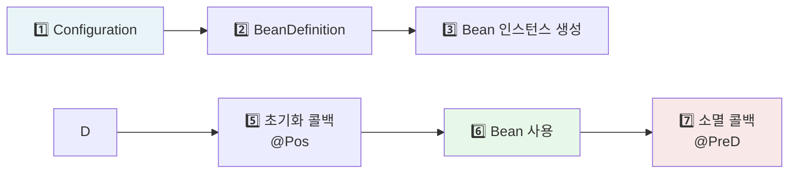
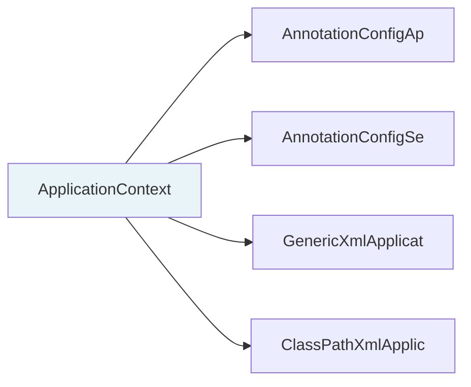
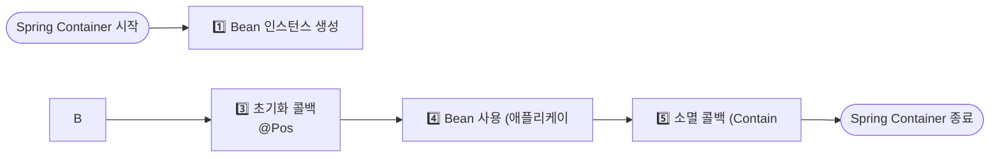
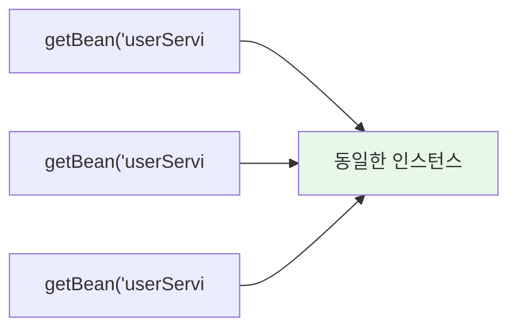
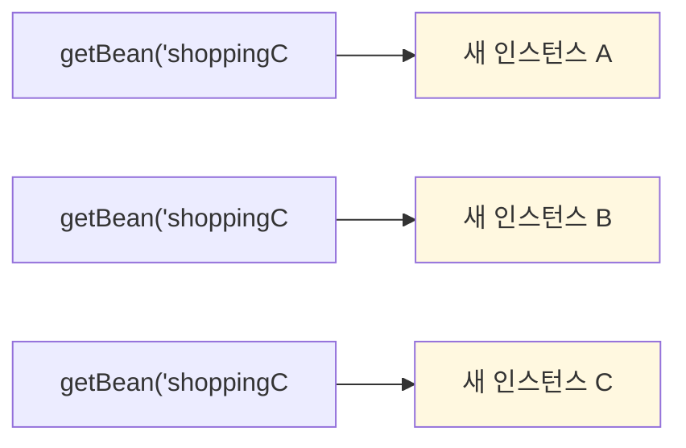
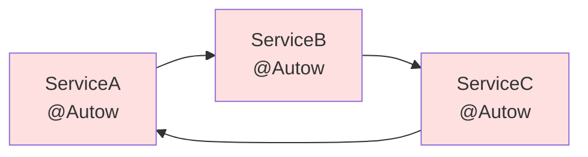

신입 때 이런 경험이 있을 것이다. 서비스 클래스 안에서 `new RateDiscountPolicy()`를 직접 써뒀는데, 기획이 바뀌어서 `FixDiscountPolicy`로 교체해야 하는 순간. 수십 개 파일을 열어 `new`를 바꿔야 했다. IoC와 DI는 이 문제를 해결하기 위해 태어난 개념이다.

> **비유로 먼저 이해하기**: IoC는 식당과 같다. 손님(개발자)이 직접 주방에 들어가 요리하는 게 아니라, 셰프(Spring 컨테이너)가 재료(객체)를 준비하고 조합해서 가져다준다. 어떤 재료를 쓸지는 셰프가 결정하고, 손님은 메뉴(인터페이스)만 주문하면 된다.

---

## 1. IoC(Inversion of Control)란?

IoC는 **제어의 역전**을 의미한다. 전통적인 프로그래밍에서는 개발자가 직접 객체를 생성하고 의존 객체를 연결했다. IoC에서는 이 제어권이 프레임워크(Spring Container)로 넘어간다.

**왜 제어를 역전해야 하는가?** 개발자가 직접 `new`로 객체를 만들면, 사용하는 쪽이 구현체를 알아야 한다. 구현체가 바뀔 때마다 사용하는 쪽 코드도 같이 바뀐다. 이것이 강한 결합(Tight Coupling)이다. IoC를 적용하면 사용하는 쪽은 인터페이스만 알면 되고, 어떤 구현체가 연결될지는 컨테이너가 결정한다. 코드 변경 없이 구현체 교체가 가능해진다.

### 전통적 방식 vs IoC

```java
// 전통적 방식 - 개발자가 직접 제어
public class OrderService {
    private final DiscountPolicy discountPolicy;

    public OrderService() {
        // 개발자가 직접 구체 클래스를 선택하고 생성
        this.discountPolicy = new RateDiscountPolicy();
    }
}

// IoC 방식 - 컨테이너가 제어
public class OrderService {
    private final DiscountPolicy discountPolicy;

    // 어떤 구현체가 들어올지 모른다. 컨테이너가 결정한다.
    public OrderService(DiscountPolicy discountPolicy) {
        this.discountPolicy = discountPolicy;
    }
}
```

IoC의 핵심은 **"내가 사용할 객체를 내가 만들지 않는다"**는 것이다. 객체의 생성, 생명주기 관리, 의존성 연결을 컨테이너가 담당한다.

---

## 2. IoC 컨테이너 동작 원리

Spring IoC 컨테이너는 **Bean Definition**을 읽어서 Bean을 생성하고 관리한다. 컨테이너가 시작할 때 설정 파일(또는 어노테이션)을 파싱하여 "어떤 클래스를 어떤 스코프로, 어떤 의존성과 함께 만들 것인가"라는 메타데이터를 BeanDefinition 객체로 변환한다. 그 후 이 메타데이터를 바탕으로 Bean 인스턴스를 만들고 의존성을 연결한다. 이 과정이 끝나야 비로소 애플리케이션이 요청을 받을 준비가 된다.



핵심은 3단계와 4단계의 분리다. 생성자 주입의 경우 3단계와 4단계가 동시에 일어나지만, 세터/필드 주입은 인스턴스가 먼저 만들어진 후 별도로 주입된다. 이 차이가 순환 참조 감지 시점에 영향을 준다.

---

## 3. BeanFactory vs ApplicationContext

### BeanFactory

Spring 컨테이너의 최상위 인터페이스. Bean을 관리하고 조회하는 기본 기능을 제공한다. BeanFactory는 지연 로딩(Lazy Loading) 방식으로 동작한다. `getBean()`이 호출되는 시점에 처음으로 Bean 인스턴스를 생성한다. 메모리 효율은 좋지만 첫 호출 시 지연이 발생하고, 설정 오류가 런타임까지 발견되지 않는다.

```java
public interface BeanFactory {
    Object getBean(String name) throws BeansException;
    <T> T getBean(String name, Class<T> requiredType);
    <T> T getBean(Class<T> requiredType);
    boolean containsBean(String name);
    boolean isSingleton(String name);
    boolean isPrototype(String name);
    // ...
}
```

### ApplicationContext

BeanFactory를 상속받아 훨씬 많은 기능을 추가한 인터페이스. 실무에서는 항상 ApplicationContext를 사용한다. ApplicationContext는 즉시 로딩(Eager Loading) 방식이다. 컨테이너 시작 시점에 모든 싱글톤 Bean을 미리 생성한다. 애플리케이션 시작이 약간 느려지지만 설정 오류를 시작 시점에 즉시 발견할 수 있고, 첫 요청부터 응답이 빠르다.

```java
public interface ApplicationContext extends
    EnvironmentCapable,          // 환경 변수
    ListableBeanFactory,         // BeanFactory 확장
    HierarchicalBeanFactory,     // 부모 컨테이너 계층
    MessageSource,               // 국제화(i18n)
    ApplicationEventPublisher,   // 이벤트 발행
    ResourcePatternResolver {    // 리소스 조회
}
```

### 비교표

| 구분 | BeanFactory | ApplicationContext |
|------|-------------|-------------------|
| Bean 로딩 | Lazy (호출 시) | Eager (시작 시) |
| 국제화 | 미지원 | 지원 |
| 이벤트 발행 | 미지원 | 지원 |
| 환경 변수 | 미지원 | 지원 |
| 실무 사용 | 거의 안 함 | 항상 사용 |

실무에서는 항상 ApplicationContext를 사용한다. BeanFactory의 기능이 필요하면 ApplicationContext가 이미 상속하고 있으므로 그대로 사용하면 된다.

### 주요 구현체



---

## 4. Bean 생명주기

Bean의 생명주기를 정확히 이해해야 초기화 콜백을 올바른 시점에 사용할 수 있다. 예를 들어 DB 커넥션 풀을 초기화하려면, 커넥션 풀 Bean이 생성되고 **모든 의존성 주입이 완료된 후**에 초기화가 실행되어야 한다. `@PostConstruct`가 바로 그 시점을 보장한다. 생성자에서 초기화하면 의존성이 아직 주입되지 않은 상태일 수 있다.



### 코드 예제

아래 코드는 `@PostConstruct`와 `@PreDestroy`를 활용하는 표준 패턴이다. 주석에 표시된 단계 번호가 위 다이어그램과 대응된다. `afterPropertiesSet()`과 `destroy()`는 Spring 인터페이스에 종속되므로, 가능하면 JSR-250 표준인 `@PostConstruct`/`@PreDestroy`를 우선 사용한다.

```java
@Component
public class DatabaseConnectionPool implements InitializingBean, DisposableBean {

    private Connection connection;

    // 3단계 초기화 콜백 - 의존성 주입 완료 후 호출
    @PostConstruct
    public void init() {
        System.out.println("@PostConstruct: DB 커넥션 풀 초기화");
        // 이 시점에는 모든 의존성이 주입된 상태
    }

    @Override
    public void afterPropertiesSet() throws Exception {
        System.out.println("InitializingBean: 추가 초기화 작업");
    }

    // 5단계 소멸 콜백
    @PreDestroy
    public void cleanup() {
        System.out.println("@PreDestroy: DB 커넥션 풀 정리");
    }

    @Override
    public void destroy() throws Exception {
        System.out.println("DisposableBean: 커넥션 종료");
        if (connection != null) connection.close();
    }
}
```

**권장 방법**: `@PostConstruct` / `@PreDestroy` 사용. JSR-250 표준이라 Spring에 종속되지 않는다.

---

## 5. Bean Scope

### Singleton (기본값)

컨테이너당 인스턴스 하나. 가장 널리 사용된다. 싱글톤 Bean은 컨테이너 시작 시점에 딱 한 번 생성되어 컨테이너가 살아있는 동안 유지된다. 동일한 Bean을 여러 곳에서 주입받아도 모두 같은 인스턴스를 참조한다. 따라서 싱글톤 Bean에 상태(인스턴스 변수)를 저장하면 여러 요청 간에 공유되어 동시성 문제가 발생한다.

```java
@Component
// @Scope("singleton") // 생략 가능, 기본값
public class UserService {
    // 컨테이너 전체에서 단 하나의 인스턴스
}
```



### Prototype

요청할 때마다 새 인스턴스 생성. 컨테이너는 인스턴스 생성 후 소멸 콜백을 관리하지 않는다. `@PreDestroy`가 호출되지 않으므로 자원 해제를 직접 처리해야 한다.

```java
@Component
@Scope("prototype")
public class ShoppingCart {
    private List<Item> items = new ArrayList<>();
    // 사용자마다 별도 인스턴스 필요
}
```



### Singleton + Prototype 혼용 문제

Singleton Bean이 Prototype Bean을 주입받으면 문제가 발생한다. Singleton Bean은 컨테이너 시작 시 딱 한 번 DI를 받는다. 이때 Prototype Bean도 딱 한 번 생성되어 주입된다. 이후 Singleton Bean의 메서드를 호출할 때마다 같은 Prototype 인스턴스가 사용된다. Prototype의 의미가 사라진다.

```java
@Component
public class SingletonService {
    @Autowired
    private PrototypeBean prototypeBean; // 주입 시점에 딱 한 번만 생성됨!
    // 이후 prototypeBean은 항상 같은 인스턴스 → prototype 의미 없음
}
```

**해결책**: `ObjectProvider` 사용. `getObject()` 호출마다 컨테이너에서 새 인스턴스를 꺼내온다.

```java
@Component
public class SingletonService {
    @Autowired
    private ObjectProvider<PrototypeBean> prototypeBeanProvider;

    public void logic() {
        PrototypeBean prototypeBean = prototypeBeanProvider.getObject(); // 매번 새 인스턴스
        prototypeBean.doSomething();
    }
}
```

### Web Scope (웹 환경에서만 동작)

| Scope | 생명주기 |
|-------|---------|
| `request` | HTTP 요청 하나 동안 |
| `session` | HTTP 세션 동안 |
| `application` | 서블릿 컨텍스트 동안 (싱글톤과 유사) |
| `websocket` | WebSocket 세션 동안 |

```java
@Component
@Scope(value = "request", proxyMode = ScopedProxyMode.TARGET_CLASS)
public class MyLogger {
    private String requestURL;

    public void setRequestURL(String requestURL) {
        this.requestURL = requestURL;
    }

    public void log(String message) {
        System.out.println("[" + requestURL + "] " + message);
    }
}
```

`proxyMode = ScopedProxyMode.TARGET_CLASS`: Singleton Bean에 Request-scoped Bean을 주입할 때, 실제 인스턴스 대신 프록시 객체를 주입한다. 실제 요청이 들어올 때 프록시가 현재 요청에 맞는 진짜 인스턴스로 위임한다. 이 프록시 없이는 싱글톤 시작 시점에 request scope Bean을 만들 수 없어 오류가 난다.

---

## 6. DI(Dependency Injection) 방식 비교

### 생성자 주입 (Constructor Injection) — 권장

생성자 주입은 Bean 인스턴스 생성과 의존성 주입이 동시에 일어난다. Spring이 생성자를 호출할 때 인자를 자동으로 찾아 넣어준다. 생성자가 하나뿐이면 `@Autowired`를 생략할 수 있다.

```java
@Service
public class OrderService {
    private final OrderRepository orderRepository;
    private final DiscountPolicy discountPolicy;

    @Autowired // 생성자가 하나면 생략 가능
    public OrderService(OrderRepository orderRepository,
                        DiscountPolicy discountPolicy) {
        this.orderRepository = orderRepository;
        this.discountPolicy = discountPolicy;
    }
}
```

**장점**:
- `final` 키워드 사용 가능 → 불변성 보장
- 테스트 시 의존성 명확하게 드러남
- 컴파일 시점에 누락된 의존성 발견
- 순환 참조를 시작 시점에 감지 (Spring Boot 2.6+)

### 세터 주입 (Setter Injection)

```java
@Service
public class OrderService {
    private OrderRepository orderRepository;

    @Autowired
    public void setOrderRepository(OrderRepository orderRepository) {
        this.orderRepository = orderRepository;
    }
}
```

**용도**: 선택적 의존성, 변경 가능한 의존성. 실무에서 거의 사용하지 않는다.

### 필드 주입 (Field Injection) — 비권장

```java
@Service
public class OrderService {
    @Autowired
    private OrderRepository orderRepository; // 테스트 불편, 숨겨진 의존성
}
```

**단점**:
- `final` 사용 불가 → 불변성 없음
- 테스트 시 Mock 주입이 까다로움 (reflection 필요)
- 의존성이 숨겨져 있어 SRP 위반을 눈치채기 어려움
- Spring 컨테이너 없이 사용 불가

### 왜 생성자 주입이 권장되는가?

테스트 코드에서 차이가 명확하게 드러난다. 필드 주입을 사용하면 `new`로 객체를 만들었을 때 의존성이 null이라 NullPointerException이 발생한다. 생성자 주입은 컴파일러가 의존성 누락을 잡아준다.

```java
// 필드 주입 - 테스트 시 문제
class OrderServiceTest {
    @Test
    void test() {
        OrderService service = new OrderService();
        // orderRepository가 null! Spring 없이 생성하면 주입이 안 됨
        service.createOrder(...); // NullPointerException
    }
}

// 생성자 주입 - 테스트 용이
class OrderServiceTest {
    @Test
    void test() {
        OrderRepository mockRepo = mock(OrderRepository.class);
        DiscountPolicy mockPolicy = mock(DiscountPolicy.class);
        OrderService service = new OrderService(mockRepo, mockPolicy); // 명확
        service.createOrder(...); // 정상 동작
    }
}
```

---

## 7. @Autowired 동작 원리

`@Autowired`는 Spring이 Bean을 자동으로 찾아 주입하는 어노테이션이다. 내부적으로 `AutowiredAnnotationBeanPostProcessor`가 동작하며, Bean 생성 후 `@Autowired`가 붙은 필드나 메서드를 리플렉션으로 탐색하여 ApplicationContext에서 알맞은 Bean을 찾아 주입한다.

### 매칭 순서

타입으로 먼저 찾고, 같은 타입이 여러 개면 이름이나 한정자로 좁힌다. 이 순서를 모르면 "NoUniqueBeanDefinitionException이 왜 났지?" 하고 헤매게 된다.

```mermaid
graph LR
    A["1️⃣ 타입Type으로 매칭 시도"] --> B{"타입 매칭 Bean이 2개 이상?"}
    B -->|"@Qualifier 있음"| C["2️⃣ @Qualifi..|"@Primary 있음"| D["3️⃣ @Primary..|"그 외"| E["4️⃣ 필드명/파라미터명으로 매칭"]
    C --> F["주입 완료"]
    D --> F
    E --> F
```

### 예제

```java
// Bean이 두 개 등록된 경우
@Component
public class FixDiscountPolicy implements DiscountPolicy { ... }

@Component
@Primary  // 우선순위 부여
public class RateDiscountPolicy implements DiscountPolicy { ... }

@Service
public class OrderService {
    private final DiscountPolicy discountPolicy;

    @Autowired
    public OrderService(DiscountPolicy discountPolicy) {
        // @Primary가 붙은 RateDiscountPolicy가 주입됨
        this.discountPolicy = discountPolicy;
    }
}
```

```java
// @Qualifier 사용
@Component
@Qualifier("mainPolicy")
public class RateDiscountPolicy implements DiscountPolicy { ... }

@Service
public class OrderService {
    @Autowired
    public OrderService(@Qualifier("mainPolicy") DiscountPolicy discountPolicy) {
        this.discountPolicy = discountPolicy;
    }
}
```

**@Primary vs @Qualifier**: @Qualifier가 더 세밀한 제어이므로 우선순위가 높다.

### 모든 Bean 주입받기

같은 타입의 모든 Bean을 Map이나 List로 받을 수 있다. 전략 패턴 구현에 매우 유용하다.

```java
@Service
public class DiscountService {
    private final Map<String, DiscountPolicy> policyMap;
    private final List<DiscountPolicy> policies;

    @Autowired
    public DiscountService(Map<String, DiscountPolicy> policyMap,
                           List<DiscountPolicy> policies) {
        this.policyMap = policyMap;   // {"fixDiscountPolicy": ..., "rateDiscountPolicy": ...}
        this.policies = policies;      // [FixDiscountPolicy, RateDiscountPolicy]
    }

    public int discount(String policyCode, int price) {
        DiscountPolicy policy = policyMap.get(policyCode);
        return policy.discount(price);
    }
}
```

---

## 8. 순환 참조 문제와 해결

### 순환 참조란?

A가 B를 필요로 하고, B가 C를 필요로 하며, C가 다시 A를 필요로 하는 상황이다. 생성자 주입에서는 A를 만들려면 B가 필요하고, B를 만들려면 C가 필요하고, C를 만들려면 A가 필요한 데드락이 발생한다.



### Spring Boot 2.6+ 기본 동작

Spring Boot 2.6부터 생성자 주입의 순환 참조는 **시작 시점에 예외 발생**한다.

```
***************************
APPLICATION FAILED TO START
***************************
The dependencies of some of the beans in the application context
form a cycle:

a → b → c → a
```

세터/필드 주입은 Bean 생성 후 주입하므로 런타임까지 발견이 늦어질 수 있다.

### 해결 방법

**방법 1: 설계 변경 (가장 좋은 방법)**

순환 참조는 대부분 **설계 문제**다. 공통 기능을 별도 컴포넌트로 추출하면 사이클이 끊어진다.

```java
// 순환 참조 발생
// UserService ↔ OrderService

// 해결: 공통 기능을 별도 서비스로 분리
@Service
public class CommonService {
    // UserService와 OrderService가 공통으로 필요한 기능
}

@Service
public class UserService {
    @Autowired CommonService commonService;
}

@Service
public class OrderService {
    @Autowired CommonService commonService;
}
```

**방법 2: @Lazy**

```java
@Service
public class A {
    private final B b;

    @Autowired
    public A(@Lazy B b) {  // B를 실제 사용 시점까지 지연 로딩
        this.b = b;
    }
}
```

**방법 3: application.properties 설정 (임시방편, 비권장)**

```properties
spring.main.allow-circular-references=true
```

이 옵션은 임시 해결책이며, 순환 참조의 근본 원인을 해결해야 한다.

---

## 실무에서 자주 하는 실수

**실수 1: 싱글톤 Bean에 상태 저장**

싱글톤 Bean은 여러 요청이 공유한다. 인스턴스 변수에 요청별 데이터를 저장하면 동시성 문제가 발생한다. 요청별 데이터는 파라미터로 전달하거나 ThreadLocal을 사용한다.

**실수 2: @PostConstruct에서 트랜잭션 사용**

`@PostConstruct`는 컨테이너 초기화 단계에서 실행된다. 이 시점에 트랜잭션이 활성화되지 않을 수 있다. 초기 데이터 로딩은 `ApplicationReadyEvent` 리스너를 사용한다.

**실수 3: Prototype Bean을 Singleton에 주입 후 매번 새 인스턴스 기대**

앞서 설명한 Singleton+Prototype 혼용 문제다. `ObjectProvider`로 해결한다.

---

## 정리

| 개념 | 핵심 |
|------|------|
| IoC | 객체 생성/관리 제어권을 컨테이너에 위임 |
| BeanFactory | 기본 Bean 관리, Lazy Loading |
| ApplicationContext | BeanFactory 확장, Eager Loading, 실무 표준 |
| Bean 생명주기 | 생성 → DI → 초기화(@PostConstruct) → 사용 → 소멸(@PreDestroy) |
| Singleton | 컨테이너당 1개 인스턴스, 기본값 |
| Prototype | 요청마다 새 인스턴스 |
| 생성자 주입 | final 보장, 테스트 용이, 순환참조 조기 발견 → 권장 |
| @Autowired | 타입 → @Qualifier → @Primary → 필드명 순으로 매칭 |
| 순환 참조 | 설계 문제, 컴포넌트 분리로 해결 |

---

## 왜 이 기술인가?

| 방식 | 결합도 | 테스트 용이성 | 생명주기 관리 | 적합한 상황 |
|---|---|---|---|---|
| new 직접 생성 | 높음 | 어려움 | 수동 | 단순 유틸, 불변 객체 |
| 정적 팩토리 | 중간 | 중간 | 수동 | 생성 복잡도가 있는 객체 |
| Spring IoC (생성자 주입) | 낮음 | 쉬움 | 자동 | 실무 표준 |
| Guice | 낮음 | 쉬움 | 자동 | Google 생태계 |
| CDI (Jakarta EE) | 낮음 | 쉬움 | 자동 | Jakarta EE 전용 |

**결론:** Spring IoC는 DI 컨테이너 중 가장 광범위한 생태계와 자동화 기능(Auto-configuration, AOP, 트랜잭션)을 제공한다. 생성자 주입을 기본으로 사용하면 불변성 보장과 순환 참조 감지를 동시에 얻는다.

---

## 면접 포인트

**Q1. 생성자 주입이 필드 주입보다 권장되는 이유는?**
> 생성자 주입은 불변성(`final` 필드), 테스트 용이성(순수 Java로 의존성 주입 가능), 순환 참조 컴파일 타임 감지를 제공한다. 필드 주입은 `@Autowired`가 없으면 null이 되며, 단독 인스턴스화가 불가능해 단위 테스트 작성이 어렵다.

**Q2. `BeanFactory`와 `ApplicationContext`의 차이는?**
> `BeanFactory`는 기본 DI 컨테이너로 lazy 초기화를 지원한다. `ApplicationContext`는 `BeanFactory`를 확장해 이벤트 발행, 국제화(i18n), AOP 통합, `@Component` 스캔을 추가로 제공한다. 실무에서는 항상 `ApplicationContext`를 사용한다.

**Q3. Spring Bean의 기본 스코프는 무엇이고 주의사항은?**
> 기본 스코프는 `singleton`이다. 컨테이너당 하나의 인스턴스가 생성된다. 싱글톤 빈에 상태(인스턴스 변수)를 저장하면 멀티스레드 환경에서 데이터 오염이 발생한다. 요청마다 다른 상태가 필요하면 `prototype`, 웹 환경에서는 `request`/`session` 스코프를 사용한다.

**Q4. 같은 타입의 빈이 여러 개일 때 어떻게 주입하는가?**
> `@Qualifier("빈이름")`으로 특정 빈을 지정하거나, `@Primary`로 기본 빈을 지정한다. 모든 구현체를 주입받으려면 `List<PaymentService>`로 선언한다. 순서가 필요하면 `@Order`나 `Ordered` 인터페이스를 사용한다.

**Q5. 순환 참조(Circular Dependency)가 발생하면 어떻게 해결하는가?**
> Spring Boot 2.6+에서는 기본적으로 순환 참조를 금지한다. 해결책: 설계 재검토(SRP 위반 신호), 한쪽을 `@Lazy`로 지연 주입, 인터페이스로 분리, 이벤트 기반으로 의존 방향 역전. 순환 참조는 대부분 설계 문제의 징후이므로 해결보다 구조 개선이 우선이다.
