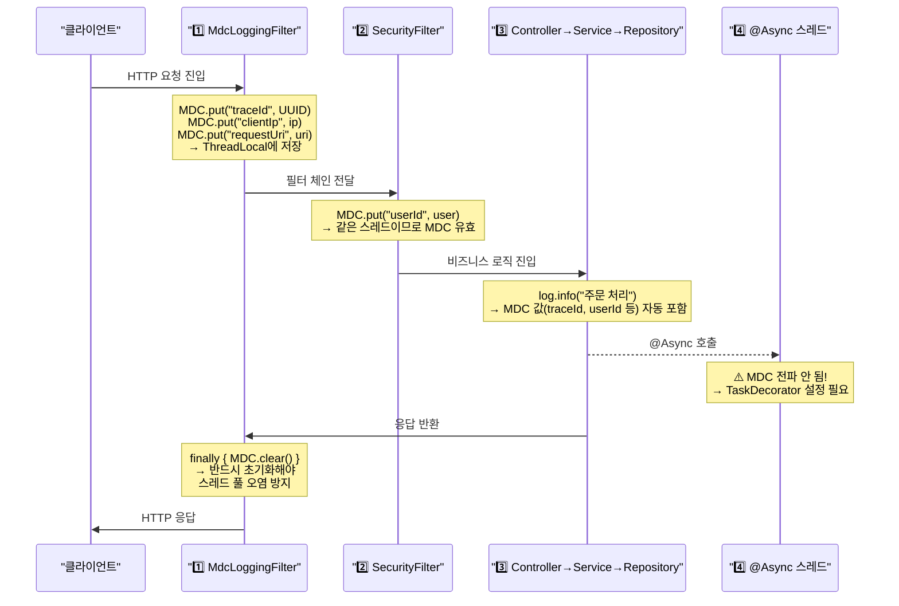

새벽 2시에 운영 장애가 났다. 로그를 보니 에러와 정상 로그가 뒤섞여 어느 요청에서 터진 건지 찾을 수가 없다. MDC를 몰랐다면 이 상황에서 로그 전체를 시간순으로 읽어내려가야 한다.

> **비유로 먼저 이해하기**: MDC는 택배 송장번호와 같다. 물류 창고(서버)를 거치는 수백 개의 박스(요청) 중 내 박스를 추적하려면 고유 번호가 있어야 한다. traceId가 바로 그 송장번호 — 어느 서비스, 어느 스레드에서 찍힌 로그든 같은 번호로 한 줄로 이어진다.

멀티스레드 웹 서버에서는 수십 개의 요청이 동시에 처리됩니다. 이때 로그가 뒤섞이면 특정 요청의 전체 흐름을 추적하기가 매우 어렵습니다. MDC(Mapped Diagnostic Context)는 이 문제를 해결하는 표준 방법입니다.

---

## MDC란? 왜 필요한가?

### 문제 상황 — 로그가 뒤섞이는 멀티스레드 환경

```
[INFO ] OrderService - 주문 처리 시작
[INFO ] OrderService - 주문 처리 시작
[INFO ] PaymentService - 결제 요청
[ERROR] OrderService - 재고 부족
[INFO ] PaymentService - 결제 완료
[INFO ] OrderService - 주문 완료
```

위 로그만 보면 어느 요청에서 오류가 발생했는지, 어떤 사용자의 요청인지 전혀 알 수 없습니다.

### MDC로 해결

```
[INFO ] [traceId=a1b2c3d4] [userId=user123] OrderService - 주문 처리 시작
[INFO ] [traceId=e5f6g7h8] [userId=user456] OrderService - 주문 처리 시작
[INFO ] [traceId=a1b2c3d4] [userId=user123] PaymentService - 결제 요청
[ERROR] [traceId=a1b2c3d4] [userId=user123] OrderService - 재고 부족
[INFO ] [traceId=e5f6g7h8] [userId=user456] PaymentService - 결제 완료
[INFO ] [traceId=e5f6g7h8] [userId=user456] OrderService - 주문 완료
```

`traceId=a1b2c3d4`로 필터링하면 해당 요청의 전체 흐름을 즉시 추적할 수 있습니다.

**MDC(Mapped Diagnostic Context)** 는 현재 실행 스레드에 키-값 쌍의 컨텍스트 정보를 저장하고, 로그 패턴에서 자동으로 출력할 수 있게 하는 로깅 프레임워크의 기능입니다. SLF4J, Logback, Log4j2 모두 지원합니다.

---

## MDC 내부 구현 (ThreadLocal 기반)

MDC는 내부적으로 `ThreadLocal<Map<String, String>>`으로 구현됩니다.

```java
// Logback의 MDCAdapter 구현 (단순화)
public class LogbackMDCAdapter implements MDCAdapter {
    // 각 스레드마다 독립적인 Map 유지
    final ThreadLocal<Map<String, String>> copyOnThreadLocal =
        new ThreadLocal<>();

    @Override
    public void put(String key, String val) {
        Map<String, String> map = copyOnThreadLocal.get();
        if (map == null) {
            map = new HashMap<>();
            copyOnThreadLocal.set(map);
        }
        map.put(key, val);
    }

    @Override
    public String get(String key) {
        Map<String, String> map = copyOnThreadLocal.get();
        return (map != null) ? map.get(key) : null;
    }

    @Override
    public void remove(String key) {
        Map<String, String> map = copyOnThreadLocal.get();
        if (map != null) {
            map.remove(key);
        }
    }

    @Override
    public void clear() {
        copyOnThreadLocal.remove(); // ThreadLocal 정리
    }
}
```

**SLF4J MDC API:**

```java
import org.slf4j.MDC;

// 값 저장
MDC.put("traceId", "a1b2c3d4");
MDC.put("userId", "user123");

// 값 조회
String traceId = MDC.get("traceId");

// 값 제거
MDC.remove("traceId");

// 전체 초기화
MDC.clear();

// 현재 맵 스냅샷 조회
Map<String, String> context = MDC.getCopyOfContextMap();

// 맵 전체 설정
MDC.setContextMap(context);
```

---

## Logback/Log4j2에서의 MDC 설정

### logback-spring.xml 패턴 설정

`%X{키명}` 패턴으로 MDC 값을 로그에 포함시킵니다.

```xml
<!-- src/main/resources/logback-spring.xml -->
<?xml version="1.0" encoding="UTF-8"?>
<configuration>
    <springProperty scope="context" name="appName" source="spring.application.name"/>

    <!-- 콘솔 출력 Appender -->
    <appender name="CONSOLE" class="ch.qos.logback.core.ConsoleAppender">
        <encoder>
            <pattern>
                %d{yyyy-MM-dd HH:mm:ss.SSS} [%thread] %-5level
                [traceId=%X{traceId:-NONE}]
                [userId=%X{userId:-ANONYMOUS}]
                [requestId=%X{requestId:-}]
                %logger{36} - %msg%n
            </pattern>
            <charset>UTF-8</charset>
        </encoder>
    </appender>

    <!-- 파일 출력 Appender (JSON 형식 — ELK 연동용) -->
    <appender name="FILE_JSON" class="ch.qos.logback.core.rolling.RollingFileAppender">
        <file>logs/application.log</file>
        <rollingPolicy class="ch.qos.logback.core.rolling.TimeBasedRollingPolicy">
            <fileNamePattern>logs/application.%d{yyyy-MM-dd}.%i.log.gz</fileNamePattern>
            <maxHistory>30</maxHistory>
            <maxFileSize>100MB</maxFileSize>
        </rollingPolicy>
        <encoder class="net.logstash.logback.encoder.LogstashEncoder">
            <!-- MDC 값이 자동으로 JSON 필드에 포함됨 -->
            <includeMdc>true</includeMdc>
            <customFields>{"app":"${appName}"}</customFields>
        </encoder>
    </appender>

    <!-- 개발 환경 -->
    <springProfile name="dev">
        <root level="DEBUG">
            <appender-ref ref="CONSOLE"/>
        </root>
    </springProfile>

    <!-- 운영 환경 -->
    <springProfile name="prod">
        <root level="INFO">
            <appender-ref ref="FILE_JSON"/>
        </root>
    </springProfile>
</configuration>
```

**`%X{키:-기본값}` 패턴 설명:**
- `%X{traceId}` — MDC에서 traceId 값 출력, 없으면 빈 문자열
- `%X{traceId:-NONE}` — 없을 때 "NONE" 출력
- `%X` — MDC 전체 맵을 `{key=value, ...}` 형식으로 출력

### Log4j2에서의 MDC 설정

Log4j2에서는 `ThreadContext`를 사용합니다(내부적으로 동일한 개념).

```xml
<!-- log4j2-spring.xml -->
<?xml version="1.0" encoding="UTF-8"?>
<Configuration status="WARN">
    <Appenders>
        <Console name="Console" target="SYSTEM_OUT">
            <PatternLayout pattern="%d{HH:mm:ss} [%t] %-5level
                [%X{traceId}] [%X{userId}] %logger{36} - %msg%n"/>
        </Console>
    </Appenders>
    <Loggers>
        <Root level="info">
            <AppenderRef ref="Console"/>
        </Root>
    </Loggers>
</Configuration>
```

```java
// Log4j2에서는 ThreadContext 사용 (MDC와 동일 개념)
import org.apache.logging.log4j.ThreadContext;

ThreadContext.put("traceId", "a1b2c3d4");
ThreadContext.get("traceId");
ThreadContext.remove("traceId");
ThreadContext.clearAll();
```

---

## Spring에서 MDC 활용

### Filter에서 traceId 주입

HTTP 요청 진입점인 Filter에서 MDC를 설정하고, 응답 후 반드시 정리합니다.

```java
@Component
@Order(Ordered.HIGHEST_PRECEDENCE) // 가장 먼저 실행
public class MdcLoggingFilter implements Filter {

    private static final String TRACE_ID_HEADER = "X-Trace-Id";
    private static final String REQUEST_ID_KEY = "requestId";
    private static final String TRACE_ID_KEY = "traceId";
    private static final String USER_ID_KEY = "userId";
    private static final String CLIENT_IP_KEY = "clientIp";
    private static final String REQUEST_URI_KEY = "requestUri";
    private static final String REQUEST_METHOD_KEY = "requestMethod";

    @Override
    public void doFilter(ServletRequest request, ServletResponse response, FilterChain chain)
            throws IOException, ServletException {
        HttpServletRequest httpRequest = (HttpServletRequest) request;

        try {
            // 1. 외부에서 전달된 traceId 사용 (분산 시스템) 또는 신규 생성
            String traceId = Optional.ofNullable(httpRequest.getHeader(TRACE_ID_HEADER))
                .filter(StringUtils::hasText)
                .orElse(generateTraceId());

            // 2. 요청별 고유 requestId 생성
            String requestId = UUID.randomUUID().toString();

            // 3. MDC에 컨텍스트 정보 설정
            MDC.put(TRACE_ID_KEY, traceId);
            MDC.put(REQUEST_ID_KEY, requestId);
            MDC.put(CLIENT_IP_KEY, getClientIp(httpRequest));
            MDC.put(REQUEST_URI_KEY, httpRequest.getRequestURI());
            MDC.put(REQUEST_METHOD_KEY, httpRequest.getMethod());

            // 4. 응답 헤더에도 traceId 포함 (클라이언트/운영팀이 추적 가능)
            ((HttpServletResponse) response).setHeader(TRACE_ID_HEADER, traceId);

            chain.doFilter(request, response);

        } finally {
            MDC.clear(); // 반드시 정리 — 스레드 풀 오염 방지
        }
    }

    private String generateTraceId() {
        return UUID.randomUUID().toString().replace("-", "").substring(0, 16);
    }

    private String getClientIp(HttpServletRequest request) {
        String ip = request.getHeader("X-Forwarded-For");
        if (StringUtils.hasText(ip) && !"unknown".equalsIgnoreCase(ip)) {
            return ip.split(",")[0].trim(); // 프록시 체인에서 첫 번째 IP
        }
        return Optional.ofNullable(request.getHeader("X-Real-IP"))
            .orElse(request.getRemoteAddr());
    }
}
```

### 인증 후 userId 추가 (Spring Security와 연동)

```java
@Component
public class MdcUserContextFilter extends OncePerRequestFilter {

    @Override
    protected void doFilterInternal(HttpServletRequest request,
                                    HttpServletResponse response,
                                    FilterChain filterChain)
            throws ServletException, IOException {
        try {
            // Spring Security 인증 완료 후 userId 추가
            Authentication authentication =
                SecurityContextHolder.getContext().getAuthentication();
            if (authentication != null && authentication.isAuthenticated()
                    && !(authentication instanceof AnonymousAuthenticationToken)) {
                MDC.put("userId", authentication.getName());
                if (authentication.getPrincipal() instanceof UserDetails userDetails) {
                    // 추가 정보가 있다면
                    MDC.put("userRole", userDetails.getAuthorities().toString());
                }
            }
            filterChain.doFilter(request, response);
        } finally {
            MDC.remove("userId");
            MDC.remove("userRole");
        }
    }
}
```

### Interceptor에서 MDC 활용

```java
@Component
public class MdcLoggingInterceptor implements HandlerInterceptor {

    private static final Logger log = LoggerFactory.getLogger(MdcLoggingInterceptor.class);

    @Override
    public boolean preHandle(HttpServletRequest request, HttpServletResponse response,
                             Object handler) {
        MDC.put("handler", handler.toString());
        log.info("요청 시작 — URI: {}, Method: {}",
            request.getRequestURI(), request.getMethod());
        return true;
    }

    @Override
    public void afterCompletion(HttpServletRequest request, HttpServletResponse response,
                                Object handler, Exception ex) {
        if (ex != null) {
            log.error("요청 처리 중 오류 발생", ex);
        }
        log.info("요청 완료 — Status: {}", response.getStatus());
        MDC.remove("handler");
    }
}

@Configuration
public class WebMvcConfig implements WebMvcConfigurer {
    @Autowired
    private MdcLoggingInterceptor mdcLoggingInterceptor;

    @Override
    public void addInterceptors(InterceptorRegistry registry) {
        registry.addInterceptor(mdcLoggingInterceptor)
            .addPathPatterns("/**")
            .excludePathPatterns("/actuator/**", "/health");
    }
}
```

---

## 비동기 환경에서의 MDC 전파

### @Async에서 MDC가 사라지는 이유

`@Async`는 새로운 스레드(스레드 풀)에서 실행됩니다. MDC는 ThreadLocal 기반이므로 새 스레드에는 MDC 값이 없습니다.

```java
@Service
public class OrderService {
    private static final Logger log = LoggerFactory.getLogger(OrderService.class);

    @Async
    public CompletableFuture<Void> sendNotification(String orderId) {
        // 새 스레드 — MDC 값이 비어있음
        log.info("알림 발송"); // [traceId=] 출력됨
        return CompletableFuture.completedFuture(null);
    }
}
```

### TaskDecorator로 MDC 전파

`TaskDecorator`를 사용하면 현재 스레드의 MDC를 자식 스레드로 전파할 수 있습니다.

```java
// MDC 전파 TaskDecorator 구현
public class MdcTaskDecorator implements TaskDecorator {
    @Override
    public Runnable decorate(Runnable runnable) {
        // 현재 스레드(부모)의 MDC 스냅샷 캡처
        Map<String, String> mdcContext = MDC.getCopyOfContextMap();

        return () -> {
            try {
                // 자식 스레드에 MDC 복원
                if (mdcContext != null) {
                    MDC.setContextMap(mdcContext);
                }
                runnable.run();
            } finally {
                MDC.clear(); // 자식 스레드 정리
            }
        };
    }
}

// ThreadPoolTaskExecutor에 TaskDecorator 적용
@Configuration
@EnableAsync
public class AsyncConfig {

    @Bean(name = "taskExecutor")
    public Executor taskExecutor() {
        ThreadPoolTaskExecutor executor = new ThreadPoolTaskExecutor();
        executor.setCorePoolSize(10);
        executor.setMaxPoolSize(50);
        executor.setQueueCapacity(200);
        executor.setThreadNamePrefix("async-");
        executor.setTaskDecorator(new MdcTaskDecorator()); // MDC 전파 설정
        executor.initialize();
        return executor;
    }
}
```

### CompletableFuture에서의 MDC 전파

```java
@Service
public class OrderService {

    // MDC를 전파하는 유틸리티 메서드
    public static <T> CompletableFuture<T> supplyWithMdc(
            Supplier<T> supplier, Executor executor) {
        Map<String, String> mdcContext = MDC.getCopyOfContextMap();
        return CompletableFuture.supplyAsync(() -> {
            try {
                if (mdcContext != null) MDC.setContextMap(mdcContext);
                return supplier.get();
            } finally {
                MDC.clear();
            }
        }, executor);
    }

    public CompletableFuture<OrderResult> processOrderAsync(Order order) {
        return supplyWithMdc(() -> {
            log.info("비동기 주문 처리 — orderId: {}", order.getId());
            // traceId가 올바르게 출력됨
            return processOrder(order);
        }, taskExecutor);
    }
}

// 사용 예
CompletableFuture<String> future = supplyWithMdc(() -> {
    log.info("비동기 처리"); // MDC 값 정상 출력
    return "결과";
}, executor);
```

### 실용적인 MdcUtil 클래스

```java
@Component
public class MdcUtil {

    // Runnable 래핑
    public static Runnable wrap(Runnable runnable) {
        Map<String, String> context = MDC.getCopyOfContextMap();
        return () -> {
            Map<String, String> previous = MDC.getCopyOfContextMap();
            try {
                if (context != null) MDC.setContextMap(context);
                else MDC.clear();
                runnable.run();
            } finally {
                if (previous != null) MDC.setContextMap(previous);
                else MDC.clear();
            }
        };
    }

    // Callable 래핑
    public static <T> Callable<T> wrap(Callable<T> callable) {
        Map<String, String> context = MDC.getCopyOfContextMap();
        return () -> {
            Map<String, String> previous = MDC.getCopyOfContextMap();
            try {
                if (context != null) MDC.setContextMap(context);
                else MDC.clear();
                return callable.call();
            } finally {
                if (previous != null) MDC.setContextMap(previous);
                else MDC.clear();
            }
        };
    }

    // try-with-resources 방식으로 MDC 관리
    public static AutoCloseable putCloseable(String key, String value) {
        MDC.put(key, value);
        return () -> MDC.remove(key);
    }
}

// try-with-resources 활용 예
try (var ignored = MdcUtil.putCloseable("operationId", "ORDER_CREATE")) {
    log.info("주문 생성 시작"); // [operationId=ORDER_CREATE] 포함
    // ...
} // 블록 종료 시 자동으로 operationId 제거
```

---

## 분산 시스템에서의 MDC

### Spring Cloud Sleuth / Micrometer Tracing

Spring Cloud Sleuth(Spring Boot 2.x)와 Micrometer Tracing(Spring Boot 3.x)은 분산 추적 표준인 OpenTelemetry/Brave와 통합하여 MDC에 `traceId`, `spanId`를 자동으로 주입합니다.

```xml
<!-- Spring Boot 3.x — Micrometer Tracing + Zipkin -->
<dependency>
    <groupId>io.micrometer</groupId>
    <artifactId>micrometer-tracing-bridge-brave</artifactId>
</dependency>
<dependency>
    <groupId>io.zipkin.reporter2</groupId>
    <artifactId>zipkin-reporter-brave</artifactId>
</dependency>
```

```yaml
# application.yml
management:
  tracing:
    sampling:
      probability: 1.0  # 100% 샘플링 (운영 환경에서는 0.1 등으로 조정)
  zipkin:
    tracing:
      endpoint: http://zipkin-server:9411/api/v2/spans

logging:
  pattern:
    level: "%5p [${spring.application.name:},%X{traceId:-},%X{spanId:-}]"
```

Micrometer Tracing 사용 시 로그에 자동으로 포함되는 MDC 키:
- `traceId` — 전체 요청 흐름의 고유 ID
- `spanId` — 현재 작업 단위의 ID
- `parentId` — 상위 Span ID

### 서비스 간 traceId 전파 (HTTP Header)

```java
// RestTemplate 인터셉터로 traceId 전파
@Component
public class MdcRestTemplateInterceptor implements ClientHttpRequestInterceptor {

    @Override
    public ClientHttpResponse intercept(HttpRequest request, byte[] body,
                                        ClientHttpRequestExecution execution)
            throws IOException {
        // 현재 스레드의 traceId를 헤더에 추가
        String traceId = MDC.get("traceId");
        if (StringUtils.hasText(traceId)) {
            request.getHeaders().add("X-Trace-Id", traceId);
        }
        String userId = MDC.get("userId");
        if (StringUtils.hasText(userId)) {
            request.getHeaders().add("X-User-Id", userId);
        }
        return execution.execute(request, body);
    }
}

@Configuration
public class RestTemplateConfig {
    @Bean
    public RestTemplate restTemplate(MdcRestTemplateInterceptor interceptor) {
        RestTemplate restTemplate = new RestTemplate();
        restTemplate.setInterceptors(List.of(interceptor));
        return restTemplate;
    }
}

// WebClient로 traceId 전파
@Configuration
public class WebClientConfig {
    @Bean
    public WebClient webClient() {
        return WebClient.builder()
            .filter((request, next) -> {
                String traceId = MDC.get("traceId");
                ClientRequest modifiedRequest = ClientRequest.from(request)
                    .header("X-Trace-Id", traceId != null ? traceId : "")
                    .build();
                return next.exchange(modifiedRequest);
            })
            .build();
    }
}
```

### Kafka Consumer에서의 MDC

Kafka Consumer는 별도 스레드에서 동작하므로, 메시지에서 traceId를 추출하여 MDC에 설정해야 합니다.

```java
// Kafka 메시지 헤더에 traceId 포함하여 발행
@Service
public class OrderEventProducer {
    @Autowired
    private KafkaTemplate<String, OrderEvent> kafkaTemplate;

    public void publishOrderCreated(OrderEvent event) {
        ProducerRecord<String, OrderEvent> record =
            new ProducerRecord<>("order-events", event.getOrderId(), event);

        // MDC의 traceId를 Kafka 헤더에 포함
        String traceId = MDC.get("traceId");
        if (traceId != null) {
            record.headers().add("X-Trace-Id", traceId.getBytes(StandardCharsets.UTF_8));
        }
        kafkaTemplate.send(record);
    }
}

// Kafka Consumer에서 MDC 복원
@Component
public class OrderEventConsumer {
    private static final Logger log = LoggerFactory.getLogger(OrderEventConsumer.class);

    @KafkaListener(topics = "order-events", groupId = "order-service")
    public void consume(ConsumerRecord<String, OrderEvent> record) {
        // 메시지 헤더에서 traceId 복원
        Header traceIdHeader = record.headers().lastHeader("X-Trace-Id");
        String traceId = traceIdHeader != null
            ? new String(traceIdHeader.value(), StandardCharsets.UTF_8)
            : UUID.randomUUID().toString().substring(0, 16);

        MDC.put("traceId", traceId);
        MDC.put("kafkaTopic", record.topic());
        MDC.put("kafkaPartition", String.valueOf(record.partition()));
        MDC.put("kafkaOffset", String.valueOf(record.offset()));

        try {
            log.info("Kafka 메시지 소비 — key: {}", record.key());
            processEvent(record.value());
        } finally {
            MDC.clear();
        }
    }
}
```

---

## MDC + JSON 로그 (ELK 스택 연동)

Kibana에서 `traceId`로 검색하려면 로그를 JSON 형식으로 출력해야 합니다.

```xml
<!-- pom.xml — logstash-logback-encoder 의존성 -->
<dependency>
    <groupId>net.logstash.logback</groupId>
    <artifactId>logstash-logback-encoder</artifactId>
    <version>7.4</version>
</dependency>
```

```xml
<!-- logback-spring.xml — JSON 출력 -->
<appender name="JSON_CONSOLE" class="ch.qos.logback.core.ConsoleAppender">
    <encoder class="net.logstash.logback.encoder.LogstashEncoder">
        <includeMdc>true</includeMdc>
        <includeContext>false</includeContext>
        <customFields>{"service":"order-service","env":"prod"}</customFields>
        <!-- 타임스탬프 형식 -->
        <timestampPattern>yyyy-MM-dd'T'HH:mm:ss.SSS'Z'</timestampPattern>
        <!-- 특정 MDC 키만 포함하고 싶을 때 -->
        <mdcKeyFieldName>traceId=trace_id</mdcKeyFieldName>
        <mdcKeyFieldName>userId=user_id</mdcKeyFieldName>
    </encoder>
</appender>
```

**출력 JSON 예시:**

```json
{
  "@timestamp": "2026-05-01T10:23:45.123Z",
  "level": "INFO",
  "thread_name": "http-nio-8080-exec-1",
  "logger_name": "com.example.OrderService",
  "message": "주문 처리 시작",
  "service": "order-service",
  "env": "prod",
  "trace_id": "a1b2c3d4e5f60001",
  "user_id": "user123",
  "clientIp": "192.168.1.1",
  "requestUri": "/api/orders",
  "requestMethod": "POST"
}
```

**Elasticsearch Index Template:**

```json
{
  "mappings": {
    "properties": {
      "trace_id": { "type": "keyword" },
      "user_id":  { "type": "keyword" },
      "level":    { "type": "keyword" },
      "@timestamp": { "type": "date" },
      "message":  { "type": "text" }
    }
  }
}
```

**Kibana에서 traceId로 필터링:**

```
trace_id: "a1b2c3d4e5f60001"
```

이 하나의 쿼리로 해당 요청이 거쳐간 모든 서비스의 로그를 한 번에 조회할 수 있습니다.

---

## 실무 Best Practice와 주의사항

### Best Practice

**1. Filter에서 설정, finally에서 반드시 clear()**

```java
try {
    MDC.put("traceId", generateTraceId());
    chain.doFilter(request, response);
} finally {
    MDC.clear(); // 필수 — 스레드 풀 오염 방지
}
```

**2. 비동기 코드에서는 반드시 MDC 전파 처리**

```java
// TaskDecorator 또는 MdcUtil.wrap() 사용
executor.execute(MdcUtil.wrap(() -> {
    log.info("비동기 작업"); // MDC 값 정상 출력
}));
```

**3. 분산 시스템에서는 헤더로 traceId 전파**

```java
// 나가는 요청에 헤더 추가, 들어오는 요청에서 헤더 추출
String traceId = Optional.ofNullable(request.getHeader("X-Trace-Id"))
    .orElse(generateTraceId());
MDC.put("traceId", traceId);
response.setHeader("X-Trace-Id", traceId); // 응답에도 포함
```

**4. MDC 키는 상수로 관리**

```java
public final class MdcKeys {
    public static final String TRACE_ID    = "traceId";
    public static final String REQUEST_ID  = "requestId";
    public static final String USER_ID     = "userId";
    public static final String CLIENT_IP   = "clientIp";
    public static final String REQUEST_URI = "requestUri";

    private MdcKeys() {}
}
```

**5. Structured Logging — 추가 컨텍스트는 로그 메시지보다 MDC에**

```java
// 나쁜 예 — 파싱하기 어려운 로그
log.info("userId=user123 orderId=ORD-456 amount=50000 주문 처리 완료");

// 좋은 예 — MDC + 구조화된 메시지
MDC.put("orderId", "ORD-456");
MDC.put("amount", "50000");
log.info("주문 처리 완료");
// JSON 로그: {"message":"주문 처리 완료","orderId":"ORD-456","amount":"50000","traceId":"..."}
```

### 주의사항

| 항목 | 설명 |
|------|------|
| MDC.clear() 필수 | 스레드 풀에서 이전 요청 값 오염 방지 |
| 비동기 스레드 MDC 전파 | @Async, CompletableFuture에서 MDC 소실 주의 |
| Virtual Thread | Java 21+ Virtual Thread에서도 ThreadLocal 기반이므로 동일 이슈 |
| 민감 정보 주의 | 비밀번호, 카드번호 등을 MDC에 저장하지 않을 것 |
| 과도한 MDC 항목 | 불필요한 키-값이 많으면 로그 볼륨 증가 |
| Kafka/MQ 전파 | 메시지 헤더를 통해 명시적으로 traceId 전파 필요 |

### 전체 MDC 생명주기 흐름

요청이 들어오고 나가기까지, MDC가 어떤 시점에 설정되고 해제되는지 단계별로 살펴보겠습니다.



> **비유**: MDC는 배달 기사의 메모장과 같습니다. 주문을 받으면(요청 진입) 메모장에 주문번호·고객정보를 적고(MDC.put), 배달 과정에서 언제든 메모를 참조합니다(로그 출력). 배달 완료 후 반드시 메모장을 비워야(MDC.clear) 다음 주문과 섞이지 않습니다. 다른 배달 기사에게 일을 넘기면(@Async) 메모장은 복사해줘야 합니다(TaskDecorator).

MDC는 구현 비용 대비 로그 추적 품질을 크게 높이는 효과적인 도구입니다. Filter에서 traceId를 주입하고 반드시 clear()를 호출하는 패턴만 지키면, 분산 시스템에서도 요청 단위 로그 추적을 손쉽게 구현할 수 있습니다.
