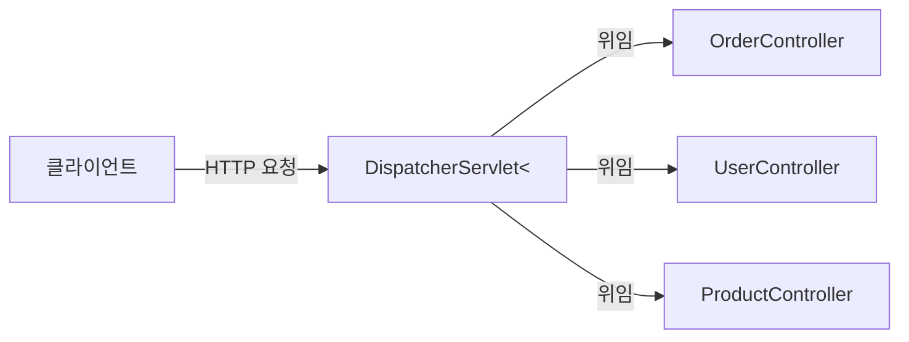
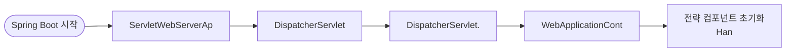
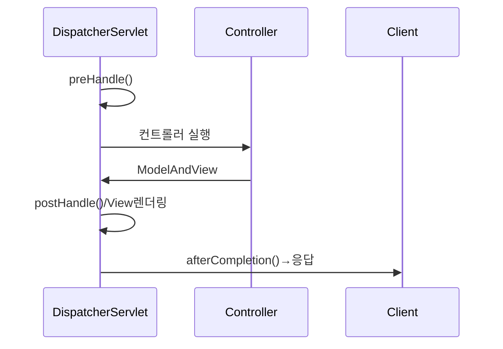
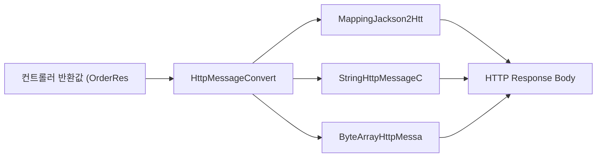
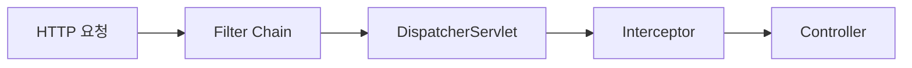
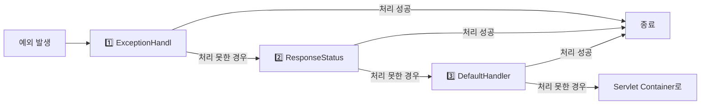

> **비유로 먼저 이해하기**: Spring MVC는 레스토랑과 같다. 손님 요청을 접수 데스크(DispatcherServlet)가 받아서 담당 웨이터(HandlerMapping)를 찾고, 웨이터(Controller)가 주방(Service)에 전달하고, 요리(비즈니스 로직)가 완성되면 접시(View 또는 JSON)에 담아 손님에게 돌려준다.

---

## 1. DispatcherServlet 구조

Spring MVC의 핵심은 **DispatcherServlet**이다. 모든 HTTP 요청을 한 곳에서 받아 적절한 핸들러에 위임하는 **Front Controller** 패턴을 구현한다.

DispatcherServlet이 없으면 각 URL마다 서블릿을 등록하고 공통 기능(인코딩, 인증, 예외 처리)을 중복 구현해야 한다. DispatcherServlet이 모든 요청을 받아서 공통 처리 후 각 컨트롤러에 위임하기 때문에 코드 중복을 제거할 수 있다.



### DispatcherServlet 초기화 과정

Spring Boot 시작 시 DispatcherServlet은 자동으로 등록되고 초기화된다. 초기화 과정에서 요청 처리에 필요한 전략 컴포넌트들을 ApplicationContext에서 찾아서 등록한다.



---

## 2. 요청 처리 흐름

HTTP 요청이 들어오면 DispatcherServlet이 8단계를 거쳐 처리한다. 이 흐름을 이해하면 인터셉터가 어디서 실행되고, 예외가 어디서 잡히는지 명확해진다.

1️⃣ **HandlerMapping**: URL을 담당하는 핸들러(컨트롤러 메서드)를 찾는다
2️⃣ **HandlerAdapter**: 핸들러 타입에 맞는 어댑터를 선택한다
3️⃣ **Interceptor preHandle**: 컨트롤러 실행 전 인터셉터가 호출된다
4️⃣ **Controller 실행**: ArgumentResolver로 파라미터 바인딩 후 메서드 실행
5️⃣ **Interceptor postHandle**: 컨트롤러 실행 후, 뷰 렌더링 전
6️⃣ **ViewResolver**: 뷰 이름을 View 객체로 변환하거나, `@ResponseBody`면 MessageConverter 사용
7️⃣ **View 렌더링**: 템플릿 엔진이 HTML 생성
8️⃣ **Interceptor afterCompletion**: 뷰 렌더링 후, 예외 발생 시에도 항상 실행



### HandlerMapping

요청 URL을 어떤 핸들러(컨트롤러 메서드)가 처리할지 결정한다. `@RequestMapping`, `@GetMapping` 등의 어노테이션 정보를 분석해서 URL → 메서드 매핑 테이블을 만든다.

```java
@RestController
@RequestMapping("/orders")
public class OrderController {

    @GetMapping("/{id}")         // GET /orders/{id}
    @PostMapping                 // POST /orders
    @PutMapping("/{id}")         // PUT /orders/{id}
    @DeleteMapping("/{id}")      // DELETE /orders/{id}

    // 조건부 매핑
    @GetMapping(value = "/search",
                params = "type=recent",        // 쿼리 파라미터 조건
                headers = "X-API-Version=2",   // 헤더 조건
                consumes = "application/json", // Content-Type 조건
                produces = "application/json") // Accept 조건
    public List<Order> searchOrders() { ... }
}
```

---

## 3. @Controller vs @RestController

```java
@Target(ElementType.TYPE)
@Retention(RetentionPolicy.RUNTIME)
@Controller
@ResponseBody  // 이것이 유일한 차이
public @interface RestController { }
```

`@RestController = @Controller + @ResponseBody`

`@ResponseBody`가 붙으면 반환값을 ViewResolver에 보내지 않고 `HttpMessageConverter`로 직렬화해서 응답 Body에 직접 쓴다.



---

## 4. ArgumentResolver와 ReturnValueHandler

### ArgumentResolver (HandlerMethodArgumentResolver)

컨트롤러 메서드의 파라미터를 어떻게 만들지 결정한다. Spring이 기본으로 수십 개의 ArgumentResolver를 제공한다.

```java
@GetMapping("/orders")
public String getOrders(
    @PathVariable Long id,              // PathVariableMethodArgumentResolver
    @RequestParam String status,        // RequestParamMethodArgumentResolver
    @RequestBody OrderRequest request,  // RequestResponseBodyMethodProcessor
    @ModelAttribute OrderSearch search, // ModelAttributeMethodProcessor
    HttpServletRequest request,         // ServletRequestMethodArgumentResolver
    @RequestHeader String auth,         // RequestHeaderMethodArgumentResolver
    @AuthenticationPrincipal UserDetails userDetails  // Spring Security
) { ... }
```

### 커스텀 ArgumentResolver

로그인 사용자 정보를 세션에서 꺼내는 반복 코드를 제거할 수 있다.

```java
@Target(ElementType.PARAMETER)
@Retention(RetentionPolicy.RUNTIME)
public @interface LoginUser { }

@Component
public class LoginUserArgumentResolver implements HandlerMethodArgumentResolver {

    @Override
    public boolean supportsParameter(MethodParameter parameter) {
        return parameter.hasParameterAnnotation(LoginUser.class)
            && parameter.getParameterType().equals(User.class);
    }

    @Override
    public Object resolveArgument(MethodParameter parameter,
                                  ModelAndViewContainer mavContainer,
                                  NativeWebRequest webRequest,
                                  WebDataBinderFactory binderFactory) {
        HttpSession session = ((HttpServletRequest) webRequest.getNativeRequest()).getSession();
        return session.getAttribute("loginUser");
    }
}

// 등록
@Configuration
public class WebConfig implements WebMvcConfigurer {
    @Override
    public void addArgumentResolvers(List<HandlerMethodArgumentResolver> resolvers) {
        resolvers.add(loginUserArgumentResolver);
    }
}

// 사용
@GetMapping("/mypage")
public String myPage(@LoginUser User loginUser, Model model) {
    model.addAttribute("user", loginUser);
    return "mypage";
}
```

---

## 5. 인터셉터 vs 필터

필터와 인터셉터는 모두 요청/응답을 가로채지만 동작하는 위치가 다르다.



필터는 Spring 컨텍스트 밖 Servlet 컨테이너 레벨에서 동작한다. 인터셉터는 Spring MVC 내부에서 동작하므로 Spring Bean을 주입받을 수 있다.

```java
@Component
public class AuthInterceptor implements HandlerInterceptor {

    @Autowired
    private JwtTokenProvider jwtTokenProvider;  // Spring Bean 주입 가능

    // 컨트롤러 실행 전
    @Override
    public boolean preHandle(HttpServletRequest request,
                              HttpServletResponse response,
                              Object handler) throws Exception {
        String token = request.getHeader("Authorization");
        if (!jwtTokenProvider.validate(token)) {
            response.sendError(HttpServletResponse.SC_UNAUTHORIZED);
            return false;  // false 반환 시 컨트롤러 실행 중단
        }
        return true;
    }

    // 컨트롤러 실행 후, View 렌더링 전
    @Override
    public void postHandle(HttpServletRequest request,
                           HttpServletResponse response,
                           Object handler,
                           ModelAndView modelAndView) {
        // ModelAndView 수정 가능
    }

    // View 렌더링 후 (예외 발생 시에도 실행)
    @Override
    public void afterCompletion(HttpServletRequest request,
                                HttpServletResponse response,
                                Object handler,
                                Exception ex) {
        // 리소스 정리, MDC 초기화 등
    }
}

@Configuration
public class WebConfig implements WebMvcConfigurer {

    @Override
    public void addInterceptors(InterceptorRegistry registry) {
        registry.addInterceptor(authInterceptor)
                .addPathPatterns("/api/**")
                .excludePathPatterns("/api/login", "/api/signup")
                .order(1);
    }
}
```

### 필터 vs 인터셉터 비교

| 구분 | Filter | Interceptor |
|------|--------|-------------|
| 레벨 | Servlet 컨테이너 | Spring MVC |
| Spring Bean 주입 | 불가 (DelegatingFilterProxy 사용 시 가능) | 가능 |
| 적용 범위 | 모든 요청 (정적 리소스 포함) | DispatcherServlet 이후 |
| 예외 처리 | `@ExceptionHandler` 불가 | `@ExceptionHandler` 가능 |
| 용도 | 인코딩, CORS, Security | 인증/인가, 로깅, API 버전 |

---

## 6. 예외 처리

### @ExceptionHandler

특정 컨트롤러에서 발생한 예외를 처리한다.

```java
@RestController
public class OrderController {

    @GetMapping("/{id}")
    public OrderResponse getOrder(@PathVariable Long id) {
        return orderService.findById(id);
    }

    @ExceptionHandler(OrderNotFoundException.class)
    @ResponseStatus(HttpStatus.NOT_FOUND)
    public ErrorResponse handleOrderNotFound(OrderNotFoundException e) {
        return new ErrorResponse("ORDER_NOT_FOUND", e.getMessage());
    }
}
```

### @ControllerAdvice / @RestControllerAdvice

전역 예외 처리. 모든 컨트롤러에서 발생한 예외를 한 곳에서 처리한다.

```java
@RestControllerAdvice
public class GlobalExceptionHandler {

    @ExceptionHandler(MethodArgumentNotValidException.class)
    @ResponseStatus(HttpStatus.BAD_REQUEST)
    public ErrorResponse handleValidation(MethodArgumentNotValidException e) {
        List<String> errors = e.getBindingResult().getFieldErrors().stream()
            .map(fe -> fe.getField() + ": " + fe.getDefaultMessage())
            .collect(Collectors.toList());
        return new ErrorResponse("VALIDATION_FAILED", errors.toString());
    }

    @ExceptionHandler(BusinessException.class)
    public ResponseEntity<ErrorResponse> handleBusiness(BusinessException e) {
        return ResponseEntity.status(e.getHttpStatus())
            .body(new ErrorResponse(e.getCode(), e.getMessage()));
    }

    @ExceptionHandler(Exception.class)
    @ResponseStatus(HttpStatus.INTERNAL_SERVER_ERROR)
    public ErrorResponse handleException(Exception e) {
        log.error("예상치 못한 예외", e);
        return new ErrorResponse("INTERNAL_SERVER_ERROR", "서버 오류가 발생했습니다.");
    }
}
```

### HandlerExceptionResolver 처리 순서

예외가 발생하면 세 가지 리졸버가 순서대로 처리를 시도한다. 모두 실패하면 Servlet 컨테이너로 예외가 전달된다.



---

## 7. 데이터 바인딩과 유효성 검증

```java
@PostMapping("/orders")
public ResponseEntity<OrderResponse> createOrder(
    @RequestBody @Valid OrderRequest request,
    BindingResult bindingResult
) {
    if (bindingResult.hasErrors()) {
        // 직접 처리 (또는 @ExceptionHandler로 위임)
    }
    return ResponseEntity.ok(orderService.create(request));
}

public class OrderRequest {
    @NotNull(message = "상품 ID는 필수입니다")
    private Long productId;

    @Min(value = 1, message = "수량은 1 이상이어야 합니다")
    @Max(value = 100, message = "수량은 100 이하여야 합니다")
    private int quantity;

    @NotBlank(message = "배송 주소는 필수입니다")
    @Size(max = 200, message = "주소는 200자 이하여야 합니다")
    private String address;

    @Email(message = "이메일 형식이 올바르지 않습니다")
    private String email;
}
```

`@Valid`가 붙으면 ArgumentResolver가 파라미터를 바인딩하면서 동시에 Bean Validation을 실행한다. 검증 실패 시 `MethodArgumentNotValidException`이 발생한다.

---

## 정리

| 구성요소 | 역할 |
|---------|------|
| DispatcherServlet | Front Controller, 모든 요청의 진입점 |
| HandlerMapping | URL → Handler 매핑 결정 |
| HandlerAdapter | Handler를 일관된 방식으로 실행 |
| ArgumentResolver | 컨트롤러 파라미터 바인딩 |
| ReturnValueHandler | 컨트롤러 반환값 처리 |
| MessageConverter | Java 객체 ↔ JSON/XML 변환 |
| ViewResolver | 뷰 이름 → View 객체 변환 |
| Filter | Servlet 레벨. 모든 요청에 적용 |
| Interceptor | Spring MVC 레벨. Bean 주입 가능 |
| @ExceptionHandler | 컨트롤러 단위 예외 처리 |
| @ControllerAdvice | 전역 예외 처리 |

---

## 왜 이 기술인가?

| 방식 | 학습 곡선 | 성능 | Spring 통합 | 적합한 상황 |
|---|---|---|---|---|
| 순수 Servlet | 높음 | 높음 | 없음 | 저수준 제어 필요 |
| Spring MVC | 중간 | 중간 (블로킹) | 완벽 | 전통적 웹 서비스, REST API |
| Spring WebFlux | 높음 | 높음 (논블로킹) | 완벽 | 고동시성, 스트리밍 |
| JAX-RS (Jersey) | 중간 | 중간 | 보통 | Jakarta EE 환경 |
| Micronaut / Quarkus | 중간 | 높음 (AOT) | 없음 | 네이티브 이미지, 서버리스 |

**결론:** Spring MVC는 검증된 생태계와 광범위한 레퍼런스로 대부분의 REST API 서버에 최선의 선택이다. 동시 연결 수가 수만 이상이거나 전체 스택이 논블로킹이어야 할 때 WebFlux를 고려한다.

---

## 실무에서 자주 하는 실수

1. **`@RequestBody` 없이 JSON 파싱 시도** — POST 요청 바디를 `@RequestParam`이나 파라미터로 받으면 null이 반환된다. JSON 바디는 반드시 `@RequestBody`를 사용하고, Content-Type을 `application/json`으로 전송해야 한다.

2. **`@ExceptionHandler`를 컨트롤러마다 중복 정의** — 각 컨트롤러에 `@ExceptionHandler`를 반복 정의하면 코드가 중복된다. `@ControllerAdvice`(또는 `@RestControllerAdvice`)를 사용해 전역 예외 처리를 한 곳에서 관리해야 한다.

3. **Filter와 Interceptor의 역할 혼동** — Spring Bean에 접근이 필요한 공통 처리(인증 토큰 검증, 로깅)를 Filter에 구현하면 Bean 주입이 어렵다. Spring Bean을 사용하는 공통 처리는 Interceptor에, 서블릿 컨테이너 수준 처리(문자 인코딩, CORS 사전 처리)는 Filter에 구현한다.

4. **`@ModelAttribute` vs `@RequestBody` 혼동** — `@ModelAttribute`는 폼 데이터(form-urlencoded)를 바인딩하고, `@RequestBody`는 JSON/XML 바디를 역직렬화한다. REST API에서 `@ModelAttribute`를 사용하면 JSON 바디가 바인딩되지 않는다.

5. **`ResponseEntity` 반환 없이 HTTP 상태 코드 제어** — `return "success"`처럼 단순 문자열을 반환하면 항상 200이 반환된다. 생성은 `201 Created`, 삭제는 `204 No Content`를 반환해야 하므로 `ResponseEntity`를 사용하거나 `@ResponseStatus`를 명시해야 한다.

---

## 면접 포인트

**Q1. DispatcherServlet의 역할은?**
> Spring MVC의 프론트 컨트롤러다. 모든 HTTP 요청을 받아 ① HandlerMapping으로 컨트롤러를 찾고, ② HandlerAdapter로 컨트롤러를 실행하고, ③ ViewResolver로 응답을 렌더링한다. 공통 관심사(인코딩, 예외 처리)를 한 곳에서 처리한다.

**Q2. `@RestController`와 `@Controller`의 차이는?**
> `@RestController`는 `@Controller` + `@ResponseBody`의 조합이다. 모든 메서드의 반환값이 HTTP 응답 바디로 직렬화된다. `@Controller`만 사용하면 메서드 반환값이 View 이름으로 해석되어 ViewResolver를 통해 처리된다.

**Q3. HandlerInterceptor의 3개 메서드 실행 시점은?**
> `preHandle()`: 컨트롤러 실행 전. `false` 반환 시 이후 처리 중단. 인증 처리에 주로 사용. `postHandle()`: 컨트롤러 실행 후, View 렌더링 전. 예외 발생 시 호출되지 않는다. `afterCompletion()`: View 렌더링 후, 항상 호출. 리소스 정리(MDC.clear)에 사용.

**Q4. `@ControllerAdvice`의 우선순위 제어 방법은?**
> `@Order(1)`로 우선순위를 지정하거나, `@ControllerAdvice(basePackages = "com.example")`로 적용 범위를 제한한다. 여러 `@ControllerAdvice`가 같은 예외를 처리하면 `@Order`가 낮을수록 먼저 적용된다.

**Q5. ArgumentResolver는 어떤 역할을 하는가?**
> 컨트롤러 메서드의 파라미터를 HTTP 요청에서 추출해 바인딩하는 역할이다. `@RequestParam`, `@PathVariable`, `@RequestBody`, `@AuthenticationPrincipal` 등이 모두 `HandlerMethodArgumentResolver` 구현체다. 커스텀 ArgumentResolver를 구현해 `@CurrentUser` 같은 어노테이션을 만들 수 있다.
