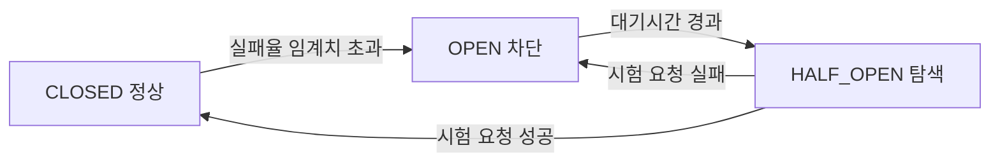
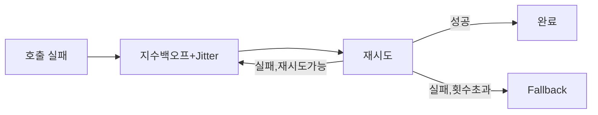
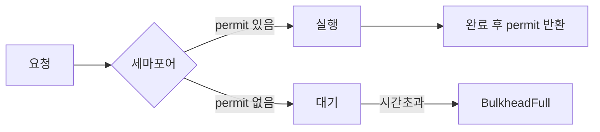

마이크로서비스 환경에서 외부 서비스 호출은 반드시 실패한다. 문제는 "언제 실패하느냐"가 아니라 "실패가 얼마나 멀리 전파되느냐"이다. 하나의 느린 서비스가 연쇄적으로 전체 시스템을 마비시키는 Cascading Failure를 막으려면 호출 경계마다 방어막을 쳐야 한다. Resilience4j는 그 방어막을 Java 함수형 방식으로 제공하는 경량 내결함성(Fault Tolerance) 라이브러리다.

> **비유**: 선박 격벽(Bulkhead)과 전기 두꺼비집(Circuit Breaker)을 동시에 생각하라. 선박은 격벽으로 침수 구획을 고립시켜 침몰을 막고, 두꺼비집은 과부하 회로를 차단해 화재를 막는다. Resilience4j는 이 두 가지 개념을 서비스 호출 레벨로 가져온 것이다. 외부 서비스가 불안정하면 회로를 열어 즉시 거부하고, 회복 여부를 조심스럽게 확인한 뒤 다시 연결한다.

---

## 의존성 설정

```xml
<dependency>
    <groupId>org.springframework.boot</groupId>
    <artifactId>spring-boot-starter-aop</artifactId>
</dependency>
<dependency>
    <groupId>io.github.resilience4j</groupId>
    <artifactId>resilience4j-spring-boot3</artifactId>
    <version>2.2.0</version>
</dependency>
<dependency>
    <groupId>org.springframework.boot</groupId>
    <artifactId>spring-boot-starter-actuator</artifactId>
</dependency>
<!-- Micrometer Prometheus 메트릭 -->
<dependency>
    <groupId>io.micrometer</groupId>
    <artifactId>micrometer-registry-prometheus</artifactId>
</dependency>
```

Resilience4j 2.x는 Spring Boot 3.x / Java 17+ 기준이다. `resilience4j-spring-boot3`는 AOP 기반 어노테이션 처리, Actuator 헬스 통합, Micrometer 메트릭 자동 등록을 모두 포함한다.

---

## 왜 Hystrix를 버리고 Resilience4j인가

Hystrix는 Netflix가 2018년에 유지보수 종료(Maintenance Mode)를 선언했다. Spring Cloud 2020.0 (Ilford) 릴리즈부터 공식적으로 Resilience4j로 마이그레이션을 권고한다.

| 항목 | Hystrix | Resilience4j |
|---|---|---|
| 상태 | 유지보수 종료 (2018~) | 활발히 개발 중 |
| 의존성 | RxJava, Archaius 등 다수 | 없음 (Vavr 선택적) |
| 스레드 격리 | ThreadPool 전용 | Semaphore + ThreadPool 선택 |
| 함수형 API | 없음 | Decorator 패턴, 람다 지원 |
| Spring Boot 통합 | spring-cloud-netflix | resilience4j-spring-boot3 내장 |
| Reactive 지원 | 제한적 | Reactor, RxJava 공식 지원 |
| 슬라이딩 윈도우 | Count-based 전용 | Count-based + Time-based |

**Hystrix가 망한 결정적 이유**: Hystrix는 모든 호출을 별도 스레드풀에서 실행한다. Thread context switching 비용이 크고, Servlet 스레드에서 Hystrix 스레드로 전환 시 ThreadLocal이 유실된다(MDC 로그, 보안 컨텍스트). Resilience4j는 기본적으로 호출자 스레드에서 실행하는 Semaphore 방식을 채택해 이 문제를 피한다.

---

## Circuit Breaker: 상태 기계의 내부 구조

### 1. 왜 Circuit Breaker가 필요한가

```
[Circuit Breaker 없는 상황]

Payment Service 응답 지연 (3초)
         ↓
Order Service 스레드 30개가 Payment 응답 대기
         ↓
Order Service 스레드풀 고갈 (30개 전부 블로킹)
         ↓
Order API 전체 응답 불가 (Queue overflow)
         ↓
API Gateway 타임아웃 누적
         ↓
전체 시스템 다운
```

문제의 본질은 "느린 서비스"가 아니라 "느린 서비스를 기다리는 스레드"가 자원을 고갈시킨다는 점이다. Circuit Breaker는 이미 불안정하다는 것을 알고 있는 서비스에 대해 요청 자체를 보내지 않음으로써 스레드를 즉시 해방한다.

### 2. 세 가지 상태와 전이 조건



**① CLOSED (정상 상태)**
- 모든 요청이 실제 서비스로 전달된다.
- 슬라이딩 윈도우에 결과(성공/실패/느림)를 기록한다.
- 실패율이 `failureRateThreshold`를 초과하면 OPEN으로 전환된다.
- `minimumNumberOfCalls`에 도달하기 전까지는 절대 OPEN이 되지 않는다. 1번 호출해서 실패했다고 바로 열리면 너무 예민하다.

**② OPEN (차단 상태)**
- 모든 요청을 즉시 `CallNotPermittedException`으로 거부한다. 실제 서비스에는 단 하나의 요청도 가지 않는다.
- 스레드를 즉시 반환하므로 Cascading Failure를 막는다.
- `waitDurationInOpenState` 경과 후 자동으로 HALF_OPEN으로 전환한다.
- 이 대기 시간 동안 외부 서비스가 회복할 시간을 벌어준다.

**③ HALF_OPEN (탐색 상태)**
- `permittedNumberOfCallsInHalfOpenState`만큼의 요청만 실제 서비스로 보낸다.
- 이 시험 요청들의 성공률이 임계치를 넘으면 CLOSED, 실패하면 다시 OPEN.
- 왜 HALF_OPEN이 필요한가? OPEN에서 바로 CLOSED로 가면 회복되지 않은 서비스에 트래픽이 한꺼번에 쏟아져 다시 죽는다. HALF_OPEN은 "조심스럽게 타진하는" 단계다.

### 3. 슬라이딩 윈도우: Ring Buffer 구현

Resilience4j의 슬라이딩 윈도우는 **원형 배열(Ring Buffer)**로 구현된다. 이것이 중요한 이유는 메모리 효율과 O(1) 시간 복잡도 때문이다.

**Count-based 슬라이딩 윈도우 (`sliding-window-size: 10`)**

```
[내부 Ring Buffer]
인덱스:  0    1    2    3    4    5    6    7    8    9
상태:  [성공][실패][성공][성공][실패][성공][성공][실패][성공][성공]
                                                         ↑
                                                    현재 포인터
11번째 호출이 오면 인덱스 0의 값을 덮어쓴다.
가장 오래된 결과가 자동으로 밀려난다.
```

Ring Buffer의 핵심: 가득 찼을 때 새 결과를 추가하면 포인터가 가리키는 가장 오래된 슬롯을 덮어쓴다. 배열 복사나 재할당 없이 O(1)로 윈도우를 슬라이드한다.

**Time-based 슬라이딩 윈도우 (`sliding-window-type: TIME_BASED`, `sliding-window-size: 10`)**

최근 10초 동안의 모든 호출을 집계한다. 내부적으로 1초 단위 버킷 10개를 Ring Buffer로 관리한다. 매초 가장 오래된 버킷이 제거되고 새 버킷이 추가된다.

```
[Time-based 내부 구조: 10개 버킷 × 1초]
초:    t-9   t-8   t-7   ...   t-1   t(현재)
버킷: [3/5] [2/4] [5/6] ... [4/5] [1/2]
      성공/  성공/  성공/      성공/  성공/
      총호출 총호출 총호출     총호출 총호출

t+1이 되면 t-9 버킷을 버리고 새 버킷을 추가한다.
```

**Count-based vs Time-based 선택 기준**

- **트래픽이 일정한 서비스**: Count-based가 단순하고 예측 가능하다.
- **트래픽이 불규칙한 서비스**: Time-based가 적합하다. 새벽 1시에 요청이 2건밖에 없을 때 그 중 1건이 실패해도 Count-based는 50% 실패율로 OPEN이 되지만, Time-based는 다른 시간대의 정상 호출도 함께 집계한다.

### 4. AtomicReference CAS 상태 전이

Resilience4j는 멀티스레드 환경에서 상태 전이를 어떻게 thread-safe하게 만드는가? 답은 `AtomicReference`와 CAS(Compare-And-Swap)이다.

```java
// Resilience4j 소스 단순화 버전
public class CircuitBreakerStateMachine {

    // volatile 없이 AtomicReference로 상태를 감싼다
    private final AtomicReference<CircuitBreakerState> stateReference;

    public void transitionToOpenState() {
        CircuitBreakerState currentState = stateReference.get();

        // CAS: 현재 상태가 CLOSED일 때만 OPEN으로 바꾼다
        // 다른 스레드가 먼저 바꿨다면 false를 반환하고 재시도하지 않는다
        // synchronized 블록 없이 lock-free 상태 전이 달성
        if (stateReference.compareAndSet(currentState,
                new OpenState(currentState.getMetrics(), config))) {
            publishStateTransitionEvent(CLOSED_TO_OPEN);
        }
        // CAS 실패 = 다른 스레드가 이미 전이했음 → 그냥 넘어감
    }
}
```

왜 CAS인가? `synchronized` 블록은 다른 스레드를 블로킹한다. 높은 QPS 환경에서 모든 요청이 상태 체크를 위해 락을 경쟁하면 성능 병목이 생긴다. CAS는 락 없이 원자적 비교-교환을 CPU 명령어 수준에서 수행해 오버헤드가 극히 낮다.

### 5. 설정 전체 해설

```yaml
resilience4j:
  circuitbreaker:
    instances:
      payment-service:
        # 슬라이딩 윈도우
        sliding-window-type: COUNT_BASED      # COUNT_BASED 또는 TIME_BASED
        sliding-window-size: 20               # 최근 20번 호출 기준
        minimum-number-of-calls: 10           # 10번 이상 호출돼야 통계 시작

        # 실패/느린 호출 임계치
        failure-rate-threshold: 50            # 50% 이상 실패 시 OPEN
        slow-call-rate-threshold: 80          # 80% 이상 느린 호출 시 OPEN
        slow-call-duration-threshold: 2s      # 2초 초과 = 느린 호출

        # 상태 전이 타이밍
        wait-duration-in-open-state: 30s      # OPEN → HALF_OPEN 대기
        automatic-transition-from-open-to-half-open-enabled: true  # 자동 전이

        # HALF_OPEN 설정
        permitted-number-of-calls-in-half-open-state: 5  # 시험 호출 5개

        # 예외 처리
        record-exceptions:
          - java.io.IOException
          - java.util.concurrent.TimeoutException
          - feign.FeignException.ServiceUnavailable
        ignore-exceptions:
          - com.example.BusinessException      # 비즈니스 예외는 실패로 안 봄
          - com.example.NotFoundException      # 404는 서비스 장애가 아님
```

`ignore-exceptions`의 중요성: HTTP 404 같은 비즈니스 오류를 실패로 집계하면 Circuit Breaker가 오작동한다. 없는 리소스를 조회하는 요청이 많으면 외부 서비스는 멀쩡한데 Circuit Breaker가 OPEN된다. 외부 인프라 장애(5xx, 타임아웃, 커넥션 거부)만 실패로 기록해야 한다.

### 6. 어노테이션 사용과 Fallback

```java
@Service
@RequiredArgsConstructor
public class OrderService {

    private final PaymentClient paymentClient;
    private final PaymentCacheRepository paymentCache;

    // fallbackMethod: 동일 파라미터 + 마지막에 Throwable
    @CircuitBreaker(name = "payment-service", fallbackMethod = "paymentFallback")
    public PaymentResult processPayment(PaymentRequest request) {
        return paymentClient.process(request);
    }

    // CallNotPermittedException: OPEN 상태에서 차단된 경우
    // IOException, TimeoutException: 실제 호출 실패
    // 하나의 fallback에서 Throwable로 모두 처리 가능
    private PaymentResult paymentFallback(PaymentRequest request, Throwable t) {
        log.warn("Payment circuit breaker activated. requestId={}, reason={}",
                request.getRequestId(), t.getClass().getSimpleName());

        if (t instanceof CallNotPermittedException) {
            // OPEN 상태: 서비스가 불안정함을 이미 알고 있음
            return PaymentResult.serviceUnavailable();
        }

        // 실패 호출: 캐시에서 최근 결과 조회 시도
        return paymentCache.findLastResult(request.getOrderId())
            .orElse(PaymentResult.failed("결제 서비스 일시 불가. 잠시 후 재시도해주세요."));
    }
}
```

**Fallback 메서드 시그니처 규칙**: 원본 메서드와 동일한 반환 타입이어야 한다. 파라미터는 원본 파라미터를 모두 포함하고 마지막에 `Throwable` (또는 구체 예외 타입)을 추가한다. Throwable 타입으로 더 구체적인 것부터 매칭을 시도한다.

---

## Resilience4j Retry: 지수 백오프와 Jitter의 수학

### 1. 왜 단순 재시도가 위험한가

네트워크 순단, DB 커넥션 타임아웃 같은 일시적 오류는 재시도하면 성공할 수 있다. 하지만 잘못 설계된 재시도는 문제를 악화시킨다.

**Thundering Herd 문제**

```
[DB 서버 30초 재시작 시나리오]

서버 인스턴스 100개가 동시에 DB 연결 실패
                ↓
100개 모두 1초 후 동시 재시도 → DB 과부하 → 또 실패
                ↓
100개 모두 2초 후 동시 재시도 → DB 과부하 → 또 실패
                ↓
DB가 재시작해도 트래픽 폭탄에 다시 다운
```

같은 시간에 실패한 클라이언트들이 같은 간격으로 동시에 재시도하면 서비스가 회복되자마자 다시 죽는다. 이것이 Thundering Herd다.

### 2. 지수 백오프 + Jitter

**지수 백오프(Exponential Backoff)**: 재시도마다 대기 시간을 2배씩 늘린다.

```
1차 시도 → 실패
대기: 500ms
2차 시도 → 실패
대기: 1000ms (500 × 2)
3차 시도 → 실패
대기: 2000ms (1000 × 2)
→ 최종 실패
```

**Jitter(무작위 지터)**: 각 대기 시간에 무작위 값을 더해 클라이언트들이 서로 다른 시간에 재시도하게 만든다.

```
Full Jitter 공식: random(0, min(cap, base × 2^attempt))

cap = 5000ms (최대 대기)
base = 500ms

1차: random(0, 500)    → 예: 234ms
2차: random(0, 1000)   → 예: 781ms
3차: random(0, 2000)   → 예: 1543ms
```

100개 인스턴스가 모두 다른 시간에 재시도하므로 서버 부하가 고르게 분산된다.



### 3. IntervalFunction: Jitter 구현

Resilience4j는 `IntervalFunction` 인터페이스로 재시도 간격 전략을 추상화한다.

```java
@Configuration
public class RetryConfig {

    @Bean
    public RetryRegistry retryRegistry() {

        // 방법 1: 지수 백오프 + Full Jitter
        IntervalFunction intervalWithJitter =
            IntervalFunction.ofExponentialRandomBackoff(
                500,   // 초기 대기: 500ms
                2.0,   // 배수: 2배씩 증가
                0.5,   // jitter factor: 0.5 → ±50% 무작위
                5000   // 최대 대기: 5000ms
            );

        io.github.resilience4j.retry.RetryConfig config =
            io.github.resilience4j.retry.RetryConfig.custom()
                .maxAttempts(4)
                .intervalFunction(intervalWithJitter)
                .retryOnException(e ->
                    e instanceof IOException ||
                    e instanceof TimeoutException)
                .ignoreExceptions(
                    BusinessException.class,
                    NotFoundException.class)
                .build();

        return RetryRegistry.of(config);
    }

    @Bean
    public RetryRegistry retryRegistryWithCustomStrategy() {

        // 방법 2: 커스텀 간격 함수 (직접 정의)
        // attempt: 1부터 시작
        IntervalFunction customInterval = attempt -> {
            long base = 200L;
            long cap = 10_000L;
            // Full Jitter: ThreadLocalRandom 사용으로 thread-safe
            long exponential = (long) Math.min(cap, base * Math.pow(2, attempt - 1));
            return ThreadLocalRandom.current().nextLong(0, exponential);
        };

        io.github.resilience4j.retry.RetryConfig config =
            io.github.resilience4j.retry.RetryConfig.custom()
                .maxAttempts(5)
                .intervalFunction(customInterval)
                .build();

        return RetryRegistry.of(config);
    }
}
```

### 4. YAML 설정

```yaml
resilience4j:
  retry:
    instances:
      payment-service:
        max-attempts: 4                        # 첫 시도 포함 총 4번
        wait-duration: 500ms                   # 기본 대기
        enable-exponential-backoff: true
        exponential-backoff-multiplier: 2      # 2배씩 증가
        exponential-max-wait-duration: 8s      # 최대 8초
        enable-randomized-wait: true           # Jitter 활성화
        randomized-wait-factor: 0.5            # ±50% 무작위
        retry-exceptions:
          - java.io.IOException
          - java.util.concurrent.TimeoutException
          - feign.RetryableException
        ignore-exceptions:
          - com.example.BusinessException
          - com.example.ValidationException
```

### 5. 사용 예시: Retry + 이벤트 리스너

```java
@Service
@RequiredArgsConstructor
public class NotificationService {

    private final EmailClient emailClient;
    private final RetryRegistry retryRegistry;

    @PostConstruct
    public void registerRetryListener() {
        retryRegistry.retry("notification-service")
            .getEventPublisher()
            .onRetry(event -> log.warn(
                "Retry attempt {} for {}, last exception: {}",
                event.getNumberOfRetryAttempts(),
                event.getName(),
                event.getLastThrowable().getMessage()))
            .onError(event -> log.error(
                "All {} retry attempts exhausted for {}",
                event.getNumberOfRetryAttempts(),
                event.getName()));
    }

    @Retry(name = "notification-service", fallbackMethod = "sendEmailFallback")
    public void sendEmail(EmailRequest request) {
        emailClient.send(request);
    }

    private void sendEmailFallback(EmailRequest request, Throwable t) {
        log.error("Email send failed after all retries. " +
                  "Queuing for async retry. to={}", request.getTo());
        // 실패한 이메일을 DB 큐에 넣어 배치 재처리
        emailRetryQueue.enqueue(request);
    }
}
```

### 6. Retry와 Circuit Breaker 조합 시 주의사항

```java
// 잘못된 순서: Retry가 안쪽, CircuitBreaker가 바깥
// Circuit Breaker OPEN 상태에서도 Retry가 반복 시도한다
@CircuitBreaker(name = "service")   // ← 바깥
@Retry(name = "service")            // ← 안쪽 (잘못된 위치)
public Result wrongOrder() { ... }

// 올바른 순서: Retry가 바깥, CircuitBreaker가 안쪽
// Retry는 CircuitBreaker의 OPEN 예외도 재시도 대상으로 본다
// → CircuitBreaker가 OPEN이면 즉시 예외 → Retry가 재시도
// → 하지만 CircuitBreaker가 OPEN인 동안은 어차피 즉시 실패이므로
//    CallNotPermittedException을 ignoreExceptions에 넣어야 한다
@Retry(name = "service",            // ← 바깥 (올바른 위치)
       fallbackMethod = "fallback")
@CircuitBreaker(name = "service")   // ← 안쪽
public Result correctOrder() { ... }
```

**핵심**: Retry가 바깥에 있어야 Circuit Breaker의 상태 변화를 기다렸다가 다시 시도할 수 있다. 반대 순서면 Retry가 Circuit Breaker 내부에서 반복 실패를 쌓아 오히려 OPEN 전환을 가속한다.

---

## Rate Limiter: 토큰 버킷 vs 슬라이딩 윈도우

### 1. 왜 Rate Limiter가 필요한가

- **외부 API 쿼터 준수**: 카카오 API가 초당 100건 제한이면 초과 시 429 Too Many Requests가 반환된다. 클라이언트에서 미리 제어해야 한다.
- **내부 서비스 보호**: DDoS 또는 잘못된 클라이언트 코드의 무한 루프 호출로부터 서비스를 보호한다.
- **공정한 자원 배분**: 특정 사용자나 테넌트가 자원을 독점하지 못하게 한다.

### 2. 두 가지 알고리즘

**① 토큰 버킷(Token Bucket)**

```
[버킷에 토큰이 가득 찬 상태: 10개]
──────────────────────────────
|  ●  ●  ●  ●  ●  ●  ●  ●  ●  ● |
──────────────────────────────
               ↓ 요청 3개 처리
[토큰 3개 소모]
──────────────────────────────
|  ●  ●  ●  ●  ●  ●  ●        |
──────────────────────────────
               ↓ 1초 경과 후 토큰 10개 리필
```

토큰 버킷의 특징: 버스트 트래픽을 허용한다. 1초 동안 요청이 없었다면 다음 1초에 10개를 한꺼번에 처리할 수 있다. 이것이 장점이자 단점이다.

**② 고정 윈도우 카운터(Fixed Window Counter)**

```
[윈도우: 1초]
0초~1초: 요청 8개 처리
1초~2초: 요청 0개 처리, 카운터 리셋
2초~3초: 요청 10개 처리 (한꺼번에)

문제: 0.9초~1.1초 사이에 요청이 집중되면
     0.9초까지 10개 + 1.0초 이후 10개 = 0.2초 안에 20개 처리
     윈도우 경계에서 2배 버스트 허용
```

**Resilience4j의 AtomicRateLimiter**: 고정 윈도우 카운터 기반이지만 `AtomicInteger`와 시간 계산으로 정밀하게 구현한다.

### 3. AtomicRateLimiter 내부 동작

```java
// Resilience4j AtomicRateLimiter 단순화 버전
public class AtomicRateLimiter implements RateLimiter {

    // 현재 사이클과 남은 허용 수를 하나의 long에 패킹
    // 상위 32비트: 현재 사이클 번호
    // 하위 32비트: 남은 허용 카운트
    private final AtomicLong state;

    public boolean acquirePermission(int permits) {
        long currentNanos = currentNanoTime();
        // 현재 사이클 계산
        long currentCycle = currentNanos / cyclePeriodInNs;

        long currentState, nextState;
        do {
            currentState = state.get();
            long storedCycle = getCycle(currentState);
            int availablePermits = getPermits(currentState);

            if (currentCycle > storedCycle) {
                // 새 사이클: 허용 카운트 리셋
                nextState = pack(currentCycle,
                    limitForPeriod - permits);
            } else if (availablePermits >= permits) {
                // 현재 사이클에 여유 있음
                nextState = pack(storedCycle,
                    availablePermits - permits);
            } else {
                return false;  // 허용 초과
            }
        } while (!state.compareAndSet(currentState, nextState));
        // CAS 실패 시 루프 재시도: 동시 요청도 정확히 처리

        return true;
    }
}
```

CAS 루프를 사용해 synchronized 없이 thread-safe하게 카운터를 관리한다. 고 TPS 환경에서 락 경합 없이 정확한 제한을 구현한다.

### 4. 설정과 사용

```yaml
resilience4j:
  ratelimiter:
    instances:
      kakao-api:
        limit-refresh-period: 1s      # 1초마다 허용 횟수 리셋
        limit-for-period: 100         # 초당 최대 100건
        timeout-duration: 500ms       # 허용 대기 시간 (초과 시 RequestNotPermitted)

      openai-api:
        limit-refresh-period: 60s     # 분당 제한
        limit-for-period: 60          # 분당 60건
        timeout-duration: 0ms         # 즉시 거부 (대기 없음)
```

```java
@Service
@RequiredArgsConstructor
public class AiService {

    private final OpenAiClient openAiClient;
    private final AiResponseCacheRepository cache;

    @RateLimiter(name = "openai-api", fallbackMethod = "aiRateLimitFallback")
    public AiResponse generateContent(String prompt) {
        return openAiClient.complete(prompt);
    }

    // RequestNotPermitted: rate limit 초과 시 발생하는 예외
    private AiResponse aiRateLimitFallback(String prompt,
                                           RequestNotPermitted ex) {
        log.warn("OpenAI rate limit reached. Checking cache for similar prompt.");

        // 동일/유사 프롬프트의 캐시 응답 반환
        return cache.findSimilar(prompt)
            .orElse(AiResponse.rateLimited(
                "AI 서비스 요청 한도 초과. 잠시 후 재시도해주세요."));
    }
}
```

### 5. 분산 Rate Limiting: Redis 기반

Resilience4j의 AtomicRateLimiter는 단일 JVM 프로세스 내에서만 카운터를 공유한다. 서버 인스턴스가 3개라면 각자 초당 100건을 허용하므로 전체적으로 초당 300건이 통과한다. 외부 API 쿼터(초당 100건 전체 계정 기준)를 지키려면 분산 카운터가 필요하다.

```java
@Component
@RequiredArgsConstructor
public class RedisRateLimiter {

    private final RedisTemplate<String, String> redisTemplate;

    // Redis의 원자적 INCR + EXPIRE 명령으로 분산 Rate Limiting 구현
    public boolean isAllowed(String key, int limitPerSecond) {
        String redisKey = "rate_limit:" + key;
        Long count = redisTemplate.opsForValue().increment(redisKey);

        if (count == 1) {
            // 첫 번째 요청: TTL 설정 (원자적이지 않은 문제가 있으나 단순 구현)
            redisTemplate.expire(redisKey, 1, TimeUnit.SECONDS);
        }

        return count <= limitPerSecond;
    }

    // 더 정확한 구현: Lua 스크립트로 원자성 보장
    private static final String RATE_LIMIT_SCRIPT =
        "local count = redis.call('INCR', KEYS[1]) " +
        "if count == 1 then " +
        "  redis.call('EXPIRE', KEYS[1], ARGV[1]) " +
        "end " +
        "return count";

    public boolean isAllowedAtomic(String key, int limit, int windowSeconds) {
        Long count = redisTemplate.execute(
            new DefaultRedisScript<>(RATE_LIMIT_SCRIPT, Long.class),
            List.of("rate:" + key),
            String.valueOf(windowSeconds));

        return count != null && count <= limit;
    }
}
```

Lua 스크립트를 사용하면 INCR과 EXPIRE가 하나의 원자적 명령으로 실행되어 경쟁 조건을 제거한다.

---

## Bulkhead: 격벽으로 장애를 고립시키는 두 가지 방법

### 1. 왜 Bulkhead가 필요한가

```
[Bulkhead 없는 상황: 전체 스레드풀 공유]

Tomcat 스레드풀: 200개
  - 빠른 API (/products): 보통 1ms 응답
  - 느린 외부 API (/ai-recommend): 5초 응답

트래픽 폭증 시:
  200개 스레드 모두 /ai-recommend 호출 대기
  /products 요청이 와도 처리할 스레드 없음
  전체 API가 응답 불가
```

하나의 느린 서비스가 공유 스레드풀을 독점하면 전혀 관계없는 서비스까지 마비된다. Bulkhead는 서비스별로 동시 접근을 제한해 이 문제를 막는다.

### 2. 세마포어 Bulkhead vs 스레드풀 Bulkhead

**① 세마포어 방식(SemaphoreBulkhead)**: 동시 호출 수를 카운팅 세마포어로 제한한다. 호출은 호출자 스레드에서 그대로 실행된다.

```
세마포어: max-concurrent-calls = 20

스레드 A → acquire() → 실행 중 (permit 19개 남음)
스레드 B → acquire() → 실행 중 (permit 18개 남음)
...
스레드 T → acquire() → 실행 중 (permit 0개 남음)
스레드 U → acquire() → max-wait-duration 동안 대기
          대기 시간 초과 → BulkheadFullException
```

장점: 스레드 전환 없으므로 오버헤드 최소. ThreadLocal(MDC, 보안 컨텍스트) 유지. 단점: 호출자 스레드가 블로킹된다.

**② 스레드풀 방식(ThreadPoolBulkhead)**: 별도의 전용 스레드풀에서 실행한다. 호출자 스레드는 즉시 반환되고 CompletableFuture로 결과를 받는다.

```
호출자 스레드 ────────────────────────────► 즉시 반환 (Future 받음)
                ↓
        [전용 스레드풀: 10개]
         Worker1: 외부 API 호출 중 (5초)
         Worker2: 외부 API 호출 중 (5초)
         ...
         Worker10: 외부 API 호출 중 (5초)
         Queue: 대기 중 (queue-capacity 초과 시 BulkheadFullException)
```

장점: 호출자 스레드를 점유하지 않아 Tomcat 스레드풀 보호. 단점: 스레드 전환 비용. Reactive 환경(WebFlux)과 궁합이 좋다.



### 3. 설정

```yaml
resilience4j:
  # 세마포어 Bulkhead
  bulkhead:
    instances:
      ai-service:
        max-concurrent-calls: 10      # 동시 10개 허용
        max-wait-duration: 200ms      # 200ms 대기 후 거부

      inventory-service:
        max-concurrent-calls: 50
        max-wait-duration: 0ms        # 즉시 거부 (빠른 실패)

  # 스레드풀 Bulkhead
  thread-pool-bulkhead:
    instances:
      heavy-job:
        max-thread-pool-size: 10      # 최대 10개 스레드
        core-thread-pool-size: 5      # 기본 5개 스레드
        queue-capacity: 20            # 대기 큐 20개
        keep-alive-duration: 20ms     # 유휴 스레드 유지 시간
```

### 4. 사용 예시

```java
@Service
@RequiredArgsConstructor
public class AiRecommendService {

    private final AiClient aiClient;

    // 세마포어 방식: 동기 호출에 적합
    @Bulkhead(name = "ai-service", type = Bulkhead.Type.SEMAPHORE,
              fallbackMethod = "recommendFallback")
    public List<ProductDto> getAiRecommendations(Long userId) {
        return aiClient.recommend(userId);  // 최대 10개 동시 실행
    }

    // 스레드풀 방식: 비동기 처리, CompletableFuture 반환
    @Bulkhead(name = "heavy-job", type = Bulkhead.Type.THREADPOOL)
    public CompletableFuture<ReportDto> generateReport(Long reportId) {
        // 전용 스레드풀에서 실행, 호출자 스레드는 즉시 반환
        return CompletableFuture.supplyAsync(() ->
            reportGenerator.generate(reportId));
    }

    private List<ProductDto> recommendFallback(Long userId,
                                               BulkheadFullException ex) {
        log.warn("AI service bulkhead full. userId={}, " +
                 "falling back to rule-based recommendation", userId);
        // AI 대신 규칙 기반 추천으로 대체
        return ruleBasedRecommender.recommend(userId);
    }
}
```

### 5. 세마포어 vs 스레드풀 선택 기준

| 기준 | 세마포어 | 스레드풀 |
|---|---|---|
| 호출 방식 | 동기, 블로킹 가능 | 비동기 선호 |
| 스레드 오버헤드 | 없음 | 스레드 생성/전환 비용 |
| ThreadLocal 유지 | 자동 유지 | 별도 전파 필요 |
| Reactive 환경 | 부적합 | 적합 |
| 호출자 스레드 보호 | 없음 | 호출자 즉시 반환 |
| Spring MVC | 적합 | 가능하지만 복잡 |
| Spring WebFlux | 피해야 함 | 권장 |

---

## Time Limiter: 타임아웃의 함정

### 1. 왜 Thread.interrupt()가 믿을 수 없는가

타임아웃을 구현할 때 가장 흔한 오해는 `Thread.interrupt()`를 호출하면 스레드가 즉시 중단된다는 것이다.

```java
// 실제로 Thread.interrupt()가 동작하지 않는 사례
public String readFromSocket() {
    // InputStream.read()는 블로킹 I/O
    // 이 상태에서 interrupt()를 호출해도 즉시 중단되지 않는다
    // InterruptedException이 발생하지 않는 블로킹 지점들:
    //   - java.net.Socket.getInputStream().read()
    //   - java.io.FileInputStream.read()
    //   - synchronized 블록 진입 대기
    byte[] buffer = new byte[1024];
    inputStream.read(buffer);  // ← interrupt()가 와도 여기서 계속 블로킹
    return new String(buffer);
}
```

`InterruptedException`을 던지는 메서드들은 interrupt 신호를 존중한다. 하지만 네이티브 I/O 블로킹은 interrupt로 깰 수 없다. 소켓에 데이터가 올 때까지 또는 OS 타임아웃이 날 때까지 스레드가 점유된다.

### 2. Resilience4j TimeLimiter 동작 방식

```java
// TimeLimiter는 CompletableFuture를 통해 타임아웃을 구현한다
public class TimeLimiterImpl implements TimeLimiter {

    public <T> Callable<T> decorateFutureSupplier(
            Supplier<CompletableFuture<T>> futureSupplier) {
        return () -> {
            CompletableFuture<T> future = futureSupplier.get();

            // 별도 ScheduledExecutor에서 타임아웃 후 future를 cancel
            ScheduledFuture<?> timeoutFuture = scheduler.schedule(
                () -> future.cancel(cancelRunningFuture),
                timeoutDuration.toMillis(),
                TimeUnit.MILLISECONDS);

            try {
                T result = future.get();      // 블로킹 대기
                timeoutFuture.cancel(false);  // 완료 시 타임아웃 취소
                return result;
            } catch (CancellationException e) {
                throw new TimeoutException("TimeLimiter timeout");
            }
        };
    }
}
```

`future.cancel(true)`가 호출되면 `mayInterruptIfRunning=true`로 실행 중인 스레드에 interrupt 신호를 보낸다. 하지만 위에서 설명한 것처럼 블로킹 I/O는 이를 무시할 수 있다.

**실용적 해결책**: 소켓 레벨에서 타임아웃을 설정한다.

```java
@Configuration
public class HttpClientConfig {

    @Bean
    public RestTemplate restTemplate() {
        // 커넥션/읽기 타임아웃은 소켓 레벨에서 설정해야 확실하다
        HttpComponentsClientHttpRequestFactory factory =
            new HttpComponentsClientHttpRequestFactory();
        factory.setConnectTimeout(2000);    // 2초 연결 타임아웃
        factory.setReadTimeout(5000);       // 5초 읽기 타임아웃

        return new RestTemplate(factory);
        // TimeLimiter는 이 위에 추가적인 안전망으로 사용
    }
}
```

### 3. 설정과 사용

```yaml
resilience4j:
  timelimiter:
    instances:
      slow-api:
        timeout-duration: 3s          # 3초 초과 시 TimeoutException
        cancel-running-future: true   # 타임아웃 시 실행 중인 Future 취소
```

```java
@Service
public class SlowApiService {

    // TimeLimiter는 Async 환경과 조합한다
    @TimeLimiter(name = "slow-api", fallbackMethod = "timeoutFallback")
    @Async
    public CompletableFuture<SlowApiResponse> callSlowApi(String query) {
        // 이 메서드는 비동기 스레드에서 실행
        // 3초 초과 시 future.cancel() 호출
        SlowApiResponse response = externalSlowClient.query(query);
        return CompletableFuture.completedFuture(response);
    }

    private CompletableFuture<SlowApiResponse> timeoutFallback(
            String query, TimeoutException ex) {
        log.warn("SlowApi timed out for query: {}", query);
        return CompletableFuture.completedFuture(
            SlowApiResponse.timeout("요청 시간 초과. 캐시 데이터를 사용합니다."));
    }
}
```

---

## Decorator 순서: 왜 순서가 생사를 가르는가

### 1. 어노테이션 실행 순서

Spring AOP에서 어노테이션은 선언 순서가 아닌 Spring AOP 프록시 체인으로 실행된다. Resilience4j 어노테이션의 기본 우선순위:

```
Retry (가장 바깥, 우선순위 낮음)
  └─ CircuitBreaker
       └─ RateLimiter
            └─ TimeLimiter
                 └─ Bulkhead (가장 안쪽, 우선순위 높음)
                      └─ 실제 메서드 호출
```

```java
@Retry(name = "service")           // 4. 가장 바깥: 전체 실패 시 재시도
@CircuitBreaker(name = "service")  // 3. 회로 차단: OPEN이면 즉시 거부
@RateLimiter(name = "service")     // 2. 속도 제한: 초과 시 대기/거부
@Bulkhead(name = "service")        // 1. 가장 안쪽: 동시 실행 수 제한
public Result callExternalService(Request request) {
    return externalClient.call(request);
}
```

### 2. 각 위치가 의미하는 것

```
요청 진입
   ↓
[Retry 진입]: 재시도 시작점 기록
   ↓
[CircuitBreaker 진입]: OPEN이면 즉시 CallNotPermittedException
   ↓
[RateLimiter 진입]: 한도 초과면 RequestNotPermitted (또는 대기)
   ↓
[Bulkhead 진입]: 동시 실행 초과면 BulkheadFullException
   ↓
[실제 호출]: 외부 서비스 실행
   ↓
성공 → 결과 반환 (역순으로 Bulkhead → RateLimiter → CircuitBreaker → Retry 해제)
실패 → CircuitBreaker에 실패 기록
      → Retry가 재시도 여부 결정
```

**잘못된 순서의 결과**

```java
// CircuitBreaker가 Retry 바깥에 있으면?
@CircuitBreaker(name = "service")  // 바깥
@Retry(name = "service")            // 안쪽

// 동작:
// 1. Retry가 3번 재시도 → CircuitBreaker는 3번 실패를 기록
// 2. 한 번의 요청이 실패율을 3배 올림 → 서킷이 훨씬 빨리 열림
// 3. Retry의 재시도가 CircuitBreaker 실패 카운터를 폭탄처럼 올림
```

```java
// Bulkhead가 Retry 바깥에 있으면?
@Retry(name = "service")            // 안쪽
@Bulkhead(name = "service")         // 바깥

// 동작:
// 1. Bulkhead가 permit을 차지한 채 Retry가 안쪽에서 재시도
// 2. 재시도 동안 permit을 계속 점유 → 다른 요청이 들어올 수 없음
// 3. 재시도 시간 동안 Bulkhead 완전 점유
```

### 3. 프로그래밍 방식으로 순서 명시

어노테이션 순서가 헷갈리면 `Decorators` 빌더를 사용해 명시적으로 순서를 제어한다.

```java
@Service
@RequiredArgsConstructor
public class ResilientService {

    private final CircuitBreakerRegistry circuitBreakerRegistry;
    private final RetryRegistry retryRegistry;
    private final RateLimiterRegistry rateLimiterRegistry;
    private final BulkheadRegistry bulkheadRegistry;

    public Result callWithFullResilience(Request request) {
        CircuitBreaker cb = circuitBreakerRegistry.circuitBreaker("service");
        Retry retry = retryRegistry.retry("service");
        RateLimiter rl = rateLimiterRegistry.rateLimiter("service");
        Bulkhead bh = bulkheadRegistry.bulkhead("service");

        // 명시적 순서: Retry → CircuitBreaker → RateLimiter → Bulkhead → 실제 호출
        // 읽는 방향 = 감싸는 순서 (바깥에서 안쪽)
        Supplier<Result> supplier = Decorators
            .ofSupplier(() -> externalClient.call(request))
            .withBulkhead(bh)          // 1. 가장 안쪽
            .withRateLimiter(rl)       // 2.
            .withCircuitBreaker(cb)    // 3.
            .withRetry(retry)          // 4. 가장 바깥
            .withFallback(
                List.of(CallNotPermittedException.class,
                        BulkheadFullException.class),
                ex -> Result.degraded())
            .decorate();

        return supplier.get();
    }
}
```

`Decorators` API는 빌더 패턴으로 순서를 코드에서 명확하게 표현한다. 어노테이션 방식보다 의도가 더 명확하고, 테스트에서 각 컴포넌트를 독립적으로 주입하기 쉽다.

---

## Fallback 패턴: 우아한 성능 저하 전략

### 1. Fail-Fast vs Graceful Degradation

항상 Fallback이 좋은 것은 아니다. 상황에 따라 선택해야 한다.

**Fail-Fast가 나은 경우**
- 결제(Payment): 잘못된 결제 완료를 캐시 값으로 속이는 것보다 명확한 오류가 낫다.
- 인증(Authentication): 오래된 캐시 토큰으로 보안 결정을 내리면 취약점이 생긴다.
- 재고 차감: 과거 재고 데이터로 판매 완료 처리하면 초과 판매가 발생한다.

**Graceful Degradation이 나은 경우**
- 상품 추천: AI 추천 대신 인기 상품 목록을 보여줘도 UX 크게 손상 없음.
- 사용자 프로필 이미지: 기본 이미지로 대체해도 무방.
- 리뷰/평점 집계: 1시간 전 캐시 데이터를 보여줘도 큰 문제 없음.

### 2. 계층적 Fallback 패턴

```java
@Service
@RequiredArgsConstructor
public class ProductService {

    private final ProductServiceClient remoteClient;
    private final ProductCache redisCache;
    private final ProductRepository localRepo;

    // 1차: 원격 서비스 호출
    @CircuitBreaker(name = "product-service",
                    fallbackMethod = "getProductFromCache")
    public ProductDto getProduct(Long productId) {
        return remoteClient.getProduct(productId);
    }

    // 2차 Fallback: Redis 캐시
    private ProductDto getProductFromCache(Long productId, Throwable ex) {
        log.warn("Remote product service failed. " +
                 "Trying Redis cache. productId={}, error={}",
                 productId, ex.getClass().getSimpleName());

        return redisCache.find(productId)
            // 캐시도 없으면 3차 fallback
            .orElseGet(() -> getProductFromDatabase(productId, ex));
    }

    // 3차 Fallback: 로컬 DB 직접 조회
    private ProductDto getProductFromDatabase(Long productId, Throwable ex) {
        log.warn("Redis cache miss. Querying local DB. productId={}", productId);

        try {
            return localRepo.findById(productId)
                .map(ProductDto::fromEntity)
                // DB도 없으면 최종 fallback
                .orElseGet(() -> getProductDefault(productId, ex));
        } catch (Exception dbEx) {
            log.error("Local DB query also failed. productId={}", productId, dbEx);
            return getProductDefault(productId, dbEx);
        }
    }

    // 최종 Fallback: 빈 껍데기 응답
    private ProductDto getProductDefault(Long productId, Throwable ex) {
        log.error("All fallbacks exhausted for productId={}. " +
                  "Returning placeholder.", productId);
        // 알림 발송 (PagerDuty, Slack 등)
        alertService.criticalAlert("Product service all fallbacks failed");

        return ProductDto.placeholder(productId,
            "상품 정보를 일시적으로 조회할 수 없습니다.");
    }
}
```

### 3. 캐시 Fallback의 함정: Stale Data 전략

캐시 Fallback을 쓸 때 오래된 데이터(Stale Data)를 어떻게 처리할지 명확히 해야 한다.

```java
@Component
public class ProductCacheWithTTL {

    private final RedisTemplate<String, ProductDto> redis;

    // 캐시 저장 시 두 가지 TTL 관리
    public void put(Long productId, ProductDto product) {
        String key = "product:" + productId;
        // 실제 TTL: 10분 (정상 캐시 유효 시간)
        redis.opsForValue().set(key, product, 10, TimeUnit.MINUTES);

        // Stale 허용 TTL: 1시간 (장애 시 사용할 수 있는 최대 시간)
        String staleKey = "product:stale:" + productId;
        redis.opsForValue().set(staleKey, product, 1, TimeUnit.HOURS);
    }

    // 정상 캐시: 10분 이내 데이터만 반환
    public Optional<ProductDto> findFresh(Long productId) {
        return Optional.ofNullable(
            (ProductDto) redis.opsForValue().get("product:" + productId));
    }

    // Stale 캐시: 장애 시 1시간 이내 데이터 반환 (명시적으로 오래된 데이터임을 표시)
    public Optional<ProductDto> findStale(Long productId) {
        return Optional.ofNullable(
            (ProductDto) redis.opsForValue().get("product:stale:" + productId))
            .map(p -> p.withStaleFlag(true));  // 프론트에 "캐시 데이터" 표시
    }
}
```

---

## Spring Boot 통합: 어노테이션부터 Actuator까지

### 1. @CircuitBreaker, @Retry, @RateLimiter, @Bulkhead

모든 어노테이션은 Spring AOP 프록시로 동작한다. 따라서 같은 클래스 내부에서 self-invocation(자기 자신을 직접 호출)하면 AOP가 적용되지 않는다.

```java
@Service
public class SelfInvocationProblem {

    // 외부에서 this.callA()를 호출하면 AOP 적용됨
    @CircuitBreaker(name = "service-a")
    public String callA() {
        return "A";
    }

    public String callBoth() {
        // 이 호출은 AOP 프록시를 거치지 않음 → @CircuitBreaker 무시!
        return callA() + callC();
    }

    @RateLimiter(name = "service-c")
    public String callC() {
        return "C";
    }
}
```

해결 방법: 자기 자신을 `@Autowired`로 주입하거나 (권장하지 않음), 별도 클래스로 분리한다.

```java
// 올바른 구조: 책임 분리
@Service
@RequiredArgsConstructor
public class ServiceA {
    @CircuitBreaker(name = "service-a")
    public String call() { return externalA.get(); }
}

@Service
@RequiredArgsConstructor
public class ServiceC {
    @RateLimiter(name = "service-c")
    public String call() { return externalC.get(); }
}

@Service
@RequiredArgsConstructor
public class OrchestrationService {
    private final ServiceA serviceA;
    private final ServiceC serviceC;

    // 두 호출 모두 AOP가 정상 적용됨
    public String callBoth() {
        return serviceA.call() + serviceC.call();
    }
}
```

### 2. Actuator 헬스 통합

```yaml
management:
  endpoints:
    web:
      exposure:
        include: health, metrics, circuitbreakers, retries
  endpoint:
    health:
      show-details: always
  health:
    circuitbreakers:
      enabled: true
    retryevents:
      enabled: true
```

```
GET /actuator/health

{
  "status": "UP",
  "components": {
    "circuitBreakers": {
      "status": "UP",
      "details": {
        "payment-service": {
          "status": "CIRCUIT_CLOSED",
          "details": {
            "failureRate": "5.0%",
            "slowCallRate": "0.0%",
            "slowCallRateThreshold": "80.0%",
            "bufferedCalls": 20,
            "failedCalls": 1,
            "slowCalls": 0,
            "notPermittedCalls": 0,
            "state": "CLOSED"
          }
        },
        "user-service": {
          "status": "CIRCUIT_OPEN",
          "details": {
            "failureRate": "70.0%",
            "state": "OPEN"
          }
        }
      }
    }
  }
}
```

Kubernetes liveness/readiness probe와 연동 시 Circuit Breaker OPEN 상태를 헬스 DOWN으로 노출해 로드 밸런서에서 해당 인스턴스를 제외할 수 있다.

### 3. 이벤트 기반 알림: 상태 전이 모니터링

```java
@Component
@RequiredArgsConstructor
@Slf4j
public class CircuitBreakerEventSubscriber {

    private final CircuitBreakerRegistry registry;
    private final AlertService alertService;
    private final MeterRegistry meterRegistry;

    @PostConstruct
    public void subscribeToAllCircuitBreakers() {
        registry.getAllCircuitBreakers().forEach(this::subscribe);

        // 나중에 동적으로 생성되는 Circuit Breaker도 구독
        registry.getEventPublisher()
            .onEntryAdded(event -> subscribe(event.getAddedEntry()));
    }

    private void subscribe(CircuitBreaker cb) {
        cb.getEventPublisher()
            .onStateTransition(event -> {
                CircuitBreaker.StateTransition transition =
                    event.getStateTransition();
                log.warn("CircuitBreaker '{}' state: {} → {}",
                    cb.getName(),
                    transition.getFromState(),
                    transition.getToState());

                // OPEN 상태로 전이 시 즉시 알림
                if (transition.getToState() == CircuitBreaker.State.OPEN) {
                    alertService.sendCriticalAlert(
                        String.format("Circuit Breaker OPEN: %s (실패율: %.1f%%)",
                            cb.getName(),
                            cb.getMetrics().getFailureRate()));
                }

                // CLOSED로 복구 시 회복 알림
                if (transition.getToState() == CircuitBreaker.State.CLOSED) {
                    alertService.sendRecoveryAlert(
                        String.format("Circuit Breaker RECOVERED: %s", cb.getName()));
                }
            })
            .onFailureRateExceeded(event ->
                log.error("CircuitBreaker '{}' failure rate: {}",
                    cb.getName(), event.getFailureRate()))
            .onSlowCallRateExceeded(event ->
                log.warn("CircuitBreaker '{}' slow call rate: {}",
                    cb.getName(), event.getSlowCallRate()));
    }
}
```

### 4. Prometheus + Grafana 메트릭

```
# 주요 Prometheus 메트릭
resilience4j_circuitbreaker_state{name="payment-service"}
  # 0=CLOSED, 1=OPEN, 2=HALF_OPEN, 3=DISABLED, 4=FORCED_OPEN

resilience4j_circuitbreaker_failure_rate{name="payment-service"}
  # 현재 실패율 (0.0 ~ 100.0)

resilience4j_circuitbreaker_calls_total{name,kind}
  # kind: successful, failed, not_permitted, ignored

resilience4j_retry_calls_total{name,kind}
  # kind: successful_without_retry, successful_with_retry,
  #       failed_with_retry, failed_without_retry

resilience4j_bulkhead_available_concurrent_calls{name}
  # 남은 동시 호출 슬롯

resilience4j_ratelimiter_available_permissions{name}
  # 남은 허용 요청 수
```

```yaml
# Grafana 알림 규칙 예시
groups:
  - name: resilience4j
    rules:
      - alert: CircuitBreakerOpen
        expr: resilience4j_circuitbreaker_state{state="open"} == 1
        for: 1m
        labels:
          severity: critical
        annotations:
          summary: "Circuit Breaker OPEN: {{ $labels.name }}"

      - alert: HighRetryRate
        expr: rate(resilience4j_retry_calls_total{kind="failed_with_retry"}[5m]) > 0.1
        for: 2m
        labels:
          severity: warning
```

---

## 극한 시나리오

### 시나리오 1: 블랙 프라이데이 트래픽 폭증

```
상황: 평소의 10배 트래픽, 재고 서비스(Inventory)가 과부하

[방어 계층 동작 순서]

1. RateLimiter 작동
   초당 1000건 중 500건은 즉시 거부 (RequestNotPermitted)
   Fallback: "잠시 후 재시도" 응답 반환

2. Bulkhead 작동
   남은 500건 중 동시 100건만 처리 (max-concurrent-calls=100)
   초과 요청: BulkheadFullException → Fallback

3. TimeLimiter 작동
   Inventory 서비스 응답이 느려짐 (평소 50ms → 3초)
   3초 후 TimeoutException → Circuit Breaker 실패 기록

4. Circuit Breaker 작동
   실패율 60% 초과 → OPEN
   이후 Inventory 요청은 즉시 CallNotPermittedException
   스레드 즉시 반환, 시스템 안정화

5. Retry 작동
   30초 후 HALF_OPEN → 10개 시험 요청
   성공 시 CLOSED, 실패 시 다시 OPEN
```

### 시나리오 2: 잘못된 튜닝으로 인한 서킷 플래핑

```
문제: 서킷이 OPEN → HALF_OPEN → OPEN을 반복 (Flapping)

원인: wait-duration-in-open-state이 너무 짧음 (5초)
     외부 서비스 재시작에 30초 필요
     5초 후 HALF_OPEN → 아직 못 살아났으므로 바로 OPEN
     → 무한 반복, 알림 폭탄

해결:
  wait-duration-in-open-state: 60s   # 충분한 대기
  permitted-number-of-calls-in-half-open-state: 3  # 소수로 시험
  minimum-number-of-calls: 5  # 적은 수로 빠른 감지

추가 방어:
  exponential-backoff (직접 구현):
    1차 OPEN: 30초 대기
    2차 OPEN: 60초 대기
    3차 OPEN: 120초 대기
    (Resilience4j 기본 미지원, 이벤트 리스너로 직접 구현 필요)
```

### 시나리오 3: Microservice 연쇄 장애 전파 방어

```
서비스 의존 트리:
  API Gateway
    └─ Order Service
         ├─ Payment Service (외부 결제사 API)
         └─ Inventory Service
              └─ Warehouse Service (레거시 시스템)

Warehouse Service 응답 불가 발생 시:

[Without Resilience4j]
Warehouse 응답 없음 (30초 타임아웃)
→ Inventory 스레드 30개 블로킹
→ Inventory 서비스 응답 불가
→ Order 스레드 모두 블로킹
→ Payment 여유 스레드도 없어짐
→ API Gateway 타임아웃
→ 전체 서비스 다운

[With Resilience4j]
Warehouse 응답 없음
→ TimeLimiter 3초 후 TimeoutException
→ Circuit Breaker: 실패율 60% → OPEN
→ Inventory: Warehouse 대신 캐시 재고 데이터 반환
→ Order: 정상 처리 (재고는 캐시 기반)
→ API Gateway: 정상 응답
→ 사용자: 약간 부정확한 재고 정보지만 서비스는 정상

Warehouse 복구 후:
→ 30초 후 HALF_OPEN
→ 시험 요청 성공
→ CLOSED, 실시간 재고 복구
```

### 시나리오 4: Retry Storm

```
문제: 서비스 A가 서비스 B를 호출, B가 다운됨
     A 인스턴스 50개가 각자 4번씩 재시도
     총 200번의 요청이 B에 폭발적으로 쏟아짐

Circuit Breaker 없이 Retry만 있을 때:
  50개 × 4회 = 200건 동시 재시도
  B 서비스 복구 즉시 200건 과부하로 다시 다운

해결 순서:
1. Circuit Breaker가 Retry 안쪽에 위치
2. 초기 실패들로 Circuit Breaker OPEN
3. 이후 재시도 시도 시 즉시 CallNotPermittedException
4. Retry는 CallNotPermittedException을 ignore로 설정
   → 재시도하지 않음, Circuit Breaker 상태를 기다림
5. Circuit Breaker HALF_OPEN에서 소수 요청으로 안전하게 복구

설정:
resilience4j:
  retry:
    instances:
      service-b:
        ignore-exceptions:
          - io.github.resilience4j.circuitbreaker.CallNotPermittedException
```

---

## Hystrix에서 Resilience4j 마이그레이션

### 1. 주요 개념 매핑

| Hystrix | Resilience4j | 차이점 |
|---|---|---|
| `@HystrixCommand` | `@CircuitBreaker` | 어노테이션 구조 유사 |
| `HystrixCommand.run()` | Supplier/Function 람다 | 함수형 API |
| `HystrixCommand.fallback()` | `fallbackMethod` | 동일 개념 |
| `execution.isolation.strategy=THREAD` | `ThreadPoolBulkhead` | 스레드 격리 |
| `execution.isolation.strategy=SEMAPHORE` | `SemaphoreBulkhead` | 세마포어 격리 |
| `circuitBreaker.sleepWindowInMilliseconds` | `waitDurationInOpenState` | OPEN 대기 시간 |
| `metrics.rollingStats.timeInMilliseconds` | `slidingWindowSize` (TIME_BASED) | 윈도우 크기 |
| Archaius 설정 | application.yml | 설정 방식 |

### 2. 코드 마이그레이션 예시

```java
// [Before] Hystrix
@Service
public class HystrixOrderService {

    @HystrixCommand(
        fallbackMethod = "getUserFallback",
        commandProperties = {
            @HystrixProperty(name = "execution.isolation.thread.timeoutInMilliseconds",
                             value = "3000"),
            @HystrixProperty(name = "circuitBreaker.errorThresholdPercentage",
                             value = "50"),
            @HystrixProperty(name = "circuitBreaker.sleepWindowInMilliseconds",
                             value = "30000")
        },
        threadPoolProperties = {
            @HystrixProperty(name = "coreSize", value = "20")
        }
    )
    public UserDto getUser(Long userId) {
        return userServiceClient.getUser(userId);
    }

    private UserDto getUserFallback(Long userId) {
        return UserDto.unknown(userId);
    }
}
```

```java
// [After] Resilience4j
@Service
@RequiredArgsConstructor
public class Resilience4jOrderService {

    private final UserServiceClient userServiceClient;

    // 설정은 application.yml로 분리
    @CircuitBreaker(name = "user-service", fallbackMethod = "getUserFallback")
    @TimeLimiter(name = "user-service")   // 타임아웃 분리
    @Bulkhead(name = "user-service",      // 스레드 격리 분리 (선택)
              type = Bulkhead.Type.SEMAPHORE)
    public CompletableFuture<UserDto> getUser(Long userId) {
        return CompletableFuture.supplyAsync(
            () -> userServiceClient.getUser(userId));
    }

    private CompletableFuture<UserDto> getUserFallback(
            Long userId, Throwable t) {
        return CompletableFuture.completedFuture(UserDto.unknown(userId));
    }
}
```

```yaml
# application.yml (Hystrix 어노테이션에 있던 설정이 yml로 분리됨)
resilience4j:
  circuitbreaker:
    instances:
      user-service:
        failure-rate-threshold: 50
        wait-duration-in-open-state: 30s
        sliding-window-size: 20
  timelimiter:
    instances:
      user-service:
        timeout-duration: 3s
  bulkhead:
    instances:
      user-service:
        max-concurrent-calls: 20
```

---

## 프로그래밍 방식 사용: 순수 Java API

어노테이션 없이 코드로 직접 제어할 때 더 유연하다. 특히 동적으로 인스턴스를 만들거나, 조건에 따라 다른 설정을 적용할 때 유용하다.

```java
@Service
public class ProgrammaticResilienceService {

    public ProductDto getProductWithResilience(Long productId) {

        // Circuit Breaker 설정 생성
        CircuitBreakerConfig cbConfig = CircuitBreakerConfig.custom()
            .slidingWindowType(SlidingWindowType.COUNT_BASED)
            .slidingWindowSize(10)
            .failureRateThreshold(50)
            .waitDurationInOpenState(Duration.ofSeconds(30))
            .permittedNumberOfCallsInHalfOpenState(3)
            .recordExceptions(IOException.class, TimeoutException.class)
            .ignoreExceptions(NotFoundException.class)
            .build();

        CircuitBreaker cb = CircuitBreaker.of("product-" + productId, cbConfig);

        // Retry 설정 생성
        RetryConfig retryConfig = RetryConfig.custom()
            .maxAttempts(3)
            .intervalFunction(IntervalFunction.ofExponentialRandomBackoff(
                Duration.ofMillis(500), 2.0, 0.5))
            .retryOnException(e ->
                e instanceof IOException && !(e instanceof NotFoundException))
            .build();

        Retry retry = Retry.of("product-retry-" + productId, retryConfig);

        // 함수형으로 조합
        CheckedSupplier<ProductDto> resilientCall =
            CircuitBreaker.decorateCheckedSupplier(cb,
                () -> productServiceClient.getProduct(productId));

        CheckedSupplier<ProductDto> withRetry =
            Retry.decorateCheckedSupplier(retry, resilientCall);

        return Try.of(withRetry)
            .recover(CallNotPermittedException.class,
                ex -> ProductDto.placeholder(productId))
            .recover(Exception.class,
                ex -> {
                    log.error("All resilience mechanisms failed. productId={}", productId, ex);
                    return ProductDto.error(productId);
                })
            .get();
    }
}
```

---

## 실무 설정 가이드: 튜닝 방법론

### 1. 초기값 설정 기준

새 서비스에 Circuit Breaker를 처음 적용할 때 보수적으로 시작한다.

```yaml
# 초기 보수적 설정
resilience4j:
  circuitbreaker:
    instances:
      new-service:
        sliding-window-size: 20          # 충분한 샘플
        minimum-number-of-calls: 10      # 최소 10번 후 판단
        failure-rate-threshold: 60       # 느슨하게 시작 (60%)
        slow-call-rate-threshold: 90     # 느슨하게 시작
        slow-call-duration-threshold: 5s # 넉넉한 타임아웃
        wait-duration-in-open-state: 60s # 충분한 복구 시간
```

### 2. 메트릭 기반 튜닝

```
1단계: 2주간 운영하며 정상 실패율 파악
  → resilience4j_circuitbreaker_failure_rate 수집
  → p99 응답시간 측정

2단계: 임계치 = 정상 실패율 × 2~3배
  정상 실패율 5% → failure-rate-threshold: 15%
  p99 응답시간 1s → slow-call-duration-threshold: 3s

3단계: 점진적 강화
  매주 임계치를 조금씩 조여가며 불필요한 서킷 오픈 없는지 확인
```

### 3. 자주 하는 실수와 해결책

**실수 1: 모든 예외를 실패로 기록**
```yaml
# 잘못됨: NotFoundException, BusinessException도 실패로 집계
record-exceptions:
  - java.lang.Exception  # 너무 광범위

# 올바름: 인프라 장애만 기록
record-exceptions:
  - java.io.IOException
  - java.util.concurrent.TimeoutException
  - feign.FeignException$ServiceUnavailable
ignore-exceptions:
  - com.example.NotFoundException   # 비즈니스 예외 제외
  - com.example.ValidationException
```

**실수 2: Retry가 동일 스레드에서 블로킹**
```java
// 잘못됨: 재시도 동안 HTTP 스레드가 블로킹됨
// 최대 대기: 500 + 1000 + 2000 = 3500ms 블로킹
@Retry(name = "service")
public String syncCall() {
    return client.call();
}

// 올바름: 비동기로 전환하거나 max-wait-duration 명확히 설정
// wait-duration: 500ms 이하, max-attempts: 2로 제한
```

**실수 3: Fallback에서도 예외 발생**
```java
// 잘못됨: fallback에서 예외가 나면 처리 안 됨
private ProductDto fallback(Long id, Throwable t) {
    return productCache.get(id).get();  // NoSuchElementException 가능
}

// 올바름: fallback은 반드시 안전한 값 반환
private ProductDto fallback(Long id, Throwable t) {
    try {
        return productCache.get(id).orElse(ProductDto.placeholder(id));
    } catch (Exception e) {
        log.error("Fallback also failed. productId={}", id, e);
        return ProductDto.placeholder(id);  // 절대 예외 던지지 않음
    }
}
```

---

## 면접 포인트

### Q1. Circuit Breaker의 HALF_OPEN 상태가 왜 필요한가? OPEN에서 바로 CLOSED로 가면 안 되는 이유는?
> OPEN 상태에서 `waitDurationInOpenState`가 경과한 뒤 바로 CLOSED로 전환하면, 아직 불안정할 수 있는 외부 서비스에 전체 트래픽이 한꺼번에 쏟아진다. 이것이 Second Wave 장애를 유발한다. 예를 들어 DB 서버가 30초 다운됐다가 재시작했는데 커넥션 풀 워밍업에 10초가 더 필요한 상황에서, 바로 CLOSED로 전환하면 대기 중이던 요청이 폭발해 또 다운된다. HALF_OPEN은 `permittedNumberOfCallsInHalfOpenState`(예: 5개)만 허용해 안전하게 타진한 후, 성공하면 CLOSED, 실패하면 OPEN으로 되돌아가 서비스가 완전히 회복됐음을 확인 후 전환한다. 이것이 두꺼비집 비유에서 "반만 켜보는" 단계다.

### Q2. Resilience4j의 Ring Buffer 슬라이딩 윈도우가 LinkedList 대신 원형 배열을 사용하는 이유는?
> LinkedList는 가장 오래된 원소를 제거할 때 O(1)이지만, 각 노드가 next/prev 포인터를 가져 메모리 오버헤드가 크고 캐시 지역성(cache locality)이 나쁘다. 슬라이딩 윈도우 크기가 N이면 N개 노드가 메모리 여기저기 흩어져 있어 CPU 캐시 미스가 잦다. 반면 원형 배열은 연속된 메모리 블록에 N개 슬롯이 있고, 포인터 하나만 이동해 가장 오래된 슬롯을 덮어쓴다. 메모리 할당도 없고 GC 압박도 없다. 윈도우 크기 100짜리 Ring Buffer는 고정 크기 배열 100개 + 포인터 1개가 전부다. Resilience4j가 낮은 오버헤드를 자랑하는 핵심 구현 이유가 여기에 있다.

### Q3. Jitter(지터)가 Thundering Herd를 방지하는 수학적 원리는?
> Thundering Herd는 모든 클라이언트가 동일한 지수 간격(500ms, 1000ms, 2000ms)으로 동시에 재시도할 때 발생한다. Full Jitter는 각 재시도 간격을 `random(0, min(cap, base × 2^n))`으로 계산해 클라이언트마다 서로 다른 시간에 재시도하게 만든다. 100개 클라이언트가 모두 0~2000ms 사이의 서로 다른 시간에 재시도하면, 평균적으로 매 20ms마다 1개의 요청이 들어와 서버 부하가 균등하게 분산된다. 수학적으로 Full Jitter는 평균 대기 시간을 약 절반으로 줄이면서(cap/2) 동시 재시도 집중을 제거해 서버 회복 시간을 단축한다.

### Q4. Semaphore Bulkhead와 ThreadPool Bulkhead를 선택하는 기준은? WebFlux에서 Semaphore가 나쁜 이유는?
> Semaphore Bulkhead는 호출자 스레드에서 직접 실행하므로 ThreadLocal(MDC 로그, SecurityContext) 전파에 유리하고 스레드 전환 비용이 없다. Spring MVC처럼 스레드 당 요청을 처리하는 환경에 적합하다. ThreadPool Bulkhead는 호출자 스레드를 즉시 반환하고 별도 풀에서 실행하므로 느린 외부 호출에서 호출자 스레드를 완전히 해방한다. WebFlux에서 Semaphore Bulkhead가 나쁜 이유: WebFlux는 이벤트 루프 기반으로 소수의 스레드(Netty event-loop 스레드)가 모든 요청을 처리한다. Semaphore Bulkhead가 이벤트 루프 스레드를 블로킹하면 해당 스레드가 처리하는 모든 요청이 멈춘다. 리액티브 환경에서는 블로킹 자체가 금기다. ThreadPool Bulkhead는 별도 풀에서 실행해 이벤트 루프를 보호하거나, 아예 Reactor의 `Schedulers.boundedElastic()`으로 블로킹 작업을 격리한다.

### Q5. Circuit Breaker가 OPEN 상태일 때 Retry를 어떻게 설정해야 하고, CallNotPermittedException을 ignore-exceptions에 넣지 않으면 어떤 일이 발생하는가?
> Retry가 Circuit Breaker 바깥을 감싸는 구조에서, Circuit Breaker가 OPEN이면 즉시 `CallNotPermittedException`을 던진다. Retry가 이 예외를 재시도 대상으로 보면, 재시도 횟수만큼 즉시 예외를 반복해서 발생시킨다(실제 외부 호출은 없지만 빠른 루프로 Retry가 소진된다). 더 심각한 문제는 이 과정에서 Circuit Breaker 메트릭에는 기록되지 않지만 불필요한 연산과 로그가 폭발적으로 발생한다는 점이다. 올바른 설정: `ignore-exceptions: [CallNotPermittedException]`으로 설정하면 Retry가 OPEN 상태의 즉각 거부를 재시도하지 않고 바로 Fallback으로 넘어간다. 이렇게 하면 Circuit Breaker의 HALF_OPEN 전환을 기다렸다가, 다음 요청에서 자연스럽게 재시도가 이뤄진다.

---

## 정리: 언제 어떤 패턴을 쓰는가

| 문제 | 해결책 | 핵심 설정 |
|---|---|---|
| 외부 서비스 장애 전파 차단 | Circuit Breaker | failure-rate-threshold, wait-duration |
| 일시적 네트워크 오류 | Retry + Exponential Backoff + Jitter | max-attempts, intervalFunction |
| 동시 요청 과부하 | Bulkhead (Semaphore) | max-concurrent-calls |
| 느린 호출이 스레드 독점 | Bulkhead (ThreadPool) | max-thread-pool-size |
| 외부 API 쿼터 준수 | Rate Limiter | limit-for-period, limit-refresh-period |
| 분산 Rate Limiting | Redis + Lua Script | 직접 구현 |
| 느린 응답 강제 종료 | Time Limiter | timeout-duration |
| 장애 시 대체 응답 | Fallback | fallbackMethod, Stale Cache |
| 연쇄 적용 | Decorator 순서 | Retry > CB > RL > BH |

Resilience4j는 각 패턴이 독립적으로도 강력하지만, 올바른 순서로 조합했을 때 진정한 내결함성을 달성한다. 핵심은 "어떤 패턴을 쓰는가"가 아니라 "왜 이 순서로 감싸는가"를 이해하는 것이다.
