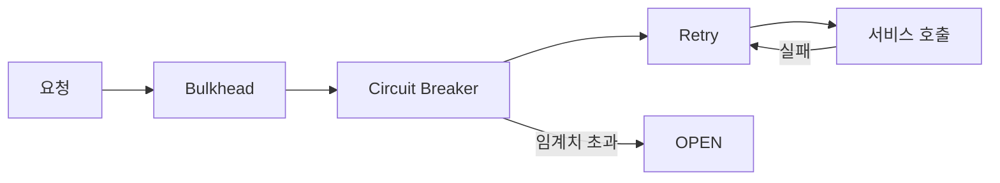

마이크로서비스 환경에서 외부 서비스 호출은 실패할 수 있다. 한 서비스의 장애가 연쇄적으로 전파돼 전체 시스템이 다운되는 "연쇄 장애(Cascading Failure)"가 가장 위험하다. Resilience4j는 이를 방어하는 경량 내결함성(Fault Tolerance) 라이브러리다.

> **비유**: 전기 두꺼비집(Circuit Breaker)을 생각하라. 과부하가 걸리면 자동으로 전기를 차단해 화재를 방지한다. Resilience4j는 서비스 호출에도 이 두꺼비집을 달아준다. 외부 서비스가 불안정하면 회로를 열어 요청을 차단하고, 일정 시간 후 조심스럽게 다시 연결을 시도한다.

---

## 의존성

```xml
<dependency>
    <groupId>org.springframework.boot</groupId>
    <artifactId>spring-boot-starter-aop</artifactId>
</dependency>
<dependency>
    <groupId>io.github.resilience4j</groupId>
    <artifactId>resilience4j-spring-boot3</artifactId>
</dependency>
<dependency>
    <groupId>org.springframework.boot</groupId>
    <artifactId>spring-boot-starter-actuator</artifactId>
</dependency>
```

---

## Circuit Breaker

### 개념과 상태 전이

Circuit Breaker는 세 가지 상태를 오간다. 이 상태 기계를 이해하는 것이 핵심이다.

- **CLOSED**: 정상 상태. 모든 요청이 통과된다. 실패율을 모니터링한다.
- **OPEN**: 차단 상태. 외부 서비스가 불안정하므로 요청을 즉시 거부하고 fallback을 실행한다. 외부 서비스가 회복할 시간을 벌어준다.
- **HALF_OPEN**: 회복 테스트 상태. 제한된 수의 요청만 허용해서 외부 서비스가 회복됐는지 확인한다. 성공하면 CLOSED로, 실패하면 OPEN으로 돌아간다.

Circuit Breaker가 없으면 장애 서비스로 요청이 계속 쌓여 스레드 풀이 고갈되고, 연쇄적으로 호출하는 서비스까지 응답 불가 상태가 된다.

```mermaid
graph LR
    CLOSED["CLOSED(정상)"]
    OPEN["OPEN(차단)"]
    HALF_OPEN["HALF_OPEN(테스트)"]
    CLOSED -->|"실패율 임계치 초과"| OPEN
    OPEN -->|"대기 시간 경과"| HALF_OPEN
    H..|"시험 요청 성공"| CLOSED
    HALF..|"시험 요청 실패"| OPEN
```

### 설정

```yaml
resilience4j:
  circuitbreaker:
    instances:
      user-service:
        sliding-window-type: COUNT_BASED   # COUNT_BASED 또는 TIME_BASED
        sliding-window-size: 10            # 최근 10회 호출 기준
        failure-rate-threshold: 50         # 50% 이상 실패 시 OPEN
        wait-duration-in-open-state: 30s   # OPEN → HALF_OPEN 대기
        permitted-number-of-calls-in-half-open-state: 5  # 시험 호출 수
        minimum-number-of-calls: 5         # 최소 5회 호출 후 통계 시작
        slow-call-duration-threshold: 3s   # 3초 이상이면 느린 호출
        slow-call-rate-threshold: 80       # 80% 느린 호출 시 OPEN
        ignore-exceptions:
          - com.example.BusinessException  # 이 예외는 실패 통계에서 제외
```

### 사용 예시

```java
@Service
public class OrderService {

    @CircuitBreaker(name = "user-service", fallbackMethod = "getUserFallback")
    public UserDto getUser(Long userId) {
        return userServiceClient.getUser(userId);
    }

    // fallback 메서드: 원래 메서드와 동일한 반환 타입 + 마지막 파라미터에 Throwable
    private UserDto getUserFallback(Long userId, Throwable throwable) {
        log.warn("Circuit breaker activated for userId: {}, reason: {}",
                 userId, throwable.getMessage());
        return UserDto.builder()
            .id(userId)
            .name("Unknown")
            .build();
    }
}
```

---

## Retry

### 개념

일시적 오류(네트워크 순단, DB 타임아웃)는 즉시 재시도하면 성공할 수 있다. Retry는 지정된 횟수만큼 자동으로 재시도하고, 지수 백오프(Exponential Backoff)로 재시도 간격을 늘린다.

재시도마다 대기 시간을 늘리는 이유는 외부 서비스에 과부하를 주지 않기 위해서다. 모든 인스턴스가 동시에 재시도하면(Thunder Herd) 오히려 상황이 악화된다. Jitter(랜덤 지연)를 추가하면 동시 재시도를 분산할 수 있다.

### 설정

```yaml
resilience4j:
  retry:
    instances:
      payment-service:
        max-attempts: 3               # 최대 3회 시도 (첫 시도 포함)
        wait-duration: 500ms
        enable-exponential-backoff: true
        exponential-backoff-multiplier: 2   # 500ms → 1000ms → 2000ms
        exponential-max-wait-duration: 5s   # 최대 대기 5초
        retry-exceptions:
          - java.io.IOException
          - java.util.concurrent.TimeoutException
        ignore-exceptions:
          - com.example.PaymentDeclinedException  # 재시도 안 함
```

```
재시도 흐름:
1회 시도 → 실패
500ms 대기
2회 시도 → 실패
1000ms 대기 (500 × 2)
3회 시도 → 실패
→ 최종 실패, fallback 실행
```

### 사용 예시

```java
@Service
public class PaymentService {

    @Retry(name = "payment-service", fallbackMethod = "paymentFallback")
    @CircuitBreaker(name = "payment-service")  // Retry + Circuit Breaker 조합
    public PaymentResult processPayment(PaymentRequest request) {
        return paymentClient.process(request);
    }

    private PaymentResult paymentFallback(PaymentRequest request, Throwable t) {
        log.error("Payment failed after retries: {}", t.getMessage());
        return PaymentResult.failed("결제 서비스가 일시적으로 불가합니다.");
    }
}
```

---

## Bulkhead

### 개념

한 서비스 호출이 스레드를 독점해 다른 서비스 호출까지 막히는 상황을 방지한다. 느린 외부 API 하나 때문에 전체 서버의 스레드 풀이 고갈되는 것을 막는다.

> **비유**: 선박의 격벽(Bulkhead). 한 구획에 물이 들어와도 격벽이 다른 구획으로 번지는 것을 막는다. 한 서비스 장애가 다른 서비스를 망가뜨리지 못하게 격벽을 친다.

### 세마포어 방식 (SemaphoreBulkhead)

동시 호출 수를 제한한다. 초과 시 즉시 또는 짧은 대기 후 거부한다.

```yaml
resilience4j:
  bulkhead:
    instances:
      inventory-service:
        max-concurrent-calls: 20   # 동시 20개 허용
        max-wait-duration: 100ms   # 포화 시 100ms 대기 후 거부
```

```java
@Service
public class InventoryService {

    @Bulkhead(name = "inventory-service", type = Bulkhead.Type.SEMAPHORE)
    public InventoryDto getInventory(Long productId) {
        return inventoryClient.getInventory(productId);
    }
}
```

---

## Rate Limiter

### 개념

단위 시간당 최대 요청 수를 제한한다. 외부 API 쿼터를 지키거나, 내부 서비스 보호에 사용한다.

```yaml
resilience4j:
  ratelimiter:
    instances:
      external-api:
        limit-refresh-period: 1s    # 1초마다 허용 횟수 리셋
        limit-for-period: 100       # 초당 100개 허용
        timeout-duration: 500ms     # 초과 시 500ms 대기 후 RateLimiterException
```

```java
@Service
public class ExternalApiService {

    @RateLimiter(name = "external-api", fallbackMethod = "rateLimitFallback")
    public ApiResponse callExternalApi(String query) {
        return externalApiClient.query(query);
    }

    private ApiResponse rateLimitFallback(String query, RequestNotPermitted ex) {
        log.warn("Rate limit exceeded for query: {}", query);
        return ApiResponse.rateLimited("요청이 너무 많습니다. 잠시 후 재시도하세요.");
    }
}
```

---

## 어노테이션 우선순위 조합

여러 어노테이션을 함께 쓸 때 실행 순서가 중요하다. **안쪽에서 바깥쪽** 순으로 감싸진다.

```java
@Retry(name = "service")           // 4. 가장 바깥: 전체를 재시도
@CircuitBreaker(name = "service")  // 3. 회로 차단
@RateLimiter(name = "service")     // 2. 속도 제한
@Bulkhead(name = "service")        // 1. 가장 안쪽: 동시성 제어
public Result callService(Request request) {
    return client.call(request);
}
```

이 순서가 의미하는 것은: Bulkhead가 동시성을 제어한 뒤 RateLimiter가 속도를 제어하고, Circuit Breaker가 회로 상태를 확인한 뒤, Retry가 실패 시 전체 과정을 재시도한다.



---


## 극한 시나리오

### 시나리오 1: 연쇄 장애 (Cascading Failure) 방어

```
상황: Payment Service가 느려짐 (3초 응답)

Circuit Breaker 없을 때:
  Order Service → Payment 호출 스레드 점유
  → Order Service 스레드 풀 고갈
  → Order Service도 응답 불가
  → API Gateway도 타임아웃
  → 전체 시스템 다운

Circuit Breaker + Bulkhead 있을 때:
  Payment Service 느려짐
  → TimeLimiter로 3초 후 타임아웃
  → Circuit Breaker: 실패율 50% 초과 → OPEN
  → 이후 Payment 요청은 즉시 fallback 반환 (스레드 해방)
  → Order Service 정상 동작 유지
  → 30초 후 HALF_OPEN → Payment 회복 테스트
```

### 시나리오 2: Circuit Breaker 튜닝

너무 민감하면 일시적 오류에도 서킷이 열려 정상 요청도 차단된다. 너무 둔감하면 장애가 전파된다.

```
너무 민감 (자주 OPEN됨):
→ minimum-number-of-calls 늘리기 (최소 30회 관찰)
→ failure-rate-threshold 높이기 (50% → 70%)
→ slow-call-duration-threshold 늘리기 (1s → 5s)

너무 둔감 (장애 전파됨):
→ sliding-window-size 줄이기
→ failure-rate-threshold 낮추기
→ minimum-number-of-calls 줄이기
```

### 시나리오 3: 계층적 Fallback 전략

```java
// 1차 fallback: 캐시에서 조회
@CircuitBreaker(name = "product-service", fallbackMethod = "getProductFromCache")
public ProductDto getProduct(Long productId) {
    return productServiceClient.getProduct(productId);
}

private ProductDto getProductFromCache(Long productId, Exception e) {
    return productCache.get(productId)
        .orElseGet(() -> getProductFromDB(productId, e));
}

// 2차 fallback: DB에서 직접 조회
private ProductDto getProductFromDB(Long productId, Exception e) {
    try {
        return productRepository.findById(productId)
            .map(ProductDto::fromEntity)
            .orElseGet(() -> getProductDefault(productId, e));
    } catch (Exception dbEx) {
        return getProductDefault(productId, dbEx);
    }
}

// 3차 fallback: 기본값 반환
private ProductDto getProductDefault(Long productId, Exception e) {
    log.error("All fallbacks exhausted for productId: {}", productId, e);
    return ProductDto.unavailable(productId);
}
```

---
## Actuator 메트릭

```
주요 메트릭 (Prometheus):
resilience4j_circuitbreaker_state              상태 (0=CLOSED, 1=OPEN, 2=HALF_OPEN)
resilience4j_circuitbreaker_failure_rate       실패율
resilience4j_circuitbreaker_calls_total        총 호출 수
resilience4j_retry_calls_total                 재시도 호출 수
resilience4j_bulkhead_available_concurrent_calls  사용 가능한 동시 호출 슬롯
resilience4j_ratelimiter_available_permissions    남은 요청 허용 수
```

Circuit Breaker가 OPEN 상태로 전환될 때 알림을 받으려면 이벤트 리스너를 등록한다.

```java
@PostConstruct
public void subscribeEvents() {
    CircuitBreaker cb = circuitBreakerRegistry.circuitBreaker("user-service");

    cb.getEventPublisher()
        .onStateTransition(event -> {
            if (event.getStateTransition().getToState() == CircuitBreaker.State.OPEN) {
                alertService.sendAlert("Circuit Breaker OPEN: user-service");
            }
        });
}
```

---

## 왜 이 기술인가?

| 라이브러리 | Circuit Breaker | Retry | Bulkhead | Rate Limiter | 적합한 상황 |
|---|---|---|---|---|---|
| Resilience4j | O | O | O | O | Spring Boot 표준, 경량 |
| Hystrix (Netflix) | O | X | O | X | 레거시 (유지보수 종료) |
| Sentinel (Alibaba) | O | O | O | O | Alibaba 클라우드 생태계 |
| Failsafe | O | O | X | X | 순수 Java, Spring 통합 없음 |

**결론:** Spring Cloud 2020 이후 Hystrix가 유지보수 종료되어 Resilience4j가 표준이다. 함수형 API, Spring Boot Actuator 통합, Micrometer 메트릭을 기본 제공한다.

---

## 실무에서 자주 하는 실수

1. **Circuit Breaker를 모든 외부 호출에 무조건 적용** — DB 쿼리나 내부 메서드에 Circuit Breaker를 적용하면 오히려 복잡도만 증가한다. 외부 네트워크 호출(HTTP, gRPC)처럼 실패 가능성이 있는 I/O에만 적용하는 것이 원칙이다.

2. **Retry + Circuit Breaker 순서 잘못 설정** — Retry가 Circuit Breaker 바깥에 있으면, Circuit Breaker가 OPEN 상태에서도 Retry가 반복 호출을 시도한다. 올바른 순서: `Retry → Circuit Breaker → (실제 호출)`. Retry는 Circuit Breaker보다 먼저 감싸야 한다.

3. **fallback 메서드 시그니처 불일치** — `@CircuitBreaker(fallbackMethod = "fallback")`에서 fallback 메서드는 원본 메서드와 같은 파라미터 + `Throwable`을 마지막에 받아야 한다. 시그니처가 다르면 런타임에 `NoSuchMethodException`이 발생한다.

4. **Bulkhead 설정 없이 슬로우 API 하나가 전체 스레드풀 점유** — 외부 API가 느려지면 해당 API를 호출하는 스레드가 모두 블로킹된다. Bulkhead로 외부 API별 스레드/세마포어를 격리하지 않으면 하나의 느린 서비스가 전체 애플리케이션을 마비시킨다.

5. **운영 환경에서 Half-Open 상태 모니터링 없음** — Circuit Breaker가 HALF_OPEN 상태에서 테스트 요청을 보내는데, 이 상태가 반복되면 서비스가 회복되지 않고 있다는 신호다. Actuator의 `/actuator/circuitbreakers` 또는 Micrometer 메트릭으로 상태 변화를 알림으로 연동해야 한다.

---

## 면접 포인트

**Q1. Circuit Breaker의 세 가지 상태와 전환 조건은?**
> CLOSED: 정상 동작, 실패율이 임계값(기본 50%) 미만. OPEN: 호출 차단, 대기 시간(`waitDurationInOpenState`, 기본 60초) 후 HALF_OPEN으로 전환. HALF_OPEN: 제한된 테스트 요청 허용, 성공하면 CLOSED, 실패하면 다시 OPEN으로 복귀.

**Q2. Resilience4j의 Count-based와 Time-based 슬라이딩 윈도우 차이는?**
> Count-based: 최근 N번의 호출로 실패율 계산. 트래픽이 적을 때 소수의 실패로 Circuit Breaker가 열릴 수 있다. Time-based: 최근 N초 동안의 호출로 실패율 계산. 트래픽 양과 무관하게 시간 기준으로 평가해 더 안정적이다.

**Q3. Bulkhead의 두 가지 구현 방식은?**
> Semaphore Bulkhead: 동시 호출 수를 세마포어로 제한. 같은 스레드에서 실행되어 오버헤드가 낮다. ThreadPool Bulkhead: 별도 스레드풀에서 실행해 완전히 격리. 느린 호출이 호출 스레드를 블로킹하지 않는다. Reactor/WebFlux에서는 Semaphore가 더 적합하다.

**Q4. `@Retry`와 Circuit Breaker를 함께 사용할 때 올바른 순서는?**
> `Retry(CircuitBreaker(RateLimiter(func)))` 순서로 감싼다. Retry가 가장 바깥에 있어야 Circuit Breaker OPEN 상태에서 불필요한 재시도를 하지 않는다. Circuit Breaker가 OPEN이면 즉시 예외를 반환하고, Retry가 그 예외를 받아 재시도를 결정한다.

**Q5. Resilience4j 메트릭을 모니터링하는 방법은?**
> `resilience4j-micrometer` 의존성 추가 시 Micrometer를 통해 Prometheus 등으로 메트릭이 자동 노출된다. 주요 메트릭: `resilience4j.circuitbreaker.state`(상태), `resilience4j.circuitbreaker.failure.rate`(실패율), `resilience4j.retry.calls`(재시도 횟수). Grafana 대시보드와 연동해 상태 변화를 시각화한다.
