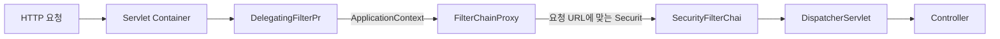
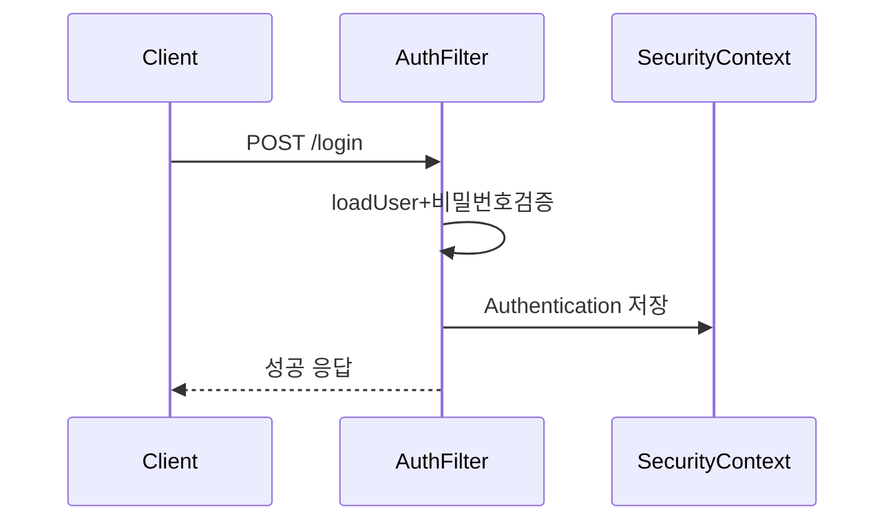
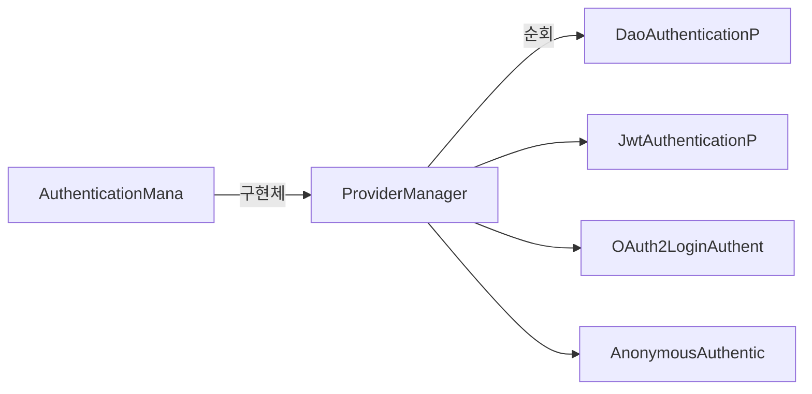
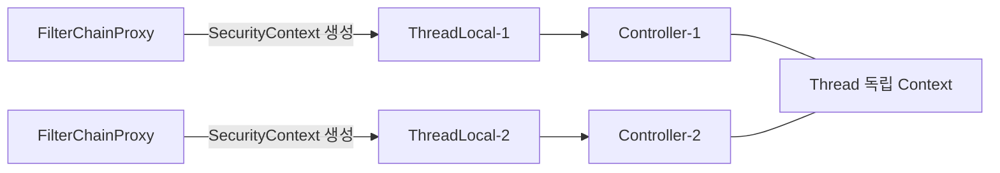
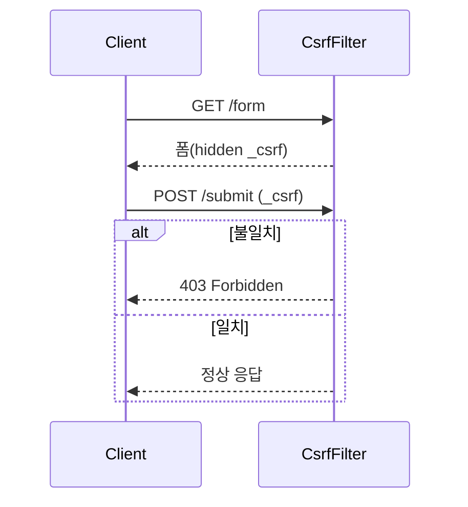

JWT 토큰이 없는 요청이 `/api/admin`에 들어왔는데 그냥 통과됐다. 필터 순서가 잘못됐거나 필터 자체가 누락된 것이다. Spring Security 아키텍처를 모르면 어디서 막혀야 하는지조차 알 수 없다.

> **비유로 먼저 이해하기**: Spring Security는 공항 보안검색대와 같다. 탑승구(Controller)에 도달하려면 발권 확인(인증 필터), 수하물 검사(권한 필터), 위험물 탐지(CSRF 필터) 등 여러 단계를 순서대로 통과해야 한다. 한 단계라도 실패하면 그 자리에서 차단된다.

---

## 1. SecurityFilterChain 구조와 동작 원리

Spring Security는 **Servlet Filter 체인**으로 구현된다. HTTP 요청이 Spring 애플리케이션에 들어오면 Servlet 컨테이너의 필터 체인을 거치는데, Spring Security는 이 필터 체인에 자신의 보안 필터들을 끼워넣는다.

`DelegatingFilterProxy`가 Servlet 컨테이너와 Spring Security 사이의 다리 역할을 한다. Servlet 컨테이너는 Spring ApplicationContext를 모르기 때문에, `DelegatingFilterProxy`가 ApplicationContext에서 `FilterChainProxy` Bean을 찾아 실제 처리를 위임한다.



SecurityFilterChain에 등록되는 필터들은 순서가 정해져 있다. 대표적인 필터들:
- `SecurityContextHolderFilter` — ThreadLocal에 SecurityContext 저장
- `CsrfFilter` — CSRF 토큰 검증
- `LogoutFilter` — 로그아웃 처리
- `UsernamePasswordAuthenticationFilter` — 폼 로그인 처리
- `BasicAuthenticationFilter` — HTTP Basic 인증
- `AnonymousAuthenticationFilter` — 익명 사용자 처리
- `ExceptionTranslationFilter` — 보안 예외를 HTTP 응답으로 변환
- `AuthorizationFilter` — 인가 처리

### SecurityFilterChain 설정

```java
@Configuration
@EnableWebSecurity
public class SecurityConfig {

    @Bean
    public SecurityFilterChain filterChain(HttpSecurity http) throws Exception {
        http
            .csrf(csrf -> csrf.disable())  // REST API는 보통 비활성화

            .sessionManagement(session ->
                session.sessionCreationPolicy(SessionCreationPolicy.STATELESS))  // JWT 사용 시

            .authorizeHttpRequests(auth -> auth
                .requestMatchers("/api/public/**").permitAll()
                .requestMatchers("/api/admin/**").hasRole("ADMIN")
                .requestMatchers(HttpMethod.GET, "/api/orders").hasAnyRole("USER", "ADMIN")
                .anyRequest().authenticated()
            )

            // JWT 필터를 UsernamePasswordAuthenticationFilter 앞에 추가
            .addFilterBefore(jwtAuthFilter, UsernamePasswordAuthenticationFilter.class);

        return http.build();
    }
}
```

---

## 2. 인증(Authentication) vs 인가(Authorization)

| 구분 | Authentication (인증) | Authorization (인가) |
|------|----------------------|---------------------|
| 질문 | "당신이 누구인가?" | "당신이 이것을 할 수 있는가?" |
| 처리 시점 | 먼저 | 인증 후 |
| 실패 시 | 401 Unauthorized | 403 Forbidden |
| 담당 컴포넌트 | AuthenticationManager | AuthorizationManager |
| Spring Security | UsernamePasswordAuthenticationFilter 등 | AuthorizationFilter |

인증과 인가는 반드시 이 순서로 일어난다. 인증되지 않은 사람에게 권한을 물어봐도 의미가 없기 때문이다.

---

## 3. 인증 흐름 (폼 로그인)

폼 로그인 요청(`POST /login`)이 들어왔을 때 Spring Security 내부에서 일어나는 일을 단계별로 살펴본다.

1️⃣ **토큰 생성**: 사용자 입력으로 미인증 `UsernamePasswordAuthenticationToken` 생성
2️⃣ **AuthenticationManager 위임**: `ProviderManager`가 적절한 `AuthenticationProvider`를 찾는다
3️⃣ **UserDetailsService 조회**: DB에서 사용자 정보를 로드한다
4️⃣ **비밀번호 검증**: `PasswordEncoder.matches()`로 비밀번호를 비교한다
5️⃣ **SecurityContext 저장**: 인증 성공 시 ThreadLocal에 Authentication을 저장한다
6️⃣ **성공 응답 반환**: `AuthenticationSuccessHandler`가 처리한다



---

## 4. AuthenticationManager와 AuthenticationProvider

`AuthenticationManager`의 기본 구현체는 `ProviderManager`다. 등록된 `AuthenticationProvider` 목록을 순서대로 돌면서 해당 인증 방식을 지원하는 Provider를 찾아 위임한다.



`DaoAuthenticationProvider`가 가장 기본적인 구현체다. `UserDetailsService`에서 사용자를 로드하고, `PasswordEncoder`로 비밀번호를 검증한다.

---

## 5. UserDetailsService

```java
@Service
public class CustomUserDetailsService implements UserDetailsService {

    @Override
    public UserDetails loadUserByUsername(String username)
            throws UsernameNotFoundException {
        User user = userRepository.findByEmail(username)
                .orElseThrow(() -> new UsernameNotFoundException("사용자 없음: " + username));

        return org.springframework.security.core.userdetails.User.builder()
                .username(user.getEmail())
                .password(user.getPassword())  // 이미 BCrypt 인코딩된 비밀번호
                .roles(user.getRole().name())
                .accountExpired(!user.isActive())
                .accountLocked(user.isLocked())
                .build();
    }
}
```

도메인 엔티티에서 추가 정보를 꺼내려면 커스텀 `UserDetails`를 구현한다.

```java
public class CustomUserDetails implements UserDetails {
    private final User user;

    @Override
    public Collection<? extends GrantedAuthority> getAuthorities() {
        return user.getRoles().stream()
                .map(role -> new SimpleGrantedAuthority("ROLE_" + role.name()))
                .collect(Collectors.toList());
    }

    // 도메인 객체 직접 접근
    public Long getId() { return user.getId(); }
    public String getName() { return user.getName(); }
    // ...
}
```

---

## 6. SecurityContext와 ThreadLocal

`SecurityContextHolder`는 현재 스레드의 인증 정보를 ThreadLocal에 저장한다. 덕분에 어디서든 `SecurityContextHolder.getContext()`로 현재 사용자 정보를 꺼낼 수 있다.



```java
// SecurityContext에서 현재 사용자 꺼내기
Authentication auth = SecurityContextHolder.getContext().getAuthentication();
String username = auth.getName();

// Spring MVC에서 자동 주입
@GetMapping("/mypage")
public String myPage(@AuthenticationPrincipal CustomUserDetails user) {
    Long userId = user.getId();
    return "mypage";
}
```

**주의**: `@Async` 등 비동기 처리 시 SecurityContext가 새 스레드로 전파되지 않는다.

```java
@Configuration
@EnableAsync
public class AsyncConfig implements AsyncConfigurer {
    @Override
    public Executor getAsyncExecutor() {
        ThreadPoolTaskExecutor executor = new ThreadPoolTaskExecutor();
        executor.initialize();
        // SecurityContext를 자식 Thread에 자동 전파
        return new DelegatingSecurityContextAsyncTaskExecutor(executor);
    }
}
```

---

## 7. CSRF 동작 원리

CSRF(Cross-Site Request Forgery): 인증된 사용자의 브라우저를 이용해 악의적 요청을 보내는 공격이다.

```
[CSRF 공격 시나리오]
1. 사용자가 bank.com에 로그인 (세션 쿠키 발급)
2. 악의적 사이트(evil.com) 방문
3. evil.com의 자동 폼 제출: POST bank.com/transfer?amount=10000&to=hacker
   → 브라우저가 자동으로 bank.com 세션 쿠키 포함
4. bank.com은 유효한 세션으로 인식 → 이체 실행!
```

Spring Security는 서버가 발급한 CSRF 토큰을 요청에 포함시켜야만 처리한다. 악의적 사이트는 이 토큰을 모르므로 공격이 실패한다.



REST API + JWT(Stateless 세션)를 사용하면 쿠키 기반 세션이 없으므로 CSRF 공격이 불가능하다. 따라서 `csrf().disable()`을 적용한다.

---

## 8. CORS 동작 원리

CORS(Cross-Origin Resource Sharing): 브라우저의 동일 출처 정책(SOP)을 제어하는 메커니즘이다.

프론트엔드가 `http://localhost:3000`, 백엔드가 `http://localhost:8080`이면 출처가 달라서 브라우저가 요청을 차단한다. 서버가 허용 목록을 응답 헤더로 알려줘야 브라우저가 요청을 허용한다.

브라우저는 실제 요청 전에 OPTIONS 메서드로 **Preflight 요청**을 보내 서버의 허용 여부를 먼저 확인한다. 서버가 `Access-Control-Allow-Origin` 헤더로 응답하면 이후 실제 요청을 보낸다.

```java
@Bean
public CorsConfigurationSource corsConfigurationSource() {
    CorsConfiguration config = new CorsConfiguration();

    config.setAllowedOrigins(List.of(
        "http://localhost:3000",
        "https://myapp.com"
    ));
    config.setAllowedMethods(List.of("GET", "POST", "PUT", "DELETE", "PATCH", "OPTIONS"));
    config.setAllowedHeaders(List.of("*"));
    config.setAllowCredentials(true);  // 쿠키/인증 헤더 허용
    config.setMaxAge(3600L);           // Preflight 캐시 시간

    UrlBasedCorsConfigurationSource source = new UrlBasedCorsConfigurationSource();
    source.registerCorsConfiguration("/api/**", config);
    return source;
}
```

---

## 9. JWT 인증 구현

JWT 인증 필터는 `OncePerRequestFilter`를 상속해서 구현한다. 모든 요청마다 한 번만 실행되는 것을 보장한다.

```java
@Component
public class JwtAuthenticationFilter extends OncePerRequestFilter {

    @Override
    protected void doFilterInternal(HttpServletRequest request,
                                     HttpServletResponse response,
                                     FilterChain filterChain)
            throws ServletException, IOException {

        String token = resolveToken(request);  // 1️⃣ 헤더에서 토큰 추출

        if (token != null && jwtTokenProvider.validateToken(token)) {
            String username = jwtTokenProvider.getUsername(token);  // 2️⃣ 토큰에서 사용자 추출
            UserDetails userDetails = userDetailsService.loadUserByUsername(username);

            // 3️⃣ Authentication 객체 생성
            UsernamePasswordAuthenticationToken auth =
                new UsernamePasswordAuthenticationToken(
                    userDetails, null, userDetails.getAuthorities());
            auth.setDetails(new WebAuthenticationDetailsSource().buildDetails(request));

            // 4️⃣ SecurityContext에 저장
            SecurityContextHolder.getContext().setAuthentication(auth);
        }

        filterChain.doFilter(request, response);  // 5️⃣ 다음 필터로 전달
    }

    private String resolveToken(HttpServletRequest request) {
        String bearer = request.getHeader("Authorization");
        if (StringUtils.hasText(bearer) && bearer.startsWith("Bearer ")) {
            return bearer.substring(7);
        }
        return null;
    }
}
```

---

## 정리

| 구성요소 | 역할 |
|---------|------|
| DelegatingFilterProxy | Servlet Container ↔ Spring 연결 |
| FilterChainProxy | SecurityFilterChain 목록 관리 |
| SecurityFilterChain | 보안 필터 체인 |
| UsernamePasswordAuthenticationFilter | 폼 로그인 처리 |
| AuthenticationManager (ProviderManager) | 인증 위임 |
| AuthenticationProvider | 실제 인증 처리 |
| UserDetailsService | 사용자 정보 로드 |
| SecurityContextHolder | ThreadLocal로 Authentication 저장 |
| ExceptionTranslationFilter | 보안 예외 → HTTP 응답 변환 |
| AuthorizationFilter | 인가 처리 |
| CSRF | 동일 출처 위조 방어 (세션 기반에서 필요) |
| CORS | 교차 출처 요청 허용 정책 |

---

## 왜 이 기술인가?

| 방식 | Spring 통합 | 커스터마이징 | 학습 곡선 | 적합한 상황 |
|---|---|---|---|---|
| Spring Security | 완벽 | 높음 | 높음 | Spring 기반 서비스 표준 |
| Apache Shiro | 보통 | 중간 | 낮음 | 단순 인증·인가 |
| Keycloak (외부 IdP) | 좋음 | 중간 | 중간 | SSO, OAuth2 전용 |
| 직접 구현 | 없음 | 완전 | 매우 높음 | 매우 특수한 요건 |
| AWS Cognito | 보통 | 낮음 | 낮음 | AWS 환경, 관리형 |

**결론:** Spring 기반 서비스에서 Spring Security는 사실상 표준이다. 필터 체인 기반으로 모든 보안 요소를 조합할 수 있고, Spring Boot Auto-configuration으로 초기 설정이 간단하다.

---

## 실무에서 자주 하는 실수

1. **`authorizeHttpRequests` 규칙 순서 오류** — 더 좁은 경로(`/api/admin/**`)를 넓은 경로(`/api/**`) 뒤에 두면 관리자 경로가 일반 규칙에 먼저 매칭된다. 구체적인 경로를 항상 위에 배치해야 한다.

2. **REST API에서 CSRF 토큰 미비활성화** — JWT를 Authorization 헤더로 전송하는 Stateless API에서 CSRF를 활성화하면 POST 요청마다 CSRF 토큰이 필요해진다. Stateless + JWT 방식에서는 `csrf.disable()`이 올바르다.

3. **`SecurityFilterChain` 대신 `WebSecurityConfigurerAdapter` 사용** — Spring Security 5.7 이후 `WebSecurityConfigurerAdapter`가 deprecated됐다. `SecurityFilterChain` 빈 방식으로 마이그레이션해야 한다.

4. **JWT 검증 필터에서 예외를 `throw`로 처리** — JWT 필터에서 예외를 던지면 Spring Security 예외 처리 메커니즘이 작동하지 않아 500이 반환된다. `sendError(401)`나 `SecurityContextHolder`를 비우고 체인을 계속 진행해 `AuthenticationEntryPoint`가 처리하게 해야 한다.

5. **`@PreAuthorize` 없이 역할 기반 접근 제어 누락** — `authorizeHttpRequests`에만 의존하면 URL 패턴 변경 시 보안 구멍이 생긴다. 서비스 메서드에 `@PreAuthorize("hasRole('ADMIN')")`을 추가해 URL과 메서드 두 레이어에서 인가를 적용해야 한다.

---

## 면접 포인트

**Q1. Spring Security 필터 체인의 처리 흐름은?**
> HTTP 요청 → DelegatingFilterProxy → FilterChainProxy → SecurityFilterChain (여러 필터 순서대로) → Controller. 주요 필터: `SecurityContextPersistenceFilter`(SecurityContext 로드), `UsernamePasswordAuthenticationFilter`(폼 로그인), `JwtAuthenticationFilter`(JWT 검증), `ExceptionTranslationFilter`(예외→401/403 변환), `FilterSecurityInterceptor`(인가 결정).

**Q2. Authentication과 Authorization의 차이는?**
> Authentication(인증): "당신이 누구인가" 확인. 자격증명(ID/PW, JWT)으로 신원을 확인한다. Authorization(인가): "당신이 무엇을 할 수 있는가" 확인. 인증된 사용자의 권한으로 리소스 접근을 허용/거부한다. Spring Security는 인증 후 `SecurityContextHolder`에 `Authentication` 객체를 저장하고, 인가 시 이를 참조한다.

**Q3. `UserDetailsService`의 역할은?**
> `loadUserByUsername(String username)`을 구현해 DB에서 사용자를 조회하고 `UserDetails` 객체를 반환한다. Spring Security는 이를 `AuthenticationManager`에서 자격증명 검증에 사용한다. 반환된 `UserDetails`의 `getAuthorities()`가 인가에서 사용된다.

**Q4. CSRF 공격이란 무엇이고 Spring Security는 어떻게 방어하는가?**
> CSRF: 인증된 사용자의 브라우저가 공격자 사이트에서 의도치 않게 서버에 요청을 보내는 공격. 브라우저가 쿠키를 자동으로 포함하는 점을 악용한다. Spring Security 방어: 서버가 발급한 CSRF 토큰을 요청에 포함시켜야만 처리. JWT + Authorization 헤더 방식은 브라우저가 자동으로 보내지 않으므로 CSRF 방어가 불필요하다.

**Q5. `SecurityContextHolder`의 저장 전략과 멀티스레드 주의사항은?**
> 기본 전략은 `ThreadLocal`이다. 현재 스레드에만 SecurityContext가 유지된다. `@Async` 스레드에서는 SecurityContext가 비어 있다. 비동기 처리에서 인증 정보가 필요하면 `MODE_INHERITABLETHREADLOCAL`로 변경하거나, `DelegatingSecurityContextRunnable`로 명시적으로 전파해야 한다.
