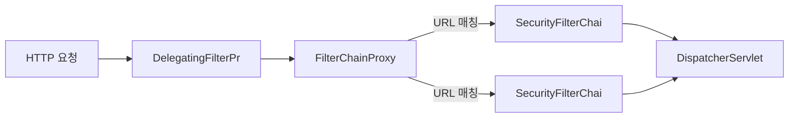
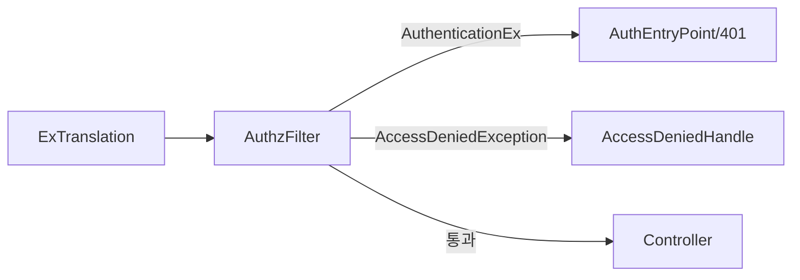
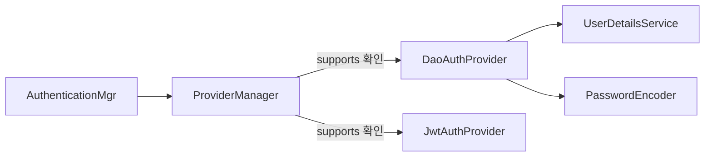
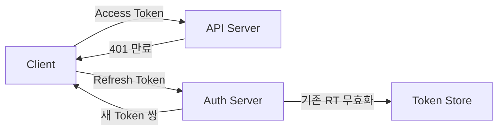

JWT 없는 요청이 `/api/admin`을 통과했다. 필터가 누락됐는지, 순서가 잘못됐는지, SecurityContext가 비어있는지 — Spring Security 아키텍처를 모르면 어디서 막혀야 하는지조차 알 수 없다. 내부 메커니즘을 모르고 어노테이션만 붙이다 보면 보안 구멍은 반드시 생긴다.

> **비유로 먼저 이해하기**: Spring Security는 공항 입국심사와 같다. 게이트(Controller)에 닿기 전 수하물 스캔(CSRF 필터), 여권 확인(인증 필터), 비자 검증(인가 필터)을 순서대로 통과해야 한다. 한 단계라도 실패하면 그 자리에서 차단된다. 그리고 이 모든 검사관은 공항 직원 명부(SecurityContext)를 공유하지만, 각자의 데스크(ThreadLocal)에서 독립적으로 일한다.

---

## 1. Filter Chain 아키텍처: DelegatingFilterProxy → FilterChainProxy → SecurityFilterChain

### 왜 Servlet Filter가 진입점인가

Spring Security가 왜 Servlet Filter 레벨에서 동작하는지 먼저 이해해야 한다. HTTP 요청이 들어오면 Servlet 컨테이너(Tomcat)가 가장 먼저 받는다. DispatcherServlet에 도달하기 전 단계다. 즉, **Servlet Filter는 Spring MVC보다 먼저 실행된다.** 보안은 요청이 애플리케이션 코드에 닿기 전에 차단해야 한다 — 이것이 Filter 레벨을 선택한 이유다.

Controller에서 보안을 처리하면 두 가지 문제가 생긴다. 첫째, 모든 Controller에 보안 코드가 분산된다. 둘째, 악의적 요청이 이미 애플리케이션 코드까지 들어온 상태다. SQL 주입, DoS 공격처럼 Controller에 닿기 전에 막아야 할 것들이 있다.

### DelegatingFilterProxy의 존재 이유

Servlet 컨테이너는 Spring `ApplicationContext`를 알지 못한다. Tomcat은 단순히 `javax.servlet.Filter` 인터페이스를 구현한 클래스를 등록·실행할 뿐이다. 그런데 Spring Security의 필터들은 Spring Bean이어야 한다 — `@Autowired`, `@Value` 등 Spring의 DI 혜택을 받아야 하기 때문이다.

`DelegatingFilterProxy`가 이 간극을 메운다. Servlet 컨테이너에는 단순 Filter로 등록되지만, 실제 처리는 `ApplicationContext`에서 꺼낸 Spring Bean에 위임한다. 이름처럼 "위임하는 프록시"다.

```java
// Spring Boot는 자동으로 아래를 등록한다 (SecurityFilterAutoConfiguration)
// 수동 등록 시:
public class SecurityWebApplicationInitializer
        extends AbstractSecurityWebApplicationInitializer {
    // "springSecurityFilterChain" 이름의 Bean을 DelegatingFilterProxy로 감싸서
    // Servlet 컨테이너에 등록한다
}
```

`DelegatingFilterProxy`가 위임하는 Bean의 이름이 바로 `"springSecurityFilterChain"`이고, 그 구현체가 `FilterChainProxy`다.

### FilterChainProxy의 역할

`FilterChainProxy`는 Spring Security의 핵심 관리자다. 여러 개의 `SecurityFilterChain`을 보유하고, 들어온 요청 URL에 맞는 체인을 선택해 처리를 위임한다.

```java
// FilterChainProxy 내부 동작 (간략화)
public class FilterChainProxy extends GenericFilterBean {

    private List<SecurityFilterChain> filterChains;

    @Override
    public void doFilter(ServletRequest request, ServletResponse response,
                         FilterChain chain) throws IOException, ServletException {

        HttpServletRequest httpRequest = (HttpServletRequest) request;

        // 요청 URL에 맞는 SecurityFilterChain 선택
        List<Filter> filters = getFilters(httpRequest);

        if (filters == null || filters.isEmpty()) {
            // 매칭되는 체인 없음 → 보안 필터 없이 통과
            chain.doFilter(request, response);
            return;
        }

        // 가상 필터 체인 실행
        VirtualFilterChain virtualChain =
            new VirtualFilterChain(chain, filters);
        virtualChain.doFilter(request, response);
    }

    private List<Filter> getFilters(HttpServletRequest request) {
        for (SecurityFilterChain chain : filterChains) {
            if (chain.matches(request)) {  // RequestMatcher로 URL 매칭
                return chain.getFilters();
            }
        }
        return null;
    }
}
```

여러 `SecurityFilterChain`을 만들 수 있는 이유가 여기 있다. `/api/**`와 `/admin/**`에 다른 보안 정책을 적용하고 싶다면:

```java
@Configuration
@EnableWebSecurity
public class MultiChainSecurityConfig {

    // order가 낮을수록 먼저 매칭된다
    @Bean
    @Order(1)
    public SecurityFilterChain apiFilterChain(HttpSecurity http) throws Exception {
        http
            .securityMatcher("/api/**")   // 이 체인이 담당하는 URL
            .sessionManagement(s -> s.sessionCreationPolicy(SessionCreationPolicy.STATELESS))
            .authorizeHttpRequests(auth -> auth
                .requestMatchers("/api/public/**").permitAll()
                .anyRequest().authenticated()
            );
        return http.build();
    }

    @Bean
    @Order(2)
    public SecurityFilterChain adminFilterChain(HttpSecurity http) throws Exception {
        http
            .securityMatcher("/admin/**")
            .formLogin(Customizer.withDefaults())   // 폼 로그인 활성화
            .authorizeHttpRequests(auth -> auth
                .anyRequest().hasRole("ADMIN")
            );
        return http.build();
    }
}
```



---

## 2. 핵심 필터들의 역할과 WHY

### 필터 실행 순서

Spring Security 필터들은 `SecurityProperties.FilterOrder`와 각 필터의 `@Order`로 순서가 결정된다. 커스텀 필터 삽입 시 `addFilterBefore` / `addFilterAfter` / `addFilterAt`으로 정확한 위치를 지정해야 한다.

실제 실행 순서 (중요한 것만):

| 순서 | 필터 | 역할 |
|------|------|------|
| 1 | `DisableEncodeUrlFilter` | URL에 jsessionid 인코딩 차단 |
| 2 | `SecurityContextHolderFilter` | SecurityContext ThreadLocal 초기화/정리 |
| 3 | `CsrfFilter` | CSRF 토큰 검증 |
| 4 | `LogoutFilter` | 로그아웃 요청 처리 |
| 5 | `UsernamePasswordAuthenticationFilter` | 폼 로그인 처리 |
| 6 | `BasicAuthenticationFilter` | HTTP Basic 인증 처리 |
| 7 | `RequestCacheAwareFilter` | 로그인 전 원래 요청 복원 |
| 8 | `AnonymousAuthenticationFilter` | 인증 없으면 익명 Authentication 주입 |
| 9 | `ExceptionTranslationFilter` | 보안 예외 → HTTP 응답 변환 |
| 10 | `AuthorizationFilter` | 인가 처리 (최종 결정) |

### SecurityContextHolderFilter — ThreadLocal 생명주기 관리자

이 필터가 가장 먼저 실행되는 이유: 모든 후속 필터와 Controller가 `SecurityContextHolder.getContext()`를 호출할 때 유효한 컨텍스트가 있어야 하기 때문이다.

```java
public class SecurityContextHolderFilter extends GenericFilterBean {

    private final SecurityContextRepository securityContextRepository;

    @Override
    public void doFilter(ServletRequest request, ServletResponse response,
                         FilterChain chain) throws ServletException, IOException {

        // 1. 저장소(세션 또는 메모리)에서 SecurityContext 로드
        Supplier<SecurityContext> deferredContext =
            securityContextRepository.loadDeferredContext((HttpServletRequest) request);

        try {
            // 2. ThreadLocal에 설정 (지연 로딩 — 실제로 필요할 때까지 DB 안 뜀)
            SecurityContextHolder.setDeferredContext(deferredContext);
            chain.doFilter(request, response);
        } finally {
            // 3. 요청 처리 완료 후 반드시 정리 (메모리 누수 방지)
            SecurityContextHolder.clearContext();
        }
    }
}
```

`finally` 블록의 `clearContext()`가 중요하다. 서블릿 컨테이너는 스레드풀을 재사용한다. 정리하지 않으면 이전 요청의 인증 정보가 다음 요청에 남아있어 다른 사용자가 자신도 모르게 이전 사용자의 권한으로 동작할 수 있다.

### UsernamePasswordAuthenticationFilter — 폼 로그인의 핵심

```java
public class UsernamePasswordAuthenticationFilter
        extends AbstractAuthenticationProcessingFilter {

    // 기본 매칭: POST /login
    public UsernamePasswordAuthenticationFilter() {
        super(new AntPathRequestMatcher("/login", "POST"));
    }

    @Override
    public Authentication attemptAuthentication(HttpServletRequest request,
                                                 HttpServletResponse response) {
        // 1. 요청에서 username/password 추출
        String username = obtainUsername(request);
        String password = obtainPassword(request);

        // 2. 미인증 토큰 생성 (authenticated = false)
        UsernamePasswordAuthenticationToken authToken =
            UsernamePasswordAuthenticationToken.unauthenticated(username, password);

        // 3. AuthenticationManager에 인증 위임
        return this.getAuthenticationManager().authenticate(authToken);
    }
}
```

이 필터가 왜 `/login` POST 전용인가: 폼 로그인은 세션 기반 인증의 시작점이다. 인증 성공 시 세션에 `SecurityContext`가 저장되고, 이후 요청에서 세션을 통해 인증 상태가 유지된다. REST API + JWT 방식에서는 이 필터가 사용되지 않는다.

### BasicAuthenticationFilter — HTTP Basic 인증

```java
public class BasicAuthenticationFilter extends OncePerRequestFilter {

    @Override
    protected void doFilterInternal(HttpServletRequest request,
                                     HttpServletResponse response,
                                     FilterChain chain) throws IOException, ServletException {

        // Authorization: Basic base64(username:password) 헤더 파싱
        UsernamePasswordAuthenticationToken token =
            this.authenticationConverter.convert(request);

        if (token == null) {
            // Basic 헤더 없음 → 다음 필터로 통과
            chain.doFilter(request, response);
            return;
        }

        // 이미 이 요청에서 인증됐으면 다시 인증 불필요
        if (authenticationIsRequired(token.getName())) {
            Authentication auth = authenticationManager.authenticate(token);
            SecurityContextHolder.getContext().setAuthentication(auth);
        }

        chain.doFilter(request, response);
    }
}
```

HTTP Basic은 매 요청마다 `Authorization: Basic base64(user:pass)` 헤더를 보낸다. 세션이 없고 Stateless하지만 — 매 요청마다 DB 조회가 발생하는 단점이 있다. Swagger UI, Actuator 보호에 주로 쓰인다.

### ExceptionTranslationFilter — 보안 예외의 번역기

이 필터가 `AuthorizationFilter` 바로 앞에 위치하는 이유를 이해하는 것이 중요하다. `AuthorizationFilter`가 던지는 두 가지 예외를 캐치해 적절한 HTTP 응답으로 변환하는 것이 이 필터의 유일한 역할이다.

```java
public class ExceptionTranslationFilter extends GenericFilterBean {

    private AuthenticationEntryPoint authenticationEntryPoint;
    private AccessDeniedHandler accessDeniedHandler;

    @Override
    public void doFilter(ServletRequest request, ServletResponse response,
                         FilterChain chain) throws IOException, ServletException {
        try {
            chain.doFilter(request, response);  // 후속 필터(AuthorizationFilter) 실행
        } catch (AuthenticationException e) {
            // 인증 실패 (비인증 사용자가 보호된 리소스 접근)
            // → 401 또는 로그인 페이지로 리다이렉트
            handleAuthenticationException(request, response, chain, e);
        } catch (AccessDeniedException e) {
            // 인가 실패 (인증됐지만 권한 부족)
            if (isAnonymous()) {
                // 익명 사용자 → 로그인으로 보내기
                sendToLoginPage(request, response, e);
            } else {
                // 인증된 사용자 → 403 Forbidden
                accessDeniedHandler.handle(request, response, e);
            }
        }
    }
}
```



`AuthenticationEntryPoint`와 `AccessDeniedHandler`를 커스터마이징해서 JSON 응답을 반환할 수 있다:

```java
@Component
public class CustomAuthenticationEntryPoint implements AuthenticationEntryPoint {

    private final ObjectMapper objectMapper;

    @Override
    public void commence(HttpServletRequest request, HttpServletResponse response,
                         AuthenticationException authException) throws IOException {
        response.setStatus(HttpStatus.UNAUTHORIZED.value());
        response.setContentType(MediaType.APPLICATION_JSON_VALUE);
        response.setCharacterEncoding("UTF-8");

        Map<String, Object> body = Map.of(
            "status", 401,
            "error", "Unauthorized",
            "message", "인증이 필요합니다",
            "path", request.getServletPath()
        );
        objectMapper.writeValue(response.getOutputStream(), body);
    }
}

@Component
public class CustomAccessDeniedHandler implements AccessDeniedHandler {

    @Override
    public void handle(HttpServletRequest request, HttpServletResponse response,
                       AccessDeniedException accessDeniedException) throws IOException {
        response.setStatus(HttpStatus.FORBIDDEN.value());
        response.setContentType(MediaType.APPLICATION_JSON_VALUE);

        Map<String, Object> body = Map.of(
            "status", 403,
            "error", "Forbidden",
            "message", "접근 권한이 없습니다"
        );
        new ObjectMapper().writeValue(response.getOutputStream(), body);
    }
}
```

```java
// SecurityConfig에서 등록
http.exceptionHandling(ex -> ex
    .authenticationEntryPoint(customAuthenticationEntryPoint)
    .accessDeniedHandler(customAccessDeniedHandler)
);
```

### FilterSecurityInterceptor (구) vs AuthorizationFilter (신)

Spring Security 5.5 이전에는 `FilterSecurityInterceptor`가 인가를 담당했고, `AccessDecisionManager` + `AccessDecisionVoter` 패턴을 사용했다. 5.5부터는 `AuthorizationFilter`와 `AuthorizationManager`로 교체됐다. 새 코드는 `AuthorizationManager`를 사용하자.

```java
// 구 방식 (deprecated)
http.authorizeRequests()  // FilterSecurityInterceptor 기반
    .antMatchers("/admin/**").hasRole("ADMIN");

// 신 방식
http.authorizeHttpRequests()  // AuthorizationFilter 기반
    .requestMatchers("/admin/**").hasRole("ADMIN");
```

---

## 3. Authentication 흐름: AuthenticationManager → ProviderManager → AuthenticationProvider 체인

### 왜 Chain of Responsibility 패턴인가

애플리케이션은 여러 인증 방식을 동시에 지원할 수 있다 — 폼 로그인, JWT, OAuth2, LDAP. 단일 클래스가 모든 방식을 처리하면 Open/Closed Principle 위반이다. 새 인증 방식을 추가할 때마다 기존 코드를 수정해야 한다.

Chain of Responsibility 패턴을 쓰면 각 `AuthenticationProvider`가 자신이 처리할 수 있는 `Authentication` 타입만 담당한다. 새 방식 추가 = 새 `Provider` 클래스 하나 추가. 기존 코드 불변.

```java
public interface AuthenticationProvider {

    // 실제 인증 처리
    Authentication authenticate(Authentication authentication)
            throws AuthenticationException;

    // 이 Provider가 처리할 수 있는 Authentication 타입인지 확인
    boolean supports(Class<?> authentication);
}
```

`ProviderManager`의 내부 동작:

```java
public class ProviderManager implements AuthenticationManager {

    private List<AuthenticationProvider> providers;
    private AuthenticationManager parent;  // 부모 ProviderManager (계층 구조 가능)

    @Override
    public Authentication authenticate(Authentication authentication)
            throws AuthenticationException {

        AuthenticationException lastException = null;

        for (AuthenticationProvider provider : providers) {
            // 1. 이 Provider가 해당 Authentication 타입을 지원하는지 확인
            if (!provider.supports(authentication.getClass())) {
                continue;
            }

            try {
                // 2. 지원하면 인증 시도
                Authentication result = provider.authenticate(authentication);

                if (result != null) {
                    // 3. 성공 — credentials(비밀번호) 삭제 후 반환
                    copyDetails(authentication, result);
                    return result;
                }
            } catch (AccountStatusException | InternalAuthenticationServiceException e) {
                // 즉시 실패 (계정 잠금, 비활성화 등)
                prepareException(e, authentication);
                throw e;
            } catch (AuthenticationException e) {
                lastException = e;
                // 다음 Provider 시도
            }
        }

        // 4. 모든 Provider 실패 → 부모에 위임
        if (parent != null) {
            try {
                return parent.authenticate(authentication);
            } catch (AuthenticationException e) {
                lastException = e;
            }
        }

        throw lastException;
    }
}
```

### DaoAuthenticationProvider 상세 동작

```java
public class DaoAuthenticationProvider extends AbstractUserDetailsAuthenticationProvider {

    private UserDetailsService userDetailsService;
    private PasswordEncoder passwordEncoder;

    @Override
    protected UserDetails retrieveUser(String username,
            UsernamePasswordAuthenticationToken authentication) {

        try {
            // UserDetailsService에서 사용자 로드
            UserDetails loadedUser =
                userDetailsService.loadUserByUsername(username);

            if (loadedUser == null) {
                throw new InternalAuthenticationServiceException(
                    "UserDetailsService returned null");
            }
            return loadedUser;
        } catch (UsernameNotFoundException ex) {
            // 타이밍 공격 방지: 사용자 없어도 비밀번호 해시 연산 실행
            mitigateAgainstTimingAttack(authentication);
            throw ex;
        }
    }

    @Override
    protected void additionalAuthenticationChecks(UserDetails userDetails,
            UsernamePasswordAuthenticationToken authentication) {

        // 비밀번호 검증
        if (!passwordEncoder.matches(
                authentication.getCredentials().toString(),
                userDetails.getPassword())) {
            throw new BadCredentialsException("비밀번호 불일치");
        }
    }
}
```

타이밍 공격(Timing Attack) 방지가 중요하다. 사용자가 존재하지 않을 때 즉시 응답하면 공격자가 응답 시간으로 계정 존재 여부를 알 수 있다. `mitigateAgainstTimingAttack()`은 사용자가 없어도 BCrypt 해시 연산을 강제 실행해 응답 시간을 균일하게 만든다.



### 커스텀 AuthenticationProvider 구현

```java
@Component
public class JwtAuthenticationProvider implements AuthenticationProvider {

    private final JwtTokenValidator jwtTokenValidator;
    private final UserDetailsService userDetailsService;

    @Override
    public Authentication authenticate(Authentication authentication)
            throws AuthenticationException {

        String token = (String) authentication.getCredentials();

        // JWT 검증
        Claims claims = jwtTokenValidator.validateAndExtract(token);

        String username = claims.getSubject();
        UserDetails userDetails = userDetailsService.loadUserByUsername(username);

        return new UsernamePasswordAuthenticationToken(
            userDetails,
            null,  // credentials는 null로 — 민감 정보 제거
            userDetails.getAuthorities()
        );
    }

    @Override
    public boolean supports(Class<?> authentication) {
        // 이 Provider는 JwtAuthenticationToken만 처리
        return JwtAuthenticationToken.class.isAssignableFrom(authentication);
    }
}
```

---

## 4. SecurityContext: ThreadLocal 기반 저장소와 전략

### ThreadLocal을 선택한 이유

멀티스레드 환경에서 인증 정보를 공유하는 방법은 세 가지다: 전역 변수(위험), 메서드 파라미터로 전달(번거로움), ThreadLocal(각 스레드 독립 저장소).

ThreadLocal은 각 스레드가 자신만의 변수 공간을 갖는다. 스레드 A의 ThreadLocal과 스레드 B의 ThreadLocal은 같은 키지만 독립된 값을 가진다. Tomcat 스레드풀에서 각 HTTP 요청이 별도 스레드에서 처리되므로, ThreadLocal을 쓰면 스레드 간 인증 정보가 자동으로 격리된다.

```java
public class SecurityContextHolder {

    // 전략 이름 상수
    public static final String MODE_THREADLOCAL = "MODE_THREADLOCAL";
    public static final String MODE_INHERITABLETHREADLOCAL = "MODE_INHERITABLETHREADLOCAL";
    public static final String MODE_GLOBAL = "MODE_GLOBAL";

    private static String strategyName = MODE_THREADLOCAL;
    private static SecurityContextHolderStrategy strategy;

    // 기본 전략: ThreadLocalSecurityContextHolderStrategy
    // → 현재 스레드에만 SecurityContext 유지

    // 현재 인증 정보 접근
    public static SecurityContext getContext() {
        return strategy.getContext();
    }

    public static void setContext(SecurityContext context) {
        strategy.setContext(context);
    }

    public static void clearContext() {
        strategy.clearContext();
    }
}
```

### MODE_INHERITABLETHREADLOCAL — @Async 문제 해결

`@Async`는 새 스레드에서 실행된다. 기본 `MODE_THREADLOCAL`은 부모 스레드의 ThreadLocal을 자식 스레드가 보지 못한다. 인증 정보가 사라진다.

```java
@Service
public class ReportService {

    @Async
    public CompletableFuture<Report> generateReport() {
        // MODE_THREADLOCAL이면 여기서 SecurityContext가 비어있다!
        Authentication auth = SecurityContextHolder.getContext().getAuthentication();
        // auth == null → NullPointerException 또는 익명 처리
        String currentUser = auth.getName();
        // ...
    }
}
```

해결책 1: `MODE_INHERITABLETHREADLOCAL`로 전략 변경

```java
@SpringBootApplication
public class Application {

    @PostConstruct
    public void init() {
        // 부모 스레드의 SecurityContext를 자식 스레드에 상속
        SecurityContextHolder.setStrategyName(
            SecurityContextHolder.MODE_INHERITABLETHREADLOCAL);
    }
}
```

주의: `InheritableThreadLocal`은 스레드풀 재사용 환경에서 의도치 않게 이전 인증 정보가 남을 수 있다.

해결책 2 (권장): `DelegatingSecurityContextAsyncTaskExecutor`

```java
@Configuration
@EnableAsync
public class AsyncConfig implements AsyncConfigurer {

    @Override
    public Executor getAsyncExecutor() {
        ThreadPoolTaskExecutor executor = new ThreadPoolTaskExecutor();
        executor.setCorePoolSize(4);
        executor.setMaxPoolSize(8);
        executor.setQueueCapacity(100);
        executor.setThreadNamePrefix("async-");
        executor.initialize();

        // SecurityContext를 명시적으로 복사해서 새 스레드에 전달
        // 스레드풀 재사용 문제 없음
        return new DelegatingSecurityContextAsyncTaskExecutor(executor);
    }
}
```

해결책 3: `@Async` 메서드에 Authentication을 파라미터로 전달

```java
@Service
public class ReportService {

    @Async
    public CompletableFuture<Report> generateReport(Authentication authentication) {
        // 파라미터로 직접 전달 — 가장 명시적이고 안전
        String currentUser = authentication.getName();
        // ...
    }
}

// 호출하는 쪽
@Service
public class ReportController {

    @GetMapping("/report")
    public CompletableFuture<Report> getReport() {
        Authentication auth = SecurityContextHolder.getContext().getAuthentication();
        return reportService.generateReport(auth);
    }
}
```

---

## 5. UserDetailsService vs UserDetails: 분리 이유와 커스텀 구현

### 왜 분리했는가

`UserDetailsService`는 **로딩 전략**이고, `UserDetails`는 **사용자 표현**이다. 이 둘을 분리한 이유는 인터페이스 분리 원칙(ISP)과 단일 책임 원칙(SRP) 때문이다.

- `UserDetailsService`: "username으로 사용자를 어떻게 로드할 것인가" — DB, LDAP, 인메모리, Redis 등 다양한 소스를 같은 인터페이스로 교체 가능
- `UserDetails`: "로드된 사용자가 어떤 정보를 갖는가" — 도메인 엔티티에 따라 자유롭게 확장 가능

```java
// 도메인 엔티티
@Entity
@Table(name = "users")
public class User {

    @Id @GeneratedValue(strategy = GenerationType.IDENTITY)
    private Long id;

    private String email;
    private String password;   // BCrypt 해시

    @Enumerated(EnumType.STRING)
    private UserRole role;

    private boolean active;
    private boolean locked;

    @Column(name = "failed_login_attempts")
    private int failedLoginAttempts;
}

// UserDetails 구현 — Spring Security와 도메인 엔티티 연결
public class CustomUserDetails implements UserDetails {

    private final User user;

    public CustomUserDetails(User user) {
        this.user = user;
    }

    @Override
    public Collection<? extends GrantedAuthority> getAuthorities() {
        // Role과 Permission을 모두 GrantedAuthority로 반환
        return user.getRole().getPermissions().stream()
            .map(permission -> new SimpleGrantedAuthority(permission.getValue()))
            .collect(Collectors.toSet());
    }

    @Override
    public String getPassword() {
        return user.getPassword();
    }

    @Override
    public String getUsername() {
        return user.getEmail();
    }

    @Override
    public boolean isAccountNonExpired() {
        return true;
    }

    @Override
    public boolean isAccountNonLocked() {
        return !user.isLocked();
    }

    @Override
    public boolean isCredentialsNonExpired() {
        return true;
    }

    @Override
    public boolean isEnabled() {
        return user.isActive();
    }

    // 도메인 정보 직접 노출 (Spring Security 외 용도)
    public Long getId() { return user.getId(); }
    public String getName() { return user.getName(); }
    public UserRole getRole() { return user.getRole(); }
}
```

```java
@Service
@RequiredArgsConstructor
public class CustomUserDetailsService implements UserDetailsService {

    private final UserRepository userRepository;

    @Override
    @Transactional(readOnly = true)
    public UserDetails loadUserByUsername(String username)
            throws UsernameNotFoundException {

        User user = userRepository.findByEmail(username)
            .orElseThrow(() -> new UsernameNotFoundException(
                "사용자를 찾을 수 없습니다: " + username));

        // 계정 잠금 처리
        if (user.getFailedLoginAttempts() >= 5) {
            user.setLocked(true);
            // locked는 isAccountNonLocked()에서 처리됨
        }

        return new CustomUserDetails(user);
    }
}
```

Controller에서 `@AuthenticationPrincipal`로 주입:

```java
@RestController
@RequestMapping("/api/users")
public class UserController {

    @GetMapping("/me")
    public ResponseEntity<UserProfileResponse> getMyProfile(
            @AuthenticationPrincipal CustomUserDetails userDetails) {

        // SecurityContextHolder를 직접 꺼내지 않아도 됨
        Long userId = userDetails.getId();
        return ResponseEntity.ok(userService.getProfile(userId));
    }

    @GetMapping("/admin/users")
    @PreAuthorize("hasRole('ADMIN')")
    public ResponseEntity<List<UserResponse>> getAllUsers() {
        return ResponseEntity.ok(userService.findAll());
    }
}
```

---

## 6. Password Encoding: BCrypt 내부 메커니즘

### 왜 MD5/SHA-256으로 저장하면 안 되는가

MD5와 SHA-256은 **암호화 해시**이지 **비밀번호 해시**가 아니다. 세 가지 이유로 부적합하다.

**첫째, Rainbow Table 공격**: MD5("password") = 5f4dcc3b5aa765d61d8327deb882cf99. 이미 수십억 개의 MD5 해시가 사전에 수록돼 있다. 이 해시를 보는 순간 원문을 알 수 있다.

**둘째, 속도가 너무 빠름**: SHA-256은 GPU 하나로 초당 10억 개 이상을 계산할 수 있다. 공격자가 무차별 대입 공격을 할 때 빠른 해시는 독이다.

**셋째, 솔트 없음**: 같은 비밀번호는 같은 해시를 만든다. 여러 사용자가 같은 비밀번호를 써도 해시를 보면 알 수 있다.

### BCrypt 내부 동작

BCrypt는 Blowfish 암호화 알고리즘 기반의 비밀번호 해시 함수다. 핵심 특징:

1. **Salt 자동 생성**: 128비트 랜덤 솔트를 자동 생성해 해시에 포함. 같은 비밀번호도 매번 다른 해시
2. **Cost Factor (Work Factor)**: 2^cost 번 반복 해시. cost=10이면 2^10=1,024번 반복. cost를 높이면 연산 시간 증가 → 무차별 대입 공격 비용 기하급수적 상승
3. **Adaptive**: 하드웨어가 빨라져도 cost를 높여 동일한 보안 수준 유지 가능

```
BCrypt 해시 구조:
$2a$10$N9qo8uLOickgx2ZMRZoMyeIjZAgcfl7p92ldGxad68LJZdL17lhWy

$2a  = BCrypt 버전
$10  = cost factor (10)
$N9qo8uLOickgx2ZMRZoMye = 솔트 (22자, Base64 인코딩)
IjZAgcfl7p92ldGxad68LJZdL17lhWy = 해시 (31자)
```

```java
@Configuration
public class PasswordConfig {

    @Bean
    public PasswordEncoder passwordEncoder() {
        // cost factor 12 권장 (인증 서버 0.3~1초 목표)
        return new BCryptPasswordEncoder(12);
    }
}

// 사용
@Service
public class UserService {

    private final PasswordEncoder passwordEncoder;

    public User register(RegisterRequest request) {
        String encodedPassword = passwordEncoder.encode(request.getPassword());

        User user = User.builder()
            .email(request.getEmail())
            .password(encodedPassword)  // 해시 저장
            .build();

        return userRepository.save(user);
    }

    // 비밀번호 변경 시 재인코딩
    public void changePassword(Long userId, String newPassword) {
        User user = userRepository.findById(userId).orElseThrow();
        user.setPassword(passwordEncoder.encode(newPassword));
        userRepository.save(user);
    }
}
```

검증 시 `matches()`는 입력값을 해시하고 저장된 해시(솔트 포함)와 비교한다. 같은 비밀번호도 솔트가 달라 해시가 다르므로 `==` 비교는 의미 없다.

```java
// PasswordEncoder 구현 교체를 대비한 DelegatingPasswordEncoder
@Bean
public PasswordEncoder passwordEncoder() {
    // {bcrypt}, {argon2}, {pbkdf2} 등 prefix로 어떤 인코더인지 식별
    return PasswordEncoderFactories.createDelegatingPasswordEncoder();
}

// 저장된 비밀번호 예:
// {bcrypt}$2a$10$...
// {argon2}$argon2id$v=19$...
// 인코더를 바꿔도 기존 비밀번호가 계속 검증됨
```

### Argon2id 비교

Argon2id는 2015 Password Hashing Competition 우승자다. BCrypt와 비교:

| 항목 | BCrypt | Argon2id |
|------|--------|----------|
| 메모리 하드 | 아니오 | 예 (GPU 공격 저항) |
| 병렬화 저항 | 아니오 | 예 |
| Cost 조정 | 반복 횟수만 | 시간+메모리+병렬도 |
| 최대 입력 길이 | 72바이트 | 제한 없음 |
| Spring 지원 | 기본 제공 | Argon2PasswordEncoder |

```java
@Bean
public PasswordEncoder passwordEncoder() {
    // Argon2id: 메모리 16MB, 반복 2, 병렬 1
    return new Argon2PasswordEncoder(16384, 32, 1, 16384, 2);
}
```

72바이트 제한은 BCrypt의 알려진 약점이다. 73자 이상 비밀번호는 72자까지만 검증되므로 매우 긴 비밀번호를 허용한다면 SHA-256으로 먼저 해시한 후 BCrypt를 적용하는 방식을 쓰기도 한다.

---

## 7. 인가(Authorization): Role vs Authority, @PreAuthorize, AccessDecisionManager

### Role vs Authority

Spring Security에서 이 둘은 같은 `GrantedAuthority`지만 관례적 차이가 있다.

- **Role**: `ROLE_` 접두사 사용. `hasRole("ADMIN")`은 내부적으로 `"ROLE_ADMIN"` Authority를 확인
- **Authority**: 세분화된 권한. `hasAuthority("USER_READ")`, `hasAuthority("ORDER_WRITE")`

```java
public enum UserRole {
    ADMIN, USER, MANAGER;

    public Set<Permission> getPermissions() {
        return switch (this) {
            case ADMIN -> Set.of(Permission.values());  // 모든 권한
            case MANAGER -> Set.of(
                Permission.USER_READ,
                Permission.ORDER_READ,
                Permission.ORDER_WRITE
            );
            case USER -> Set.of(
                Permission.USER_READ,
                Permission.ORDER_READ
            );
        };
    }
}

public enum Permission {
    USER_READ("user:read"),
    USER_WRITE("user:write"),
    ORDER_READ("order:read"),
    ORDER_WRITE("order:write"),
    ADMIN_READ("admin:read"),
    ADMIN_WRITE("admin:write");

    private final String value;
}
```

```java
// UserDetails에서 Permission을 Authority로 반환
@Override
public Collection<? extends GrantedAuthority> getAuthorities() {
    Set<GrantedAuthority> authorities = new HashSet<>();

    // Role 자체도 Authority로 추가 (hasRole 사용을 위해)
    authorities.add(new SimpleGrantedAuthority("ROLE_" + user.getRole().name()));

    // 세분화된 Permission 추가
    user.getRole().getPermissions().stream()
        .map(p -> new SimpleGrantedAuthority(p.getValue()))
        .forEach(authorities::add);

    return authorities;
}
```

### @PreAuthorize SpEL 표현식

`@PreAuthorize`는 메서드 실행 전에 인가를 확인한다. SpEL(Spring Expression Language)로 복잡한 조건을 표현할 수 있다.

```java
@Service
public class OrderService {

    // 단순 Role 확인
    @PreAuthorize("hasRole('ADMIN')")
    public void deleteAllOrders() {
        orderRepository.deleteAll();
    }

    // Authority 확인
    @PreAuthorize("hasAuthority('order:write')")
    public Order createOrder(OrderRequest request) {
        return orderRepository.save(Order.from(request));
    }

    // 여러 조건 조합
    @PreAuthorize("hasRole('MANAGER') or hasAuthority('order:write')")
    public Order updateOrder(Long orderId, OrderRequest request) {
        Order order = orderRepository.findById(orderId).orElseThrow();
        order.update(request);
        return orderRepository.save(order);
    }

    // 현재 사용자가 주문 소유자인지 확인
    @PreAuthorize("@orderSecurityService.isOwner(#orderId, authentication.name)")
    public void cancelOrder(Long orderId) {
        Order order = orderRepository.findById(orderId).orElseThrow();
        order.cancel();
    }

    // 메서드 파라미터와 Authentication 조합
    @PreAuthorize("hasRole('ADMIN') or #userId == authentication.principal.id")
    public UserProfile getUserProfile(Long userId) {
        return userService.getProfile(userId);
    }
}

// SpEL에서 참조되는 Bean
@Service("orderSecurityService")
public class OrderSecurityService {

    public boolean isOwner(Long orderId, String username) {
        return orderRepository.findById(orderId)
            .map(order -> order.getOwnerEmail().equals(username))
            .orElse(false);
    }
}
```

`@PostAuthorize`는 메서드 실행 후 반환값을 기반으로 인가 확인:

```java
// 반환된 order의 ownerEmail이 현재 사용자와 같아야 함
@PostAuthorize("returnObject.ownerEmail == authentication.name")
public Order getOrder(Long orderId) {
    return orderRepository.findById(orderId).orElseThrow();
}
```

`@EnableMethodSecurity` 활성화 필요:

```java
@Configuration
@EnableWebSecurity
@EnableMethodSecurity(prePostEnabled = true)  // @PreAuthorize 활성화
public class SecurityConfig {
    // ...
}
```

### AccessDecisionManager 투표 메커니즘 (구 방식)

Spring Security 5.5 이전에는 `AccessDecisionManager`가 여러 `AccessDecisionVoter`의 투표로 인가를 결정했다. 투표 결과는 세 가지: `ACCESS_GRANTED(1)`, `ACCESS_ABSTAIN(0)`, `ACCESS_DENIED(-1)`.

```java
// 투표 전략
// 1. AffirmativeBased (기본): 하나라도 GRANTED면 허용
// 2. ConsensusBased: GRANTED가 DENIED보다 많으면 허용
// 3. UnanimousBased: 모두 GRANTED여야 허용

// 커스텀 Voter 예시
public class TimeBasedAccessVoter implements AccessDecisionVoter<Object> {

    @Override
    public int vote(Authentication authentication, Object object,
                    Collection<ConfigAttribute> attributes) {

        // 업무 시간(09:00 ~ 18:00)에만 접근 허용
        int hour = LocalTime.now().getHour();
        if (hour >= 9 && hour < 18) {
            return ACCESS_GRANTED;
        }
        return ACCESS_DENIED;
    }

    @Override
    public boolean supports(ConfigAttribute attribute) {
        return true;
    }

    @Override
    public boolean supports(Class<?> clazz) {
        return true;
    }
}
```

신 방식은 `AuthorizationManager`로 단순화됐다:

```java
// 커스텀 AuthorizationManager
@Component
public class IpRangeAuthorizationManager
        implements AuthorizationManager<RequestAuthorizationContext> {

    private final List<String> allowedIpRanges = List.of("192.168.1.", "10.0.0.");

    @Override
    public AuthorizationDecision check(Supplier<Authentication> authentication,
                                        RequestAuthorizationContext context) {
        String remoteAddr = context.getRequest().getRemoteAddr();
        boolean allowed = allowedIpRanges.stream()
            .anyMatch(remoteAddr::startsWith);
        return new AuthorizationDecision(allowed);
    }
}

// 등록
http.authorizeHttpRequests(auth -> auth
    .requestMatchers("/internal/**").access(ipRangeAuthorizationManager)
);
```

---

## 8. CSRF 보호: SynchronizerToken vs CookieToHeader, 언제 비활성화하는가

### CSRF 공격이 가능한 근본 이유

브라우저는 같은 도메인의 쿠키를 자동으로 요청에 포함시킨다. `bank.com`에 로그인해서 세션 쿠키가 있으면, `evil.com`에서 JavaScript나 자동 폼 제출로 `bank.com/transfer`에 POST 요청을 보내도 브라우저가 세션 쿠키를 자동 첨부한다. 서버는 유효한 세션으로 판단한다.

핵심: **브라우저가 쿠키를 자동으로 첨부**하는 동작이 문제다.

### SynchronizerToken Pattern (서버 측 저장)

```java
// Spring Security 기본 CSRF 구현
// CsrfFilter가 처리

// 서버: 세션에 토큰 저장, 응답에 포함
// 클라이언트: 폼 hidden 필드 또는 헤더로 전송
// 서버: 수신된 토큰과 세션 토큰 비교

// Thymeleaf에서 자동 포함
// <form th:action="@{/transfer}" method="post">
//   <input type="hidden" th:name="${_csrf.parameterName}" th:value="${_csrf.token}"/>
// </form>

// JavaScript에서 AJAX 요청 시
// fetch('/api/transfer', {
//   method: 'POST',
//   headers: { 'X-CSRF-TOKEN': getCsrfToken() }
// })
```

```java
@Configuration
public class CsrfConfig {

    @Bean
    public SecurityFilterChain filterChain(HttpSecurity http) throws Exception {
        http.csrf(csrf -> csrf
            // 커스텀 저장소 (기본: HttpSessionCsrfTokenRepository)
            .csrfTokenRepository(CookieCsrfTokenRepository.withHttpOnlyFalse())
            // 특정 경로 CSRF 제외 (예: Webhook 엔드포인트)
            .ignoringRequestMatchers("/webhook/**")
        );
        return http.build();
    }
}
```

### CookieToHeader Pattern (Double Submit Cookie)

`CookieCsrfTokenRepository`가 이 패턴을 구현한다. CSRF 토큰을 쿠키에 저장하고, 클라이언트는 같은 값을 HTTP 헤더로도 전송한다. 서버는 쿠키 값과 헤더 값이 일치하는지 확인한다.

공격자가 `evil.com`에서 쿠키를 읽을 수 없기 때문에(Same-Origin Policy로 다른 도메인 쿠키 접근 불가) 헤더에 올바른 값을 넣을 수 없다.

```java
// SPA(React, Vue)와 연동 시 권장
http.csrf(csrf -> csrf
    .csrfTokenRepository(CookieCsrfTokenRepository.withHttpOnlyFalse())
    // HttpOnly=false여야 JavaScript에서 쿠키 읽을 수 있음
);

// React에서:
// const csrfToken = document.cookie
//   .split('; ')
//   .find(row => row.startsWith('XSRF-TOKEN='))
//   ?.split('=')[1];
//
// axios.defaults.headers.common['X-XSRF-TOKEN'] = csrfToken;
```

### 언제 CSRF를 비활성화해도 안전한가

CSRF 공격의 전제: 브라우저가 쿠키를 자동으로 포함. 이 전제가 없으면 공격 불가.

**JWT + Authorization 헤더 방식**: 브라우저는 `Authorization: Bearer xxx` 헤더를 자동으로 붙이지 않는다. JavaScript가 명시적으로 설정해야 한다. `evil.com`의 JavaScript는 Same-Origin Policy로 `bank.com`의 JWT를 읽을 수 없다. 따라서 CSRF 불가 → `csrf.disable()` 안전.

**API-only 서비스**: 모바일 앱, 외부 시스템 등이 클라이언트인 경우 브라우저 쿠키 자동 첨부 메커니즘이 없다 → CSRF 불가.

```java
// JWT 기반 REST API — CSRF 비활성화 올바른 패턴
http
    .csrf(AbstractHttpConfigurer::disable)
    .sessionManagement(s -> s
        .sessionCreationPolicy(SessionCreationPolicy.STATELESS))
    // 세션도 없고 CSRF도 없음 — JWT로 모든 요청 검증
    ;
```

---

## 9. CORS: Preflight 메커니즘과 Spring Security 통합

### 왜 브라우저가 Same-Origin을 강제하는가

Same-Origin Policy(SOP)는 브라우저의 보안 모델이다. `http://a.com`의 JavaScript가 `http://b.com`의 응답을 읽지 못하도록 막는다. 이것이 없으면 로그인된 상태로 `evil.com`에 방문만 해도 `bank.com`의 계좌 정보를 JavaScript로 읽어갈 수 있다.

그런데 현실에서는 `http://frontend.com`이 `http://api.com`을 호출해야 한다. CORS는 서버가 "이 출처는 예외로 허용한다"고 브라우저에 알리는 메커니즘이다.

### Preflight OPTIONS 요청의 필요성

브라우저는 사이드 이펙트를 유발할 수 있는 요청(POST, PUT, DELETE 또는 커스텀 헤더 포함)을 실제로 보내기 전에 OPTIONS 메서드로 **사전 질의**한다. 서버가 허용하면 실제 요청을 보낸다.

```
-- Preflight 요청 --
OPTIONS /api/orders HTTP/1.1
Host: api.myapp.com
Origin: https://frontend.myapp.com
Access-Control-Request-Method: POST
Access-Control-Request-Headers: Content-Type, Authorization

-- Preflight 응답 --
HTTP/1.1 204 No Content
Access-Control-Allow-Origin: https://frontend.myapp.com
Access-Control-Allow-Methods: GET, POST, PUT, DELETE, OPTIONS
Access-Control-Allow-Headers: Content-Type, Authorization
Access-Control-Max-Age: 3600        ← 이 시간(초) 동안 Preflight 캐시
```

Spring Security가 Preflight 요청을 먼저 처리해야 한다. CORS 설정이 Security 필터보다 나중에 처리되면 OPTIONS 요청이 인증 필터에서 막힌다.

```java
@Configuration
@EnableWebSecurity
public class SecurityConfig {

    @Bean
    public SecurityFilterChain filterChain(HttpSecurity http) throws Exception {
        http
            // CORS 설정을 Security 필터 체인에서 먼저 처리
            .cors(cors -> cors.configurationSource(corsConfigurationSource()))
            .csrf(AbstractHttpConfigurer::disable)
            // ...
            ;
        return http.build();
    }

    @Bean
    public CorsConfigurationSource corsConfigurationSource() {
        CorsConfiguration config = new CorsConfiguration();

        // 허용 출처
        config.setAllowedOrigins(List.of(
            "https://myapp.com",
            "https://www.myapp.com"
        ));
        // 개발 환경 분리
        // config.setAllowedOriginPatterns(List.of("http://localhost:[*]"));

        config.setAllowedMethods(List.of(
            "GET", "POST", "PUT", "DELETE", "PATCH", "OPTIONS"
        ));

        config.setAllowedHeaders(List.of(
            "Authorization",
            "Content-Type",
            "X-Requested-With",
            "Accept"
        ));

        config.setExposedHeaders(List.of(
            "X-Auth-Token",  // 클라이언트가 읽어야 할 커스텀 응답 헤더
            "X-Total-Count"
        ));

        config.setAllowCredentials(true);   // 쿠키 포함 허용
        config.setMaxAge(3600L);            // Preflight 캐시 1시간

        UrlBasedCorsConfigurationSource source = new UrlBasedCorsConfigurationSource();
        source.registerCorsConfiguration("/api/**", config);
        return source;
    }
}
```

`allowCredentials(true)`와 `allowedOrigins("*")`는 함께 쓸 수 없다. 자격증명을 허용하면 출처를 명시해야 한다.

---

## 10. JWT 통합: Stateless 인증, 토큰 검증 흐름, Refresh Token 회전

### JWT 구조와 왜 Stateless인가

JWT(JSON Web Token)는 세 부분으로 구성된다: Header.Payload.Signature. 서버가 서명했으므로 클라이언트가 변조할 수 없다. 서버는 서명 검증만으로 인증 정보를 확인할 수 있어 세션 저장소가 불필요하다.

```java
// JWT 유틸리티
@Component
public class JwtTokenProvider {

    @Value("${jwt.secret}")
    private String secret;

    @Value("${jwt.access-token-expiration}")
    private long accessTokenExpiration;  // 15분 권장

    @Value("${jwt.refresh-token-expiration}")
    private long refreshTokenExpiration;  // 7일

    private SecretKey getSigningKey() {
        byte[] keyBytes = Decoders.BASE64.decode(secret);
        return Keys.hmacShaKeyFor(keyBytes);
    }

    public String generateAccessToken(UserDetails userDetails) {
        Map<String, Object> claims = new HashMap<>();
        claims.put("roles", userDetails.getAuthorities().stream()
            .map(GrantedAuthority::getAuthority)
            .collect(Collectors.toList()));

        return Jwts.builder()
            .claims(claims)
            .subject(userDetails.getUsername())
            .issuedAt(new Date())
            .expiration(new Date(System.currentTimeMillis() + accessTokenExpiration))
            .signWith(getSigningKey())
            .compact();
    }

    public Claims validateAndExtract(String token) {
        try {
            return Jwts.parser()
                .verifyWith(getSigningKey())
                .build()
                .parseSignedClaims(token)
                .getPayload();
        } catch (ExpiredJwtException e) {
            throw new TokenExpiredException("토큰이 만료됐습니다");
        } catch (JwtException e) {
            throw new InvalidTokenException("유효하지 않은 토큰입니다");
        }
    }
}
```

### JWT 인증 필터 구현

```java
@Component
@RequiredArgsConstructor
public class JwtAuthenticationFilter extends OncePerRequestFilter {

    private final JwtTokenProvider jwtTokenProvider;
    private final UserDetailsService userDetailsService;

    @Override
    protected void doFilterInternal(HttpServletRequest request,
                                     HttpServletResponse response,
                                     FilterChain filterChain)
            throws ServletException, IOException {

        String token = extractToken(request);

        if (token != null) {
            try {
                Claims claims = jwtTokenProvider.validateAndExtract(token);
                String username = claims.getSubject();

                // SecurityContext에 인증 정보가 없을 때만 처리
                if (username != null &&
                        SecurityContextHolder.getContext().getAuthentication() == null) {

                    UserDetails userDetails =
                        userDetailsService.loadUserByUsername(username);

                    UsernamePasswordAuthenticationToken auth =
                        new UsernamePasswordAuthenticationToken(
                            userDetails,
                            null,
                            userDetails.getAuthorities()
                        );
                    auth.setDetails(
                        new WebAuthenticationDetailsSource().buildDetails(request));

                    SecurityContextHolder.getContext().setAuthentication(auth);
                }
            } catch (TokenExpiredException e) {
                // 만료 토큰 — 401 반환, filterChain 계속 진행
                // ExceptionTranslationFilter가 처리하도록 함
                response.setStatus(HttpServletResponse.SC_UNAUTHORIZED);
                response.setContentType(MediaType.APPLICATION_JSON_VALUE);
                response.getWriter().write("{\"error\":\"TOKEN_EXPIRED\"}");
                return;  // filterChain.doFilter 호출 안 함
            } catch (InvalidTokenException e) {
                response.setStatus(HttpServletResponse.SC_UNAUTHORIZED);
                response.getWriter().write("{\"error\":\"INVALID_TOKEN\"}");
                return;
            }
        }

        filterChain.doFilter(request, response);
    }

    private String extractToken(HttpServletRequest request) {
        String bearerToken = request.getHeader("Authorization");
        if (StringUtils.hasText(bearerToken) && bearerToken.startsWith("Bearer ")) {
            return bearerToken.substring(7);
        }
        return null;
    }

    @Override
    protected boolean shouldNotFilter(HttpServletRequest request) {
        // 인증 불필요 경로는 필터 건너뜀
        String path = request.getServletPath();
        return path.startsWith("/api/auth/") || path.startsWith("/api/public/");
    }
}
```

### Refresh Token 회전 패턴

Access Token은 짧게(15분), Refresh Token은 길게(7일) 설정한다. Access Token이 만료되면 Refresh Token으로 재발급한다. **토큰 회전(Token Rotation)**은 Refresh Token 사용 시 새 Refresh Token도 함께 발급하고 기존 것은 무효화한다. 탈취 감지가 가능해진다.

```java
@Service
@Transactional
public class AuthService {

    public TokenPair refresh(String refreshToken) {
        // 1. Refresh Token 검증
        Claims claims = jwtTokenProvider.validateAndExtract(refreshToken);
        String username = claims.getSubject();
        String tokenId = claims.getId();  // JWT ID (jti)

        // 2. DB에서 저장된 Refresh Token 확인
        RefreshToken stored = refreshTokenRepository
            .findByTokenId(tokenId)
            .orElseThrow(() -> new InvalidTokenException("존재하지 않는 토큰"));

        if (stored.isRevoked()) {
            // 이미 사용된 토큰 재사용 시도 → 탈취 의심
            // 해당 사용자의 모든 Refresh Token 무효화
            refreshTokenRepository.revokeAllByUsername(username);
            throw new TokenReusedException("보안 위협 감지: 모든 세션 종료");
        }

        // 3. 기존 토큰 무효화
        stored.revoke();

        // 4. 새 토큰 쌍 발급 (회전)
        UserDetails userDetails = userDetailsService.loadUserByUsername(username);
        String newAccessToken = jwtTokenProvider.generateAccessToken(userDetails);
        String newRefreshToken = jwtTokenProvider.generateRefreshToken(userDetails);

        // 5. 새 Refresh Token 저장
        refreshTokenRepository.save(RefreshToken.create(username, newRefreshToken));

        return new TokenPair(newAccessToken, newRefreshToken);
    }

    public void logout(String refreshToken) {
        Claims claims = jwtTokenProvider.validateAndExtract(refreshToken);
        String tokenId = claims.getId();

        refreshTokenRepository.findByTokenId(tokenId)
            .ifPresent(RefreshToken::revoke);
    }
}
```



---

## 11. OAuth2 Resource Server: JWT 디코더, Opaque Token, Audience 검증

### OAuth2 Resource Server 설정

```java
@Configuration
@EnableWebSecurity
public class ResourceServerConfig {

    @Bean
    public SecurityFilterChain filterChain(HttpSecurity http) throws Exception {
        http
            .authorizeHttpRequests(auth -> auth
                .requestMatchers("/api/public/**").permitAll()
                .anyRequest().authenticated()
            )
            .oauth2ResourceServer(oauth2 -> oauth2
                .jwt(jwt -> jwt
                    .decoder(jwtDecoder())
                    .jwtAuthenticationConverter(jwtAuthenticationConverter())
                )
            );
        return http.build();
    }

    @Bean
    public JwtDecoder jwtDecoder() {
        // Authorization Server의 공개키로 JWT 서명 검증
        return NimbusJwtDecoder
            .withJwkSetUri("https://auth.myapp.com/.well-known/jwks.json")
            .build();
    }

    @Bean
    public JwtAuthenticationConverter jwtAuthenticationConverter() {
        // JWT claims에서 Spring Security Authority로 변환
        JwtGrantedAuthoritiesConverter authoritiesConverter =
            new JwtGrantedAuthoritiesConverter();
        authoritiesConverter.setAuthorityPrefix("ROLE_");
        authoritiesConverter.setAuthoritiesClaimName("roles");

        JwtAuthenticationConverter converter = new JwtAuthenticationConverter();
        converter.setJwtGrantedAuthoritiesConverter(authoritiesConverter);
        return converter;
    }
}
```

### Audience(aud) 검증

JWT의 `aud` 클레임은 이 토큰이 어떤 서비스를 위한 것인지 명시한다. Resource Server는 자신의 식별자가 `aud`에 포함됐는지 검증해야 한다. 검증하지 않으면 다른 서비스용 토큰으로 이 서비스에 접근할 수 있다.

```java
@Bean
public JwtDecoder jwtDecoder() {
    NimbusJwtDecoder decoder = NimbusJwtDecoder
        .withJwkSetUri("https://auth.myapp.com/.well-known/jwks.json")
        .build();

    // Audience 검증 추가
    OAuth2TokenValidator<Jwt> audienceValidator =
        new JwtClaimValidator<List<String>>(
            JwtClaimNames.AUD,
            aud -> aud != null && aud.contains("order-service")  // 이 서비스의 ID
        );

    // 기본 검증(만료, 발급시간) + Audience 검증 조합
    OAuth2TokenValidator<Jwt> withAudience =
        new DelegatingOAuth2TokenValidator<>(
            JwtValidators.createDefault(),
            audienceValidator
        );

    decoder.setJwtValidator(withAudience);
    return decoder;
}
```

### Opaque Token Introspection

JWT는 자체 검증 가능(Self-contained)하지만, Opaque Token은 Authorization Server에 매 요청마다 검증을 요청해야 한다. 토큰 즉시 무효화가 필요할 때 Opaque Token을 선택한다.

```java
@Bean
public SecurityFilterChain filterChain(HttpSecurity http) throws Exception {
    http
        .oauth2ResourceServer(oauth2 -> oauth2
            .opaqueToken(opaque -> opaque
                .introspectionUri("https://auth.myapp.com/oauth2/introspect")
                .introspectionClientCredentials("resource-server-id", "secret")
            )
        );
    return http.build();
}

// Spring이 내부적으로 수행하는 Introspection 요청:
// POST /oauth2/introspect
// Authorization: Basic base64(resource-server-id:secret)
// token=<opaque-token>
//
// 응답:
// {
//   "active": true,
//   "username": "user@example.com",
//   "scope": "read write",
//   "exp": 1716537600
// }
```

---

## 12. 면접 포인트 5개 (심층 WHY 포함)

<details>
<summary>펼쳐보기</summary>


### Q1. DelegatingFilterProxy가 왜 필요한가?

> **표면 답변**: Servlet 컨테이너와 Spring ApplicationContext를 연결하는 브릿지다.
>
> **심층 WHY**: Servlet 컨테이너(Tomcat)는 `javax.servlet.Filter`를 구현한 클래스를 필터로 등록한다. 그런데 이 필터들은 Spring의 `@Autowired`, `@Value`, 트랜잭션 등 Spring 기능을 쓰고 싶다. 문제는 Tomcat이 Spring `ApplicationContext`를 모른다는 것이다. 부팅 순서상 Tomcat이 먼저 시작되고 Spring Context가 나중에 초기화되기 때문이다.
>
> `DelegatingFilterProxy`는 Tomcat에는 단순 Filter로 등록되지만, 실제 처리는 Spring Context가 초기화된 후 `"springSecurityFilterChain"` Bean을 찾아 위임한다. 즉, Lazy 방식으로 Spring Bean에 대한 참조를 지연시켜 초기화 순서 문제를 해결한다.
>
> 추가로, Spring Boot는 `SecurityFilterAutoConfiguration`을 통해 이 과정을 자동화한다.

### Q2. SecurityContext가 ThreadLocal에 저장되는데, @Async에서 왜 인증 정보가 사라지는가?

> **표면 답변**: `@Async`는 새 스레드에서 실행되고, ThreadLocal은 스레드별 독립 저장소라서 부모 스레드의 데이터를 자식이 볼 수 없다.
>
> **심층 WHY**: `ThreadLocal`의 정의를 보면 "각 스레드가 독립적으로 초기화된 자신만의 변수 복사본을 갖는다"다. A 스레드의 ThreadLocal[key]와 B 스레드의 ThreadLocal[key]는 물리적으로 다른 저장소다.
>
> `@Async`는 Spring의 `TaskExecutor`(보통 스레드풀)에서 새 스레드를 꺼내 실행한다. 이 새 스레드는 HTTP 요청을 처리하던 스레드와 다른 스레드다. 따라서 HTTP 요청 스레드의 ThreadLocal에 있던 `SecurityContext`를 새 스레드는 볼 수 없다.
>
> 해결책별 트레이드오프:
> - `MODE_INHERITABLETHREADLOCAL`: Java의 `InheritableThreadLocal` 사용. 부모 스레드 생성 시점에 복사. 스레드풀에서 스레드가 재사용되면 이전 요청의 Context가 남을 수 있음 → 위험
> - `DelegatingSecurityContextAsyncTaskExecutor`: 태스크 제출 시점에 현재 Context를 캡처해서 새 스레드에 명시적으로 설정. 스레드풀 재사용 문제 없음 → 권장
> - Authentication을 파라미터로 전달: 가장 명시적이고 테스트하기 쉬움

### Q3. BCrypt의 salt와 cost factor가 왜 보안에 중요한가?

> **표면 답변**: Salt가 Rainbow Table 공격을 막고, Cost Factor가 브루트포스 속도를 줄인다.
>
> **심층 WHY**: **Salt**: `bcrypt("password", salt1)` ≠ `bcrypt("password", salt2)`. DB가 유출되더라도 같은 비밀번호를 쓰는 사용자를 한 번에 식별할 수 없다. Salt는 BCrypt 해시 안에 포함되므로 검증 시 별도 저장이 불필요하다.
>
> **Cost Factor의 지수적 효과**: cost=10이면 2^10=1,024회 반복. cost=12면 2^12=4,096회. cost를 2 올리면 연산이 4배 느려진다. 2025년 기준 고성능 GPU(RTX 4090)로 BCrypt cost=12를 크래킹하면 초당 약 6,000개다. 8자 소문자 무작위 비밀번호는 26^8 = 2,088억 가지 — 약 4년. 하드웨어가 빨라지면 cost를 높여 대응한다.
>
> **타이밍 공격 방지**: `DaoAuthenticationProvider`는 사용자가 존재하지 않아도 `mitigateAgainstTimingAttack()`으로 BCrypt 연산을 강제한다. 응답 시간 차이로 계정 존재 여부를 알 수 없게 한다.

### Q4. CSRF는 왜 JWT + Stateless API에서 비활성화해도 안전한가?

> **표면 답변**: JWT는 Authorization 헤더로 전송되고 브라우저가 자동으로 붙이지 않으므로 CSRF 공격이 불가능하다.
>
> **심층 WHY**: CSRF 공격의 전제조건: "브라우저가 피해자의 자격증명(쿠키)을 공격 요청에 자동으로 포함시킨다." 쿠키는 브라우저가 해당 도메인 요청 시 자동 첨부한다 — 심지어 다른 도메인의 페이지에서 트리거된 요청도.
>
> JWT는 `localStorage`나 `sessionStorage`에 저장하고 JavaScript로 `Authorization: Bearer xxx` 헤더를 설정한다. 브라우저는 이 헤더를 자동으로 붙이지 않는다. 따라서 `evil.com`에서 `bank.com/api/transfer`에 POST를 보내도 Authorization 헤더가 없어 인증 실패다.
>
> 단, JWT를 HttpOnly 쿠키에 저장하면 다시 CSRF에 취약해진다. `localStorage`에 저장하면 XSS에 취약해진다. 보안 선택은 항상 트레이드오프다. 일반적으로 HttpOnly 쿠키 + CSRF 방어 또는 메모리(변수) + 짧은 만료 조합을 권장한다.

### Q5. FilterChainProxy에 여러 SecurityFilterChain을 등록할 때 매칭 순서는 어떻게 결정되는가?

> **표면 답변**: `@Order` 어노테이션으로 낮은 숫자가 먼저 매칭된다.
>
> **심층 WHY**: `FilterChainProxy`는 `SecurityFilterChain` 목록을 순서대로 순회하며 `chain.matches(request)`를 호출한다. 첫 번째로 매칭되는 체인이 선택되고, 나머지는 확인하지 않는다 — **첫 번째 매칭 승리(First Match Wins)** 원칙.
>
> `securityMatcher("/api/**")`가 있는 체인이 `@Order(1)`이고, 전체를 커버하는 체인이 `@Order(2)`라면 `/api/orders`는 첫 번째 체인에서 처리된다. `securityMatcher`가 없는 체인은 모든 요청에 매칭되므로 항상 마지막 `@Order`를 받아야 한다.
>
> 실수 시나리오: `/api/**`와 `/api/admin/**` 두 체인이 있을 때 `/api/**` 체인이 낮은 Order를 가지면 `/api/admin/**`가 절대 매칭되지 않는다. 구체적인 경로(좁은 패턴)를 항상 낮은 Order(더 먼저)에 배치해야 한다.

---

## 13. 극한 시나리오

### 시나리오 1: JWT 탈취 후 Refresh Token 회전으로 감지

공격자가 사용자의 Refresh Token을 탈취했다. 사용자와 공격자 모두 이 토큰으로 재발급을 시도한다.

```
T=0:  사용자 RT_1 보유, 공격자도 RT_1 탈취
T=1:  공격자가 RT_1으로 재발급 → RT_2 획득, RT_1 무효화됨
T=2:  사용자가 RT_1으로 재발급 시도
      → RT_1이 이미 revoked 상태
      → "이미 사용된 토큰 재사용" 감지
      → 해당 username의 모든 RT 무효화
      → 사용자와 공격자 모두 로그아웃됨
T=3:  사용자에게 보안 이메일 발송
```

회전 패턴이 없으면 공격자는 RT를 계속 쓸 수 있다. 회전이 있으면 정상 사용자가 다음 재발급 시도 시 탈취를 감지한다.

### 시나리오 2: @PreAuthorize vs URL 패턴 중 하나만 있을 때

```java
// URL 패턴만 있을 때
http.authorizeHttpRequests(auth -> auth
    .requestMatchers("/api/admin/**").hasRole("ADMIN")
    .anyRequest().authenticated()
);
```

URL 패턴 변경 시 보안 구멍이 생긴다. `/api/admin/users`를 `/api/management/users`로 바꾸면 인가가 사라진다.

```java
// 메서드 레벨도 함께
@Service
public class AdminService {

    @PreAuthorize("hasRole('ADMIN')")
    public List<User> getAllUsers() {
        // URL 패턴이 없어도 이 메서드에 직접 접근하는 코드 경로가 있으면 막힘
        return userRepository.findAll();
    }
}
```

URL 패턴은 외부 진입점 보호, 메서드 보안은 비즈니스 로직 계층 보호다. 둘 다 적용하는 것이 Defense in Depth(심층 방어)다.

### 시나리오 3: Stateless 설정인데 세션이 생기는 경우

```java
http.sessionManagement(s ->
    s.sessionCreationPolicy(SessionCreationPolicy.STATELESS));
```

이렇게 설정해도 세션이 생길 수 있다. `HttpSession`을 직접 참조하는 코드, Spring MVC의 `FlashAttribute`, 일부 인증 실패 처리가 세션을 생성한다.

```java
// 세션 생성 여부 모니터링
@Component
public class SessionCreationListener implements HttpSessionListener {

    private static final Logger log = LoggerFactory.getLogger(SessionCreationListener.class);

    @Override
    public void sessionCreated(HttpSessionEvent event) {
        log.warn("Unexpected session created: {}", event.getSession().getId());
        // 스택 트레이스로 어디서 생성됐는지 추적
        Thread.currentThread().getStackTrace();
    }
}
```

### 시나리오 4: CORS Preflight가 인증 필터에서 막히는 경우

```
OPTIONS /api/orders 요청
→ JwtAuthenticationFilter: Authorization 헤더 없음
→ SecurityContext 비어있음
→ AuthorizationFilter: 인증 필요
→ 401 Unauthorized
→ 브라우저: CORS 오류
```

Preflight OPTIONS 요청은 항상 인증 없이 허용해야 한다:

```java
http.authorizeHttpRequests(auth -> auth
    // OPTIONS Preflight는 인증 불필요
    .requestMatchers(HttpMethod.OPTIONS, "/**").permitAll()
    .anyRequest().authenticated()
);

// 또는 CORS 설정이 SecurityFilterChain 전에 처리되도록
// .cors(cors -> cors.configurationSource(corsConfigurationSource()))
// CorsFilter가 JwtAuthenticationFilter보다 먼저 실행되어 Preflight를 처리함
```

### 시나리오 5: SecurityFilterChain이 두 개인데 같은 URL을 다른 정책으로 처리해야 할 때

```java
// 같은 /api/orders를 일반 사용자와 서비스 계정이 다르게 접근해야 할 때
@Bean
@Order(1)
public SecurityFilterChain serviceAccountChain(HttpSecurity http) throws Exception {
    http
        .securityMatcher(request -> {
            // X-Service-Account 헤더가 있으면 이 체인
            return request.getHeader("X-Service-Account") != null;
        })
        .httpBasic(Customizer.withDefaults())
        .authorizeHttpRequests(auth -> auth
            .anyRequest().hasRole("SERVICE")
        );
    return http.build();
}

@Bean
@Order(2)
public SecurityFilterChain userChain(HttpSecurity http) throws Exception {
    http
        .oauth2ResourceServer(oauth2 -> oauth2.jwt(Customizer.withDefaults()))
        .authorizeHttpRequests(auth -> auth
            .requestMatchers("/api/orders").hasRole("USER")
        );
    return http.build();
}
```

커스텀 `RequestMatcher`로 헤더, IP, 요청 특성에 따라 다른 체인을 선택할 수 있다.

---

## 정리

| 구성요소 | 역할 | WHY |
|---------|------|-----|
| `DelegatingFilterProxy` | Servlet ↔ Spring 연결 | Tomcat이 Spring Context를 모름 |
| `FilterChainProxy` | SecurityFilterChain 관리 | 복수 보안 정책 지원 |
| `SecurityContextHolderFilter` | ThreadLocal 생명주기 | 스레드별 인증 격리 |
| `UsernamePasswordAuthFilter` | 폼 로그인 처리 | 세션 기반 인증 시작점 |
| `BasicAuthenticationFilter` | HTTP Basic 처리 | Stateless 단순 인증 |
| `ExceptionTranslationFilter` | 보안 예외 → HTTP 변환 | 401/403 응답 일관성 |
| `AuthorizationFilter` | 인가 최종 결정 | 인증 후 권한 검증 |
| `ProviderManager` | Provider 체인 관리 | 다양한 인증 방식 교체 가능 |
| `DaoAuthenticationProvider` | DB 기반 인증 | UserDetailsService + PasswordEncoder |
| `SecurityContextHolder` | ThreadLocal 저장소 | 스레드 안전한 인증 전파 |
| `BCryptPasswordEncoder` | 비밀번호 해싱 | Salt + Cost Factor로 무차별 대입 저항 |
| `@PreAuthorize` | 메서드 레벨 인가 | URL 패턴 변경에도 보안 유지 |
| `CsrfFilter` | CSRF 방어 | 세션 기반 서비스에서 브라우저 자동 쿠키 악용 차단 |
| `CorsFilter` | CORS 처리 | Preflight OPTIONS를 인증 필터 전에 처리 |
| `JwtDecoder` | JWT 서명 검증 | Authorization Server 공개키로 위변조 탐지 |

</details>
