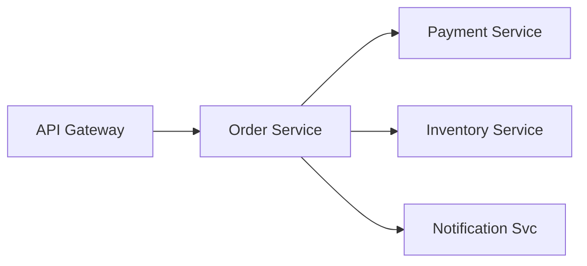

마이크로서비스 환경에서 주문 하나가 실패했다. Order Service → Payment Service → Inventory Service → Notification Service를 거치는데, 어디서 얼마나 걸렸는지 알 수가 없다. 분산 추적(Distributed Tracing)은 요청이 여러 서비스를 거치는 전체 여정을 단일 흐름으로 추적한다.

> **비유**: 국제 택배 추적 시스템과 같다. 발송(TraceId 생성) → 인천공항(Span1) → 도쿄공항(Span2) → 도착지 세관(Span3)까지 각 구간의 처리 시간과 상태가 기록된다. 하나의 운송장 번호(TraceId)로 전체 경로를 조회할 수 있다.

---

## 핵심 개념: TraceId / SpanId

분산 추적의 핵심은 세 가지 식별자다.

- **TraceId**: 요청 전체를 식별하는 ID. 최초 진입점(API Gateway 등)에서 생성되고 모든 서비스에 전파된다. 하나의 비즈니스 트랜잭션 = 하나의 TraceId다.
- **SpanId**: 각 서비스(또는 작업 단위)를 식별하는 ID. 서비스마다 새로 생성된다.
- **ParentSpanId**: 호출자의 SpanId. 이를 통해 서비스 간 호출 계층 구조를 파악한다.



TraceId가 있으면 각 서비스의 로그를 한 번에 조회할 수 있다.

```
[order-service]       [abc123, span2] 주문 처리 시작
[payment-service]     [abc123, span3] 결제 처리 시작 (200ms)
[inventory-service]   [abc123, span4] 재고 차감 (50ms)
[notification-service][abc123, span5] 알림 발송 (300ms)  ← 여기가 느리다!
```

---

## Spring Boot 3.x: Micrometer Tracing

Spring Boot 3.x에서는 Spring Cloud Sleuth가 **Micrometer Tracing**으로 대체됐다.

### 의존성

```xml
<!-- Spring Boot 3.x -->
<dependency>
    <groupId>io.micrometer</groupId>
    <artifactId>micrometer-tracing-bridge-brave</artifactId>
</dependency>
<dependency>
    <groupId>io.zipkin.reporter2</groupId>
    <artifactId>zipkin-reporter-brave</artifactId>
</dependency>

<!-- Spring Boot 2.x (Sleuth 사용 시) -->
<dependency>
    <groupId>org.springframework.cloud</groupId>
    <artifactId>spring-cloud-starter-sleuth</artifactId>
</dependency>
<dependency>
    <groupId>org.springframework.cloud</groupId>
    <artifactId>spring-cloud-sleuth-zipkin</artifactId>
</dependency>
```

### application.yml

```yaml
spring:
  application:
    name: order-service

# Spring Boot 3.x
management:
  tracing:
    sampling:
      probability: 1.0  # 100% 샘플링 (운영: 0.1 ~ 0.3)
  zipkin:
    tracing:
      endpoint: http://localhost:9411/api/v2/spans
```

---

## TraceId/SpanId 전파 방식

HTTP 요청 헤더를 통해 TraceId가 서비스 간에 전파된다.

### 1️⃣ B3 Propagation (기본)

Zipkin이 만든 표준 헤더다.

```
X-B3-TraceId: abc123def456...    (64-bit 또는 128-bit hex)
X-B3-SpanId: 789xyz...           (64-bit hex)
X-B3-ParentSpanId: 456abc...
X-B3-Sampled: 1                  (1=추적, 0=미추적)
```

### 2️⃣ W3C TraceContext (최신 표준)

```
traceparent: 00-0af7651916cd43dd8448eb211c80319c-b7ad6b7169203331-01
             버전-TraceId-ParentSpanId-플래그
```

### RestTemplate / WebClient 자동 전파

Sleuth/Micrometer Tracing은 `RestTemplate`, `WebClient`, `FeignClient`, `Kafka` 등에 자동으로 TraceId 헤더를 주입한다. 별도 설정 없이 TraceId가 전파된다.

```java
@Service
public class OrderService {

    private final RestTemplate restTemplate;

    public PaymentResult processPayment(OrderRequest request) {
        // 내부적으로 X-B3-TraceId 등 헤더 자동 삽입
        return restTemplate.postForObject(
            "http://payment-service/payments",
            request,
            PaymentResult.class
        );
    }
}
```

### 수동 Span 생성

특정 작업(DB 쿼리, 외부 API 등)의 세부 처리 시간을 측정하려면 수동으로 Span을 생성한다.

```java
@Service
public class OrderService {

    private final Tracer tracer;

    public OrderResult createOrder(OrderRequest request) {
        Span span = tracer.nextSpan().name("validate-order").start();

        try (Tracer.SpanInScope ws = tracer.withSpan(span)) {
            span.tag("order.type", request.getType());
            span.tag("order.amount", String.valueOf(request.getAmount()));

            validateOrder(request);
            return processOrder(request);
        } catch (Exception e) {
            span.error(e);
            throw e;
        } finally {
            span.end();
        }
    }
}
```

---

## 로그에 TraceId 자동 포함

Sleuth/Micrometer Tracing은 MDC에 TraceId, SpanId를 자동으로 설정한다. logback 설정에서 `%X{traceId}`로 출력한다.

```xml
<configuration>
    <appender name="CONSOLE" class="ch.qos.logback.core.ConsoleAppender">
        <encoder>
            <pattern>
                %d{yyyy-MM-dd HH:mm:ss.SSS} [%thread]
                [%X{traceId},%X{spanId}]
                %-5level %logger{36} - %msg%n
            </pattern>
        </encoder>
    </appender>
</configuration>
```

출력 예시:
```
2026-05-01 10:00:00.001 [http-nio-8080-exec-1] [abc123,span2] INFO  OrderService - 주문 처리 시작
2026-05-01 10:00:00.150 [http-nio-8080-exec-1] [abc123,span3] INFO  PaymentService - 결제 처리 완료
```

ELK 스택과 연동하면 `traceId`로 검색해서 여러 서비스에 흩어진 로그를 한 화면에서 조회할 수 있다.

---

## Zipkin 서버 구성

Zipkin은 분산 추적 데이터를 수집하고 시각화하는 서버다.

```bash
docker run -d -p 9411:9411 openzipkin/zipkin
```

### Zipkin UI 타임라인

Zipkin의 Gantt 차트로 각 서비스의 처리 시간과 순서를 한눈에 볼 수 있다.

```mermaid
gantt
    title TraceId abc123 타임라인
    dateFormat x
    axisFormat %Lms
    section Gateway
    라우팅       :0, 10
    section Order
    주문처리     :10, 400
    section Payment
    결제처리     :15, 200
```



---

## 왜 이 기술인가?

| 방식 | 자동화 | 벤더 중립 | Spring 통합 | 적합한 상황 |
|---|---|---|---|---|
| MDC (수동) | X | O | O | 단일 서비스 내 추적 |
| Micrometer Tracing (Sleuth 후속) | O | O | 완벽 | Spring Boot 3.x 표준 |
| OpenTelemetry (OTEL) | O | O (CNCF 표준) | 좋음 | 벤더 중립, 멀티 언어 |
| Datadog APM | O | X | 좋음 | 상용 모니터링 |
| Jaeger | O | O | 보통 | 오픈소스 분산 추적 백엔드 |

**결론:** Spring Boot 3.x에서는 Micrometer Tracing이 Sleuth를 대체한다. 백엔드는 Zipkin, Jaeger, Tempo 중 인프라에 맞게 선택한다. 벤더 중립성이 중요하면 OpenTelemetry Agent로 전환한다.

---

## 실무에서 자주 하는 실수

1. **Sleuth 대신 Micrometer Tracing 미전환 (Spring Boot 3.x)** — Spring Boot 3.x에서 `spring-cloud-starter-sleuth`를 그대로 사용하면 의존성 충돌이 발생한다. `micrometer-tracing-bridge-brave` + `zipkin-reporter-brave`로 마이그레이션해야 한다.

2. **Sampling Rate를 운영에서 1.0으로 설정** — 모든 요청(100%)을 추적하면 Zipkin/Jaeger에 막대한 데이터가 쌓이고 성능에 영향을 준다. 운영에서는 0.1(10%) 수준으로 설정하고, 특정 오류 요청은 100% 샘플링하는 Rate Limiting 샘플러를 사용한다.

3. **비동기 코드에서 TraceId 전파 누락** — `@Async`, `CompletableFuture`, Kafka 컨슈머에서 새 스레드가 생성되면 기본적으로 TraceId가 전파되지 않는다. Micrometer Tracing의 `Context Propagation` 라이브러리를 설정해야 자동 전파된다.

4. **Span 이름을 기본값으로만 사용** — 기본 HTTP Span 이름(`GET /api/orders`)만으로는 비즈니스 의미를 파악하기 어렵다. `Tracer.nextSpan().name("order-payment-processing")`으로 의미 있는 이름을 부여해야 추적이 유용해진다.

5. **TraceId를 HTTP 응답 헤더에 미포함** — 오류 발생 시 사용자에게 `traceId`를 반환하지 않으면 고객 지원 시 추적이 불가능하다. `ResponseEntity` 헤더 또는 에러 응답 바디에 `traceId`를 포함해야 한다.

---

## 면접 포인트

<details>
<summary>펼쳐보기</summary>


**Q1. TraceId와 SpanId의 차이는?**
> TraceId: 전체 요청 흐름(여러 서비스)을 관통하는 고유 식별자. 서비스 A→B→C로 전파되어도 동일하다. SpanId: 단일 작업 단위의 식별자. 서비스마다, 메서드마다 새 SpanId가 생성된다. ParentSpanId로 트리 구조를 형성해 전체 호출 그래프를 만든다.

**Q2. B3 Propagation이란?**
> Zipkin이 정의한 HTTP 헤더 기반 컨텍스트 전파 형식이다. `X-B3-TraceId`, `X-B3-SpanId`, `X-B3-ParentSpanId`, `X-B3-Sampled` 헤더로 서비스 간에 추적 컨텍스트를 전달한다. W3C `traceparent` 헤더가 최신 표준이며 OpenTelemetry가 채택하고 있다.

**Q3. Zipkin과 Jaeger의 차이는?**
> Zipkin은 Twitter가 만든 분산 추적 시스템으로 Brave 라이브러리와 통합이 좋다. Jaeger는 Uber가 만들어 CNCF에 기증한 시스템으로 OpenTelemetry와 통합이 좋고 UI가 더 풍부하다. 둘 다 Prometheus+Grafana Tempo로 대체되는 추세다.

**Q4. Micrometer Tracing의 Sampling 전략은?**
> `AlwaysSampler`: 모든 요청 추적(개발용). `NeverSampler`: 추적 비활성화. `RateLimitingSampler`: 초당 N개 추적(운영 권장). `ProbabilityBasedSampler`: N% 확률 샘플링. `application.properties`에서 `management.tracing.sampling.probability=0.1`로 간단히 설정한다.

**Q5. Spring Boot 3.x에서 분산 추적을 설정하는 최소 구성은?**
> `micrometer-tracing-bridge-brave` + `zipkin-reporter-brave` 의존성 추가, `management.zipkin.tracing.endpoint=http://zipkin:9411/api/v2/spans`, `management.tracing.sampling.probability=0.1` 설정. Actuator의 `tracing` 엔드포인트로 현재 추적 상태를 확인할 수 있다.

</details>
