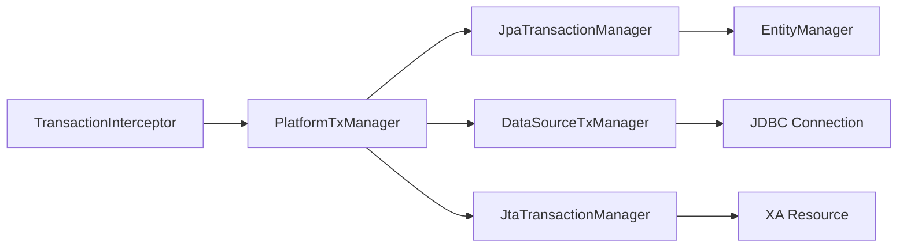
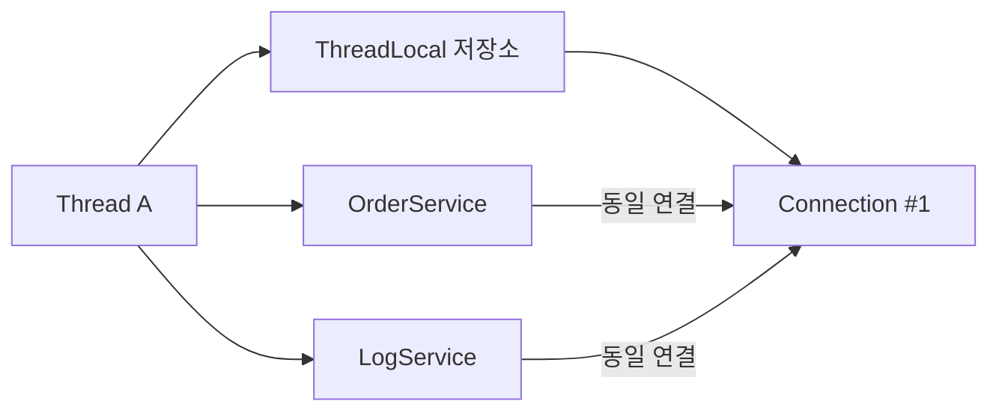
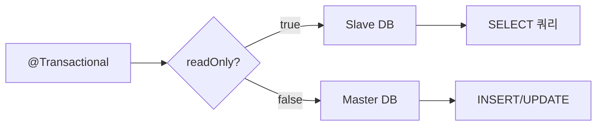
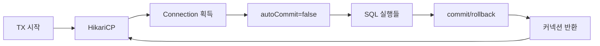

트랜잭션을 "그냥 `@Transactional` 붙이면 되는 것"으로 아는 개발자와, 프록시 체인부터 커넥션 풀 상호작용까지 이해하는 개발자의 차이는 장애 상황에서 극명하게 드러난다. 이 글은 Spring 트랜잭션의 내부 메커니즘을 끝까지 파헤친다.

---

## 1. @Transactional 프록시 메커니즘 — CGLIB이 무엇을 만드는가

### 왜 프록시인가

`@Transactional`이 동작하려면 메서드 호출 전후에 트랜잭션 시작/커밋/롤백 로직이 삽입되어야 한다. 비즈니스 코드를 직접 수정하지 않고 이를 구현하는 유일한 방법은 **호출을 가로채는 객체**를 끼워 넣는 것이다. 이것이 프록시다.

Spring은 기본적으로 두 가지 프록시 방식을 사용한다.

| 방식 | 동작 원리 | 제약 |
|------|---------|------|
| JDK Dynamic Proxy | 인터페이스 기반, `java.lang.reflect.Proxy` | 인터페이스 필수 |
| CGLIB | 서브클래스 생성 (바이트코드 조작) | `final` 클래스/메서드 불가 |

Spring Boot 2.x 이후 기본값은 **CGLIB**이다. `proxyTargetClass=true`가 기본 설정이기 때문이다.

### CGLIB이 만드는 서브클래스

```java
// 원본 클래스
@Service
public class OrderService {
    @Transactional
    public Order createOrder(OrderDto dto) {
        return orderRepository.save(new Order(dto));
    }
}

// CGLIB이 런타임에 생성하는 서브클래스 (개념적 표현)
public class OrderService$$EnhancerBySpringCGLIB$$abc123 extends OrderService {

    private TransactionInterceptor txInterceptor; // Spring이 주입

    @Override
    public Order createOrder(OrderDto dto) {
        // TransactionInterceptor.invoke() 호출
        MethodInvocation invocation = new CglibMethodInvocation(this, dto);
        return (Order) txInterceptor.invoke(invocation);
    }
}
```

Spring 컨텍스트에서 `OrderService`를 주입받으면 실제로는 `OrderService$$EnhancerBySpringCGLIB` 인스턴스가 주입된다.

```java
@Autowired
OrderService orderService;
// 실제 타입: OrderService$$EnhancerBySpringCGLIB$$abc123
System.out.println(orderService.getClass()); // 확인 가능
```

### TransactionInterceptor 체인

`TransactionInterceptor`는 `MethodInterceptor`를 구현한 AOP Advice다. 내부 동작 순서는 다음과 같다.

```
TransactionInterceptor.invoke()
  └─ TransactionAspectSupport.invokeWithinTransaction()
       ├─ 1. 트랜잭션 속성 조회 (TransactionAttributeSource)
       ├─ 2. PlatformTransactionManager 선택
       ├─ 3. createTransactionIfNecessary() → getTransaction()
       ├─ 4. proceedWithInvocation() → 실제 메서드 실행
       ├─ 5. 예외 발생 시: completeTransactionAfterThrowing()
       └─ 6. 정상 시: commitTransactionAfterReturning()
```

```java
// TransactionAspectSupport.invokeWithinTransaction() 핵심 로직 (단순화)
protected Object invokeWithinTransaction(Method method, Class<?> targetClass,
                                         InvocationCallback invocation) throws Throwable {

    TransactionAttributeSource tas = getTransactionAttributeSource();
    TransactionAttribute txAttr = tas.getTransactionAttribute(method, targetClass);
    TransactionManager tm = determineTransactionManager(txAttr);

    PlatformTransactionManager ptm = asPlatformTransactionManager(tm);
    TransactionInfo txInfo = createTransactionIfNecessary(ptm, txAttr, joinpointId);

    Object retVal;
    try {
        retVal = invocation.proceedWithInvocation(); // 실제 메서드 실행
    } catch (Throwable ex) {
        completeTransactionAfterThrowing(txInfo, ex); // 예외 처리 → 롤백 여부 결정
        throw ex;
    } finally {
        cleanupTransactionInfo(txInfo); // ThreadLocal 정리
    }

    commitTransactionAfterReturning(txInfo); // 커밋
    return retVal;
}
```

### PlatformTransactionManager 선택 체인

`PlatformTransactionManager`는 트랜잭션 기술을 추상화한 인터페이스다. Spring Boot Auto-configuration이 클래스패스를 스캔해 적절한 구현체를 자동 등록한다.



```java
// PlatformTransactionManager 인터페이스
public interface PlatformTransactionManager extends TransactionManager {
    TransactionStatus getTransaction(TransactionDefinition definition)
        throws TransactionException;

    void commit(TransactionStatus status) throws TransactionException;

    void rollback(TransactionStatus status) throws TransactionException;
}
```

`JpaTransactionManager`는 `getTransaction()` 시점에 EntityManager를 생성하고 JDBC 커넥션을 가져온다. 이 커넥션이 `TransactionSynchronizationManager`의 ThreadLocal에 바인딩되어 같은 트랜잭션 내 모든 DB 접근에서 재사용된다.

---

## 2. TransactionSynchronizationManager — ThreadLocal 기반 커넥션 바인딩

### 왜 ThreadLocal인가

HTTP 요청 하나는 서블릿 컨테이너의 스레드 풀에서 스레드 하나가 처리한다. `OrderService.createOrder()` → `OrderRepository.save()` → `LogService.saveLog()`가 모두 같은 스레드에서 실행된다. ThreadLocal에 커넥션을 저장하면 파라미터 전달 없이 같은 스레드 내 어디서든 동일한 커넥션을 꺼낼 수 있다.



### 내부 구조

```java
public abstract class TransactionSynchronizationManager {

    // 핵심: ThreadLocal로 현재 스레드의 리소스를 관리
    private static final ThreadLocal<Map<Object, Object>> resources =
        new NamedThreadLocal<>("Transactional resources");

    private static final ThreadLocal<Set<TransactionSynchronization>> synchronizations =
        new NamedThreadLocal<>("Transaction synchronizations");

    private static final ThreadLocal<String> currentTransactionName =
        new NamedThreadLocal<>("Current transaction name");

    private static final ThreadLocal<Boolean> currentTransactionReadOnly =
        new NamedThreadLocal<>("Current transaction read-only status");

    // 커넥션(또는 EntityManager) 바인딩
    public static void bindResource(Object key, Object value) {
        Map<Object, Object> map = resources.get();
        if (map == null) {
            map = new HashMap<>();
            resources.set(map);
        }
        map.put(key, value);
    }

    // 커넥션 조회
    public static Object getResource(Object key) {
        Map<Object, Object> map = resources.get();
        return (map != null ? map.get(key) : null);
    }
}
```

### 실제 커넥션 획득 흐름

```java
// DataSourceUtils.getConnection() — Spring이 커넥션을 가져오는 방법
public static Connection getConnection(DataSource dataSource) throws CannotGetJdbcConnectionException {
    ConnectionHolder conHolder =
        (ConnectionHolder) TransactionSynchronizationManager.getResource(dataSource);

    if (conHolder != null && conHolder.hasConnection()) {
        // 이미 트랜잭션이 열려있으면 기존 커넥션 반환
        conHolder.requested();
        return conHolder.getConnection();
    }

    // 트랜잭션이 없으면 풀에서 새 커넥션 획득
    Connection con = dataSource.getConnection();

    if (TransactionSynchronizationManager.isSynchronizationActive()) {
        // 트랜잭션 활성화 중이면 ThreadLocal에 바인딩
        ConnectionHolder holderToUse = new ConnectionHolder(con);
        TransactionSynchronizationManager.bindResource(dataSource, holderToUse);
    }

    return con;
}
```

같은 트랜잭션 내에서 `orderRepository.save()`와 `logRepository.save()`가 각각 `DataSourceUtils.getConnection()`을 호출해도 같은 `Connection` 객체를 반환받는다. 이것이 원자성의 물리적 기반이다.

---

## 3. 전파 속성(Propagation) — 7가지 완전 분석

### REQUIRED — 기본값, 가장 많이 오해받는 속성

**WHY 존재하는가**: 여러 서비스 메서드를 하나의 비즈니스 단위로 묶을 때 사용한다. 각 메서드가 독립 트랜잭션을 열면 원자성이 깨진다. 예를 들어 주문 생성과 재고 차감은 반드시 함께 성공하거나 함께 실패해야 한다.

```java
@Service
public class OrderService {

    @Autowired
    private InventoryService inventoryService;

    @Transactional // REQUIRED
    public Order createOrder(OrderDto dto) {
        Order order = orderRepository.save(new Order(dto));
        inventoryService.deductStock(dto.getProductId(), dto.getQuantity());
        // 두 메서드가 같은 트랜잭션에서 실행 → 원자성 보장
        return order;
    }
}

@Service
public class InventoryService {

    @Transactional // REQUIRED → 부모 트랜잭션에 참여
    public void deductStock(Long productId, int quantity) {
        Inventory inventory = inventoryRepository.findById(productId).orElseThrow();
        inventory.deduct(quantity);
        // 여기서 예외 발생 → 부모 TX 전체 rollback-only 마킹
    }
}
```

**핵심 함정 — UnexpectedRollbackException**:

```java
@Transactional
public void createOrder(OrderDto dto) {
    orderRepository.save(new Order(dto));
    try {
        inventoryService.deductStock(dto.getProductId(), dto.getQuantity());
    } catch (RuntimeException e) {
        log.warn("재고 차감 실패, 무시");
        // 함정! catch해도 트랜잭션은 이미 rollback-only 상태
    }
    // 여기까지 도달해도 commit() 시점에 UnexpectedRollbackException 발생
}
```

자식 메서드가 예외를 던지는 순간 Spring은 `TransactionStatus.setRollbackOnly()`를 호출한다. 이 플래그는 같은 트랜잭션 내에서는 되돌릴 수 없다. `catch`로 예외를 삼켜도 이미 설정된 rollback-only는 유지된다.

### REQUIRES_NEW — 완전 독립 트랜잭션

**WHY 존재하는가**: 주 트랜잭션의 성공/실패와 무관하게 별도로 커밋되어야 하는 작업이 있다. 감사 로그(Audit Log)가 대표적이다. 주문이 실패해도 "주문 시도" 로그는 남아야 한다.

```java
@Service
public class AuditService {

    @Transactional(propagation = Propagation.REQUIRES_NEW)
    public void saveAuditLog(String action, Long userId) {
        // 새로운 물리적 트랜잭션 시작
        // 부모 트랜잭션은 일시 중단(suspended)
        auditLogRepository.save(new AuditLog(action, userId));
        // 부모 성공/실패와 무관하게 커밋
    }
}

@Transactional
public void createOrder(OrderDto dto) {
    try {
        auditService.saveAuditLog("ORDER_ATTEMPT", dto.getUserId());
        // REQUIRES_NEW → TX1 일시 중단, TX2 시작 → TX2 커밋 → TX1 재개
        orderRepository.save(new Order(dto));
    } catch (Exception e) {
        // 여기서 롤백해도 auditLog는 이미 TX2로 커밋됨
        throw e;
    }
}
```

**내부 동작**: `REQUIRES_NEW`는 `SuspendedResourcesHolder`에 기존 커넥션을 저장하고 새 커넥션을 풀에서 가져온다. 두 개의 물리적 커넥션이 동시에 활성화된다.

**REQUIRES_NEW 사용 시 데드락 주의**:

```java
@Transactional
public void updateOrder(Long orderId) {
    Order order = orderRepository.findById(orderId).orElseThrow();
    order.setStatus("PROCESSING");
    // 여기서 order 행에 X-Lock 보유

    logService.saveLog(orderId); // REQUIRES_NEW
}

@Transactional(propagation = Propagation.REQUIRES_NEW)
public void saveLog(Long orderId) {
    // 새 트랜잭션에서 같은 order 행에 접근 시도
    Order order = orderRepository.findById(orderId).orElseThrow();
    // 부모가 X-Lock 보유 중 → 대기 → 데드락!
    logRepository.save(new Log(orderId));
}
```

REQUIRES_NEW는 반드시 부모 트랜잭션과 **다른 테이블/다른 행**을 다룰 때만 사용해야 한다.

### NESTED — Savepoint 기반 부분 롤백

**WHY 존재하는가**: 배치 처리에서 레코드 하나가 실패해도 전체를 롤백하지 않고 해당 레코드만 건너뛰고 싶을 때 사용한다.

```java
@Transactional
public void processBatch(List<OrderDto> orders) {
    for (OrderDto dto : orders) {
        try {
            orderProcessingService.processOne(dto); // NESTED
        } catch (Exception e) {
            log.warn("레코드 처리 실패: {}", dto.getId());
            // Savepoint까지 롤백 → 다음 레코드 계속 처리
        }
    }
    // 성공한 레코드들만 최종 커밋
}

@Transactional(propagation = Propagation.NESTED)
public void processOne(OrderDto dto) {
    // Savepoint 설정
    orderRepository.save(new Order(dto));
    inventoryService.deductStock(dto.getProductId(), dto.getQuantity());
    // 예외 발생 시 Savepoint까지만 롤백
}
```

**내부 동작**: `JdbcTransactionManager`가 `Connection.setSavepoint()`를 호출해 Savepoint를 생성한다. 예외 발생 시 `Connection.rollback(savepoint)`를 호출한다.

**REQUIRES_NEW vs NESTED 차이점**:

| 비교 | REQUIRES_NEW | NESTED |
|------|-------------|--------|
| 물리적 커넥션 | 새 커넥션 | 같은 커넥션 |
| 부모 롤백 시 | 자식 유지 (이미 커밋) | 자식도 롤백 |
| 자식 롤백 시 | 부모 무관 | Savepoint까지만 |
| JPA 지원 | 완전 지원 | 제한적 (JPA flush 충돌) |
| 사용 목적 | 독립적 커밋 필요 | 부분 롤백 후 계속 진행 |

**JPA에서 NESTED 주의**: JPA는 트랜잭션 커밋 시점에 flush를 수행한다. NESTED는 단일 트랜잭션이므로 Savepoint 롤백 후에도 1차 캐시에 엔티티가 남아있어 예상치 못한 flush가 발생할 수 있다.

### MANDATORY — 트랜잭션 강제 요구

**WHY 존재하는가**: 반드시 기존 트랜잭션 내에서만 호출되어야 하는 메서드를 보호한다. 실수로 트랜잭션 없이 호출하면 즉시 예외를 던져 버그를 조기에 발견한다.

```java
@Service
public class PaymentService {

    // 이 메서드는 반드시 트랜잭션 내에서 호출되어야 함
    @Transactional(propagation = Propagation.MANDATORY)
    public void processPayment(PaymentDto dto) {
        // 기존 TX 없으면 IllegalTransactionStateException 발생
        paymentRepository.save(new Payment(dto));
    }
}

// 올바른 사용
@Transactional
public void createOrder(OrderDto dto) {
    orderRepository.save(new Order(dto));
    paymentService.processPayment(dto.getPayment()); // OK: TX 내에서 호출
}

// 잘못된 사용
public void badCall(OrderDto dto) {
    paymentService.processPayment(dto.getPayment()); // 예외: TX 없음
    // IllegalTransactionStateException: No existing transaction found
}
```

### SUPPORTS — 트랜잭션 선택적 참여

**WHY 존재하는가**: 트랜잭션이 있으면 참여하고 없으면 그냥 실행한다. 읽기 전용 조회 메서드가 트랜잭션 유무와 상관없이 동작해야 할 때 사용한다.

```java
@Transactional(propagation = Propagation.SUPPORTS, readOnly = true)
public List<Order> findOrders(Long userId) {
    // 트랜잭션 있으면 참여, 없으면 TX 없이 실행
    // 어차피 조회만 하므로 TX 없어도 무방
    return orderRepository.findByUserId(userId);
}
```

### NOT_SUPPORTED — 트랜잭션 없이 강제 실행

**WHY 존재하는가**: 트랜잭션 내에서 실행하면 안 되는 작업이 있다. 예를 들어 외부 API 호출을 트랜잭션 안에 두면 API 응답 대기 시간 동안 DB 커넥션을 점유한다.

```java
@Transactional(propagation = Propagation.NOT_SUPPORTED)
public void sendExternalNotification(NotificationDto dto) {
    // 부모 트랜잭션이 있으면 일시 중단
    // DB 커넥션을 풀에 반환하고 외부 API 호출
    externalApiClient.send(dto); // 외부 HTTP 호출 (1~5초)
    // 부모 트랜잭션 재개
}
```

### NEVER — 트랜잭션 절대 금지

**WHY 존재하는가**: 특정 메서드가 트랜잭션 컨텍스트에서 호출되어서는 안 됨을 강제한다. 의도치 않은 트랜잭션 참여를 방지한다.

```java
@Transactional(propagation = Propagation.NEVER)
public void longRunningReport() {
    // 트랜잭션이 있으면 IllegalTransactionStateException
    // 보고서 생성처럼 DB 커넥션을 점유하면 안 되는 작업
    reportGenerator.generate(); // 트랜잭션 없이 실행 보장
}
```

### 전파 속성 완전 정리

| 속성 | 기존 TX 있음 | 기존 TX 없음 | 물리 커넥션 |
|------|------------|------------|-----------|
| REQUIRED | 참여 | 새로 생성 | 공유 |
| REQUIRES_NEW | 중단 후 새로 생성 | 새로 생성 | 새 커넥션 |
| NESTED | Savepoint 생성 | 새로 생성 | 공유 |
| MANDATORY | 참여 | 예외 발생 | 공유 |
| SUPPORTS | 참여 | TX 없이 실행 | 공유 또는 없음 |
| NOT_SUPPORTED | 중단 후 TX 없이 실행 | TX 없이 실행 | 없음 |
| NEVER | 예외 발생 | TX 없이 실행 | 없음 |

---

## 4. 격리 수준(Isolation Level) — 동시성 이상 현상과 내부 메커니즘

### 발생 가능한 이상 현상 (구체적 시나리오)

**Dirty Read — 커밋되지 않은 데이터 읽기**

```
TX1: UPDATE accounts SET balance = 0 WHERE id = 1  (미커밋)
TX2: SELECT balance FROM accounts WHERE id = 1     → 0 읽음
TX1: ROLLBACK  (잔고 원복)
TX2: 잔고 0인 것으로 처리 진행 → 없는 데이터 기반 결정
```

금융 시스템에서 Dirty Read가 발생하면 인출 불가능한 잔고를 기준으로 대출 승인이 날 수 있다.

**Non-Repeatable Read — 같은 쿼리 결과가 달라지는 현상**

```java
@Transactional(isolation = Isolation.READ_COMMITTED)
public void auditProcess() {
    // 1차 조회
    int balance = accountRepository.findBalance(userId); // 100,000원

    // 다른 TX가 이 사이에 출금 처리 후 커밋

    // 2차 조회
    int balance2 = accountRepository.findBalance(userId); // 80,000원
    // 같은 TX 내에서 다른 결과 → 감사 보고서 불일치
}
```

**Phantom Read — 행의 개수가 달라지는 현상**

```java
@Transactional(isolation = Isolation.REPEATABLE_READ)
public void reportProcess() {
    // 1차 조회: 미처리 주문 COUNT = 10
    long count1 = orderRepository.countByStatus("PENDING");

    // 다른 TX가 PENDING 주문 5개 INSERT 후 커밋

    // 2차 조회: COUNT = 15 (Phantom Read)
    long count2 = orderRepository.countByStatus("PENDING");
    // 10개 기준으로 처리했는데 실제로는 15개
}
```

### READ_UNCOMMITTED

**WHY 사용하는가**: 정합성보다 성능이 절대적으로 중요한 경우. 실시간 통계 대시보드처럼 약간의 오차가 허용되는 집계 쿼리.

```java
@Transactional(isolation = Isolation.READ_UNCOMMITTED)
public DashboardStats getRealtimeStats() {
    // Dirty Read 허용 → 잠금 없이 읽기 → 최고 성능
    // 오차 1~2% 허용되는 실시간 현황판
    return statsRepository.findCurrentStats();
}
```

내부적으로 MySQL InnoDB는 `SET TRANSACTION ISOLATION LEVEL READ UNCOMMITTED`를 실행한다. 이 레벨에서는 공유 잠금(S-Lock)조차 획득하지 않는다.

### READ_COMMITTED

**WHY 사용하는가**: Oracle 기본값. 커밋된 데이터만 읽으므로 Dirty Read는 방지하되 반복 읽기 일관성은 보장하지 않는다. 대부분의 OLTP 시스템에서 충분한 수준이다.

```java
@Transactional(isolation = Isolation.READ_COMMITTED)
public OrderSummary getOrderSummary(Long orderId) {
    // MVCC: 쿼리 실행 시점의 커밋된 최신 스냅샷 읽기
    // 같은 TX 내 재조회 시 다른 TX가 커밋했으면 새 값 반환
    Order order = orderRepository.findById(orderId).orElseThrow();
    return new OrderSummary(order);
}
```

**MySQL MVCC 동작**: `READ_COMMITTED`에서 MySQL은 각 SELECT마다 새로운 Read View를 생성한다. 따라서 같은 트랜잭션 내에서도 다른 TX가 커밋한 최신 데이터를 읽을 수 있다.

### REPEATABLE_READ

**WHY 사용하는가**: MySQL InnoDB 기본값. 같은 트랜잭션 내에서는 동일 행을 항상 같은 값으로 읽는다. 재무 계산, 재고 확인처럼 트랜잭션 내 일관성이 중요한 경우.

```java
@Transactional(isolation = Isolation.REPEATABLE_READ)
public void transferFunds(Long fromId, Long toId, BigDecimal amount) {
    // 1차 조회
    Account from = accountRepository.findById(fromId).orElseThrow(); // 잔고 100

    // 다른 TX가 같은 계좌에서 출금해도...

    // 2차 조회 → REPEATABLE_READ가 보장하는 스냅샷
    Account from2 = accountRepository.findById(fromId).orElseThrow(); // 여전히 100
    // 이 트랜잭션 시작 시점의 스냅샷 기준으로 읽음
}
```

**MySQL MVCC 동작**: `REPEATABLE_READ`에서 MySQL은 트랜잭션 첫 번째 SELECT 시점에 Read View를 생성하고 트랜잭션 종료까지 유지한다. Phantom Read도 일반적인 SELECT에서는 MVCC로 방지된다.

**단, SELECT FOR UPDATE(갭 잠금 없이)는 Phantom Read 가능**:

```java
// REPEATABLE_READ에서도 Phantom Read 발생 가능한 패턴
@Transactional(isolation = Isolation.REPEATABLE_READ)
public void processOrders() {
    // 일반 SELECT: MVCC 스냅샷 사용 → Phantom Read 없음
    List<Order> orders = orderRepository.findByStatus("PENDING");

    // 하지만 SELECT FOR UPDATE: 실제 최신 데이터 잠금
    List<Order> lockedOrders = orderRepository.findByStatusForUpdate("PENDING");
    // 이 사이에 새 PENDING 주문이 INSERT되면 Phantom Row가 포함될 수 있음
}
```

### SERIALIZABLE

**WHY 사용하는가**: 완벽한 직렬화 실행을 보장한다. 동시 실행해도 순차 실행과 동일한 결과를 보장한다. 금융 거래의 정산, 티켓팅 시스템처럼 절대적 정합성이 필요한 경우.

```java
@Transactional(isolation = Isolation.SERIALIZABLE)
public void bookSeat(Long seatId, Long userId) {
    // Gap Lock + Next-Key Lock으로 범위 잠금
    // 다른 TX가 같은 좌석에 접근 시 대기
    Seat seat = seatRepository.findById(seatId).orElseThrow();
    if (seat.isAvailable()) {
        seat.book(userId);
        seatRepository.save(seat);
    }
    // 완전한 직렬화 → 중복 예약 완전 방지
}
```

**성능 트레이드오프**: SERIALIZABLE은 범위 잠금(Gap Lock)을 광범위하게 사용하므로 동시성이 급격히 낮아진다. 초당 100 TPS 시스템이 SERIALIZABLE 전환 시 10 TPS로 떨어지는 사례도 있다.

### 격리 수준 선택 가이드

```java
// 실무 판단 흐름
if (오차_허용 && 최고_성능_필요) {
    // READ_UNCOMMITTED → 실시간 통계, 대시보드
} else if (DB_기본값으로_충분) {
    // DEFAULT → MySQL: REPEATABLE_READ, Oracle: READ_COMMITTED
} else if (단일_TX_내_재조회_일관성_필요) {
    // REPEATABLE_READ
} else if (절대적_정합성_필요) {
    // SERIALIZABLE (성능 희생 감수)
}
```

---

## 5. Self-invocation 문제 — 왜 프록시가 우회되는가

### 근본 원인

CGLIB 프록시는 **외부에서의 호출**만 가로챈다. 빈 내부에서 `this.method()`를 호출하면 프록시 객체가 아닌 원본 객체의 메서드가 직접 실행된다.

```
외부 호출: Client → Proxy → OrderService.createOrder()  // TransactionInterceptor 동작
내부 호출: OrderService.process() → this.createOrder()  // 프록시 우회! TX 없음
```

```java
@Service
public class OrderService {

    public void process(OrderDto dto) {
        // this는 원본 OrderService 참조
        // 프록시를 거치지 않음 → @Transactional 무시
        createOrder(dto);
    }

    @Transactional // 외부에서 호출할 때만 동작
    public Order createOrder(OrderDto dto) {
        Order order = orderRepository.save(new Order(dto));
        throw new RuntimeException("오류");
        // 트랜잭션이 없으므로 롤백 없이 저장됨!
    }
}
```

### 해결책 1 — 빈 분리 (가장 권장)

```java
@Service
public class OrderFacadeService {

    @Autowired
    private OrderService orderService;

    public void process(OrderDto dto) {
        orderService.createOrder(dto); // 다른 빈의 메서드 호출 → 프록시 동작
    }
}

@Service
public class OrderService {

    @Transactional
    public Order createOrder(OrderDto dto) {
        return orderRepository.save(new Order(dto));
    }
}
```

### 해결책 2 — AopContext (비권장, 코드 오염)

```java
@Service
@EnableAspectJAutoProxy(exposeProxy = true) // 설정 필요
public class OrderService {

    public void process(OrderDto dto) {
        // AopContext에서 현재 프록시 객체를 꺼냄
        OrderService proxy = (OrderService) AopContext.currentProxy();
        proxy.createOrder(dto); // 프록시를 통한 호출 → TX 동작
    }

    @Transactional
    public Order createOrder(OrderDto dto) {
        return orderRepository.save(new Order(dto));
    }
}
```

`AopContext.currentProxy()`는 ThreadLocal에서 현재 실행 중인 프록시를 반환한다. `exposeProxy = true` 설정이 없으면 `IllegalStateException`이 발생한다. 코드가 Spring 내부에 강하게 결합되므로 권장하지 않는다.

### 해결책 3 — Self 주입

```java
@Service
public class OrderService {

    @Autowired
    @Lazy // 순환 의존성 방지
    private OrderService self; // 자기 자신의 프록시 주입

    public void process(OrderDto dto) {
        self.createOrder(dto); // 프록시를 통한 호출
    }

    @Transactional
    public Order createOrder(OrderDto dto) {
        return orderRepository.save(new Order(dto));
    }
}
```

### 해결책 4 — TransactionTemplate (프로그래밍 방식)

```java
@Service
public class OrderService {

    @Autowired
    private TransactionTemplate transactionTemplate;

    public void process(OrderDto dto) {
        transactionTemplate.execute(status -> {
            // 명시적으로 트랜잭션 내에서 실행
            return orderRepository.save(new Order(dto));
        });
    }
}
```

`TransactionTemplate`은 self-invocation 문제에서 자유롭다. 프록시를 사용하지 않고 `PlatformTransactionManager`를 직접 호출하기 때문이다.

---

## 6. readOnly 최적화 — 내부에서 무슨 일이 일어나는가

### Hibernate flush mode MANUAL 전환

`readOnly = true`가 설정되면 `JpaTransactionManager`는 EntityManager의 flush mode를 `FlushModeType.MANUAL`로 설정한다. 이로 인해 트랜잭션 커밋 시 dirty checking과 flush가 실행되지 않는다.

```java
// JpaTransactionManager 내부 (단순화)
@Override
protected void doBegin(Object transaction, TransactionDefinition definition) {
    // ...
    if (definition.isReadOnly()) {
        // flush mode를 MANUAL로 설정
        em.setFlushMode(FlushModeType.MANUAL);
    }
}
```

이것이 의미하는 바:

1. **스냅샷 생성 안 함**: Dirty checking을 위한 원본 스냅샷을 저장하지 않는다. 대량 조회 시 메모리 사용량이 크게 줄어든다.
2. **비교 연산 없음**: 트랜잭션 커밋 시 변경 감지를 위한 스냅샷 비교가 없다.
3. **flush 없음**: 변경 사항이 없으므로 flush SQL도 없다.

```java
// readOnly=false (기본): 엔티티 1만 건 조회 시
// - 원본 스냅샷 1만 개 생성 (각 필드 복사본)
// - 커밋 시 1만 건 dirty check (각 필드 비교)
// - 메모리 ~2배, CPU 추가 소모

@Transactional(readOnly = false)
public List<Order> getOrdersDefault() {
    return orderRepository.findAll(); // 1만 건 → 메모리 부담
}

// readOnly=true: 스냅샷 없음, dirty check 없음
@Transactional(readOnly = true)
public List<Order> getOrdersOptimized() {
    return orderRepository.findAll(); // 1만 건 → 절반 이하 메모리
}
```

### MySQL slave 라우팅

`readOnly = true`는 `AbstractRoutingDataSource`와 결합해 읽기 전용 쿼리를 replica(slave)로 라우팅하는 데 활용된다.

```java
public class ReadWriteRoutingDataSource extends AbstractRoutingDataSource {

    @Override
    protected Object determineCurrentLookupKey() {
        // TransactionSynchronizationManager에서 readOnly 상태 확인
        boolean isReadOnly = TransactionSynchronizationManager.isCurrentTransactionReadOnly();
        return isReadOnly ? "slave" : "master";
    }
}

// 설정
@Configuration
public class DataSourceConfig {

    @Bean
    public DataSource dataSource() {
        ReadWriteRoutingDataSource routingDataSource = new ReadWriteRoutingDataSource();

        Map<Object, Object> targetDataSources = new HashMap<>();
        targetDataSources.put("master", masterDataSource());
        targetDataSources.put("slave", slaveDataSource());

        routingDataSource.setTargetDataSources(targetDataSources);
        routingDataSource.setDefaultTargetDataSource(masterDataSource());
        return routingDataSource;
    }
}
```



`TransactionSynchronizationManager.isCurrentTransactionReadOnly()`는 `@Transactional(readOnly = true)`가 설정된 경우 `true`를 반환한다. 이 정보를 기반으로 DataSource 라우팅이 결정된다.

---

## 7. 롤백 규칙 — 왜 Unchecked만 롤백되는가

### Java 예외 설계 철학에서 비롯된 규칙

Spring의 기본 롤백 규칙은 EJB의 전통을 따른다. Java의 예외 분류는 다음과 같다.

```
Throwable
├── Error (JVM 수준 오류 → 복구 불가)
│   └── OutOfMemoryError, StackOverflowError ...
└── Exception
    ├── RuntimeException (Unchecked → 프로그래밍 오류)
    │   └── NullPointerException, IllegalArgumentException ...
    └── Checked Exception (컴파일러가 처리 강제)
        └── IOException, SQLException ...
```

**WHY Unchecked만 롤백하는가**: Checked Exception은 예측 가능한 비즈니스 예외를 나타낸다. 파일을 찾지 못하거나 네트워크가 끊기는 상황은 "정상적인 예외 흐름"으로 간주하고 호출자가 처리하도록 강제된다. 이런 예외에서 자동 롤백하면 의도치 않게 비즈니스 흐름이 중단된다.

EJB 명세는 "시스템 예외(RuntimeException)는 롤백, 애플리케이션 예외(Checked Exception)는 커밋 허용"으로 설계했고, Spring이 이 관례를 채택했다.

### 실제 동작 코드

```java
// TransactionAspectSupport.completeTransactionAfterThrowing() 핵심 로직
protected void completeTransactionAfterThrowing(TransactionInfo txInfo, Throwable ex) {
    if (txInfo.transactionAttribute != null
            && txInfo.transactionAttribute.rollbackOn(ex)) {
        // 롤백 조건 충족
        txInfo.getTransactionManager().rollback(txInfo.getTransactionStatus());
    } else {
        // 롤백 조건 미충족 → 커밋
        txInfo.getTransactionManager().commit(txInfo.getTransactionStatus());
    }
}

// DefaultTransactionAttribute.rollbackOn() 기본 구현
public boolean rollbackOn(Throwable ex) {
    // RuntimeException과 Error만 롤백
    return (ex instanceof RuntimeException || ex instanceof Error);
}
```

### Checked Exception 롤백 설정

```java
// 방법 1: rollbackFor
@Transactional(rollbackFor = Exception.class)
public void transfer(TransferDto dto) throws InsufficientFundsException {
    accountRepository.debit(dto.getFromId(), dto.getAmount());
    // InsufficientFundsException(Checked)도 롤백됨
    if (getBalance(dto.getFromId()) < 0) {
        throw new InsufficientFundsException("잔고 부족");
    }
    accountRepository.credit(dto.getToId(), dto.getAmount());
}

// 방법 2: 비즈니스 예외를 RuntimeException 계층으로 설계
public class InsufficientFundsException extends RuntimeException {
    public InsufficientFundsException(String message) {
        super(message);
    }
}

// 방법 3: 명시적 롤백 마킹
@Transactional
public void createOrder(OrderDto dto) {
    try {
        processOrder(dto);
    } catch (BusinessException e) {
        // 예외를 삼키되 롤백은 필요한 경우
        TransactionAspectSupport.currentTransactionStatus().setRollbackOnly();
        log.warn("비즈니스 예외 처리: {}", e.getMessage());
    }
}
```

### 예외 흡수와 롤백-only 마킹

```java
@Transactional
public void processWithPartialHandling(OrderDto dto) {
    orderRepository.save(new Order(dto));

    try {
        notificationService.sendEmail(dto.getUserEmail()); // 실패 가능
    } catch (EmailException e) {
        // 이메일 실패는 무시하되 트랜잭션은 계속
        log.warn("이메일 발송 실패, 주문은 정상 처리");
        // setRollbackOnly() 호출 안 함 → 트랜잭션 커밋
    }
    // order는 정상 저장됨
}
```

---

## 8. HikariCP 커넥션 풀과 트랜잭션 상호작용

### 트랜잭션 생명주기와 커넥션 점유

```
1. 트랜잭션 시작 (getTransaction())
   └─ HikariCP.getConnection() → 풀에서 커넥션 획득 → ThreadLocal 바인딩
   └─ connection.setAutoCommit(false) → 명시적 트랜잭션 시작

2. 비즈니스 로직 실행
   └─ 모든 SQL이 같은 커넥션을 통해 실행

3. 커밋 또는 롤백
   └─ connection.commit() 또는 connection.rollback()
   └─ connection.setAutoCommit(true) → 자동 커밋 복원
   └─ ThreadLocal에서 커넥션 제거
   └─ HikariCP로 커넥션 반환
```



### 트랜잭션 시간과 커넥션 점유 시간은 동일하다

트랜잭션이 열려있는 동안 HikariCP 커넥션을 독점 점유한다. 이것이 **긴 트랜잭션이 위험한 이유**다.

```java
// 극히 위험한 패턴
@Transactional
public void dangerousLongTransaction() {
    List<Order> orders = orderRepository.findAll(); // 10만 건 조회

    for (Order order : orders) {
        // 외부 API 호출 → 평균 1초
        String result = externalPaymentApi.verify(order.getId());
        order.setVerificationResult(result);
    }
    // 10만 건 × 1초 = 약 27시간 동안 커넥션 1개 독점
    // HikariCP pool size 10 → 10개 요청 처리 후 전체 차단
}
```

**HikariCP 설정과 커넥션 고갈**:

```yaml
spring:
  datasource:
    hikari:
      maximum-pool-size: 10          # 커넥션 최대 10개
      connection-timeout: 30000      # 30초 대기 후 예외
      idle-timeout: 600000           # 유휴 커넥션 10분 후 반환
      max-lifetime: 1800000          # 커넥션 최대 수명 30분
```

pool size 10인 시스템에서 트랜잭션 10개가 외부 API를 기다리면 11번째 요청은 `connection-timeout`(30초) 후 `SQLTimeoutException`이 발생한다.

### 해결 패턴 — 트랜잭션 최소화

```java
// 개선된 패턴
@Service
public class OrderVerificationService {

    public void processAll() {
        // 트랜잭션 없이 조회
        List<Long> orderIds = orderRepository.findAllIds();

        for (Long orderId : orderIds) {
            // 외부 API는 트랜잭션 밖에서 (커넥션 미점유)
            String result = externalPaymentApi.verify(orderId);

            // 결과 저장만 트랜잭션 내에서 (매우 짧은 시간)
            updateVerificationResult(orderId, result);
        }
    }

    @Transactional
    public void updateVerificationResult(Long orderId, String result) {
        // 단순 UPDATE → 수 밀리초만 커넥션 점유
        orderRepository.updateVerificationResult(orderId, result);
    }
}
```

---

## 9. 분산 트랜잭션 — XA, Saga, TCC 비교

### XA 2-Phase Commit (2PC)

**WHY 존재하는가**: 여러 데이터베이스에 걸친 원자성이 필요할 때 사용한다. 주문 DB와 결제 DB 양쪽이 모두 성공해야 한다.

**내부 동작**:

```
Phase 1 (Prepare):
  Coordinator → DB1: "커밋 준비됐냐?"
  Coordinator → DB2: "커밋 준비됐냐?"
  DB1 → Coordinator: "준비됨" (redo log 기록)
  DB2 → Coordinator: "준비됨" (redo log 기록)

Phase 2 (Commit):
  Coordinator → DB1: "커밋해"
  Coordinator → DB2: "커밋해"
  (또는 하나라도 실패 → 전체 Abort)
```

```java
// Spring JTA + Atomikos 설정
@Configuration
public class JtaConfig {

    @Bean
    public UserTransactionManager userTransactionManager() throws Exception {
        UserTransactionManager manager = new UserTransactionManager();
        manager.setForceShutdown(false);
        manager.init();
        return manager;
    }

    @Bean
    public JtaTransactionManager transactionManager() throws Exception {
        return new JtaTransactionManager(userTransactionManager());
    }
}

// 사용 시 — 두 DB에 걸친 원자적 작업
@Transactional // JtaTransactionManager 사용
public void createOrderWithPayment(OrderDto dto) {
    // orderDataSource (DB1)
    orderRepository.save(new Order(dto));

    // paymentDataSource (DB2)
    paymentRepository.save(new Payment(dto));

    // 둘 다 성공해야 커밋, 하나라도 실패하면 전체 롤백
}
```

**XA 2PC의 문제점**:
- **성능**: Prepare 단계에서 DB들이 잠금을 보유한 채 대기 → 동시성 저하
- **가용성**: Coordinator 장애 시 모든 DB가 잠금 상태로 대기 (blocking protocol)
- **마이크로서비스 부적합**: 각 서비스가 독립 DB를 가지면 XA 적용 불가

### Saga 패턴

**WHY 존재하는가**: 마이크로서비스 환경에서 XA를 사용할 수 없을 때, 보상 트랜잭션(Compensating Transaction)으로 최종 일관성을 달성한다.

```java
// Choreography 방식 (이벤트 기반)
@Service
public class OrderService {

    @Transactional
    public void createOrder(OrderDto dto) {
        Order order = orderRepository.save(new Order(dto));
        order.setStatus("PENDING");

        // 이벤트 발행 → 결제 서비스가 구독
        eventPublisher.publishEvent(new OrderCreatedEvent(order.getId(), dto));
    }

    // 결제 실패 이벤트 수신 → 보상 트랜잭션
    @TransactionalEventListener
    @Transactional
    public void handlePaymentFailed(PaymentFailedEvent event) {
        Order order = orderRepository.findById(event.getOrderId()).orElseThrow();
        order.setStatus("CANCELLED"); // 주문 취소 (보상)
        orderRepository.save(order);
    }
}

@Service
public class PaymentService {

    @TransactionalEventListener
    @Transactional
    public void handleOrderCreated(OrderCreatedEvent event) {
        try {
            Payment payment = processPayment(event);
            eventPublisher.publishEvent(new PaymentSuccessEvent(event.getOrderId()));
        } catch (PaymentException e) {
            eventPublisher.publishEvent(new PaymentFailedEvent(event.getOrderId()));
        }
    }
}
```

**Saga의 한계**:
- **최종 일관성**: 모든 단계가 완료되기 전까지 데이터 불일치 상태 존재
- **복잡한 보상 로직**: N개 서비스 × 실패 시나리오 = 복잡도 폭발
- **멱등성 필수**: 이벤트가 중복 발행될 수 있으므로 처리 로직이 멱등해야 함

### TCC (Try-Confirm-Cancel) 패턴

**WHY 존재하는가**: Saga보다 강한 일관성이 필요하지만 XA 없이 분산 트랜잭션을 구현하고 싶을 때 사용한다.

```java
// Try 단계: 리소스 예약 (실제 확정 아님)
@Transactional
public ReservationId try_Reserve(OrderDto dto) {
    Inventory inventory = inventoryRepository.findById(dto.getProductId());
    if (inventory.getAvailable() < dto.getQuantity()) {
        throw new InsufficientStockException();
    }
    // 재고를 "예약" 상태로 차감 (실제 판매 아님)
    inventory.setAvailable(inventory.getAvailable() - dto.getQuantity());
    inventory.setReserved(inventory.getReserved() + dto.getQuantity());

    return reservationRepository.save(new Reservation(dto)).getId();
}

// Confirm 단계: 예약 확정 → 실제 처리
@Transactional
public void confirm(ReservationId reservationId) {
    Reservation reservation = reservationRepository.findById(reservationId);
    Inventory inventory = inventoryRepository.findById(reservation.getProductId());
    // Reserved → 실제 판매 확정
    inventory.setReserved(inventory.getReserved() - reservation.getQuantity());
    reservation.setStatus("CONFIRMED");
}

// Cancel 단계: 예약 취소 → 원복
@Transactional
public void cancel(ReservationId reservationId) {
    Reservation reservation = reservationRepository.findById(reservationId);
    Inventory inventory = inventoryRepository.findById(reservation.getProductId());
    // Reserved → Available 원복
    inventory.setAvailable(inventory.getAvailable() + reservation.getQuantity());
    inventory.setReserved(inventory.getReserved() - reservation.getQuantity());
    reservation.setStatus("CANCELLED");
}
```

**XA vs Saga vs TCC 비교**:

| 항목 | XA 2PC | Saga | TCC |
|------|--------|------|-----|
| 일관성 | 강함 (원자적) | 최종 일관성 | 강함 (예약 기반) |
| 성능 | 낮음 (잠금) | 높음 | 중간 |
| 복잡도 | 낮음 | 높음 | 중간 |
| 마이크로서비스 | 부적합 | 적합 | 적합 |
| 실패 복구 | 자동 | 보상 트랜잭션 | Cancel 단계 |

---

## 10. 극한 시나리오

### 시나리오 1 — REQUIRED 중첩, UnexpectedRollbackException

주문 서비스에서 재고 차감이 실패했는데 `catch`로 잡았다. 개발자는 "이미 잡았으니 주문은 저장될 것"이라 기대한다.

```java
@Transactional
public Order createOrder(OrderDto dto) {
    Order order = orderRepository.save(new Order(dto));

    try {
        inventoryService.deductStock(dto.getProductId(), dto.getQuantity());
        // deductStock → @Transactional(REQUIRED) → 같은 TX 참여
        // deductStock 내부에서 RuntimeException 발생
        // → TransactionStatus.setRollbackOnly() 호출됨
    } catch (RuntimeException e) {
        log.warn("재고 차감 실패, 주문만 저장"); // 오판!
    }

    return order;
    // return 직전 commit() 호출
    // → rollback-only 감지 → UnexpectedRollbackException
    // → 주문도 저장 안 됨!
}
```

**결과**: `UnexpectedRollbackException: Transaction rolled back because it has been marked as rollback-only`

**해결**: 재고 차감을 `REQUIRES_NEW`로 분리하거나, 두 작업 모두 실패해야 한다는 비즈니스 규칙을 수용한다.

```java
// 해결책: 재고 차감을 별도 TX로
@Transactional(propagation = Propagation.REQUIRES_NEW)
public void deductStock(Long productId, int quantity) {
    // 별도 TX → 실패해도 부모 TX에 rollback-only 전파 안 함
    inventoryRepository.deduct(productId, quantity);
}
```

### 시나리오 2 — REQUIRES_NEW 교착상태 (Deadlock)

대용량 주문 처리 시스템에서 `REQUIRES_NEW`를 잘못 사용해 데드락이 발생한다.

```java
@Transactional
public void processOrder(Long orderId) {
    // TX1: orders 테이블의 orderId 행에 X-Lock 획득
    Order order = orderRepository.findByIdForUpdate(orderId);
    order.setStatus("PROCESSING");

    // REQUIRES_NEW → TX1 일시 중단, TX2 시작, 새 커넥션 획득
    auditService.logOrderProcessing(orderId);
    // TX2에서 order 행에 다시 접근 시도...
}

@Transactional(propagation = Propagation.REQUIRES_NEW)
public void logOrderProcessing(Long orderId) {
    // TX2: orders 테이블의 orderId 행에 접근 시도
    Order order = orderRepository.findById(orderId).orElseThrow();
    // TX1이 X-Lock 보유 중 → TX2 대기
    // TX1은 TX2 완료를 기다림 → 교착상태
    auditLog.save(new AuditLog("PROCESSING", orderId));
}
```

**감지**: `com.mysql.cj.jdbc.exceptions.MySQLTransactionRollbackException: Deadlock found`

**해결**: `REQUIRES_NEW` 내에서 부모 TX가 잠금을 보유한 행에 접근하지 않는다.

```java
@Transactional(propagation = Propagation.REQUIRES_NEW)
public void logOrderProcessing(Long orderId) {
    // order 테이블 접근 없이 별도 audit_log 테이블만 사용
    auditLog.save(new AuditLog("PROCESSING", orderId, Instant.now()));
}
```

### 시나리오 3 — readOnly=false 조회로 OOM 발생

1만 건 조회 API에 `readOnly = true`를 빠뜨린 경우.

```java
// 문제: readOnly 누락
@Transactional // readOnly = false (기본값)
public List<ProductDto> getAllProducts() {
    List<Product> products = productRepository.findAll(); // 1만 건
    // Hibernate: 1만 개 엔티티 + 1만 개 스냅샷 생성
    // 각 Product 엔티티가 100개 필드 → 스냅샷은 100개 필드 복사본
    // 총 메모리: 1만 × 2 × (엔티티 크기) → GC 부담 폭발
    return products.stream().map(ProductDto::from).collect(toList());
}

// 수정: readOnly = true
@Transactional(readOnly = true)
public List<ProductDto> getAllProducts() {
    // flush mode = MANUAL → 스냅샷 생성 안 함
    // 1만 개 엔티티만 생성 → 메모리 약 50% 절감
    return productRepository.findAll().stream()
        .map(ProductDto::from)
        .collect(toList());
}
```

**실측 차이**: 10만 건 Product 조회 기준, readOnly=false는 GC pause 300ms, readOnly=true는 80ms. 대용량 조회에서 차이가 극적으로 벌어진다.

### 시나리오 4 — 트랜잭션 내 외부 API 호출로 커넥션 고갈

```java
@Transactional
public void batchProcessOrders() {
    List<Order> pendingOrders = orderRepository.findByStatus("PENDING"); // 100건

    for (Order order : pendingOrders) {
        // 외부 결제 API 호출: 평균 2초
        PaymentResult result = paymentGateway.charge(order.getPaymentInfo());
        order.setPaymentResult(result.getStatus());
    }
    // 100건 × 2초 = 200초 동안 커넥션 독점
}
```

HikariCP pool size 10에서 이 메서드 10개가 동시 실행되면 200초 동안 전체 커넥션이 고갈된다. 11번째 요청은 `connection-timeout`(기본 30초) 후 예외.

```java
// 해결: 외부 API를 트랜잭션 밖으로
@Service
public class OrderBatchService {

    public void batchProcessOrders() {
        // 트랜잭션 없이 ID만 조회
        List<Long> orderIds = orderRepository.findIdsByStatus("PENDING");

        for (Long orderId : orderIds) {
            // 외부 API: 트랜잭션 밖, 커넥션 미점유
            Order order = loadOrder(orderId);
            PaymentResult result = paymentGateway.charge(order.getPaymentInfo());

            // 결과 저장: 짧은 트랜잭션 (수 ms)
            savePaymentResult(orderId, result.getStatus());
        }
    }

    @Transactional(readOnly = true)
    public Order loadOrder(Long orderId) {
        return orderRepository.findById(orderId).orElseThrow();
    }

    @Transactional
    public void savePaymentResult(Long orderId, String status) {
        orderRepository.updatePaymentStatus(orderId, status);
    }
}
```

### 시나리오 5 — SERIALIZABLE 선택, 시스템 TPS 10분의 1로 붕괴

```java
// "완벽한 정합성"을 위해 전체 서비스에 SERIALIZABLE 적용
@Transactional(isolation = Isolation.SERIALIZABLE)
public void reserveTicket(Long eventId, Long userId) {
    long available = ticketRepository.countAvailable(eventId);
    if (available <= 0) throw new SoldOutException();
    ticketRepository.reserveOne(eventId, userId);
}
```

티켓팅 이벤트에서 동시 요청 100건이 들어올 때:
- SERIALIZABLE: Gap Lock으로 eventId 범위 잠금 → 100건 직렬 처리 → TPS 급락
- REPEATABLE_READ + Optimistic Lock: 동시 처리 가능, 충돌 시만 재시도

```java
// 해결: 비관적 잠금 대신 낙관적 잠금
@Entity
public class TicketPool {
    @Version
    private Long version; // 낙관적 잠금

    private int available;
}

@Transactional // REPEATABLE_READ (기본)
public void reserveTicket(Long eventId, Long userId) {
    TicketPool pool = ticketRepository.findById(eventId).orElseThrow();
    if (pool.getAvailable() <= 0) throw new SoldOutException();
    pool.setAvailable(pool.getAvailable() - 1);
    // version 불일치 시 OptimisticLockException → 재시도
}
```

---

## 11. 면접 포인트 5가지 — Deep WHY 답변

### Q1. @Transactional은 어떻게 동작하는가? private 메서드에 붙이면 왜 안 되는가?

**답변**:

Spring은 `@Transactional`이 붙은 빈을 CGLIB으로 서브클래스를 생성해 프록시로 교체한다. CGLIB은 바이트코드 조작으로 런타임에 서브클래스를 만들어 `TransactionInterceptor`를 끼워넣는다. 메서드 호출 시 프록시가 먼저 받아 `TransactionInterceptor.invoke()` → `PlatformTransactionManager.getTransaction()` → 실제 메서드 → `commit()/rollback()` 순서로 처리한다.

`private` 메서드에 붙이면 동작하지 않는 이유는 CGLIB의 서브클래스 방식 때문이다. 서브클래스는 `private` 메서드를 오버라이드할 수 없다 (Java 언어 스펙). 오버라이드가 없으면 `TransactionInterceptor`를 끼워넣을 수 없고, 프록시를 거치지 않아 `@Transactional`이 무시된다.

self-invocation도 같은 이유다. `this.method()` 호출은 원본 객체의 메서드를 직접 호출하므로 프록시를 거치지 않는다.

### Q2. REQUIRED와 REQUIRES_NEW의 차이, 각각 언제 사용하는가?

**답변**:

`REQUIRED`는 기존 트랜잭션이 있으면 같은 트랜잭션에 참여한다. 하나의 물리적 DB 커넥션을 공유한다. 어느 하나가 실패해 rollback-only 마킹되면 전체가 롤백된다. 주문 생성 + 재고 차감처럼 반드시 함께 성공해야 하는 작업에 적합하다.

`REQUIRES_NEW`는 항상 새 물리적 트랜잭션을 생성한다. 기존 커넥션을 `SuspendedResourcesHolder`에 보관하고 풀에서 새 커넥션을 획득한다. 두 트랜잭션이 완전히 독립적이므로 어느 하나의 성공/실패가 다른 하나에 영향을 주지 않는다. 감사 로그처럼 주 트랜잭션 실패와 무관하게 반드시 저장해야 하는 경우에 사용한다.

주의점: `REQUIRES_NEW`에서 부모 TX가 잠금을 보유한 행에 접근하면 데드락이 발생한다. 반드시 다른 테이블을 대상으로 해야 한다.

### Q3. REPEATABLE_READ에서 Phantom Read가 발생하는 조건은?

**답변**:

MySQL InnoDB의 `REPEATABLE_READ`는 MVCC(Multi-Version Concurrency Control)로 일반 SELECT에서 Phantom Read를 방지한다. 트랜잭션 첫 SELECT 시점의 Read View를 유지하므로 다른 TX가 새 행을 INSERT해도 보이지 않는다.

단, `SELECT FOR UPDATE` 또는 `SELECT FOR SHARE`는 MVCC가 아닌 Current Read(최신 데이터 잠금)를 수행한다. 이 경우 다른 TX가 커밋한 새 행이 포함될 수 있어 Phantom Read가 발생한다.

Spring JPA에서 `@Lock(LockModeType.PESSIMISTIC_WRITE)`를 사용하거나 `nativeQuery`에서 `FOR UPDATE`를 명시하면 이 경로로 실행된다. `SERIALIZABLE`은 범위 잠금(Gap Lock, Next-Key Lock)으로 새 행 INSERT 자체를 차단하므로 Phantom Read가 완전히 방지된다.

### Q4. Checked Exception에서 기본적으로 롤백이 안 되는 이유와 이로 인한 버그 패턴은?

**답변**:

Spring은 EJB 명세의 전통을 따라 `RuntimeException`과 `Error`에서만 자동 롤백한다. Checked Exception은 "예측 가능한 비즈니스 흐름"으로 간주해 커밋을 허용한다. `IOException`, `SQLException` 같은 예외는 호출자가 처리하도록 강제하는 Java 설계 철학에서 비롯된 규칙이다.

가장 흔한 버그 패턴은 이체 서비스다. `debit()`은 성공하고 Checked Exception이 발생하면 `credit()`은 실행되지 않지만 `debit()` 결과는 커밋된다. 돈이 출금만 되고 입금은 안 된다.

해결책은 세 가지다: `@Transactional(rollbackFor = Exception.class)` 명시, 비즈니스 예외를 `RuntimeException` 계층으로 설계, 또는 `TransactionAspectSupport.currentTransactionStatus().setRollbackOnly()` 명시 호출.

### Q5. 분산 트랜잭션에서 XA 2PC 대신 Saga를 사용하는 이유는?

**답변**:

XA 2PC는 Prepare 단계에서 모든 참여 DB가 잠금을 보유하며 Coordinator의 응답을 기다린다. 이 blocking 프로토콜은 Coordinator 장애 시 모든 DB가 영구적으로 잠금 상태에 빠질 수 있다. 또한 마이크로서비스 아키텍처에서 각 서비스는 독립적인 DB를 소유하므로, 외부 시스템이 다른 서비스의 DB에 직접 2PC를 조율하는 것이 불가능하다.

Saga 패턴은 각 서비스가 로컬 트랜잭션만 수행하고, 실패 시 보상 트랜잭션(Compensating Transaction)으로 이전 단계를 원복한다. 서비스 간 결합이 없고 각 서비스 DB를 독립적으로 관리할 수 있다. 단점은 최종 일관성(Eventual Consistency)만 보장하므로 모든 단계가 완료되기 전까지 데이터 불일치 상태가 존재한다. 이 기간 동안 사용자가 불일치 상태를 볼 수 있으므로 UI 처리와 멱등성 설계가 필수다.

---

## 12. 실무 체크리스트

### 코드 리뷰 시 확인 항목

```java
// 1. 조회 메서드에 readOnly = true 있는가?
@Transactional(readOnly = true) // 필수
public List<Order> findOrders(Long userId) { ... }

// 2. Checked Exception에 rollbackFor 설정했는가?
@Transactional(rollbackFor = Exception.class) // 비즈니스 예외가 Checked면 필수
public void transfer(TransferDto dto) throws InsufficientFundsException { ... }

// 3. 트랜잭션 내 외부 API 호출이 있는가?
@Transactional
public void processOrder(OrderDto dto) {
    orderRepository.save(order);
    externalApi.call(); // 위험: 트랜잭션 밖으로 빼야 함
}

// 4. self-invocation이 있는가?
public void process() {
    createOrder(); // 위험: 프록시 우회
}

// 5. REQUIRES_NEW에서 부모 TX의 잠금 행에 접근하는가?
@Transactional(propagation = Propagation.REQUIRES_NEW)
public void saveLog(Long orderId) {
    orderRepository.findById(orderId); // 위험: 데드락 가능
}
```

### 통합 테스트로 트랜잭션 동작 검증

```java
@SpringBootTest
class TransactionBehaviorTest {

    @Autowired
    private OrderService orderService;

    @Autowired
    private OrderRepository orderRepository;

    @Test
    @Transactional // 테스트 종료 후 자동 롤백
    void 런타임_예외_발생_시_롤백_확인() {
        assertThatThrownBy(() -> orderService.createOrderWithError())
            .isInstanceOf(RuntimeException.class);

        // 실제로 DB에 저장됐는지 확인 (저장됐으면 버그)
        assertThat(orderRepository.count()).isEqualTo(0);
    }

    @Test
    void checked_예외_롤백_여부_확인() {
        // 단위 테스트는 프록시를 거치지 않으므로 반드시 통합 테스트로 검증
        assertThatThrownBy(() -> orderService.transfer(invalidTransferDto))
            .isInstanceOf(InsufficientFundsException.class);

        // rollbackFor 없으면 이 단언이 실패 → 버그 발견
        assertThat(accountRepository.findBalance(fromAccountId))
            .isEqualTo(originalBalance);
    }
}
```

---

## 정리

| 개념 | 핵심 메커니즘 |
|------|------------|
| CGLIB 프록시 | 런타임 서브클래스 생성, TransactionInterceptor 삽입 |
| ThreadLocal 동기화 | DataSource → Connection을 ThreadLocal에 바인딩 |
| REQUIRED | 같은 물리 커넥션 공유, rollback-only 전파 |
| REQUIRES_NEW | 새 물리 커넥션, 부모 TX 중단, 독립 커밋/롤백 |
| NESTED | 같은 커넥션 + Savepoint, 부분 롤백 |
| readOnly=true | Hibernate FlushMode.MANUAL, 스냅샷/dirty check 없음 |
| 롤백 규칙 | RuntimeException/Error만 기본 롤백 (EJB 전통) |
| Checked Exception | 기본 커밋, rollbackFor 명시 필요 |
| self-invocation | this 호출 = 원본 객체 = 프록시 우회 |
| HikariCP 연동 | TX 시작=커넥션 획득, TX 종료=커넥션 반환 |
| XA 2PC | 잠금 기반 원자성, blocking, 마이크로서비스 부적합 |
| Saga | 보상 트랜잭션, 최종 일관성, 마이크로서비스 표준 |
