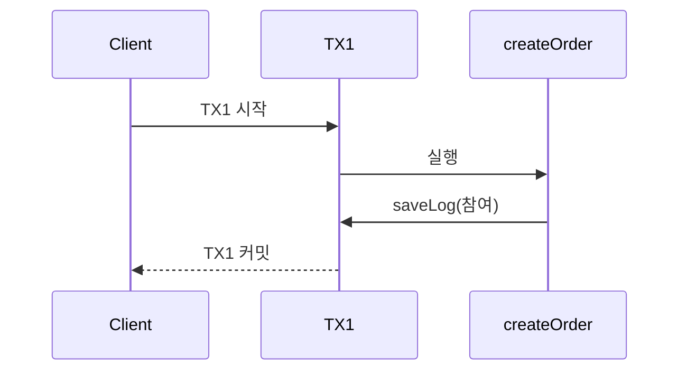

## 1. 선언적 트랜잭션 (@Transactional)

Spring은 두 가지 트랜잭션 관리 방식을 제공한다.

| 방식 | 설명 | 실무 사용 |
|------|------|---------|
| 프로그래밍 방식 | `TransactionTemplate`, `PlatformTransactionManager` 직접 사용 | 거의 사용 안 함 |
| 선언적 방식 | `@Transactional` | 표준 |

> **비유**: `@Transactional`은 문서 계약서와 같다. "이 블록 안에서 일어나는 모든 DB 작업은 하나로 묶어라. 뭔가 잘못되면 전부 없던 일로 해라"라고 Spring에게 위임하는 것이다.

### @Transactional 기본 사용

```java
@Service
public class OrderService {

    @Transactional(readOnly = true)
    public Order findOrder(Long id) {
        return orderRepository.findById(id).orElseThrow();
    }

    @Transactional
    public Order createOrder(OrderDto dto) {
        Order order = new Order(dto);
        return orderRepository.save(order);
    }
}
```

클래스 레벨에 붙이면 모든 public 메서드에 적용되고, 메서드 레벨이 클래스 레벨보다 우선순위가 높다.

### @Transactional 주요 속성

```java
@Transactional(
    propagation = Propagation.REQUIRED,        // 전파 속성 (기본값)
    isolation = Isolation.DEFAULT,             // 격리 수준 (기본값: DB 설정 따름)
    timeout = 30,                              // 타임아웃 (초)
    readOnly = false,                          // 읽기 전용 여부
    rollbackFor = Exception.class,             // 이 예외 시 롤백
    noRollbackFor = BusinessException.class    // 이 예외는 롤백 안 함
)
public void someMethod() { ... }
```

### readOnly = true 의미

`readOnly = true`는 단순한 힌트 이상의 효과를 가진다.

- **JPA**: 영속성 컨텍스트의 변경 감지(Dirty Checking) 비활성화 → 스냅샷 저장 안 함 → 성능 향상
- **DB**: 일부 DB는 읽기 전용 트랜잭션을 최적화 처리 (MySQL: 잠금 없이 처리)
- **명시적 의도**: 코드를 읽는 사람에게 "이 메서드는 데이터를 변경하지 않는다"는 의도를 전달

조회 메서드에는 항상 `readOnly = true`를 붙이는 것을 권장한다.

---

## 2. 트랜잭션 프록시 동작 원리

`@Transactional`은 Spring AOP를 기반으로 동작한다. 개발자가 어노테이션을 붙이면 Spring은 해당 Bean을 프록시로 감싼다. 클라이언트가 메서드를 호출하면 프록시의 `TransactionInterceptor`가 먼저 개입한다.

1️⃣ **트랜잭션 시작**: `PlatformTransactionManager.getTransaction()` 호출
2️⃣ **실제 메서드 실행**: `joinPoint.proceed()` — 같은 커넥션으로 DB 작업 수행
3️⃣ **커밋 또는 롤백**: 정상 반환이면 커밋, `rollbackFor` 조건에 맞는 예외이면 롤백

```mermaid
graph LR
    C["Client"] -->|createOrder| P["TxProxy"]
  ..|getTransaction| P
    P -->|실행| S["Service"]
  ..|정상| OK["commit"]
  ..|예외| RB["rollback"]
```

### PlatformTransactionManager

Spring의 트랜잭션 추상화 인터페이스다. 기술에 따라 구현체가 자동으로 선택된다.

| 기술 | 구현체 |
|------|-------|
| JDBC | `DataSourceTransactionManager` |
| JPA | `JpaTransactionManager` |
| JTA (분산 TX) | `JtaTransactionManager` |

Spring Boot는 JPA 사용 시 자동으로 `JpaTransactionManager`를 등록한다.

### 트랜잭션 동기화

같은 트랜잭션 내에서 같은 DB 커넥션을 사용하기 위해 `TransactionSynchronizationManager`가 **ThreadLocal**로 커넥션을 관리한다. 덕분에 `OrderService`와 `LogService`가 서로 다른 클래스이더라도 같은 트랜잭션 내에서는 같은 커넥션을 공유한다.

```mermaid
graph LR
    TLA["Thread A: ThreadLo"] --> OSA["OrderService.save("]
    TLA --> LSA["LogService.save()"]
    OSA -->|"같은 TX"| C1[("Connection..|"같은 TX"| C1
    TLB["Thr..|"독립 TX"| C2[("Connection2")]
```

---

## 3. 전파 속성 (Propagation)

전파 속성은 **이미 트랜잭션이 진행 중일 때 새로운 트랜잭션 메서드를 호출하면 어떻게 처리할지** 결정한다.

### REQUIRED (기본값)

부모 트랜잭션이 있으면 참여하고, 없으면 새로 생성한다. 가장 자주 사용된다.



**주의**: 자식(saveLog)에서 예외가 발생하면 부모(createOrder) TX도 롤백 마킹된다.

### REQUIRES_NEW

항상 새로운 독립 트랜잭션을 생성한다. 부모 트랜잭션이 있으면 일시 중단한다.

```java
@Transactional
public void createOrder(OrderDto dto) {
    orderRepository.save(new Order(dto));
    logService.saveLog("주문 생성");
    // saveLog가 실패해도 createOrder는 커밋 가능
}

@Transactional(propagation = Propagation.REQUIRES_NEW)
public void saveLog(String message) {
    // TX1과 완전히 독립된 TX2
    logRepository.save(new Log(message));
}
```

**용도**: 로그 저장처럼 주 트랜잭션 결과와 무관하게 반드시 저장해야 하는 경우다.

### NESTED

Savepoint를 활용해 중첩 트랜잭션을 만든다. 자식 실패 시 자식만 Savepoint까지 롤백하고, 부모는 계속 진행할 수 있다.

**REQUIRES_NEW vs NESTED**:
- REQUIRES_NEW: 물리적으로 다른 DB 커넥션 사용
- NESTED: 같은 커넥션, Savepoint 활용 (JDBC에서만 지원, JPA와 잘 안 맞음)

### 전파 속성 정리표

| 속성 | 부모 TX 있음 | 부모 TX 없음 |
|------|------------|------------|
| REQUIRED | 참여 | 새로 생성 |
| REQUIRES_NEW | 부모 중단, 새로 생성 | 새로 생성 |
| NESTED | 중첩 TX (Savepoint) | 새로 생성 |
| SUPPORTS | 참여 | TX 없이 실행 |
| NOT_SUPPORTED | 부모 중단, TX 없이 실행 | TX 없이 실행 |
| NEVER | 예외 | TX 없이 실행 |
| MANDATORY | 참여 | 예외 |

---

## 4. 격리 수준 (Isolation Level)

격리 수준은 **동시에 여러 트랜잭션이 실행될 때 데이터 정합성을 어떻게 보장할지** 결정한다.

### 발생 가능한 문제

**Dirty Read**: TX1이 수정 중(미커밋)인 데이터를 TX2가 읽는다. TX1이 롤백하면 TX2는 존재하지 않는 데이터를 읽은 것이 된다.

**Non-Repeatable Read**: 같은 TX 내에서 같은 쿼리를 두 번 실행하면 결과가 다르다. TX2가 그 사이에 UPDATE를 커밋했기 때문이다.

**Phantom Read**: 같은 TX 내에서 같은 조건으로 조회 시 행의 수가 달라진다. TX2가 그 사이에 INSERT를 커밋했기 때문이다.

### 격리 수준별 허용 문제

| 격리 수준 | Dirty Read | Non-Repeatable Read | Phantom Read |
|---------|-----------|---------------------|-------------|
| READ_UNCOMMITTED | 허용 | 허용 | 허용 |
| READ_COMMITTED | 방지 | 허용 | 허용 |
| REPEATABLE_READ | 방지 | 방지 | 허용 |
| SERIALIZABLE | 방지 | 방지 | 방지 |

격리 수준이 높을수록 정합성이 높지만 성능이 낮아진다. 잠금이 많아지고 동시 처리량이 줄어들기 때문이다.

**실무**: 대부분 `DEFAULT`(DB 기본값)를 사용한다. MySQL InnoDB는 기본값이 `REPEATABLE_READ`이며, MVCC로 Phantom Read도 대부분 방지한다.

---

## 5. 롤백 규칙

### 기본 규칙

Spring의 롤백 기본 규칙은 Java의 예외 분류를 따른다.

```
Unchecked Exception (RuntimeException, Error) → 자동 롤백
Checked Exception (Exception)                 → 자동 커밋 (롤백 안 됨!)
```

이 규칙을 모르면 심각한 버그가 발생한다. `IOException`을 던졌는데 DB에는 저장됐다면 바로 이 규칙 때문이다.

```java
@Transactional
public void createOrder() throws IOException {
    orderRepository.save(order);
    throw new IOException("파일 오류");  // Checked → 커밋됨!
}
```

### 커스텀 롤백 설정

```java
// Checked Exception도 롤백
@Transactional(rollbackFor = Exception.class)
public void createOrder() throws IOException {
    orderRepository.save(order);
    throw new IOException("이제 롤백됨");
}

// 특정 예외는 롤백 안 함
@Transactional(noRollbackFor = BusinessException.class)
public void createOrder() {
    orderRepository.save(order);
    throw new BusinessException("커밋됨");
}
```

---

## 6. 주의사항

### private 메서드

```java
@Service
public class OrderService {

    @Transactional  // 동작 안 함!
    private void createOrder() {
        // AOP 프록시는 private 메서드 오버라이드 불가
    }
}
```

### Self-invocation (내부 호출)

```java
@Service
public class OrderService {

    public void process() {
        createOrder();  // this.createOrder() → 프록시 우회!
    }

    @Transactional
    public void createOrder() { ... }
}
```

**해결**: 별도 Bean으로 분리한다.

### 예외 처리 주의

```java
@Transactional
public void createOrder() {
    try {
        orderRepository.save(order);
        throw new RuntimeException("오류");
    } catch (Exception e) {
        log.error("오류 발생", e);
        // 예외를 잡아서 처리 → 트랜잭션은 커밋됨!
    }
}
```

예외를 내부에서 흡수하면 `@Transactional`이 예외를 감지하지 못해 커밋된다. 롤백이 필요하다면 예외를 다시 던지거나 명시적으로 롤백을 마킹해야 한다.

```java
@Transactional
public void createOrder() {
    try {
        orderRepository.save(order);
        throw new RuntimeException("오류");
    } catch (Exception e) {
        log.error("오류 발생", e);
        TransactionAspectSupport.currentTransactionStatus().setRollbackOnly();
    }
}
```

---


## 극한 시나리오

### 시나리오 1: REQUIRED 중첩 — UnexpectedRollbackException

```java
@Transactional  // REQUIRED (기본)
public void parentMethod() {
    orderRepository.save(order);
    try {
        childService.childMethod(); // REQUIRED → 같은 트랜잭션
    } catch (Exception e) {
        log.warn("잡았으니 괜찮겠지?");  // ← 함정!
    }
    // 여기까지 도달해도...
}

@Transactional
public void childMethod() {
    throw new RuntimeException("자식 폭탄");
}
```

**결과**: `UnexpectedRollbackException` 발생!
- 자식이 같은 트랜잭션에 rollback-only 마킹했다
- 부모가 catch 해도 이미 트랜잭션은 오염됐다
- 커밋 시점에 `UnexpectedRollbackException`이 터진다

> **비유**: 한 명이라도 코로나 걸리면 같은 방 사람 전원 격리. catch로 해결 안 된다.

**가장 흔한 실수**다. 해결책은 `REQUIRES_NEW`로 자식을 분리하는 것이다.

### 시나리오 2: REQUIRES_NEW — 부모 롤백 시 자식은?

```java
@Transactional
public void parentMethod() {
    orderRepository.save(order);         // order 저장
    childService.childMethod();          // REQUIRES_NEW, 별도 커밋
    throw new RuntimeException("부모 실패");  // 부모 롤백
}

@Transactional(propagation = Propagation.REQUIRES_NEW)
public void childMethod() {
    paymentRepository.save(payment);     // 별도 트랜잭션으로 커밋됨
}
```

**결과**:
- 부모(order): 롤백
- 자식(payment): **커밋됨** (별도 커넥션이므로)

**위험**: 주문은 취소됐는데 결제는 된 상태 → 보상 트랜잭션 필요

### 시나리오 3: 긴 트랜잭션 — DB 커넥션 고갈

```java
@Transactional
public void heavyProcess() {
    List<Order> orders = orderRepository.findAll(); // 10만 건

    for (Order order : orders) {
        externalApiClient.call(order); // 외부 API 호출 (1초)
        order.setStatus("PROCESSED");
    }
    // 10만 초 = 27시간 동안 커넥션 점유!
}
```

> **비유**: 화장실 1개인데 1명이 27시간 점유. 다른 사람 전부 대기.

**증상**: 커넥션 풀 고갈 → 다른 요청 전부 타임아웃

**해결**:
- 외부 API 호출은 트랜잭션 밖으로 꺼낸다
- 배치 단위로 쪼갠다 (100건씩)
- `@Transactional` 범위를 최소화한다

### 시나리오 4: Checked Exception — 롤백 안 되는 함정

```java
@Transactional
public void transfer() throws InsufficientFundsException {
    accountRepository.debit(fromAccount, amount);  // 출금

    if (balance < 0) {
        throw new InsufficientFundsException(); // Checked!
    }

    accountRepository.credit(toAccount, amount);   // 입금
}
```

**결과**: debit은 **커밋됨**! 출금만 되고 입금이 안 됐다.

**해결**: `@Transactional(rollbackFor = Exception.class)` 또는 `RuntimeException`을 상속한 예외를 사용한다.

---
## @Transactional만 붙이면 안전하다는 착각

`@Transactional`을 붙였으니 이제 트랜잭션이 보장된다고 믿는 순간, 조용히 데이터가 깨지기 시작한다.

**함정 1: private 메서드 — 트랜잭션이 아예 걸리지 않는다**

```java
@Service
public class OrderService {

    // @Transactional을 붙여도 동작하지 않는다
    @Transactional
    private void createOrderInternal() {
        orderRepository.save(order);
        throw new RuntimeException("오류");
        // 프록시는 private 메서드를 오버라이드할 수 없으므로
        // 트랜잭션이 적용되지 않는다. 예외가 터져도 롤백 없이 저장됨.
    }
}
```

**함정 2: 내부 호출(self-invocation) — 프록시를 우회한다**

```java
@Service
public class OrderService {

    public void process() {
        createOrder();  // this.createOrder() → 프록시를 거치지 않음
        // @Transactional이 붙어 있어도 트랜잭션이 시작되지 않는다
    }

    @Transactional
    public void createOrder() {
        orderRepository.save(order);
        throw new RuntimeException("오류");
        // 롤백되지 않는다. 저장이 그대로 커밋됨.
    }
}
// 해결: createOrder()를 별도 Bean으로 분리
```

**함정 3: checked exception — 기본적으로 롤백되지 않는다**

```java
@Transactional  // rollbackFor 없음
public void transfer() throws InsufficientFundsException {
    accountRepository.debit(fromAccount, amount);   // 출금 완료

    if (balance < 0) {
        throw new InsufficientFundsException();     // Checked Exception!
    }
    // InsufficientFundsException은 RuntimeException이 아니므로 롤백 안 됨
    // 출금만 되고 입금 안 된 채로 커밋됨 → 돈이 사라짐
}

// 반드시 명시해야 한다
@Transactional(rollbackFor = Exception.class)
public void transfer() throws InsufficientFundsException { ... }
```

**최종 방어선: 통합 테스트에서 롤백 여부를 반드시 확인한다**

```java
@SpringBootTest
@Transactional  // 테스트 후 자동 롤백
class OrderServiceIntegrationTest {

    @Test
    void 예외_발생_시_저장_안_됨() {
        assertThatThrownBy(() -> orderService.createOrder(invalidRequest))
            .isInstanceOf(RuntimeException.class);

        // 실제로 DB에 저장되지 않았는지 확인
        // 이 검증이 없으면 트랜잭션이 동작 안 해도 테스트가 통과됨
        assertThat(orderRepository.count()).isEqualTo(0);
    }

    @Test
    void checked_예외는_rollbackFor_없으면_커밋됨() {
        // 이 테스트가 실패해야 문제를 인지할 수 있다
        assertThatThrownBy(() -> orderService.transfer(request))
            .isInstanceOf(InsufficientFundsException.class);

        // rollbackFor 없으면 출금 레코드가 남아있다
        assertThat(accountRepository.findBalance(fromAccount)).isLessThan(0);
    }
}
```

`@Transactional`은 선언만으로 완성되지 않는다. private 메서드 여부, 호출 경로, 예외 타입을 모두 검토하고, 통합 테스트로 실제 롤백을 확인해야 한다. 단위 테스트는 프록시를 거치지 않으므로 트랜잭션 문제를 잡지 못한다.

---

## 정리

| 개념 | 핵심 |
|------|------|
| 선언적 트랜잭션 | `@Transactional` = AOP 기반 트랜잭션 관리 |
| readOnly | DirtyChecking 비활성화, 성능 향상 |
| REQUIRED | 기본값. 있으면 참여, 없으면 생성 |
| REQUIRES_NEW | 항상 새 TX. 독립적 커밋/롤백 |
| NESTED | Savepoint 기반 중첩 TX |
| Unchecked 예외 | 자동 롤백 |
| Checked 예외 | 기본 커밋 (rollbackFor 설정 필요) |
| Self-invocation | 프록시 우회 → TX 미적용 |
| private 메서드 | AOP 미적용 → TX 동작 안 함 |
| 긴 트랜잭션 | 커넥션 점유 → 풀 고갈 위험 |

---

## 왜 이 기술인가?

| 방식 | 코드 오염 | AOP 지원 | 유연성 | 적합한 상황 |
|---|---|---|---|---|
| JDBC 수동 트랜잭션 | 높음 | X | 낮음 | 트랜잭션 세밀 제어 필요 |
| `TransactionTemplate` | 중간 | X | 높음 | 프로그래밍 방식 제어 |
| `@Transactional` | 없음 | O | 중간 | 실무 표준, 선언적 방식 |
| JTA (분산 트랜잭션) | 낮음 | O | 높음 | 다중 DB, XA 트랜잭션 |

**결론:** `@Transactional`은 비즈니스 로직에서 트랜잭션 관리 코드를 완전히 분리하는 Spring의 표준 방식이다. Propagation과 Isolation을 정확히 이해하고 사용하지 않으면 데이터 불일치나 교착상태가 발생한다.

---

## 실무에서 자주 하는 실수

1. **`@Transactional` self-invocation 문제** — 같은 클래스의 메서드를 내부에서 호출하면 AOP 프록시를 우회해 트랜잭션이 적용되지 않는다. `orderService.createOrder()`에서 `this.sendNotification()`을 호출하면 `sendNotification()`의 `@Transactional`이 무시된다. 반드시 별도 빈으로 분리해야 한다.

2. **`checked exception`에서 롤백 미발생** — `@Transactional`의 기본 설정은 `RuntimeException`과 `Error`에만 롤백된다. `SQLException` 같은 checked exception은 기본적으로 롤백되지 않는다. `@Transactional(rollbackFor = Exception.class)`를 명시해야 한다.

3. **`REQUIRES_NEW`로 인한 데드락** — 부모 트랜잭션이 잠금을 보유한 채 `REQUIRES_NEW`로 새 트랜잭션을 열면, 새 트랜잭션이 같은 행에 접근할 때 데드락이 발생한다. `REQUIRES_NEW`는 반드시 다른 테이블이나 독립된 데이터를 다룰 때만 사용해야 한다.

4. **`readOnly = true` 미설정으로 인한 성능 손실** — 조회 전용 메서드에 `readOnly = true`를 설정하지 않으면 JPA는 스냅샷을 생성해 Dirty Checking을 수행한다. `readOnly = true`로 설정하면 스냅샷 생성을 건너뛰어 메모리와 성능이 개선된다.

5. **트랜잭션 밖에서 Lazy Loading 시도** — `@Transactional` 메서드 밖에서 JPA 엔티티의 지연 로딩(Lazy) 프록시에 접근하면 `LazyInitializationException`이 발생한다. 서비스 레이어에서 필요한 데이터를 모두 로드하거나, Fetch Join으로 즉시 로딩해야 한다.

---

## 면접 포인트

**Q1. `@Transactional` Propagation의 REQUIRED vs REQUIRES_NEW 차이는?**
> REQUIRED(기본값): 기존 트랜잭션이 있으면 참여하고, 없으면 새로 생성. 부모와 자식이 같은 트랜잭션을 공유해 하나가 롤백되면 모두 롤백. REQUIRES_NEW: 항상 새 트랜잭션 생성, 부모 트랜잭션을 일시 중단. 부모 롤백과 무관하게 자식 커밋 가능. 감사 로그처럼 메인 트랜잭션 실패와 무관하게 저장해야 할 때 사용.

**Q2. 트랜잭션 격리 수준 4가지와 발생 가능한 문제는?**
> READ_UNCOMMITTED: Dirty Read 가능. READ_COMMITTED(기본, Oracle): Dirty Read 방지, Non-Repeatable Read 가능. REPEATABLE_READ(기본, MySQL): Non-Repeatable Read 방지, Phantom Read 가능. SERIALIZABLE: 모든 문제 방지, 성능 최저. 실무에서는 DB 기본값(MySQL: REPEATABLE_READ)을 사용하고, 특수한 경우에만 조정한다.

**Q3. `@Transactional`이 동작하는 원리는?**
> Spring AOP 프록시를 통해 동작한다. `@Transactional`이 붙은 빈을 주입받으면 실제 빈이 아닌 프록시가 주입된다. 메서드 호출 시 프록시가 트랜잭션 시작 → 실제 메서드 실행 → 커밋/롤백 순서로 처리한다. `private` 메서드나 self-invocation에서는 프록시를 거치지 않아 동작하지 않는다.

**Q4. NESTED 전파 옵션은 언제 사용하는가?**
> 중간 저장점(savepoint)을 만들어 내부 트랜잭션만 롤백 가능하다. 부모 트랜잭션이 커밋되면 함께 커밋되고, 부모가 롤백되면 함께 롤백된다. 부분 롤백이 필요한 배치 처리에서 유용하다. JDBC `Savepoint`를 지원하는 DB에서만 사용 가능하다(JPA에서는 제한적).

**Q5. `@Transactional`을 서비스 레이어에 두어야 하는 이유는?**
> 컨트롤러에 두면 MVC 계층이 DB 트랜잭션에 의존하게 되어 계층 분리가 깨진다. 리포지토리에 두면 여러 리포지토리 메서드를 하나의 트랜잭션으로 묶기 어렵다. 서비스 레이어가 비즈니스 단위의 원자성을 정의하는 적절한 위치다.
